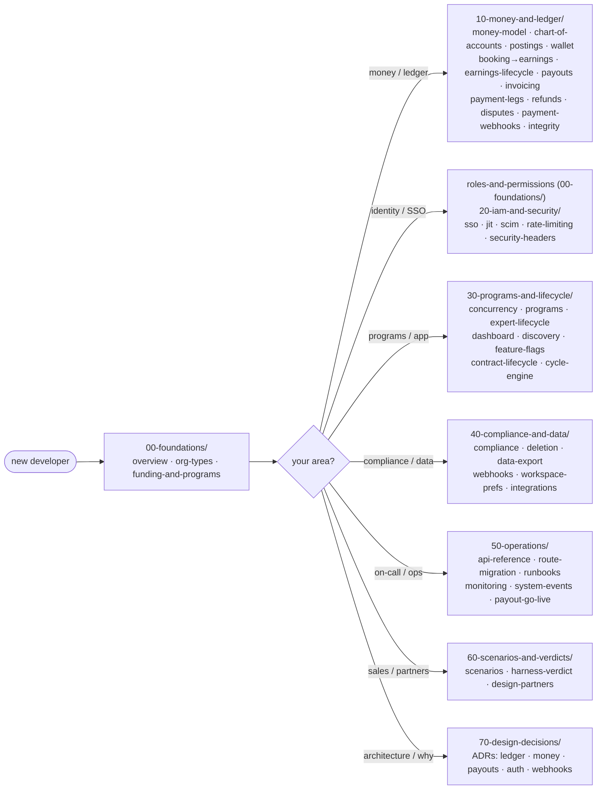

# Familiarise Enterprise — documentation

The **enterprise layer** is a capability-driven B2B surface on top of the marketplace: organizations sponsor and/or host, fund sessions through wallets, invoices, or licenses, run programs with seat or credit caps, and settle money through a double-entry ledger. This folder is the engineer's map of that layer. The **banded folders** are written to be read **in order, as one continuous story**, with each band building on the last: `00-foundations/` → `10-money-and-ledger/` → `20-iam-and-security/` → `30-programs-and-lifecycle/` → `40-compliance-and-data/` → `50-operations/` → `60-scenarios-and-verdicts/`. Two bands sit outside the story line: `70-design-decisions/` collects the architecture decision records that explain *why* the system is shaped the way it is, and `90-audits/` is the annex of audit artifacts. [`explainers/complete-guide`](explainers/complete-guide.md) is the parallel connective narrative that walks every concept end to end.

> **New here?** Read the [overview](00-foundations/01-overview.md) for the system shape, then the [complete guide](explainers/complete-guide.md) for the end-to-end narrative. For money specifically, start at [money-model-overview](10-money-and-ledger/01-money-model-overview.md) and walk the `10-money-and-ledger/` band in order. If you want a curated path matched to your experience level, use the [reading paths](#reading-paths-by-level) below.

---

## How to read this

The flowchart below routes you from "new developer" to the band that owns your area. Every path assumes you have read the foundations band first.



---

## Reading paths by level

The bands are one source of truth — these paths are navigation, not copies. Each path includes everything from the previous one, so an SDE3 is expected to have covered the SDE2 list. Every doc carries an `audience:` tag in its frontmatter stating the lowest level for whom it is primary reading; nothing stops an SDE1 from reading an `sde4` doc, but the paths below are the order that builds context without forward references.

### SDE1 — ship a feature without breaking money

This path gives you the system shape, the role model, and just enough of the money model to know what you must not touch casually.

1. [overview](00-foundations/01-overview.md) — read the "anatomy of one booking" sequence diagram twice; it is the spine every other doc hangs detail off.
2. [organization-types](00-foundations/02-organization-types.md) — the two booleans (`canSponsor`/`canHost`) that define every org.
3. [roles-and-permissions](00-foundations/04-roles-and-permissions.md) — the `MemberRole` ladder that gates every API route and dashboard page.
4. [money-model-overview](10-money-and-ledger/01-money-model-overview.md) — the three money rules (integer paise, balanced transactions, derived balances). You do not need the rest of the band yet.
5. [dashboard-pages](30-programs-and-lifecycle/04-dashboard-pages.md) — what each org dashboard page shows, per role.
6. [api-reference](50-operations/01-api-reference.md) — keep this open as a reference while you work; do not read it cover to cover.

### SDE2 — own a subsystem

This path makes you productive inside any one band and safe at its boundaries with the others.

1. Everything in the SDE1 path.
2. All of [`10-money-and-ledger/`](10-money-and-ledger/01-money-model-overview.md) in order — the money story only makes sense read front to back.
3. All of [`20-iam-and-security/`](20-iam-and-security/01-sso-and-authentication.md) — SSO, JIT, SCIM, rate limiting, headers.
4. All of [`30-programs-and-lifecycle/`](30-programs-and-lifecycle/01-concurrency-and-idempotency.md) — programs are where the commercial terms live.
5. [compliance map](40-compliance-and-data/01-compliance-dpdp-gst-tds-msme.md), [deletion-policy](40-compliance-and-data/02-deletion-policy.md), [data-export](40-compliance-and-data/03-data-export.md), and [outbound-webhooks](40-compliance-and-data/04-outbound-webhooks.md).
6. Re-read [concurrency-and-idempotency](30-programs-and-lifecycle/01-concurrency-and-idempotency.md) after the money band — the idempotency keys will mean more the second time.

### SDE3 — design changes and review them

This path adds the *why* behind the design and the integrity machinery you must preserve when changing it.

1. Everything in the SDE2 path.
2. All of [`70-design-decisions/`](70-design-decisions/00-README.md) — the ADRs; read these before proposing structural changes.
3. [cross-cutting-integrations](40-compliance-and-data/06-cross-cutting-integrations.md) — the wired/partial/skipped map of all eight subsystems.
4. [ledger-integrity](10-money-and-ledger/13-ledger-integrity.md) — the nightly reconciler and the invariants your change must not break.
5. [monitoring](50-operations/04-monitoring.md) and [system-events](50-operations/05-system-events.md) — how a change announces itself in production.
6. [subsystem-checklist](90-audits/02-subsystem-checklist.md) and [verification-guide](90-audits/03-verification-guide.md) — how shipped work gets verified here.

### SDE4 — architecture and regulatory sign-off

This path covers the whole surface, the audit history, and the regulatory rails the money flows must satisfy.

1. Everything in the SDE3 path.
2. [complete-guide](explainers/complete-guide.md) — the full narrative, front to back.
3. [compliance map](40-compliance-and-data/01-compliance-dpdp-gst-tds-msme.md) together with the authoritative rule set in [`docs/compliance/`](../compliance/00-overview.md).
4. [live-payout-go-live-runbook](50-operations/06-live-payout-go-live-runbook.md) — the one flag flip with real-money consequences.
5. All of [`60-scenarios-and-verdicts/`](60-scenarios-and-verdicts/01-scenarios-and-examples.md) — the worked scenarios and the honest ✅/🟡/🔴 verdict grid.
6. [readiness-audit](90-audits/01-readiness-audit.md) and [simplification-proposal](90-audits/04-simplification-proposal.md) — where the system stands and what could be cut.

---

## Section map

The table below lists every band in reading order, with the documents each one contains.

| Band folder | Section | Docs |
| --- | --- | --- |
| `00-foundations/` | **Foundations** | overview, org types, funding & programs, roles, lifecycle, hierarchy |
| `10-money-and-ledger/` | **Money & ledger** | money model, chart of accounts, postings, wallet, booking→earnings, earnings lifecycle, payouts, invoicing, payment legs, refunds, disputes, payment webhooks, integrity |
| `20-iam-and-security/` | **IAM / SSO / security** | SSO, JIT, SCIM, rate-limiting, security headers |
| `30-programs-and-lifecycle/` | **Programs / dashboard / discovery / lifecycle** | concurrency & idempotency, programs, experts, dashboard, discovery, feature flags, contract lifecycle, cycle engine & rollover |
| `40-compliance-and-data/` | **Compliance / integrations / data** | compliance map, deletion, data export, outbound webhooks, workspace prefs, cross-cutting integrations |
| `50-operations/` | **Operations** | API reference, route migration, runbooks, monitoring, system events, live-payout go-live |
| `60-scenarios-and-verdicts/` | **Scenarios / verdict / partners** | worked scenarios, harness verdict, design-partner set |
| `70-design-decisions/` | **Design decisions (ADRs)** | why the ledger, money representation, payouts, auth, and webhook designs are what they are |
| `90-audits/` | **Audit artifacts (annex)** | readiness audit, subsystem checklist, verification guide, simplification proposal, superseded 2026-05-02 production-grade checklist, 2026-06-12 backlog triage + residuals register |

---

## Full index

### Foundations — `00-foundations/`

These six docs define the primitives every other band assumes: what an organization is, who its members are, and how its lifecycle runs.

| # | Doc | Focus |
|---|---|---|
| 01 | [overview](00-foundations/01-overview.md) | system shape, master ER, capability model |
| 02 | [organization-types](00-foundations/02-organization-types.md) | `canSponsor`/`canHost` → BUYER/HOST/HYBRID/INERT |
| 03 | [funding-and-programs](00-foundations/03-funding-and-programs.md) | `FundingSource` enum + program subtypes |
| 04 | [roles-and-permissions](00-foundations/04-roles-and-permissions.md) | `MemberRole` ladder + every API gate |
| 05 | [organization-lifecycle](00-foundations/05-organization-lifecycle.md) | `OrgStatus` + contract/program state machines |
| 06 | [hierarchy](00-foundations/06-hierarchy.md) | `parentOrganizationId`/`rootOrganizationId` (UI deferred) |

### Money & ledger — `10-money-and-ledger/`

This band tells the money story front to back: how value enters (wallet, invoice, card), how it splits into earnings, and how it leaves (payouts), all through one double-entry journal.

| # | Doc | Focus |
|---|---|---|
| 01 | [money-model-overview](10-money-and-ledger/01-money-model-overview.md) | integer paise, double-entry, derived balances, what #772 changed |
| 02 | [chart-of-accounts](10-money-and-ledger/02-chart-of-accounts.md) | the 10 accounts, normal sides, deterministic ids |
| 03 | [ledger-and-postings](10-money-and-ledger/03-ledger-and-postings.md) | `postLedgerTxn`, the balance invariant, every flow's legs |
| 04 | [wallet-and-topups](10-money-and-ledger/04-wallet-and-topups.md) | `WalletTopUp` lifecycle, wallet-as-cache |
| 05 | [booking-to-earnings](10-money-and-ledger/05-booking-to-earnings.md) | booking → earnings → bps split, rate cards |
| 06 | [earnings-lifecycle](10-money-and-ledger/06-earnings-lifecycle.md) | `EarningStatus` machine, holds, `PENDING_TRUST`, refund decrements |
| 07 | [payout-pipeline](10-money-and-ledger/07-payout-pipeline.md) | earnings roll-up → payout, RazorpayX states, TDS/MSME, `ORG_PAYOUT` |
| 08 | [invoicing](10-money-and-ledger/08-invoicing.md) | GST, IRN, PO match, `ORG_RECEIVABLE`, refunds |
| 09 | [payment-legs](10-money-and-ledger/09-payment-legs.md) | stackable funding legs → ledger debits |
| 10 | [refunds](10-money-and-ledger/10-refunds.md) | `applyRefundCascade`, gateway refund mechanics, credit notes |
| 11 | [disputes](10-money-and-ledger/11-disputes.md) | `DisputeStatus` machine, evidence/contest, lost-dispute reversal |
| 12 | [payment-webhooks](10-money-and-ledger/12-payment-webhooks.md) | inbound gateway events, signature verify, idempotency |
| 13 | [ledger-integrity](10-money-and-ledger/13-ledger-integrity.md) | the reconciler: 7 checks + report |

### IAM / SSO / security — `20-iam-and-security/`

These five docs cover how people get into orgs (SSO, JIT, SCIM) and the protective layers around those entry points.

| # | Doc | Focus |
|---|---|---|
| 01 | [sso-and-authentication](20-iam-and-security/01-sso-and-authentication.md) | `OrganizationSSOSettings`, `SsoProvider`, domain claims |
| 02 | [jit-and-session-refresh](20-iam-and-security/02-jit-and-session-refresh.md) | JIT auto-join, `sessionGeneration`, role-change refresh |
| 03 | [scim-provisioning](20-iam-and-security/03-scim-provisioning.md) | SCIM tokens + provisioning |
| 04 | [rate-limiting](20-iam-and-security/04-rate-limiting.md) | coverage matrix; why BetterAuth's limiter is off |
| 05 | [security-headers](20-iam-and-security/05-security-headers.md) | CSP + header posture |

### Programs / dashboard / discovery / lifecycle — `30-programs-and-lifecycle/`

This band holds the commercial logic (programs, contracts, cycles) and the app surfaces that expose it.

| # | Doc | Focus |
|---|---|---|
| 01 | [concurrency-and-idempotency](30-programs-and-lifecycle/01-concurrency-and-idempotency.md) | atomic patterns + every idempotency key |
| 02 | [programs](30-programs-and-lifecycle/02-programs.md) | program / assignment / `BookingUtilization` internals |
| 03 | [expert-lifecycle](30-programs-and-lifecycle/03-expert-lifecycle.md) | expert apply/approve; `PayoutRecipient` |
| 04 | [dashboard-pages](30-programs-and-lifecycle/04-dashboard-pages.md) | every `app/dashboard/organization/[orgId]/**` page |
| 05 | [public-pages-and-discovery](30-programs-and-lifecycle/05-public-pages-and-discovery.md) | org catalog, search, marketplace identity |
| 06 | [feature-flags-and-rollout](30-programs-and-lifecycle/06-feature-flags-and-rollout.md) | `ENABLE_HOST_ORGS` + capability-gated UI |
| 07 | [contract-lifecycle](30-programs-and-lifecycle/07-contract-lifecycle.md) | `Contract` state machine, auto-renew, supersession, end-early guard |
| 08 | [cycle-engine-and-rollover](30-programs-and-lifecycle/08-cycle-engine-and-rollover.md) | `ProgramAssignment` lifecycle, nightly cycle-advance, successor mint |

### Compliance / integrations / data — `40-compliance-and-data/`

These docs map the regulatory rails (DPDP, GST, TDS, MSME) onto the models and crons that implement them, plus the org-facing data plumbing.

| # | Doc | Focus |
|---|---|---|
| 01 | [compliance-dpdp-gst-tds-msme](40-compliance-and-data/01-compliance-dpdp-gst-tds-msme.md) | enterprise touchpoints → `../compliance/*` |
| 02 | [deletion-policy](40-compliance-and-data/02-deletion-policy.md) | erasure, retention, immutable ledger |
| 03 | [data-export](40-compliance-and-data/03-data-export.md) | `OrgDataExportJob` |
| 04 | [outbound-webhooks](40-compliance-and-data/04-outbound-webhooks.md) | `WebhookEndpoint`, delivery, signing |
| 05 | [workspace-preferences](40-compliance-and-data/05-workspace-preferences.md) | `OrgWorkspaceProfile` prefs |
| 06 | [cross-cutting-integrations](40-compliance-and-data/06-cross-cutting-integrations.md) | per-subsystem wired/skipped map |

### Operations — `50-operations/`

This band is the on-call surface: every route, cron, alert, and the one go-live runbook.

| # | Doc | Focus |
|---|---|---|
| 01 | [api-reference](50-operations/01-api-reference.md) | exhaustive route table (roles + audit actions) |
| 02 | [route-migration-table](50-operations/02-route-migration-table.md) | old-route → new-route map |
| 03 | [runbooks](50-operations/03-runbooks.md) | incident response + scheduled tasks |
| 04 | [monitoring](50-operations/04-monitoring.md) | log taxonomy, alerts, dashboards |
| 05 | [system-events](50-operations/05-system-events.md) | system-event / audit-action taxonomy |
| 06 | [live-payout-go-live-runbook](50-operations/06-live-payout-go-live-runbook.md) | flip `ENABLE_LIVE_PAYOUTS` safely (sandbox proof + rollback) |

### Scenarios / verdict / partners — `60-scenarios-and-verdicts/`

These docs validate the system against worked end-to-end examples and state honestly which scenarios are live, partial, or missing.

| # | Doc | Focus |
|---|---|---|
| 01 | [scenarios-and-examples](60-scenarios-and-verdicts/01-scenarios-and-examples.md) | worked end-to-end scenarios |
| 02 | [harness-verdict](60-scenarios-and-verdicts/02-harness-verdict.md) | scenario-by-scenario verdict |
| 03 | [design-partner-customer-set](60-scenarios-and-verdicts/03-design-partner-customer-set.md) | seed cohort / design partners |

### Design decisions — `70-design-decisions/`

This band collects the architecture decision records: each one states a decision the system embodies, the alternatives that were rejected, and the consequences we live with. Start at the [band index](70-design-decisions/00-README.md), which lists every ADR and the format they follow.

### Audit artifacts (annex) — `90-audits/`

These are point-in-time audit artifacts; their `last-reviewed` dates intentionally reflect when each audit was performed, not the latest doc sweep.

| # | Doc | Focus |
|---|---|---|
| 01 | [readiness-audit](90-audits/01-readiness-audit.md) | enterprise readiness audit |
| 02 | [subsystem-checklist](90-audits/02-subsystem-checklist.md) | per-subsystem completeness checklist |
| 03 | [verification-guide](90-audits/03-verification-guide.md) | how to verify the enterprise subsystem |
| 04 | [simplification-proposal](90-audits/04-simplification-proposal.md) | scope-simplification proposal |
| 05 | [production-grade-checklist-2026-05-02](90-audits/05-production-grade-checklist-2026-05-02.md) | superseded 2026-05-02 production-grade checklist |
| 06 | [backlog-triage-2026-06-12](90-audits/06-backlog-triage-2026-06-12.md) | 61-issue backlog triage — dispositions, evidence, and the launch-residuals register |

### The complete guide

One document sits outside the bands and walks the whole system as a single story.

| File | Purpose |
|---|---|
| [explainers/complete-guide](explainers/complete-guide.md) | the single end-to-end narrative walkthrough across every enterprise concept — read it alongside the banded folders above |

---

## Doc conventions: frontmatter

Every document in this tree opens with a YAML frontmatter block. The fields mean the following:

```yaml
---
title: Payout pipeline            # mirrors the H1
band: 10-money-and-ledger         # the band folder slug; "index" for this README and the explainers
audience: sde2                    # sde1 | sde2 | sde3 | sde4 — the lowest level for whom this doc is primary reading
status: live                      # live | partial | designed-not-active
last-reviewed: 2026-06-05         # the date a human last verified this doc's claims against code
---
```

`status: partial` means the doc covers at least one designed-but-not-active surface (these are also flagged 🟡 inline). `status: designed-not-active` means the entire doc describes a surface that is built in schema or docs but not running in production. When you change behavior a doc describes, update the doc and bump its `last-reviewed` date in the same PR.

---

## Ground-truth files

Docs **defer to code** when prose drifts. The load-bearing sources:

- `prisma/schema.prisma` — the schema is the source of truth; docs cite model/field names verbatim.
- `lib/payments/ledger/post.ts` — `postLedgerTxn`, `ledgerAccountId`, `ledgerBalancePaise`.
- `scripts/reconcile/reconcile-ledgers.ts` — the integrity invariants.
- `lib/api/organizations/{wallet,program-helpers,rate-card}.ts` — transactional primitives.
- `lib/enterprise/cycle-engine.ts` — assignment roll-vs-close + successor mint (#779 §A/§B → [cycle-engine-and-rollover](30-programs-and-lifecycle/08-cycle-engine-and-rollover.md)).
- `lib/enterprise/config-lock.ts` — which contract/program term fields freeze once in use (#779 §A → [contract-lifecycle](30-programs-and-lifecycle/07-contract-lifecycle.md)).
- `lib/enterprise/org-activation.ts` — the one org-state model behind the activation checklist + action-required banners (#777 §A / #779 §F); server-side reads split into `org-activation-signals.ts`.
- `lib/enterprise/governance.ts` — `verifiedAt`-gated feature locks (SSO / INVOICE billing / unverified seat cap) (#675/#687).
- `lib/auth/billing-admin-gate.ts` — OWNER-or-`BILLING_ADMIN` disjunction gate for the financial surface.
- `lib/labels/org-labels.ts`, `lib/enterprise/{audit-actions,role-transitions}.ts`, `lib/auth.ts` (the `customSession` hook).

---

## Post-#772 note

> **The double-entry journal (`LedgerTransaction` / `LedgerEntry` / `LedgerAccount`) replaced the three single-entry logs.** `FundingLedgerEntry`, `WalletEntry`, and `SettlementLedgerEntry` (+ `SettlementKind`) are **gone**; `WalletTopUp` carries top-up lifecycle, and balances derive from the journal. Revenue splits are integer **basis points**, not floats. If you find any of those removed names anywhere in this doc set, it's a stale reference — fix it.

## Post-v2 note

> **The v2 mega-audit (#777/#778/#779) was absorbed into these docs on 2026-06-05.** It closed the "silent stuck money / zombie row" gaps: the `Contract` lifecycle (auto-renew, supersede, end-early) → [contract-lifecycle](30-programs-and-lifecycle/07-contract-lifecycle.md); the cycle engine + assignment rollover (nightly cycle-advance, successor mint) → [cycle-engine-and-rollover](30-programs-and-lifecycle/08-cycle-engine-and-rollover.md); the `OverageEvent` system (breaker / surcharge / `CHARGE_MEMBER` timeout); dunning; wallet auto-top-up (**notify-only today** — the cron warns, it does not charge); SSO break-glass; verification resubmit; webhook secret-rotation grace; field-level RBAC on org/contract/program edits; and the IRN payload mapper behind `ENABLE_IRP_UPLOADER`. Refund-driven TDS reversal is now wired via a negative `TDSRecord` (`recordTdsReversal`, #813); the richer `TdsAdjustment` consolidation model remains schema-only. New idempotency anchors: `rolledAt` (cycle mint), `autoRenewedAt` (contract renew), `autoTopUpLastFiredAt` (auto-top-up).

## Conventions

- **Money is integer paise**; splits/percentages are integer **basis points** (`10000 = 100%`).
- **Idempotency keys** are structured: money keys like `booking:<paymentId>`, `topup:<providerOrderId>`, `orgpayout:<payoutId>`; cron claims gate on a stamped timestamp — `rolledAt` (cycle mint), `autoRenewedAt` (contract renew), `autoTopUpLastFiredAt` (auto-top-up) ([concurrency-and-idempotency](30-programs-and-lifecycle/01-concurrency-and-idempotency.md)).
- **Ledger rows are immutable** — corrections are counter-transactions, never edits or deletes.
- **Balances are derived** by summing the journal; the few cached numbers are reconciled nightly.
- **Prose is full sentences** — paragraphs or full-sentence bullets; tables get a sentence lead-in. Terse fragments are reserved for table cells and Mermaid labels.
