# Familiarise Enterprise — The Complete Guide

> **Last refreshed post-#772 (double-entry ledger cutover):** the money model is now a double-entry journal (`LedgerAccount` / `LedgerTransaction` / `LedgerEntry`). The legacy `WalletEntry` / `FundingLedgerEntry` / `SettlementLedgerEntry` rows and the "three-ledger" framing were removed; see Part IV.

> **Purpose:** This is the single consolidated doc for the entire Familiarise Enterprise subsystem — past, present, and planned future. It replaces the need to hop between the banded docs when onboarding, training, or explaining.
>
> **Audience:** Anyone who needs to understand enterprise. Product managers, sales reps, junior developers, senior engineers, support leads, founders, auditors, and onboarding customers.
>
> **Reading strategy:** the doc is intentionally long. Use the Table of Contents to jump. Each Part stands alone; you don't have to read cover-to-cover.
>
> **Other docs:** `docs/enterprise/**` is the canonical source of truth for implementation details. It is organized into **nine banded folders** — the seven story-line bands (`00-foundations/`, `10-money-and-ledger/`, `20-iam-and-security/`, `30-programs-and-lifecycle/`, `40-compliance-and-data/`, `50-operations/`, `60-scenarios-and-verdicts/`) that read in order as one continuous narrative, plus two that sit outside the story line: `70-design-decisions/` (the architecture decision records that explain *why* the system is shaped the way it is) and `90-audits/` (the audit-artifact annex). Every doc carries a five-key frontmatter block (`title`, `band`, `audience`, `status`, `last-reviewed`), so you always know which band a page belongs to and who it is pitched at. This guide is the roadmap **to** those docs. Business folks can stop at Part V. Technical folks can start at Part VI. Reference readers can jump to Part IX.
>
> **How we got here:** for the chronological story of how the subsystem was built — the audit-series journey (#655 → #768 → #772 → #776/#785 → #777/#787 → #779 → docs refresh) — see [Design history](../00-foundations/01-overview.md#design-history).
>
> **Last updated:** 2026-06-05. This revision reconciles the guide with the banded-docs rewrite of the same day. Every band was given a five-key frontmatter block (`title`, `band`, `audience`, `status`, `last-reviewed`) and per-level reading paths. The `10-money-and-ledger/` money band was renumbered and grew to **thirteen docs**, absorbing payouts, refunds, disputes, and inbound payment webhooks out of the old `docs/payments` tree and adding a new earnings-lifecycle doc (the `EarningStatus` machine, including `PENDING_TRUST` and the `HOLD_PERIOD_HOURS` windows). A new `70-design-decisions/` band of twelve ADRs now records *why* the system is shaped the way it is. The compliance layer absorbed a regulatory refresh: the Income-tax Act 2025 in force since 1-Apr-2026 (§393 non-salary TDS, §397(2) no-PAN), the 194-O marketplace rate confirmed at 0.1%, and DPDP operational duties dated to 13 May 2027. The previous milestone was the v2 mega-audit (#777/#778/#779: contract lifecycle, cycle engine, overage/dunning/wallet-floor, field-level RBAC, SSO break-glass, refund/credit-note unification). **Owner:** CEO. **Review cadence:** quarterly or after any schema change.

---

## Table of Contents

**Part I — Foundations (required reading)**
1. How to read this document
2. What is Familiarise Enterprise?
3. The 30-second elevator pitch
4. The three-axis mental model
5. Core terminology cheat sheet

**Part II — The Business Layer**
6. Organization types & capabilities (the four kinds)
7. Billing modes in depth (the four funding patterns)
8. Program types deep dive (the four entitlement shapes)
9. Roles, permissions & governance
10. Real-world business scenarios

**Part III — The User Layer**
11. User journeys & onboarding permutations
12. Common actions by role
13. What users see (role-by-role UX tour)

**Part IV — The Financial Layer**
14. Payment legs & the double-entry ledger
15. Rate cards & revenue splits
16. Settlement, the earnings lifecycle & payouts
17. Refunds, credit notes & disputes

**Part V — The Compliance Layer**
18. DPDP — India's data protection act
19. GST — indirect taxation
20. TDS — tax deducted at source
21. MSME — vendor payment timing
22. FEMA — foreign exchange
23. IRN — e-invoicing

**Part VI — The Technical Layer**
24. Prisma schema overview
25. API route structure & discipline
26. Auth gates & RBAC
27. Transaction patterns & race safety
28. Audit logging
29. Cron jobs & scheduled tasks
30. Webhooks & idempotency

**Part VII — Future Features & Roadmap**
31. Programs v2 — PROJECT (milestone-driven)
32. Programs v2 — RETAINER (hours-committed)
33. RESELL capability (multi-tier marketplaces)
34. AOR / EOR (employer-of-record flows)
35. Multi-currency + international payouts
36. Consolidated invoicing (parent-child)
37. HRIS integration (live sync)
38. Org-scoped notifications

**Part VIII — Operations**
39. Common runbooks
40. Troubleshooting guide
41. Monitoring & alerting

**Part IX — Reference**
42. Complete glossary (A-Z)
43. Schema cheat sheet
44. API cheat sheet
45. Design decisions (ADRs) — and when to read one
46. Related docs index
47. FAQ (40 questions answered)

---
---

# PART I — FOUNDATIONS

## 1. How to read this document

### 1.1 If you're a business person / founder / sales

Read: Parts I, II, V (section 18 — DPDP), VII (roadmap). Skim IX (glossary + FAQ).

Skip: Parts IV, VI, VIII — they're internal financial + technical plumbing.

Time investment: ~45 minutes.

### 1.2 If you're a junior developer new to the codebase

Read in order: Parts I, II, III, IV, VI. Use VII as reference when the product manager says "we're adding PROJECT programs next quarter."

Skip initially: V (compliance will be onboarded by senior engineer when you touch it), VIII (until you're on-call).

Time investment: ~2 hours first pass, then keep as reference.

### 1.3 If you're a support agent / customer success

Read: Parts I, III, VIII. Bookmark IX (FAQ).

Skip: IV, VI.

Time investment: ~1 hour.

### 1.4 If you're an auditor or compliance officer

Read: Parts I, II, V, parts of IV relevant to your audit. Part IX section 45 (related docs).

Time investment: ~2-3 hours.

### 1.5 Relationship to other docs

This doc gives you the holistic mental model. When you need implementation detail, the banded docs in `docs/enterprise/**` have depth:

| Need this depth | Go here |
|---|---|
| Every API route in detail | `docs/enterprise/50-operations/01-api-reference.md` |
| Old → new route migration | `docs/enterprise/50-operations/02-route-migration-table.md` |
| Runbook for specific failure modes | `docs/enterprise/50-operations/03-runbooks.md` |
| Monitoring dashboards | `docs/enterprise/50-operations/04-monitoring.md` |
| Idempotency key design | `docs/enterprise/30-programs-and-lifecycle/01-concurrency-and-idempotency.md` |
| Programs deep-dive | `docs/enterprise/30-programs-and-lifecycle/02-programs.md` |
| Contract lifecycle (renew / supersede / end-early) | `docs/enterprise/30-programs-and-lifecycle/07-contract-lifecycle.md` |
| Cycle engine & assignment rollover | `docs/enterprise/30-programs-and-lifecycle/08-cycle-engine-and-rollover.md` |
| Hierarchy (parent-child orgs) | `docs/enterprise/00-foundations/06-hierarchy.md` |
| Ledger discipline | `docs/enterprise/10-money-and-ledger/03-ledger-and-postings.md` |
| Earnings state machine (incl. `PENDING_TRUST`) | `docs/enterprise/10-money-and-ledger/06-earnings-lifecycle.md` |
| Refund cascade & credit notes | `docs/enterprise/10-money-and-ledger/10-refunds.md` |
| Dispute / chargeback handling | `docs/enterprise/10-money-and-ledger/11-disputes.md` |
| Inbound payment webhooks (signature + idempotency) | `docs/enterprise/10-money-and-ledger/12-payment-webhooks.md` |
| Why a design is the way it is (ADRs) | `docs/enterprise/70-design-decisions/00-README.md` |
| SSO testing | `docs/enterprise/20-iam-and-security/01-sso-and-authentication.md` |

---

## 2. What is Familiarise Enterprise?

### 2.1 In one sentence

Familiarise Enterprise is the **B2B tier** of Familiarise — it lets organizations (companies, educational institutions, training firms) **sponsor, manage, and bill** mentorship sessions on the Familiarise platform, instead of every learner paying individually.

### 2.2 Three concrete examples of who uses it

**Wipro (BUYER org):** Wipro has 200 engineers. Wipro wants all of them to have access to senior-mentor 1:1 sessions for leadership development. Wipro doesn't want each engineer to pay individually and reimburse later. Wipro signs up as an organization, sets up a credit pool (or invoice-monthly arrangement), invites the 200 engineers as LEARNERs, and they book sessions freely.

**LearnPro (PROVIDER / HOST org):** LearnPro is an EdTech company that has 30 in-house senior mentors. LearnPro wants to sell those mentors' time through Familiarise (Familiarise gets audience + tooling; LearnPro provides supply). LearnPro signs up as a HOST org, its 30 mentors join as EXPERT members, revenue gets split 3-ways (platform / LearnPro / mentor).

**IIT Madras (HYBRID org):** IIT Madras has 2,000 students (LEARNERs who consume sessions) AND 100 faculty (EXPERTs who deliver sessions). It runs both sides of the marketplace internally. IIT Madras is HYBRID — it sponsors AND hosts.

### 2.3 Why this matters to the business

Enterprise is 3-5x ACV (annual contract value) compared to B2C. A single Wipro contract can be worth ₹50L/year in commission + seat revenue. Ten enterprise customers can equal a thousand B2C creators.

Enterprise is also **defensive**. Topmate doesn't have an enterprise tier. If Familiarise wins the enterprise market and never makes Topmate's offering, Topmate can't catch up without rebuilding their platform.

---

## 3. The 30-second elevator pitch

> "Familiarise Enterprise lets any company sponsor mentorship for its people, any agency sell its mentors' time, and any institution do both — with one dashboard, one invoice, one compliance stack, and Indian-native billing. 10% commission with UPI settlement, GST-compliant invoices, SSO for security, and credit pools or flat-fee subscriptions depending on how you want to pay."

Use this verbatim on landing pages + sales decks. Four beats: **target (any org), product (one dashboard), differentiation (India-native), flexibility (multiple billing modes)**.

---

## 4. The three-axis mental model

The entire Enterprise subsystem is designed around three orthogonal axes. Internalize this first; everything else falls into place.

### 4.1 The axes

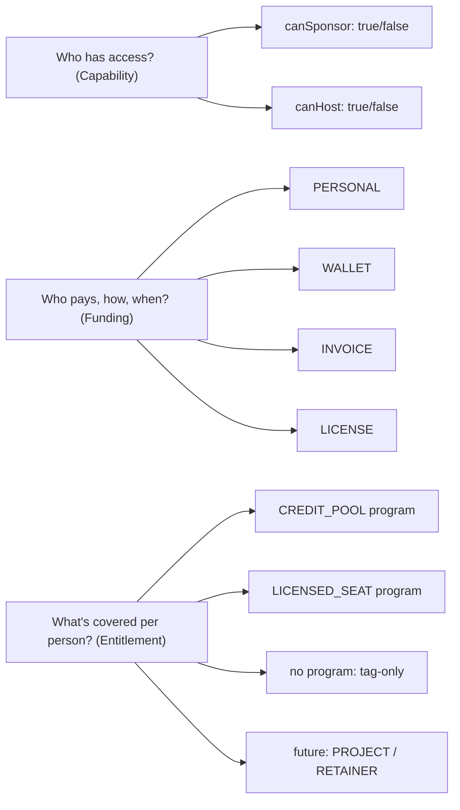

### 4.2 Why three axes?

The old design (pre-Arch-4) pinned every org to one of two enum values for kind (`BUYER`/`PROVIDER`) and one of four enum values for billing mode (`TAG_ONLY`/`SEAT_PACK`/`INVOICED_MONTHLY`/`PREPAID_UNLIMITED`). That was rigid. A real-world org that wanted to sponsor SOME employees via a credit pool and OTHERS via an invoice didn't fit. An org that was both BUYER and PROVIDER (HYBRID) was hacked on.

The three-axis design fixes this. Each axis moves independently:

- An org can switch from PERSONAL to WALLET funding without changing its capability.
- An org can add CREDIT_POOL programs AND LICENSED_SEAT programs at the same time.
- An org can flip from BUYER-only to HYBRID without a schema migration.

### 4.3 How the axes compose

Here are some real permutations:

| Organization | canSponsor | canHost | Funding | Programs | Real-world shape |
|---|---|---|---|---|---|
| Wipro | ✅ | ❌ | WALLET | 1× CREDIT_POOL | Company pre-loads credit pool; engineers book |
| Wipro (alt) | ✅ | ❌ | INVOICE | No program, invoice-accrual | Company pays month-end for whatever was booked |
| Wipro (premium) | ✅ | ❌ | LICENSE | 1× LICENSED_SEAT with unlimited bookings | Company pays flat fee per seat per year |
| LearnPro | ❌ | ✅ | N/A | N/A | Agency that hosts EXPERT mentors; learners pay B2C |
| IIT Madras | ✅ | ✅ | WALLET | 1× CREDIT_POOL | Both sides of marketplace under one roof |
| Freelancer using platform | ❌ | ❌ | N/A | N/A | INERT org — misconfigured or transitional |

### 4.4 Decision tree for "what kind of org am I?"

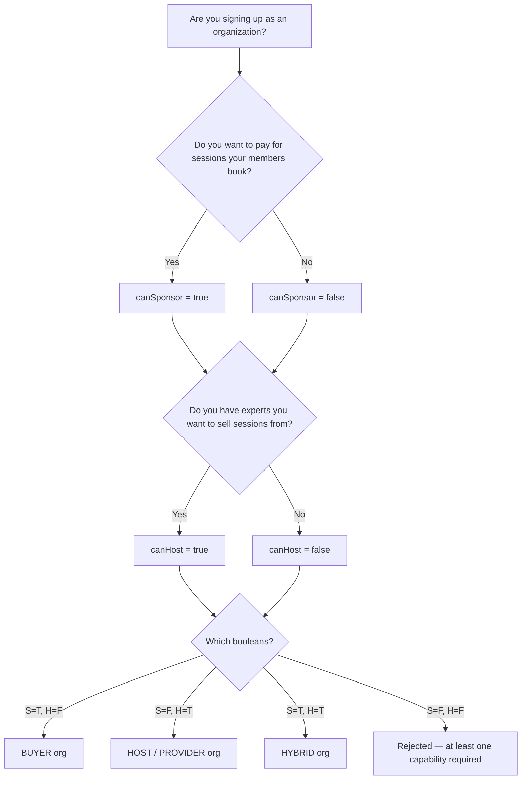

---

## 5. Core terminology cheat sheet

This is a mini-glossary for the terms you'll see everywhere. A full A-Z glossary is in Part IX.

| Term | Meaning |
|---|---|
| **Organization** | The tenant — Wipro, LearnPro, IIT Madras. |
| **Member / Membership** | A person's relationship to an org (distinct from User — a User can have many Memberships in different orgs). |
| **MemberRole** | The role a Member has inside a specific org: OWNER, MAINTAINER, **BILLING_ADMIN**, MANAGER, EXPERT, LEARNER, SUPPORT. **BILLING_ADMIN** (rank 70, between MAINTAINER and MANAGER) is the finance-team side-gate — manages invoices, POs, payouts, rate cards, wallet top-ups, and outbound webhooks, but **cannot** change org status / funding source / members / SSO. See [roles-and-permissions](../00-foundations/04-roles-and-permissions.md). |
| **canSponsor** | Boolean flag: does this org pay for its members' bookings? |
| **canHost** | Boolean flag: does this org host EXPERTs who earn revenue through it? |
| **BillingAccount** | The org's wallet + funding-source record. 1:1 with Organization when `canSponsor=true`. |
| **FundingSource** | How the org pays: PERSONAL / WALLET / INVOICE / LICENSE. Lives on BillingAccount. |
| **Program** | A commercial package describing what members get: CREDIT_POOL (pay-as-you-go), LICENSED_SEAT (flat fee, unlimited). Future: PROJECT, RETAINER. |
| **ProgramAssignment** | "This member is on this program for this period" — per-member entitlement row. |
| **BookingUtilization** | "This booking consumed this much of this program's entitlement" — per-booking attribution. |
| **Contract** | Legal + commercial agreement between the org and the platform. Holds term dates, rate card, billing cadence. |
| **PurchaseOrder (PO)** | The org's internal PO number for an invoice. Enables 3-way match: PO + invoice + receipt. |
| **OrganizationInvoice** | Bill sent to the org (not the learner). For WALLET top-ups, INVOICE accruals, LICENSE renewals. |
| **PaymentLeg** | One component of a Payment's funding: CARD + REFERRAL_CREDIT + WALLET + INVOICE_ACCRUAL + LICENSE. Legs can stack; sum to Payment.amount. |
| **LedgerTransaction / LedgerEntry** | The double-entry money journal (post-#772). Each `LedgerTransaction` carries an `idempotencyKey` and posts balanced `LedgerEntry` legs (DEBIT/CREDIT, positive `amountPaise`) against `LedgerAccount`s. Replaced the old `WalletEntry` / `FundingLedgerEntry` / `SettlementLedgerEntry` rows. |
| **WalletTopUp** | A wallet funding attempt (`providerOrderId` unique; PENDING/CONFIRMED/FAILED). On confirmation it posts a `topup:<orderId>` ledger txn (Dr CASH / Cr WALLET). Replaced the old `WalletEntry`. |
| **RateCard** | The revenue split (platform/org/consultant) applicable to this contract, in integer basis points (`shareBps` / `revenueShareBps`; 10000 = 100%). Versioned with `effectiveFrom` / `effectiveTo`. |
| **OrganizationEarnings** | The org's share of settled sessions (applies to canHost orgs). |
| **OrganizationPayout** | A batch settlement of earnings to the org's bank account. |
| **OrgAuditLog** | Immutable record of every significant mutation on the org (invite sent, member removed, contract signed, etc.). |
| **SSO Provider** | SAML or OIDC identity provider that lets the org's users sign in via their corporate IdP. |
| **Domain Claim** | "This email domain belongs to this org" — enables domain-based auto-join on SSO. |
| **ConsentArtifact** | DPDP-compliant record of a user's consent for data processing. |

---
---

# PART II — THE BUSINESS LAYER

## 6. Organization types & capabilities

This Part is the business view of enterprise: what kinds of organizations exist, how they pay, and what they buy for their people. Before the detail — two flags decide everything an org can do. `canSponsor` means "the org pays for sessions its members book"; `canHost` means "the org has experts who earn money through it." Every org is just a combination of those two.

The four capability kinds — BUYER, HOST, HYBRID, INERT — are determined by the `canSponsor` and `canHost` booleans.

### 6.1 BUYER (canSponsor=true, canHost=false)

**Shape:** A company or institution that **buys mentorship for its people.**

**Real examples:**

- Wipro sponsoring 200 engineers
- IIT Bombay sponsoring 50 placement-prep students
- A startup sponsoring leadership coaching for 10 managers

**What BUYER orgs can do:**

- Create Programs (CREDIT_POOL or LICENSED_SEAT).
- Assign Programs to members.
- Top up wallet OR receive monthly invoices.
- View sponsored-session analytics.

**What BUYER orgs cannot do:**

- Host EXPERT members (those require canHost=true).
- Receive payouts (they pay, not receive).
- Publish a public marketplace page.

**Typical member composition:**

- 1 OWNER (HR head or Head of People Ops)
- 1-3 MAINTAINERs (HR team)
- 0-2 MANAGERs (department leads)
- 0-2 SUPPORT (non-billing admin)
- 10-500 LEARNERs (employees/students)
- 0 EXPERTs (they don't host)

### 6.2 HOST / PROVIDER (canSponsor=false, canHost=true)

**Shape:** An agency or collective that **sells its experts' time.**

**Real examples:**

- LearnPro (30 mentors, 0 learners — they're a supply-side agency)
- A consulting firm like McKinsey selling its consultants' time externally
- A career coaching collective

**What HOST orgs can do:**

- Invite EXPERT members who become Familiarise consultants under the org banner.
- Receive payouts (3-way split: platform / org / consultant).
- Publish a public marketplace page on `/explore/enterprise/organisations`.
- Set a RateCard that governs all their experts' revenue split.

**What HOST orgs cannot do:**

- Create sponsorship Programs (no members to sponsor).
- Have a BillingAccount (no funding source needed).
- Receive invoices (they issue them indirectly via the platform).

**Typical member composition:**

- 1 OWNER (Agency founder)
- 1-2 MAINTAINERs (Agency admins)
- 0-1 MANAGERs
- 5-50 EXPERTs (the mentors)
- 0 LEARNERs
- 0-5 SUPPORT

### 6.3 HYBRID (canSponsor=true, canHost=true)

**Shape:** An organization that **runs both sides** of the marketplace internally.

**Real examples:**

- IIT Madras: faculty (EXPERT) + students (LEARNER) in one org
- A training firm that both has its own mentors AND sponsors sessions for its corporate-client employees
- A company that has in-house coaches (EXPERT) and also sponsors external-mentor sessions for junior staff (LEARNER)

**What HYBRID orgs can do:**

- Everything BUYER can do + everything HOST can do.
- Internal sessions: LEARNER books an EXPERT member; funded by the org's sponsorship; consultant earns via org's 3-way split.

**HYBRID is the most complex permutation.** When a HYBRID org's LEARNER books its own EXPERT, the money flow is essentially intra-org (minus the platform's commission). Revenue share math gets interesting.

### 6.4 INERT (canSponsor=false, canHost=false)

**Shape:** Organization exists but can't DO anything.

**How orgs end up INERT:**

- Misconfiguration during onboarding (server rejects this now via `.refine()` in validation, but schema-level the state is reachable).
- Transitional: admin is about to flip on a capability.
- Soft-deletion intermediate state.

**What INERT orgs can do:** nothing. All sponsor routes 404; all host routes 404.

**Treatment:** alerting fires if an org sits in INERT for > 24 hours.

### 6.5 Capability transition matrix

Rows enumerate every `(canSponsor, canHost)` capability flip an OWNER might attempt, stating whether the API allows it and the preconditions that must be met first — most "why did that return a 409?" questions about org-type changes are answered here.

| From | To | Allowed? | Notes |
|---|---|---|---|
| BUYER | HYBRID | Yes | Flip `canHost=true`. Must go through Program + RateCard setup. |
| BUYER | HOST | **No** | Would delete the BillingAccount; OWNER must confirm explicitly via a special operation. |
| HOST | HYBRID | Yes | Flip `canSponsor=true`. Must create a BillingAccount. |
| HOST | BUYER | **No** | Would orphan existing EXPERT members. OWNER must remove them first. |
| BUYER | INERT | **No** | Blocked by anti-lockout guard. |
| HYBRID | BUYER | Yes (with confirmation) | Requires removing EXPERT members first. |
| HYBRID | HOST | Yes (with confirmation) | Requires closing BillingAccount + refunding any balance. |
| Any | INERT | **No** | Blocked. |

---

## 7. Billing modes in depth

Only BUYER and HYBRID orgs have a billing mode (HOST orgs don't buy, they sell). There are **four** billing modes.

### 7.1 PERSONAL (tag-only)

**What it is:** The org doesn't pay for anything. Members still use their personal cards/UPI. Bookings just carry a tag "this was booked through $OrgName" for reporting / attribution.

**When to use:**

- Pilot phase — org wants to see usage patterns before committing to a budget.
- Social-enterprise orgs that want to track impact without funding.
- Marketing-only relationships.

**Money flow:**

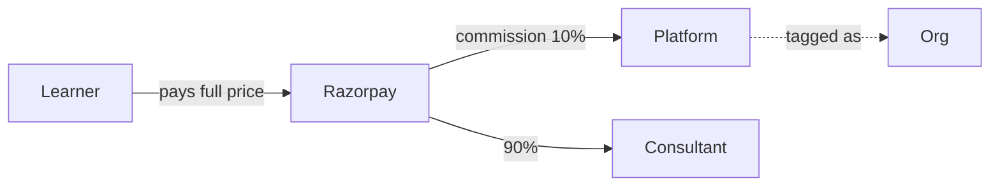

**PaymentLegs written:** 1 leg, `source=CARD`, `amountPaise=full`.

**Example:**

- Wipro pilots Familiarise. 10 engineers opt in voluntarily. Each pays their own ₹999 session. Wipro sees it all in their analytics dashboard but pays nothing.

### 7.2 WALLET (pre-paid credit pool)

**What it is:** The org pre-loads money onto the platform. Each booking debits from that balance. When empty, members can't book until topped up.

**When to use:**

- Org wants cost control (hard cap on spend).
- Usage patterns are variable.
- Finance team wants upfront budget commitment (not post-paid).

**Money flow (top-up):**

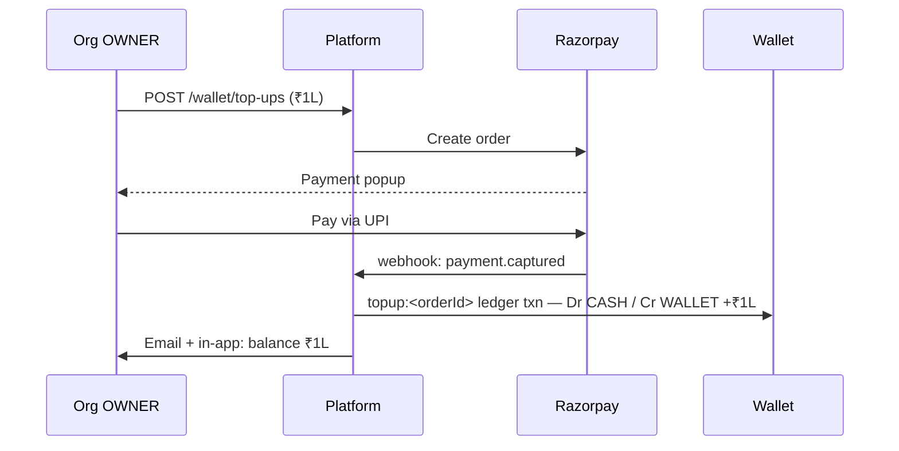

**Money flow (booking):**

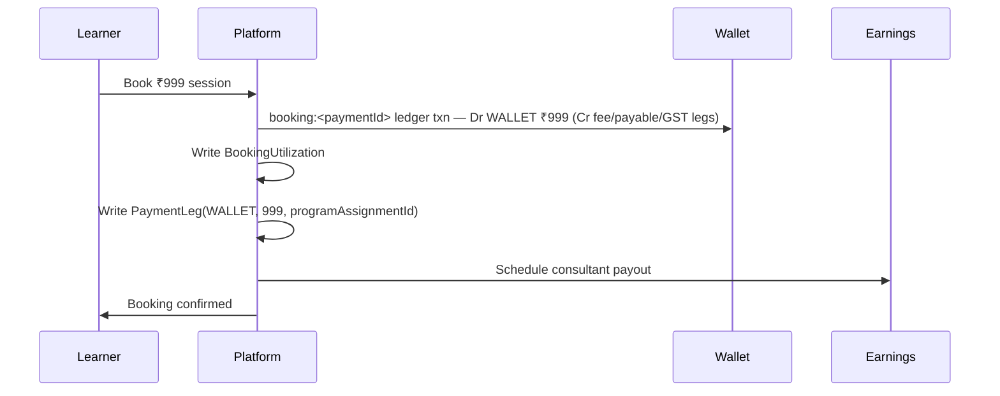

**PaymentLegs written:** 1 leg, `source=WALLET`, `amountPaise=price`.

**Example:**

- Wipro pre-loads ₹5L to its Familiarise wallet. Engineers book sessions freely. Each ₹999 booking debits the wallet. When the wallet hits a low-threshold (configurable, e.g. ₹50K), Wipro's OWNER gets an email asking to top up.

### 7.3 INVOICE (post-paid monthly)

**What it is:** The org signs a contract with a credit limit (e.g. ₹10L). Members book freely. At month-end the platform issues one consolidated invoice. Org pays NET-30 or NET-60.

**When to use:**

- Large enterprises with procurement processes (POs, multiple approval layers).
- Cash-flow management — "pay me at the end of the month, not upfront."
- Tax efficiency — one invoice per month is easier to process.

**Money flow:**

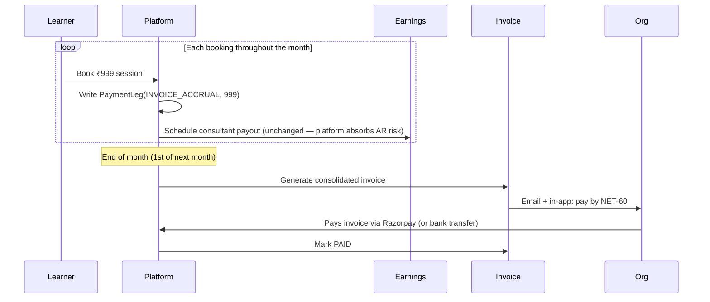

**PaymentLegs written:** 1 leg per booking, `source=INVOICE_ACCRUAL`, `amountPaise=price`. Legs are re-aggregated at month-end into the invoice.

**Example:**

- IIT Madras signs a ₹20L credit-limit contract. Students book sessions throughout the month. On 1st May, invoice is generated for 200 bookings totaling ₹1.5L + GST. IIT Madras pays within 60 days.

### 7.4 LICENSE (flat-fee unlimited)

**What it is:** The org pays a flat monthly/annual fee per seat. Members on that program can book unlimited sessions (up to a configurable soft cap like 4/month) without per-booking billing.

**When to use:**

- Predictable high-volume usage.
- Org wants a simple "per employee per year" cost line.
- HR/Finance prefer a subscription to a usage-based model.

**Money flow:**

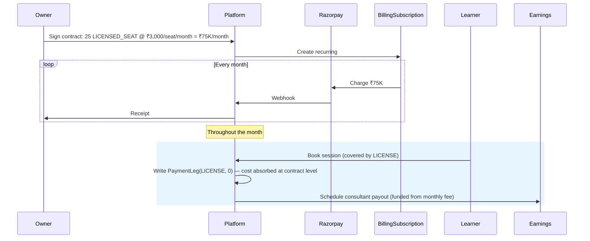

**PaymentLegs written:** 1 leg, `source=LICENSE`, `amountPaise=0` (cost is absorbed at contract level; the leg exists so every Payment has ≥1 leg — reconciliation invariant).

**Example:**

- A startup with 25 engineers signs a ₹75K/month (₹3K/seat) LICENSED_SEAT contract. Engineers book up to 4 sessions/month each. If an engineer tries to book a 5th session that month, they get "cap reached; upgrade tier or wait until next cycle."

### 7.5 Billing mode comparison

Attributes such as cost cap, financial risk, and GST complexity run down the rows while the four `BillingMode` values span the columns, so an account manager can use this as a quick scorecard when matching a prospect to the right mode.

| Dimension | PERSONAL | WALLET | INVOICE | LICENSE |
|---|---|---|---|---|
| Who pays? | Individual members | Org (pre-paid) | Org (post-paid) | Org (subscription) |
| When? | At booking time | Upfront | Month-end | Monthly/annual |
| Cost cap? | None | Wallet balance | Credit limit | Seat × rate |
| Financial risk? | Platform absorbs none | Platform absorbs none (money already in) | Platform absorbs AR risk | Platform absorbs none |
| Simple for org finance? | Best (no invoicing) | Good | Good (one invoice/mo) | Best (predictable) |
| Suitable for pilots? | Yes | Marginal | No | No |
| Suitable for scale? | Poor (reporting fragmentation) | Good | Best | Best |
| GST complexity? | None (learner invoice) | Mid (top-up invoice) | Highest (monthly invoice + PO match) | Mid (subscription invoice) |

### 7.6 Choosing a billing mode (decision tree)

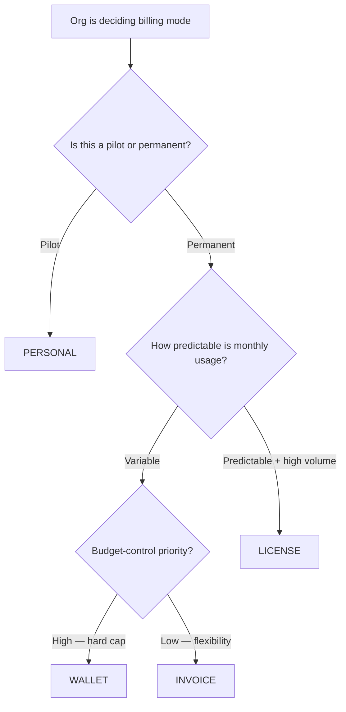

---

## 8. Program types deep dive

A Program is a commercial package describing **what the org has bought for its members.** There are **four** program types in the enum today. Two are shipped, two are reserved for a future release.

### 8.1 LICENSED_SEAT (shipped)

**Shape:** Flat fee per seat per cycle; unlimited bookings (with optional soft cap).

**Sub-config table:** `LicensedSeatConfig` (already in schema).

**Fields:**

| Field | Meaning |
|---|---|
| `seatCount` | Total seats paid for |
| `seatsUsed` | Current assigned seat count (atomically tracked) |
| `cycleMonths` | 1 (monthly) or 12 (annual) |
| `coveredEngagementsPerCycle` | Soft cap per member per cycle; null = unlimited |
| `overageBehavior` | What happens past the cap: BLOCK / CHARGE_MEMBER / CHARGE_ORG (see § 8.7) |
| `overageRatePaise` | Price per overage session when charging |
| `pricePerSeatPaise` | Price per seat per cycle |

**Use case:** Acmeware (a product company) wants 25 engineers to have unlimited mentorship. Acmeware signs a ₹3K/seat/month LICENSED_SEAT contract = ₹75K/month. Each engineer is capped at 4 sessions/month (soft cap) to prevent abuse. If they hit the cap, `overageBehavior` decides: BLOCK (try next month), CHARGE_MEMBER (learner pays the overage on their own card), or CHARGE_ORG (overage accrues to the org's next invoice). The full machine is in § 8.7 and [cycle-engine-and-rollover](../30-programs-and-lifecycle/08-cycle-engine-and-rollover.md).

### 8.2 CREDIT_POOL (shipped)

**Shape:** Pre-paid credits; each booking deducts credits.

**Sub-config table:** `CreditPoolConfig` (already in schema).

**Fields:**

| Field | Meaning |
|---|---|
| `creditBudgetPerCycle` | Credits granted per Program cycle (replenished each rollover) |
| `minimumCreditsPerPeriod` | Minimum commitment per cycle; nullable (no floor when null) |

The pool's running balance lives in the double-entry journal as the org's WALLET account (a credit-normal liability); `BillingAccount.walletBalance` (paise) is a **derived cache** of that account, asserted nightly by the reconciler (`WALLET_BALANCE_DRIFT` finding if it diverges). 1 credit = ₹1 = 100 paise by convention; the legacy `creditValuePaise` and `premiumMultiplier` fields were dropped (removed in #772) — premium pricing is now expressed via per-plan rate cards instead of a flat multiplier.

**Config lock & archive (#777 §B).** A Program's commercial terms are editable while it's still a draft, but `Program.configLockedAt` is stamped at the **first assignment** — from then on the `LOCKED_PROGRAM_FIELDS` (the money-shaping ones: type, pricing, seat/credit config) are read-only, because financial history rides on them. Changing money terms after lock is not an edit, it's "archive this program and create a new one." A locked program is never hard-deleted; `Program.archivedAt` soft-hides it from active lists while preserving the assignments and bookings that reference it. See [programs](../30-programs-and-lifecycle/02-programs.md).

**Use case:** Wipro funds a ₹4L pool. Each 1-hour session deducts ₹1,500 worth of credits at the plan's listed rate. When the wallet balance hits the low-water threshold, OWNER gets a notification to top up.

### 8.3 PROJECT (reserved — future)

**Shape:** Fixed-price engagement with milestone-based invoicing. Sessions happen anytime, but billing triggers on milestone acceptance, not per-booking.

**Sub-config table:** `ProjectConfig` (planned; see Part VII § 31).

**Use case:** A consulting engagement where the org pays ₹10L for a 6-month project broken into 4 milestones (Discovery, Design, Build, Handoff). Sessions throughout, but invoicing gated on milestone sign-off.

**Status today:** `ProgramType.PROJECT` exists in the enum; creating a PROJECT program via API returns `400 Bad Request` with "not yet supported". Roadmap is in Part VII.

### 8.4 RETAINER (reserved — future)

**Shape:** Hours/month commitment + overage. Billing based on hour consumption, not per-session.

**Sub-config table:** `RetainerConfig` (planned; see Part VII § 32).

**Use case:** An org commits to 20 hours/month of mentor time at ₹5K/hour = ₹1L base. Mentors log hours. Overage hours (beyond 20) billed at 1.5x.

**Status today:** `ProgramType.RETAINER` reserved in enum; routes 400.

### 8.5 Program type comparison

Dimensions run down the rows and the four program types run across the columns, letting a sales or solutions engineer instantly compare billing unit, cost shape, and best-fit scenario when advising a prospect on which program to adopt.

| Dimension | LICENSED_SEAT | CREDIT_POOL | PROJECT (future) | RETAINER (future) |
|---|---|---|---|---|
| Billing unit | Seat × cycle | Credit | Milestone | Hour |
| Billing trigger | Time (monthly/yearly) | Pre-purchase | Milestone acceptance | Month-end hour total |
| Cost shape | Predictable | Variable (pool deplete) | Fixed total | Predictable base + variable overage |
| Session tracking | Per-member cap | Per-credit | Per-deliverable | Per-hour |
| Best for | Always-on teams | Ad-hoc usage | Consulting projects | Ongoing advisory |
| Real-world analog | Slack seat subscription | Starbucks punchcard | Construction contract | Lawyer retainer |

### 8.6 Program assignment flow

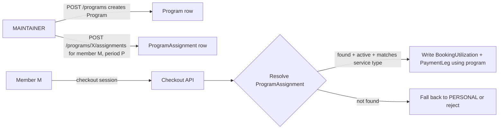

### 8.7 What happens past the cap — the overage system (#777 §C)

A LICENSED_SEAT member with a soft cap (`coveredEngagementsPerCycle`) doesn't just hit a wall. At checkout, a **pre-checkout preview** tells the learner what booking one more session will cost *before* they commit. If they're over the cap, an `OverageEvent` is written, broken into integer paise:

- `basePaise` — the pass-through over-cap price (covered portion + `basePaise` == booking price).
- `surchargePaise` — the `overageSurchargeBps` markup on top.
- `marginalPaise` — the authoritative charged total. **Invariant:** `marginalPaise == basePaise + surchargePaise`.

`overageBehavior` decides who pays:

| Behavior | Effect | Settlement |
|---|---|---|
| `BLOCK` | Checkout is refused (409). | No charge. |
| `CHARGE_MEMBER` | Learner pays the overage on their **own** card. | `OverageChargeStatus` walks PENDING → CHARGED. If the learner never completes it, a 14-day timeout (`timeout-member-overages` cron) flips it to **FAILED** — no more silently stuck money. |
| `CHARGE_ORG` | Overage **accrues** to the org. | Status PENDING → ACCRUED; at the cycle/invoice rollup it becomes an `InvoiceLineItem` on the org's next bill. |

**Circuit breaker.** `CreditPoolConfig.maxOveragePerCyclePaise` (also on the seat config) caps cumulative `OverageEvent.marginalPaise` per cycle. Once cumulative overage would cross it, further overage is **BLOCKED** regardless of behavior — the spend ceiling wins. `OverageChargeStatus` is the full machine: `PENDING | ACCRUED | CHARGED | BLOCKED | REVERSED | FAILED`. Detail in [cycle-engine-and-rollover](../30-programs-and-lifecycle/08-cycle-engine-and-rollover.md).

### 8.8 Assignment lifecycle — the cycle engine (#779 §A/§B)

A `ProgramAssignment` is a **per-cycle** entitlement row — one per `(Program, Membership, periodStart)`. Before the cycle engine, "is this assignment still live?" was *inferred* from `periodEnd` vs now, which left **zombie assignments**: rows whose period had ended but which nothing advanced or closed, so caps and seat counts drifted.

The engine gives every assignment an explicit `AssignmentStatus` — `ACTIVE | ROLLED | PAUSED | CLOSED | CANCELLED` — and a nightly job (`advance-program-cycles`, 02:15 UTC) that moves it. For each `ACTIVE` assignment whose period has ended (and `rolledAt` is null):

- **ROLL** — if the governing contract is `ACTIVE` + `autoRenew` and a successor cycle fits the term: claim `ACTIVE → ROLLED` (stamp `rolledAt`), then mint the successor `ACTIVE` row with counters zeroed. `rolledAt` is the idempotency gate — it doubles as the distributed lock, so two cron replicas can't double-roll.
- **CLOSE** — otherwise: claim `ACTIVE → CLOSED`, no successor.

`PAUSED` holds an assignment out of the roll loop without closing it; `CANCELLED` is an explicit terminal stop. This is the spine that keeps `seatsUsed` and per-cycle caps honest, and it's clamped to the contract state machine (§ 15.5) — an assignment only rolls while its contract is live. Full decision table in [cycle-engine-and-rollover](../30-programs-and-lifecycle/08-cycle-engine-and-rollover.md).

---

## 9. Roles, permissions & governance

Organizations are governed by a **MemberRole** hierarchy, enforced at the API layer.

### 9.1 The seven roles

Each row introduces one `MemberRole` value with its position in the seniority ladder, a plain-English summary of what it can do, and a familiar platform analogy to orient engineers who haven't yet memorised the full permission surface.

| Role | Seniority | Key capabilities | Platform equivalent |
|---|---|---|---|
| **OWNER** | Highest | Full control: billing, settings, SSO, member management, deletion | GitHub "Owner" |
| **MAINTAINER** | High | Member management, program management, org settings (no billing, SSO, or deletion) | GitHub "Maintainer" |
| **BILLING_ADMIN** | High (rank 70, below MAINTAINER) | Finance side-gate: invoices, POs, payouts, rate cards, wallet top-ups, outbound webhooks. **Cannot** touch org status / funding source / members / SSO. | Finance / AP team |
| **MANAGER** | Mid | View billing, analytics, credit pool. Read-only access to management pages | Department lead |
| **EXPERT** | Mid | Delivers services on behalf of the org (canHost only) | Marketplace consultant |
| **LEARNER** | Base | Consumes sessions via the org | Marketplace consultee |
| **SUPPORT** | Base | Non-billing staff for internal admin | Customer-facing support |

Note `BILLING_ADMIN` sits *off* the linear seniority ladder — it's a **side-gate**, not a rung. It outranks MANAGER on billing surfaces but has none of MAINTAINER's member/SSO powers. See [roles-and-permissions](../00-foundations/04-roles-and-permissions.md).

### 9.2 Complete permission matrix

Actions are the rows and the six primary roles are the columns; a checkmark means the role may perform that action unilaterally, so this is the authoritative reference for writing or auditing route-level guards — note that `BILLING_ADMIN` is omitted for width and described in § 9.2.1 instead.

| Action | OWNER | MAINTAINER | MANAGER | EXPERT | LEARNER | SUPPORT |
|---|---|---|---|---|---|---|
| View org dashboard | ✅ | ✅ | ✅ | ✅ | ✅ | ✅ |
| Invite members | ✅ | ✅ | ❌ | ❌ | ❌ | ❌ |
| Change member role | ✅ (except own) | ✅ (except OWNER or own) | ❌ | ❌ | ❌ | ❌ |
| Remove member | ✅ (except sole OWNER or own) | ✅ (except any OWNER or own) | ❌ | ❌ | ❌ | ❌ |
| Create Program | ✅ | ✅ | ❌ | ❌ | ❌ | ❌ |
| Assign Program to member | ✅ | ✅ | ❌ | ❌ | ❌ | ❌ |
| Change billing mode | ✅ | ❌ | ❌ | ❌ | ❌ | ❌ |
| Top up wallet | ✅ | ❌ | ❌ | ❌ | ❌ | ❌ |
| Create contract | ✅ | ❌ | ❌ | ❌ | ❌ | ❌ |
| Issue invoice | ✅ | ❌ | ❌ | ❌ | ❌ | ❌ |
| View billing / invoices | ✅ | ❌ | ✅ | ❌ | ❌ | ❌ |
| Create SSO provider | ✅ | ❌ | ❌ | ❌ | ❌ | ❌ |
| Claim domain | ✅ | ❌ | ❌ | ❌ | ❌ | ❌ |
| Receive payout (canHost) | ✅ | ❌ | ❌ | ✅ | ❌ | ❌ |
| Book a session | ✅ | ✅ | ✅ | ❌ | ✅ | ✅ |
| Deliver a session | ❌ | ❌ | ❌ | ✅ | ❌ | ❌ |
| Delete the organization | ✅ | ❌ | ❌ | ❌ | ❌ | ❌ |

(BILLING_ADMIN omitted from the columns above for width; its surface is the union of the MANAGER read rows **plus** write access to every billing/invoice/PO/payout/rate-card/wallet/webhook mutation — see § 9.2.1.)

**Two non-obvious rules baked into the rows above (2026-06 MAINTAINER role audit):**

- **Removing an OWNER ≡ revoking the OWNER role.** Both transitions move someone from "has OWNER power" to "no longer has OWNER power", so they share the same gate. A MAINTAINER cannot remove **any** OWNER (not just the last one). Both the PATCH role-change route and the DELETE route enforce this via `isAtLeastRole(actor, "OWNER")`. Previously, DELETE only protected against orphaning the org (last-OWNER 409) — that left a privilege-escalation path where a MAINTAINER could remove all OWNERs except one. Closed in members/[memberId]/route.ts DELETE handler.
- **No one can change their own role.** Caller cannot grade their own membership — including OWNER. Role changes belong to a peer-or-superior review path. Self-status changes (e.g., suspending yourself) remain allowed. Without this, a MAINTAINER could self-PATCH to LEARNER (losing admin access by accident) or to EXPERT (lazy-creating a ConsultantProfile, bypassing the #729 strict identity gate that POST /members enforces). Closed in members/[memberId]/route.ts PATCH handler.
- **No one can remove themselves via the member list.** The trash icon on your own row is refused (403). "Leave organization" is a real use case but belongs to a dedicated confirmation flow ("you will lose access immediately") with stronger copy than the eviction trash. Until that flow exists, self-DELETE is blocked. Closed in members/[memberId]/route.ts DELETE handler.

### 9.2.1 Field-level RBAC — the billing side-gate (#779 §A)

Billing surfaces aren't gated by the linear `minimumRole` ladder. They use a dedicated helper, **`requireOrgBillingAdminOrOwner`** (`lib/auth/billing-admin-gate.ts`), which admits exactly **OWNER ∨ BILLING_ADMIN**. MAINTAINER is *deliberately excluded* — a MAINTAINER runs people and programs, not money. The gate fronts the rate-card, purchase-order, wallet-top-up, invoice (incl. `…/pay`), and billing-account routes.

The same field-level discipline governs `PATCH /api/organizations/[orgId]`: the route carries a **field allowlist per role**, so the same endpoint accepts a different set of columns depending on who's calling. A MAINTAINER patching the org can change branding but not `fundingSource`; a BILLING_ADMIN can't flip `canHost`. The allowlist — not just the role rank — is what's checked, which is how one PATCH route serves several roles safely.

### 9.3 Role transitions (the LEARNER ↔ EXPERT guard)

Not all role transitions are allowed. A MAINTAINER can change a LEARNER's role to MANAGER (promotion) but cannot change a LEARNER into an EXPERT (different platform user type — would require consultant verification).

The blocked transitions:

| From | To | Blocked? | Reason |
|---|---|---|---|
| LEARNER | EXPERT | ✅ Blocked | Different platform identity (UserRole.CONSULTEE vs CONSULTANT) |
| EXPERT | LEARNER | ✅ Blocked | Same reason, reverse direction |
| Any other role → OWNER | ✅ Blocked for non-OWNERs | Only OWNERs can assign OWNER role (`touchesOwnerRole` gate on PATCH) |
| Any OWNER → any role (by non-OWNER) | ✅ Blocked | Same `touchesOwnerRole` gate — covers role-change PATCH **and** member DELETE. Removing an OWNER is functionally identical to revoking the OWNER role, so the gate applies symmetrically. |
| Any role → any other role (on own row) | ✅ Blocked | Self-role-change guard. Caller cannot grade their own membership; ask another operator. Applies to MAINTAINER, OWNER, everyone. Status-only self-edits (e.g., self-suspend) remain allowed. |
| OWNER → Any (last OWNER, by an OWNER) | ✅ Blocked | Anti-lockout guard; can't orphan the org. Fires only when an OWNER tries to remove themselves as the sole OWNER, since other paths are caught earlier by `touchesOwnerRole` or self-role-change. |

### 9.4 Anti-lockout guards

The system explicitly refuses to execute operations that would leave the org in an unusable state. These guards are load-bearing — they're the difference between "user made a mistake" and "customer lost the org forever."

| Guard | Protects against |
|---|---|
| Last-OWNER demotion/removal | Orphaning the org |
| Last-capability disable (canSponsor AND canHost = false) | INERT state |
| Last SSO provider delete when enforceSSO=true | Locking out all users |
| Last domain claim release when enforceSSO=true AND no providers | Same |
| Active member removal during org deletion | Orphaning members |
| Delete Program with existing assignments | Soft-delete instead (sets `status=CANCELLED`) |

### 9.5 Platform roles vs org roles

**Important:** `MemberRole` (org-internal) is distinct from `UserRole` (platform-wide). A single user has:

- One `UserRole` (CONSULTANT, CONSULTEE, STAFF, ADMIN, ORG_WORKSPACE) — their platform identity.
- Zero or many `MemberRole`s — one per org they belong to.

A platform ADMIN (Staff member of Familiarise) always passes every `requireOrgAccess` check — admins can see + operate on any org for support purposes. This is logged to the audit trail.

---

## 10. Real-world business scenarios

These are end-to-end narrative examples. Each one covers: who the customer is, what they want, how the platform models it, what the money flow looks like.

### 10.1 Scenario A — Wipro (BUYER + INVOICE mode)

**Customer:** Wipro Enterprise HR.

**Need:** Sponsor 1:1 mentorship for 200 senior engineers. Finance wants monthly invoicing (not upfront pre-pay). Procurement requires PO matching.

**Setup:**

1. OWNER (VP HR) signs up, creates org.
2. OWNER configures: `canSponsor=true, canHost=false, fundingSource=INVOICE`.
3. OWNER signs a contract: 12-month term, ₹20L credit limit, NET-60 terms.
4. OWNER does NOT create a Program (INVOICE mode accrues payment legs directly, no per-member entitlement needed).
5. OWNER invites 3 MAINTAINERs (HR team) + 200 LEARNERs (engineers) via CSV upload.
6. LEARNERs accept invites; their billing defaults to "bill to Wipro" when booking.

**Month 1 activity:** 40 sessions booked, totaling ₹40K. 40 PaymentLeg rows written with `source=INVOICE_ACCRUAL`. Consultants get paid as normal (platform absorbs AR risk).

**Month-end:** Platform runs month-end invoice cron, generates one invoice for ₹47,200 (₹40K + 18% GST). Invoice sent to Wipro's billing email + audit entry.

**Payment:** Wipro pays via Razorpay or bank transfer within 60 days. Invoice flips to PAID status.

**Reporting:** Wipro's HR OWNER sees monthly usage by department, top consultants, ROI.

### 10.2 Scenario B — LearnPro (HOST only)

**Customer:** LearnPro, a 3-year-old EdTech agency with 30 in-house senior mentors.

**Need:** Sell mentor time through Familiarise to reach wider audience; get revenue-share income.

**Setup:**

1. OWNER (founder) signs up, creates org.
2. OWNER configures: `canSponsor=false, canHost=true`.
3. OWNER provides PayoutAccount details (bank + KYC).
4. OWNER signs contract with 70/20/10 rate card (consultant gets 70%, LearnPro 20%, platform 10%).
5. OWNER invites 30 EXPERTs via email.
6. Each EXPERT accepts + verifies their consultant profile (independent verification flow).

**Ongoing:** Learners (B2C or sponsored by other orgs) book EXPERTs. Each booking writes `OrganizationEarnings`:

- Gross revenue: ₹5,000
- Consultant share: ₹3,500 (70%)
- LearnPro share: ₹1,000 (20%)
- Platform share: ₹500 (10%)

**Payout:** On the **weekly** payout run (Mondays), LearnPro's READY `OrganizationEarnings` are batched into an `OrganizationPayout`. Razorpay Payouts sends the batch total to LearnPro's account (only when `ENABLE_LIVE_PAYOUTS` is on — otherwise the gated org payout parks at PENDING, § 16.4). Consultants get their shares via separate individual payouts.

### 10.3 Scenario C — IIT Madras (HYBRID)

**Customer:** IIT Madras Career Services.

**Need:** Faculty mentors deliver sessions to students (internal) + external public learners book faculty time (external).

**Setup:**

1. OWNER (Director of Career Services) signs up, creates HYBRID org.
2. Configures: `canSponsor=true, canHost=true, fundingSource=WALLET`.
3. Top up wallet with ₹5L from IIT's budget.
4. Create a LICENSED_SEAT Program: 2000 seats, ₹500/seat/year, covering unlimited sessions for students.
5. Invite 100 faculty as EXPERTs + 2000 students as LEARNERs.
6. Students (LEARNERs on LICENSED_SEAT program) book faculty sessions free to them.
7. External public users (non-IIT) discover faculty on `/explore/enterprise/organisations/iit-madras` and book directly (B2C path).

**Internal session money flow:**

- LEARNER books faculty. LICENSED_SEAT program absorbs cost.
- Faculty EXPERT earns via 3-way split (70% to faculty, 20% to IIT Madras, 10% to platform).
- The IIT Madras 20% share funds the LICENSE seat cost; platform settles the faculty 70% from the wallet pre-funding.

**External session money flow:**

- Public learner pays ₹3,000 directly via Razorpay.
- Standard 3-way split (70/20/10) applies.
- Platform keeps 10%, IIT Madras earns 20%, faculty earns 70%.

### 10.4 Scenario D — Solo consultant joining a HOST org

**User:** Arjun Anderson, a freelance career coach (he already runs his own solo HOST org, `arjun-anderson-coaching`).

**Need:** Move from solo B2C to agency-backed (more structured, better tax handling).

**Flow:**

1. Arjun has been on Familiarise as a CONSULTANT (B2C path).
2. An agency (HOST org) invites him as an EXPERT via email.
3. Arjun accepts → Membership row created with `role=EXPERT`, `status=ACTIVE`.
4. Arjun's future bookings now flow through the agency's rate card + earnings split.
5. Existing bookings on the B2C path retain their original (100% to Arjun minus commission) split.

**Governance:** Arjun can belong to multiple HOST orgs simultaneously (he's also an EXPERT at IIT Madras). Session attribution uses the org whose marketplace page the learner booked from.

### 10.5 Scenario E — Small startup (BUYER + WALLET + simple)

**Customer:** 15-person early-stage startup.

**Need:** Give the team access to senior mentors. Small budget, no HR team.

**Setup:**

1. Founder signs up as OWNER.
2. Configures: `canSponsor=true, canHost=false, fundingSource=WALLET`.
3. Tops up wallet with ₹50K.
4. Creates a CREDIT_POOL Program: 50 credits at ₹1000/credit.
5. Assigns program to all 15 employees (MAINTAINER role for co-founder).
6. Employees book mentors; each booking deducts credits.

**When credits run out:** OWNER gets notified. Tops up again or raises limits.

**Growth:** If monthly usage stabilizes, OWNER can migrate from CREDIT_POOL to LICENSED_SEAT for cost predictability.

### 10.6 Scenario F — Booking via org program (member POV)

A LEARNER's concrete experience booking a session when their org has a Program:

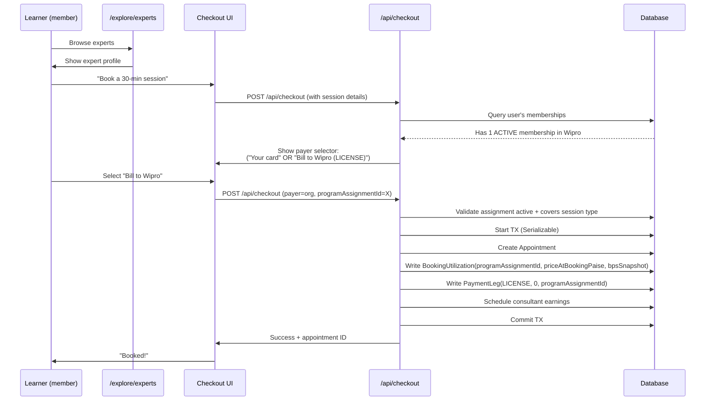

---
---

# PART III — THE USER LAYER

## 11. User journeys & onboarding permutations

Different users enter the system through different flows. Each flow has different validation rules, database writes, and UX.

### 11.1 Journey A — New user signing up as ORG_OWNER

A founder signing up for the first time to create an organization.

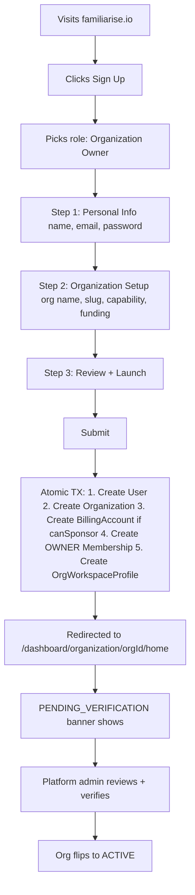

**Key gate:** org status starts at `PENDING_VERIFICATION`. OWNER can configure branding + draft programs but cannot invite members or move money until admin verification.

### 11.2 Journey B — Existing user invited to an org as LEARNER

A user who already has a consultee profile receives an invite link.

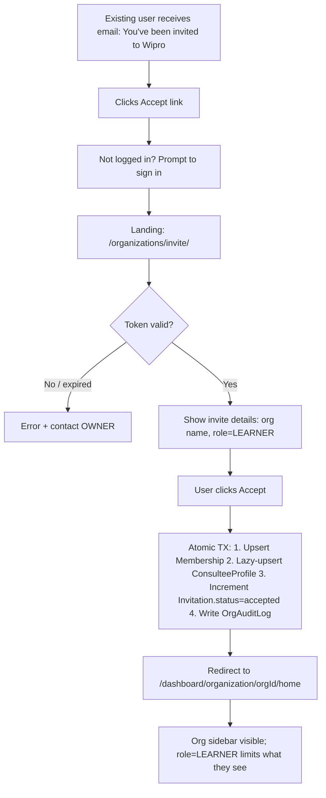

### 11.3 Journey C — New user invited as EXPERT (HOST org)

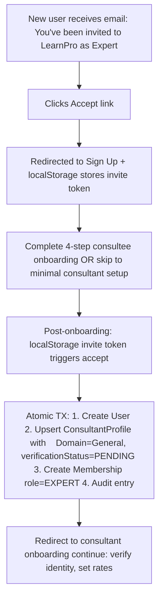

### 11.4 Journey D — MAINTAINER invites a team

A batch invite flow.

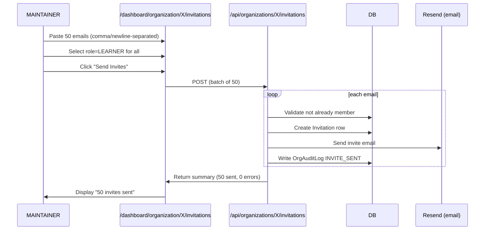

### 11.5 Journey E — User who belongs to multiple orgs

Users can be members of many orgs simultaneously. The UX accommodates via the **OrganizationSwitcher** dropdown.

**Example:**

- Alice is a LEARNER in Wipro.
- Alice is also an EXPERT in LearnPro.
- Alice is also an OWNER in her own side-project org.

**UX:**

- Navbar shows OrgSwitcher dropdown (top-right).
- Dropdown lists all Alice's active memberships with role badges.
- Selecting one switches the dashboard context (URL changes to `/dashboard/organization/{newOrgId}/...`).
- Session state preserves the last-selected org for repeat visits.

### 11.6 Journey F — User leaves an org

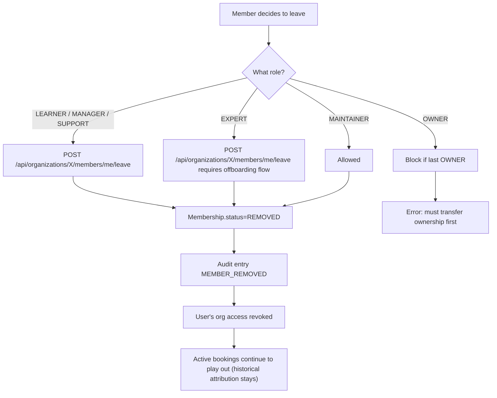

### 11.7 Journey G — SSO auto-join via domain claim

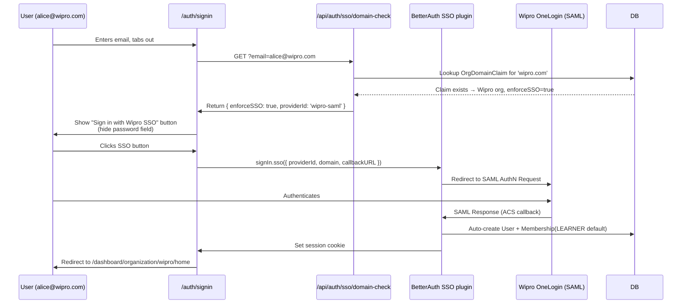

### 11.8 Permutation matrix

A matrix of possible user × org states:

| User has... | Org state | Net effect |
|---|---|---|
| 0 memberships | N/A | Pure B2C — sees B2C dashboard only |
| 1 active LEARNER | ACTIVE | Sees both personal + org dashboards; OrgSwitcher visible |
| 1 pending invite | PENDING_VERIFICATION | Invite link works; acceptance creates Membership |
| 1 active membership | SUSPENDED | Cannot book; sees suspended banner |
| Multiple memberships | Some ACTIVE, some not | Active ones are switchable; suspended ones show banner |
| 1 OWNER | ACTIVE | Full dashboard; can delete org (with confirmation) |
| 1 OWNER + 1 MAINTAINER elsewhere | Both ACTIVE | Switchable; different permissions per context |
| 1 EXPERT + 1 LEARNER (different orgs) | Both ACTIVE | One org hosts them, the other sponsors them |

---

## 12. Common actions by role

A cookbook of what each role typically does day-to-day.

### 12.1 OWNER daily/weekly

- Review monthly invoice + approve payment.
- Invite new senior hires.
- Review audit log for anomalies.
- Approve program creation requests from MAINTAINERs.
- Sign new contracts + approve rate card changes.
- Monthly: review NPS + usage analytics.

### 12.2 MAINTAINER daily/weekly

- Onboard new hires (send invitations).
- Manage member status (reactivate, remove).
- Create / configure Programs (WALLET top-ups, seat counts).
- Assign programs to specific members/cohorts.
- Handle L1 internal support (employee can't find dashboard).
- Daily: review pending invites + invite-acceptance rate.

### 12.3 MANAGER daily/weekly

- View analytics for their department.
- View wallet balance / credit pool usage.
- Escalate booking issues to MAINTAINER.

### 12.4 EXPERT (HOST org)

- Deliver sessions.
- Update availability calendar.
- View earnings (role-appropriate scope; not platform-wide).
- Update consultant profile.

### 12.5 LEARNER

- Browse marketplace / explore experts.
- Book sessions (covered by org program if assigned).
- Attend sessions via integrated Stream.io.
- View past sessions + feedback.

### 12.6 SUPPORT

- Read-only access to most pages.
- Cannot view billing or make changes.
- Typically used for compliance/audit observers who need visibility but no write access.

---

## 13. What users see (role-by-role UX tour)

### 13.1 Dashboard sidebar items (by role)

Every sidebar destination is a row, and the columns show which roles can see it, giving product and front-end engineers a single reference for conditionally rendering nav items without digging into individual route guards.

| Sidebar item | OWNER | MAINTAINER | MANAGER | EXPERT | LEARNER | SUPPORT |
|---|---|---|---|---|---|---|
| Overview (/home) | ✅ | ✅ | ✅ | ✅ | ✅ | ✅ |
| Members | ✅ | ✅ | ✅ (read) | ❌ | ❌ | ✅ (read) |
| Invitations | ✅ | ✅ | ❌ | ❌ | ❌ | ❌ |
| Experts (canHost) | ✅ | ✅ | ✅ (read) | ✅ (read) | ❌ | ❌ |
| Learners (canSponsor) | ✅ | ✅ | ✅ (read) | ❌ | ❌ | ❌ |
| Programs | ✅ | ✅ | ✅ (read) | ❌ | ❌ | ❌ |
| Plans (catalog) | ✅ | ✅ | ✅ (read) | ❌ | ❌ | ❌ |
| Contracts | ✅ | ❌ | ❌ | ❌ | ❌ | ❌ |
| Billing (Wallet tab lives here) | ✅ | ❌ | ✅ (read) | ❌ | ❌ | ❌ |
| Purchase Orders | ✅ | ❌ | ❌ | ❌ | ❌ | ❌ |
| Payouts (canHost) | ✅ | ❌ | ✅ (read) | ❌ | ❌ | ❌ |
| Analytics | ✅ | ✅ | ✅ | ❌ | ❌ | ✅ (read) |
| Settings | ✅ | ❌ | ❌ | ❌ | ❌ | ❌ |
| SSO (in Settings) | ✅ | ❌ | ❌ | ❌ | ❌ | ❌ |
| Consent (DPDP) | ✅ | ❌ | ❌ | ❌ | ❌ | ❌ |

Two notes on the table: (1) the wallet/credit pool is **not a separate `/credits` route** — it's the **Wallet tab inside `/billing`** (no `/credits` page exists). (2) The columns are the six classic roles; **BILLING_ADMIN** (omitted for width) has **write** access to the Billing, Purchase Orders, Payouts, and rate-card surfaces — the union of what's gated by `requireOrgBillingAdminOrOwner` (§ 9.2.1).

### 13.2 Key UI components

- **OrgContextBar** — top of every `/dashboard/organization/**` page. Shows org name, role badge, NotificationInbox (bell), OrgSwitcher.
- **DashboardNavbar** — for personal dashboard pages (/dashboard/consultee, /dashboard/consultant). Also shows OrgSwitcher when user has memberships.
- **OrgStatusBanner** — displayed for non-ACTIVE orgs (PENDING_VERIFICATION / SUSPENDED / DEACTIVATED).
- **NotificationInbox (bell)** — user-scoped Novu inbox. Org-event notifications are Phase 2 (see roadmap).

### 13.3 Checkout UI changes when user has org context

When a user with at least one active Membership hits the checkout flow, they see a **payer selector**:

```
[ ] Pay with your card / UPI (₹999)
[x] Bill to Wipro Enterprise (covered by org)
```

Server-side, the request includes `organizationId: "wipro-id"` and the payment routes through the org's billing mode (WALLET / INVOICE / LICENSE) instead of personal card.

If the user has no Membership, the payer selector hides entirely (no extra UX noise for B2C users).

---
---

# PART IV — THE FINANCIAL LAYER

## 14. Payment legs & the double-entry ledger

This Part is how money is tracked. The core idea is **double-entry** bookkeeping: every rupee that moves is written twice — once as where it came from, once as where it went — and the two always sum to zero, so the books can never silently drift. A **PaymentLeg** is just one slice of how a single payment was funded (card, wallet, invoice, etc.). Every movement of money on the platform is recorded in a **double-entry money journal** alongside the **PaymentLeg** composition model. Understanding this is load-bearing for trusting the numbers. The `10-money-and-ledger/` band holds the full detail in **thirteen docs**, written to be read in order: [money-model-overview](../10-money-and-ledger/01-money-model-overview.md), [chart-of-accounts](../10-money-and-ledger/02-chart-of-accounts.md), [ledger-and-postings](../10-money-and-ledger/03-ledger-and-postings.md), [wallet-and-topups](../10-money-and-ledger/04-wallet-and-topups.md), [booking-to-earnings](../10-money-and-ledger/05-booking-to-earnings.md), [earnings-lifecycle](../10-money-and-ledger/06-earnings-lifecycle.md), [payout-pipeline](../10-money-and-ledger/07-payout-pipeline.md), [invoicing](../10-money-and-ledger/08-invoicing.md), [payment-legs](../10-money-and-ledger/09-payment-legs.md), [refunds](../10-money-and-ledger/10-refunds.md), [disputes](../10-money-and-ledger/11-disputes.md), [payment-webhooks](../10-money-and-ledger/12-payment-webhooks.md), and [ledger-integrity](../10-money-and-ledger/13-ledger-integrity.md). The sections below summarize the load-bearing ideas and link into that band where each concept lives in full.

### 14.1 The two ledgers

Post-#772 there are exactly **two** ledgers. The legacy three-ledger framing (`FundingLedgerEntry` / `SettlementLedgerEntry` plus a money `WalletEntry`) was removed.

| Ledger | What it records | Model |
|---|---|---|
| **Money journal** | Every rupee in/out, as balanced double-entry postings. | `LedgerAccount` / `LedgerTransaction` / `LedgerEntry` |
| **Usage ledger** | Entitlement consumption — "this session consumed this much of this program." NOT money. | `UsageLedgerEntry` |

The money journal lives in `lib/payments/ledger/post.ts`:

- **`LedgerAccount`** — one per `(kind, org, consultant, currency)`, with deterministic id `<kind>|<orgId|_>|<consultantProfileId|_>|<currency>`. Ten `LedgerAccountKind`s: `CASH`, `WALLET` (credit-normal liability), `PLATFORM_FEE`, `PLATFORM_PROMO`, `DISCOUNT`, `CONSULTANT_PAYABLE`, `ORG_PAYABLE`, `ORG_RECEIVABLE`, `TDS_PAYABLE`, `GST_PAYABLE`.
- **`LedgerTransaction`** — a posting with a unique `idempotencyKey` and a free-String `kind` (BOOKING / TOPUP / TOPUP_REFUND / PAYOUT / ORG_PAYOUT / INVOICE_PAID / REFUND).
- **`LedgerEntry`** — one leg: a `direction` (DEBIT / CREDIT) and `amountPaise` (BigInt, **always positive**).

**Invariant:** within every `LedgerTransaction`, Σdebit == Σcredit. Helpers: `postLedgerTxn`, `ledgerAccountId`, `ledgerBalancePaise`.

### 14.2 PaymentLeg model

A Payment is composed of 1+ PaymentLegs. Each leg has a `source` (CARD, REFERRAL_CREDIT, WALLET, INVOICE_ACCRUAL, LICENSE) and an `amountPaise`. Legs sum to `Payment.amount` — invariant enforced at the end of every checkout transaction.

### 14.3 Leg composition patterns

Reading across a row shows exactly which `PaymentLeg` records are written for each booking scenario and what sum invariant they must satisfy, so you can quickly verify whether a new checkout path produces the correct leg set.

| Scenario | Legs written | Invariant |
|---|---|---|
| B2C card pay, no credits | 1 × CARD, amount=price | sum = price |
| B2C card pay + ₹500 referral credit | 1 × CARD (price-500), 1 × REFERRAL_CREDIT (500) | sum = price |
| Org WALLET booking | 1 × WALLET, amount=price | sum = price |
| Org INVOICE booking (mid-month) | 1 × INVOICE_ACCRUAL, amount=price | sum = price |
| Org LICENSE booking | 1 × LICENSE, amount=0 | sum = 0; payment.amount = 0 |
| Mock booking (dev) | 0 legs (skipped) | invariant not checked |

### 14.4 Leg invariant enforcement

At the end of the checkout transaction, `checkPaymentLegsSumToAmount()` (in `lib/payments/payment-legs.ts`) logs a warning if the sum doesn't match. For tests and settlement jobs, the hard-throwing sibling `assertPaymentLegsSumToAmount()` raises an exception.

### 14.5 Ledger example — a single INVOICE booking

Wipro employee (LEARNER, on INVOICE mode) books a ₹999 session on April 15.

**Database writes (all atomic):**

1. `Payment.create({ amount: 999 })`
2. `Appointment.create({...})`
3. `BookingUtilization.create({ paymentId, priceAtBookingPaise: 999, bpsSnapshot: 10/20/70 })`
4. `PaymentLeg.create({ source: 'INVOICE_ACCRUAL', amountPaise: 999, sourceRef: programAssignmentId })`
5. `UsageLedgerEntry.create({ org, member, consumedCredits: 1, priceAtBooking: 999 })`
6. `postLedgerTxn` with idempotency key `booking:<paymentId>` (kind `BOOKING`) — a single balanced txn whose funding leg is `Dr ORG_RECEIVABLE(org) 999` (INVOICE mode accrues a receivable now) plus any `Dr DISCOUNT`, balanced by `Cr PLATFORM_FEE + CONSULTANT_PAYABLE(consultant) + ORG_PAYABLE(org) + GST_PAYABLE`. Single-consultant bookings post inline; multi-collaborator bookings defer (see #773).
7. `OrgAuditLog.create({ action: 'SESSION_BOOKED_INVOICE_ACCRUAL' })`

Note there is no `OrganizationEarnings.create` here: the consultant's share lives in the `CONSULTANT_PAYABLE` leg, and the org's share in `ORG_PAYABLE`; the earnings rows are projections derived from the journal.

**Month-end (April 30):**

1. Month-end cron aggregates 40 bookings totaling ₹40K.
2. `OrganizationInvoice.create({ amount: 40000, gst: 7200, total: 47200 })` — **invoice issuance posts NO money leg**; the receivable was already accrued at booking time.

**May 20 (Wipro pays):**

1. Razorpay webhook captures payment.
2. `OrganizationInvoice.update({ status: 'PAID', paidAt })`
3. `postLedgerTxn` with idempotency key `invoicepaid:<invoiceId>` (kind `INVOICE_PAID`): `Dr CASH / Cr ORG_RECEIVABLE(org)`.

The chain is queryable end-to-end: you can ask "where did this ₹999 come from?" and trace it through the journal (idempotency key per event) back to the original booking.

### 14.6 Ledger integrity & reconciliation

`scripts/reconcile/reconcile-ledgers.ts` runs nightly and asserts the journal against its derived projections. Finding codes:

| Code | Asserts |
|---|---|
| `WALLET_BALANCE_DRIFT` | `BillingAccount.walletBalance` cache == WALLET account balance |
| `LEDGER_TXN_IMBALANCE` | Σdebit == Σcredit within every `LedgerTransaction` |
| `EARNINGS_LEDGER_DRIFT` | `OrganizationEarnings` projection == CONSULTANT/ORG payable legs |
| `PROGRAM_ASSIGNMENT_ENGAGEMENTS_DRIFT` | Per-assignment engagement counts |
| `ACTIVE_SEAT_COUNT_DRIFT` | `seatsUsed` == active assignments |
| `PAYMENT_LEG_SUM_MISMATCH` | PaymentLegs sum to `Payment.amount`, excluding referral credits (#1347) |
| `ORG_PAYOUT_TOTAL_MISMATCH` | Org payout legs sum to claimed earnings |

The #772 cutover validated `ok: true` with **0 findings** on a full reseed.

---

## 15. Rate cards & revenue splits

### 15.1 What a rate card is

A `RateCard` defines the 3-way revenue split for every session booked under a specific contract. Fields:

```prisma
model RateCard {
  platformBps   Int  // e.g. 1000 = 10%
  orgBps        Int  // e.g. 2000 = 20%
  consultantBps Int  // e.g. 7000 = 70%
  effectiveFrom DateTime
  effectiveTo   DateTime?
  ownerContractId String  // FK to Contract
}
```

**Sum invariant:** `platformBps + orgBps + consultantBps = 10000` (100%).

### 15.2 Snapshot semantics

When a session books, the rate card at that instant is **snapshotted** onto the `BookingUtilization` and `OrganizationEarnings` rows:

```
BookingUtilization.platformBpsAtBooking = 1000
BookingUtilization.orgBpsAtBooking = 2000
BookingUtilization.consultantBpsAtBooking = 7000
BookingUtilization.rateCardIdApplied = <rate_card_id>
```

Even if the contract's rate card is updated later, **closed bookings do not re-split.** The snapshot ensures settlement reads historical rates — a core audit invariant.

### 15.3 Rate card rotation (atomic bump)

When an org renegotiates their rate card, the change is applied via the atomic `bumpRateCard()` helper:

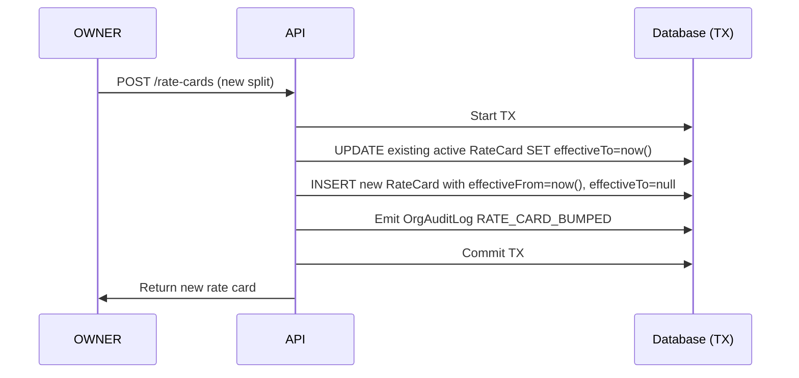

**Race safety:** two OWNERs cannot bump concurrently. The TX holds a row-level lock on Contract; one wins, the other retries with the new state.

### 15.4 Revenue split example

Consultant's ₹5,000 session, 10/20/70 rate card:

| Beneficiary | Basis points | Amount |
|---|---|---|
| Platform | 1000 (10%) | ₹500 |
| Org (HOST or HYBRID) | 2000 (20%) | ₹1,000 |
| Consultant | 7000 (70%) | ₹3,500 |

The org's ₹1,000 accrues to `OrganizationEarnings`. The consultant's ₹3,500 accrues to consultant earnings. Platform's ₹500 is platform revenue (commission).

### 15.5 Contract lifecycle (#779 §A)

A rate card hangs off a `Contract`, and the contract has its own state machine — `DRAFT → ACTIVE → EXPIRED | TERMINATED` — that the cycle engine (§ 8.8) clamps the whole program/assignment lifecycle to. Three lifecycle moves matter commercially:

- **Auto-renew.** A `Contract` with `autoRenew = true` is rolled forward by the `auto-renew-contracts` cron (02:30 UTC), stamping `autoRenewedAt`. This is what keeps assignments rolling instead of silently expiring — no more zombie assignments at term boundaries.
- **Supersession.** Rather than mutating a live contract, you mint a successor and link it (`supersededByContractId` / `supersededAt`). `POST …/contracts/[contractId]/supersede` (OWNER) takes a `ContractSupersessionType`: **AMENDMENT** (mid-term change — successor starts now, old → TERMINATED) or **RENEWAL** (term rollover — successor starts at the old term's end). The third value, **TERMINATION_REPLACEMENT**, is **system-set** (e.g. a replacement issued during termination), not a user choice.
- **End-early / terminate.** Ending a contract before term is a `PATCH …/contracts/[contractId]` to its status, behind a **guard**: it returns **409** while there are still live assignments or outstanding invoices. Once clear, the termination runs an **in-transaction cascade** — its programs go `ACTIVE → EXPIRED` and their still-`ACTIVE` assignments go `→ CLOSED` in the same tx, so nothing is orphaned. (Past-term contracts expire naturally via the `expire-contracts` cron, 03:00 UTC.)

Full state table + the supersession chain semantics: [contract-lifecycle](../30-programs-and-lifecycle/07-contract-lifecycle.md).

---

## 16. Settlement, the earnings lifecycle & payouts

Settlement has two halves: an **earnings** half (how a row that owes a consultant or a host-org money is born, held, and released) and a **payout** half (how released rows are swept into a bank transfer). The earnings half has its own state machine and its own doc — [earnings-lifecycle](../10-money-and-ledger/06-earnings-lifecycle.md), summarized in § 16.1 — and the payout half is the pipeline in §§ 16.2–16.4, detailed in [payout-pipeline](../10-money-and-ledger/07-payout-pipeline.md).

### 16.1 The earnings lifecycle (`EarningStatus`)

Every booking that owes someone money mints an earnings row — a `ConsultantEarnings` row for the expert and, for canHost orgs, an `OrganizationEarnings` row for the org's revenue share. Both move through one `EarningStatus` machine: **`PENDING → READY → PAID`** on the happy path, with **`HELD`** as a dispute freeze, **`REFUNDED`** as the terminal reversal, and **`PENDING_TRUST`** as a fraud-guard parking state. The full state diagram, the legal-transition guard (`assertEarningStatusTransitionLegal`, which makes `REFUNDED` terminal and lets a `PAID` row move only to `REFUNDED`), and the append-only refund-decrement rule all live in [earnings-lifecycle](../10-money-and-ledger/06-earnings-lifecycle.md).

**`PENDING_TRUST` — the #687 invoice-fraud guard.** When an org that is still `PENDING_VERIFICATION` and funds by INVOICE accrues consultant earnings, those earnings could otherwise be released — and the consultant paid — before the org ever pays its first invoice, leaving the platform exposed if the org disappears. So when the sponsoring org is unverified and has zero `PAID` invoices, the `OrganizationEarnings` row is minted in **`PENDING_TRUST`** instead of `PENDING`. A `PENDING_TRUST` row is invisible to the hold-release cron and can never reach `READY`; the `release-pending-trust-earnings` cron (hourly :30) promotes it to `PENDING` only once the org goes `ACTIVE` or pays its first invoice. (This is also recorded as an ADR — see the [70-design-decisions band](../70-design-decisions/00-README.md), specifically [PENDING_TRUST earnings parking](../70-design-decisions/12-pending-trust-earnings-parking.md).)

**Hold windows.** A new row's hold is **not** "completedAt + 3 days." At mint time `createEarningsFromPayment` sets `holdUntil = now + HOLD_PERIOD_HOURS[appointmentType]`, anchored at the moment of earnings creation (payment-success time), not the appointment's completion time. The per-type windows are **24h** for `CONSULTATION` and `CLASS`, **48h** for `WEBINAR`, and **168h (7 days)** for `SUBSCRIPTION`, with the 24-hour `CONSULTATION` window as the default for an unknown type. The hourly `releaseEarningsFromHold` cron flips every `PENDING` row whose `holdUntil <= now` to `READY`; it never touches `HELD` rows, which are released only by an explicit dispute resolution.

### 16.2 Payout cadence

Once earnings are `READY`, the **weekly** payout batch (`create-payout-batch`, Mondays 20:00 UTC) sweeps them; `process-payouts` (Mondays 21:00 UTC) dispatches. OWNER/admin can also trigger an off-cycle batch. (Payouts are **weekly**, not monthly — the *invoice* cron is the month-end one.)

### 16.3 Payout batch creation

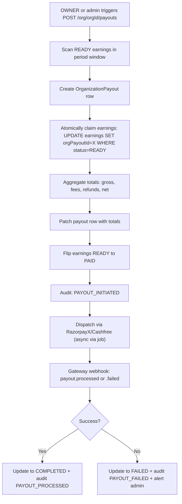

### 16.4 Payout state machine

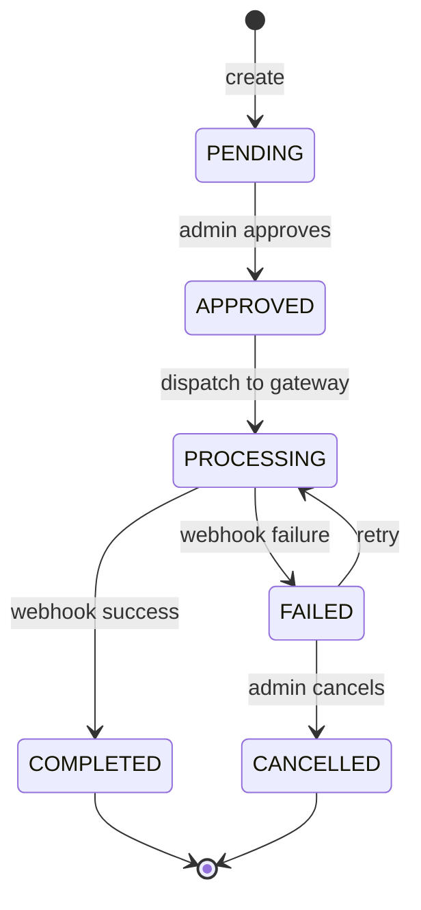

`EarningStatus` (the source rows being settled): `PENDING / PENDING_TRUST / HELD / READY / PAID / REFUNDED` (the lifecycle in § 16.1).

**Live-payout gate.** Real money only leaves the platform when `ENABLE_LIVE_PAYOUTS` is on. With the flag **off** (today's default), the pipeline runs end-to-end but a **gated org payout parks at `PENDING`** — batches are created, claimed, and reconciled, but the gateway submission step is frozen, so nothing actually disburses. (Only the gateway *submission* is gated; everything upstream of it runs for real — see [live-payout submission freeze](../70-design-decisions/11-live-payout-submission-freeze.md).) This is intentional pre-launch: the accounting is exercised without moving funds. The go-live checklist is in [live-payout-go-live-runbook](../50-operations/06-live-payout-go-live-runbook.md).

### 16.5 Ledger postings on payout

When a payout dispatches, it draws down the payable accrued at booking time:

- **Consultant payout** — `payout:<payoutId>` (kind `PAYOUT`): `Dr CONSULTANT_PAYABLE / Cr CASH + TDS_PAYABLE`.
- **Org payout** (canHost orgs' revenue share) — `orgpayout:<payoutId>` (kind `ORG_PAYOUT`): `Dr ORG_PAYABLE / Cr CASH + TDS_PAYABLE`.

The TDS leg captures professional-services withholding (historically §194J at 10%; from 1-Apr-2026 the same 10% under §393 of the Income-tax Act 2025 — see § 20); net cash leaves via CASH. Reconcile asserts `ORG_PAYOUT_TOTAL_MISMATCH` if a batch's legs don't sum to the claimed earnings.

---

## 17. Refunds, credit notes & disputes

When money has to come *back* — because a learner cancelled, an org overpaid an invoice, or a cardholder filed a chargeback — three engines handle it: the **refund cascade** (a learner- or org-initiated return), **credit notes** (the GST document a refund against an issued invoice requires), and the **dispute machine** (a bank-driven chargeback the platform must contest or accept). The first two are detailed in [refunds](../10-money-and-ledger/10-refunds.md); the third in [disputes](../10-money-and-ledger/11-disputes.md). This section summarizes all three.

### 17.1 Refund principles

1. **Refunds UPDATE, never DELETE.** Historical rows are preserved.
2. **Reversal uses `reversedAt` + `reversalReason` fields.** Not a separate model.
3. **Refund routing depends on original funding source.** WALLET refunds back to wallet; INVOICE refunds unbill the payment from rollup; LICENSE refunds don't move money (no charge to refund).

### 17.2 Refund flow (PERSONAL card path)

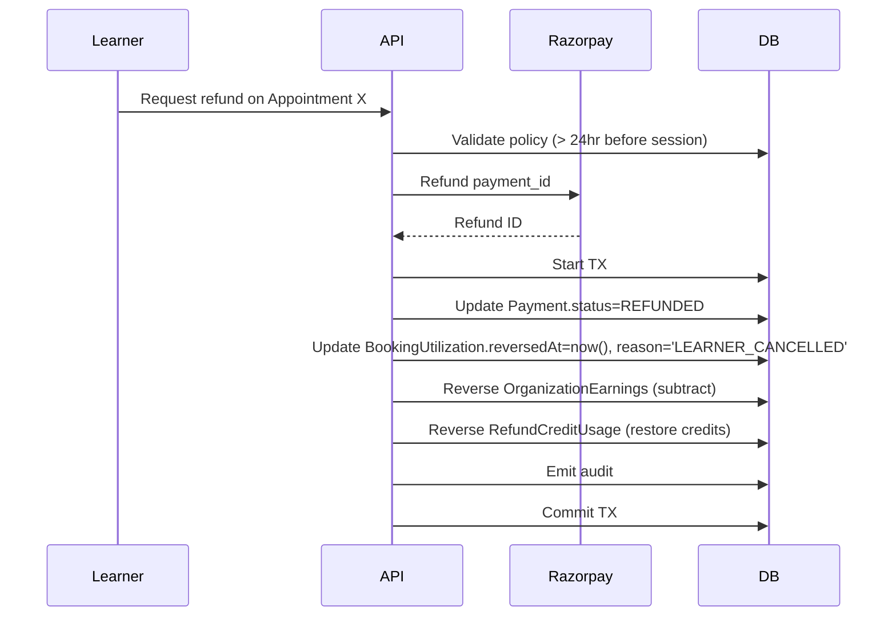

### 17.3 Refund flow (WALLET path)

- Same as PERSONAL, but instead of a Razorpay refund call, the org's WALLET account is credited back inside the journal.
- A `refund:<refundId>` ledger txn (kind `REFUND`) reverses the original booking legs proportionally — for a WALLET-funded booking that means `Cr WALLET(org)` against the reversed fee/payable/GST legs, restoring the org's derived `walletBalance`.

### 17.4 Refund flow (INVOICE path)

- Invoice **not yet issued**: remove the PaymentLeg and accrual. Invoice at month-end will be lower.
- Invoice **already issued**: a `CreditNote` is minted (see § 17.6). This is no longer manual reconciliation — credit-note issuance is live.

### 17.5 Refund policy matrix

How much is refunded — and how much the consultant keeps — depends on when the cancellation happens relative to the session. The matrix below is the policy applied at refund time.

| Cancellation timing | Refund amount | Consultant earnings |
|---|---|---|
| > 24 hours before session | 100% | Reversed (0% to consultant) |
| < 24 hours before session | 50% | 50% to consultant (kept for holding time) |
| No-show by learner | 0% | 100% to consultant (consultant showed up) |
| No-show by consultant | 100% | 0% + strike |

### 17.6 The refund cascade & credit-note unification (#776)

Every refund fans out through one function — **`applyRefundCascade(tx, input)`** ([refunds §2](../10-money-and-ledger/10-refunds.md)) — that reverses every downstream money record in a single atomic body: it reverses the `PaymentLeg`s (a WALLET leg credits the org wallet, an unbilled accrual is netted down in place, a paid invoice defers to clawback), releases the `BookingUtilization` engagements, increments the append-only refunded columns on `ConsultantEarnings`/`OrganizationEarnings`, claws back a `COMPLETED` `OrganizationPayout` where one exists, mints a GST credit note for any invoiced portion, and posts a balanced `REFUND` ledger transaction. It is invoked from three trigger paths — the gateway `refund.processed` webhook, the `cascade-refund-earnings` backstop cron (every 15 min), and the in-app refund call — that all converge on the same body.

Every refund that needs a tax document routes through that same idempotent path. The credit note gets its **own per-org numbering** — independent of the invoice series, satisfying CGST Rule 53's separate-series requirement — so the credit-note sequence is auditable on its own and never collides with invoice numbers, and each note links back to its originating `OrganizationInvoice`.

- **Idempotency.** `Refund.cascadedAt` is the single gate. The cascade's first act flips it from `null` to `now()` with a conditional `updateMany where cascadedAt: null`; exactly one caller wins the claim and everyone else short-circuits as a no-op. This stops a retried webhook or a re-run cron from double-cascading earnings reversal or minting duplicate credit notes.
- **Honesty flag — TDS is NOT reversed.** `TdsAdjustment` is a **schema-only** model. The refund cascade writes **no** tax-adjustment rows: it does not reverse TDS withheld at the original payout. Do not describe TDS-on-refund as live — the table exists for a future wiring, nothing populates it today (🟡). For the regulatory shape of refund/chargeback tax adjustments, see [docs/compliance/05-refund-and-chargeback-tax-adjustments.md](../../compliance/05-refund-and-chargeback-tax-adjustments.md).

### 17.7 Disputes & chargebacks

A refund is something we initiate; a **dispute** is something a cardholder's bank forces on us, and it has its own machine. `DisputeStatus` carries **eight** values in three clusters: the early-warning cluster (`WARNING_NEEDS_RESPONSE`, `WARNING_UNDER_REVIEW`, `WARNING_CLOSED`) models a pre-chargeback fraud alert that can still escalate; the active cluster (`NEEDS_RESPONSE`, `UNDER_REVIEW`) is a live chargeback awaiting our evidence and the bank's review; and the terminal cluster (`WON`, `LOST`, `CHARGE_REFUNDED`) records the verdict and is final — `isLegalDisputeTransition` rejects any outgoing edge so a replayed webhook can never re-drive the side effects.

The subtlety is that the gateway doesn't speak our enum. Razorpay models a dispute along **two independent axes** — a `status` (`open`, `under_review`, `won`, `lost`, `closed`) and a `phase` (`fraud`, `retrieval`, `chargeback`, `pre_arbitration`, `arbitration`) — and our handler (`mapDisputeStatus`) collapses both onto the single `DisputeStatus`. When a dispute opens, the linked earnings are frozen `→ HELD`; a seller-favourable `won` releases them back to `READY`, and a `lost` cascades into an earnings refund plus an org chargeback. Several handler mappings have known gaps (a `closed` event mis-maps to `NEEDS_RESPONSE`; `under_review` and `action_required` are not dispatched) — these are flagged in [disputes §4](../10-money-and-ledger/11-disputes.md), which holds the full state diagram, the status×phase mapping table, and the contest/accept API mechanics.

---
---

# PART V — THE COMPLIANCE LAYER

This Part walks the six Indian regulations enterprise has to satisfy, one section each. They split into two families: **data-protection** (DPDP — how we handle personal data) and **tax/finance** (GST, TDS, MSME, FEMA, IRN — how money is taxed, withheld, paid on time, sent abroad, and e-invoiced). Each acronym is expanded at the top of its own section; you can read any one in isolation.

## 18. DPDP — India's Data Protection Act

The Digital Personal Data Protection Act, 2023. The Act was passed in 2023, but its **operational duties bind from 13 May 2027** (the DPDP Rules, 2025 set a phased commencement, and the consent/notice/breach-reporting/data-principal-rights obligations carry an 18-month runway from rule notification). We treat that date as the compliance deadline for the consent, export, erasure, and breach machinery below — schema and the easy paths are built today; the remaining manual paths must be automated before it bites.

### 18.1 What DPDP requires

- **Lawful grounds for data processing.** Consent is the most common.
- **Data minimization.** Collect only what you need.
- **Right to erasure (§12).** User can request data deletion.
- **Consent recording.** Must be explicit + auditable.
- **Data breach notification (§8).** Report within 72 hours.

### 18.2 How Familiarise implements DPDP

Each row maps a statutory DPDP obligation to the specific model, route, or cron that satisfies it, making it straightforward to answer a compliance audit question without having to trace through source files.

| Requirement | Implementation |
|---|---|
| Consent recording | `ConsentArtifact` model, SHA-256 hash of full policy text at consent time |
| Per-user consent log | `/api/organizations/[orgId]/consent` routes + `DataRegion` on Organization |
| Right to access (§11) | Org-wide export via `OrgDataExportJob` (`PENDING → PROCESSING → READY → FAILED → EXPIRED`); gated by `requireOrgBillingAdminOrOwner`, drained by the `process-data-exports` cron. See [data-export](../40-compliance-and-data/03-data-export.md). |
| Right to erasure (§12) | Manual process in v1 (admin runs deletion script). Future: automated endpoint. See [deletion-policy](../40-compliance-and-data/02-deletion-policy.md). |
| Data breach log | `DataBreach` model (schema-final, admin UI pending); `databreach-deadline-alerts` cron watches the 72-hour clock. |

> Note the model is `OrgDataExportJob` (a job row, not a static `OrgDataExport`); the export is delivered as a single JSON object. Right-to-access (§11, "give me my data") is distinct from right-to-erasure (§12, "delete my data") — they are different DPDP sections with different machinery.

### 18.3 Consent artifact flow

```mermaid
flowchart TD
    U[User signs up] --> Modal[Consent modal displayed]
    Modal --> Accept[User clicks Accept]
    Accept --> API[POST /api/organizations/consent]
    API --> Hash[buildConsentArtifact: SHA-256 hash of policy text]
    Hash --> DB[Create ConsentArtifact row userId, policyVersion, hash, grantedAt]
    DB --> Audit[OrgAuditLog: CONSENT_GRANTED]
    Audit --> Continue[Onboarding continues]
```

### 18.4 Consent withdrawal

- User can withdraw via settings.
- Withdrawal triggers re-prompt on next action (no silent disable).
- Audit entry CONSENT_WITHDRAWN.

---

## 19. GST — indirect taxation

Indian Goods and Services Tax (GST) applies to almost everything.

### 19.1 GST rates on Familiarise services

GST on all of Familiarise's service lines is **18%**. The SAC *classification* (which code, for the ITC trail) is the subtle part and is owned by [docs/compliance/02-gst-overview.md](../../compliance/02-gst-overview.md) — defer to it for the authoritative codes rather than this table. In short: `999293` is *commercial training & coaching* (a 9992-group education code), while management **consulting** is `998311`. They all carry 18%, so the rate is never in question — but the old "999293 = consulting" labelling is a classification inaccuracy, not a tax-amount one.

| Service | SAC (see compliance/02) | GST rate |
|---|---|---|
| Mentorship / consulting services | 998311 (consulting) | 18% |
| Training / educational services (if qualifying) | 999293 (training/coaching) | 18% (or exempt for some qualifying education) |
| Platform commission (B2B) | per supply | 18% |

### 19.2 Invoice requirements

Every B2B invoice must have:

- Invoice number (format: `INV-<orgId>-<timestamp>-<hex>`).
- GSTIN of supplier (Familiarise) + recipient (org) if registered.
- HSN code.
- Place of supply (state code).
- Tax rate + breakdown (CGST/SGST if intra-state, IGST if inter-state).
- Total + breakdown in both INR and display currency (if applicable).

### 19.3 Reverse charge mechanism (RCM)

For inbound SaaS bought by Familiarise (Claude API, Apple Developer, etc.), we pay GST under RCM (18%) and claim as Input Tax Credit (ITC) if we're GST-registered.

---

## 20. TDS — tax deducted at source

Direct tax withheld from consultant payouts.

> **Renumbering watch (verified 2026-06-05).** The **Income-tax Act, 2025** came into force **1 Apr 2026** and consolidates every non-salary TDS provision into a single **Section 393** (keyed by numeric payment codes, the 10xx series); the old alphanumeric citations — 194J, 194C, 195, 194-O, 206AA — **cease to exist as filing citations** for transactions on/after that date. **Rates and thresholds are unchanged** — only the citation/form taxonomy moved. Our code still *labels* withholding as `194J` etc., so the **filing layer will need a section→payment-code mapping**. This is owned by [docs/compliance/01-tds-overview.md](../../compliance/01-tds-overview.md) — defer to it; the table below keeps the familiar (1961-Act) names purely for reader recognition.

### 20.1 Section applicability (1961-Act names; see compliance/01 for the §393 codes)

Rows cover each consultant category Familiarise encounters, mapping the familiar 1961-Act citation to its Income-tax Act 2025 §393 successor and the applicable withholding rate — the marketplace row (194-O → 0.1%) is the one most likely to surprise engineers used to the standard 10% professional rate.

| Consultant type | Section (old → 2025 Act) | Rate |
|---|---|---|
| Resident Indian consultant, professional | 194J → §393(1) Sl.6(iii) | 10% |
| Resident Indian consultant, non-professional | 194C → §393(1) Sl.6(i) | 1-2% |
| Marketplace seller (platform-facilitated gross) | 194-O → §393 (e-commerce code) | **0.1%** |
| Non-resident consultant | 195 → §393(2) Sl.17 (DTAA-dependent) | 5-20% |
| PAN not provided (general) | 206AA → §397(2) | 20% |
| PAN not provided (194-O / marketplace) | 206AA → §397(2) | **5%** |

The marketplace row matters because Familiarise *is* an e-commerce operator facilitating payments to sellers: the **194-O equivalent rate is 0.1%** of gross (not 1%), and under that regime a seller with no PAN is withheld at **5%** under §397(2) (the §206AA reduced rate for 194-O), not the general 20%.

### 20.2 Current implementation

- `lib/compliance/tds.ts` returns stub 10% rate.
- `OrganizationPayoutAccount.pan` + `OrganizationPayoutAccount.residencyStatus` fields exist.
- TDS withheld at payout creation; `OrganizationPayout.tdsWithheldPaise`.
- Form 26Q (quarterly) filing: admin endpoint exists, actual filing manual in v1.

### 20.3 Roadmap

Live TDS derivation (Part VII § 32 of the Phase 2 epic):

1. Look up PAN → residency → applicable section.
2. Apply DTAA treaty rates for non-residents.
3. Fallback 20% for missing/invalid PAN.

---

## 21. MSME — vendor payment timing

MSME (Micro, Small & Medium Enterprises) Act, §15.

### 21.1 What MSME requires

If your payee is MSME-registered + has a written agreement, you must pay within **45 days** of invoice date. Beyond 45 days, interest accrues at 3x RBI bank rate.

### 21.2 Familiarise's MSME exposure

- Platform → Consultant: consultants may be MSME-registered (freelancers).
- Platform → Supplier: SaaS vendors (less common; most are tech companies).

### 21.3 Current implementation

- `OrganizationPayoutAccount.msmeStatus` + `Contract.writtenAgreementExists` (planned).
- `lib/compliance/msme.ts` returns `invoiceDate + 60 days` as deadline (stub).
- **Risk:** if we pay an MSME consultant past 45 days, we accrue interest liability.

### 21.4 Roadmap

Live MSME deadline derivation:

1. If MSME status true + written agreement true → 45 days.
2. Else standard commercial terms (typically 60 days).
3. Track OVERDUE invoices; admin alert.

---

## 22. FEMA — foreign exchange

Foreign Exchange Management Act, governing cross-border payments.

### 22.1 What FEMA requires

- Outbound payments to non-residents: via RBI-authorized rails (Razorpay IBT, Wise, SWIFT).
- Remittance receipt (FIRC equivalent) must be tracked.
- TDS under DTAA rules.

### 22.2 Current implementation

- Minimal — international payouts via Stripe Connect (which handles FEMA compliance itself).
- Razorpay IBT not yet wired.
- RBI reporting: manual.

### 22.3 Roadmap

Live FEMA-compliant payout splitting:

1. Residency classification at payout creation.
2. Route to appropriate rail (Razorpay domestic / IBT / Wise / Stripe Connect).
3. Persist remittance receipts.

---

## 23. IRN — e-invoicing

Invoice Reference Number (IRN) is required for B2B invoices above ₹5cr turnover.

### 23.1 What IRN requires

- Every B2B invoice uploaded to the GSTN Invoice Registration Portal (IRP) within 30 days of issue.
- IRP returns IRN + ackNumber + signedQrPayload — all must be printed on the invoice.
- 24-hour cancellation window.

### 23.2 Current implementation

- Schema-final: `OrganizationInvoice.irn`, `ackNumber`, `ackDate`, `signedQrPayload`, `irpStatus`, `irpRetryCount`, `irpLastError`.
- The **payload mapper is live** — `lib/compliance/irp.ts` builds the IRP request and a ClearTax GSP connector is wired; `jobs/compliance/irp-uploader.ts` drives it, gated by **`ENABLE_IRP_UPLOADER`**. With the flag off (default), the job short-circuits with `{ status: "FAILED", reason: "STUB" }` so CI doesn't burn minutes hitting a stubbed connector. This is a deliberate gate, not missing code.
- `irpStatus` states: PENDING → UPLOADED / FAILED.
- **Worked example (Wipro):** the seeded `wipro` org carries a DRAFT `OrganizationInvoice` with `irn=null` and `irpStatus=PENDING` — exactly the pre-upload state. If Wipro were above the AATO threshold and the flag were on, the uploader would map that invoice (GSTIN `29AABCW1234K1Z5`, place-of-supply KA) into the IRP request, receive the IRN + ackNumber, and flip `irpStatus → UPLOADED`. Today the flag is off, so it stays `PENDING` — correct, because Wipro's design-partner profile is sub-₹5cr and doesn't yet need an IRN.
- **Who it's for:** only orgs at **AATO ≥ ₹5 crore** need IRN at all (threshold unchanged as of 2026-06-05; a separate 30-day IRP-reporting cut-off bites at ₹10 cr). The pre-launch cohort is sub-₹5cr, so this is not launch-blocking. Authoritative thresholds live in [docs/compliance/02-gst-overview.md](../../compliance/02-gst-overview.md).

### 23.3 Who needs IRN

This two-row lookup maps annual aggregate turnover bands to the IRN obligation, establishing at a glance that the pre-launch cohort falls below the ₹5 crore threshold and is therefore exempt.

| Org turnover | IRN required? |
|---|---|
| < ₹5 crore | No (exempt) |
| ≥ ₹5 crore | Yes |

For pre-launch cohort (likely sub-₹5cr turnover), IRN is not launch-blocking.

### 23.4 Roadmap

Pick one aggregator (ClearTax / Masters India / IRIS) and wire the REST API in `jobs/compliance/irp-uploader.ts`.

---
---

# PART VI — THE TECHNICAL LAYER

## 24. Prisma schema overview

The enterprise-flavored section of `prisma/schema.prisma` is ~1200 lines covering ~25 models + ~15 enums. Grouped:

### 24.1 Core identity

The five rows here form the tenant-and-membership foundation that every other enterprise model references via foreign key; `OrgWorkspaceProfile` is lazy-created rather than eagerly seeded, which matters when bootstrapping test fixtures.

| Model | Purpose |
|---|---|
| `Organization` | The tenant; canSponsor + canHost + hierarchy |
| `Membership` | User-to-org relationship with role |
| `Member` | BetterAuth-compat bridge row |
| `Invitation` | Pending / accepted / revoked invites |
| `OrgWorkspaceProfile` | Lazy-created for any user creating an org |

### 24.2 Billing & funding

Eight models cover the full funding and invoicing stack; pay particular attention to the dunning fields on `OrganizationInvoice` and the auto-top-up fields on `BillingAccount`, as these are the operationally sensitive knobs most likely to need tuning in production.

| Model | Purpose |
|---|---|
| `BillingAccount` | Per-org (canSponsor=true) funding record; `walletBalance` is a derived cache of the org's WALLET ledger account. Wallet-floor / auto-top-up fields: `minBalancePaise`, `autoTopUpEnabled`, `autoTopUpAmountPaise`, `autoTopUpMandateId`, `autoTopUpLastFiredAt` (#777 §C) |
| `Contract` | Legal + commercial agreement. Lifecycle fields: `autoRenew`, `autoRenewedAt`, the supersession chain (`supersededByContractId` / `supersededAt`), `ContractSupersessionType` {AMENDMENT, RENEWAL, TERMINATION_REPLACEMENT} (#779 §A) |
| `BillingSubscription` | Recurring subscription (LICENSE mode) |
| `WalletTopUp` | Wallet funding attempt (`providerOrderId` unique; PENDING/CONFIRMED/FAILED); replaced `WalletEntry` in #772 |
| `OverageEvent` | Per-over-cap charge: `basePaise + surchargePaise = marginalPaise`; `OverageChargeStatus` machine (#777 §C) |
| `CreditNote` | Refund credit note with per-org numbering independent of the invoice series (#776) |
| `PurchaseOrder` | PO tracking |
| `OrganizationInvoice` | Monthly invoice (+ dunning fields: `markedOverdueAt`, `dunningReminderCount`, `dunningSuspendedAt`) |

### 24.3 Program entitlement

These five models govern the commercial package and its per-member, per-cycle assignment lifecycle; `configLockedAt` and `rolledAt` are the idempotency anchors you should check first whenever a cap or rollover behaves unexpectedly.

| Model | Purpose |
|---|---|
| `Program` | The commercial package. `configLockedAt` freezes `LOCKED_PROGRAM_FIELDS` at first assignment; `archivedAt` soft-hides (#777 §B) |
| `LicensedSeatConfig` | Sub-config for LICENSED_SEAT (+ `maxOveragePerCyclePaise` circuit breaker) |
| `CreditPoolConfig` | Sub-config for CREDIT_POOL (+ `maxOveragePerCyclePaise`) |
| `ProgramAssignment` | Per-cycle per-member entitlement; `AssignmentStatus` {ACTIVE, ROLLED, PAUSED, CLOSED, CANCELLED} + `rolledAt` rollover idempotency (#779 §A/§B) |
| `BookingUtilization` | Per-booking consumption record |

### 24.4 Revenue, earnings, payout

These four models capture the full earnings and settlement chain — from the three-way rate-card split on a session through projected org earnings to the batch payout and the bank account that receives it.

| Model | Purpose |
|---|---|
| `RateCard` | 3-way split (integer `shareBps` / `revenueShareBps`; Float `sharePercentage` / `revenueSharePercentage` removed in #772) with effective dates |
| `OrganizationEarnings` | Per-session earnings projection for canHost orgs (derived from the journal's ORG_PAYABLE legs) |
| `OrganizationPayout` | Batch settlement |
| `OrganizationPayoutAccount` | Bank details + compliance fields |

### 24.5 Compliance

This group of models implements DPDP obligations and HRIS integration; `TdsAdjustment` is schema-final but carries no rows yet, which is the key signal that TDS refund adjustments are deliberately deferred without blocking launch.

| Model | Purpose |
|---|---|
| `ConsentArtifact` | DPDP consent record |
| `DataBreach` | DPDP incident log |
| `OrgDataExportJob` | DPDP §11 right-to-access export job (`OrgDataExportStatus` {PENDING, PROCESSING, READY, FAILED, EXPIRED}) |
| `TdsAdjustment` | **Schema-only** refund tax-adjustment placeholder — no rows written yet (#776) |
| `HrisConfig` | HRIS integration config |
| `HrisSyncJob` | Sync job record |
| `HrisEmployeeMap` | HRIS-to-member mapping |

### 24.6 Identity & SSO

These four models underpin single-sign-on, email-domain routing, and outbound webhook delivery; the `breakGlassUntil` and `previousSecretHash` fields call out the escape-hatch and secret-rotation windows that operators most commonly need to know when something breaks.

| Model | Purpose |
|---|---|
| `OrganizationSSOSettings` | Per-org SSO config; `enforceSSO` + `breakGlassUntil` (OWNER-set 1-72h escape window, #779 §E) |
| `SsoProvider` | SAML/OIDC provider |
| `OrgDomainClaim` | Email domain → org mapping |
| `WebhookEndpoint` | Per-org outbound webhook target; secret rotation via `secretRotatedAt` + `previousSecretHash` (24h dual-sign grace). Deliveries: `OutboundWebhookDelivery` |

### 24.7 Audit + ledger

Rows cover the six models that form the immutable audit and double-entry money journal; note that `UsageLedgerEntry` tracks session entitlement consumption and is explicitly not a money model — a distinction that matters for reconciliation.

| Model | Purpose |
|---|---|
| `OrgAuditLog` | Immutable action log |
| `UsageLedgerEntry` | Session consumption (entitlement) ledger — NOT money |
| `LedgerAccount` | One balance account per `(kind, org, consultant, currency)`; deterministic id |
| `LedgerTransaction` | A balanced money posting; unique `idempotencyKey`, free-String `kind` |
| `LedgerEntry` | One leg of a transaction (DEBIT/CREDIT, positive `amountPaise`) |
| `LedgerReconciliationReport` | Read-only audit output |

> The money journal (`LedgerAccount` / `LedgerTransaction` / `LedgerEntry`) replaced `FundingLedgerEntry` and `SettlementLedgerEntry` in #772.

### 24.8 Enums quick reference

```
OrgStatus: PENDING_VERIFICATION | ACTIVE | SUSPENDED | DEACTIVATED
MemberRole: OWNER | MAINTAINER | BILLING_ADMIN | MANAGER | EXPERT | LEARNER | SUPPORT
MemberStatus: PENDING | ACTIVE | SUSPENDED | REMOVED
FundingSource: PERSONAL | WALLET | INVOICE | LICENSE
ProgramType: LICENSED_SEAT | CREDIT_POOL | PROJECT* | RETAINER*
AssignmentStatus: ACTIVE | ROLLED | PAUSED | CLOSED | CANCELLED
ContractStatus: DRAFT | ACTIVE | TERMINATED | EXPIRED
ContractSupersessionType: AMENDMENT | RENEWAL | TERMINATION_REPLACEMENT
OrgInvoiceStatus: DRAFT | ISSUED | PAID | OVERDUE | VOID | CANCELLED | REFUNDED
OverageBehavior: BLOCK | CHARGE_MEMBER | CHARGE_ORG
OverageChargeStatus: PENDING | ACCRUED | CHARGED | BLOCKED | REVERSED | FAILED
OrgDataExportStatus: PENDING | PROCESSING | READY | FAILED | EXPIRED
IrpStatus: PENDING | UPLOADED | FAILED
PayoutArrangement: DIRECT | AOR* | EOR*
* = reserved but not yet implemented
```

---

## 25. API route structure & discipline

### 25.1 Route tree

```
/api/organizations
├── /                       (GET list, POST create)
├── /invitations/accept     (POST)
└── /[orgId]
    ├── /                   (GET, PATCH, DELETE)
    ├── /members            (GET list, POST add)
    │   └── /[memberId]     (GET, PATCH, DELETE)
    ├── /invitations        (GET list, POST send)
    │   └── /[invitationId] (GET, DELETE)
    ├── /contracts          (GET, POST)
    │   └── /[contractId]   (GET, PATCH=end-early/terminate, DELETE)
    │       └── /supersede  (POST — AMENDMENT|RENEWAL, OWNER)
    ├── /programs           (GET, POST)
    │   └── /[programId]
    │       ├── /           (GET, PATCH, DELETE=archive)
    │       └── /assignments (GET, POST)
    │           └── /[assignmentId] (GET, PATCH, DELETE)
    ├── /billing-account    (GET, PATCH — OWNER∨BILLING_ADMIN)
    │   ├── /wallet         (GET)
    │   ├── /wallet/top-ups (GET, POST)
    │   │   └── /[topUpId]  (GET)
    │   ├── /invoices       (GET, POST)
    │   │   └── /[invoiceId] (GET, PATCH + /pay)
    │   └── /purchase-orders (GET, POST)
    ├── /checkout/overage-preview (POST — pre-checkout cost preview)
    ├── /payout-account     (GET, PATCH)
    ├── /earnings           (GET)
    ├── /payouts            (GET, POST)
    ├── /rate-cards         (GET, POST — OWNER∨BILLING_ADMIN)
    ├── /sso                (GET, PATCH)
    │   ├── /providers      (GET, POST, etc.)
    │   └── /break-glass    (POST — OWNER, 1-72h enforceSSO bypass window)
    ├── /domain-claims      (GET, POST, DELETE)
    ├── /verification/resubmit (POST — MAINTAINER, re-submit after rejection)
    ├── /webhooks           (GET, POST)
    │   └── /[endpointId]   (GET, PATCH, DELETE)
    │       ├── /rotate-secret (POST — 24h dual-sign grace)
    │       └── /deliveries (GET; /[deliveryId]/redeliver POST)
    ├── /data-exports       (GET, POST — DPDP §11; /[exportId]/download GET)
    ├── /consent            (GET, POST)
    ├── /hris               (GET, PATCH)
    ├── /activity           (audit log)
    ├── /catalog            (org plans)
    ├── /analytics          (aggregated metrics)
    ├── /branding/[asset]   (logo/banner upload)
    └── /settings           (thin projection of org)
```

### 25.2 Route discipline (enforced on every mutation)

```
1. requireOrgAccess(orgId, <role>) gate
2. Zod-validate body
3. Open prisma.$transaction (Serializable if money-touching)
4. Verify cross-org FK ownership INSIDE the TX
5. Perform the mutation
6. Emit OrgAuditLog entry
7. Commit TX
8. Return response
```

### 25.3 Status code conventions

This reference covers every HTTP status code the enterprise API surface returns and the semantic condition it signals, so client authors and API reviewers have a single canonical mapping to check against.

| Code | Meaning |
|---|---|
| 200 | Read success |
| 201 | Created |
| 204 | Deleted |
| 400 | Validation error (Zod fail) |
| 401 | Not authenticated |
| 403 | Authenticated but lacks role / capability |
| 404 | Resource doesn't exist / feature off |
| 409 | State-machine violation / idempotency conflict |
| 429 | Rate-limited |
| 500 | Unexpected error |

---

## 26. Auth gates & RBAC

### 26.1 The central helper

```typescript
requireOrgAccess(orgId: string, options?: {
  minimumRole?: MemberRole;
  canSponsor?: boolean;
  canHost?: boolean;
})
```

Returns either `{ error: NextResponse }` (reject) or `{ member, org, session }` (allow).

### 26.2 Role check order

```mermaid
flowchart TD
    Start[requireOrgAccess called] --> Auth{User authenticated?}
    Auth -->|No| R401[Return 401]
    Auth -->|Yes| OrgLookup[Lookup org by orgId]
    OrgLookup --> OrgExists{Org exists?}
    OrgExists -->|No| R404a[Return 404]
    OrgExists -->|Yes| Member[Lookup user's Membership in this org]
    Member --> MemberExists{Has active membership?}
    MemberExists -->|No, but user is platform ADMIN| Allow[Allow as admin]
    MemberExists -->|No| R403a[Return 403]
    MemberExists -->|Yes| RoleCheck{Role >= minimumRole?}
    RoleCheck -->|No| R403b[Return 403]
    RoleCheck -->|Yes| CapCheck{Org has required capability?}
    CapCheck -->|No| R404b[Return 404 feature off]
    CapCheck -->|Yes| Verify{Org status ACTIVE?}
    Verify -->|No| R409[Return 409 ORG_NOT_VERIFIED]
    Verify -->|Yes| Allow
```

### 26.3 The billing side-gate (#779 §A)

Money surfaces don't ride the `minimumRole` ladder. `requireOrgBillingAdminOrOwner` (`lib/auth/billing-admin-gate.ts`) admits **OWNER ∨ BILLING_ADMIN** and nobody else — MAINTAINER is deliberately shut out. It fronts rate-cards, purchase-orders, wallet top-ups, invoices (incl. `…/pay`), and the billing-account PATCH. Separately, `PATCH /api/organizations/[orgId]` enforces a **per-role field allowlist**, so the same route accepts different columns by caller (a MAINTAINER may set branding but not `fundingSource`). See § 9.2.1.

### 26.4 SSO enforcement & break-glass (#779 §E)

When `OrganizationSSOSettings.enforceSSO = true`, password login is vetoed server-side in `lib/sso/enforce-session.ts` — the session layer rejects any non-SSO session for a user whose email is in a claimed domain (not just a UI hint). The escape hatch is **break-glass**: an OWNER opens a `breakGlassUntil` window (1-72h, default 4h) via `POST /sso/break-glass`; while `breakGlassUntil > now`, the auth layer skips the `enforceSSO` gate so admins can recover from a misconfigured IdP without being locked out of their own org. This is the anti-lockout counterpart to "last SSO provider delete" (§ 9.4).

### 26.5 Verification resubmit loop (#779 §A)

A `PENDING_VERIFICATION` org that gets rejected isn't a dead end. The admin stamps `Organization.verificationRejectedAt` + `verificationReason`; the OWNER sees the reason in the banner, fixes the issue, and a MAINTAINER calls `POST /verification/resubmit`, which bumps `verificationSubmittedAt` and clears the reason. The org stays `PENDING_VERIFICATION` through the whole loop — there is **no** separate `RESUBMIT` status; the three timestamp columns carry the sub-state.

---

## 27. Transaction patterns & race safety

### 27.1 Isolation levels

- **Read Committed (default):** most reads + simple writes.
- **Serializable:** money-moving transactions (checkout, rate-card bump, payout creation) — prevents phantom reads.

### 27.2 Race patterns in enterprise

Each row names a concurrent-write scenario that could corrupt money or entitlement state, paired with the specific database-level technique that prevents it — useful when reviewing a new mutation for concurrency safety.

| Pattern | Mitigation |
|---|---|
| Two concurrent wallet top-ups | `BillingAccount.walletBalance` row lock during TX |
| Two concurrent LICENSED_SEAT assignments exceeding cap | Conditional SQL UPDATE `seatsUsed = seatsUsed + 1 WHERE seatsUsed < seatsTotal` |
| Two concurrent invoice payments | Idempotency on `Payment.paymentIntent` unique constraint |
| Concurrent rate card bumps | Row lock on Contract + atomic close-old-open-new |
| Concurrent invite acceptances | Unique constraint on (org, email, status='pending') |
| Concurrent checkouts on same slot | Distributed lock (Redis) + Serializable TX |

---

## 28. Audit logging

### 28.1 Why audit log matters

- Enterprise customers require audit trail (SOC 2, GDPR, internal security).
- Debugging: "when did this happen?" answered instantly.
- Legal: chain-of-custody for financial events.

### 28.2 OrgAuditLog fields

```
organizationId: String
actorMembershipId: String?   // null for system/cron events
targetMembershipId: String?  // optional target context
category: OrgAuditCategory   // MEMBER | CONTRACT | PROGRAM | ...
action: String               // free-form; AUDIT_ACTIONS constants preferred
description: String          // human-readable
details: Json?               // structured metadata
createdAt: DateTime
```

### 28.3 AUDIT_ACTIONS namespace

See `lib/enterprise/audit-actions.ts`. ~40 well-known action strings grouped by category:

```
MEMBER: MEMBER_ADDED, INVITE_SENT, INVITE_ACCEPTED, INVITE_EXPIRED, ...
CONTRACT: CONTRACT_CREATED, CONTRACT_SIGNED, ...
PROGRAM: PROGRAM_CREATED, PROGRAM_ASSIGNED, ...
WALLET: WALLET_TOPUP, WALLET_REFUND, ...
INVOICE: INVOICE_GENERATED, INVOICE_PAID, INVOICE_ROLLED_UP, ...
PAYOUT: PAYOUT_INITIATED, PAYOUT_PROCESSED, ...
SETTINGS: SETTINGS_CHANGED, SSO_ENABLED, DOMAIN_CLAIMED, SSO_CERT_EXPIRING, ...
CONSENT: CONSENT_GRANTED, DATA_BREACH_REPORTED, ...
SYSTEM: VERIFIED, SUSPENDED, HRIS_SYNC_STARTED, ...
```

### 28.4 Audit emit pattern (in every mutation)

```typescript
await tx.orgAuditLog.create({
  data: {
    organizationId: orgId,
    actorMembershipId: access.member.id,
    category: "MEMBER",
    action: AUDIT_ACTIONS.MEMBER.ROLE_CHANGE,
    description: `Changed role of ${target.user.email} from ${current.role} to ${patch.role}`,
    details: { from: current.role, to: patch.role, targetUserId: target.userId },
  },
});
```

---

## 29. Cron jobs & scheduled tasks

### 29.1 How scheduling actually works

These aren't platform cron entries — they're **GitHub Actions workflows** in `.github/workflows/*.yml`, each on a `schedule:` trigger, that `npx tsx` a script under `jobs/**` (~54 job scripts total). So "the cron" = a workflow YAML + the job it runs. Two consequences worth internalizing:

- A workflow can exist without its script (or vice-versa) — see the honesty flags below.
- Times are **UTC** in the YAML; IST shown for the India team is UTC + 5:30.

### 29.2 Enterprise-relevant crons (verified against `.github/workflows/` + `jobs/`, 2026-06-05)

**Billing**

| Workflow → job | UTC / IST | Purpose |
|---|---|---|
| `advance-program-cycles` → `jobs/billing/advance-program-cycles.ts` | 02:15 / 07:45 | Cycle engine: ROLL or CLOSE ended assignments (§ 8.8) |
| `generate-subscription-invoices` → `jobs/billing/generate-subscription-invoices.ts` | 01:00 / 06:30 | Daily subscription invoice generation; `concurrency` group guards overlap (§ 12 / invoicing doc) |
| `settle-invoice-accruals` → `jobs/billing/settle-invoice-accruals.ts` | 1st of month 04:00 / 09:30 | Monthly accrual + overage rollup; `ENABLE_CONSOLIDATED_INVOICE`-gated, Serializable in-tx read (§ 36) |
| `dunning` → `jobs/billing/dunning.ts` | 23:30 / 05:00⁺ | ISSUED→OVERDUE, 7-day reminders ≤3, then `ENABLE_DUNNING_SUSPEND`-gated suspend (§ 12 / invoicing doc) |
| `wallet-low-balance` → `jobs/billing/wallet-low-balance.ts` | 23:45 / 05:15⁺ | Wallet-floor watch — **notify-only today** (see § 29.4) |
| `timeout-member-overages` → `jobs/billing/timeout-member-overages.ts` | 23:00 / 04:30⁺ | 14-day CHARGE_MEMBER timeout → FAILED |

**Contracts**

| Workflow → job | UTC / IST | Purpose |
|---|---|---|
| `auto-renew-contracts` → `jobs/contracts/auto-renew-contracts.ts` | 02:30 / 08:00 | Renew `autoRenew` contracts (stamp `autoRenewedAt`) |
| `expire-contracts` → `jobs/contracts/expire-contracts.ts` | 03:00 / 08:30 | Expire past-term contracts; cascade programs/assignments |

**Cleanup**

| Workflow → job | UTC / IST | Purpose |
|---|---|---|
| `sweep-abandoned-overage-charges` → `jobs/cleanup/sweep-abandoned-overage-charges.ts` | 02:30 / 08:00 | Reap stale overage charges |
| `process-data-exports` → `jobs/cleanup/process-data-exports.ts` | every 10 min | Drain DPDP §11 export jobs |
| `dispatch-outbound-webhooks` → `jobs/cleanup/dispatch-outbound-webhooks.ts` | every 1 min | Deliver queued outbound webhooks; re-queues stale `IN_FLIGHT` rows by `updatedAt` and claims atomically so overlapping ticks can't double-deliver (#812) |
| `archive-webhook-events` → `jobs/cleanup/archive-webhook-events.ts` | Sun 00:00 | Roll off old webhook events |
| `sweep-stuck-webhook-events` → `jobs/cleanup/sweep-stuck-webhook-events.ts` | every 10 min | Re-drives stuck inbound `WebhookEvent` rows, including Razorpay refunds deferred because they arrived before capture (7-day give-up cap, #813) |
| `sso-cert-expiry-alert` → `jobs/cleanup/sso-cert-expiry-alert.ts` | 03:00 / 08:30 | Parse SAML X.509 `notAfter`, emit audit |
| `prune-audit-logs` → `jobs/cleanup/prune-audit-logs.ts` | 03:15 / 08:45 | Retention prune of `OrgAuditLog` |
| `release-pending-trust-earnings` → `jobs/cleanup/release-pending-trust-earnings.ts` | hourly :30 | Release `PENDING_TRUST` earnings |
| `cleanup-abandoned-org-top-ups` → `jobs/cleanup/cleanup-abandoned-org-top-ups.ts` | 02:00 / 07:30 | Reap stale PENDING `WalletTopUp` rows |

**Compliance**

| Workflow → job | UTC / IST | Purpose | Status |
|---|---|---|---|
| `irp-uploader` → `jobs/compliance/irp-uploader.ts` | 02:30 / 08:00 | IRN e-invoice upload | Live behind `ENABLE_IRP_UPLOADER`; short-circuits when off |
| `databreach-deadline-alerts` → `jobs/compliance/databreach-deadline-alerts.ts` | hourly :15 | DPDP 72-hour breach clock | Live |
| `msme-payment-alerts` → `jobs/compliance/msme-payment-alerts.ts` | 04:30 / 10:00 | MSME §15 payment-window alerts | Live |
| `jobs/compliance/consent-retention-sweeper.ts` | **UNSCHEDULED** | Consent retention sweep | 🟡 script exists, **no workflow** runs it |

**Refunds / reconcile / payouts**

| Workflow → job | UTC / IST | Purpose |
|---|---|---|
| `cascade-refund-earnings` → `jobs/refunds/cascade-refund-earnings.ts` | every 15 min | Cascade refund → earnings reversal (`cascadedAt` gate) |
| `reconcile-pending-refunds` → `jobs/refunds/reconcile-pending-refunds.ts` | every 15 min | Reconcile pending refunds with gateway |
| `reconcile-ledgers` → `jobs/reconcile/reconcile-ledgers.ts` | 03:45 / 09:15 | Nightly journal reconciliation (§ 14.6) |
| `create-payout-batch` → `jobs/payouts/create-payout-batch.ts` | Mon 20:00 / Tue 01:30 | Build weekly payout batch |
| `process-payouts` → `jobs/payouts/process-payouts.ts` | Mon 21:00 / Tue 02:30 | Dispatch payouts — gated org payout **parks at PENDING** unless `ENABLE_LIVE_PAYOUTS` (§ 16.4) |
| `reconcile-payout-status` → `jobs/payouts/reconcile-payout-status.ts` | every 6h | Reconcile payout status |
| `handle-stuck-payouts` → `jobs/payouts/handle-stuck-payouts.ts` | every 4h | Un-stick stalled payouts |

### 29.3 Honesty flags (workflow ↔ script mismatches)

- `jobs/billing/generate-subscription-invoices.ts` and `jobs/billing/settle-invoice-accruals.ts` now **both have workflows** (#813): the first runs daily at 01:00 UTC, the second monthly on the 1st at 04:00 UTC, each behind a `concurrency` group.
- The old `consolidated-invoice-rollup.yml` workflow + its missing `jobs/cleanup/consolidated-invoice-rollup.ts` script were **retired into `settle-invoice-accruals`** (#813), so the parent-child rollup runs there now (gated by `ENABLE_CONSOLIDATED_INVOICE`).
- `jobs/compliance/consent-retention-sweeper.ts` still exists with no workflow (above) — this one remains an open gap as of 2026-06-05.

### 29.4 Wallet floor / auto-top-up — notify-only today (#777 §C)

`BillingAccount` carries the auto-top-up shape — `minBalancePaise`, `autoTopUpEnabled`, `autoTopUpAmountPaise`, `autoTopUpMandateId`, `autoTopUpLastFiredAt`. **But the `wallet-low-balance` cron only *notifies*** when the balance dips below the floor; it does **not** charge the mandate. Auto-charge is wired in schema and intended, not active — do not tell a customer their wallet will auto-refill. (There is no `walletFloorPaise` column; the floor is `minBalancePaise`.)

### 29.5 Planning a new cron

1. Is this job financial? If yes, register it in `FINANCIAL_JOB_NAMES` in `lib/maintenance-cron.ts`.
2. What's the dedup window? (Dedup audit rows, dedup work — prefer a conditional `updateMany` on a stamp column as the lock.)
3. What's the failure mode? Alert vs silent retry.
4. What's the time slot? Stagger from other jobs to avoid Prisma connection contention.
5. Wire **both** halves: a workflow YAML *and* the `jobs/**` script — § 29.3 shows what happens when only one ships.

---

## 30. Webhooks & idempotency

Inbound gateway webhooks are how the authoritative money state actually arrives — a top-up confirms, a refund processes, a dispute opens — so the ingestion path is hardened against forgery and against the at-least-once delivery every gateway promises. The full pipeline (signature verification, persistence-and-dedup, asynchronous dispatch, and the stuck-event replay path) is documented in [payment-webhooks](../10-money-and-ledger/12-payment-webhooks.md); the essentials are below.

### 30.1 Webhook handlers

The two rows map each payment gateway to its Route Handler file and the full set of event types it processes, giving you the single lookup you need when tracing an incoming webhook signature failure or a missing state transition.

| Gateway | Handler | Events handled |
|---|---|---|
| Razorpay | `app/api/webhooks/razorpay/route.ts` | payment.captured, payment.failed, refund.created, refund.failed, subscription.charged, payout.processed, payout.reversed, dispute.* |
| Stripe | `app/api/webhooks/stripe/route.ts` | checkout.session.completed, payout.paid, dispute.* |

### 30.2 Signature verification & idempotency

Every inbound webhook is first **signature-verified**: `verifyWebhookSignature` computes `HMAC-SHA256(rawBody, RAZORPAY_WEBHOOK_SECRET)` as hex and compares it with the incoming `x-razorpay-signature` using `crypto.timingSafeEqual`, so the check can't be timed; a mismatch is rejected with HTTP 400 and logged as a tamper/misconfig signal (for `payout.*` events the route re-verifies against `RAZORPAYX_WEBHOOK_SECRET`).

Money state is then protected against at-least-once delivery at **three independent idempotency gates** (detailed in [payment-webhooks §2](../10-money-and-ledger/12-payment-webhooks.md)):

1. **`WebhookEvent.eventId`** (`@unique`, of the form `eventType:entityId`) — a redelivered event is caught at `logWebhookEvent` and skipped; a failed attempt can be retried, a >5-minute in-progress row is treated as abandoned and re-eligible.
2. **`Refund.cascadedAt`** — claims the refund side effects so exactly one caller runs the cascade (§ 17.6).
3. **`LedgerTransaction.idempotencyKey`** — per-flow keys (`topup:<orderId>`, `refund:<refundId>`, `invoicepaid:<invoiceId>`, …) make `postLedgerTxn` a no-op on a duplicate key, so even a handler that runs twice posts money once.

After verification the route persists the event, returns 200 immediately, and dispatches asynchronously; a `sweep-stuck-webhook-events` cron re-drives any row left unprocessed by a mid-callback crash.

### 30.3 PII scrub

Before logging webhook payloads, `scrubWebhookPayload()` redacts:

- Email addresses.
- Phone numbers.
- Payment method details (card numbers, CVV).
- Free-text notes from gateway.

### 30.4 Outbound webhooks & secret rotation

§§ 30.1–30.3 cover *inbound* gateway webhooks. Orgs can also register **outbound** endpoints (`/webhooks`, OWNER∨BILLING_ADMIN) that Familiarise signs and POSTs to; the `dispatch-outbound-webhooks` cron drains the queue every minute, with `sweep-stuck-webhook-events` and `archive-webhook-events` keeping it healthy. Deliveries are inspectable and individually re-deliverable (`/webhooks/[endpointId]/deliveries/[deliveryId]/redeliver`).

Rotating an endpoint's signing secret (`POST /webhooks/[endpointId]/rotate-secret`) is **zero-downtime**: the new secret is stamped (`secretRotatedAt`) and the prior secret's HMAC is stashed in `previousSecretHash`, so for a **24-hour grace** the dispatcher signs (and the receiver can verify) under **both** secrets. The customer updates their verifier any time inside that window without dropping a single delivery. See [outbound-webhooks](../40-compliance-and-data/04-outbound-webhooks.md).

---
---

# PART VII — FUTURE FEATURES & ROADMAP

This part describes features **not yet implemented** but planned. Schema elements are ready for some (reserved enum values); full implementation is tracked in **issue #703 Enterprise Phase 2 epic**. For the road *already* travelled — the audit-series chronology that built today's subsystem — see [Design history](../00-foundations/01-overview.md#design-history).

## 31. Programs v2 — PROJECT (milestone-driven)

### 31.1 Why

Current LICENSED_SEAT and CREDIT_POOL handle recurring / metered use cases well. But consulting engagements — where an org buys ONE big project with multiple milestones — don't fit either. Milestones trigger invoicing, not per-session use.

### 31.2 Real-world example

McKinsey-style engagement: client pays ₹10L over 6 months for a strategy project, broken into 4 milestones:

1. Discovery (₹2L, due month 1)
2. Design (₹3L, due month 3)
3. Build (₹3L, due month 5)
4. Handoff (₹2L, due month 6)

Sessions happen throughout. Invoicing triggers on client acceptance of each milestone.

### 31.3 Schema sketch

```prisma
model ProjectConfig {
  id              String  @id @default(uuid())
  programId       String  @unique
  program         Program @relation(fields: [programId], references: [id])
  totalPricePaise Int
  currency        Currency @default(INR)
  sowUrl          String?
  sowSignedAt     DateTime?
  sowSignedBy     String?
  deadline        DateTime?
  status          ProjectStatus @default(DRAFT)
  milestones      ProjectMilestone[]
}

enum ProjectStatus {
  DRAFT
  ACTIVE
  PAUSED
  COMPLETED
  CANCELLED
}

model ProjectMilestone {
  id              String @id @default(uuid())
  projectConfigId String
  title           String
  description     String? @db.Text
  deliverables    Json
  pricePaise      Int
  sequence        Int
  dueDate         DateTime?
  status          MilestoneStatus @default(PENDING)
  submittedAt     DateTime?
  acceptedAt      DateTime?
  acceptedBy      String?
  rejectedAt      DateTime?
  rejectionReason String? @db.Text
  invoiceId       String?
  invoice         OrganizationInvoice? @relation(fields: [invoiceId], references: [id])
}

enum MilestoneStatus {
  PENDING
  SUBMITTED
  ACCEPTED
  REJECTED
  CANCELLED
}
```

### 31.4 Booking path changes

When a PROJECT program is referenced at checkout:

- Pre-condition: the checkout MUST reference a `ProjectMilestone.id`.
- Without a milestone, booking has no price anchor → reject.
- Wallet / invoice-accrual debit is skipped (project bills per milestone).
- `BookingUtilization.priceAtBookingPaise = 0` (cost absorbed at milestone level).
- `PaymentLeg(source='PROJECT_MILESTONE', amount=0, sourceRef=milestoneId)`.

### 31.5 Milestone acceptance flow

```mermaid
sequenceDiagram
    participant O as Org OWNER
    participant API as /api/.../milestones/X/accept
    participant DB
    participant Inv as Invoice

    O->>API: Accept milestone
    API->>DB: Start TX
    API->>DB: Update MilestoneStatus.ACCEPTED
    API->>Inv: Generate OrganizationInvoice
    API->>DB: Link milestone.invoiceId
    API->>DB: Audit: PROGRAM_MILESTONE_ACCEPTED
    API->>DB: Commit TX
```

### 31.6 Effort estimate

~2 eng-weeks (schema + booking + invoicing + UI + tests).

---

## 32. Programs v2 — RETAINER (hours-committed)

### 32.1 Why

GLG-style: organizations commit to N hours/month of expert time with overage billing. Hour ledger, not session ledger.

### 32.2 Schema sketch

```prisma
model RetainerConfig {
  id                    String @id @default(uuid())
  programId             String @unique
  program               Program @relation(fields: [programId], references: [id])
  hourlyRatePaise       Int
  currency              Currency @default(INR)
  monthlyHoursCap       Int
  minimumMonthlyHours   Int
  overageBehavior       OverageBehavior @default(BLOCK)
  overageRatePaise      Int?
  rampDownMonths        Int @default(0)
  ledgerEntries         RetainerHourLedger[]
}

model RetainerHourLedger {
  id                    String @id @default(uuid())
  retainerConfigId      String
  retainerConfig        RetainerConfig @relation(fields: [retainerConfigId], references: [id])
  cycleStart            DateTime
  cycleEnd              DateTime
  committedHundredths   Int @default(0)  // minimum committed hours × 100
  consumedHundredths    Int @default(0)
  overageHundredths     Int @default(0)
  invoiceId             String?
  invoice               OrganizationInvoice? @relation(fields: [invoiceId], references: [id])
}
```

### 32.3 Booking path changes

When a RETAINER program is referenced:

- Resolve active `RetainerHourLedger` for current cycle (create if absent).
- Convert session duration to hundredths (1.5 hour = 150).
- Check against cap:
  - If `consumed + this < cap`: increment `consumedHundredths`; booking proceeds.
  - If exceeds cap + overageBehavior=BLOCK: 409 "retainer cap reached".
  - If exceeds cap + overageBehavior=ALLOW_WITH_OVERAGE: increment `overageHundredths`.
- PaymentLeg(source='RETAINER_HOURS', amountPaise=hoursConsumed × hourlyRate / 100).

### 32.4 Month-end invoicing

```mermaid
sequenceDiagram
    participant Cron as retainer-monthly-invoice
    participant DB

    Cron->>DB: Find ledgers with cycleEnd < now()-1h AND invoiceId IS NULL
    loop each ledger
        Cron->>DB: Compute billable = max(consumed, minimum) + overage
        Cron->>DB: Create OrganizationInvoice with 2 line items:<br/>1. Committed hours at base rate<br/>2. Overage hours at overage rate
        Cron->>DB: Update ledger.invoiceId
        Cron->>DB: Create next cycle's ledger
    end
```

### 32.5 Effort estimate

~2 eng-weeks.

---

## 33. RESELL capability (multi-tier marketplaces)

### 33.1 Why

"Reseller" = an org buys from the platform and resells to its own clients. Example: Wipro buys 1,000 seats from Familiarise and resells 100 to each of 10 client companies.

### 33.2 Current status

Not implemented. Not priority. A `capabilitiesExtra Json?` escape hatch was sketched for this but never added to the schema (ADR 18); prototyping resale would start with a typed `canResell` boolean instead.

### 33.3 Effort estimate

~4 eng-weeks. Deferred indefinitely.

---

## 34. AOR / EOR (employer-of-record flows)

### 34.1 Why

Agent-of-record (AOR) and Employer-of-record (EOR) patterns are common in US freelance marketplaces — the platform acts as the consultant's tax/employment proxy. Less common in India.

### 34.2 Schema status

`PayoutArrangement` enum has `AOR` and `EOR` reserved. No handler code.

### 34.3 Deferred

Low priority for India launch. Revisit if we expand to US.

---

## 35. Multi-currency + international payouts

### 35.1 Why

Today: INR-centric. Orgs whose `contractCurrency` is USD/EUR/GBP route through Stripe and don't fully use Razorpay UPI moat.

### 35.2 What needs to change

- Gateway auto-routing: Razorpay domestic for INR, Razorpay IBT for USD/EUR outbound, Stripe as fallback.
- FX rate capture at invoice time (already supported in schema via `OrganizationInvoice.fxRateUsed`).
- Settlement currency alignment.

### 35.3 Effort estimate

~1.5 eng-weeks.

---

## 36. Consolidated invoicing (parent-child)

### 36.1 Current status

Schema ready: hierarchy is `Organization.parentOrganizationId` + the denormalized `rootOrganizationId` (group root for fast subsidiary scoping). **There is no `depth` column and no hierarchy helper lib** — scoping is done with the two FK columns directly. See [hierarchy](../00-foundations/06-hierarchy.md).

**Wired behind a flag (#813).** The parent-child rollup now runs as part of `jobs/billing/settle-invoice-accruals.ts` (the standalone `consolidated-invoice-rollup` job was retired into it, § 29.3), scheduled monthly on the 1st at 04:00 UTC and gated by `ENABLE_CONSOLIDATED_INVOICE` — so it is a no-op until that flag is set for a parent-child tenant. The rollup reads its accrual set inside a Serializable transaction, so two overlapping runs can't double-issue the parent invoice.

### 36.2 Use case

Wipro Ltd (parent) has three business units as child orgs:
- Wipro Consulting (child)
- Wipro Engineering (child)
- Wipro Product (child)

Each child has its own CREDIT_POOL + its own invoices. At month-end, the parent rollup cron aggregates children's ISSUED invoices into a single parent invoice. Wipro Ltd finance processes ONE invoice instead of three.

### 36.3 Status

Schema + workflow scaffolding present; the rollup **job script is missing** (§ 29.3), so it does not run. Needs the job implemented before the first parent-child tenant.

---

## 37. HRIS integration (live sync)

### 37.1 Vision

Auto-sync `Membership` rows from Workday / BambooHR / Rippling. When an employee is hired / terminated / moved, the org's Familiarise membership updates automatically.

### 37.2 Schema status

Final: `HrisConfig`, `HrisSyncJob`, `HrisEmployeeMap` models exist. Logic stubbed.

### 37.3 Effort

~2 eng-weeks per adapter.

---

## 38. Org-scoped notifications (bell)

### 38.1 Current gap

`components/notifications/NotificationInbox.tsx` is user-scoped via Novu (`subscriberId: session.user.id`). Zero `organizationId` references in Novu workflows.

### 38.2 Events to wire

Each row is a lifecycle event that should produce an org-scoped bell notification once Novu workflows carry an `organizationId`; reading across a row tells you who receives it and what server-side action fires the send.

| Event | Recipients | Trigger |
|---|---|---|
| INVITE_SENT | Invitee (email) | POST /invitations |
| INVITE_ACCEPTED | MAINTAINER+ | POST /invitations/accept |
| INVOICE_ISSUED | billingEmail + OWNER | Invoice creation |
| INVOICE_PAID | OWNER | Webhook |
| WALLET_TOPUP_CONFIRMED | Initiator + OWNER | Webhook |
| PAYOUT_COMPLETED | MANAGER+ (canHost) | Payout success |
| PROGRAM_EXHAUSTED | Member + MAINTAINER | BookingUtilization cap hit |
| SSO_PROVIDER_DELETED | OWNER | DELETE SSO provider |

### 38.3 Effort

~1 eng-week.

---
---

# PART VIII — OPERATIONS

## 39. Common runbooks

### 39.1 Runbook: Add a member manually (admin operation)

1. Lookup the user by email.
2. If user doesn't exist, instruct OWNER to invite via UI (don't bypass).
3. If user exists: `POST /api/organizations/{orgId}/members` with userId + role.
4. Verify Membership row + audit log entry.
5. Email OWNER confirmation.

### 39.2 Runbook: Handle a stuck wallet top-up

Symptom: `WalletTopUp` in PENDING state > 1 hour.

1. Check Razorpay dashboard for the `providerOrderId`.
2. If captured: webhook probably missed. Run `/api/cleanup/reconcile-payment-status`; confirmation posts the `topup:<orderId>` ledger txn (Dr CASH / Cr WALLET).
3. If failed: mark the `WalletTopUp` FAILED manually via admin endpoint (no ledger txn is posted for a failed top-up).
4. Notify OWNER of resolution.

### 39.3 Runbook: Investigate a suspicious audit entry

1. Query `OrgAuditLog` for the orgId + time range.
2. Look at `actorMembershipId` — which user did this?
3. Look at `details` JSON for context.
4. If user action seems anomalous, check Session log.
5. If suspected account compromise, force re-auth + freeze org.

### 39.4 Runbook: Resolve a failed payout

1. Check `OrganizationPayout.status=FAILED` + failure reason in `details`.
2. Verify payout account still valid (bank + KYC).
3. If valid: retry via admin endpoint.
4. If invalid: contact OWNER to update payout account; hold earnings until resolved.

---

## 40. Troubleshooting guide

Common errors + resolutions.

| Error | Meaning | Resolution |
|---|---|---|
| 403 "Only OWNERs can assign the OWNER role" | MAINTAINER tried to assign OWNER | Have current OWNER do it instead |
| 409 ROLE_TRANSITION_BLOCKED | LEARNER ↔ EXPERT attempted | Not allowed; require separate signup flow |
| 409 LAST_OWNER_GUARD | Trying to demote/remove only OWNER | Promote another member first |
| 404 ORG_NOT_HOSTING | Accessing /payouts on BUYER org | Normal; feature-gated |
| 409 ORG_NOT_VERIFIED | Mutation on PENDING_VERIFICATION org | Wait for admin verification |
| 429 RATE_LIMITED | Too many auth attempts | Wait 15 min or admin override |
| 500 P2034 (Prisma TX conflict) | Concurrent Serializable TX collision | Retry with backoff |
| 409 P2002 (unique constraint) | Duplicate invite/domain/etc. | Surface as "already exists" |
| 400 Invalid body | Zod validation failed | Check error.flatten() for field errors |
| 400 (program type not accepted) | PROJECT/RETAINER program create | Reserved in enum, rejected with 400 — not yet supported (not a 501) |
| 409 CONTRACT_TERMS_LOCKED | PATCH locked contract terms | Supersede (AMENDMENT/RENEWAL) instead of editing in place |
| 409 (contract end-early blocked) | Terminate with live assignments / outstanding invoices | Close assignments + settle invoices first; then PATCH status |

---

## 41. Monitoring & alerting

### 41.1 Key metrics to track

Rows represent individual signals the on-call engineer should watch; the right column gives the threshold at which an alert should fire, so you can calibrate BetterStack or Grafana rules without guesswork.

| Metric | Alert threshold |
|---|---|
| Webhook processing failure rate | > 5% over 5 min |
| P0 incidents | Any single one |
| OrganizationInvoice OVERDUE rate | > 10% at month-end |
| Wallet debit failures | > 0.5% |
| PaymentLeg sum mismatch | > 0 |
| SSO provider cert expiring in < 7 days | Any |
| Stream.io usage approaching Maker-tier limits | 80% of cap |
| Cron job failures | Any |

### 41.2 Dashboards

See `docs/enterprise/50-operations/04-monitoring.md` for suggested BetterStack / Grafana dashboards.

---
---

# PART IX — REFERENCE

## 42. Complete glossary (A-Z)

**Anti-lockout guards** — Validation rules that refuse to execute operations that would leave the org unusable (e.g., removing the last OWNER).

**AOR (Agent-of-record)** — PayoutArrangement value reserved for scenarios where the platform is the consultant's legal payment agent. Not implemented.

**Audit log** — Immutable record of every significant mutation on the org.

**BillingAccount** — The org's wallet + funding-source record.

**BookingUtilization** — Per-booking record of program consumption + rate card snapshot.

**canHost** — Org capability: can host EXPERT members.

**canSponsor** — Org capability: can pay for members' bookings.

**Capability kinds** — Four combinations: BUYER, HOST, HYBRID, INERT.

**Contract** — Legal/commercial agreement between org and platform.

**ConsentArtifact** — DPDP consent record.

**CreditPoolConfig** — Sub-config for CREDIT_POOL program type.

**CRON_SECRET** — Shared secret gating /api/cleanup/* routes.

**DPDP** — India's Digital Personal Data Protection Act 2023.

**Domain claim** — Mapping of email domain to org (enables SSO auto-join).

**EOR (Employer-of-record)** — PayoutArrangement value reserved. Not implemented.

**FEMA** — India's Foreign Exchange Management Act.

**FIRC** — Foreign Inward Remittance Certificate (or equivalent for outbound).

**FundingSource** — How an org pays: PERSONAL / WALLET / INVOICE / LICENSE.

**GST** — India's Goods and Services Tax (18% on mentorship/consulting).

**Hold window** — The delay before an earnings row promotes `PENDING → READY`, set per appointment type via `HOLD_PERIOD_HOURS` (24h consultation/class, 48h webinar, 168h subscription) and anchored at payment-success time, not `completedAt`. See [earnings-lifecycle](../10-money-and-ledger/06-earnings-lifecycle.md).

**HRIS** — Human Resources Information System (Workday, BambooHR, Rippling).

**IRN** — Invoice Reference Number (Indian e-invoicing requirement).

**LEARNER** — MemberRole. The org member who consumes sessions.

**LicensedSeatConfig** — Sub-config for LICENSED_SEAT program type.

**MAINTAINER** — MemberRole. Org admin with member + program management rights.

**MANAGER** — MemberRole. Department-level manager with read-only analytics.

**Member** — BetterAuth-compat bridge row pairing a User with an Organization.

**MemberRole** — Enum: OWNER, MAINTAINER, MANAGER, EXPERT, LEARNER, SUPPORT.

**Membership** — Application-layer user-to-org relationship (richer than Member).

**MSME** — Micro Small Medium Enterprises Act §15 (45-day payment rule for registered MSMEs).

**OrgWorkspaceProfile** — Lazy-created profile for any user creating an org.

**OrganizationEarnings** — Per-session earnings for canHost orgs (3-way split).

**OrganizationInvoice** — Bill to the org (not the learner).

**OrganizationPayout** — Batch settlement to the org's bank account.

**OWNER** — MemberRole. Highest-authority role in an org.

**PaymentLeg** — One component of a Payment's funding (CARD, WALLET, etc.).

**PaymentLegSource** — Enum: CARD, WALLET, REFERRAL_CREDIT, INVOICE_ACCRUAL, LICENSE.

**PayoutArrangement** — Enum: DIRECT (default), AOR, EOR.

**Program** — Commercial package describing member entitlement.

**ProgramAssignment** — Per-member entitlement row.

**ProgramStatus** — DRAFT / ACTIVE / PAUSED / CANCELLED.

**ProgramType** — LICENSED_SEAT / CREDIT_POOL / PROJECT (future) / RETAINER (future).

**PurchaseOrder (PO)** — Org's internal PO number for invoice 3-way match.

**RateCard** — 3-way revenue split (platform/org/consultant) with effective dates.

**requireOrgAccess** — Central auth helper gating org-level API routes.

**Residency status** — Consultant's residency (impacts TDS rate + FEMA rail).

**Reverse charge (RCM)** — GST mechanism where recipient pays tax (used for foreign SaaS).

**Settlement** — Final movement of money to bank accounts.

**SOW** — Statement of Work (PROJECT program artifact).

**SSO** — Single Sign-On via SAML or OIDC.

**SUPPORT** — MemberRole. Non-billing admin/observer.

**TDS** — Tax Deducted at Source. 10% for professional services to resident Indian consultants — the rate is unchanged, but from 1-Apr-2026 the filing citation is §393 of the Income-tax Act 2025, not the historical §194J.

**Three axes** — Capability / Funding / Entitlement.

---

## 43. Schema cheat sheet

See `prisma/schema.prisma` for canonical source. Navigate by **model name** (grep `^model <Name>`) rather than line number — the file moves. The enterprise cluster, by concern:

```
Identity:    Organization · Membership · Member · Invitation · OrgWorkspaceProfile
Contracts:   Contract (+ supersession chain, autoRenew) · BillingSubscription
Billing:     BillingAccount (+ wallet-floor/auto-top-up) · WalletTopUp ·
             PurchaseOrder · OrganizationInvoice (+ dunning fields) · CreditNote ·
             OverageEvent
Money jrnl:  LedgerAccount · LedgerTransaction · LedgerEntry · UsageLedgerEntry ·
             LedgerReconciliationReport
Programs:    Program (configLockedAt/archivedAt) · LicensedSeatConfig ·
             CreditPoolConfig · ProgramAssignment (AssignmentStatus) ·
             BookingUtilization
Revenue:     RateCard · OrganizationEarnings · OrganizationPayout ·
             OrganizationPayoutAccount
SSO/webhook: OrganizationSSOSettings (enforceSSO/breakGlassUntil) · SsoProvider ·
             OrgDomainClaim · OutboundWebhookEndpoint (secretRotatedAt)
Compliance:  ConsentArtifact · DataBreach · OrgDataExportJob · TdsAdjustment* ·
             HrisConfig · HrisSyncJob · HrisEmployeeMap
Audit:       OrgAuditLog
* schema-only, no rows written yet
```

---

## 44. API cheat sheet

See `docs/enterprise/50-operations/01-api-reference.md` for the full reference. High-level map:

```
Org CRUD:       /api/organizations[/orgId]
Members:        /api/organizations/[orgId]/members
Invitations:    /api/organizations/[orgId]/invitations
Programs:       /api/organizations/[orgId]/programs
Billing:        /api/organizations/[orgId]/billing-account/*
Payouts:        /api/organizations/[orgId]/payouts
Rate cards:     /api/organizations/[orgId]/rate-cards
SSO:            /api/organizations/[orgId]/sso/*
Domain claims:  /api/organizations/[orgId]/domain-claims
Consent:        /api/organizations/[orgId]/consent
HRIS:           /api/organizations/[orgId]/hris
Activity:       /api/organizations/[orgId]/activity
Analytics:      /api/organizations/[orgId]/analytics
```

Admin:
```
Verify:         /api/admin/organizations/[orgId]/verify
```

Cron (GitHub Actions workflows → `jobs/**` scripts; full list + schedules in § 29.2):
```
Cycle engine:     advance-program-cycles    (02:15 UTC)
Contract renew:   auto-renew-contracts      (02:30 UTC)
Contract expiry:  expire-contracts          (03:00 UTC)
Dunning:          dunning                   (23:30 UTC)
Wallet floor:     wallet-low-balance        (notify-only, § 29.4)
Ledger recon:     reconcile-ledgers         (03:45 UTC)
```

---

## 45. Design decisions (ADRs) — and when to read one

The narrative bands document *what* the system does and *how* it does it; the `70-design-decisions/` band documents *why* one design was chosen over its alternatives at the moment the choice was made. An **ADR** (architecture decision record) here is a short, four-part document — **Context** (the forces and the incident that prompted the decision), **Decision** (the choice, with the code or schema that embodies it), **Alternatives considered** (what was rejected and why each lost), and **Consequences** (what we gained, what we pay for it, and when to revisit). Twelve are written and live, indexed in [70-design-decisions/00-README.md](../70-design-decisions/00-README.md).

**When to read one.** Reach for an ADR before proposing a structural change: most "why don't we just…" questions — *why a single double-entry journal instead of three logs* (#772), *why integer paise and basis points*, *why batch payouts instead of streaming*, *why GitHub Actions crons*, *why `PENDING_TRUST` parking* (#687), *why the live-payout freeze gates only the gateway submission* — are already answered, and a change that reverses an ADR should say so explicitly in its PR description. They are pitched at SDE3 (design-and-review) readers; an SDE1 shipping a feature rarely needs them, but anyone touching the shape of money, auth, or webhooks should read the relevant record first.

---

## 46. Related docs index

Each row names a canonical document and summarises the slice of the enterprise system it covers, so you can quickly locate where to read further without having to scan the full `docs/enterprise/` tree.

| Doc | Coverage |
|---|---|
| `docs/enterprise/00-foundations/01-overview.md` | High-level intro |
| `docs/enterprise/00-foundations/02-organization-types.md` | Org-kind deep dive |
| `docs/enterprise/00-foundations/03-funding-and-programs.md` | Funding + program deep dive |
| `docs/enterprise/10-money-and-ledger/05-booking-to-earnings.md` | 3-way split mechanics |
| `docs/enterprise/00-foundations/04-roles-and-permissions.md` | Permission matrix |
| `docs/enterprise/00-foundations/05-organization-lifecycle.md` | Org status state machine |
| `docs/enterprise/30-programs-and-lifecycle/03-expert-lifecycle.md` | EXPERT joining flow |
| `docs/enterprise/10-money-and-ledger/07-payout-pipeline.md` | Settlement detail |
| `docs/enterprise/20-iam-and-security/01-sso-and-authentication.md` | SSO implementation |
| `docs/enterprise/10-money-and-ledger/04-wallet-and-topups.md` | Wallet + ledger |
| `docs/enterprise/10-money-and-ledger/08-invoicing.md` | Invoice lifecycle |
| `docs/enterprise/30-programs-and-lifecycle/05-public-pages-and-discovery.md` | Org marketplace pages |
| `docs/enterprise/30-programs-and-lifecycle/04-dashboard-pages.md` | Dashboard UX |
| `docs/enterprise/30-programs-and-lifecycle/06-feature-flags-and-rollout.md` | Env flags |
| `docs/enterprise/60-scenarios-and-verdicts/01-scenarios-and-examples.md` | Worked examples |
| `docs/enterprise/30-programs-and-lifecycle/01-concurrency-and-idempotency.md` | Race safety |
| `docs/enterprise/30-programs-and-lifecycle/02-programs.md` | Program deep-dive |
| `docs/enterprise/30-programs-and-lifecycle/07-contract-lifecycle.md` | Contract state machine, auto-renew, supersession, end-early guard |
| `docs/enterprise/30-programs-and-lifecycle/08-cycle-engine-and-rollover.md` | Assignment lifecycle, nightly roll/close, overage settlement |
| `docs/enterprise/00-foundations/06-hierarchy.md` | Parent-child orgs |
| `docs/enterprise/10-money-and-ledger/01-money-model-overview.md` | Money model overview |
| `docs/enterprise/10-money-and-ledger/02-chart-of-accounts.md` | Ledger account kinds |
| `docs/enterprise/10-money-and-ledger/03-ledger-and-postings.md` | Ledger rules + canonical postings |
| `docs/enterprise/10-money-and-ledger/13-ledger-integrity.md` | Reconciliation + finding codes |
| `docs/enterprise/10-money-and-ledger/06-earnings-lifecycle.md` | `EarningStatus` machine, `PENDING_TRUST`, hold windows |
| `docs/enterprise/10-money-and-ledger/10-refunds.md` | `applyRefundCascade`, credit notes, TDS-on-refund |
| `docs/enterprise/10-money-and-ledger/11-disputes.md` | 8-state dispute machine, Razorpay status×phase model |
| `docs/enterprise/10-money-and-ledger/12-payment-webhooks.md` | Inbound webhook signature + idempotency |
| `docs/enterprise/70-design-decisions/00-README.md` | ADR band index (12 records) |
| `docs/enterprise/60-scenarios-and-verdicts/02-harness-verdict.md` | Evaluation harness |
| `docs/enterprise/10-money-and-ledger/09-payment-legs.md` | PaymentLeg detail |
| `docs/enterprise/50-operations/01-api-reference.md` | Every API route |
| `docs/enterprise/50-operations/02-route-migration-table.md` | Old → new routes |
| `docs/enterprise/50-operations/03-runbooks.md` | Operations runbooks |
| `docs/enterprise/50-operations/04-monitoring.md` | Dashboards + alerts |
| `docs/enterprise/30-programs-and-lifecycle/01-concurrency-and-idempotency.md` | Idempotency design |
| `docs/enterprise/20-iam-and-security/01-sso-and-authentication.md` | SSO testing |
| `PRICING_STRATEGY.md` (repo root) | Pricing strategy |
| `HIRING_PLAN.md` (repo root) | Headcount plan |
| `SALES_MARKETING_PLAYBOOK.md` (repo root) | Sales scripts |
| GitHub issue #703 | Phase 2 epic (deferred work) |
| `docs/competition/*` | Competitor analysis |
| `docs/finances/*` | Financial models |

---

## 47. FAQ (40 questions answered)

### Setup & onboarding

**Q1: Can a user belong to multiple orgs?**
A: Yes. One Membership per org. Dashboard shows an OrgSwitcher dropdown.

**Q2: Can an org have multiple OWNERs?**
A: Yes. Minimum is 1 OWNER (anti-lockout guard); maximum is unlimited.

**Q3: What happens if OWNER deletes their account?**
A: Account deletion is soft; Membership goes to REMOVED. If they were the last OWNER, they must transfer ownership first.

**Q4: Can I create an org without being a MemberRole OWNER of it?**
A: No. Org creator automatically gets OWNER role.

**Q5: How long does org verification take?**
A: Manual today; admins review within 24 hours typically.

**Q6: Can an org change its slug?**
A: No. Slugs are permanent (URL stability).

### Members & invitations

**Q7: How many members can an org have?**
A: No hard limit; constrained by Program capacity (seats or credits).

**Q8: How long are invites valid?**
A: 14 days by default; configurable per invite.

**Q9: Can I re-invite a member who declined?**
A: Yes; creates a fresh Invitation row.

**Q10: What if I invite the same email twice?**
A: Server dedups; latest invite wins. Older one is revoked automatically.

**Q11: Can a member be LEARNER in one org and EXPERT in another?**
A: Yes. MemberRole is per-org.

**Q12: Can a LEARNER become an EXPERT in the same org?**
A: No. Blocked transition. They must separately verify as a consultant via the platform.

### Billing & payments

**Q13: Can an org switch from WALLET to INVOICE mode?**
A: Yes. OWNER changes BillingAccount.fundingSource. Requires migration plan (existing wallet balance is refunded or rolled into first invoice).

**Q14: What happens if wallet runs out during a session booking?**
A: Booking is rejected with 409 "insufficient funds". OWNER notified.

**Q15: Can I refund a partially-used credit pool?**
A: Yes. Unused credits can be refunded; pro-rated based on usage.

**Q16: What's the credit limit on INVOICE mode?**
A: Contract-specific; typically ₹10L-₹50L initial; raised based on payment history.

**Q17: What happens if a B2B invoice isn't paid by due date?**
A: Say Meridian Consulting (a fictional customer we use for failure walk-throughs) misses its NET-60 date. The `dunning` cron flips the invoice `ISSUED → OVERDUE` (stamping `markedOverdueAt`) and sends Meridian reminders on a **7-day cadence, capped at 3**. After the reminders are exhausted there is now a booking-suspension stage (#812) that stamps `dunningSuspendedAt` 7 days past the last reminder and blocks the org's new sponsored bookings — but it only fires when `ENABLE_DUNNING_SUSPEND` is set. With that flag unset, dunning stays notify-only and an unpaid invoice does **not** auto-suspend the org, so don't promise customers automatic suspension unless the flag is on. See [invoicing](../10-money-and-ledger/08-invoicing.md).

**Q18: Can members book with a different payer (personal card instead of org)?**
A: Yes. Payer selector at checkout. Member picks.

### Programs

**Q19: Can an org have multiple Programs at once?**
A: Yes. Members can be on any Program (or combinations).

**Q20: How do I assign the same Program to all members?**
A: Bulk assignment via `POST /assignments?bulk=true`.

**Q21: What if a member's Program expires mid-session?**
A: Snapshot already taken; session completes under old terms.

**Q22: Can a Program cover both consultations AND webinars?**
A: Depends on `Program.coveredPlanTypes` config.

**Q23: What's the difference between Program and Plan?**
A: Program = entitlement package for org members. Plan = consultant's public offering (e.g., "30-min consultation for ₹999"). Org can also curate its own plans via CatalogPlan.

### Payouts & earnings

**Q24: When do consultants get paid?**
A: Each earnings row holds for `HOLD_PERIOD_HOURS[appointmentType]` — 24h for a consultation/class, 48h for a webinar, 168h (7 days) for a subscription — anchored at payment-success (earnings-creation) time, after which `PENDING → READY`. The **weekly** Monday payout batch then sweeps READY earnings. Real disbursement only happens when `ENABLE_LIVE_PAYOUTS` is on; pre-launch a gated org payout parks at PENDING (§ 16.4). See [earnings-lifecycle](../10-money-and-ledger/06-earnings-lifecycle.md).

**Q25: What if consultant's bank account is invalid?**
A: Payout fails; admin alerted; consultant notified; earnings held until resolved.

**Q26: Can consultants withdraw on-demand?**
A: Planned (Phase 2). Currently batch-based.

**Q27: How are earnings split for HYBRID orgs?**
A: Same 3-way split (platform/org/consultant) as HOST orgs. The "org" share accrues internally to the HYBRID's own ledger.

### Compliance

**Q28: Do we need to register for GST?**
A: If revenue > ₹20L/year, yes. Sole Prop can wait until threshold.

**Q29: Is IRN required for all invoices?**
A: Only if turnover > ₹5cr/year.

**Q30: What TDS rate applies?**
A: 10% for professional services to resident Indian consultants (the old §194J; from 1-Apr-2026 this lives under §393 of the Income-tax Act 2025 — same rate, new citation, see § 20). Higher for PAN-missing (20%, old 206AA → §397(2)) or DTAA-dependent for non-residents. Authoritative: docs/compliance/01.

**Q31: How is DPDP consent recorded?**
A: `ConsentArtifact` row with SHA-256 hash of policy + timestamp.

### SSO & security

**Q32: Is SAML SSO supported?**
A: Yes. OIDC too.

**Q33: How do I enforce SSO-only login?**
A: Set `OrganizationSSOSettings.enforceSSO = true`. User must have email in a claimed domain.

**Q34: What if a user has SSO enforced but no matching provider?**
A: Login fails with "SSO required but no valid provider for your domain".

**Q35: Can multiple SSO providers serve one org?**
A: Yes. Multiple providers can coexist (e.g., SAML for employees, OIDC for contractors).

### Technical

**Q36: How do I test my webhook handler locally?**
A: Use the `razorpay-test-webhook` tool or ngrok + curl with signed payloads.

**Q37: What if my migration has a backfill concern?**
A: Use `npx prisma migrate diff` in staging first; always review migrations before production.

**Q38: How do I query "all sponsored sessions for org X last month"?**
A: `BookingUtilization WHERE programAssignment.organizationId = X AND bookedAt >= '2026-03-01' AND bookedAt < '2026-04-01'`.

**Q39: How do I add a new audit action string?**
A: Add a constant to `lib/enterprise/audit-actions.ts` under the right category. No migration needed.

**Q40: What's the difference between requireOrgAccess and requireOrgOwner?**
A: `requireOrgAccess(orgId, 'OWNER')` does the same thing as `requireOrgOwner(orgId)`. The former is more flexible (any minimum role); the latter is a convenience alias.

---

## Final notes

This doc is intentionally comprehensive and long. Keep it as the **one** go-to for anyone new to enterprise. Specialized docs in `docs/enterprise/**` are for depth.

**When to update this doc:**

- After any schema change involving enterprise models.
- After any new capability or billing mode addition.
- After new MemberRole values (shouldn't happen; enum is stable).
- After new compliance requirements land.
- At least once per quarter (stale check).

**Review process:**

1. CEO reviews annually or after major feature launch.
2. Senior engineer reviews quarterly.
3. Any team member can propose edits via PR with "enterprise" label.

---

_End of document. 47 sections across 9 parts. Next review: 2026-09-05 (quarterly)._
