# The money machinery — B2C and B2B on one spine

> **Purpose.** One page that explains how money moves through this platform on both rails — the consumer marketplace (B2C) and the organisation layer (B2B) — with the diagrams an engineer needs to hold the whole thing in their head before touching a money path. It sits beside the [complete guide](complete-guide.md) (the narrative) and the [high-level design](../../payments/06-high-level-design.md) (four diagrams of the B2C surface); this page is the cross-rail view.
>
> **Ground truth.** Every diagram here describes the code as it is on `dev` at the `last-reviewed` date, not as an earlier design intended it. Where the two disagree the divergence is listed in [§6](#6-known-divergences) with its tracking issue rather than papered over. File references are to the line ranges verified on that date; treat them as pointers, not contracts.
>
> **Reading order.** §0 is the one-sentence model. §1 is the substrate both rails share. §2 is B2C (hard: an async gateway boundary with races). §3 is B2B (complex: a configuration space times a lifecycle times two money directions). §4 is why it stays correct without a broker. §5 is the architecture verdict.

---

## 0. The model in one sentence

**There is one checkout, one confirmation writer, and one double-entry ledger; B2C and B2B differ only in which `PaymentLeg` funds the `Payment`.** Everything downstream — earnings, payouts, TDS, refunds, credit notes, reconciliation — is shared. B2B is not a second money system; it is a second set of _legs_ on the same spine.

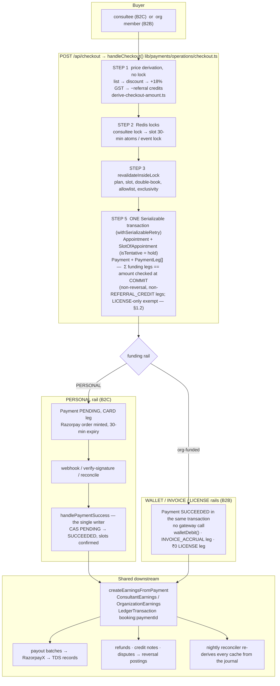

---

## 1. The shared substrate

### 1.1 Money data model

Everything is integer paise (`BigInt` at the database, `number` in JS through the Prisma extension) and every split is basis points ([ADR 02](../70-design-decisions/02-integer-paise-and-basis-points.md)). The diagram shows the money-bearing relations only; `Payment` is the hub.

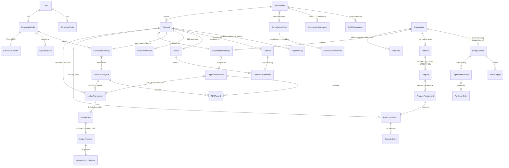

Three fields on `Payment` divide the B2B bookkeeping: `organizationId` is a **reporting tag** (which org's member booked), `billingAccountId` is the **settlement pointer** (whose account was charged), and `billableToOrgInvoiceId` is the **rollup stamp** (which invoice absorbed the accrual; null while unbilled).

### 1.2 The database is the last line

Prisma cannot express these, so they live in `prisma/sql/*.sql` and are applied by `npm run db:sidecars` ([ADR 13](../70-design-decisions/13-postgres-native-concurrency.md), corrected in #1132). CI fails if any is missing from the live catalog.

| Sidecar                                                 | File                        | Guards                                                                                                                                                                 |
| ------------------------------------------------------- | --------------------------- | ---------------------------------------------------------------------------------------------------------------------------------------------------------------------- |
| `ledger_txn_balanced` (deferred constraint trigger)     | `ledger-triggers.sql`       | Σ DEBIT == Σ CREDIT per `LedgerTransaction` at COMMIT                                                                                                                  |
| `payment_legs_sum_to_amount` + `payment_amount_vs_legs` | `payment-legs-triggers.sql` | Σ non-reversal, non-`REFERRAL_CREDIT` legs == `Payment.amount`; LICENSE-only payments exempt; every `*_REVERSAL` leg negative and bounded (#1347 / #1385)              |
| `slot_no_confirmed_overlap` (GiST exclusion)            | `check-constraints.sql`     | no two non-tentative slots for one consultant overlap                                                                                                                  |
| ~30 CHECK constraints                                   | `check-constraints.sql`     | non-negative money, `wallet_nonnegative`, `po_amounts_coherent`, `rate_card_bps_sum_is_whole`, `tds_record_deductee_xor`, `overage_marginal_is_base_plus_surcharge`, … |

### 1.3 Chart of accounts and the canonical postings

Ten `LedgerAccountKind` buckets ([chart of accounts](../10-money-and-ledger/02-chart-of-accounts.md)). An account's id **is** its scope — `kind|orgId-or-_|consultantProfileId-or-_|currency` ([ADR 03](../70-design-decisions/03-deterministic-ledger-account-ids.md)) — so concurrent first postings converge by upsert and the Postgres nullable-unique trap never applies.

| Debit-normal                                       | Credit-normal                                          |
| -------------------------------------------------- | ------------------------------------------------------ |
| `CASH` — platform gateway / settlement cash        | `WALLET(org)` — prepaid balance we owe an org          |
| `ORG_RECEIVABLE(org)` — invoice-funded org owes us | `CONSULTANT_PAYABLE(cp)` — owed to a consultant        |
| `PLATFORM_PROMO` — referral credits we funded      | `ORG_PAYABLE(org)` — host-org share owed               |
| `DISCOUNT` — discount given to the buyer           | `TDS_PAYABLE` / `GST_PAYABLE` — owed to the government |
|                                                    | `PLATFORM_FEE` — recognised revenue                    |

**Worked B2C booking** — ₹1,000 list price, no discount, India, marketplace consultant (20% platform fee, `PLATFORM_FEE_PERCENTAGE`):

| Field                      | Paise    |
| -------------------------- | -------- |
| `Payment.originalAmount`   | 1,00,000 |
| `Payment.taxAmount` (18%)  | 18,000   |
| `Payment.amount` (charged) | 1,18,000 |
| `PaymentLeg CARD`          | 1,18,000 |

| Posting (idempotency key)                       | Debit                                                                                      | Credit                                                                         |
| ----------------------------------------------- | ------------------------------------------------------------------------------------------ | ------------------------------------------------------------------------------ |
| `BOOKING` `booking:paymentId`                   | `CASH` 1,18,000                                                                            | `PLATFORM_FEE` 20,000 · `CONSULTANT_PAYABLE(cp)` 80,000 · `GST_PAYABLE` 18,000 |
| `PAYOUT` `payout:payoutId`                      | `CONSULTANT_PAYABLE(cp)` 80,000                                                            | `CASH` 79,920 · `TDS_PAYABLE` 80 (194-O at 0.1%, when over the FY threshold)   |
| `REFUND` (full) `refund:refundId`               | `PLATFORM_FEE` 20,000 (the plug) · `CONSULTANT_PAYABLE(cp)` 80,000 · `GST_PAYABLE` 18,000  | `CASH` 1,18,000                                                                |
| `REFUND` on LOST dispute `chargeback:disputeId` | negation of the BOOKING entries for the un-refunded fraction, residual onto `PLATFORM_FEE` |                                                                                |

**Worked B2B booking** — ₹10,000 list price, host org on the default 10/10/80 rate card, funded by the sponsor's wallet:

| Posting                           | Debit                        | Credit                                                                                                              |
| --------------------------------- | ---------------------------- | ------------------------------------------------------------------------------------------------------------------- |
| `TOPUP` `topup:orderId` (earlier) | `CASH` 11,80,000             | `WALLET(org)` 11,80,000                                                                                             |
| `BOOKING` `booking:paymentId`     | `WALLET(org)` 11,80,000      | `PLATFORM_FEE` 1,00,000 · `ORG_PAYABLE(host)` 1,00,000 · `CONSULTANT_PAYABLE(cp)` 8,00,000 · `GST_PAYABLE` 1,80,000 |
| `ORG_PAYOUT` `orgpayout:payoutId` | `ORG_PAYABLE(host)` 1,00,000 | `CASH` 99,900 · `TDS_PAYABLE` 100                                                                                   |

Swap the first debit for `ORG_RECEIVABLE(org)` on the INVOICE rail (cleared later by `INVOICE_PAID` `invoicepaid:invoiceId` — `Dr CASH / Cr ORG_RECEIVABLE`), and for nothing at all on the LICENSE rail (a ₹0 leg contributes no debit; the skip is legitimate). If the expert's membership has `payoutRecipient = ORGANIZATION`, the org takes the consultant slice too: `ORG_PAYABLE` 9,00,000, `CONSULTANT_PAYABLE` 0.

Every reversal is a **new** transaction with its own key (`payout-reversal:id`, `orgpayout-reversal:id`, `topup-refund:refundId`) — never a delete. The journal is append-only; `LedgerAccountBalance`, `BillingAccount.walletBalance`, and the `*SharePaise` columns on earnings rows are caches the nightly reconciler re-derives and, for wallets, freezes on drift.

---

## 2. B2C — the consumer rail

Hard because money crosses an asynchronous boundary (Razorpay) and comes back through **four doors**, any of which can arrive first, twice, or after the booking has died.

### 2.1 Checkout

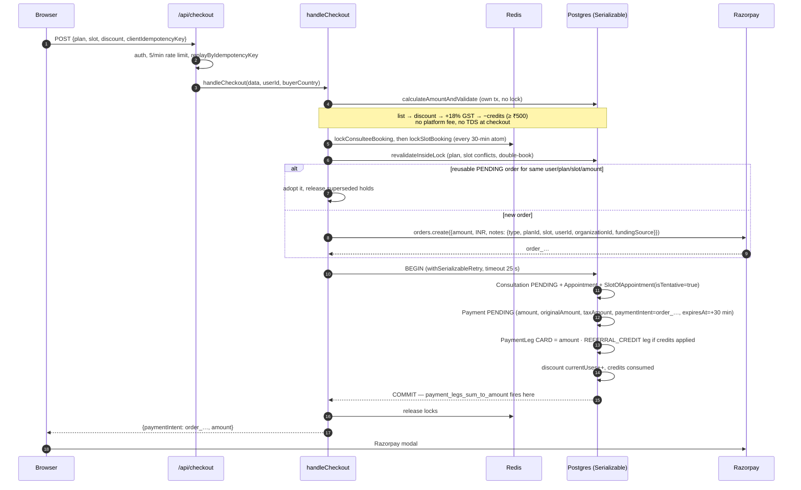

Zero-amount (credit-funded) and org-funded checkouts take the `skipPayment` branch: `Payment` is created `SUCCEEDED`, participants `CONFIRMED`, and earnings run post-commit from the same request.

### 2.2 Confirmation — four doors, one writer

[ADR 21](../70-design-decisions/21-single-writer-for-payment-confirmation.md): the capture transition `PENDING → SUCCEEDED` is written by `handlePaymentSuccess` and by nothing else. Every door funnels through `routeCapturedPayment`, which repeats the parity check every time. The other writers of `Payment.paymentStatus` are narrow and never confirm a gateway payment: the `skipPayment` branch creates the row already `SUCCEEDED` (no transition), the `payment.failed` webhook handler writes `PENDING → FAILED`, and `PENDING → EXPIRED` is written by `cleanup-abandoned-payments`, by `cancelPendingCheckout`, and by the superseded-hold release inside checkout.

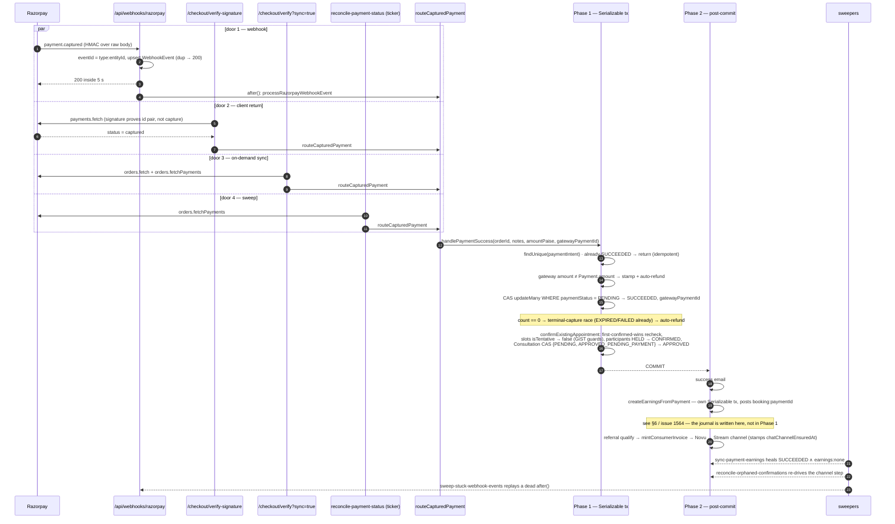

There is no `CONFIRMED` appointment status. "Confirmed" means `Consultation.status = APPROVED` ∧ `SlotOfAppointment.isTentative = false` ∧ participants `CONFIRMED`; `SCHEDULED` is stamped later by slot allocation.

### 2.3 State machines

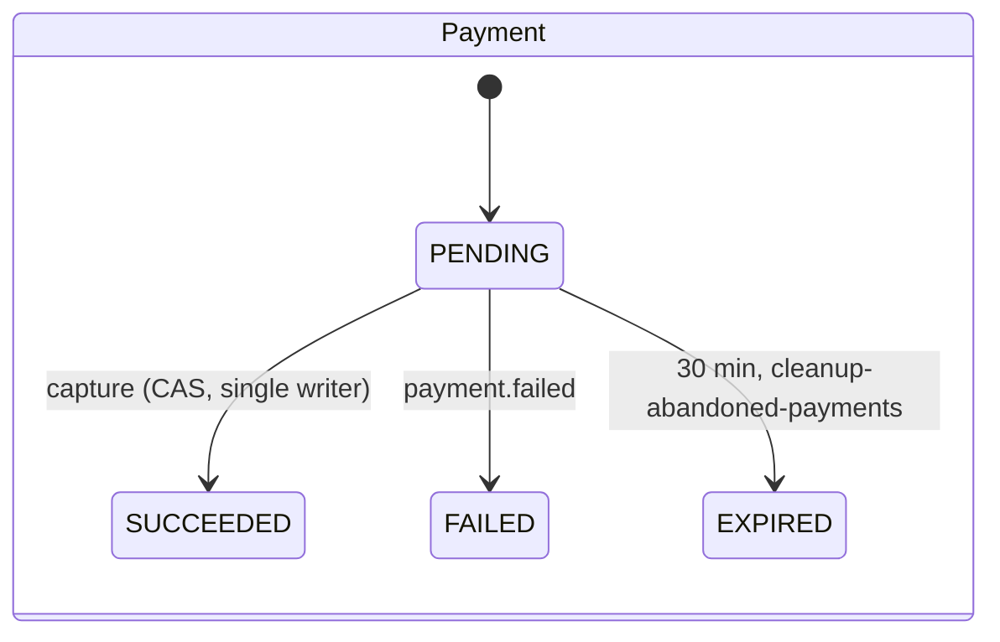

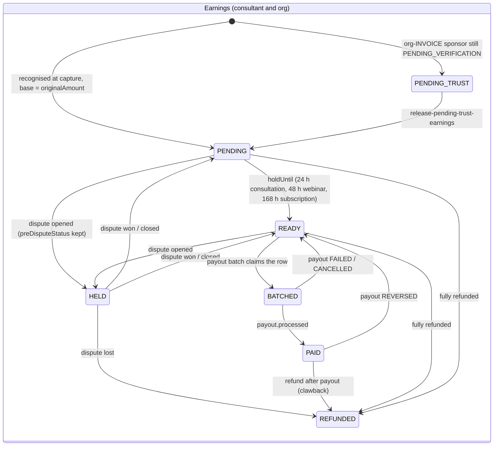

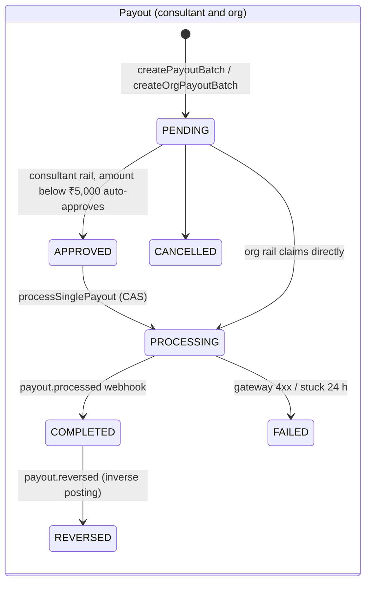

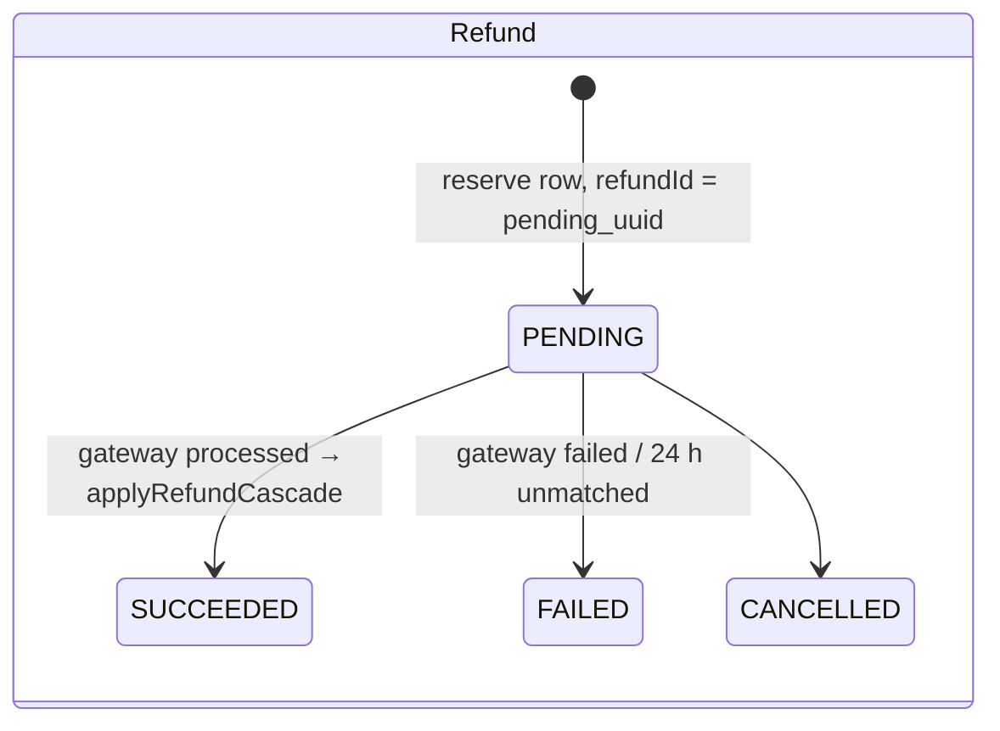

`ENABLE_LIVE_PAYOUTS` is off ([ADR 11](../70-design-decisions/11-live-payout-submission-freeze.md)): batches form, TDS and MSME deadlines are computed, earnings move to `BATCHED`, and the gateway call is skipped; rows park at `PENDING`.

### 2.4 Refunds — quote, two-phase call, cascade

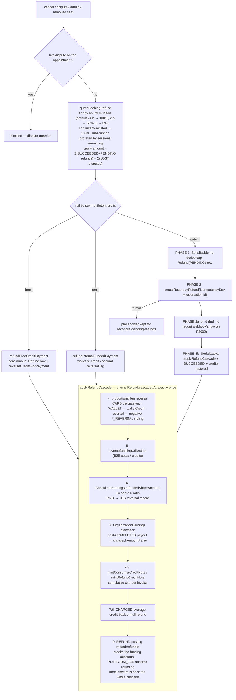

Disputes: `payment.dispute.created` writes `Dispute(NEEDS_RESPONSE)` and moves earnings to `HELD` with `preDisputeStatus`; `LOST` / `CHARGE_REFUNDED` moves them to `REFUNDED`, posts the B2C chargeback negation and mints a credit note; any payout batch refuses an earning whose payment has a live dispute.

### 2.5 Tax posture

- **GST — principal supplier** ([ADR 26](../70-design-decisions/26-gst-principal-model.md)). 18% on the discounted price at checkout, `GST_PAYABLE` credited at BOOKING, the platform issues `ConsumerInvoice FAM-FY-SEQ5` with place of supply defaulting to the supplier's state under s.12(2)(b). No §52 TCS; `GstTcsBatch` and `gstr8.ts` are dormant pending CA sign-off.
- **Income tax — e-commerce operator** (194-O). 0.1% (5% without PAN) withheld at **payout**, `TDSRecord` written only when the payout reaches `COMPLETED`. The engine is `LEGACY` (₹50,000 FY threshold); the ₹5 lakh three-limb exemption sits behind `ENABLE_TDS_194O_GROSS`.
- The pairing — principal for GST, operator for income tax — is deliberate and is the first open question on the CA list. It is also why the [RBI PA memo](../40-compliance-and-data/07-rbi-payment-aggregator-posture.md) can say "not a payment aggregator": no Route, no split settlement, wallet balances are platform liabilities.

---

## 3. B2B — the organisation rails

Complex because it is a **configuration space** (capability × funding source × program type × overage) crossed with a **lifecycle** (contract → program → assignment → cycle) crossed with **two money directions** (a sponsor pays in; a host is paid out) — and every cell has to land on the same leg-sum identity and the same ledger.

### 3.1 The configuration space

```mermaid
flowchart LR
  subgraph CAP["Organization capability"]
    direction TB
    SP["SPONSOR — canSponsor<br/>pays for members"]
    HO["HOST — canHost<br/>receives a share of earnings"]
    HY["HYBRID — both"]
    IN["INERT — neither → refused"]
  end
  subgraph FS["BillingAccount.fundingSource"]
    direction TB
    F0["PERSONAL — tag only, member's card pays"]
    F1["WALLET — prepaid, debited at booking"]
    F2["INVOICE — postpaid, accrues to a monthly invoice"]
    F3["LICENSE — flat fee, ₹0 legs"]
  end
  subgraph PT["Program.type"]
    direction TB
    T1["LICENSED_SEAT — n engagements per cycle"]
    T2["CREDIT_POOL — ₹ budget per cycle"]
  end
  subgraph OV["OverageBehavior"]
    direction TB
    O1["BLOCK"]
    O2["CHARGE_ORG"]
    O3["CHARGE_MEMBER"]
  end
  CAP --> FS --> PT --> OV
```

Reachable tuples (`lib/enterprise/reachable-paths.ts`, `REACHABLE_ORG_FUNDING_PATHS`):

| Capability | Funding | Program       |
| ---------- | ------- | ------------- |
| SPONSOR    | WALLET  | CREDIT_POOL   |
| SPONSOR    | INVOICE | CREDIT_POOL   |
| SPONSOR    | INVOICE | LICENSED_SEAT |
| SPONSOR    | LICENSE | LICENSED_SEAT |
| HOST       | —       | —             |
| HYBRID     | any     | any           |

Refused at **programme-configuration time** (`overageBehaviorUnsupportedReason`), never mishandled at checkout:

| Combination                         | Why                                                                             |
| ----------------------------------- | ------------------------------------------------------------------------------- |
| WALLET × CHARGE_MEMBER              | no credit-back path exists on the wallet rail                                   |
| WALLET × CHARGE_ORG × surcharge > 0 | the whole price was debited at booking; nothing collects a surcharge afterwards |
| LICENSE × anything but BLOCK        | a ₹0 LICENSE leg plus any second leg re-arms the leg-sum trigger                |

Money configuration locks at first assignment (`Program.configLockedAt`); a change is archive + new programme. Contract terms lock once invoiced or assigned; a change is supersession (`AMENDMENT` / `RENEWAL`), the old row `TERMINATED` / `EXPIRED`, invoices keep the old `contractId`.

### 3.2 Org checkout — gates, then what each rail writes

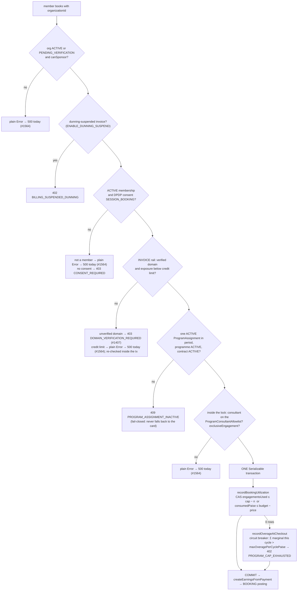

| Rail     | Gateway                | `Payment.paymentStatus`          | `PaymentLeg`               | In-transaction side effect                                          | BOOKING debit            |
| -------- | ---------------------- | -------------------------------- | -------------------------- | ------------------------------------------------------------------- | ------------------------ |
| PERSONAL | Razorpay order         | `PENDING` until capture          | `CARD` = amount            | tentative hold                                                      | `Dr CASH`                |
| WALLET   | none (`org_wallet_…`)  | `SUCCEEDED`                      | `WALLET` = amount          | `walletDebit()` CAS `walletBalance ≥ amt`; refused if wallet frozen | `Dr WALLET(org)`         |
| INVOICE  | none (`org_invoice_…`) | `SUCCEEDED`                      | `INVOICE_ACCRUAL` = amount | exposure re-check                                                   | `Dr ORG_RECEIVABLE(org)` |
| LICENSE  | none (`org_license_…`) | `SUCCEEDED`, amount = full price | `LICENSE` = 0              | —                                                                   | none (₹0 leg)            |

### 3.3 Overage — the matrix that makes the refusals necessary

|                   | INVOICE rail                                                                                                                                                                     | WALLET rail                                                                    | LICENSE           |
| ----------------- | -------------------------------------------------------------------------------------------------------------------------------------------------------------------------------- | ------------------------------------------------------------------------------ | ----------------- |
| **BLOCK**         | 402                                                                                                                                                                              | 402                                                                            | 402               |
| **CHARGE_ORG**    | carve base out of the `INVOICE_ACCRUAL` leg, add `OVERAGE_INVOICE_ACCRUAL` = marginal, `amount += surcharge`; `PENDING → ACCRUED` at rollup → `CHARGED` when the invoice is paid | already inside the debit; `OverageEvent` born `CHARGED`; surcharge > 0 refused | refused at config |
| **CHARGE_MEMBER** | side `Payment(parentPaymentId, intent overage:parent)`; member pays at `/dashboard/overage`; webhook posts `OVERAGE_MEMBER` (`Dr CASH / Cr ORG_PAYABLE`); 14-day timeout job     | refused at config                                                              | refused at config |

### 3.4 Sponsor money-in — wallet and invoice lifecycles

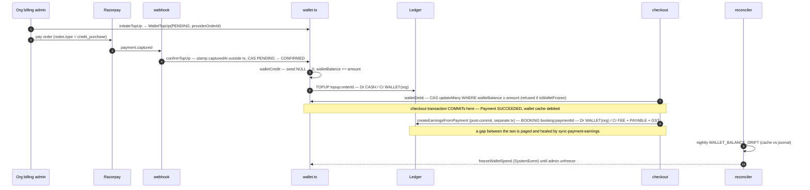

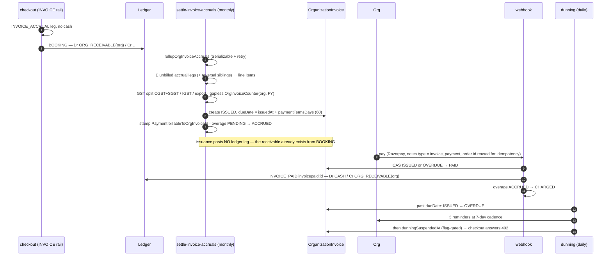

`PurchaseOrder.remainingAmountPaise` is CAS-decremented on the **manual** invoice route only; the automated rollup does not draw down a PO today (§6).

### 3.5 Host money-out — org earnings to org payout

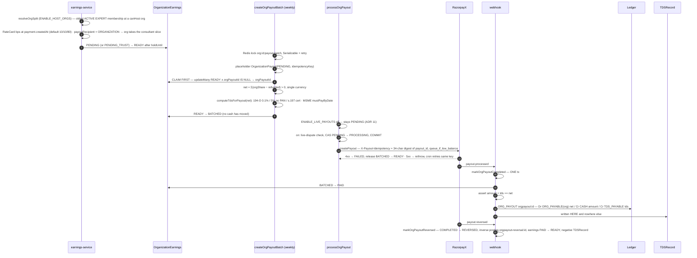

### 3.6 The lifecycle engine moves entitlement, never money

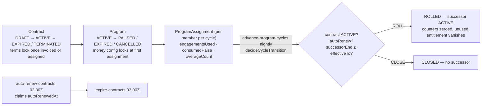

Nothing financial happens at rollover: wallet balances never expire, invoices settle on their own monthly job, and CHARGE_ORG overage from the closing cycle settles through the next rollup.

### 3.7 Refunds on org rails

The cascade in §2.4 runs unchanged; the leg step is what differs. A `WALLET` leg re-credits the cache and the `REFUND` posting credits `WALLET(org)`. An unpaid `INVOICE_ACCRUAL` leg gets a negative `INVOICE_ACCRUAL_REVERSAL` sibling so the next rollup nets it; a paid one is handled by the org earnings clawback and a proportional credit note (`CreditNote.refundId @unique`). A `LICENSE` leg releases the seat in `reverseBookingUtilization`. Under `CHARGE_MEMBER`, the member's side payment is refunded to the member's own card post-commit and the covered portion returns on the org's rail.

---

## 4. How it stays correct without a broker

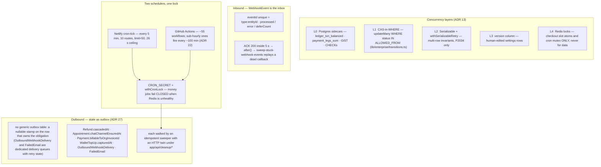

The append-only ledger is the event log; every reversal is a compensating posting with its own idempotency key; every claim happens before any computation (`createOrgPayoutBatch`, `Refund.cascadedAt`); every reconciler run is a control loop that re-derives caches from the journal.

---

## 5. Architecture verdict

Recorded so it is not re-litigated on every launch review. Full reasoning and measurements: [ADR 13](../70-design-decisions/13-postgres-native-concurrency.md), [ADR 14](../70-design-decisions/14-async-queue-posture.md), [ADR 22](../70-design-decisions/22-queue-posture-revisited-with-measurements.md), [ADR 27](../70-design-decisions/27-state-as-outbox-and-scheduled-ticker.md).

| Question                             | Answer                                                                                                                                                                                                                                                                                                                 |
| ------------------------------------ | ---------------------------------------------------------------------------------------------------------------------------------------------------------------------------------------------------------------------------------------------------------------------------------------------------------------------- |
| Microservices?                       | **No.** The two invariants that make money correct — `payment_legs_sum_to_amount` and `ledger_txn_balanced` — fire at COMMIT of one transaction. Splitting Payment from Ledger replaces a constraint trigger with a saga on the invariant that most needs to be strict.                                                |
| Internal event bus / event sourcing? | **No.** Events exist at both edges (Razorpay in, `OutboundWebhookDelivery` + Novu out). A bus buys fan-out to multiple consumers; there is ~1 consumer per event. The ledger already is the append-only, idempotency-keyed log.                                                                                        |
| Distributed-systems patterns?        | **Already in use, in-process:** idempotent consumers, inbox with defer, state-as-outbox, sagas with compensating postings, business-level two-phase commit (`refundPayment`), CAS-in-WHERE, SSI with retry, deterministic ids, claim-before-compute, control-loop reconciliation, circuit breakers, a dead-man switch. |
| What is the scale wall?              | **Netlify** — 125 concurrent invocations, 10 s sync / 26 s function ceiling, webhooks on the same fleet as page renders. Not Postgres, not the absence of a broker.                                                                                                                                                    |
| What is the escalation?              | One worker tier (QStash, #1010), before `ENABLE_LIVE_PAYOUTS` flips. A durable workflow engine is evaluated when live payout submission meets ADR 22's own trigger.                                                                                                                                                    |
| The one EDA move worth planning?     | **CDC from `LedgerEntry` / `Payment` / `TDSRecord` to a read model** so GSTR-1, 26Q, rollups and the reconciler stop querying the OLTP pool capped at one connection per function. `launch: scale`.                                                                                                                    |

---

## 6. Known divergences

Tracked in #1564. This page describes the code; these are the places where another document, or the doctrine, says something different.

| Where                                                                             | Says                                                   | Code does                                                                                                                                                                                                      |
| --------------------------------------------------------------------------------- | ------------------------------------------------------ | -------------------------------------------------------------------------------------------------------------------------------------------------------------------------------------------------------------- |
| `docs/payments/06-high-level-design.md`, `finance/references/doctrine.md`, ADR 21 | earnings + BOOKING journal inside the single-writer tx | written in Phase 2, post-commit, in `createEarningsFromPayment`'s own transaction; healed by `sync-payment-earnings` (**P0**)                                                                                  |
| `docs/payments/06-high-level-design.md`                                           | `Appointment CONFIRMED`                                | no such status; `APPROVED` + `isTentative = false` + participant `CONFIRMED`                                                                                                                                   |
| `docs/enterprise/10-money-and-ledger/08-invoicing.md`                             | PO 3-way match on every invoice                        | manual route only; the automated rollup passes no `purchaseOrderId`                                                                                                                                            |
| `docs/enterprise/40-compliance-and-data/04-outbound-webhooks.md`                  | eight events delivered                                 | three have emitters (`invoice.issued`, `member.added`, `member.removed`)                                                                                                                                       |
| `prisma/schema.prisma` `OrgKybVerification` comment                               | INVOICE funding blocked until KYB                      | API checks the verified domain only                                                                                                                                                                            |
| `lib/enterprise/transitions.ts` org payout map                                    | `PROCESSING ← APPROVED`                                | org rail claims `PENDING → PROCESSING`; no approval gate at any amount                                                                                                                                         |
| `docs/enterprise/10-money-and-ledger/13-ledger-integrity.md`                      | fourteen finding kinds                                 | 26                                                                                                                                                                                                             |
| `docs/enterprise/10-money-and-ledger/12-payment-webhooks.md`                      | `dispute.under_review` / `action_required` unhandled   | both dispatched                                                                                                                                                                                                |
| `finance/references/doctrine.md` § business-coded refusals never surface as 500s  | every anticipated refusal carries a registered code    | six org-checkout refusals (org status, `canSponsor`, membership, invoice credit limit, allowlist, exclusivity) are plain `Error`s with no code — `classifyError` answers 500 `UNKNOWN` and Sentry sees a fault |

---

## Ground truth

`prisma/schema.prisma` · `prisma/sql/{ledger-triggers,payment-legs-triggers,check-constraints}.sql` · `lib/payments/operations/checkout.ts` · `lib/payments/pricing/derive-checkout-amount.ts` · `lib/payments/webhooks/handlers.ts` · `app/api/webhooks/razorpay-dispatch.ts` · `app/api/webhooks/utils.ts` · `lib/payments/payouts/earnings-service.ts` · `lib/payments/payouts/payout-service.ts` · `lib/payments/payouts/org-payout-service.ts` · `lib/payments/ledger/post.ts` · `lib/payments/operations/refund.ts` · `lib/payments/billing/{overage-settlement,invoice-rollup,consumer-invoice}.ts` · `lib/api/organizations/wallet.ts` · `lib/enterprise/{reachable-paths,transitions,config-lock,cycle-engine,governance}.ts` · `lib/compliance/{tds,tds-194o,gst,msme}.ts` · `netlify/functions/cron-tick.mts` · `scripts/reconcile/reconcile-ledgers.ts`.
