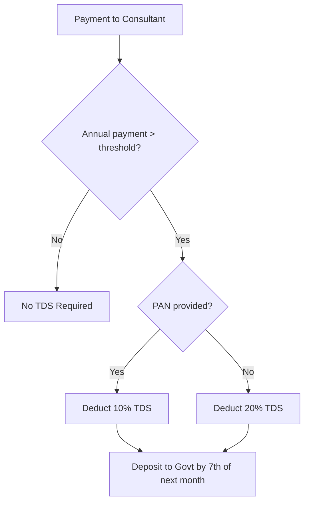

# Tax Compliance Guide - India

## Overview

This document covers tax obligations for Familiarise as an Indian marketplace platform. It includes GST, TDS, and other regulatory requirements.

**Disclaimer**: This is a reference guide. Consult a qualified CA/tax professional for specific advice.

**Recommended Entity:** Sole Proprietorship (see CFO Master Plan -- maintained outside repository). Section 44AD presumptive taxation makes this the most tax-efficient structure up to ₹2Cr revenue.

---

## Entity Structure & Income Tax

### Recommended: Sole Proprietorship + Section 44AD

Section 44AD allows eligible businesses to declare income at a **presumptive rate** instead of maintaining full books of accounts:

| Parameter              | Details                                                       |
| ---------------------- | ------------------------------------------------------------- |
| **Eligible entities**  | Individuals, HUFs, Partnership firms (NOT LLP, NOT companies) |
| **Turnover limit**     | ₹2 Crore (₹3 Crore if 95%+ digital receipts/payments)         |
| **Deemed profit rate** | 8% of turnover (6% if 95%+ received digitally)                |
| **Books of account**   | NOT required to maintain                                      |
| **Advance tax**        | Single installment by March 15                                |
| **Tax audit**          | NOT required (unless opting out of 44AD)                      |

### Tax Impact at Different Revenue Levels (FY 2025-26)

| Annual Platform Revenue | Deemed Profit (8%) | Income Tax (New Regime FY 2025-26) | Effective Tax Rate |
| ----------------------- | ------------------ | ---------------------------------- | ------------------ |
| ₹5L                     | ₹40,000            | ₹0 (87A rebate, income < ₹12L)     | **0%**             |
| ₹10L                    | ₹80,000            | ₹0 (87A rebate, income < ₹12L)     | **0%**             |
| ₹25L                    | ₹2,00,000          | ₹0 (87A rebate, income < ₹12L)     | **0%**             |
| ₹50L                    | ₹4,00,000          | ₹0 (87A rebate, income < ₹12L)     | **0%**             |
| ₹1Cr                    | ₹8,00,000          | ₹0 (87A rebate, income < ₹12L)     | **0%**             |
| ₹1.5Cr                  | ₹12,00,000         | ₹0 (87A rebate, income = ₹12L)     | **0%**             |
| ₹2Cr                    | ₹16,00,000         | ~₹1,24,800 (₹1,20,000 + 4% cess)  | **0.06%**          |

> **Key insight:** With Budget 2025's enhanced Section 87A rebate (income up to ₹12L = zero tax under new regime), a Sole Prop pays ₹0 income tax all the way up to ₹1.5Cr revenue. A Pvt Ltd at ₹50L revenue would pay ~₹10.8L (22% + cess). **Section 44AD saves ₹10+ lakh/year.**

### Comparison: Sole Prop vs Pvt Ltd vs LLP

|                       | Sole Prop             | OPC (Pvt Ltd)      | LLP                |
| --------------------- | --------------------- | ------------------ | ------------------ |
| **Setup Cost**        | ₹1-3K                 | ₹9-23K             | ₹10-20K            |
| **Annual Compliance** | ₹4-11K                | ₹27-56K            | ₹12-28K            |
| **Tax Rate**          | Slab (0-30%) via 44AD | 22% flat + 4% cess | 30% flat + 4% cess |
| **Section 44AD**      | YES                   | NO                 | NO                 |
| **VC Funding**        | NO                    | YES                | Possible           |
| **Liability**         | Unlimited             | Limited            | Limited            |
| **Razorpay KYC**      | Personal PAN          | Business PAN       | Business PAN       |

**When to convert to Pvt Ltd:** When seeking VC funding, or when revenue consistently exceeds ₹2Cr. Conversion cost: ₹15-25K, takes 2-3 months.

---

## How Tax Collection Works (The Basics)

Before diving into rates and compliance, understand how tax actually flows through your business.

### Money Flow

```
Customer pays: ₹1,180 (₹1,000 service + ₹180 GST)
        ↓
Payment Gateway (Razorpay/Stripe) - deducts ~2% fee
        ↓
Your Bank Account - receives ~₹1,156 (full amount minus gateway fee)
        ↓
You file GST returns monthly/quarterly
        ↓
You remit ₹180 GST to government (minus any Input Tax Credit)
```

### Key Concept: You Are a Tax Collector

| What Happens                      | Who Does It       |
| --------------------------------- | ----------------- |
| Customer pays service + tax       | Customer          |
| Full amount lands in your bank    | Payment gateway   |
| Tax portion sits in your account  | You (temporarily) |
| File returns, calculate net tax   | You               |
| Remit collected tax to government | You               |

**Important**: Payment gateways do NOT automatically split or remit tax. They transfer the full amount to you. You are responsible for:

1. Tracking how much tax you collected
2. Filing accurate returns
3. Paying the government what you owe

### Input Tax Credit (ITC)

You don't always pay the full GST you collected. You can deduct GST you paid on business expenses:

```
GST Collected from customers:     ₹18,000
GST Paid on expenses:             ₹5,000 (hosting, software, etc.)
────────────────────────────────────────
Net GST owed to government:       ₹13,000
```

This is called Input Tax Credit (ITC) - it prevents tax cascading.

### What This Means for Your Code

The `math.ts` checkout utilities calculate tax for **display and invoicing purposes**. The actual tax compliance happens outside the codebase through:

- Accounting software (Zoho Books, Tally, etc.)
- CA/tax professional filing returns
- Manual or automated bank transfers to government

---

## GST (Goods & Services Tax)

### Platform Registration

| Requirement          | Threshold            | Notes                                         |
| -------------------- | -------------------- | --------------------------------------------- |
| GST Registration     | Turnover > ₹20 lakhs | Mandatory for service providers               |
| Inter-state supplies | Any amount           | Registration required regardless of threshold |
| E-commerce operator  | Any amount           | Special provisions apply                      |

**Source**: [ClearTax GST Guide](https://cleartax.in/s/gst-rates)

### Applicable GST Rates

| Service Type             | GST Rate | SAC Code                          |
| ------------------------ | -------- | --------------------------------- |
| Platform fees/Commission | 18%      | 998313 (Online content)           |
| IT-enabled services      | 18%      | 998314                            |
| Educational services     | 18%      | 999293 (except exempt categories) |
| Payment gateway services | 18%      | 997159                            |

> **Note:** The codebase (`lib/payments/payouts/constants.ts`) uses SAC 999293 for consulting
> and 999294 for educational services in invoice generation. The SAC codes above (998313, 998314)
> apply to platform commission invoicing. Consult a CA to confirm the correct classification.

### GST Rate Rationalization (Proposed)

> **⚠️ Unverified — confirm with CA.** The GST Council has discussed rate rationalization (merging the current 5-slab structure into fewer slabs). Some reports reference a simplified framework with merit (5%), standard (18%), and demerit/luxury rates, but the specific rates and implementation status are unconfirmed as of April 2026. The 40% demerit rate cited in earlier drafts of this document has not been independently verified.

**Impact**: Platform services are expected to remain at 18% with Input Tax Credit (ITC) available regardless of any restructuring.

### Reverse Charge Mechanism (RCM) on Foreign SaaS

When GST-registered, you must pay 18% IGST on all imported services (foreign SaaS tools) under RCM. The recipient (you) pays GST instead of the foreign supplier.

| Foreign Service                 | Monthly (USD) | INR @90.7 | RCM @ 18% | Total INR/mo |
| ------------------------------- | ------------- | --------- | --------- | ------------ |
| Claude Max (Anthropic)          | $100          | ₹9,070    | ₹1,633    | ₹10,703      |
| Apple Developer (amortized)     | $8.25         | ₹748      | ₹135      | ₹883         |
| Supabase Pro (when upgraded)    | $25           | ₹2,268    | ₹408      | ₹2,676       |
| Stream.io Start (when upgraded) | $399          | ₹36,189   | ₹6,514    | ₹42,703      |
| Novu Pro (when upgraded)        | $30           | ₹2,721    | ₹490      | ₹3,211       |
| Vercel Pro (when upgraded)      | $20           | ₹1,814    | ₹327      | ₹2,141       |
| Resend Pro (when upgraded)      | $20           | ₹1,814    | ₹327      | ₹2,141       |

**Key points:**

- If NOT GST-registered: You don't pay RCM, but also can't claim ITC
- If GST-registered: You pay RCM and claim it back as ITC (net zero if collecting GST)
- RCM is a cash flow timing issue, not an actual cost, when you collect GST from customers
- File RCM in GSTR-3B Section 3.1(d) and claim ITC in Section 4

### E-commerce TCS (Tax Collected at Source)

| Provision                    | Rate                    | Notes                       |
| ---------------------------- | ----------------------- | --------------------------- |
| TCS on supplies via platform | 0.5%                    | Reduced from 1% (July 2024) |
| Split                        | 0.25% CGST + 0.25% SGST | Interstate = 0.5% IGST      |
| Filing                       | Monthly GSTR-8          | By 10th of next month       |

**CRITICAL WARNING - E-Commerce Operator Classification:**

Under Section 24 of CGST Act, **e-commerce operators are required to register for GST regardless of turnover**. The ₹20L threshold does NOT apply to marketplace operators.

As Familiarise collects payments on behalf of consultants (suppliers), you may be classified as an e-commerce operator, requiring:

1. **Mandatory GST registration from Day 1** (no turnover threshold)
2. **TCS collection at 0.5%** on net value of supplies made through you
3. **Monthly GSTR-8 filing** (TCS return)
4. **GSTR-1, GSTR-3B** as normal

**Possible workaround:** If structured as a "service provider" (you provide the consultation platform service, consultants are contractors) rather than "marketplace" (consultants sell through you), TCS obligation may not apply.

**ACTION REQUIRED:** Budget ₹5-10K for a CA consultation specifically on whether Familiarise is classified as an e-commerce operator under GST. This is the single most impactful tax decision before launch.

### International Buyers (Export of Services)

Export of services is zero-rated under GST (IGST Act Section 16). Conditions:

- Supplier located in India
- Recipient located outside India
- Payment received in convertible foreign exchange

**Current implementation:** GST is zero-rated when `buyerCountry !== "IN"` in checkout (using server-side buyer country detection via DB user.country → CF-IPCountry header → Accept-Language fallback). For full compliance, additional evidence (billing address, FIRC reference, LUT state) should be captured per payment — see `docs/payments/multi-currency/03-tds-compliance.md` launch blockers.

---

## TDS (Tax Deducted at Source)

### Section 194J - Professional Services

**Applies to**: Payments to consultants for professional/technical services

| Parameter           | FY 2024-25   | FY 2025-26   |
| ------------------- | ------------ | ------------ |
| Threshold           | ₹30,000/year | ₹50,000/year |
| Rate (Professional) | 10%          | 10%          |
| Rate (Technical)    | 2%           | 2%           |
| No PAN rate         | 20%          | 20%          |

**Source**: [ClearTax Section 194J](https://cleartax.in/s/section-194j)

### When to Deduct TDS



### TDS Compliance Calendar

| Due Date          | Action         | Form        |
| ----------------- | -------------- | ----------- |
| 7th of each month | TDS deposit    | Challan 281 |
| 31st July         | Q1 return      | 26Q         |
| 31st October      | Q2 return      | 26Q         |
| 31st January      | Q3 return      | 26Q         |
| 31st May          | Q4 return      | 26Q         |
| Quarterly (15th of month after return due) | Form 16A issue (Aug 15, Nov 15, Feb 15, Jun 15) | 16A |

### TDS Calculation Example

```
Consultant Annual Earnings: ₹1,00,000
TDS Threshold (FY 2025-26): ₹50,000

Since ₹1,00,000 > ₹50,000:
TDS @ 10% = ₹10,000

Consultant receives: ₹90,000
Platform deposits: ₹10,000 to government
```

### Section 194C vs 194J

| Section        | 194C (Contractors)          | 194J (Professionals)  |
| -------------- | --------------------------- | --------------------- |
| Applies to     | Physical work contracts     | Professional services |
| Rate (Ind/HUF) | 1%                          | 10%                   |
| Rate (Others)  | 2%                          | 10%                   |
| Threshold      | ₹30K single / ₹1L aggregate | ₹30K → ₹50K           |

**For Familiarise**: Use Section 194J for consultant payments (professional services)

---

## Platform Tax Obligations

### As an Aggregator/Marketplace

| Obligation         | Requirement                                  |
| ------------------ | -------------------------------------------- |
| GST Registration   | Mandatory                                    |
| TCS Collection     | If collecting payment on behalf of suppliers |
| TDS Deduction      | On payments to consultants above threshold   |
| Invoice Generation | For platform fees charged                    |

### Invoice Requirements

**For Platform Commission (charged to consultants):**

```
Invoice to Consultant:
- Platform Name, GSTIN
- Consultant Name, GSTIN (if registered)
- SAC Code: 998313 (or 9962 — confirm correct classification with CA)
- Commission Amount
- GST @ 18% (CGST 9% + SGST 9% or IGST 18%)
- Total Amount
```

### Record Keeping

| Document        | Retention Period |
| --------------- | ---------------- |
| Invoices        | 8 years          |
| TDS records     | 8 years          |
| GST returns     | 8 years          |
| Payment records | 8 years          |

---

## Consultant Tax Implications

### GST for Consultants

| Consultant Status    | GST Requirement            |
| -------------------- | -------------------------- |
| Turnover < ₹20 lakhs | Not required (can opt-in)  |
| Turnover > ₹20 lakhs | Mandatory GST registration |
| Inter-state services | Registration required      |

### Income Tax for Consultants

| Income Slab (New Regime - FY 2025-26) | Tax Rate |
| ------------------------------------- | -------- |
| Up to ₹4 lakhs                        | Nil      |
| ₹4 - 8 lakhs                          | 5%       |
| ₹8 - 12 lakhs                         | 10%      |
| ₹12 - 16 lakhs                        | 15%      |
| ₹16 - 20 lakhs                        | 20%      |
| ₹20 - 24 lakhs                        | 25%      |
| Above ₹24 lakhs                       | 30%      |

> The Old Tax Regime below is for reference only. New Regime is the default from FY 2023-24 onwards.

| Income Slab (Old Regime) | Tax Rate |
| ------------------------ | -------- |
| Up to ₹2.5 lakhs         | Nil      |
| ₹2.5 - 5 lakhs           | 5%       |
| ₹5 - 10 lakhs            | 20%      |
| Above ₹10 lakhs          | 30%      |

### TDS Credit

Consultants can claim TDS deducted by platform:

1. TDS reflects in Form 26AS
2. Claim credit while filing ITR
3. Excess TDS can be refunded

---

## Implementation Status (Updated March 2026)

### Implemented

- **TDS calculation + auto-deduction**: `lib/payments/tax/tds-service.ts` — calculates TDS at payout time, deducts before sending to gateway. TDS records are created only on confirmed (COMPLETED) payouts; failed payouts clean up all TDS data.
- **ConsultantTaxInfo model**: PAN, GSTIN, country tracking in `prisma/schema.prisma`
- **TDSRecord model**: Per-deduction audit trail for Form 26Q filing
- **Admin TDS API**: `GET/POST /api/admin/tds` — FY summary, per-consultant breakdown, filing status
- **Consultant Tax Info API**: `GET/PUT /api/consultant/tax-info` — PAN/GSTIN collection
- **Export zero-rating**: `lib/payments/tax/tax-engine.ts` — 0% for international buyers (buyer country detection)
- **Gateway auto-routing**: `lib/payments/gateway-router.ts` — Razorpay for all (domestic + IBT)
- **Invoice zero-rating**: Fixed bug where `currency !== "INR"` check never triggered
- **Currency guards**: Discount + referral credit currency validation

### Pending

- [ ] CA opinion on e-commerce operator classification
- [ ] LUT filing with GST authorities
- [ ] Form 16A auto-generation for consultants
- [ ] EU VAT OSS registration (when thresholds approached)
- [ ] Razorpay IBT activation on dashboard (KYC process)

See `docs/payments/multi-currency/` for detailed architecture docs.

---

## Original Implementation Notes (Reference)

### Track TDS-Applicable Payments

```typescript
// lib/tax/tds-tracker.ts

interface ConsultantPaymentTracker {
  consultantId: string;
  financialYear: string; // "2025-26"
  totalPayments: number;
  tdsDeducted: number;
  tdsThreshold: number; // 50000 for FY 2025-26
}

function shouldDeductTDS(
  totalPaidThisYear: number,
  thresholdFY: number = 50000,
): boolean {
  return totalPaidThisYear > thresholdFY;
}

function calculateTDS(
  amount: number,
  hasPAN: boolean,
  isFirstPaymentAboveThreshold: boolean,
  totalPaidThisYear: number,
  threshold: number,
): number {
  if (totalPaidThisYear <= threshold) return 0;

  const rate = hasPAN ? 0.1 : 0.2; // 10% or 20%

  if (isFirstPaymentAboveThreshold) {
    // Deduct TDS on entire amount above threshold
    return Math.round((totalPaidThisYear - threshold) * rate);
  }

  // Deduct TDS on current payment
  return Math.round(amount * rate);
}
```

### Database Schema Additions

```prisma
// Track TDS for compliance
model ConsultantTaxInfo {
  id                  String   @id @default(uuid())
  consultantProfileId String   @unique
  pan                 String?  // Masked: ABCDE****F
  panVerified         Boolean  @default(false)
  gstNumber           String?
  gstVerified         Boolean  @default(false)

  consultantProfile   ConsultantProfile @relation(fields: [consultantProfileId], references: [id])

  createdAt           DateTime @default(now())
  updatedAt           DateTime @updatedAt
}

model TDSRecord {
  id                  String   @id @default(uuid())
  consultantProfileId String
  financialYear       String   // "2025-26"
  quarter             Int      // 1, 2, 3, 4
  grossPayment        Int      // Total payment in quarter
  tdsAmount           Int      // TDS deducted
  tdsRate             Float    // 0.10 or 0.20
  depositedAt         DateTime?
  challanNumber       String?

  consultantProfile   ConsultantProfile @relation(fields: [consultantProfileId], references: [id])

  createdAt           DateTime @default(now())
  updatedAt           DateTime @updatedAt

  @@unique([consultantProfileId, financialYear, quarter])
}
```

---

## Compliance Checklist

### Monthly

- [ ] **7th:** Deposit TDS to government via Challan 281 (if any consultant crossed threshold)
- [ ] **10th:** File GSTR-8 (if classified as e-commerce operator)
- [ ] **11th:** File GSTR-1 (outward supplies)
- [ ] **20th:** File GSTR-3B (summary return)
- [ ] Track cumulative payments per consultant for TDS thresholds
- [ ] Reconcile bank statements with payment gateway records
- [ ] Generate GST invoices

### Quarterly

- [ ] File TDS return (Form 26Q)
- [ ] Review ITC claims
- [ ] Reconcile TCS collected vs reported
- [ ] Reconcile TDS deposits with records

### Annually

- [ ] File GSTR-9 annual GST return (by December 31)
- [ ] Issue Form 16A TDS certificates to consultants — quarterly, within 15 days of return due date (Aug 15, Nov 15, Feb 15, Jun 15)
- [ ] File income tax return (ITR-4 if 44AD, ITR-3 otherwise)
- [ ] Renew LUT for export zero-rating (if applicable)
- [ ] Reconcile all tax credits
- [ ] Audit if turnover > ₹2 crore
- [ ] Review entity structure (Sole Prop vs Pvt Ltd)

### Section 44AD Advantage

As a Sole Proprietorship with presumptive taxation, the government assumes profit is **6–8% of revenue** (6% if 95%+ payments are digital):

| Revenue | Deemed Profit (6%) | Income Tax |
|---------|-------------------|------------|
| Rs 5 lakh | Rs 30K | Rs 0 |
| Rs 10 lakh | Rs 60K | Rs 0 |
| Rs 25 lakh | Rs 1.5L | Rs 0 |
| Rs 50 lakh | Rs 3L | Rs 0 |
| Rs 1 crore | Rs 6L | Rs 10K–31K |

A Pvt Ltd at Rs 50 lakh revenue would pay ~Rs 10.8 lakh in tax. A Sole Prop with 44AD pays Rs 0. Stay as Sole Prop until you need VC funding or cross Rs 2–3 crore revenue.

### Penalties for Non-Compliance

| Violation | Penalty |
|-----------|---------|
| Not registering for GST (when required) | Rs 10,000 or tax due, whichever is higher |
| Late GST filing | Rs 100/day statutory max (Rs 50 CGST + Rs 50 SGST), capped at Rs 5,000 per Act = **Rs 10,000 total** per return. Practical rates lower: Rs 50/day for GSTR-3B with tax, Rs 20/day for nil returns |
| **Not deducting TDS** | **Interest at 1% per month from due date — NO CAP** |
| **Late TDS deposit** | **Interest at 1.5% per month — NO CAP** |
| Late TDS return filing | Rs 200/day until filed, **capped at total TDS deductible amount** (Section 234E), plus possible prosecution |
| Incorrect TDS return | Rs 10,000–Rs 1,00,000 per incorrect statement |

> **The scariest penalties are for TDS.** Interest accumulates monthly with no upper cap.

### What Can Be Automated vs Needs a CA?

| Category | Items |
|----------|-------|
| **Automated (in code)** | GST calculation, TDS calculation and tracking, invoice generation |
| **Semi-automated (accounting software)** | GSTR-1 filing, GSTR-3B filing, GSTR-8 filing, ITC reconciliation |
| **CA handles** | TDS return (Form 26Q), annual GST return (GSTR-9), income tax return, e-commerce operator classification (one-time) |

**Estimated CA cost:** Rs 2,000–5,000/month for GST filing + Rs 4,000–11,000/year for ITR and compliance = **~Rs 30,000–70,000/year total**.

### Record Retention Requirements

All of the following must be retained for **8 years**:

- Bank statements
- Invoices (issued and received)
- TDS certificates
- GST returns (filed copies)
- Payment gateway records
- Consultant payment records
- Contracts/agreements

---

## Common Scenarios

### Scenario 1: New Consultant (No TDS)

```
Consultant joins mid-year
Total payments FY 2025-26: ₹40,000
Threshold: ₹50,000

Result: No TDS deduction required
```

### Scenario 2: Established Consultant (TDS Applies)

```
Consultant's 6th month payment
Previous payments: ₹48,000
Current payment: ₹12,000
Total: ₹60,000

TDS calculation:
- Threshold crossed: ₹60,000 > ₹50,000
- TDS on excess: (₹60,000 - ₹50,000) × 10% = ₹1,000
OR
- TDS on current: ₹12,000 × 10% = ₹1,200

Note: Once threshold crossed, TDS on all subsequent payments
```

### Scenario 3: Consultant Without PAN

```
Payment: ₹20,000
Threshold already crossed
PAN: Not provided

TDS @ 20% = ₹4,000 (higher rate)
```

---

## Important Thresholds Summary

| Tax Type         | Threshold              | Rate | Notes                  |
| ---------------- | ---------------------- | ---- | ---------------------- |
| GST Registration | ₹20 lakhs turnover     | 18%  | Services               |
| TDS 194J         | ₹50,000/year (FY25-26) | 10%  | Professional           |
| TCS E-commerce   | Any amount             | 0.5% | If collecting payments |
| Tax Audit        | ₹2 crore turnover      | -    | Mandatory audit        |

---

## Resources & Forms

| Purpose            | Form/Document |
| ------------------ | ------------- |
| TDS Payment        | Challan 281   |
| TDS Return         | Form 26Q      |
| TDS Certificate    | Form 16A      |
| GST Registration   | REG-01        |
| GST Monthly Return | GSTR-3B       |
| GST Annual Return  | GSTR-9        |

### Useful Links

- [Income Tax e-Filing](https://www.incometax.gov.in)
- [GST Portal](https://www.gst.gov.in)
- [TDS Rate Chart - ClearTax](https://cleartax.in/s/tds-rate-chart)
- [Section 194J Guide](https://cleartax.in/s/section-194j)
- [GST Rates 2025](https://cleartax.in/s/gst-rates)

---

## Related Documents

- [08-saas-expenditures.md](./08-saas-expenditures.md) - Cost structure (with GST/RCM)
- [04-revenue-distribution.md](./04-revenue-distribution.md) - Revenue split
- [06-payout-implementation-plan.md](./06-payout-implementation-plan.md) - Payout system
- CFO Master Plan -- comprehensive financial blueprint (maintained outside repository)
