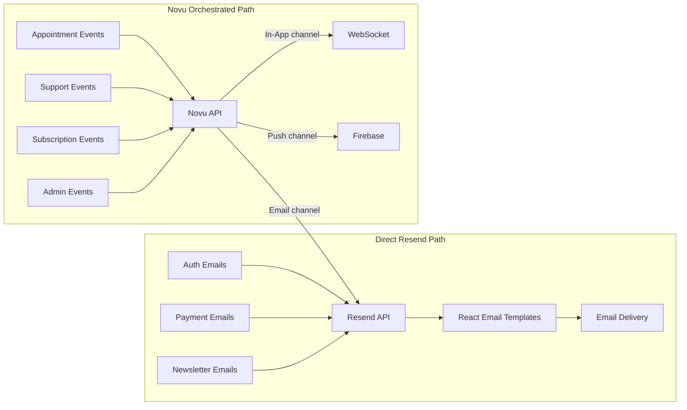
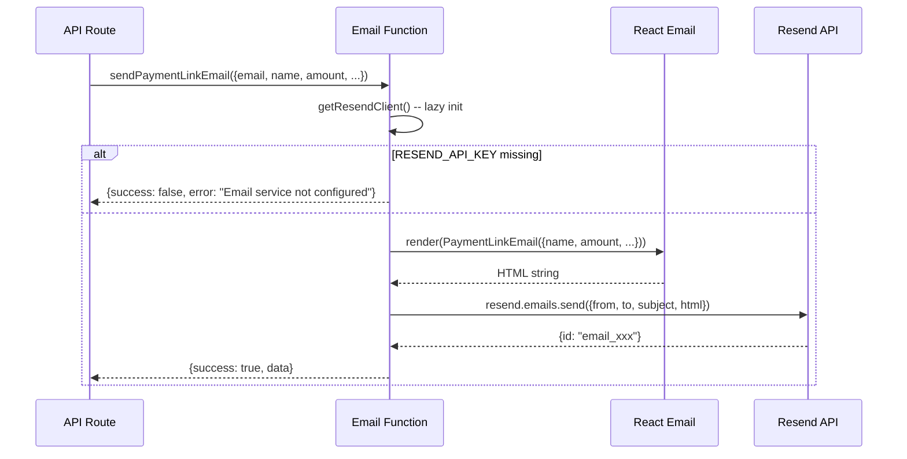
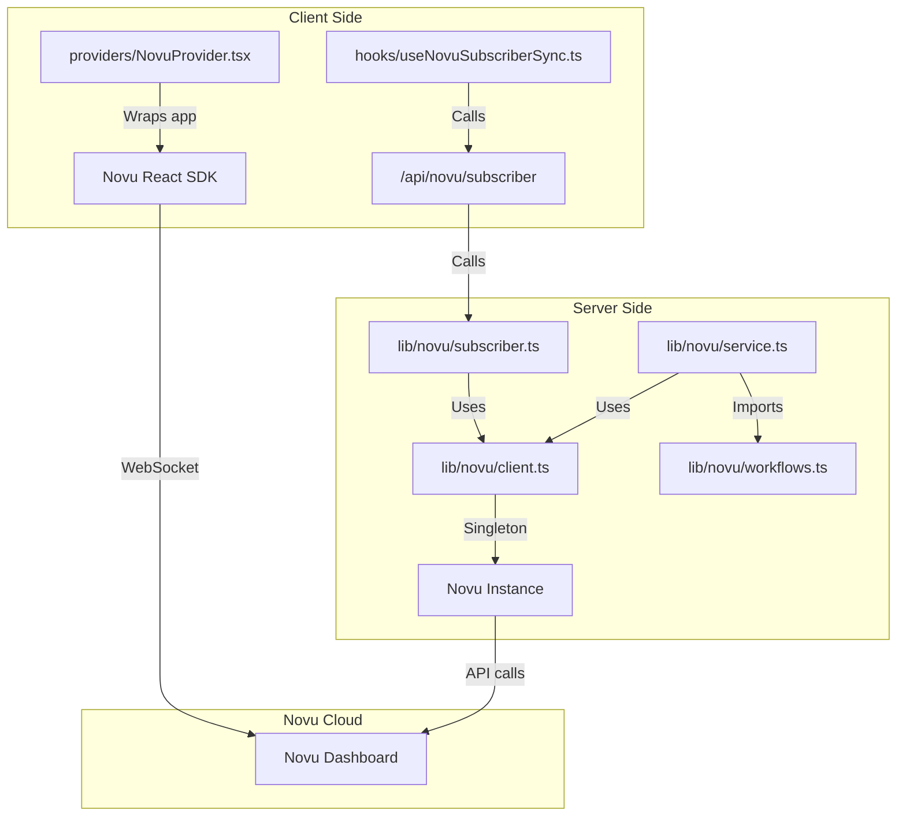
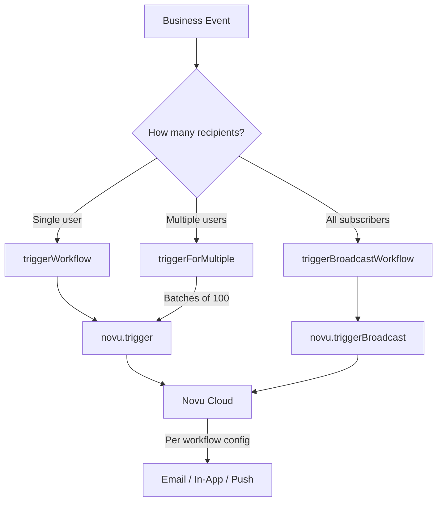
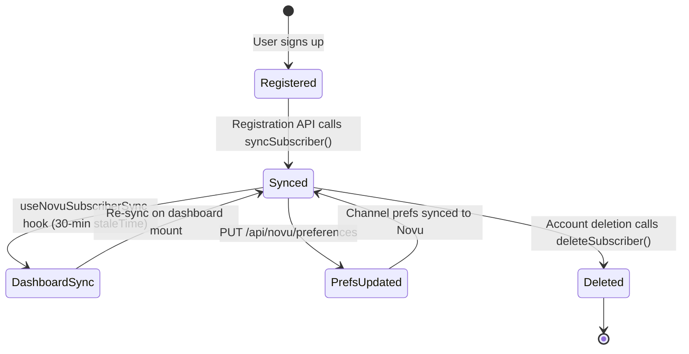
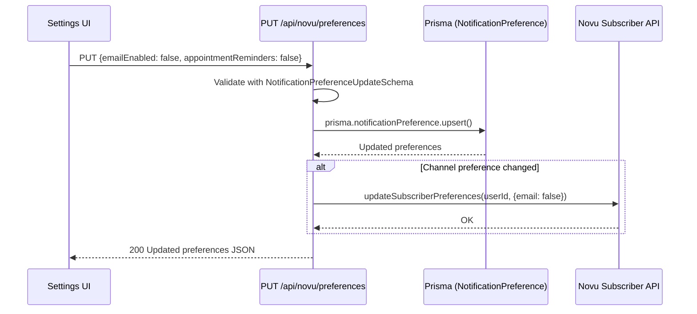

# Notification Architecture

## Design Decision: Resend + Novu

The notification system uses two complementary services rather than one:

| Service    | Role                                     | Analogy     |
| ---------- | ---------------------------------------- | ----------- |
| **Resend** | Email delivery infrastructure            | The postman |
| **Novu**   | Multi-channel notification orchestration | The brain   |

**Why both?** Resend sends emails reliably (DKIM, SPF, bounce handling) but cannot do in-app notifications, push notifications, digest batching, or user preference routing. Novu orchestrates all channels but cannot deliver emails itself -- it uses Resend as its email provider.

**Why not Novu for everything?** Some emails (auth, payment links) are tightly coupled to their API routes and don't need multi-channel delivery. Sending these directly through Resend avoids unnecessary complexity.



### When to Use Each Path

| Use Resend Directly                                            | Use Novu                                                          |
| -------------------------------------------------------------- | ----------------------------------------------------------------- |
| Auth emails (welcome, password reset, account linked)          | Appointment lifecycle (booked, cancelled, rescheduled, completed) |
| Payment transactional (payment link, success, failed)          | Support tickets (created, updated, response)                      |
| Newsletter opt-in (confirm, welcome)                           | Feedback and reviews                                              |
| Any email that doesn't need in-app/push delivery               | Trial sessions, subscriptions                                     |
|                                                                | Consultant-specific (booking requests, verification, payouts)     |
|                                                                | Admin/system (announcements, new applications)                    |
|                                                                | Disputes, recordings                                              |

---

## Resend Layer

### Client Initialization

```
lib/email.ts
├── getResendClient()          -- Lazy singleton, returns null if RESEND_API_KEY missing
├── sendWelcomeEmail()         -- from: onboarding@familiarise.com
├── sendPasswordResetEmail()   -- from: security@familiarise.com
├── sendAccountLinkedEmail()   -- from: security@familiarise.com
├── sendPaymentLinkEmail()     -- from: payments@familiarise.com
├── sendPaymentSuccessEmail()  -- from: payments@familiarise.com
├── sendPaymentFailedEmail()   -- from: payments@familiarise.com
├── sendWaitlistConfirmEmail() -- from: newsletter@familiarise.com
└── sendWaitlistWelcomeEmail() -- from: newsletter@familiarise.com
```

### Email Rendering Pipeline

All emails use React Email templates rendered server-side to HTML:



### From Address Convention

| Domain Prefix    | Used For                        |
| ---------------- | ------------------------------- |
| `onboarding@`    | Welcome emails                  |
| `security@`      | Password reset, account linking |
| `payments@`      | Payment link, success, failure  |
| `newsletter@`    | Newsletter opt-in + broadcasts  |

---

## Novu Layer

### Client Architecture



### Server-Side Client (`lib/novu/client.ts`)

Singleton pattern matching `lib/stream-client.ts`:

- `isNovuConfigured()` -- checks if `NOVU_SECRET_KEY` env var is set
- `validateNovuConfig()` -- throws if not configured (used by `getNovuClient`)
- `getNovuClient()` -- returns singleton `Novu` instance
- `resetNovuClient()` -- clears singleton (for testing)

### Core Trigger Functions (`lib/novu/service.ts`)

Three trigger patterns handle all notification scenarios:



| Function                                             | Use Case                                            | Batching             |
| ---------------------------------------------------- | --------------------------------------------------- | -------------------- |
| `triggerWorkflow(workflowId, subscriberId, payload)` | Single recipient (payment success, booking request) | N/A                  |
| `triggerForMultiple(workflowId, userIds, payload)`   | Both parties or staff group                         | 100 per API call     |
| `triggerBroadcastWorkflow(workflowId, payload)`      | System announcements to all users                   | Novu handles fan-out |

All three follow the same error handling pattern:

```
1. Check isNovuConfigured() -- if false, log warning, return {success: false}
2. Try novu.trigger() / novu.triggerBroadcast()
3. On success: log, return {success: true}
4. On error: log error, return {success: false, error}
```

### 20+ Exported Trigger Functions

Each exported function in `lib/novu/service.ts` is a thin wrapper over the core triggers with the correct workflow ID:

```
notifyAppointmentBooked(userIds[], payload)      -> triggerForMultiple
notifyAppointmentCancelled(userIds[], payload)    -> triggerForMultiple
notifyAppointmentRescheduled(userIds[], payload)  -> triggerForMultiple
notifyAppointmentCompleted(userIds[], payload)    -> triggerForMultiple
notifyPaymentSuccess(userId, payload)             -> triggerWorkflow
notifyPaymentFailed(userId, payload)              -> triggerWorkflow
notifyRefundProcessed(userId, payload)            -> triggerWorkflow
notifyRefundRequested(adminUserIds[], payload)    -> triggerForMultiple
notifySupportTicketCreated(staffUserIds[], payload)   -> triggerForMultiple
notifySupportTicketUpdate(userId, payload)            -> triggerWorkflow
notifySupportTicketResponse(userId, payload)          -> triggerWorkflow
notifyFeedbackReceived(adminUserIds[], payload)   -> triggerForMultiple
notifyNewReview(consultantUserId, payload)        -> triggerWorkflow
notifyTrialSessionRequested(consultantUserId, payload)  -> triggerWorkflow
notifyTrialSessionScheduled(consulteeUserId, payload)   -> triggerWorkflow
notifyTrialSessionCompleted(userIds[], payload)         -> triggerForMultiple
notifyTrialSessionCancelled(userIds[], payload)         -> triggerForMultiple
notifySubscriptionStarted(userId, payload)        -> triggerWorkflow
notifySubscriptionCancelled(userIds[], payload)   -> triggerForMultiple
notifySubscriptionRenewed(userId, payload)        -> triggerWorkflow
notifyNewBookingRequest(consultantUserId, payload)          -> triggerWorkflow
notifyVerificationStatusChanged(consultantUserId, payload)  -> triggerWorkflow
notifyPayoutProcessed(consultantUserId, payload)            -> triggerWorkflow
notifyGeneralAnnouncement(payload)                -> triggerBroadcastWorkflow
notifyNewConsultantApplication(adminUserIds[], payload)  -> triggerForMultiple
notifyDisputeCreated(userIds[], payload)          -> triggerForMultiple
notifyDisputeResolved(userIds[], payload)         -> triggerForMultiple
notifyRecordingAvailable(userIds[], payload)      -> triggerForMultiple
```

---

## Subscriber Management

### Subscriber Lifecycle



### Server-Side Sync (`lib/novu/subscriber.ts`)

| Function                                     | Purpose                                   | Called When                                   |
| -------------------------------------------- | ----------------------------------------- | --------------------------------------------- |
| `syncSubscriber(data)`                       | Creates or updates Novu subscriber        | Registration, dashboard mount, profile update |
| `updateSubscriberPreferences(userId, prefs)` | Syncs channel toggles to Novu custom data | Preference update via API                     |
| `deleteSubscriber(userId)`                   | Removes subscriber from Novu              | Account deletion                              |

Subscriber data mapped from User model:

| Novu Field     | Source                         |
| -------------- | ------------------------------ |
| `subscriberId` | `User.id`                      |
| `firstName`    | First word of `User.name`      |
| `lastName`     | Remaining words of `User.name` |
| `email`        | `User.email`                   |
| `phone`        | `User.phone`                   |
| `avatar`       | `User.image`                   |
| `locale`       | `"en"` (hardcoded)             |

### Client-Side Sync (`hooks/useNovuSubscriberSync.ts`)

Uses React Query with aggressive caching to avoid redundant API calls:

```
useQuery({
  queryKey: ["novu-subscriber-sync", session?.user?.id],
  queryFn: () => fetch("/api/novu/subscriber", {method: "POST"}),
  enabled: !!session?.user?.id && !!process.env.NEXT_PUBLIC_NOVU_APP_ID,
  staleTime: 30 * 60 * 1000,     // 30 minutes
  gcTime: 60 * 60 * 1000,        // 1 hour
  retry: 1,
  refetchOnWindowFocus: false,
  refetchOnMount: false,
})
```

### Client-Side Provider (`providers/NovuProvider.tsx`)

Wraps the app with Novu's React SDK. Only renders when both conditions are met:

1. User is authenticated (`session.user.id` exists)
2. `NEXT_PUBLIC_NOVU_APP_ID` env var is configured

When active, provides WebSocket connection for real-time in-app notifications (bell icon, notification center).

---

## Notification Preferences

### Schema (`schemas/user.ts`)

```
NotificationPreferenceSchema:
  allNotifications: boolean (default: true)

  Channel Preferences:
    inAppEnabled: boolean (default: true)
    emailEnabled: boolean (default: true)
    pushEnabled: boolean (default: false)

  Legacy (backward compatibility):
    mentions: boolean (default: false)
    directMessages: boolean (default: false)
    updates: boolean (default: false)

  Category Preferences:
    appointmentReminders: boolean (default: true)
    paymentNotifications: boolean (default: true)
    supportUpdates: boolean (default: true)
    feedbackAlerts: boolean (default: true)
    trialNotifications: boolean (default: true)
    subscriptionAlerts: boolean (default: true)
    marketingEmails: boolean (default: false)

  Quiet Hours:
    quietHoursEnabled: boolean (default: false)
    quietHoursStart: string | null
    quietHoursEnd: string | null
    quietHoursTimezone: string | null
```

### Preference Update Flow



When no preferences exist yet, `GET /api/novu/preferences` returns hardcoded defaults (all enabled except push and marketing).

---

## Fire-and-Forget Pattern

Notifications are intentionally non-blocking throughout the codebase. Example from payment webhook handler:

```
// In lib/payments/webhooks/handlers.ts
await prisma.$transaction(async (tx) => {
  // ... update payment, create appointment ...
});

// AFTER the transaction commits:
try {
  await notifyAppointmentBooked([consultantId, consulteeId], payload);
} catch {
  // Log error, but don't fail the payment flow
}
```

This pattern ensures:

1. Core business operations (payments, bookings) always succeed even if Novu is down
2. Email delivery failures don't cause transaction rollbacks
3. The user gets their booking/payment confirmation regardless of notification status

For Novu triggers this remains a true fire-and-forget: a failed call is logged and forgotten. As of #474 the direct Resend transactional emails behave differently on failure. When a Resend send throws — typically a transient provider outage — the sender no longer drops the message. Instead it persists the already-rendered message (subject, HTML and text body, recipient, from and reply-to) to the `FailedEmail` table via `recordFailedEmail()` in `lib/email.ts`. A retry worker, `jobs/email/retry-failed-emails.ts`, then re-sends that stored message verbatim — no re-render — on a fixed backoff schedule of one minute, five minutes, thirty minutes, two hours, and eight hours. After the fifth attempt is exhausted the row is moved to the `DEAD_LETTER` status, where it remains operator-replayable because the rendered message is still on the row. The calling operation still never blocks or rolls back; the difference is that a transient failure is now captured and replayed rather than silently lost.

---

## Environment Variables

| Variable                  | Side   | Required                        | Purpose                                   |
| ------------------------- | ------ | ------------------------------- | ----------------------------------------- |
| `RESEND_API_KEY`          | Server | Yes (for emails)                | Resend API key for email delivery         |
| `NOVU_SECRET_KEY`         | Server | Yes (for notifications)         | Novu server-side API key                  |
| `NEXT_PUBLIC_NOVU_APP_ID` | Client | Yes (for in-app)                | Novu application identifier for React SDK |
| `NEXT_PUBLIC_APP_URL`     | Both   | No (defaults to localhost:3000) | Base URL for email links                  |

### NPM Packages

| Package               | Version | Purpose                              |
| --------------------- | ------- | ------------------------------------ |
| `resend`              | -       | Resend Node.js SDK                   |
| `@react-email/render` | -       | Server-side React Email rendering    |
| `@novu/api`           | 3.13.0  | Novu server-side SDK                 |
| `@novu/nextjs`        | 3.13.0  | Novu Next.js integration (provider)  |
| `@novu/react`         | 3.13.0  | Novu React SDK (notification center) |
