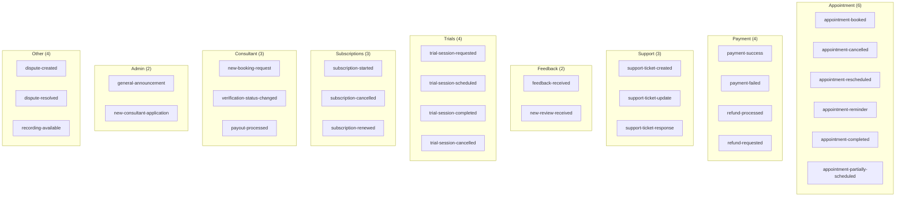
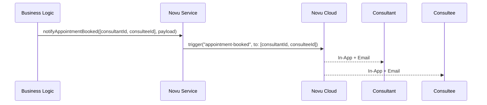

# Workflows and API Reference

## Novu Workflows Overview

All 28 workflow IDs are defined in `lib/novu/workflows.ts` as the `NOVU_WORKFLOWS` constant. Each ID must match its counterpart in the Novu dashboard.



Every node in the diagram above is an event id, the id the application still triggers with; the Novu workflow that actually receives the trigger is the event's family (see "Workflow families" below), not a node with that name.

---

## Workflow families

The Novu plan in use caps an environment at 20 workflows, and the application now has 67 events, so a Novu workflow is a family — one per audience-and-opt-out combination — rather than one per event. The event id the application triggers is unchanged; `toWire` in `lib/novu/templates/families.ts` maps it to its family and adds `payload.event`, and the family's body branches on that field with a Liquid `case`. There are 16 families, listed below with the events each one carries.

| Family ID        | Events                                                                                                                                                                                                                     |
| ---------------- | -------------------------------------------------------------------------------------------------------------------------------------------------------------------------------------------------------------------------- |
| `appointment`    | appointment-booked, appointment-partially-scheduled, appointment-cancelled, appointment-rescheduled, appointment-reminder, appointment-completed, new-booking-request                                                      |
| `session-media`  | recording-available, recording-failed, recording-expiring, document-uploaded, document-reviewed                                                                                                                            |
| `payment`        | payment-success, payment-failed, referral-credits-applied                                                                                                                                                                  |
| `refund`         | refund-requested, refund-processed, refund-failed, dispute-created, dispute-resolved                                                                                                                                       |
| `payout`         | payout-processed                                                                                                                                                                                                           |
| `referral`       | referral-bonus-earned, referee-welcome-bonus                                                                                                                                                                               |
| `subscription`   | subscription-started, subscription-cancelled, subscription-renewed                                                                                                                                                         |
| `trial`          | trial-session-requested, trial-session-scheduled, trial-session-completed, trial-session-cancelled                                                                                                                         |
| `support-ticket` | support-ticket-created, support-ticket-activity, support-ticket-update, support-ticket-response                                                                                                                            |
| `feedback`       | feedback-received, new-review-received                                                                                                                                                                                     |
| `account`        | verification-status-changed, new-consultant-application, moderation-warning, account-suspended, account-banned                                                                                                             |
| `collaborator`   | collaborator-invited, collaborator-accepted, collaborator-removed                                                                                                                                                          |
| `platform`       | general-announcement, maintenance-scheduled, maintenance-started, maintenance-ended                                                                                                                                        |
| `org-billing`    | org-invoice-issued, org-invoice-paid, org-invoice-overdue, org-wallet-topup-confirmed, org-wallet-low, org-payout-completed, org-payout-failed, org-payout-reversed, org-member-overage-timed-out, org-program-overage-due |
| `org-membership` | org-invite-sent, org-invite-accepted, org-expert-removed, org-sso-provider-deleted, org-sso-cert-expiring                                                                                                                  |
| `org-program`    | org-program-exhausted, org-program-cap-near, org-license-renewal-upcoming, org-data-export-ready                                                                                                                           |

---

## Payload conventions

The Novu templates live in the Novu dashboard rather than in this repository, and every one of them interpolates payload fields verbatim: `{{payload.dateTime}}`, `{{payload.amount}}`, `{{payload.planTitle}}`. Whatever this codebase puts in a field is therefore the exact text a customer reads in their inbox. Issue #536 was filed because that fact had been forgotten in several places at once, and the inbox was showing raw ISO timestamps, integer counts of paise and shouted enum members.

The rule the whole payload layer now follows is that **a template interpolates the unit-free field name and receives a value written for a person, while the machine-readable original travels beside it under the same stem with a unit suffix**. So `dateTime` carries `Sat, 6 Sep 2026 · 7:53 AM IST` and `dateTimeIso` carries `2026-09-06T02:23:35.600Z`; `amount` carries `₹55,679.48` and `amountPaise` carries `5567948`; `appointmentType` carries `consultation` and `appointmentTypeCode` carries `CONSULTATION`. A consumer that needs to compute or branch reads the suffixed field, and a template author never has to know which of two fields is safe to print.

Call sites do not perform any of this conversion themselves. Each `notifyX` function accepts an _input_ type — `AppointmentPayloadInput`, `PaymentSuccessInput`, `RefundInput` and so on — whose fields hold the values exactly as they are stored: an ISO string, an integer number of paise, the raw Prisma enum member. The trigger boundary in `lib/novu/service.ts` (and `lib/novu/org-workflows.ts` for the organisation workflows) converts them using the helpers in `lib/novu/humanize.ts` and sends the customer-facing shape. This keeps every notification consistent, and it means a new call site cannot forget to format anything.

### Dates render in the recipient's timezone

A date is only meaningful once you know whose clock it is on, so `formatNotificationDateTime` renders in the recipient's `User.timezone`, falling back to `Asia/Kolkata` when that column is unset or holds a zone Intl cannot resolve. The rendered string always names the zone it used, so nobody has to guess.

This has a consequence for the multi-recipient helpers. `triggerForMultiple` sends one payload to a list of subscribers, which means a single rendered date can be correct for at most one of them. Any workflow whose payload carries a date is therefore dispatched through `triggerForMultipleZoned` instead: it loads every recipient's zone in one query, groups the recipients by zone, and sends one payload per distinct zone. Both parties to a booking usually share a zone, so this is a single trigger in the common case and two in the cross-border one. The zone lookup is bounded by a short timeout and never throws — if it fails, every recipient is rendered in the platform default rather than the notification being lost.

Two payloads have no recipient whose zone could be used, and both say so in their field documentation. A maintenance broadcast goes to every subscriber at once, and an organisation invite is emailed to someone who does not have an account yet; both render in the platform default zone.

### Money is printed as money

Every amount reaching a notification is stored in integer minor units, and `formatNotificationMoney` renders it through `formatCurrencyAmount`, the platform's single paise-taking formatter. That formatter already knows the ISO 4217 decimal rules, so a zero-decimal or three-decimal currency is handled without the notification layer having an opinion. A payload never carries a bare integer in a field a template prints.

Money nevertheless arrives in two shapes, and the reason is a property of the live templates rather than of the money. Four in-app templates — `payment-success`, `payment-failed`, `refund-processed` and `refund-requested` — already print `{{payload.currency}} {{payload.amount}}`, and they cannot be edited on the Novu plan currently in use. A symbol-bearing `amount` would therefore render "INR ₹55,679.48" in exactly those four places. So `PaymentSuccessPayload`, `PaymentFailedPayload` and `RefundPayload` send `amount` as the localised figure with the symbol stripped (`55,679.48`), leave `currency` as the ISO code the template prints, and carry the symbol-bearing string alongside as `amountFormatted` for whichever template is written next. Every other money payload — `PayoutPayload`, `DisputePayload`, the referral payloads and the organisation ones — keeps the symbol in `amount`, because nothing prints a currency code beside it.

The stripping is done by `formatCurrencyAmountBare`, which removes the currency part from the currency formatter's own output rather than configuring a second formatter, so the grouping, locale and subunit rules cannot drift between the two shapes.

### Enums become labels, and a plan is named by its title

`cancelledByLabel` does the same job for the cancellation payload. The live `appointment-cancelled` template reads "{{cancelledBy}} cancelled the {{appointmentType}} session for {{planTitle}}. Reason: {{reason}}", so this field opens the sentence and every branch of it is capitalised. One payload reaches both parties at once, which is why the field names the person rather than describing them — "Your consultant" would be false for the consultant reading their own copy. It therefore renders "Sarah Chen", or "The platform" for a system-driven cancellation, and the raw discriminator moves to `cancelledByRole` for any template that wants to branch on who acted.

That template also ends on "Reason: ", which an absent value left dangling on a colon, and the moderation paths were passing the raw enum member `MODERATION` to a person it had just been used against. `cancellationReasonLabel` makes `reason` a required field on the wire payload: an exact `CancellationReason` member becomes a clause ("a moderation decision on this account"), free text a user typed passes through verbatim, and nothing at all becomes "No reason given". The enum table is exhaustive, so a reason added to the schema without copy fails the build rather than reaching an inbox as its own identifier.

`appointmentTypeLabel` maps `AppointmentsType` to the noun phrase a sentence needs — `consultation`, `subscription session`, `webinar`, `class`, `trial session` — and accepts both the Prisma enum member and the lower-case literals some booking paths already used, so the two sources cannot drift apart. `planTitle` is always the plan's own title. Where a plan row genuinely cannot be read, `planTitleOrSessionLabel` substitutes the capitalised session label rather than a developer placeholder; the three call sites that used to send `"N/A"` and the one that sent `"Unknown"` were naming, to the customer, the very thing that had just been cancelled or moved.

### A reschedule sentence always completes

The `appointment-rescheduled` template renders a "from X to Y" sentence, and three of the five reschedule outcomes have no destination time — a plain release hands the slots back to the consultant's queue precisely so that no new time exists yet. `AppointmentRescheduledInput` keeps the discriminated union introduced by #1083, so a caller still cannot construct a `MOVED` or `PROPOSED` outcome without both timestamps. The wire payload, however, declares `newDateTime` as required and the trigger boundary fills it with a phrase when there is no instant to render: "a new time your consultant will confirm" for a release, and "the time it was already booked for" for a declined or withdrawn proposal. The blank-blank sentence is therefore unrepresentable from either direction. Issue #1085 remains open for the template-side branch on `outcome`, which would let the release case read as its own sentence rather than reusing the "from … to …" shape.

## Workflows by Category

### Appointment Lifecycle

| Workflow ID                       | Trigger Function                                          | Recipients     | Payload Type                           |
| --------------------------------- | --------------------------------------------------------- | -------------- | -------------------------------------- |
| `appointment-booked`              | `notifyAppointmentBooked(userIds[], payload)`             | Both parties   | `AppointmentPayload`                   |
| `appointment-cancelled`           | `notifyAppointmentCancelled(userIds[], payload)`          | Both parties   | `AppointmentCancelledPayload`          |
| `appointment-rescheduled`         | `notifyAppointmentRescheduled(userIds[], payload)`        | Both parties   | `AppointmentRescheduledPayload`        |
| `appointment-reminder`            | _(cron job)_                                              | Both parties   | `AppointmentPayload`                   |
| `appointment-completed`           | `notifyAppointmentCompleted(userIds[], payload)`          | Both parties   | `AppointmentPayload`                   |
| `appointment-partially-scheduled` | `notifyAppointmentPartiallyScheduled(userIds[], payload)` | Consultee only | `AppointmentPartiallyScheduledPayload` |

The last of these is the only appointment workflow addressed to one party. It fires alongside `appointment-booked` when a consultant accepts a partial allocation (#1206), because the sessions that were placed are a real booking and already read as one; what the consultee would otherwise never learn is that the rest of the plan has no times yet. Its payload extends `AppointmentPayload` with `placedSessions`, `requiredSessions` and `unplacedSessions`, all whole sessions, all derived at the moment of allocation and none of them stored. Like every other workflow here, the definition must be created in the Novu dashboard under exactly that slug in each environment before the feature is released; the trigger is fire-and-forget, so a missing definition costs the notification silently rather than failing the allocation.



**AppointmentPayload fields**: `appointmentId?`, `appointmentType` (label), `appointmentTypeCode?` (raw enum), `consultantName`, `consulteeName`, `planTitle`, `dateTime?` (recipient-zone), `dateTimeIso?`, `dashboardUrl`. Callers pass `AppointmentPayloadInput`, which holds the raw enum and an ISO instant.

**AppointmentCancelledPayload** extends AppointmentPayload with: `reason` (required — a clause, or "No reason given"), `cancelledBy` (a capitalised name, or "The platform"), `cancelledByRole?` (the raw discriminator). Callers pass `AppointmentCancelledInput`, whose `cancelledBy` is still `"consultant" | "consultee" | "system"`.

**AppointmentRescheduledPayload** extends AppointmentPayload with: `outcome`, `oldDateTime?`, `oldDateTimeIso?`, `newDateTime` (required — a phrase when the outcome has no destination time), `newDateTimeIso?`. Callers pass `AppointmentRescheduledInput`, whose `RescheduleOutcomeFields` union still forbids a destination time on the outcomes that have none.

---

### Payment Events

| Workflow ID        | Trigger Function                                 | Recipients            | Payload Type            |
| ------------------ | ------------------------------------------------ | --------------------- | ----------------------- |
| `payment-success`  | `notifyPaymentSuccess(userId, payload)`          | Payer (consultee)     | `PaymentSuccessPayload` |
| `payment-failed`   | `notifyPaymentFailed(userId, payload)`           | Payer (consultee)     | `PaymentFailedPayload`  |
| `refund-processed` | `notifyRefundProcessed(userId, payload)`         | Recipient (consultee) | `RefundPayload`         |
| `refund-requested` | `notifyRefundRequested(adminUserIds[], payload)` | Admin team            | `RefundPayload`         |

**PaymentSuccessPayload**: `amount` (symbol-free figure), `amountFormatted` (with symbol), `amountPaise`, `currency`, `consultantName`, `appointmentType` (label), `appointmentTypeCode?`, `planTitle`, `receiptUrl?`, `dashboardUrl`. Callers pass `PaymentSuccessInput`, whose `amount` is an integer number of paise.

**PaymentFailedPayload**: `amount` (symbol-free figure), `amountFormatted` (with symbol), `amountPaise`, `currency`, `consultantName`, `appointmentType` (label), `appointmentTypeCode?`, `planTitle?`, `failureReason`, `retryUrl?`. Callers pass `PaymentFailedInput`.

**RefundPayload**: `amount` (symbol-free figure), `amountFormatted` (with symbol), `amountPaise`, `currency`, `reason?`, `appointmentType?` (label), `appointmentTypeCode?`, `consultantName?`, `dashboardUrl`. Callers pass `RefundInput`.

---

### Support Tickets

| Workflow ID               | Trigger Function                                                   | Recipients                     | Payload Type           |
| ------------------------- | ------------------------------------------------------------------ | ------------------------------ | ---------------------- |
| `support-ticket-created`  | `notifySupportTicketCreated(staffUserIds[], payload)`              | Staff team                     | `SupportTicketPayload` |
| `support-ticket-activity` | `notifySupportTicketActivity(staffUserIds[], payload, dedupeKey?)` | Assignee, else all STAFF/ADMIN | `SupportTicketPayload` |
| `support-ticket-update`   | `notifySupportTicketUpdate(userId, payload)`                       | Ticket author                  | `SupportTicketPayload` |
| `support-ticket-response` | `notifySupportTicketResponse(userId, payload)`                     | Ticket author                  | `SupportTicketPayload` |

`support-ticket-activity` is the ops side of a ticket — the customer replied or reopened — and is its own event rather than reusing `support-ticket-update`, so staff can later digest or throttle it without touching the ticket owner's bell.

**SupportTicketPayload**: `ticketId`, `reference?` (e.g. `FAM-2026-000007`), `ticketTitle`, `status?` (a sentence fragment, e.g. "in progress"), `statusCode?` (the raw enum), `userName?` (the customer, on the ops-facing workflows), `activity?` (`"replied" | "reopened"`, on `support-ticket-activity`), `message?`, `respondedBy?`, `dashboardUrl`

---

### Feedback and Reviews

| Workflow ID           | Trigger Function                                  | Recipients | Payload Type      |
| --------------------- | ------------------------------------------------- | ---------- | ----------------- |
| `feedback-received`   | `notifyFeedbackReceived(adminUserIds[], payload)` | Admin team | `FeedbackPayload` |
| `new-review-received` | `notifyNewReview(consultantUserId, payload)`      | Consultant | `ReviewPayload`   |

**FeedbackPayload**: `feedbackId`, `userName`, `category?`, `message`, `dashboardUrl`

**ReviewPayload**: `reviewerName`, `rating`, `comment?`, `planTitle?`, `dashboardUrl`

---

### Trial Sessions

| Workflow ID               | Trigger Function                                         | Recipients   | Payload Type          |
| ------------------------- | -------------------------------------------------------- | ------------ | --------------------- |
| `trial-session-requested` | `notifyTrialSessionRequested(consultantUserId, payload)` | Consultant   | `TrialSessionPayload` |
| `trial-session-scheduled` | `notifyTrialSessionScheduled(consulteeUserId, payload)`  | Consultee    | `TrialSessionPayload` |
| `trial-session-completed` | `notifyTrialSessionCompleted(userIds[], payload)`        | Both parties | `TrialSessionPayload` |
| `trial-session-cancelled` | `notifyTrialSessionCancelled(userIds[], payload)`        | Both parties | `TrialSessionPayload` |

**TrialSessionPayload**: `consultantName`, `consulteeName`, `planTitle`, `dateTime?` (recipient-zone), `dateTimeIso?`, `status` (label), `statusCode?`, `dashboardUrl`. Callers pass `TrialSessionInput`.

---

### Subscriptions

| Workflow ID              | Trigger Function                                  | Recipients   | Payload Type          |
| ------------------------ | ------------------------------------------------- | ------------ | --------------------- |
| `subscription-started`   | `notifySubscriptionStarted(userId, payload)`      | Consultee    | `SubscriptionPayload` |
| `subscription-cancelled` | `notifySubscriptionCancelled(userIds[], payload)` | Both parties | `SubscriptionPayload` |
| `subscription-renewed`   | `notifySubscriptionRenewed(userId, payload)`      | Consultee    | `SubscriptionPayload` |

**SubscriptionPayload**: `subscriptionId?`, `planTitle`, `consultantName`, `consulteeName?`, `dashboardUrl`

---

### Consultant-Specific

| Workflow ID                   | Trigger Function                                             | Recipients | Payload Type            |
| ----------------------------- | ------------------------------------------------------------ | ---------- | ----------------------- |
| `new-booking-request`         | `notifyNewBookingRequest(consultantUserId, payload)`         | Consultant | `BookingRequestPayload` |
| `verification-status-changed` | `notifyVerificationStatusChanged(consultantUserId, payload)` | Consultant | `VerificationPayload`   |
| `payout-processed`            | `notifyPayoutProcessed(consultantUserId, payload)`           | Consultant | `PayoutPayload`         |

**BookingRequestPayload**: `consulteeName`, `planTitle`, `appointmentType` (label), `appointmentTypeCode?`, `requestedDateTime?` (recipient-zone), `requestedDateTimeIso?`, `dashboardUrl`. Callers pass `BookingRequestInput`.

**VerificationPayload**: `status`, `reason?`, `dashboardUrl`

**PayoutPayload**: `amount` (formatted), `amountPaise`, `currency`, `payoutId?`, `dashboardUrl`. Callers pass `PayoutInput`.

---

### Admin / System

| Workflow ID                  | Trigger Function                                          | Recipients                  | Payload Type                   |
| ---------------------------- | --------------------------------------------------------- | --------------------------- | ------------------------------ |
| `general-announcement`       | `notifyGeneralAnnouncement(payload)`                      | All subscribers (broadcast) | `AnnouncementPayload`          |
| `new-consultant-application` | `notifyNewConsultantApplication(adminUserIds[], payload)` | Admin team                  | `ConsultantApplicationPayload` |

**AnnouncementPayload**: `title`, `content`, `linkUrl?`, `linkText?`

**ConsultantApplicationPayload**: `applicantName`, `applicantEmail`, `dashboardUrl`

---

### Disputes, Recordings

| Workflow ID           | Trigger Function                               | Recipients   | Payload Type       |
| --------------------- | ---------------------------------------------- | ------------ | ------------------ |
| `dispute-created`     | `notifyDisputeCreated(userIds[], payload)`     | Both parties | `DisputePayload`   |
| `dispute-resolved`    | `notifyDisputeResolved(userIds[], payload)`    | Both parties | `DisputePayload`   |
| `recording-available` | `notifyRecordingAvailable(userIds[], payload)` | Both parties | `RecordingPayload` |

**DisputePayload**: `disputeId?`, `amount` (formatted), `amountPaise`, `currency`, `reason?`, `status?`, `consultantName?`, `consulteeName?`, `dashboardUrl`. Callers pass `DisputeInput`.

**RecordingPayload**: `appointmentType` (label), `appointmentTypeCode?`, `consultantName`, `consulteeName?`, `recordingUrl`, `dashboardUrl`.

---

## Resend Direct Emails

These emails bypass Novu and are sent directly through Resend with React Email templates.

### Auth Emails (`lib/email.ts`)

| Function                                                         | Subject                                               | From                       |
| ---------------------------------------------------------------- | ----------------------------------------------------- | -------------------------- |
| `sendWelcomeEmail({email, name, dashboardUrl?})`                 | "Welcome to Familiarise!"                             | onboarding@familiarise.com |
| `sendPasswordResetEmail({email, name, token})`                   | "Reset your Familiarise password"                     | security@familiarise.com   |
| `sendAccountLinkedEmail({email, name, provider, dashboardUrl?})` | "Your Familiarise account now linked with {provider}" | security@familiarise.com   |

### Payment Emails (`lib/email.ts`)

| Function                                                                                                                         | Subject                                        | From                     |
| -------------------------------------------------------------------------------------------------------------------------------- | ---------------------------------------------- | ------------------------ |
| `sendPaymentLinkEmail({email, name, consultantName, appointmentType, amount, currency, paymentUrl, expiresAt})`                  | "Payment Required - {Type} with {Consultant}"  | payments@familiarise.com |
| `sendPaymentSuccessEmail({email, name, consultantName, appointmentType, amount, currency, receiptUrl?, dashboardUrl?})`          | "Payment Confirmed - {Type} with {Consultant}" | payments@familiarise.com |
| `sendPaymentFailedEmail({email, name, consultantName, appointmentType, amount, currency, retryUrl, failureReason?, expiresAt?})` | "Payment Failed - {Type} with {Consultant}"    | payments@familiarise.com |

### POST /api/novu/subscriber

Syncs the authenticated user to Novu as a subscriber. Called by the `useNovuSubscriberSync` hook on dashboard mount.

**Auth**: Required (NextAuth session)

**Request**: No body required (uses session user ID)

**Response**:

```json
{ "success": true }
```

**Errors**:
| Status | Error | Cause |
|--------|-------|-------|
| 401 | `"Unauthorized"` | No valid session |
| 404 | `"User not found"` | User ID not in database |
| 500 | `"Sync failed"` | Novu API error |

---

### GET /api/novu/preferences

Returns the current user's notification preferences. If none exist, returns defaults.

**Auth**: Required (NextAuth session)

**Response** (defaults shown):

```json
{
  "allNotifications": true,
  "inAppEnabled": true,
  "emailEnabled": true,
  "pushEnabled": false,
  "mentions": false,
  "directMessages": false,
  "updates": false,
  "appointmentReminders": true,
  "paymentNotifications": true,
  "supportUpdates": true,
  "feedbackAlerts": true,
  "trialNotifications": true,
  "subscriptionAlerts": true,
  "marketingEmails": false,
  "quietHoursEnabled": false,
  "quietHoursStart": null,
  "quietHoursEnd": null,
  "quietHoursTimezone": null
}
```

---

### PUT /api/novu/preferences

Updates notification preferences. Accepts partial updates (any subset of fields).

**Auth**: Required (NextAuth session)

**Request body** (all fields optional):

```json
{
  "emailEnabled": false,
  "appointmentReminders": false,
  "quietHoursEnabled": true,
  "quietHoursStart": "22:00",
  "quietHoursEnd": "08:00",
  "quietHoursTimezone": "Asia/Kolkata"
}
```

**Validation**: `NotificationPreferenceUpdateSchema` (partial Zod schema from `schemas/user.ts`)

**Side effect**: If `inAppEnabled`, `emailEnabled`, or `pushEnabled` changes, the channel preferences are also synced to the Novu subscriber via `updateSubscriberPreferences()`.

**Response**: Full updated preferences object

**Errors**:
| Status | Error | Cause |
|--------|-------|-------|
| 400 | `"Validation failed"` | Request body fails Zod validation |
| 401 | `"Unauthorized"` | No valid session |
| 500 | `"Failed to update preferences"` | Database or Novu API error |

---

## Integration Points

### Where Notifications Are Triggered in the Codebase

```mermaid
graph TD
    subgraph "Registration"
        R1["/api/auth/register"] -->|sendWelcomeEmail| RES[Resend]
        R1 -->|syncSubscriber| NOVU[Novu]
    end

    subgraph "Booking Flow"
        B1["Consultation/Subscription approval"] -->|notifyAppointmentBooked| NOVU
        B2["Cancellation API"] -->|notifyAppointmentCancelled| NOVU
        B3["Reschedule API"] -->|notifyAppointmentRescheduled| NOVU
    end

    subgraph "Payment Webhooks"
        P1["Stripe/Razorpay webhook"] -->|sendPaymentSuccessEmail| RES
        P1 -->|notifyPaymentSuccess| NOVU
        P2["Payment failure"] -->|sendPaymentFailedEmail| RES
        P2 -->|notifyPaymentFailed| NOVU
    end

    subgraph "Request Approval"
        A1["Consultant approves"] -->|sendPaymentLinkEmail| RES
        A1 -->|notifyNewBookingRequest| NOVU
    end

    subgraph "Support"
        S1["Ticket created"] -->|notifySupportTicketCreated| NOVU
        S2["Staff responds"] -->|notifySupportTicketResponse| NOVU
    end

    subgraph "Cron Jobs"
        CJ1["Appointment reminders"] -->|APPOINTMENT_REMINDER workflow| NOVU
        CJ3["Auto-complete"] -->|notifyAppointmentCompleted| NOVU
    end

    subgraph "Admin"
        AD1["/api/announcements"] -->|notifyGeneralAnnouncement| NOVU
    end
```



### Adding a New Notification

1. **Add workflow ID** to `NOVU_WORKFLOWS` in `lib/novu/workflows.ts`
2. **Add payload type** in the same file
3. **Add trigger function** in `lib/novu/service.ts` using `triggerWorkflow` or `triggerForMultiple`
4. **Create workflow** in the Novu dashboard with matching ID
5. **Call the trigger function** from the relevant API route/webhook handler (inside try-catch, after the main transaction)
