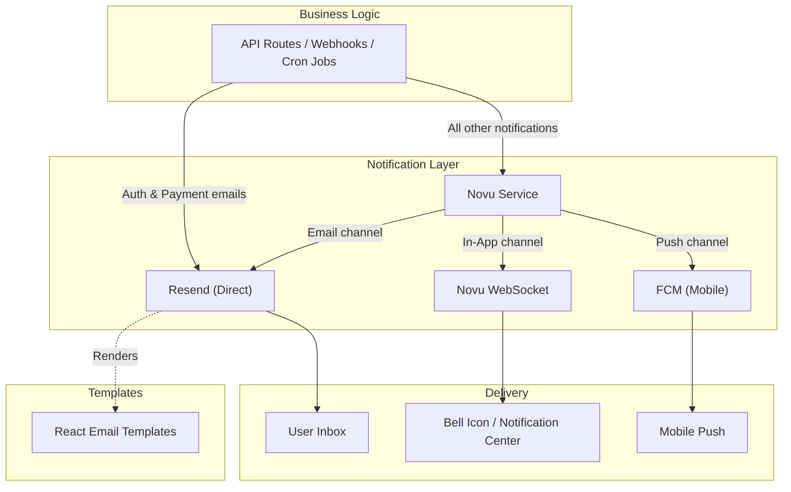

# Notification System

The notification system uses a dual-layer architecture: **Resend** for direct transactional email delivery and **Novu** for multi-channel notification orchestration (in-app, email, push). Neither layer blocks the main transaction flow — a notification call never causes the calling operation to roll back. As of #474, however, Resend sends are no longer pure fire-and-forget: when a transactional email send fails, the already-rendered message is persisted to the `FailedEmail` table and a retry worker re-sends it with backoff, so a transient Resend outage no longer silently drops the email. Novu triggers remain genuinely fire-and-forget.

## Core Principles

- **Non-blocking** -- notification calls are wrapped in try-catch and never block the calling operation; Novu failures are logged, while as of #474 a failed Resend transactional send is also persisted to `FailedEmail` and replayed by a retry worker rather than merely logged
- **Graceful degradation** -- if `NOVU_SECRET_KEY` or `RESEND_API_KEY` is missing, functions return `{success: false}` instead of throwing
- **Singleton clients** -- both Resend and Novu use lazy-initialized singleton instances
- **Subscriber = User** -- Novu `subscriberId` is the Prisma `User.id`
- **27 Novu workflows** -- each maps to a specific business event with typed payloads
- **10 React Email templates** -- server-rendered HTML via `@react-email/render`
- **User preferences** -- channel toggles (in-app, email, push), category toggles (7 categories), quiet hours

## Source Code Map

### Backend Services

| File                            | Purpose                                                                                         |
| ------------------------------- | ----------------------------------------------------------------------------------------------- |
| `lib/novu/client.ts`            | Singleton Novu client, `isNovuConfigured()` guard                                               |
| `lib/novu/service.ts`           | 20+ trigger functions: `notifyAppointmentBooked`, `notifyPaymentSuccess`, etc.                  |
| `lib/novu/workflows.ts`         | 28 workflow ID constants + 17 typed payload interfaces                                          |
| `lib/novu/subscriber.ts`        | `syncSubscriber`, `updateSubscriberPreferences`, `deleteSubscriber`                             |
| `lib/email.ts`                  | 6 Resend email functions (welcome, password reset, account linked, payment link/success/failed) |

### Frontend

| File                             | Purpose                                                       |
| -------------------------------- | ------------------------------------------------------------- |
| `providers/NovuProvider.tsx`     | Client-side Novu SDK wrapper, auth-gated                      |
| `hooks/useNovuSubscriberSync.ts` | Auto-syncs user to Novu on dashboard mount (30-min staleTime) |

### API Routes

| Route                   | Method | Purpose                                                       |
| ----------------------- | ------ | ------------------------------------------------------------- |
| `/api/novu/subscriber`  | POST   | Syncs authenticated user to Novu as subscriber                |
| `/api/novu/preferences` | GET    | Returns user's notification preferences (with defaults)       |
| `/api/novu/preferences` | PUT    | Updates notification preferences, syncs channel prefs to Novu |

### Email Templates (`emails/`)

| Template                                  | Category | Sent Via      |
| ----------------------------------------- | -------- | ------------- |
| `waitlist/WaitlistConfirmEmail.tsx`       | Newsletter | lib/email.ts |
| `waitlist/WaitlistWelcomeEmail.tsx`       | Newsletter | lib/email.ts |
| `auth/WelcomeEmail.tsx`                   | Auth     | Resend direct |
| `auth/PasswordResetEmail.tsx`             | Auth     | Resend direct |
| `auth/AccountLinkedEmail.tsx`             | Auth     | Resend direct |
| `payments/PaymentLinkEmail.tsx`           | Payments | Resend direct |
| `payments/PaymentSuccessEmail.tsx`        | Payments | Resend direct |
| `payments/PaymentFailedEmail.tsx`         | Payments | Resend direct |

### Schemas

| File              | Purpose                                                              |
| ----------------- | -------------------------------------------------------------------- |
| `schemas/user.ts` | `NotificationPreferenceSchema`, `NotificationPreferenceUpdateSchema` |

## Quick Navigation

| I want to...                           | Go to                                                      |
| -------------------------------------- | ---------------------------------------------------------- |
| Understand the dual-layer architecture | [01-architecture.md](./01-architecture.md)                 |
| See all 27 workflows and API endpoints | [02-workflows-and-api.md](./02-workflows-and-api.md)       |
| Understand the payment system          | [../payments/architecture.md](../payments/architecture.md) |
| Check the database schema              | [../../prisma/schema.prisma](../../prisma/schema.prisma)   |
