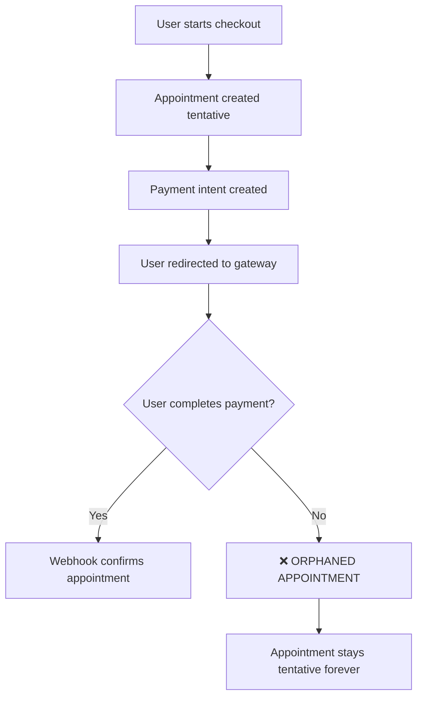

# Abandoned Payment Solutions

## Problem Statement

**Your Question**: "_If after the prodcheckout success, the payment gateway UI loads and the user quits midway, or the app crashes or the net disconnects, how will the rollback happen then?_"

This is a **critical gap** in the current payment processing workflow that can lead to:

1. **Orphaned Appointments** - Database entries with `isTentative: true` that never get resolved
2. **Resource Leakage** - Blocked time slots and database bloat
3. **Payment Inconsistencies** - Payment intents that may still charge users
4. **Poor User Experience** - Confusion about booking status

## Current Flow Issues



## Implemented Solutions

### 1. **Automated Cleanup Job** ⏰

**File**: `app/api/cleanup/abandoned-payments/route.ts`

**What it does**:

- Runs every 15 minutes via cron job
- Finds appointments older than 30 minutes with pending payments
- Cancels payment intents with payment gateways
- Removes orphaned appointment data

**Detection Logic**:

```typescript
// Find abandoned appointments
const abandonedAppointments = await prisma.appointment.findMany({
  where: {
    createdAt: { lt: abandonedThreshold }, // 30+ minutes old
    slotsOfAppointment: { some: { isTentative: true } }, // Tentative slots
    payment: { some: { paymentStatus: "PENDING" } }, // Pending payments
  },
});
```

**Cleanup Process**:

- **Webinars/Classes**: Removes only tentative slot connections (preserves event)
- **Consultations/Subscriptions**: Deletes entire appointment chain

### 2. **Enhanced Webhook Handling** 🔄

**Files**: `app/api/webhooks/stripe/route.ts`, `app/api/webhooks/razorpay/route.ts` (dispatch via `app/api/webhooks/razorpay-dispatch.ts`)

**Improvements**:

- Enhanced `handlePaymentFailure()` function
- Uses same rollback logic as immediate failures
- Consistent cleanup across all failure scenarios
- Better error logging and monitoring

**Key Changes**:

```typescript
// Enhanced payment failure handling
async function handlePaymentFailure(paymentIntentId: string) {
  // Includes appointment relations for proper cleanup
  const payment = await tx.payment.findFirst({
    include: { appointment: { include: { consultation: true, ... } } }
  });

  // Uses same rollback logic as immediate failures
  await rollbackAppointment(payment.appointmentId, appointmentType);
}
```

### 3. **Future Database Schema Enhancements** 📊

**Files**:

- `prisma/schema.prisma` (updated with timeout fields)
- `prisma/migrations/add_appointment_timeout/migration.sql`

**Planned Additions**:

```prisma
model Appointment {
  paymentExpiresAt DateTime? // For tracking abandoned payments
  @@index([paymentExpiresAt])
}

model Payment {
  expiresAt DateTime? // For tracking payment intent expiration
  @@index([expiresAt, paymentStatus])
}
```

### 4. **Monitoring and Documentation** 📖

**Files**:

- `docs/cron-setup.md` - Deployment and cron configuration
- `docs/abandoned-payment-solutions.md` - This comprehensive guide

## Deployment Options

### Option 1: Vercel Cron Jobs

```json
{
  "crons": [
    {
      "path": "/api/cleanup/abandoned-payments",
      "schedule": "*/15 * * * *"
    }
  ]
}
```

### Option 2: External Cron Services

```bash
curl -X POST https://your-domain.com/api/cleanup/abandoned-payments \
  -H "Authorization: Bearer YOUR_CRON_SECRET"
```

### Option 3: GitHub Actions

```yaml
on:
  schedule:
    - cron: "*/15 * * * *"
```

## Security & Error Handling

### Authentication

- Requires `CRON_SECRET` environment variable
- Prevents unauthorized cleanup calls

### Error Resilience

- Individual appointment failures don't stop the entire cleanup
- Payment gateway errors are logged but don't block database cleanup
- Database operations wrapped in transactions for atomicity

### Monitoring

```json
{
  "success": true,
  "cleanedCount": 5,
  "totalFound": 7,
  "errors": ["Failed to cancel payment abc123: Gateway timeout"]
}
```

## Testing Strategy

### 1. **Manual Testing**

```bash
# Create abandoned appointment
1. Start checkout but don't complete payment
2. Wait 30+ minutes
3. Run cleanup job manually
4. Verify appointment is removed
```

### 2. **Monitoring Queries**

```sql
-- Check for abandoned appointments
SELECT a.id, a.createdAt, p.paymentStatus, s.isTentative
FROM "Appointment" a
JOIN "Payment" p ON p.appointmentId = a.id
JOIN "SlotOfAppointment" s ON s.appointmentId = a.id
WHERE a.createdAt < NOW() - INTERVAL '30 minutes'
  AND p.paymentStatus = 'PENDING'
  AND s.isTentative = true;
```

## Comparison: Before vs After

| Scenario                   | Before                           | After                         |
| -------------------------- | -------------------------------- | ----------------------------- |
| User quits payment gateway | ❌ Orphaned appointment forever  | ✅ Cleaned up in 30 minutes   |
| App crashes during payment | ❌ Database inconsistency        | ✅ Automatic rollback         |
| Network disconnects        | ❌ Payment intent remains active | ✅ Payment intent cancelled   |
| Gateway timeout            | ❌ No cleanup mechanism          | ✅ Webhook + cron job cleanup |

## Recommended Rollout Plan

### Phase 1: Monitoring (Week 1)

- Deploy cleanup job with 60-minute timeout
- Monitor for false positives
- Collect metrics on abandonment rates

### Phase 2: Optimization (Week 2)

- Reduce timeout to 30 minutes
- Fine-tune error handling
- Add alerting for high abandonment rates

### Phase 3: Schema Enhancement (Week 3+)

- Migrate database with timeout fields
- Implement real-time expiration tracking
- Add payment intent timeout coordination

## Key Benefits

1. **Data Consistency** - No more orphaned appointments
2. **Resource Efficiency** - Time slots freed up automatically
3. **User Experience** - Clear booking status, no confusion
4. **Cost Control** - Prevents unnecessary payment gateway charges
5. **Operational Reliability** - Automated cleanup reduces manual intervention

## Future Enhancements

1. **Real-time Cleanup** - WebSocket-based timeout tracking
2. **Smart Retry Logic** - Attempt to resume interrupted payments
3. **User Notifications** - Email alerts for abandoned checkouts
4. **Analytics Dashboard** - Track abandonment patterns and optimize UX
5. **Payment Gateway Coordination** - Synchronized timeout across all gateways

This comprehensive solution addresses your concern about abandoned payments and ensures the system remains consistent and reliable even when users don't complete the payment process.
