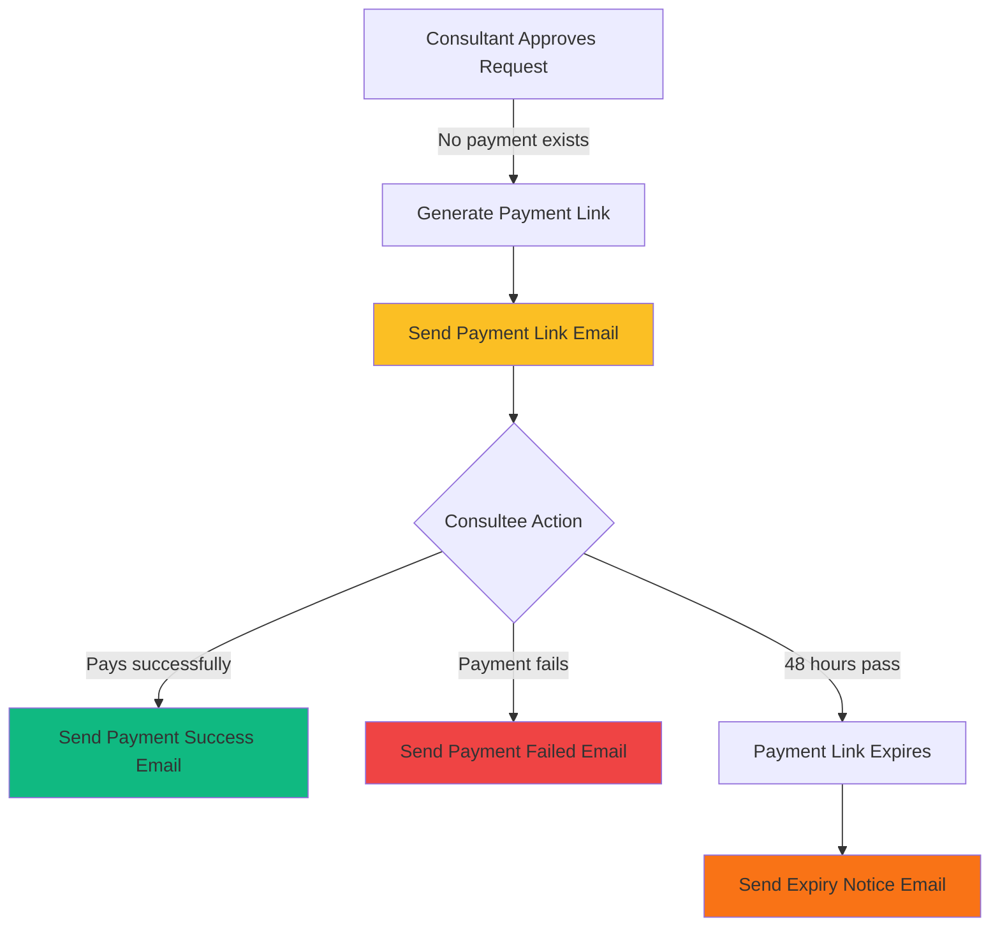

# Email Notification System

## Overview

The email notification system keeps consultees informed at every stage of the payment approval workflow. We use **Resend API** with **React Email** templates for professional, responsive HTML emails.

## Email Flow



## Email Types

### 1. Payment Link Email 💳

**Trigger**: Consultant approves request, no payment exists
**Sent To**: Consultee
**Expiry**: 48 hours

```typescript
await sendPaymentLinkEmail({
  email: "consultee@example.com",
  name: "John Doe",
  consultantName: "Dr. Jane Smith",
  appointmentType: "consultation", // or "subscription"
  amount: 100,
  currency: "USD",
  paymentUrl: "https://checkout.stripe.com/c/pay/...",
  expiresAt: new Date(Date.now() + 48 * 60 * 60 * 1000),
});
```

**Email Content**:

```
Subject: Payment Required - Consultation with Dr. Jane Smith

Hi John,

Great news! Dr. Jane Smith has approved your consultation request. To
proceed with scheduling, please complete your payment:

┌────────────────────────────────┐
│ Amount: USD 100                │
│ Type: Consultation             │
│ Consultant: Dr. Jane Smith     │
│ Expires: January 15, 2025      │
└────────────────────────────────┘

[Complete Payment] (Button)

⏰ Important: This payment link expires in 48 hours. If you don't
complete payment before January 15, 2025 at 3:00 PM, your request
will be reverted to pending status.

Questions? Contact support@familiarise.com

Best regards,
The Familiarise Team
```

### 2. Payment Success Email ✅

**Trigger**: Payment webhook received (payment.succeeded)
**Sent To**: Consultee

```typescript
await sendPaymentSuccessEmail({
  email: "consultee@example.com",
  name: "John Doe",
  consultantName: "Dr. Jane Smith",
  appointmentType: "consultation",
  amount: 100,
  currency: "USD",
  receiptUrl: "https://dashboard.stripe.com/receipts/...",
  dashboardUrl: "https://familiarise.com/dashboard",
});
```

**Email Content**:

```
Subject: Payment Confirmed - Consultation with Dr. Jane Smith

Hi John,

✓ Payment Successful!

Your payment has been successfully processed. Your consultation with
Dr. Jane Smith is now confirmed.

┌────────────────────────────────┐
│ Amount Paid: USD 100           │
│ Type: Consultation             │
│ Consultant: Dr. Jane Smith     │
└────────────────────────────────┘

What's next?
• Check your dashboard for appointment details
• You'll receive a calendar invite with meeting link
• Prepare questions for your consultation

[View Dashboard] (Button)
[Download Receipt] (Link)

Best regards,
The Familiarise Team
```

### 3. Payment Failed Email ❌

**Trigger**: Payment webhook received (payment.failed)
**Sent To**: Consultee

```typescript
await sendPaymentFailedEmail({
  email: "consultee@example.com",
  name: "John Doe",
  consultantName: "Dr. Jane Smith",
  appointmentType: "consultation",
  amount: 100,
  currency: "USD",
  retryUrl: "https://familiarise.com/consultations/clx123/payment",
  failureReason: "Card declined",
  expiresAt: new Date(Date.now() + 48 * 60 * 60 * 1000),
});
```

**Email Content**:

```
Subject: Payment Failed - Consultation with Dr. Jane Smith

Hi John,

⚠ Payment Failed

We were unable to process your payment for the consultation with
Dr. Jane Smith.

Reason: Card declined

┌────────────────────────────────┐
│ Amount: USD 100                │
│ Type: Consultation             │
│ Payment Link Expires: Jan 15   │
└────────────────────────────────┘

What to do next:
• Check that your payment method has sufficient funds
• Verify billing information is correct
• Try a different payment method

[Retry Payment] (Button)

⏰ Time Sensitive: This payment link expires in 48 hours. Complete
payment before the deadline or your request will revert to pending.

Need help? Contact support@familiarise.com

Best regards,
The Familiarise Team
```

### 4. Expiry Notice Email (Future Enhancement) ⏰

**Trigger**: Cron job detects expired payment link
**Sent To**: Consultee and Consultant

> **Note**: Currently logged but not yet implemented as email. Add in future iteration.

## Email Templates

### Technology Stack

- **React Email**: Component-based email templates
- **Resend API**: Email delivery service
- **Inline CSS**: For email client compatibility

### Template Structure

```
emails/payments/
├── PaymentLinkEmail.tsx       # Payment link with expiry countdown
├── PaymentSuccessEmail.tsx    # Success confirmation
└── PaymentFailedEmail.tsx     # Failure with retry instructions
```

### Example Template (React Email)

```tsx
// emails/payments/PaymentLinkEmail.tsx
import { Button } from "@react-email/button";
import { Container } from "@react-email/container";
import { Html } from "@react-email/html";
import { Text } from "@react-email/text";

interface PaymentLinkEmailProps {
  name: string;
  consultantName: string;
  appointmentType: "consultation" | "subscription";
  amount: number;
  currency: string;
  paymentUrl: string;
  expiresAt: string;
}

export const PaymentLinkEmail = ({
  name,
  consultantName,
  appointmentType,
  amount,
  currency,
  paymentUrl,
  expiresAt,
}: PaymentLinkEmailProps) => {
  const expiryDate = new Date(expiresAt).toLocaleDateString("en-US", {
    weekday: "long",
    year: "numeric",
    month: "long",
    day: "numeric",
    hour: "2-digit",
    minute: "2-digit",
  });

  return (
    <Html>
      <Container style={container}>
        <Text style={heading}>Payment Required</Text>

        <Text style={paragraph}>Hi {name},</Text>

        <Text style={paragraph}>
          Great news! <strong>{consultantName}</strong> has approved your{" "}
          {appointmentType} request. Please complete your payment to proceed
          with scheduling:
        </Text>

        <Container style={detailsBox}>
          <Text>
            Amount: {currency} {amount}
          </Text>
          <Text>
            Type:{" "}
            {appointmentType.charAt(0).toUpperCase() + appointmentType.slice(1)}
          </Text>
          <Text>Consultant: {consultantName}</Text>
          <Text>Expires: {expiryDate}</Text>
        </Container>

        <Button style={button} href={paymentUrl}>
          Complete Payment
        </Button>

        <Text style={warning}>
          ⏰ <strong>Time Sensitive:</strong> This payment link expires in 48
          hours. If you don't complete payment before {expiryDate}, your request
          will revert to pending status.
        </Text>

        <Text style={paragraph}>
          Best regards,
          <br />
          The Familiarise Team
        </Text>
      </Container>
    </Html>
  );
};

const container = {
  margin: "0 auto",
  padding: "20px",
  maxWidth: "600px",
};

const heading = {
  fontSize: "24px",
  fontWeight: "bold",
  color: "#1f2937",
};

const paragraph = {
  fontSize: "16px",
  lineHeight: "1.5",
  color: "#374151",
};

const detailsBox = {
  backgroundColor: "#f9fafb",
  padding: "16px",
  borderRadius: "8px",
  margin: "20px 0",
};

const button = {
  backgroundColor: "#2563eb",
  color: "#ffffff",
  padding: "12px 24px",
  borderRadius: "6px",
  textDecoration: "none",
  fontWeight: "600",
};

const warning = {
  backgroundColor: "#fef3c7",
  padding: "12px",
  borderRadius: "6px",
  fontSize: "14px",
  color: "#92400e",
};
```

## Email Service Implementation

### Configuration

```typescript
// lib/email.ts
import { Resend } from "resend";

const RESEND_API_KEY = process.env.RESEND_API_KEY;

let resendClient: Resend | null = null;

function getResendClient(): Resend | null {
  if (!RESEND_API_KEY) {
    console.warn("RESEND_API_KEY not configured. Emails disabled.");
    return null;
  }

  if (!resendClient) {
    resendClient = new Resend(RESEND_API_KEY);
  }

  return resendClient;
}
```

### Send Function

```typescript
export async function sendPaymentLinkEmail({
  email,
  name,
  consultantName,
  appointmentType,
  amount,
  currency,
  paymentUrl,
  expiresAt,
}: {
  email: string;
  name: string;
  consultantName: string;
  appointmentType: "consultation" | "subscription";
  amount: number;
  currency: string;
  paymentUrl: string;
  expiresAt: Date;
}) {
  try {
    const resend = getResendClient();

    if (!resend) {
      console.error("Resend not configured. Cannot send payment link email.");
      return { success: false, error: "Email service not configured" };
    }

    const html = await render(
      PaymentLinkEmail({
        name,
        consultantName,
        appointmentType,
        amount,
        currency,
        paymentUrl,
        expiresAt: expiresAt.toISOString(),
      }),
    );

    const appointmentLabel =
      appointmentType.charAt(0).toUpperCase() + appointmentType.slice(1);

    const data = await resend.emails.send({
      from: "Familiarise Payments <payments@familiarise.com>",
      to: email,
      subject: `Payment Required - ${appointmentLabel} with ${consultantName}`,
      html,
    });

    console.log(`📧 Payment link email sent to ${email}`);
    return { success: true, data };
  } catch (error) {
    console.error("Failed to send payment link email:", error);
    return { success: false, error };
  }
}
```

## Email Integration Points

### 1. Approval Endpoints

```typescript
// app/api/bookings/consultations/[consultationId]/route.ts
export async function PATCH(request, { params }) {
  // ... approval logic ...

  if (status === AppointmentStatus.APPROVED && !hasPayment) {
    // Generate payment link
    const paymentResult = await generatePaymentLink(consultation);

    // Send email (inside transaction)
    await sendPaymentLinkEmail({
      email: consultation.requestedBy.user.email,
      name: consultation.requestedBy.user.name,
      consultantName: consultation.consultationPlan.consultantProfile.user.name,
      appointmentType: "consultation",
      amount: paymentResult.amount,
      currency: paymentResult.currency,
      paymentUrl: paymentResult.checkoutUrl,
      expiresAt: new Date(Date.now() + 48 * 60 * 60 * 1000),
    });

    console.log(
      `📧 Payment link email sent for consultation ${consultation.id}`,
    );
  }
}
```

### 2. Webhook Handlers

```typescript
// lib/payments/webhooks/handlers.ts
export async function handlePaymentSuccess(paymentIntentId, metadata) {
  await prisma.$transaction(async (tx) => {
    // ... payment processing ...

    // Send success email
    await sendPaymentSuccessEmail({
      email: payment.user.email,
      name: payment.user.name,
      consultantName,
      appointmentType,
      amount: payment.amount,
      currency: payment.currency,
      dashboardUrl: `${process.env.NEXT_PUBLIC_APP_URL}/dashboard`,
    });

    console.log(`📧 Payment success email sent for ${appointmentType}`);
  });
}

export async function handlePaymentFailure(paymentIntentId) {
  await prisma.$transaction(async (tx) => {
    // ... failure handling ...

    // Send failure email
    await sendPaymentFailedEmail({
      email: payment.user.email,
      name: payment.user.name,
      consultantName,
      appointmentType,
      amount: payment.amount,
      currency: payment.currency,
      retryUrl,
      failureReason: payment.description || "Payment could not be processed",
      expiresAt: new Date(Date.now() + 48 * 60 * 60 * 1000),
    });

    console.log(`📧 Payment failure email sent for ${appointmentType}`);
  });
}
```

## Error Handling

### Email Sending Failures

```typescript
// Emails sent inside transaction but failures don't block payment
try {
  await sendPaymentLinkEmail({ ... });
} catch (error) {
  // Log error but continue - payment link was still generated
  console.error("Failed to send email:", error);
  // Don't throw - payment workflow should not fail due to email issues
}
```

### Graceful Degradation

```typescript
// Check if Resend is configured
const resend = getResendClient();

if (!resend) {
  // Email service not configured - log warning but don't fail
  console.error("RESEND_API_KEY not configured. Email not sent.");
  return { success: false, error: "Email service not configured" };
}
```

## Testing Email Templates

### Preview in Development

```bash
# Install React Email CLI
npm install -g react-email

# Start preview server
cd emails
react-email dev
```

Preview at: http://localhost:3000

### Send Test Email

```typescript
// scripts/test-email.ts
import { sendPaymentLinkEmail } from "@/lib/email";

async function testEmail() {
  await sendPaymentLinkEmail({
    email: "test@example.com",
    name: "Test User",
    consultantName: "Dr. Test",
    appointmentType: "consultation",
    amount: 100,
    currency: "USD",
    paymentUrl: "https://checkout.stripe.com/test",
    expiresAt: new Date(Date.now() + 48 * 60 * 60 * 1000),
  });

  console.log("Test email sent!");
}

testEmail();
```

## Email Delivery Monitoring

### Resend Dashboard

Monitor at: https://resend.com/emails

**Key Metrics**:

- Delivery rate
- Bounce rate
- Open rate (if tracking enabled)
- Click rate

### Application Logs

```typescript
// Success log
console.log(`📧 Payment link email sent to ${email} for ${appointmentType}`);

// Failure log
console.error("Failed to send payment link email:", error);
```

## Best Practices

### ✅ DO

1. **Use descriptive subject lines**

```typescript
subject: `Payment Required - Consultation with ${consultantName}`;
// Not: "Payment Link"
```

2. **Include all relevant details**

```typescript
// Include: amount, currency, consultant name, expiry date
// Don't make users click links to see basic info
```

3. **Make CTAs prominent**

```tsx
<Button style={prominentButton} href={paymentUrl}>
  Complete Payment
</Button>
```

4. **Handle errors gracefully**

```typescript
// Log but don't throw - emails are non-critical
try {
  await sendEmail();
} catch (error) {
  console.error(error);
  // Continue processing
}
```

### ❌ DON'T

1. **Don't block critical flows on email**

```typescript
// ❌ Bad: Payment fails if email fails
await sendEmail(); // throws error
await processPayment();

// ✅ Good: Email failure doesn't affect payment
try {
  await sendEmail();
} catch {}
await processPayment();
```

2. **Don't send duplicate emails**

```typescript
// ❌ Bad: Send email on every webhook retry
await sendPaymentSuccessEmail();

// ✅ Good: Check if already sent
if (payment.emailSent) return;
await sendPaymentSuccessEmail();
```

3. **Don't use plain text for complex layouts**

```typescript
// ❌ Bad: Plain text with manual formatting
const text = `Amount: ${amount}\nType: ${type}`;

// ✅ Good: HTML with React Email
const html = await render(<PaymentLinkEmail {...props} />);
```

## Configuration Reference

### Environment Variables

```bash
# Resend API
RESEND_API_KEY=re_your_api_key_here

# Application URL (for email links)
NEXT_PUBLIC_APP_URL=https://familiarise.com
```

### Email Sender Addresses

```typescript
const EMAIL_SENDERS = {
  onboarding: "Familiarise <onboarding@familiarise.com>",
  payments: "Familiarise Payments <payments@familiarise.com>",
  security: "Familiarise Security <security@familiarise.com>",
  support: "Familiarise Support <support@familiarise.com>",
};
```

### Rate Limits (Resend)

| Tier     | Emails/Month | Rate Limit |
| -------- | ------------ | ---------- |
| Free     | 100          | 2/second   |
| Pro      | 50,000       | 10/second  |
| Business | 100,000+     | Custom     |

## Future Enhancements

1. **Email Templates in Database**: Store templates in DB for easy editing
2. **A/B Testing**: Test different subject lines and CTAs
3. **Localization**: Multi-language support based on user preference
4. **Email Preferences**: Let users opt-out of non-critical emails
5. **SMS Notifications**: Add SMS for time-sensitive notifications
6. **Push Notifications**: Browser/mobile push for real-time updates
