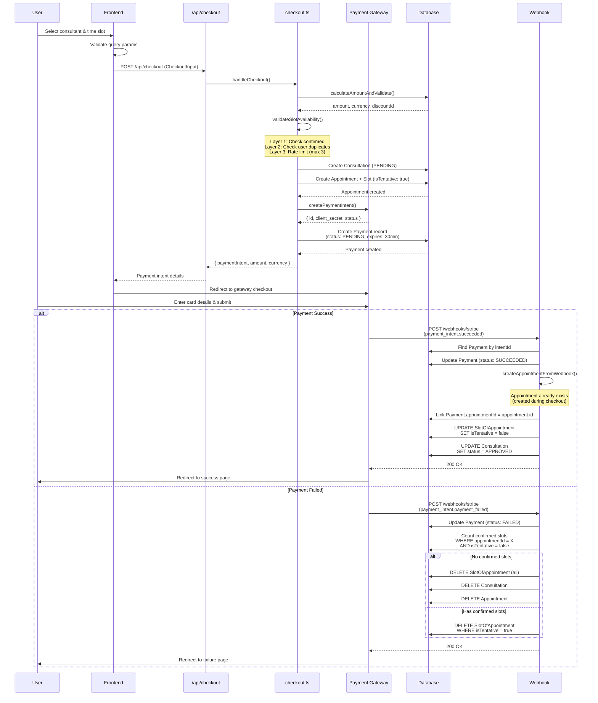
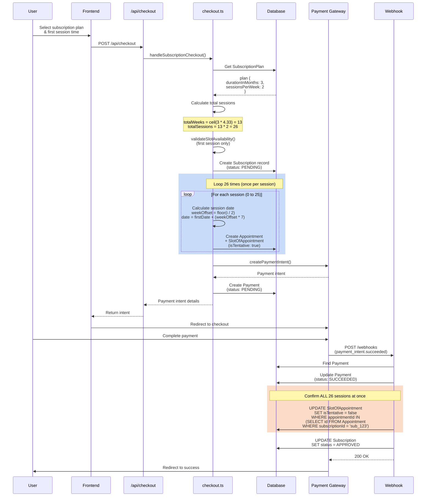

# Payment & Checkout System Documentation - Part 1

## Overview, Consultation & Subscription Flows

---

## Table of Contents

1. [System Overview](#system-overview)
2. [Architecture Principles](#architecture-principles)
3. [Consultation Checkout Flow](#consultation-checkout-flow)
4. [Subscription Checkout Flow](#subscription-checkout-flow)

---

## System Overview

This application implements a sophisticated payment and checkout system supporting **4 event types** with multiple payment gateways. The system follows a **payment-first, appointment-second** architecture where payment intents are created upfront, and appointments are confirmed via webhooks after successful payment.

### Supported Event Types

| Event Type       | Description                        | Appointment Pattern                          | Payment Model                     |
| ---------------- | ---------------------------------- | -------------------------------------------- | --------------------------------- |
| **Consultation** | One-on-one session with consultant | 1 appointment per booking                    | One-time payment                  |
| **Subscription** | Recurring sessions over time       | Multiple appointments (one per session)      | One-time payment for all sessions |
| **Webinar**      | Group session (scheduled event)    | 1 shared appointment for all participants    | One-time payment per participant  |
| **Class**        | Multi-session group course         | Multiple appointments (pre-created sessions) | One-time payment for all sessions |

### Payment Gateways

- **Stripe** (International payments, USD)
- **Razorpay** (Indian payments, INR)
- **Mock Payment** (Development/testing mode)

### Technology Stack

- **Backend:** Next.js 15.3.0 App Router
- **Database:** PostgreSQL with Prisma ORM
- **Payment SDKs:** Stripe JS SDK, Razorpay SDK
- **Validation:** Zod schemas
- **Transactions:** Prisma transactions with serializable isolation

---

## Architecture Principles

### 1. Payment-First Design

```
Traditional Flow (Problematic):
User → Create Appointment → Process Payment → Confirm or Rollback

Current Flow (Robust):
User → Create Payment Intent → Process Payment → Create Appointment via Webhook
```

**Benefits:**

- No orphaned appointments if payment fails
- No rollback complexity
- Idempotent webhook handling
- Gateway retry capabilities
- Clear audit trail

### 2. Tentative Booking System

All bookings start as "tentative" (`isTentative: true`) until payment succeeds:

```typescript
// During checkout
SlotOfAppointment {
  isTentative: true,  // Protects time slot during payment
  startsAt: appointmentTime,
  endsAt: appointmentTime + duration,
}

// After payment success (via webhook)
UPDATE SlotOfAppointment
SET isTentative = false
WHERE id = slotId
```

**Benefits:**

- Prevents double-booking during payment process
- Allows cleanup of abandoned checkouts
- Clear distinction between confirmed vs pending

### 3. Metadata-Driven Recovery

All checkout data is stored in payment intent metadata:

```typescript
{
  appointmentType: "CONSULTATION",
  planId: "plan_abc123",
  eventId: "event_xyz789",
  startsAt: "2025-01-15T10:00:00.000Z",    // renamed from `slotStartTimeInUTC`
  endsAt: "2025-01-15T11:00:00.000Z",      // renamed from `slotEndTimeInUTC`
  slotOfAvailabilityWeeklyId: "slot_weekly_123",
  notes: "User notes...",
  userId: "user_abc",
  consulteeProfileId: "profile_xyz"
}
```

> **Webhook backward-compat note:** Razorpay order `notes` objects embedded with the old keys (`startsAt` / `endsAt`) are still accepted by the webhook handler for in-flight orders created before the rename. `normalizeLegacySlotKeys()` in `schemas/webhooks/metadata.ts` maps old → new on ingest; new orders always use `startsAt` / `endsAt`.
```

> **Empty optional fields are omitted, never sent as `""` (#1462).** `buildPaymentMetadata()` in `lib/payments/operations/checkout.ts` includes an optional key only when it has a value, because the webhook schemas type those fields with `.optional()`, which accepts an absent key and rejects an empty string. A subscription bought for a scheduling period carries no direct slot times, so it used to reach the gateway with `startsAt: ""` and `endsAt: ""`, and every capture webhook for such a sale then failed validation and stamped the payment `REQUIRES_MANUAL_RECOVERY` with the buyer already charged. Because a Razorpay order never expires, orders minted before the fix keep replaying with those empty strings, so `validateWebhookMetadata()` also strips empty-string entries before it normalizes legacy keys and parses. Omitting empty keys has the useful side effect of giving the fifteen-key gateway ceiling more headroom.

**Benefits:**

- Webhook can recreate appointment even if frontend crashes
- No data loss scenarios
- Easy manual recovery if needed
- Complete audit trail

### 4. Transaction Safety

All critical operations wrapped in database transactions:

```typescript
await prisma.$transaction(async (tx) => {
  1. Update payment status
  2. Create appointment from metadata
  3. Link appointment to payment
  4. Confirm appointment (isTentative → false)
  5. Update request status
})

// If ANY step fails:
// - Entire transaction rolls back
// - Payment stays PENDING
// - Webhook will be retried by gateway
```

### 5. Slot Occupancy Checks and the Buyer's Own Hold

For consultation and subscription slot bookings, `validateSlotAvailability()` runs two blocking checks. The first rejects the request when any live appointment overlaps the requested window for this consultant, which includes another buyer's tentative hold. The second rejects it when the requesting buyer already holds an overlapping window with a live pending payment.

```typescript
// Check 1: any live overlapping appointment for this consultant
if (overlappingLiveAppointment exists) {
  throw Error("Time slot is already booked");
}

// Check 2: this buyer's own overlapping live hold
if (buyerHasOverlappingPendingHold) {
  throw Error("You already have a pending booking for this time slot...");
}
```

Both checks subtract the buyer's **self-hold** (#1463). A self-hold is an appointment that belongs to the requesting buyer, is for the same plan, has a payment that is still `PENDING` and still inside its expiry window, and covers exactly the window being requested. Such an appointment is not an occupant of the slot; it is the buyer's own open gateway order, and the open-order resume described below is the path that finishes or replaces it. Anything else keeps blocking, including a different buyer's hold on the same slot, a hold on a different plan, and this buyer's own hold on a window that merely overlaps the requested one. When the plan identity cannot be resolved at all, as with webinars and classes whose slot rows are shared between attendees, nothing is excluded.

Exact coverage is compared against the appointment's whole slot run rather than a single row, because a booked window is stored as a series of contiguous thirty-minute atoms: the run's first start and last end are what must equal the request.

The consultee-side conflict check inside the checkout lock applies the same exclusion, so the buyer's own hold does not resurface there as "You already have a session booked during this time."

There is deliberately no per-slot attempt cap. Since check 1 blocks on any live hold, a count of pending attempts for one slot can never exceed one, so the hold itself is the cap.

### 6. Open-Order Reuse

A checkout that is remounted, reopened in a new tab, or retried after the buyer dismissed the gateway modal mints a fresh client idempotency key, so the same-key replay cannot recognise it. Before any gateway call, `findReusablePendingOrderPayment()` therefore looks for an open order the buyer can simply finish paying: a payment of theirs that is still `PENDING`, still inside its minted expiry window, on the same gateway, under the same organization, and joined to an appointment for the same plan.

A candidate is adopted only when it is for the same booking as the current request. A consultation candidate must cover exactly the requested slot window, a subscription candidate must carry exactly the requested scheduling period, and every candidate's frozen amount must equal the total this request computed, so a changed coupon or credit balance can never be charged at a stale price. When a candidate is adopted, checkout returns the existing order id, amount and currency with `reused: true` and creates no second appointment and no second payment.

Candidates that fail those gates are **superseded** rather than left open. Superseding runs in one transaction: the payment moves `PENDING` → `EXPIRED` through a compare-and-set that carries the old status in its `WHERE` clause, the appointment's tentative slots are cancelled through `transitionSlotCompletion()`, and the parent consultation or subscription is cancelled through its own guarded transition. Releasing the hold is not optional bookkeeping. If the payment were expired while its appointment kept occupying the calendar, the buyer's very next attempt would be rejected by the occupancy check above, which is the wall #1463 describes. Group events are excluded from the release because their slot rows are shared between attendees, so giving back a seat is a disconnect rather than a status move and belongs to the cancel-pending front door.

---

## Consultation Checkout Flow

### Overview

Consultations are **one-on-one sessions** between a consultee (user) and a consultant. Each consultation requires:

- Selecting a specific time slot from consultant's availability
- One appointment record with one slot per booking
- Immediate payment before confirmation

### Entry Points

**Frontend Page:** `/app/checkout/plans/consultation/[planId]/page.tsx`

**User Journey:**

1. Browse consultant profile
2. View available time slots
3. Click on desired slot
4. Redirected to checkout with pre-filled query parameters
5. Click payment button (Stripe/Razorpay/Mock)
6. Complete payment on gateway
7. Redirected back with success/failure

### Required Query Parameters

```typescript
{
  startsAt: string,     // ISO 8601 datetime (URL query-param name; maps to startsAt internally)
  endsAt: string,       // ISO 8601 datetime (URL query-param name; maps to endsAt internally)
  slotOfAvailabilityWeeklyId: string (OR slotOfAvailabilityCustomId),
  slotOfAvailabilityCustomId: string (OR slotOfAvailabilityWeeklyId),
  discountCode?: string,           // Optional promo code
  notes?: string                   // Optional user notes
}
```

> **Field naming:** The public-facing query params keep the `startsAt`/`endsAt` names. Internally the checkout logic and Razorpay order notes use `startsAt`/`endsAt` (post-rename). Webhook handlers accept both via `normalizeLegacySlotKeys()` for in-flight orders.

**Validation Schema:** `/schemas/checkout.ts`

```typescript
export const consultationSearchParamsSchema = z
  .object({
    startsAt: z.string().datetime(),
    endsAt: z.string().datetime(),
    slotOfAvailabilityWeeklyId: z.string().optional(),
    slotOfAvailabilityCustomId: z.string().optional(),
    discountCode: z.string().optional(),
    notes: z.string().optional(),
  })
  .refine(
    (data) =>
      data.slotOfAvailabilityWeeklyId || data.slotOfAvailabilityCustomId,
    { message: "Either weekly or custom slot ID required" },
  )
  .refine(
    (data) => {
      const start = new Date(data.startsAt);
      const end = new Date(data.endsAt);
      return start < end;
    },
    { message: "Start time must be before end time" },
  );
```

### API Request Flow

**Endpoint:** `POST /api/checkout`

**Request Body:**

```typescript
{
  appointmentType: "CONSULTATION",
  planId: "consultation_plan_id",
  startsAt: "2025-01-15T10:00:00.000Z",       // renamed from `slotStartTimeInUTC`
  endsAt: "2025-01-15T11:00:00.000Z",         // renamed from `slotEndTimeInUTC`
  slotOfAvailabilityWeeklyId: "slot_id",
  notes: "User notes",
  discountCode: "PROMO20",
  gateway: "STRIPE", // or "RAZORPAY" or "MOCK"
  isMockPayment: false
}
```

**File:** `/app/api/checkout/route.ts` (Lines 7-85)

```typescript
export async function POST(request: Request) {
  // 1. Authentication check
  const session = await getServerSession(authOptions);
  if (!session?.user?.id) {
    return NextResponse.json({ error: "Unauthorized" }, { status: 401 });
  }

  // 2. Parse and validate request body
  const body = await request.json();
  const validatedData = checkoutSchema.parse(body);
  const isMockPayment = validatedData.isMockPayment || false;

  // 3. Process checkout
  const result = await handleCheckout({
    data: validatedData,
    userId: session.user.id,
    skipPayment: isMockPayment,
  });

  return NextResponse.json(result);
}
```

### Backend Processing

**Main Function:** `/lib/payments/operations/checkout.ts` - `handleConsultationCheckout()` (Lines 430-481)

#### Step 1: Validate Plan

```typescript
const plan = await tx.consultationPlan.findUnique({
  where: { id: data.planId },
  include: {
    consultantProfile: {
      include: { user: true },
    },
  },
});

if (!plan) {
  throw new Error("Consultation plan not found");
}
```

#### Step 2: Validate Slot Availability

**Function:** `validateSlotAvailability()` (Lines 268-424)

This is the most critical part - **three-layer protection** against race conditions:

##### Layer 1: Check Confirmed Overlapping Bookings

```typescript
// Lines 279-305
const overlappingConfirmed = await tx.slotOfAppointment.findFirst({
  where: {
    AND: [
      { isTentative: false }, // Only confirmed bookings
      {
        startsAt: {
          lt: new Date(data.endsAt!),
        },
      },
      {
        endsAt: {
          gt: new Date(data.startsAt!),
        },
      },
    ],
  },
  include: {
    appointment: {
      include: {
        consultation: {
          include: {
            consultationPlan: true,
          },
        },
      },
    },
  },
});

if (overlappingConfirmed) {
  throw new Error(
    "This time slot is already booked. Please choose another time.",
  );
}
```

**Overlap Detection Logic:**

```
New booking: [10:00 AM - 11:00 AM]
Existing booking: [10:30 AM - 11:30 AM]

Overlap if:
  (newStart < existingEnd) AND (newEnd > existingStart)
  (10:00 < 11:30) AND (11:00 > 10:30) = TRUE → Overlapping!
```

##### Layer 2: Prevent User Duplicate Tentative Bookings

```typescript
// Lines 308-365
const now = new Date();
const fiveMinutesFromNow = new Date(now.getTime() + 5 * 60 * 1000);

const userTentativeBookings = await tx.slotOfAppointment.findMany({
  where: {
    isTentative: true,
    user: {
      some: { id: consulteeProfileId },
    },
    AND: [
      {
        startsAt: {
          lt: new Date(data.endsAt!),
        },
      },
      {
        endsAt: {
          gt: new Date(data.startsAt!),
        },
      },
    ],
  },
  include: {
    appointment: {
      include: {
        consultation: {
          include: {
            consultationPlan: {
              include: {
                consultantProfile: true,
              },
            },
            payment: {
              where: {
                paymentStatus: "PENDING",
                OR: [{ expiresAt: { gt: now } }, { expiresAt: null }],
              },
            },
          },
        },
      },
    },
  },
});

for (const booking of userTentativeBookings) {
  const payment = booking.appointment?.consultation?.payment?.[0];

  if (payment) {
    const expiry = payment.expiresAt || fiveMinutesFromNow;
    if (expiry > now) {
      throw new Error(
        `You already have a pending booking for this time slot. ` +
          `Please complete your current payment or wait for it to expire ` +
          `(expires at ${expiry.toLocaleTimeString()}).`,
      );
    }
  }
}
```

**Why This Check?**

- Prevents same user from initiating multiple checkouts for same slot
- Gives user 5 minutes to complete payment before allowing another attempt
- If payment has `expiresAt`, uses that; otherwise 5-minute window

##### Layer 3: Rate Limiting (Max 3 Concurrent Attempts)

```typescript
// Lines 368-423
const thirtyMinutesAgo = new Date(now.getTime() - 30 * 60 * 1000);

const pendingAttempts = await tx.slotOfAppointment.count({
  where: {
    isTentative: true,
    AND: [
      {
        startsAt: {
          lt: new Date(data.endsAt!),
        },
      },
      {
        endsAt: {
          gt: new Date(data.startsAt!),
        },
      },
    ],
  },
  // Only count recent attempts (within last 30 minutes)
  include: {
    appointment: {
      where: {
        createdAt: { gt: thirtyMinutesAgo },
      },
      include: {
        consultation: {
          include: {
            payment: {
              where: {
                paymentStatus: "PENDING",
              },
            },
          },
        },
      },
    },
  },
});

if (pendingAttempts >= 3) {
  throw new Error(
    "This time slot is currently experiencing high demand. " +
      "Please try again in a few minutes or choose a different time.",
  );
}
```

**Why Rate Limiting?**

- Prevents slot hoarding by multiple users clicking simultaneously
- Allows max 3 users to hold tentative bookings
- First to complete payment wins
- Others get timeout/failure cleanup after 30 minutes

#### Step 3: Create Consultation Record

```typescript
const consultation = await tx.consultation.create({
  data: {
    status: AppointmentStatus.PENDING,   // field renamed from `requestStatus`
    requestNotes: data.notes,
    requestedById: consulteeProfileId,
    consultationPlanId: plan.id,
    bookingSource: "DIRECT_CHECKOUT",
    schedulingPeriodStartsAt: new Date(data.startsAt!),
    schedulingPeriodEndsAt: new Date(data.endsAt!),
  },
});
```

**Key Fields:**

- `status: PENDING` (enum `AppointmentStatus`) → Will become `APPROVED` after payment
- `requestedById` → Consultee profile ID
- `bookingSource: "DIRECT_CHECKOUT"` → Distinguish from admin-created bookings
- Scheduling period tracks the selected time slot

#### Step 4: Create Appointment with Tentative Slot

```typescript
const appointment = await tx.appointment.create({
  data: {
    appointmentType: AppointmentsType.CONSULTATION,
    consultationId: consultation.id,
    slotsOfAppointment: {
      create: {
        startsAt: new Date(data.startsAt!),
        endsAt: new Date(data.endsAt!),
        isTentative: !skipPayment, // true for real payments, false for mock
        user: {
          connect: { id: userId },
        },
      },
    },
  },
  include: {
    slotsOfAppointment: true,
  },
});
```

**Database Relationships:**

```
Consultation (1)
  ↓
Appointment (1)
  ↓
SlotOfAppointment (1)
  ↓
User (1)
```

#### Step 5: Return Appointment Details

```typescript
return {
  appointment,
  plan,
  amount: plan.price,
};
```

This data is used by `handleCheckout()` to:

1. Calculate final amount (with discounts)
2. Create payment intent
3. Store metadata for webhook recovery

### Complete Flow Diagram



### Key Takeaways

✅ **Consultation = 1:1 relationship** at all levels

- 1 Consultation → 1 Appointment → 1 SlotOfAppointment → 1 User

✅ **Three-layer protection** prevents race conditions and double-booking

✅ **Tentative booking** protects time slot during payment without blocking others permanently

✅ **Automatic cleanup** removes abandoned bookings after 30 minutes

✅ **Transaction safety** ensures data consistency

---

## Subscription Checkout Flow

### Overview

Subscriptions are **recurring one-on-one sessions** between a consultee and consultant over a period of time. Key characteristics:

- Multiple sessions scheduled upfront (e.g., 2 sessions/week for 3 months = 26 sessions)
- One payment covers all sessions
- Each session = separate Appointment record
- All appointments confirmed together after payment

**Example:**

- Plan: 3-month subscription, 2 calls/week
- Result: 26 pre-scheduled appointments created during checkout
- User pays once, gets access to all 26 sessions

### Entry Points

**Frontend Page:** `/app/checkout/plans/subscription/[planId]/page.tsx`

**User Journey:**

1. Browse subscription plans
2. View plan details (duration, frequency, price)
3. Select first session time from consultant's availability
4. Click checkout
5. Complete payment
6. All future sessions automatically scheduled

### Required Query Parameters

```typescript
{
  startsAt: string,     // First session start time (URL param; maps to startsAt internally)
  endsAt: string,       // First session end time (URL param; maps to endsAt internally)
  slotOfAvailabilityWeeklyId: string (OR slotOfAvailabilityCustomId),
  schedulingPeriodStartsAt?: string,  // Optional subscription start date
  schedulingPeriodEndsAt?: string,    // Optional subscription end date
  discountCode?: string,
  notes?: string
}
```

**Key Difference from Consultation:**

- Only first session timing is selected by user
- Subsequent sessions calculated automatically based on frequency

### Backend Processing

**Main Function:** `/lib/payments/operations/checkout.ts` - `handleSubscriptionCheckout()` (Lines 483-569)

#### Step 1: Validate Plan

```typescript
const plan = await tx.subscriptionPlan.findUnique({
  where: { id: data.planId },
  include: {
    consultantProfile: {
      include: { user: true },
    },
  },
});

if (!plan) {
  throw new Error("Subscription plan not found");
}
```

**Plan Contains:**

- `durationInMonths`: How many months the subscription lasts (e.g., 3)
- `sessionsPerWeek`: Number of sessions per week (e.g., 2)
- `sessionDurationInHours`: Duration of each session (e.g., 1.0)
- `price`: Total price for entire subscription

#### Step 2: Validate First Session Slot

```typescript
await validateSlotAvailability(tx, data, consulteeProfileId);
```

**Same 3-layer validation** as consultation:

1. No confirmed overlap
2. No user duplicate pending
3. Rate limiting (max 3 pending)

#### Step 3: Calculate Subscription Dates and Total Sessions

```typescript
// Lines 506-519
const startDate = new Date();
const endDate = calculateSubscriptionEndDate(startDate, plan.durationInMonths);

// Calculate total sessions for the subscription
const totalWeeks = Math.ceil(plan.durationInMonths * 4.33);
const totalSessions = totalWeeks * plan.sessionsPerWeek;

// Get first session timing
const firstSessionStart = new Date(data.startsAt!);
const firstSessionEnd = new Date(data.endsAt!);
const sessionDurationMs =
  firstSessionEnd.getTime() - firstSessionStart.getTime();
```

**Example Calculation:**

```javascript
// Plan: 3 months, 2 calls/week
durationInMonths = 3
sessionsPerWeek = 2

// Calculate weeks
totalWeeks = Math.ceil(3 * 4.33) = Math.ceil(12.99) = 13 weeks

// Calculate total sessions
totalSessions = 13 * 2 = 26 sessions
```

**Why 4.33 weeks per month?**

- Average month = 30.44 days
- 30.44 / 7 days = 4.35 weeks
- Rounded to 4.33 for simplicity

#### Step 4: Create Subscription Record

```typescript
const subscription = await tx.subscription.create({
  data: {
    subscriptionPlanId: plan.id,
    status: skipPayment ? AppointmentStatus.APPROVED : AppointmentStatus.PENDING,  // field renamed from `requestStatus`
    requestedById: consulteeProfileId,
    requestNotes: data.notes,
    bookingSource: "DIRECT_CHECKOUT",
    schedulingPeriodStartsAt: startDate,
    schedulingPeriodEndsAt: endDate,
  },
});
```

#### Step 5: Create ALL Recurring Appointments

**This is the key difference** - creates all sessions upfront!

```typescript
// Lines 537-560
const appointments = [];

for (let i = 0; i < totalSessions; i++) {
  // Calculate session date based on frequency
  const sessionStart = new Date(firstSessionStart);
  const weekOffset = Math.floor(i / plan.sessionsPerWeek);
  sessionStart.setDate(sessionStart.getDate() + weekOffset * 7);

  const sessionEnd = new Date(sessionStart.getTime() + sessionDurationMs);

  const appointment = await tx.appointment.create({
    data: {
      appointmentType: AppointmentsType.SUBSCRIPTION,
      subscriptionId: subscription.id,
      slotsOfAppointment: {
        create: {
          startsAt: sessionStart,
          endsAt: sessionEnd,
          isTentative: !skipPayment,
        },
      },
    },
  });

  appointments.push(appointment);
}
```

**Scheduling Pattern:**

```javascript
// Example: 2 calls/week, first session = Monday 10:00 AM

// Week 1:
Session 0: weekOffset = floor(0/2) = 0, date = Mon + 0 weeks = Mon Week 1
Session 1: weekOffset = floor(1/2) = 0, date = Mon + 0 weeks = Mon Week 1

// Week 2:
Session 2: weekOffset = floor(2/2) = 1, date = Mon + 1 week = Mon Week 2
Session 3: weekOffset = floor(3/2) = 1, date = Mon + 1 week = Mon Week 2

// Week 3:
Session 4: weekOffset = floor(4/2) = 2, date = Mon + 2 weeks = Mon Week 3
Session 5: weekOffset = floor(5/2) = 2, date = Mon + 2 weeks = Mon Week 3

// ... and so on for 26 total sessions
```

**Important Note:**

- All sessions scheduled for same day of week as first session
- Multiple sessions per week will have same date
- Consultant must ensure different times for same-day sessions
- Current implementation uses same time for all same-week sessions

#### Step 6: Return First Appointment

```typescript
return {
  appointment: appointments[0],
  plan,
  amount: plan.price,
  totalAppointmentsCreated: appointments.length,
};
```

### Database Structure After Checkout

```
Subscription
├─ id: "sub_123"
├─ status: PENDING           (field renamed from `requestStatus`; enum AppointmentStatus)
├─ schedulingPeriodStartsAt: 2025-01-15
├─ schedulingPeriodEndsAt: 2025-04-15
│
├─ Appointment 1 (Week 1, Session 1)
│  ├─ appointmentType: SUBSCRIPTION
│  ├─ subscriptionId: sub_123
│  └─ SlotOfAppointment
│     ├─ startsAt: 2025-01-15 10:00
│     ├─ endsAt: 2025-01-15 11:00
│     ├─ isTentative: true
│     └─ userId: user_abc
│
├─ Appointment 2 (Week 1, Session 2)
│  └─ SlotOfAppointment { ... isTentative: true }
│
├─ Appointment 3 (Week 2, Session 1)
│  └─ SlotOfAppointment { ... isTentative: true }
│
├─ ... (continues for all 26 sessions)
│
└─ Appointment 26 (Week 13, Session 2)
   └─ SlotOfAppointment { ... isTentative: true }
```

### Payment Success Impact

When payment succeeds, **ALL appointments** are confirmed together:

```typescript
// Webhook handler
UPDATE SlotOfAppointment
SET isTentative = false
WHERE appointmentId IN (
  SELECT id FROM Appointment WHERE subscriptionId = 'sub_123'
)

UPDATE Subscription
SET status = 'APPROVED'   -- field renamed from `requestStatus`; enum AppointmentStatus
WHERE id = 'sub_123'
```

**Result:**

- 26 SlotOfAppointment records: isTentative `true` → `false`
- Subscription: `status` `PENDING` → `APPROVED` (enum `AppointmentStatus`)
- User immediately sees all 26 sessions in their dashboard

### Complete Flow Diagram



### Key Differences from Consultation

| Aspect                   | Consultation           | Subscription                  |
| ------------------------ | ---------------------- | ----------------------------- |
| **Appointments Created** | 1                      | Multiple (26 in example)      |
| **When Created**         | During checkout        | During checkout (all upfront) |
| **Slot Validation**      | Full validation        | Only first session validated  |
| **Payment**              | One-time for 1 session | One-time for all sessions     |
| **Confirmation**         | 1 slot confirmed       | All slots confirmed together  |
| **Database Records**     | 1 Appointment, 1 Slot  | 26 Appointments, 26 Slots     |

### Edge Cases

#### What if user wants to skip a session?

**Current Implementation:** No skip mechanism exists

**Expected Behavior:**

- User should be able to mark session as "skipped"
- Consultant may allow rescheduling
- Would need additional status field on SlotOfAppointment

#### What if user cancels mid-subscription?

**Current Implementation:** No partial refund logic

**Expected Behavior:**

- Calculate attended vs remaining sessions
- Prorate refund based on remaining sessions
- Mark remaining appointments as CANCELLED

#### What if consultant changes availability?

**Current Implementation:** Sessions scheduled at checkout time

**Potential Issue:**

- If consultant blocks that time slot later
- Would need rescheduling workflow
- Current system doesn't detect conflicts

### Key Takeaways

✅ **All sessions scheduled upfront** - no "lazy creation"

✅ **Single payment** covers entire subscription period

✅ **Atomic confirmation** - all sessions confirmed together after payment

✅ **Efficient for user** - don't need to book each session individually

⚠️ **Inflexible scheduling** - all sessions same time based on first

⚠️ **No skip/reschedule** built-in

⚠️ **No partial refunds** for early cancellation

---

## Next: Webinar & Class Flows

Continue to [02-webinar-and-class.md](./02-webinar-and-class.md) for:

- Webinar checkout flow (shared appointment model)
- Class checkout flow (pre-existing appointments)
- Comparison tables between all 4 event types
