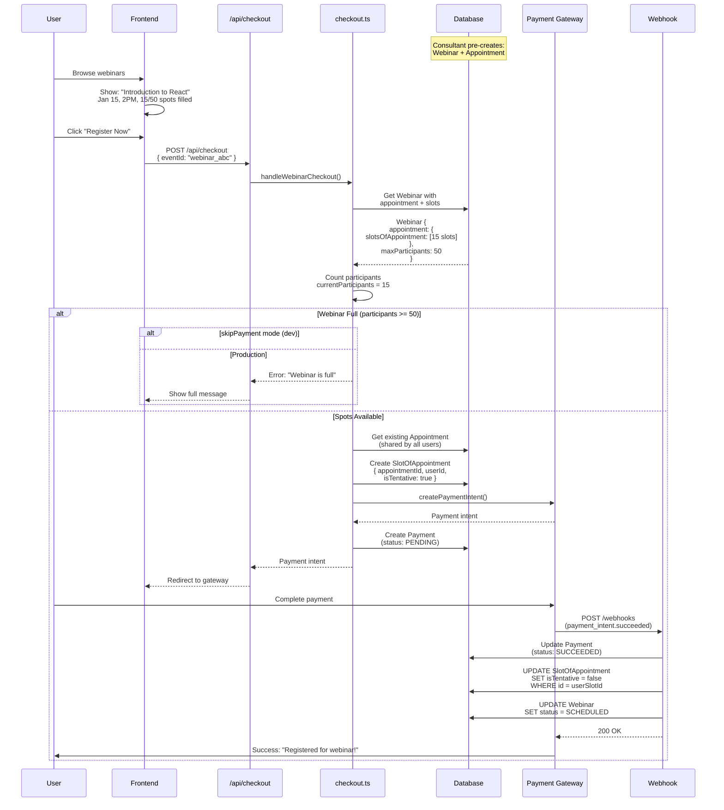
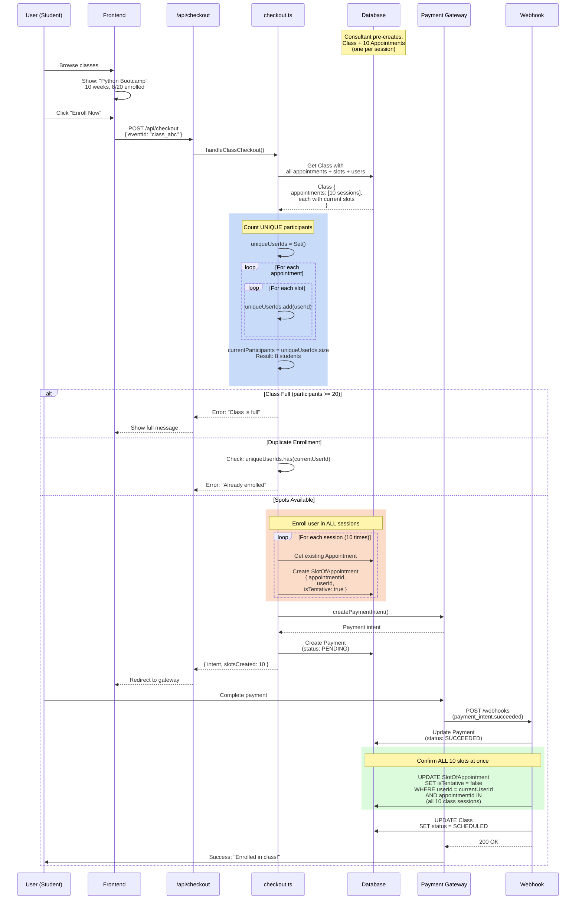

# Payment & Checkout System Documentation - Part 2

## Webinar & Class Flows

---

## Table of Contents

1. [Webinar Checkout Flow](#webinar-checkout-flow)
2. [Class Checkout Flow](#class-checkout-flow)
3. [Event Type Comparisons](#event-type-comparisons)

---

## Webinar Checkout Flow

### Overview

Webinars are **group live sessions** with one presenter and multiple participants. Key characteristics:

- **One-to-Many Model:** Single appointment shared by all participants
- **Pre-scheduled:** Webinar time fixed when created by consultant
- **Capacity Limited:** maxParticipants enforced
- **Sold Out When Full:** Registration closes; the host reopens it by raising capacity
- **No Slot Selection:** User registers for pre-determined time

**Example:**

- Consultant creates: "Introduction to React" webinar on Jan 15, 2025 at 2:00 PM
- Max 50 participants
- 1 Appointment record created when webinar is created
- Each user registration adds 1 SlotOfAppointment to that appointment
- All 50 participants share the same Appointment record

### Entry Points

**Frontend Page:** `/app/checkout/plans/webinar/[webinarPlanId]/page.tsx`

**User Journey:**

1. Browse webinar listings
2. View webinar details (date, time, topic, capacity)
3. Click "Register Now"
4. Redirected to checkout
5. Complete payment
6. Receive confirmation

### Required Query Parameters

```typescript
{
  eventId: string,         // Specific webinar instance ID
  discountCode?: string,   // Optional promo code
}
```

**Key Difference from Consultation/Subscription:**

- No slot selection needed (webinar time is fixed)
- Only need eventId to identify which webinar instance

### Database Structure

**Webinar Creation** (by consultant, before any registrations):

```
WebinarPlan {
  id: "plan_webinar_123",
  title: "Introduction to React",
  description: "Learn React basics",
  price: 2500,  // $25
  maxParticipants: 50,
}
  ↓
Webinar {
  id: "webinar_abc",
  webinarPlanId: "plan_webinar_123",
  scheduledAt: "2025-01-15T14:00:00Z",
  status: "SCHEDULED",
}
  ↓
Appointment {
  id: "appt_xyz",
  appointmentType: "WEBINAR",
  webinarId: "webinar_abc",
}
  ↓
SlotOfAppointment {  // Initial empty slot (template)
  id: "slot_template",
  appointmentId: "appt_xyz",
  startsAt: "2025-01-15T14:00:00Z",
  endsAt: "2025-01-15T15:00:00Z",
  isTentative: false,
  user: []  // No user yet
}
```

**After User Registration:**

```
Appointment {
  id: "appt_xyz",
  appointmentType: "WEBINAR",
  webinarId: "webinar_abc",
  slotsOfAppointment: [
    {
      id: "slot_template",  // Original template slot
      user: [],
      isTentative: false,
    },
    {
      id: "slot_user1",  // User 1 registration
      user: [{ id: "user_001" }],
      startsAt: "2025-01-15T14:00:00Z",
      endsAt: "2025-01-15T15:00:00Z",
      isTentative: true,  // Pending payment
    },
    {
      id: "slot_user2",  // User 2 registration
      user: [{ id: "user_002" }],
      isTentative: true,
    },
    // ... up to 50 users
  ]
}
```

### Backend Processing

**Main Function:** `/lib/payments/operations/checkout.ts` - `handleWebinarCheckout()` (Lines 571-646)

#### Step 1: Get Webinar with Appointment and Slots

```typescript
const webinar = await tx.webinar.findUnique({
  where: { id: data.eventId },
  include: {
    webinarPlan: true,
    appointment: {
      include: {
        slotsOfAppointment: true,
      },
    },
  },
});

if (!webinar) {
  throw new Error("Webinar not found");
}

const plan = webinar.webinarPlan;
```

**What's Included:**

- Webinar details and schedule
- Associated WebinarPlan (for pricing, capacity)
- Existing Appointment with all registered participants

#### Step 2: Count Current Participants

```typescript
const currentParticipants =
  webinar.appointment?.slotsOfAppointment?.length || 0;
```

**Counting Logic:**

- Each SlotOfAppointment = 1 participant
- Includes both tentative (pending payment) and confirmed
- Template slot (no user) also counted → May cause off-by-one error!

**Potential Issue:**

```javascript
// If appointment has template slot + 49 users = 50 slots
// But only 49 actual participants
// System would incorrectly show as full
```

#### Step 3: Check Capacity

```typescript
const capacity = getWebinarCapacity({
  webinar,
  plan,
  excludeUserIds: consultantUserId ? [consultantUserId] : [],
});

if (capacity.isFull) {
  throw new Error("Webinar is full");
}
```

Capacity is the instance's `maxParticipants` when it sets one and the plan's
otherwise; `lib/events/capacity.ts` is the only place that decides. A full
event is sold out — there is no queue, and the host reopens registration by
raising the number.

#### Step 4: Get or Create Appointment

```typescript
let appointment = webinar.appointment;

if (!appointment) {
  // Create appointment if doesn't exist
  appointment = await tx.appointment.create({
    data: {
      appointmentType: AppointmentsType.WEBINAR,
      webinarId: webinar.id,
    },
  });
}
```

**Note:** Typically appointment already exists (created with webinar), but this handles edge case.

#### Step 5: Add User to Webinar

```typescript
// Create SlotOfAppointment for user
await tx.slotOfAppointment.create({
  data: {
    appointmentId: appointment.id,
    startsAt: webinar.appointment?.slotsOfAppointment[0]?.startsAt,
    endsAt: webinar.appointment?.slotsOfAppointment[0]?.endsAt,
    isTentative: !skipPayment,
    user: {
      connect: { id: userId },
    },
  },
});
```

**Key Points:**

- **Reuses existing appointment** (doesn't create new one)
- Copies timing from first slot (template slot)
- Links to user via `user: { connect: { id } }`
- Marks as tentative until payment confirms

#### Step 6: Return Appointment

```typescript
return { appointment, plan, amount: plan.price };
```

### Many-to-Many Participant Model

**Database Schema Visualization:**

```
┌──────────────────┐
│   Appointment    │
│   (Webinar)      │
│  id: appt_xyz    │
└────────┬─────────┘
         │
         │ 1:M
         │
         ▼
┌──────────────────────────┐
│  SlotOfAppointment       │
├──────────────────────────┤
│  User 1's slot           │
│  User 2's slot           │
│  User 3's slot           │
│  ...                     │
│  User 50's slot          │
└──────────────────────────┘
         │
         │ M:M (via relation table)
         │
         ▼
┌──────────────────┐
│      Users       │
├──────────────────┤
│  User 1          │
│  User 2          │
│  User 3          │
│  ...             │
│  User 50         │
└──────────────────┘
```

**Schema Definition:**

```prisma
model SlotOfAppointment {
  id String @id @default(uuid())

  user User[] @relation("SlotOfAppointmentToUser")  // Many-to-many!

  appointment   Appointment @relation(...)
  appointmentId String

  startsAt    DateTime
  endsAt      DateTime
  isTentative Boolean
}
```

**Why Many-to-Many?**

- Theoretically allows multiple users per slot
- In practice, webinar has 1 user per slot
- Legacy design or future-proofing for group bookings

### Complete Flow Diagram



### Webinar Lifecycle

```
1. Consultant Creates Webinar
   ├─ WebinarPlan defined (price, capacity, description)
   ├─ Webinar instance created (specific date/time)
   ├─ Appointment created (shared container)
   └─ Template SlotOfAppointment created (timing info)

2. Users Register (0 to maxParticipants)
   ├─ Each user: POST /api/checkout
   ├─ Capacity check: currentParticipants < maxParticipants
   ├─ Create SlotOfAppointment (isTentative: true)
   ├─ Create Payment (status: PENDING)
   └─ Redirect to payment gateway

3. Payment Success
   ├─ Webhook: payment_intent.succeeded
   ├─ Update Payment (status: SUCCEEDED)
   ├─ Update Slot (isTentative: false)
   └─ User added to participant list

4. Webinar Happens
   ├─ Consultant starts meeting session
   ├─ All confirmed participants can join
   └─ Attendance tracked (if implemented)

5. Post-Webinar
   ├─ Recording uploaded (if applicable)
   ├─ Feedback collected
   └─ Status updated to COMPLETED
```

### Edge Cases

#### What if participant count is wrong?

**Scenario:** Template slot causes off-by-one error in capacity check

**Impact:**

- System thinks webinar is full when 1 spot remains
- Or allows 51 participants when max is 50

**Solution:**

```typescript
// Should filter out slots without users
const currentParticipants =
  webinar.appointment?.slotsOfAppointment?.filter(
    (slot) => slot.user && slot.user.length > 0,
  ).length || 0;
```

#### What if user tries to register twice?

**Current Behavior:** No duplicate check!

**Impact:**

- Same user can register multiple times
- Takes up multiple spots
- Pays multiple times

**Solution Needed:**

```typescript
// Before creating slot, check if user already registered
const existingSlot = await tx.slotOfAppointment.findFirst({
  where: {
    appointmentId: appointment.id,
    user: {
      some: { id: userId },
    },
  },
});

if (existingSlot) {
  throw new Error("You are already registered for this webinar");
}
```

#### What if webinar is cancelled after registration?

**Current Implementation:** No cancellation flow

**Expected Behavior:**

- Consultant cancels webinar
- System automatically refunds all participants
- Sends notification emails
- Updates webinar status to CANCELLED

### Key Takeaways

✅ **Shared Appointment Model** - efficient for group events

✅ **Capacity Management** - enforces maxParticipants limit

✅ **Transaction Safety** - prevents overbooking with database locks

⚠️ **Template Slot Issue** - may cause off-by-one capacity errors

⚠️ **No Duplicate Check** - same user can register multiple times

✅ **Sold-out state** - no queue; the host controls capacity per instance

---

## Class Checkout Flow

### Overview

Classes are **multi-session group courses** taught by a consultant to multiple students. Key characteristics:

- **Pre-scheduled Sessions:** All class sessions created when class is scheduled
- **Multi-Session:** e.g., 10-week course with 1 session/week = 10 appointments
- **Group Enrollment:** Multiple students enroll in same class
- **Capacity Per Class:** Not per session (e.g., max 20 students total)
- **Enrollment Creates Slots in ALL Sessions:** One payment = access to all sessions

**Example:**

- Consultant creates: "Python Bootcamp" - 10 weeks, 1 session/week
- Max 20 students
- 10 Appointment records created upfront (one per session)
- Each student enrollment creates 10 SlotOfAppointment records (one per session)
- All students share the same 10 Appointments

### Entry Points

**Frontend Page:** `/app/checkout/plans/class/[classPlanId]/page.tsx`

**User Journey:**

1. Browse class listings
2. View class details (schedule, syllabus, capacity)
3. Click "Enroll Now"
4. Complete payment
5. Get access to all sessions

### Required Query Parameters

```typescript
{
  eventId: string,         // Specific class instance ID
  discountCode?: string,   // Optional promo code
}
```

**Same as Webinar** - no slot selection, class schedule is pre-determined.

### Database Structure

**Class Creation** (by consultant):

```
ClassPlan {
  id: "plan_class_123",
  title: "Python Bootcamp",
  durationInMonths: 3,
  sessionsPerWeek: 1,
  maxParticipants: 20,
  price: 50000,  // $500
}
  ↓
Class {
  id: "class_abc",
  classPlanId: "plan_class_123",
  schedulingPeriodStartsAt: "2025-01-15",
  schedulingPeriodEndsAt: "2025-04-15",
  status: "SCHEDULED",
}
  ↓
Appointments [  // All created during class creation
  Appointment {  // Week 1
    id: "appt_week1",
    appointmentType: "CLASS",
    classId: "class_abc",
    slotsOfAppointment: [
      { id: "slot_template_w1", user: [], ... }
    ]
  },
  Appointment {  // Week 2
    id: "appt_week2",
    appointmentType: "CLASS",
    classId: "class_abc",
    slotsOfAppointment: [
      { id: "slot_template_w2", user: [], ... }
    ]
  },
  // ... (10 total appointments, one per week)
]
```

**After Student Enrollment:**

```
Class {
  id: "class_abc",
  appointments: [
    Appointment {  // Week 1 session
      id: "appt_week1",
      slotsOfAppointment: [
        { id: "slot_template_w1", user: [] },  // Template
        { id: "slot_student1_w1", user: [student1], isTentative: true },
        { id: "slot_student2_w1", user: [student2], isTentative: true },
        // ... up to 20 students
      ]
    },
    Appointment {  // Week 2 session
      id: "appt_week2",
      slotsOfAppointment: [
        { id: "slot_template_w2", user: [] },  // Template
        { id: "slot_student1_w2", user: [student1], isTentative: true },
        { id: "slot_student2_w2", user: [student2], isTentative: true },
      ]
    },
    // ... (all 10 sessions have same students)
  ]
}
```

### Backend Processing

**Main Function:** `/lib/payments/operations/checkout.ts` - `handleClassCheckout()` (Lines 648-742)

#### Step 1: Get Class with ALL Appointments and Slots

```typescript
const classInstance = await tx.class.findUnique({
  where: { id: data.eventId },
  include: {
    classPlan: true,
    appointments: {
      include: {
        slotsOfAppointment: {
          include: {
            user: true, // Include user info for counting
          },
        },
      },
    },
  },
});

if (!classInstance) {
  throw new Error("Class not found");
}

const plan = classInstance.classPlan;
```

**What's Loaded:**

- Class details and schedule
- All 10+ appointment records (one per session)
- All slots in each appointment (all students in each session)
- User info for each slot (to count unique participants)

#### Step 2: Count UNIQUE Participants

**Critical Difference from Webinar!**

```typescript
// Lines 677-686
const uniqueUserIds = new Set<string>();

for (const apt of classInstance.appointments) {
  for (const slot of apt.slotsOfAppointment) {
    if (slot.user && Array.isArray(slot.user)) {
      slot.user.forEach((u: { id: string }) => uniqueUserIds.add(u.id));
    }
  }
}

const currentParticipants = uniqueUserIds.size;
```

**Why Count Unique Users?**

```
Bad Approach (Webinar-style):
  currentParticipants = total slots across all sessions
  = 10 students * 10 sessions = 100 slots
  = Wrong! Class only has 10 students, not 100

Correct Approach (Current):
  currentParticipants = unique user IDs across all sessions
  = Set { user1, user2, ..., user10 }.size = 10
  = Correct!
```

**Example:**

```javascript
// Class with 3 sessions, 2 students

Session 1: [slot_student1_s1, slot_student2_s1]
Session 2: [slot_student1_s2, slot_student2_s2]
Session 3: [slot_student1_s3, slot_student2_s3]

Total slots = 6
Unique students = Set { student1, student2 }.size = 2  ← Correct count
```

#### Step 3: Check Capacity

```typescript
const capacity = getClassCapacity({
  classInstance,
  plan,
  excludeUserIds: ownerUserId ? [ownerUserId] : [],
});

if (capacity.isFull) {
  throw new Error("Class is full");
}
```

Same rule as the webinar: instance capacity wins, sold out means sold out.

#### Step 4: Check Duplicate Enrollment

```typescript
if (uniqueUserIds.has(userId)) {
  throw new Error("You are already enrolled in this class");
}
```

**This is important!** Prevents same student from enrolling twice.

**Why Needed:**

- Student might click "Enroll" multiple times
- Or try to re-enroll after payment failure
- Without this check, would create duplicate slots in all sessions

#### Step 5: Enroll User in ALL Class Sessions

**Key Logic:**

```typescript
// Lines 710-728
const createdSlots = [];

for (const appointment of classInstance.appointments) {
  // Get timing from the first existing slot (template slot)
  const existingSlot = appointment.slotsOfAppointment[0];

  const slot = await tx.slotOfAppointment.create({
    data: {
      appointmentId: appointment.id,
      startsAt: existingSlot?.startsAt || new Date(),
      endsAt: existingSlot?.endsAt || new Date(),
      isTentative: !skipPayment,
      user: {
        connect: { id: userId },
      },
    },
  });

  createdSlots.push(slot);
}
```

**What Happens:**

1. Loop through all 10 appointments (sessions)
2. For each session:
   - Copy timing from template slot
   - Create new SlotOfAppointment
   - Link to user
   - Mark as tentative
3. Result: 10 new slots created (one per session)

**Database Changes:**

```sql
-- Before enrollment
SELECT * FROM SlotOfAppointment WHERE appointmentId IN (appt_week1, appt_week2, ...);
-- Returns: 10 template slots (no users)

-- After enrollment (before payment)
SELECT * FROM SlotOfAppointment WHERE appointmentId IN (appt_week1, appt_week2, ...);
-- Returns: 20 slots (10 template + 10 for new student)

-- After payment success
UPDATE SlotOfAppointment
SET isTentative = false
WHERE user.id = 'student_xyz'
AND appointmentId IN (appt_week1, appt_week2, ...);
-- 10 slots updated: isTentative true → false
```

#### Step 6: Return First Appointment

```typescript
const firstAppointment = classInstance.appointments[0];

if (!firstAppointment) {
  throw new Error("No class sessions found");
}

return {
  appointment: firstAppointment,
  plan,
  amount: plan.price,
  slotsCreated: createdSlots.length, // e.g., 10
};
```

### Complete Flow Diagram



### Class vs Webinar Comparison

| Aspect                | Webinar             | Class                                 |
| --------------------- | ------------------- | ------------------------------------- |
| **Sessions**          | 1 session           | Multiple sessions (10+)               |
| **Appointments**      | 1 appointment       | Multiple appointments (1 per session) |
| **User Registration** | Creates 1 slot      | Creates N slots (1 per session)       |
| **Capacity Count**    | Simple: count slots | Complex: count unique users           |
| **Payment**           | Pays for 1 session  | Pays for all sessions                 |
| **Confirmation**      | 1 slot confirmed    | All N slots confirmed together        |
| **Duplicate Check**   | ❌ Missing          | ✅ Implemented                        |

### Edge Cases

#### What if class sessions are added after enrollment?

**Scenario:** Consultant extends 10-week class to 12 weeks after students enrolled

**Current Behavior:**

- Old students have 10 slots (weeks 1-10)
- New appointments created for weeks 11-12
- Old students don't automatically get slots for new sessions

**Impact:**

- Old students can't access new sessions
- Would need manual slot creation or re-enrollment

**Solution Needed:**

- When adding sessions, automatically create slots for enrolled students
- Or implement "sync enrollment" function

#### What if student wants to drop out mid-course?

**Current Implementation:** No drop-out mechanism

**Expected Behavior:**

- Student requests refund for remaining sessions
- Prorate refund: (remainingSessions / totalSessions) \* price
- Mark future slots as CANCELLED
- Free up capacity for new enrollments

#### What if session dates change?

**Scenario:** Consultant reschedules Week 5 from Monday to Wednesday

**Current Implementation:**

- Appointment dates are fixed when created
- No rescheduling logic
- Students wouldn't be notified

**Solution Needed:**

- Update appointment dates
- Notify all enrolled students
- Allow students to withdraw if new time doesn't work

### Key Takeaways

✅ **Multi-session enrollment** - one payment = all sessions

✅ **Unique participant counting** - correctly handles capacity across sessions

✅ **Duplicate prevention** - can't enroll twice

✅ **Atomic confirmation** - all sessions confirmed together after payment

✅ **Shared appointment model** - efficient group management

⚠️ **No session management** - can't add/remove/reschedule sessions easily

⚠️ **No partial refunds** - no drop-out logic

⚠️ **Template slot counting** - may cause capacity issues (same as webinar)

---

## Event Type Comparisons

### High-Level Overview

| Event Type       | Use Case             | Duration                         | Participants                    | Appointment Pattern                            | Payment Model            |
| ---------------- | -------------------- | -------------------------------- | ------------------------------- | ---------------------------------------------- | ------------------------ |
| **Consultation** | 1:1 expert advice    | Single session                   | 1 consultee + 1 consultant      | 1 appointment                                  | One-time                 |
| **Subscription** | Regular 1:1 coaching | Multiple sessions (weeks/months) | 1 consultee + 1 consultant      | Multiple appointments (one per session)        | One-time for all         |
| **Webinar**      | Group presentation   | Single session                   | Many participants + 1 presenter | 1 shared appointment                           | One-time per participant |
| **Class**        | Multi-week course    | Multiple sessions                | Many students + 1 instructor    | Multiple shared appointments (one per session) | One-time per student     |

### Detailed Comparison Matrix

#### 1. Database Records Created

| Aspect                       | Consultation     | Subscription      | Webinar           | Class                   |
| ---------------------------- | ---------------- | ----------------- | ----------------- | ----------------------- |
| **Plan Records**             | ConsultationPlan | SubscriptionPlan  | WebinarPlan       | ClassPlan               |
| **Event Records**            | Consultation (1) | Subscription (1)  | Webinar (1)       | Class (1)               |
| **Appointments Per Booking** | 1                | N (e.g., 26)      | 1 (shared)        | N (shared, pre-created) |
| **Slots Per User**           | 1                | N (1 per session) | 1                 | N (1 per session)       |
| **Payment Records**          | 1                | 1                 | 1 per participant | 1 per student           |

**Example Calculations:**

```
Consultation:
  1 Consultation + 1 Appointment + 1 Slot = 3 records

Subscription (3 months, 2/week):
  1 Subscription + 26 Appointments + 26 Slots = 53 records

Webinar (50 participants):
  1 Webinar + 1 Appointment + 50 Slots = 52 records

Class (10 weeks, 20 students):
  1 Class + 10 Appointments + 200 Slots (20 students × 10 sessions) = 211 records
```

#### 2. Slot Selection vs Pre-scheduled

| Event Type       | User Selects Time?    | Slots Available?                | Schedule Determined By                     |
| ---------------- | --------------------- | ------------------------------- | ------------------------------------------ |
| **Consultation** | ✅ Yes                | Consultant's availability slots | User choice from available slots           |
| **Subscription** | ✅ First session only | Consultant's availability       | User choice for first, auto-scheduled rest |
| **Webinar**      | ❌ No                 | N/A                             | Consultant (fixed when created)            |
| **Class**        | ❌ No                 | N/A                             | Consultant (all sessions pre-scheduled)    |

#### 3. Capacity Management

| Event Type       | Capacity Type     | Capacity Check                       | Enforced At     | When Full |
| ---------------- | ----------------- | ------------------------------------ | --------------- | --------- |
| **Consultation** | Slot-based        | No overlap with confirmed bookings   | Slot level      | Slot unavailable |
| **Subscription** | Slot-based        | No overlap for any session           | First slot only | Slot unavailable |
| **Webinar**      | Participant-based | Participants < effective capacity    | Event level     | Sold out  |
| **Class**        | Participant-based | Unique users < effective capacity    | Event level     | Sold out  |

#### 4. Race Condition Protection

| Event Type       | Protection Level | Mechanism                                               | Layers                                |
| ---------------- | ---------------- | ------------------------------------------------------- | ------------------------------------- |
| **Consultation** | ⭐⭐⭐ Strong    | 3-layer validation + transaction                        | Confirmed, User duplicate, Rate limit |
| **Subscription** | ⭐⭐⭐ Strong    | 3-layer validation (first session)                      | Same as consultation                  |
| **Webinar**      | ⭐⭐ Moderate    | Transaction-based capacity check                        | Database lock only                    |
| **Class**        | ⭐⭐ Moderate    | Transaction-based capacity check + duplicate prevention | Database lock + Set check             |

#### 5. Payment and Confirmation Flow

| Event Type       | Payment Timing       | What Payment Covers  | Confirmation Effect                      |
| ---------------- | -------------------- | -------------------- | ---------------------------------------- |
| **Consultation** | Before session       | 1 session            | 1 slot confirmed                         |
| **Subscription** | Before first session | All sessions upfront | All N slots confirmed together           |
| **Webinar**      | Before event         | 1 event access       | User's 1 slot confirmed                  |
| **Class**        | Before course starts | Full course          | User's N slots confirmed (1 per session) |

#### 6. Code Complexity

| Event Type       | Validation Complexity                | Booking Logic Complexity        | Confirmation Complexity      |
| ---------------- | ------------------------------------ | ------------------------------- | ---------------------------- |
| **Consultation** | ⭐⭐⭐ Complex (3-layer)             | ⭐ Simple (1 record)            | ⭐ Simple (1 slot)           |
| **Subscription** | ⭐⭐⭐ Complex (3-layer)             | ⭐⭐⭐ Complex (N appointments) | ⭐⭐ Moderate (batch update) |
| **Webinar**      | ⭐ Simple (capacity check)           | ⭐ Simple (add to existing)     | ⭐ Simple (1 slot)           |
| **Class**        | ⭐⭐ Moderate (capacity + duplicate) | ⭐⭐⭐ Complex (N slots)        | ⭐⭐ Moderate (batch update) |

### Common Patterns

#### Pattern 1: Tentative Booking

**All 4 event types** use tentative booking during payment:

```typescript
// During checkout
SlotOfAppointment { isTentative: true }

// After payment success (webhook)
UPDATE SlotOfAppointment SET isTentative = false WHERE id = slotId
```

**Benefits:**

- Protects time slot/capacity during payment
- Allows automatic cleanup if payment fails/times out
- Clear audit trail

#### Pattern 2: Payment-First Architecture

**All 4 event types** create payment intent before appointment confirmation:

```
1. Validate availability/capacity
2. Create event record (Consultation/Subscription/etc.)
3. Create appointment(s) with tentative slots
4. Create payment intent
5. User completes payment
6. Webhook confirms slots (isTentative → false)
```

#### Pattern 3: Metadata-Driven Recovery

**All 4 event types** store complete checkout data in payment metadata:

```typescript
{
  appointmentType: "CONSULTATION" | "SUBSCRIPTION" | "WEBINAR" | "CLASS",
  planId: "...",
  eventId: "..." (for webinar/class),
  startsAt: "..." (for consultation/subscription),
  ...all necessary data to recreate appointment
}
```

### Unique Characteristics

| Event Type       | Unique Feature                    | Why Different                                  |
| ---------------- | --------------------------------- | ---------------------------------------------- |
| **Consultation** | 3-layer race condition protection | Most prone to double-booking (time slots)      |
| **Subscription** | All sessions scheduled upfront    | Ensures full schedule available before payment |
| **Webinar**      | Shared appointment model          | Efficient for large group events               |
| **Class**        | Unique participant counting       | Must count across multiple sessions correctly  |

---

## Next: Payment Processing

Continue to [03-payment-processing.md](./03-payment-processing.md) for:

- Unified checkout API flow
- Payment gateway integration (Stripe, Razorpay, Mock)
- Payment success/failure flows
- Webhook handling
- State transitions
