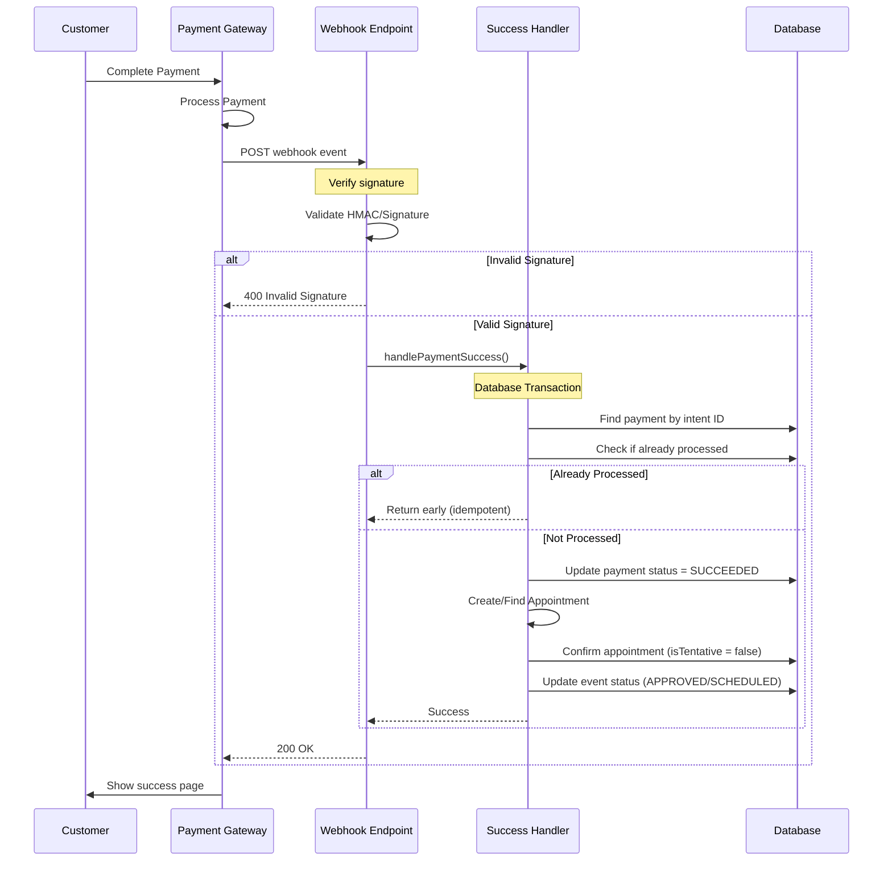
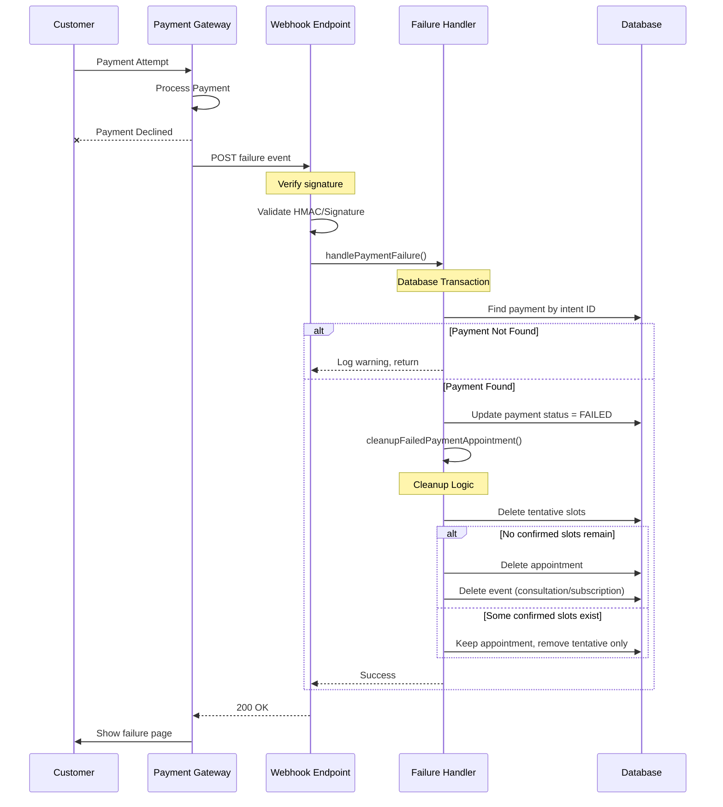
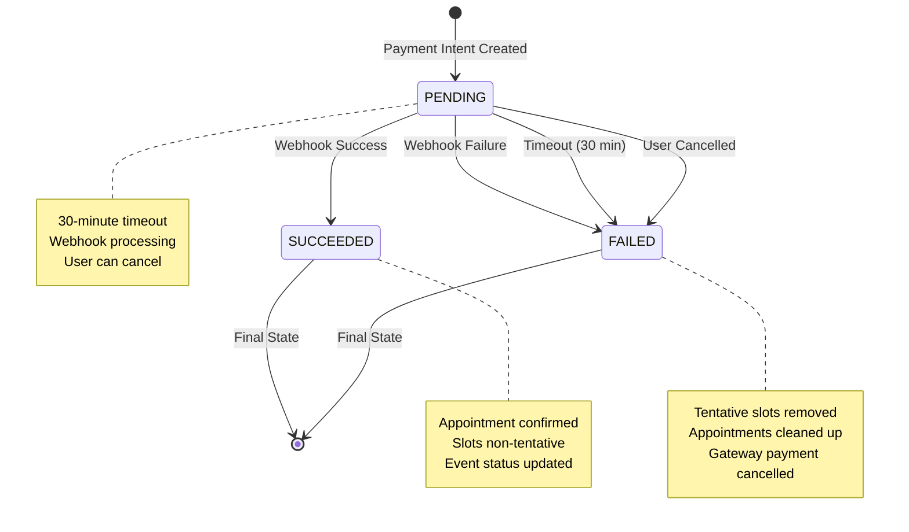
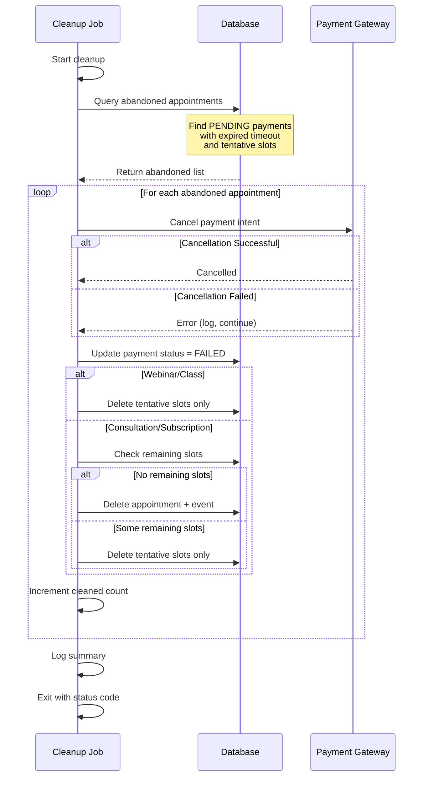
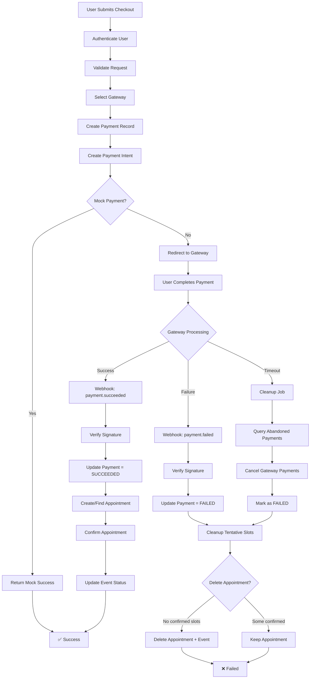

# Payment Processing & Webhooks

> **Superseded (2026-09-03):** this document dates to November 2025 and describes an architecture this codebase no longer has — webhooks that create appointments directly from payment-intent metadata (`createAppointmentFromWebhook`), and a failure path that `delete`s appointments and slots outright. The current checkout path is payment-first with a pre-acquired interval-atom lock and CAS status transitions, and cancellation is always a soft status write, never a row deletion. For what the code actually does today, read [`docs/booking/00-architecture-decisions.md`](../../booking/00-architecture-decisions.md) (ADR B6, B7, B11) and the wave-5 entries in [`docs/booking/05-troubleshooting-and-changelog.md`](../../booking/05-troubleshooting-and-changelog.md). The rest of this file is kept for historical context only; do not cite its file:line references or its deletion-based cleanup flow as current behavior.

---

> **Navigation:** [Overview & Consultation](./01-overview-and-consultation.md) | [Webinar & Class](./02-webinar-and-class.md) | **Payment Processing** | [Edge Cases](./04-edge-cases.md) | [Status Flows](./05-status-flows.md)

## Table of Contents

1. [Unified Checkout API](#1-unified-checkout-api)
2. [Payment Gateway Integration](#2-payment-gateway-integration)
3. [Payment Intent Creation](#3-payment-intent-creation)
4. [Payment Success Flow](#4-payment-success-flow)
5. [Payment Failure Flow](#5-payment-failure-flow)
6. [Payment States & Transitions](#6-payment-states--transitions)
7. [Timeout & Expiration Handling](#7-timeout--expiration-handling)
8. [Abandoned Payment Cleanup](#8-abandoned-payment-cleanup)
9. [Error Handling & Recovery](#9-error-handling--recovery)

---

## 1. Unified Checkout API

### 1.1 API Entry Point

**File:** `/app/api/checkout/route.ts`

The unified checkout API provides a single entry point for all payment types and gateways.

```typescript
// Request handling
POST /api/checkout
Authorization: Bearer <session-token>
Content-Type: application/json

// Request body (validated by Zod schema)
{
  "appointmentType": "CONSULTATION" | "SUBSCRIPTION" | "WEBINAR" | "CLASS",
  "planId"?: "string",           // For consultation/subscription
  "eventId"?: "string",          // For webinar/class
  "startsAt"?: "date",           // For consultation/subscription (renamed from `slotStartTimeInUTC`)
  "endsAt"?: "date",             // For consultation/subscription (renamed from `slotEndTimeInUTC`)
  "notes"?: "string",            // Optional notes
  "isMockPayment"?: boolean      // Development mode flag
}
```

### 1.2 Request Flow

```
┌─────────────────────────────────────────────────────────────┐
│                    Unified Checkout API                      │
│                 /app/api/checkout/route.ts                   │
└─────────────────────────────────────────────────────────────┘
                              │
                              ▼
              ┌───────────────────────────────┐
              │  1. Authenticate User         │
              │  - getServerSession()         │
              │  - Return 401 if not auth'd   │
              └───────────────┬───────────────┘
                              │
                              ▼
              ┌───────────────────────────────┐
              │  2. Validate Request Body     │
              │  - checkoutSchema.parse()     │
              │  - Zod validation             │
              └───────────────┬───────────────┘
                              │
                              ▼
              ┌───────────────────────────────┐
              │  3. Route to Handler          │
              │  - handleCheckout()           │
              │  - Pass isMockPayment flag    │
              └───────────────┬───────────────┘
                              │
                              ▼
              ┌───────────────────────────────┐
              │  4. Return Response           │
              │  - payment intent details     │
              │  - OR error with type         │
              └───────────────────────────────┘
```

### 1.3 Error Classification

The API categorizes errors for client-side handling:

```typescript
// Error types (lines 33-83)
{
  // Configuration errors
  "PAYMENT_CONFIG_ERROR": "Payment gateway authentication failed",

  // Database errors
  "DATABASE_ERROR": "Database connection/query failed",

  // Validation errors
  "NOT_FOUND_ERROR": "Plan/event/resource not found",
  "AVAILABILITY_ERROR": "Slot unavailable/capacity full",

  // Payment errors
  "PAYMENT_PROCESSING_ERROR": "Payment gateway unavailable",

  // Generic error
  "UNKNOWN_ERROR": "Unexpected error occurred"
}
```

### 1.4 Response Format

**Success Response:**

```json
{
  "paymentIntent": "cs_...",
  "amount": 150.0,
  "currency": "USD",
  "gateway": "STRIPE",
  "checkoutUrl": "https://checkout.stripe.com/...",
  "appointmentId": "appointment-uuid",
  "metadata": {
    "appointmentType": "CONSULTATION",
    "planId": "plan-uuid",
    "startsAt": "2025-11-07T10:00:00Z"
  }
}
```

**Error Response:**

```json
{
  "error": "Slot is no longer available",
  "errorType": "AVAILABILITY_ERROR",
  "timestamp": "2025-11-06T14:30:00.000Z"
}
```

### 1.5 Checkout Idempotency (#828) and Per-Type Lock Budgets (#832)

**`clientIdempotencyKey`** — callers may supply an optional `clientIdempotencyKey` (8–128 chars, validated by `checkoutSchema`). A unique DB index on this column ensures that a second `POST /api/checkout` with the same key returns the existing payment record instead of creating a duplicate. This makes client-side retry-on-network-error safe. (`schemas/checkout.ts` line ≈ 89; `lib/payments/operations/checkout.ts` line ≈ 2294.)

**`CHECKOUT_LOCK_TTL_MS`** — each `appointmentType` acquires a distributed lock before writing the tentative slot. The lock time-to-live varies by type to balance throughput vs. consistency:

```typescript
// utils/appointmentlock.ts lines 59-64
export const CHECKOUT_LOCK_TTL_MS: Record<string, number> = {
  CONSULTATION: 60_000, //  60 s — single-slot write + gateway round-trip
  SUBSCRIPTION: 120_000, // 120 s — same as WEBINAR
  WEBINAR: 120_000, // 120 s — may write N seats
  CLASS: 300_000, // 300 s — N sessions × M slots
};
```

A lock acquisition failure (budget exceeded) surfaces to the caller as a 409 Conflict with error type `LOCK_TIMEOUT`. (#832.)

**Capacity counts include tentative holds** — the availability check reads `WHERE isTentative = false OR isTentative = true` for the event's current fill level. A tentative slot occupies a seat; the seat is not freed until the payment expires or is cancelled. This prevents over-selling in the window between checkout start and payment completion.

---

## 2. Payment Gateway Integration

### 2.1 Gateway Architecture

The system supports multiple payment gateways with a unified interface:

```
┌─────────────────────────────────────────────────────────────┐
│                    Payment Gateway Layer                     │
└─────────────────────────────────────────────────────────────┘
                              │
                ┌─────────────┼─────────────┬─────────────┐
                │             │             │             │
                ▼             ▼             ▼             ▼
         ┌──────────┐  ┌──────────┐  ┌──────────┐  ┌──────────┐
         │  STRIPE  │  │ RAZORPAY │  │   MOCK   │  │  FUTURE  │
         │  (USD)   │  │  (INR)   │  │  (DEV)   │  │ GATEWAYS │
         └──────────┘  └──────────┘  └──────────┘  └──────────┘
```

### 2.2 Gateway Selection Logic

**File:** `/lib/payments/operations/checkout.ts` (lines 75-96)

```typescript
// Gateway selection based on currency and mode
function selectPaymentGateway(
  currency: string,
  isMockPayment: boolean,
): PaymentGateway {
  if (isMockPayment) {
    return PaymentGateway.STRIPE; // Mock uses Stripe format
  }

  switch (currency) {
    case "USD":
    case "EUR":
    case "GBP":
      return PaymentGateway.STRIPE;

    case "INR":
      return PaymentGateway.RAZORPAY;

    default:
      return PaymentGateway.STRIPE; // Default fallback
  }
}
```

### 2.3 Stripe Integration

**File:** `/lib/payments/core/stripe.ts`

#### Key Features:

- **Checkout Sessions:** Uses Stripe Checkout (not Payment Intents directly)
- **Automatic Tax Calculation:** Support for tax calculations (if enabled)
- **Card Payments Only:** Currently supports card payments
- **30-Minute Expiration:** Built into checkout session

#### Checkout Session Creation:

```typescript
// Lines 76-123
export async function createStripeCheckoutSession({
  amount,
  currency,
  metadata,
}: PaymentIntentParams): Promise<PaymentIntent> {
  const session = await stripeClient.checkout.sessions.create({
    payment_method_types: ["card"],
    line_items: [
      {
        price_data: {
          currency: currency.toLowerCase(),
          product_data: {
            name: `${metadata.appointmentType} Appointment`,
            description: `Appointment booking for ${metadata.appointmentType}`,
          },
          unit_amount: toSmallestUnit(amount, currency), // Convert to cents
        },
        quantity: 1,
      },
    ],
    mode: "payment",
    success_url: `${getBaseUrl()}/checkout/checkout-success?session_id={CHECKOUT_SESSION_ID}`,
    cancel_url: `${getBaseUrl()}/checkout/checkout-failure`,
    metadata,
    expires_at: Math.floor(Date.now() / 1000) + 30 * 60, // 30 minutes
  });

  return {
    id: session.id,
    client_secret: session.url!, // Checkout URL
    amount,
    currency,
    status: session.status || "open",
  };
}
```

#### Currency Conversion:

There is none, and there has not been any since the paise migration. Every money
column in the schema already holds an integer count of the smallest unit, so the
amount is handed to the gateway exactly as it is stored. The
`CURRENCY_MULTIPLIERS` table this section used to show was deleted in #1396
because nothing imported it. Settlement is INR-only in any case:
`assertInrSettlement` is the first statement of both `createRazorpayOrder` and
`createStripeCheckoutSession`, so a non-INR currency never reaches a gateway.

### 2.4 Razorpay Integration

**File:** `/lib/payments/core/razorpay.ts`

#### Key Features:

- **Order-Based Flow:** Uses Razorpay Orders (not direct payment)
- **Multiple Payment Methods:** UPI, cards, wallets, net banking
- **INR Currency:** Optimized for Indian Rupee
- **Custom UI:** Requires frontend integration

#### Order Creation:

```typescript
// Lines 61-93
export async function createRazorpayOrder({
  amount,
  currency,
  metadata,
}: PaymentIntentParams): Promise<PaymentIntent> {
  const order = await razorpayClient.orders.create({
    amount: toSmallestUnit(amount, currency), // Convert to paise
    currency,
    notes: metadata,
    receipt: `receipt_${Date.now()}`,
  });

  return {
    id: order.id,
    client_secret: order.id, // Order ID used as client secret
    amount: fromSmallestUnit(Number(order.amount), order.currency),
    currency: order.currency,
    status: order.status,
  };
}
```

**Note:** Razorpay order IDs start with `order_` prefix.

### 2.5 Mock Payment Integration

**File:** `/lib/payments/operations/mock.ts`

#### Purpose:

Mock payments enable development and testing without calling actual payment gateways.

#### Key Features:

- **Instant Success:** Always returns "succeeded" status
- **No Gateway Calls:** Zero-cost testing
- **Gateway Format Matching:** IDs match real gateway formats
- **Development Only:** Controlled by environment flags

#### Mock Payment Creation:

```typescript
// Lines 18-37
export async function createMockPaymentIntent({
  amount,
  currency,
  metadata: _metadata,
  paymentGateway,
}: PaymentIntentParams): Promise<PaymentIntent> {
  // Simulate API delay
  await new Promise((resolve) => setTimeout(resolve, 500));

  const mockPaymentId = generateMockPaymentId(paymentGateway);

  return {
    id: mockPaymentId,
    client_secret: `mock_secret_${mockPaymentId}`,
    amount,
    currency,
    status: "succeeded", // Mock payments are always successful
  };
}

// Mock ID examples:
// STRIPE:   "cs_mock_a1b2c3_1699123456789"
// RAZORPAY: "order_mock_x9y8z7_1699123456789"
```

#### Environment Configuration:

```typescript
// Lines 152-158
export function shouldEnableMockPayments(): boolean {
  return (
    process.env.NODE_ENV === "development" ||
    process.env.ENABLE_MOCK_PAYMENTS === "true"
  );
}
```

#### Safety Warnings:

```typescript
// Lines 163-172
export function logMockPaymentWarning(gateway: PaymentGateway): void {
  console.warn(`
    ⚠️  MOCK PAYMENT MODE ENABLED ⚠️
    Gateway: ${gateway}
    This payment will NOT be processed through the actual payment gateway.
    A mock payment record will be created with SUCCEEDED status.

    This should ONLY be used in development/testing.
  `);
}
```

---

## 3. Payment Intent Creation

### 3.1 Payment-First Architecture

**Key Principle:** Create payment intent BEFORE creating appointments.

```
CORRECT FLOW:
1. Create payment intent → 2. Store metadata → 3. Redirect to payment
                                                        ↓
4. User completes payment → 5. Webhook receives event → 6. Create appointment

INCORRECT FLOW (old approach):
1. Create appointment → 2. Create payment → 3. If payment fails, orphaned appointment
```

### 3.2 Metadata Storage

All checkout data is stored in payment intent metadata for recovery:

```typescript
// Metadata structure
{
  "appointmentType": "CONSULTATION",
  "planId": "plan-uuid",
  "eventId": "event-uuid",
  "startsAt": "2025-11-07T10:00:00Z",       // renamed from `slotStartTimeInUTC`
  "endsAt": "2025-11-07T11:00:00Z",         // renamed from `slotEndTimeInUTC`
  "notes": "User notes",
  "userId": "user-uuid",
  "consulteeProfileId": "profile-uuid"
}
```

**Why Metadata?**

- **Recovery:** Recreate appointment from webhook even if server crashes
- **Idempotency:** Multiple webhook calls use same metadata
- **Debugging:** Full context available in payment gateway dashboard
- **Audit Trail:** Complete history of what was purchased

### 3.3 Payment Record Creation

**File:** `/lib/payments/operations/checkout.ts`

Payment records are created in database BEFORE calling gateway:

```typescript
// Example for consultation (lines 118-147)
const payment = await tx.payment.create({
  data: {
    userId: userId,
    amount: amount,
    currency: currency,
    paymentGateway: gateway,
    paymentIntent: paymentIntentId,
    appointmentId: null, // Linked after payment succeeds
    paymentStatus: skipPayment
      ? PaymentStatus.SUCCEEDED
      : PaymentStatus.PENDING,
    expiresAt: new Date(Date.now() + 30 * 60 * 1000), // 30 minutes
  },
});
```

**Key Fields:**

- `paymentIntent`: Gateway-provided ID (unique identifier)
- `appointmentId`: Initially null, linked after success
- `paymentStatus`: PENDING → SUCCEEDED or FAILED
- `expiresAt`: 30-minute timeout for payment completion

---

## 4. Payment Success Flow

### 4.1 Webhook Architecture



### 4.2 Stripe Webhook Handler

**File:** `/app/api/webhooks/stripe/route.ts`

#### Supported Events:

```typescript
// Lines 39-55
switch (eventType) {
  case "payment_intent.succeeded":
    await handlePaymentSuccess(
      event.data.object.id,
      event.data.object.metadata || {},
    );
    break;

  case "payment_intent.payment_failed":
    await handlePaymentFailure(event.data.object.id);
    break;

  case "charge.refunded":
    // Handle refund (see Part 4)
    break;

  case "charge.dispute.created":
    // Handle dispute (see Part 4)
    break;
}
```

#### Signature Verification:

```typescript
// Lines 26-29
const { isValid, body } = await verifyWebhookSignature(req, secret, "stripe");
```

**Implementation:** `/app/api/webhooks/utils.ts` (lines 14-53)

```typescript
export async function verifyWebhookSignature(
  req: Request,
  secret: string,
  gateway: "stripe" | "razorpay",
): Promise<{ isValid: boolean; body: string }> {
  const signature =
    req.headers.get("stripe-signature") ||
    req.headers.get("x-razorpay-signature");
  const body = await req.text();

  if (gateway === "stripe") {
    // Stripe uses constructEvent for verification
    stripeClient.webhooks.constructEvent(body, signature, secret);
    return { isValid: true, body };
  } else {
    // Razorpay uses HMAC SHA256
    const expectedSignature = crypto
      .createHmac("sha256", secret)
      .update(body)
      .digest("hex");
    return { isValid: signature === expectedSignature, body };
  }
}
```

### 4.3 Razorpay Webhook Handler

**File:** `/app/api/webhooks/razorpay/route.ts`

#### Supported Events:

```typescript
// Lines 44-64
switch (eventType) {
  case "payment.captured":
    await handlePaymentSuccess(
      event.payload.payment.entity.order_id,
      event.payload.payment.entity.notes || {},
    );
    break;

  case "order.paid":
    await handlePaymentSuccess(
      event.payload.order.entity.id,
      event.payload.order.entity.notes || {},
    );
    break;

  case "payment.failed":
    await handlePaymentFailure(event.payload.payment.entity.order_id);
    break;
}
```

**Key Difference:** Razorpay uses `notes` instead of `metadata`.

### 4.4 Success Handler Implementation

**File:** `/app/api/webhooks/utils.ts` (lines 56-101)

```typescript
export async function handlePaymentSuccess(
  paymentIntentId: string,
  metadata: Record<string, string>,
) {
  return await prisma.$transaction(async (tx) => {
    // 1. Find payment record
    const payment = await tx.payment.findUnique({
      where: { paymentIntent: paymentIntentId },
      include: { user: { include: { consulteeProfile: true } } },
    });

    if (!payment) {
      throw new Error(
        `Payment record not found for intent: ${paymentIntentId}`,
      );
    }

    // 2. Idempotency check
    if (payment.paymentStatus === PaymentStatus.SUCCEEDED) {
      console.log(`Payment ${paymentIntentId} has already been processed.`);
      return; // Early return to avoid duplicate processing
    }

    // 3. Update payment status
    await tx.payment.update({
      where: { id: payment.id },
      data: { paymentStatus: PaymentStatus.SUCCEEDED },
    });

    // 4. Create or find appointment
    let appointment;
    if (payment.appointmentId) {
      // Appointment already exists (created before payment)
      appointment = await tx.appointment.findUnique({
        where: { id: payment.appointmentId },
      });
    } else {
      // Create appointment from metadata
      appointment = await createAppointmentFromWebhook(tx, metadata, payment);
    }

    if (!appointment) {
      throw new Error("Failed to create or find appointment");
    }

    // 5. Confirm appointment
    await confirmExistingAppointment(tx, appointment.id);

    console.log(
      `✅ Payment ${paymentIntentId} processed successfully. Appointment ID: ${appointment.id}`,
    );
  });

  // Phase 2 (post-commit): Send notification emails AFTER transaction commits
  // Moved outside the transaction in Mar 2026 to prevent false confirmation
  // emails being sent if the transaction later rolls back.
  await sendPaymentSuccessNotification(paymentIntentId, metadata);
}
```

### 4.5 Appointment Creation from Webhook

**File:** `/app/api/webhooks/utils.ts` (lines 129-188)

```typescript
async function createAppointmentFromWebhook(
  tx: Prisma.TransactionClient,
  metadata: Record<string, string>,
  payment: any,
) {
  const {
    appointmentType,
    planId,
    eventId,
    startsAt, // renamed from `slotStartTimeInUTC`; normalizeLegacySlotKeys() handles in-flight orders
    endsAt, // renamed from `slotEndTimeInUTC`
    notes,
  } = metadata;

  let appointment;

  switch (appointmentType) {
    case AppointmentsType.CONSULTATION:
      appointment = await createConsultation(tx, {
        planId,
        startsAt,
        endsAt,
        notes,
        consulteeProfileId: payment.user.consulteeProfile.id,
      });
      break;

    case AppointmentsType.SUBSCRIPTION:
      appointment = await createSubscription(tx, {
        planId,
        startsAt,
        endsAt,
        notes,
        consulteeProfileId: payment.user.consulteeProfile.id,
      });
      break;

    case AppointmentsType.WEBINAR:
      appointment = await createWebinar(tx, {
        eventId,
        userId: payment.user.id,
      });
      break;

    case AppointmentsType.CLASS:
      appointment = await createClass(tx, {
        eventId,
        userId: payment.user.id,
      });
      break;

    default:
      throw new Error(`Unsupported appointment type: ${appointmentType}`);
  }

  // Link payment to appointment
  await tx.payment.update({
    where: { id: payment.id },
    data: { appointmentId: appointment.id },
  });

  return appointment;
}
```

### 4.6 Appointment Confirmation

**File:** `/app/api/webhooks/utils.ts` (lines 336-379)

```typescript
async function confirmExistingAppointment(
  tx: Prisma.TransactionClient,
  appointmentId: string,
) {
  // 1. Confirm all slots (make non-tentative)
  await tx.slotOfAppointment.updateMany({
    where: { appointmentId },
    data: { isTentative: false },
  });

  // 2. Get appointment with related event
  const appointment = await tx.appointment.findUnique({
    where: { id: appointmentId },
    include: {
      consultation: true,
      subscription: true,
      webinar: true,
      class: true,
    },
  });

  // 3. Update event status
  if (appointment?.consultation) {
    await tx.consultation.update({
      where: { id: appointment.consultation.id },
      data: { status: AppointmentStatus.APPROVED }, // field renamed from `requestStatus`
    });
  }
  if (appointment?.subscription) {
    await tx.subscription.update({
      where: { id: appointment.subscription.id },
      data: { status: AppointmentStatus.APPROVED }, // field renamed from `requestStatus`
    });
  }
  if (appointment?.webinar) {
    await tx.webinar.update({
      where: { id: appointment.webinar.id },
      data: { status: "SCHEDULED" },
    });
  }
  if (appointment?.class) {
    await tx.class.update({
      where: { id: appointment.class.id },
      data: { status: "SCHEDULED" },
    });
  }
}
```

---

## 5. Payment Failure Flow

### 5.1 Failure Sequence Diagram



### 5.2 Failure Handler Implementation

**File:** `/app/api/webhooks/utils.ts` (lines 103-127)

```typescript
export async function handlePaymentFailure(paymentIntentId: string) {
  return await prisma.$transaction(async (tx) => {
    // 1. Find payment record
    const payment = await tx.payment.findUnique({
      where: { paymentIntent: paymentIntentId },
      include: { appointment: true },
    });

    if (!payment) {
      console.warn(
        `Payment record not found for failed intent: ${paymentIntentId}`,
      );
      return;
    }

    // 2. Update payment status
    await tx.payment.update({
      where: { id: payment.id },
      data: { paymentStatus: PaymentStatus.FAILED },
    });

    // 3. Cleanup tentative appointments/slots
    if (payment.appointment) {
      await cleanupFailedPaymentAppointment(tx, payment.appointment.id);
    }
  });
}
```

### 5.3 Cleanup Logic

**File:** `/app/api/webhooks/utils.ts` (lines 382-425)

```typescript
async function cleanupFailedPaymentAppointment(
  tx: Prisma.TransactionClient,
  appointmentId: string,
) {
  const appointment = await tx.appointment.findUnique({
    where: { id: appointmentId },
    include: {
      slotsOfAppointment: true,
      consultation: true,
      subscription: true,
    },
  });

  if (!appointment) return;

  // Find tentative slots
  const tentativeSlots = appointment.slotsOfAppointment.filter(
    (slot) => slot.isTentative,
  );

  if (tentativeSlots.length > 0) {
    // Delete tentative slots
    await tx.slotOfAppointment.deleteMany({
      where: { appointmentId, isTentative: true },
    });

    // For consultation/subscription, check if appointment should be deleted
    if (appointment.consultation || appointment.subscription) {
      const remainingSlots = await tx.slotOfAppointment.count({
        where: { appointmentId },
      });

      if (remainingSlots === 0) {
        // No slots left, delete entire appointment
        if (appointment.consultation) {
          await tx.consultation.delete({
            where: { id: appointment.consultation.id },
          });
        }
        if (appointment.subscription) {
          await tx.subscription.delete({
            where: { id: appointment.subscription.id },
          });
        }
        await tx.appointment.delete({ where: { id: appointmentId } });
      }
    }
  }
}
```

**Cleanup Rules:**

- **Webinar/Class:** Remove only the user's tentative slot, keep appointment
- **Consultation/Subscription:** If no confirmed slots remain, delete everything
- **Partial Failure:** If some slots confirmed, keep appointment with confirmed slots

---

## 6. Payment States & Transitions

### 6.1 Payment Status Enum

```typescript
// Prisma schema
enum PaymentStatus {
  PENDING    // Payment initiated, awaiting completion
  SUCCEEDED  // Payment completed successfully
  FAILED     // Payment failed or declined
}
```

### 6.2 State Transition Diagram



### 6.3 State Details

#### PENDING State

**Duration:** Up to 30 minutes

**Characteristics:**

- Payment intent created in gateway
- Payment record exists in database
- Tentative slots reserved (for consultation/subscription)
- User has active checkout session
- Can transition to either SUCCEEDED or FAILED

**Database State:**

```typescript
{
  paymentStatus: PaymentStatus.PENDING,
  expiresAt: new Date(Date.now() + 30 * 60 * 1000),
  appointmentId: "uuid" or null,
  paymentIntent: "cs_..." or "order_...",
}
```

**Associated Appointment State:**

```typescript
{
  slotsOfAppointment: [{
    isTentative: true,  // Slot is reserved but not confirmed
    startsAt: "2025-11-07T10:00:00Z",
    endsAt: "2025-11-07T11:00:00Z",
  }],
  consultation: {
    status: AppointmentStatus.PENDING,  // field renamed from `requestStatus`
  }
}
```

#### SUCCEEDED State

**Final State:** No further transitions

**Characteristics:**

- Payment completed in gateway
- Webhook received and processed
- Appointment confirmed (non-tentative)
- Event status updated to APPROVED/SCHEDULED
- User receives confirmation

**Database State:**

```typescript
{
  paymentStatus: PaymentStatus.SUCCEEDED,
  appointmentId: "uuid", // Always linked
  paymentIntent: "cs_...",
}
```

**Associated Appointment State:**

```typescript
{
  slotsOfAppointment: [{
    isTentative: false, // Slot is confirmed
    startsAt: "2025-11-07T10:00:00Z",
    endsAt: "2025-11-07T11:00:00Z",
  }],
  consultation: {
    status: AppointmentStatus.APPROVED,  // field renamed from `requestStatus`
  }
}
```

#### FAILED State

**Final State:** No further transitions

**Characteristics:**

- Payment failed/declined in gateway
- Webhook received failure event, OR timeout occurred
- Tentative slots removed
- Appointments cleaned up (if no confirmed slots)
- User notified of failure

**Database State:**

```typescript
{
  paymentStatus: PaymentStatus.FAILED,
  appointmentId: null or "uuid",
  paymentIntent: "cs_...",
}
```

**Associated Appointment State:**

```typescript
// Either deleted, or:
{
  slotsOfAppointment: [], // Tentative slots removed
  consultation: null,     // Event deleted if no confirmed slots
}
```

---

## 7. Timeout & Expiration Handling

### 7.0 Two Distinct TTLs

Two separate expiration windows exist — do not conflate them:

| TTL                        | What it governs                                                                             | Value                                            | Source                                                          |
| -------------------------- | ------------------------------------------------------------------------------------------- | ------------------------------------------------ | --------------------------------------------------------------- |
| `Payment.expiresAt`        | Gateway checkout session lifetime — the window in which the user must complete payment      | **30 minutes**                                   | `lib/payments/operations/checkout.ts` line ≈ 2307               |
| `isTentative` slot cleanup | Belt-and-braces sweep that frees orphaned tentative slots in case the webhook never arrived | **24 hours** (`TENTATIVE_EXPIRATION_HOURS = 24`) | `scripts/appointments/cleanup-tentative-slots.ts` line 28, #833 |

The 24-hour slot-cleanup window replaced an earlier 7-day hold (#833 rationale: "gateway orders expire well inside a day, so a 7-day hold locked users out of rebooking for most of a week"). The `cleanup-abandoned-payments` job keys off `Payment.expiresAt` (30 min); the `cleanup-tentative-slots` job is a separate belt-and-braces sweep running every 2 hours.

### 7.1 30-Minute Timeout Policy

**Why 30 minutes?**

- Balance between user convenience and slot availability
- Matches Stripe Checkout Session default
- Prevents indefinite slot reservation
- Reduces cart abandonment vs. shorter timeouts

### 7.2 Expiration Tracking

```typescript
// Payment creation (all types)
const payment = await tx.payment.create({
  data: {
    // ... other fields
    expiresAt: new Date(Date.now() + 30 * 60 * 1000), // 30 minutes from now
  },
});

// Stripe Checkout Session
const session = await stripeClient.checkout.sessions.create({
  // ... other options
  expires_at: Math.floor(Date.now() / 1000) + 30 * 60, // Unix timestamp
});
```

### 7.3 Expiration Query

Abandoned payments are identified by:

```typescript
// From cleanup script (lines 109-148)
const abandonedAppointments = await prisma.appointment.findMany({
  where: {
    payment: {
      some: {
        AND: [
          { paymentStatus: "PENDING" },
          {
            OR: [
              // Explicitly expired
              { expiresAt: { lt: new Date() } },

              // Legacy records without expiration (30 min fallback)
              {
                AND: [
                  { expiresAt: null },
                  {
                    createdAt: {
                      lt: new Date(Date.now() - 30 * 60 * 1000),
                    },
                  },
                ],
              },
            ],
          },
        ],
      },
    },
    slotsOfAppointment: {
      some: {
        isTentative: true,
      },
    },
  },
});
```

**Query Logic:**

1. Payment status is PENDING
2. AND (expiresAt in past OR created more than 30 minutes ago)
3. AND has tentative slots

---

## 8. Abandoned Payment Cleanup

### 8.1 Cleanup Architecture

```
┌─────────────────────────────────────────────────────────────┐
│                   Cleanup Job Architecture                   │
└─────────────────────────────────────────────────────────────┘
                              │
                ┌─────────────┴─────────────┐
                │                           │
                ▼                           ▼
    ┌───────────────────────┐   ┌───────────────────────┐
    │   Local Script        │   │   GitHub Actions Job   │
    │   (Manual Execution)  │   │   (Automated Cron)     │
    └───────────────────────┘   └───────────────────────┘
                │                           │
                └─────────────┬─────────────┘
                              │
                              ▼
            ┌──────────────────────────────────┐
            │   cleanupAbandonedPayments()     │
            └──────────────────────────────────┘
```

### 8.2 Script Implementations

#### Local Script

**File:** `/scripts/cleanup-abandoned-payments.ts`

**Usage:**

```bash
npm run scripts:cleanup-abandoned-payments
# or
node scripts/cleanup-abandoned-payments.ts
```

**Features:**

- Manual execution for testing
- Detailed console logging
- Exit codes for success/failure
- No external dependencies

#### GitHub Actions Job

**File:** `/jobs/cleanup-abandoned-payments.ts`

**Usage:**
Automated via GitHub Actions workflow (runs every 15 minutes)

**Features:**

- Optimized for CI/CD environment
- Structured result reporting
- GitHub Actions output variables
- Workflow integration

**Example Workflow:**

```yaml
name: Cleanup Abandoned Payments
on:
  schedule:
    - cron: "*/15 * * * *" # Every 15 minutes
jobs:
  cleanup:
    runs-on: ubuntu-latest
    steps:
      - uses: actions/checkout@v3
      - name: Setup Node
        uses: actions/setup-node@v3
      - name: Install dependencies
        run: npm ci
      - name: Run cleanup job
        run: node jobs/cleanup-abandoned-payments.ts
```

### 8.3 Cleanup Flow Diagram



### 8.4 Gateway Payment Cancellation

**File:** `/scripts/cleanup-abandoned-payments.ts` (lines 21-98)

```typescript
async function cancelPaymentIntent(
  paymentIntent: string,
  gateway: PaymentGateway,
): Promise<void> {
  switch (gateway) {
    case "STRIPE":
      if (process.env.STRIPE_SECRET_KEY) {
        const stripe = require("stripe")(process.env.STRIPE_SECRET_KEY);

        if (paymentIntent.startsWith("cs_")) {
          // Checkout session - expire it
          await stripe.checkout.sessions.expire(paymentIntent);
        } else if (paymentIntent.startsWith("pi_")) {
          // Payment intent - cancel it
          await stripe.paymentIntents.cancel(paymentIntent, {
            cancellation_reason: "abandoned",
          });
        }
      }
      break;

    case "RAZORPAY":
      if (process.env.RAZORPAY_KEY_ID && process.env.RAZORPAY_KEY_SECRET) {
        const Razorpay = require("razorpay");
        const razorpay = new Razorpay({
          key_id: process.env.RAZORPAY_KEY_ID,
          key_secret: process.env.RAZORPAY_KEY_SECRET,
        });

        // Check if order has payments before attempting cancellation
        const payments = await razorpay.orders.fetchPayments(paymentIntent);
        if (payments.count === 0) {
          console.log(`✅ Razorpay order had no payments: ${paymentIntent}`);
          return;
        }
      }
      break;

    // ... other gateways
  }
}
```

**Cancellation Logic:**

- **Stripe:** Expire checkout session or cancel payment intent
- **Razorpay:** Check for payments, skip if none exist
- **Mock:** No-op (no actual gateway to cancel)

### 8.5 Cleanup Summary Output

```
🧹 Starting abandoned payment cleanup...
📊 Found 5 abandoned appointments to clean up

🗑️ Cleaned up tentative slots for webinar appointment: apt-123
✅ Stripe checkout session expired: cs_test_abc123
✅ Successfully cleaned up appointment: apt-123

🗑️ Deleted entire abandoned consultation appointment: apt-456
✅ Stripe payment intent cancelled: pi_test_xyz789
✅ Successfully cleaned up appointment: apt-456

📈 Cleanup Summary:
   ✅ Successfully cleaned: 5 appointments
   ❌ Failed to clean: 0 appointments
   📊 Total processed: 5 appointments

🎉 Cleanup job completed successfully
```

---

## 9. Error Handling & Recovery

### 9.1 Error Categories

```
┌─────────────────────────────────────────────────────────────┐
│                      Error Taxonomy                          │
└─────────────────────────────────────────────────────────────┘
                              │
            ┌─────────────────┼─────────────────┐
            │                 │                 │
            ▼                 ▼                 ▼
    ┌───────────────┐ ┌───────────────┐ ┌───────────────┐
    │   Transient   │ │  Permanent    │ │  User Action  │
    │   (Retry)     │ │  (Fail Fast)  │ │  (Redirect)   │
    └───────────────┘ └───────────────┘ └───────────────┘
           │                  │                  │
           ▼                  ▼                  ▼
    • Gateway timeout  • Invalid API key  • Card declined
    • Network error    • Plan not found   • Insufficient funds
    • Rate limit       • DB constraint    • User cancelled
```

### 9.2 Gateway Error Handling

#### Stripe Error Handling

**File:** `/lib/payments/core/stripe.ts` (lines 449-482)

```typescript
function handleStripeError(error: unknown): PaymentError {
  if (error instanceof Stripe.errors.StripeError) {
    if (error.type === "StripeAuthenticationError") {
      return new PaymentError(
        "Authentication failed - Invalid Stripe API key",
        "AUTH_ERROR",
        "STRIPE",
        error,
      );
    }
    if (error.type === "StripeCardError") {
      return new PaymentError(
        error.message || "Card was declined",
        "CARD_ERROR",
        "STRIPE",
        error,
      );
    }
    if (error.type === "StripeRateLimitError") {
      return new PaymentError(
        "Too many requests - please try again later",
        "RATE_LIMIT",
        "STRIPE",
        error,
      );
    }
  }
  return new PaymentError(
    "Failed to create payment intent",
    "UNKNOWN_ERROR",
    "STRIPE",
    error,
  );
}
```

#### Razorpay Error Handling

**File:** `/lib/payments/core/razorpay.ts` (lines 299-336)

```typescript
function handleRazorpayError(error: unknown): PaymentError {
  if (error && typeof error === "object" && "error" in error) {
    const razorpayError = error as {
      error: { code?: string; description?: string };
    };

    const code = razorpayError.error.code || "UNKNOWN_ERROR";
    const description =
      razorpayError.error.description || "Failed to create order";

    if (code.includes("BAD_REQUEST_ERROR")) {
      return new PaymentError(
        "Authentication failed - Invalid Razorpay credentials",
        "AUTH_ERROR",
        "RAZORPAY",
        error,
      );
    }

    if (code.includes("GATEWAY_ERROR")) {
      return new PaymentError(
        "Payment gateway temporarily unavailable",
        "GATEWAY_ERROR",
        "RAZORPAY",
        error,
      );
    }

    return new PaymentError(description, code, "RAZORPAY", error);
  }

  return new PaymentError(
    "Failed to create payment order",
    "UNKNOWN_ERROR",
    "RAZORPAY",
    error,
  );
}
```

### 9.3 Webhook Error Handling

#### Signature Verification Failures

```typescript
// Return 400 immediately for invalid signatures
if (!isValid) {
  return NextResponse.json({ error: "Invalid signature" }, { status: 400 });
}
```

**Why?** Invalid signatures indicate:

- Forged webhook attempts
- Misconfigured webhook secrets
- Man-in-the-middle attacks

**Response:** Reject immediately without processing.

#### Payment Not Found

```typescript
if (!payment) {
  console.warn(`Payment record not found for intent: ${paymentIntentId}`);
  return; // Log and exit gracefully
}
```

**Why?** Payment record might:

- Not exist yet (race condition)
- Be deleted (manual intervention)
- Have wrong ID (data corruption)

**Response:** Log warning, return 200 OK to prevent webhook retry.

#### Idempotency Protection

```typescript
if (payment.paymentStatus === PaymentStatus.SUCCEEDED) {
  console.log(`Payment ${paymentIntentId} has already been processed.`);
  return; // Early return
}
```

**Why?** Webhooks can be:

- Delivered multiple times
- Retried by gateway
- Replayed during testing

**Response:** Skip processing, return success.

### 9.4 Transaction Rollback

All webhook processing uses Prisma transactions:

```typescript
return await prisma.$transaction(
  async (tx) => {
    // All database operations
    // ...
    // If any operation fails, entire transaction rolls back
  },
  {
    isolationLevel: Prisma.TransactionIsolationLevel.Serializable,
    timeout: 10000, // 10 seconds
  },
);
```

**Benefits:**

- **Atomicity:** All-or-nothing guarantee
- **Consistency:** Database remains in valid state
- **Isolation:** No partial updates visible
- **Durability:** Committed changes persist

### 9.5 Recovery Strategies

#### Metadata Recovery

If server crashes during payment, metadata enables full recovery:

```typescript
// All data needed to recreate appointment is in metadata
const metadata = {
  appointmentType: "CONSULTATION",
  planId: "plan-123",
  startsAt: "2025-11-07T10:00:00Z", // renamed from `slotStartTimeInUTC`
  endsAt: "2025-11-07T11:00:00Z", // renamed from `slotEndTimeInUTC`
  notes: "Follow-up consultation",
  userId: "user-456",
  consulteeProfileId: "profile-789",
};

// Webhook can recreate appointment from scratch
appointment = await createAppointmentFromWebhook(tx, metadata, payment);
```

#### Manual Intervention

For failed cleanups or edge cases:

```sql
-- Find payments stuck in PENDING
SELECT id, paymentIntent, createdAt, expiresAt
FROM Payment
WHERE paymentStatus = 'PENDING'
  AND expiresAt < NOW();

-- Manually mark as failed
UPDATE Payment
SET paymentStatus = 'FAILED'
WHERE id = '<payment-id>';

-- Clean up tentative slots
DELETE FROM SlotOfAppointment
WHERE appointmentId = '<appointment-id>'
  AND isTentative = true;
```

#### Monitoring & Alerts

Recommended monitoring:

```typescript
// Metrics to track
{
  "pending_payments_count": "Count of PENDING payments",
  "pending_payments_age_max": "Age of oldest PENDING payment",
  "failed_webhook_count": "Count of webhook failures (5xx)",
  "abandoned_cleanup_count": "Payments cleaned up per run",
  "payment_success_rate": "Successful payments / total attempts",
}

// Alerts
if (pending_payments_age_max > 35_minutes) {
  alert("Cleanup job may not be running");
}

if (failed_webhook_count > 10_per_hour) {
  alert("High webhook failure rate - check logs");
}
```

---

## Complete Payment Processing Flow



---

## Key Takeaways

### ✅ Payment Processing Best Practices

1. **Payment-First Architecture**
   - Create payment intent BEFORE appointment
   - Store all data in metadata for recovery
   - Never create confirmed appointments without payment

2. **Idempotency is Critical**
   - Check payment status before processing
   - Handle duplicate webhooks gracefully
   - Use database transactions for atomicity

3. **Security Through Verification**
   - Always verify webhook signatures
   - Return 400 for invalid signatures
   - Never trust webhook data without verification

4. **Graceful Degradation**
   - Log warnings for missing records
   - Return 200 OK to prevent webhook retry loops
   - Use cleanup jobs for orphaned data

5. **Timeout Management**
   - 30-minute standard timeout
   - Track expiration explicitly
   - Automated cleanup prevents resource leaks

### 🔗 Related Documentation

- **[Overview & Consultation](./01-overview-and-consultation.md)** - Architecture principles, consultation & subscription flows
- **[Webinar & Class](./02-webinar-and-class.md)** - Webinar & class flows, event type comparisons
- **[Refunds & Disputes](../refunds-disputes/)** - Post-payment operations, refund/dispute handling
- **[Edge Cases](./04-edge-cases.md)** - Corner cases, race conditions, troubleshooting

---

**Last Updated:** 2025-11-06
**Version:** 1.0
**Status:** ✅ Complete
