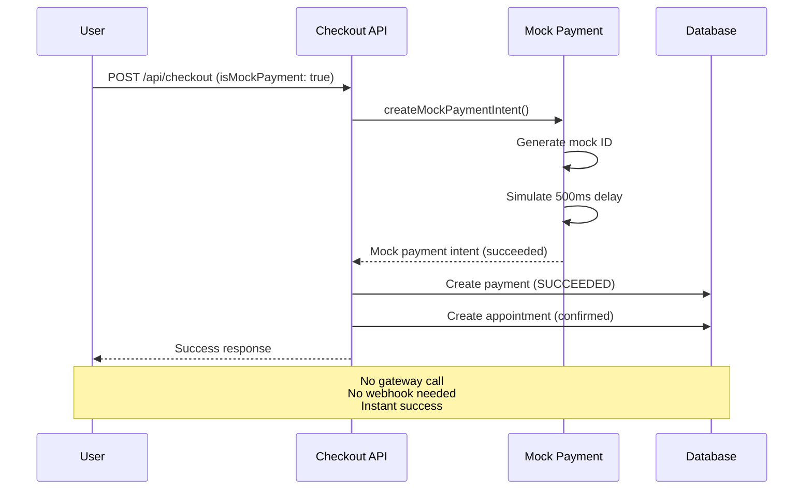

# Edge Cases, Special Flows & Issues

> **Superseded (2026-09-03):** this document dates to November 2025. Its race-condition protection ("three-layer protection system") and capacity checks predate the interval-atom `slot-booking:` locks in `utils/appointmentlock.ts`, the CAS transitions in `lib/booking/transitions.ts`, and the union-coverage validation in `utils/slotAllocation/availabilityCoverage.ts`. For current concurrency and edge-case behavior, read [`docs/booking/00-architecture-decisions.md`](../../booking/00-architecture-decisions.md) (ADR B6, B7, B11), [`docs/booking/15-checklist.md`](../../booking/15-checklist.md), and the wave-5 entries in [`docs/booking/05-troubleshooting-and-changelog.md`](../../booking/05-troubleshooting-and-changelog.md). The rest of this file is kept for historical context only; do not cite its file:line references as current.

---

> **Navigation:** [Overview & Consultation](./01-overview-and-consultation.md) | [Webinar & Class](./02-webinar-and-class.md) | [Payment Processing](./03-payment-processing.md) | **Edge Cases** | [Status Flows](./05-status-flows.md)

## Table of Contents

1. [Race Conditions](#1-race-conditions)
2. [Timeout Scenarios](#2-timeout-scenarios)
3. [Data Inconsistencies](#3-data-inconsistencies)
4. [Capacity Edge Cases](#4-capacity-edge-cases)
5. [Validation Edge Cases](#5-validation-edge-cases)
6. [Mock Payment Mode](#6-mock-payment-mode)
7. [Multi-Session Handling](#8-multi-session-handling)
8. [Code Locations Reference](#9-code-locations-reference)
9. [Integration Points](#10-integration-points)
10. [Critical Issues & Improvements](#11-critical-issues--improvements)

---

## 1. Race Conditions

### 1.1 Concurrent Booking Attempts

**Scenario:** Multiple users try to book the same consultation slot simultaneously.

```
User A                      User B                      Database
  │                           │                           │
  ├─ Check slot available ────┼───────────────────────────► (Available)
  │                           ├─ Check slot available ────► (Available)
  │                           │                           │
  ├─ Create payment ──────────┼───────────────────────────► Payment A
  │                           ├─ Create payment ──────────► Payment B
  │                           │                           │
  ├─ Create tentative slot ───┼───────────────────────────► Slot A (tentative)
  │                           ├─ Create tentative slot ───► Slot B (tentative)
  │                           │                           │
  ? CONFLICT: Two tentative slots for same time slot
```

**Protection Mechanism (Consultation/Subscription):**

**File:** `/lib/payments/operations/checkout.ts` (lines 196-248)

```typescript
// Three-layer protection system

// Layer 1: No confirmed overlap
const confirmedOverlap = await tx.slotOfAppointment.findFirst({
  where: {
    appointment: {
      consultation: { consultationPlanId: planId },
    },
    isTentative: false,
    OR: [
      {
        startsAt: { lte: slotStart },
        endsAt: { gt: slotStart },
      },
      {
        startsAt: { lt: slotEnd },
        endsAt: { gte: slotEnd },
      },
    ],
  },
});

if (confirmedOverlap) {
  throw new Error("This time slot is no longer available");
}

// Layer 2: No duplicate pending for same user
const userPendingCount = await tx.slotOfAppointment.count({
  where: {
    appointment: {
      consultation: { consultationPlanId: planId },
      payment: {
        some: {
          userId,
          paymentStatus: PaymentStatus.PENDING,
        },
      },
    },
    isTentative: true,
  },
});

if (userPendingCount > 0) {
  throw new Error("You already have a pending payment for this consultation");
}

// Layer 3: Rate limiting (max 3 concurrent attempts)
const allPendingCount = await tx.slotOfAppointment.count({
  where: {
    appointment: {
      consultation: { consultationPlanId: planId },
    },
    isTentative: true,
    OR: [
      {
        startsAt: { lte: slotStart },
        endsAt: { gt: slotStart },
      },
      {
        startsAt: { lt: slotEnd },
        endsAt: { gte: slotEnd },
      },
    ],
  },
});

if (allPendingCount >= 3) {
  throw new Error(
    "This time slot is currently being booked by other users. Please try again in a few minutes.",
  );
}
```

**DB backstop — `slot_no_confirmed_overlap` exclusion constraint (#440):**

Even if two Serializable transactions race past all three application-layer checks, a PostgreSQL **exclusion constraint** on `SlotOfAppointment` prevents two _confirmed_ (non-tentative) rows from overlapping the same `(consultantId, startsAt, endsAt)` range. This is the last-resort guarantee that concurrent webhooks cannot double-confirm a slot. The constraint fires at `COMMIT` time; the losing transaction receives a `P2002` / `UniqueConstraintError` which surfaces to the webhook handler as a 409 and triggers a gateway refund cascade.

```sql
-- prisma/sql/check-constraints.sql lines 56-58
ALTER TABLE "SlotOfAppointment"
  ADD CONSTRAINT "slot_no_confirmed_overlap"
  EXCLUDE USING gist (...) WHERE ("isTentative" = false);
```

**Resolution:**

- First confirmed payment wins
- Other attempts fail during slot availability check
- Cleanup job removes expired tentative slots

**Edge Case:** If all 3 fail payment, cleanup job runs, slots become available again.

### 1.2 Webhook Race Condition

**Scenario:** Webhook arrives before payment record is created.

```
Checkout Flow                Webhook                     Database
     │                          │                           │
     ├─ Create payment ─────────┼───────────────────────────► (In progress...)
     │                          │                           │
     │                      ┌───┤ Webhook arrives           │
     │                      │   ├─ Find payment ───────────► NOT FOUND
     │                      │   │                           │
     │                      │   ? Payment record doesn't exist yet
     │                      │   │                           │
     ├─ Payment created ────┼───┼───────────────────────────► Payment exists
     │                      └───┤ Webhook retries (later)   │
     │                          ├─ Find payment ───────────► FOUND
     │                          └─ Process success          │
```

**Protection Mechanism:**

**File:** `/app/api/webhooks/utils.ts` (lines 66-70)

```typescript
const payment = await tx.payment.findUnique({
  where: { paymentIntent: paymentIntentId },
});

if (!payment) {
  console.warn(`Payment record not found for intent: ${paymentIntentId}`);
  return; // Return 200 OK to prevent retry storm
}
```

**Resolution:**

- Webhook returns success even if payment not found
- Gateway will retry webhook (up to 3 days)
- Eventually payment record will exist and process

**Edge Case:** If payment record is never created (server crash), manual intervention needed.

### 1.3 Double Booking via Class Enrollment

**Scenario:** User enrolls in class twice with concurrent requests.

**Protection Mechanism:**

**File:** `/lib/payments/operations/checkout.ts` (lines 675-678)

```typescript
// Check if user is already enrolled
if (uniqueUserIds.has(userId)) {
  throw new Error("You are already enrolled in this class");
}
```

**Additional Protection:** Unique constraint on payment intent IDs prevents duplicate payments.

### 1.4 User Self-Cancel of Pending Checkout (#849)

**Scenario:** User abandons checkout and wants to release their tentative hold immediately instead of waiting up to 24 hours for the cleanup cron.

**Endpoint:** `DELETE /api/checkout/pending/[paymentId]`

**File:** `/app/api/checkout/pending/[paymentId]/route.ts` + `/lib/payments/operations/cancel-pending.ts`

**Mechanics:**

1. Rate-limited to **10 requests/minute** per user (`cancelPendingLimiter`).
2. The entire body runs in a single **Serializable transaction** with a CAS write as the first step: `UPDATE payment SET status = EXPIRED WHERE id = ? AND status = PENDING`. If `count = 0`, another winner already settled the payment (webhook confirm or parallel cancel).
3. On CAS success: referral credits are reversed, tentative slots are deleted per-type (class = caller's slots across all sessions, webinar = caller-scoped slot, consultation/subscription = all slots on the appointment), parent consultation/subscription is transitioned to `CANCELLED` from the **narrow** from-set `[PENDING, APPROVED_PENDING_PAYMENT]` — an APPROVED parent blocks the cancellation via `IllegalTransitionError`, rolling back the entire tx.
4. Post-commit, best-effort: gateway order is cancelled. Failure does not un-cancel the booking.
5. Retry-exhausted Serializable write conflicts (P2034) map to **409 Conflict**, not 500.

**Capacity counts:** This endpoint correctly counts tentative holds in capacity (the checkout layer already includes tentative slots in availability checks — the last-seat race is closed at checkout; `test-last-seat-storm` pins this).

**Returns:**

```json
{ "success": true, "slotsReleased": 1 }
```

---

## 2. Timeout Scenarios

### 2.1 Payment Intent Timeout

**Timeline:**

```
t=0:00 → Payment intent created
t=0:01 → User redirected to gateway
t=0:15 → User still entering card details
t=29:59 → Last valid moment
t=30:00 → Payment intent expires
t=30:01 → User clicks "Pay" → FAILS
```

**Handling:**

```typescript
// Stripe automatically expires checkout sessions
expires_at: Math.floor(Date.now() / 1000) + 30 * 60, // 30 minutes

// Database tracks expiration
expiresAt: new Date(Date.now() + 30 * 60 * 1000),
```

**User Experience:**

- Gateway shows "Session expired" error
- User must restart checkout process
- User can self-cancel immediately via `DELETE /api/checkout/pending/[paymentId]` (see §1.4)
- Otherwise, tentative slot is released by the cron cleanup

**TTL distinction:** The `Payment.expiresAt` field is set to **30 minutes** (matches the gateway checkout session). The `isTentative` slot itself has a **24-hour** cleanup window (#833 — changed from the old 7-day window). The abandoned-payments cron releases the slot once `expiresAt` has passed; the tentative-slots cron is a belt-and-braces fallback that runs every 2 hours and catches any orphans past the 24-hour mark.

**Edge Case:** User completes payment at exactly 30:00 → May succeed or fail depending on gateway clock.

### 2.2 Webhook Timeout

**Scenario:** Webhook takes too long to process (> 10 seconds).

**Gateway Behavior:**

- Stripe: Retries webhook with exponential backoff (up to 3 days)
- Razorpay: Retries webhook (similar pattern)

**Protection:**

```typescript
// Transaction timeout
await prisma.$transaction(
  async (tx) => {
    // ... operations
  },
  {
    timeout: 10000, // 10 seconds max
  },
);
```

**If Timeout Occurs:**

1. Transaction rolls back
2. Payment status remains PENDING
3. Gateway retries webhook
4. Eventually succeeds or requires manual intervention

**Monitoring Recommendation:**

```typescript
// Alert if webhooks taking > 5 seconds
if (processingTime > 5000) {
  logWarning("Slow webhook processing", {
    paymentIntent: paymentIntentId,
    duration: processingTime,
  });
}
```

### 2.3 Database Query Timeout

**Scenario:** Complex query during peak load takes too long.

```typescript
// Prisma client timeout (default: 5 seconds)
const prisma = new PrismaClient({
  datasources: {
    db: {
      url: process.env.DATABASE_URL,
    },
  },
  log: ["query", "error", "warn"],
  // Query timeout configuration
});
```

**Mitigation:**

- Use database indexes (see Prisma schema)
- Optimize queries (limit, select specific fields)
- Connection pooling (configured in DATABASE_URL)

---

## 3. Data Inconsistencies

### 3.1 Orphaned Payments

**Scenario:** Payment succeeded in gateway but webhook never processed.

**Causes:**

- Server downtime during webhook delivery
- Webhook endpoint misconfigured
- Gateway failure to deliver webhook

**Detection:**

```sql
-- Find succeeded payments without appointments
SELECT p.id, p.paymentIntent, p.createdAt
FROM Payment p
WHERE p.paymentStatus = 'SUCCEEDED'
  AND p.appointmentId IS NULL
  AND p.createdAt < NOW() - INTERVAL '1 hour';
```

**Resolution:**

```typescript
// Manual recovery script
async function recoverOrphanedPayment(paymentId: string) {
  const payment = await prisma.payment.findUnique({
    where: { id: paymentId },
    include: { user: { include: { consulteeProfile: true } } },
  });

  // Fetch metadata from gateway
  const gatewayPayment = await stripeClient.checkout.sessions.retrieve(
    payment.paymentIntent,
  );

  // Recreate appointment from metadata
  const appointment = await createAppointmentFromWebhook(
    prisma,
    gatewayPayment.metadata,
    payment,
  );

  // Link payment to appointment
  await prisma.payment.update({
    where: { id: payment.id },
    data: { appointmentId: appointment.id },
  });
}
```

### 3.2 Mismatched Status

**Scenario:** Payment status in database doesn't match gateway status.

**Causes:**

- Webhook failure
- Database transaction rollback
- Manual status change in gateway

**Detection:**

```typescript
async function auditPaymentStatuses() {
  const recentPayments = await prisma.payment.findMany({
    where: {
      createdAt: { gte: new Date(Date.now() - 24 * 60 * 60 * 1000) },
    },
  });

  for (const payment of recentPayments) {
    const gatewayStatus = await getGatewayPaymentStatus(
      payment.paymentIntent,
      payment.paymentGateway,
    );

    if (gatewayStatus !== payment.paymentStatus) {
      console.error("Status mismatch:", {
        paymentId: payment.id,
        dbStatus: payment.paymentStatus,
        gatewayStatus,
      });
    }
  }
}
```

### 3.3 Duplicate Slots

**Scenario:** Same user has multiple tentative slots for same time.

**Causes:**

- Race condition bypass
- Failed cleanup
- Manual database manipulation

**Detection:**

```sql
-- Find duplicate tentative slots
SELECT u.id, u.email, COUNT(*) as slot_count
FROM SlotOfAppointment s
JOIN Appointment a ON s.appointmentId = a.id
JOIN Payment p ON a.id = p.appointmentId
JOIN User u ON p.userId = u.id
WHERE s.isTentative = true
GROUP BY u.id, u.email
HAVING COUNT(*) > 1;
```

**Resolution:**

```typescript
// Keep oldest, remove others
async function cleanupDuplicateTentativeSlots(userId: string) {
  const slots = await prisma.slotOfAppointment.findMany({
    where: {
      isTentative: true,
      appointment: {
        payment: {
          some: { userId },
        },
      },
    },
    orderBy: { createdAt: "asc" },
  });

  // Keep first (oldest), delete rest
  if (slots.length > 1) {
    await prisma.slotOfAppointment.deleteMany({
      where: {
        id: { in: slots.slice(1).map((s) => s.id) },
      },
    });
  }
}
```

---

## 4. Capacity Edge Cases

### 4.1 Webinar Over-Booking

**Scenario:** Capacity is 10, but 11 people enrolled due to race condition.

**Root Cause:**

```typescript
// Non-atomic check-then-act
const currentCount = webinar.appointment?.slotsOfAppointment?.length || 0;

if (currentCount >= plan.capacity) {
  throw new Error("Webinar is full");
}

// Between check and insert, another enrollment happens
await tx.slotOfAppointment.create({...});
```

**Mitigation (Current):**

- Three-layer race condition protection
- Tentative slots counted during check
- Cleanup job removes expired slots

**Better Solution (Recommendation):**

```typescript
// Use database constraint
model Webinar {
  capacity Int
  currentEnrollment Int @default(0)

  @@check(currentEnrollment <= capacity)
}

// Atomic increment with constraint check
await tx.webinar.update({
  where: { id: webinarId },
  data: {
    currentEnrollment: { increment: 1 },
  },
});
// This will fail if capacity exceeded
```

### 4.2 Class Capacity Counting

**Issue:** Before fix (Part 1), class capacity was counted incorrectly.

**Old Logic (Incorrect):**

```typescript
// Counted total slots across all sessions
const currentParticipants = classInstance.appointments.reduce(
  (total, apt) => total + apt.slotsOfAppointment.length,
  0,
);
// For 10 students × 10 sessions = 100 slots (wrong!)
```

**New Logic (Correct):**

```typescript
// Count unique users across all sessions
const uniqueUserIds = new Set<string>();
for (const apt of classInstance.appointments) {
  for (const slot of apt.slotsOfAppointment) {
    if (slot.user && Array.isArray(slot.user)) {
      slot.user.forEach((u) => uniqueUserIds.add(u.id));
    }
  }
}
const currentParticipants = uniqueUserIds.size;
// For 10 students × 10 sessions = 10 unique users (correct!)
```

**Edge Case:** User enrolled twice with different accounts → Counted as 2 participants.

## 5. Validation Edge Cases

### 5.1 Slot Time Validation

**Issue:** No validation for slot time in the past.

**Current Code:**

```typescript
// Allows booking slots in the past
startsAt: z.string().datetime(),   // renamed from `slotStartTimeInUTC`
endsAt: z.string().datetime(),     // renamed from `slotEndTimeInUTC`
```

**Recommendation:**

```typescript
// Add custom validation
startsAt: z.string().datetime().refine(
  (val) => new Date(val) > new Date(),
  { message: "Slot start time must be in the future" }
),

// Also validate slot duration
.refine(
  (data) => {
    const start = new Date(data.startsAt);
    const end = new Date(data.endsAt);
    return end > start;
  },
  { message: "Slot end time must be after start time" }
),
```

### 5.2 Currency Mismatch

**Issue:** Plan in USD, user tries to pay in INR.

**Current Behavior:**

```typescript
// Currency is determined by plan
const currency = plan.currency; // e.g., "USD"

// Gateway is selected by currency
const gateway = selectPaymentGateway(currency, isMockPayment);
```

**Edge Case:**

```typescript
// User is in India, plan is in USD
// Stripe (USD) will charge in USD
// User's bank may add conversion fee + international transaction fee

// Recommendation: Show clear currency warning
if (userCurrency !== planCurrency) {
  return {
    warning: `This payment will be charged in ${planCurrency}. Your bank may apply currency conversion fees.`,
  };
}
```

### 5.3 Amount Validation

**Issue:** No min/max amount validation in checkout.

**Current Code:**

```typescript
// Any amount accepted
amount: z.number().positive(),
```

**Recommendation:**

```typescript
// Gateway minimums
const STRIPE_MIN_USD = 0.50;  // $0.50
const RAZORPAY_MIN_INR = 1.00; // ₹1.00

amount: z.number()
  .positive()
  .refine(
    (val) => val >= STRIPE_MIN_USD, // Adjust by currency
    { message: "Amount is below minimum" }
  ),
```

---

## 6. Mock Payment Mode

### 6.1 Mock Payment Behavior

**Purpose:** Development and testing without actual payment gateway calls.

**Activation:**

```typescript
// Environment-based
process.env.NODE_ENV === "development";

// Or explicit flag
process.env.ENABLE_MOCK_PAYMENTS === "true";

// Or request parameter
{
  isMockPayment: true;
}
```

**Characteristics:**

```typescript
export async function createMockPaymentIntent({
  amount,
  currency,
  metadata,
  paymentGateway,
}: PaymentIntentParams): Promise<PaymentIntent> {
  // Simulate API delay
  await new Promise((resolve) => setTimeout(resolve, 500));

  const mockPaymentId = generateMockPaymentId(paymentGateway);

  return {
    id: mockPaymentId,
    client_secret: `mock_secret_${mockPaymentId}`,
    amount,
    currency,
    status: "succeeded", // Always succeeds
  };
}
```

**Mock Payment IDs:**

- Stripe: `cs_mock_abc123_1699123456789`
- Razorpay: `order_mock_xyz789_1699123456789`
- Contains `_mock_` substring for identification

**Detection:**

```typescript
export function isMockPaymentId(paymentIntentId: string): boolean {
  return paymentIntentId.includes("_mock_");
}
```

### 6.2 Mock Payment Flow



**Key Differences from Real Payments:**

- No redirect to gateway
- No webhook processing
- Instant success (no PENDING state)
- No actual money movement
- Appointments confirmed immediately

### 6.3 Mock Payment Limitations

**What Mock Payments DON'T Test:**

- Gateway authentication errors
- Card decline errors
- Webhook signature verification
- Webhook retry logic
- Payment timeout behavior
- Refund processing delays
- Dispute handling

**When to Use Mock Payments:**

- Local development
- Frontend integration testing
- Flow testing without costs
- Automated test suites

**When NOT to Use Mock Payments:**

- Staging environment
- Pre-production testing
- Integration testing with real gateways
- Load testing (different performance profile)

---

## 8. Multi-Session Handling

### 8.1 Subscription Multi-Session Creation

**Current Implementation:**

**File:** `/lib/payments/operations/checkout.ts` (lines 512-568)

```typescript
// Calculate total sessions
const totalWeeks = Math.ceil(plan.durationInMonths * 4.33);
const totalSessions = totalWeeks * plan.sessionsPerWeek;

// Create ALL appointments upfront
const appointments = [];
for (let i = 0; i < totalSessions; i++) {
  const sessionStart = new Date(firstSessionStart);
  const weekOffset = Math.floor(i / plan.sessionsPerWeek);
  sessionStart.setDate(sessionStart.getDate() + weekOffset * 7);
  const sessionEnd = new Date(sessionStart.getTime() + sessionDurationMs);

  const appointment = await tx.appointment.create({
    data: {
      appointmentType: AppointmentsType.SUBSCRIPTION,
      subscriptionId: subscription.id,
      slotsOfAppointment: {
        create: {
          startsAt: sessionStart,
          endsAt: sessionEnd,
          isTentative: !skipPayment,
        },
      },
    },
  });
  appointments.push(appointment);
}
```

**Session Calculation Formula:**

```typescript
// Example: 3-month subscription, 2 calls/week
const durationInMonths = 3;
const sessionsPerWeek = 2;

// Step 1: Convert months to weeks (1 month ≈ 4.33 weeks)
const totalWeeks = Math.ceil(3 * 4.33) = Math.ceil(12.99) = 13 weeks

// Step 2: Calculate total sessions
const totalSessions = 13 * 2 = 26 sessions

// Step 3: Schedule sessions
// Week 1: Session 0 (index 0/2 = 0), Session 1 (index 1/2 = 0)
// Week 2: Session 2 (index 2/2 = 1), Session 3 (index 3/2 = 1)
// ...
// Week 13: Session 24 (index 24/2 = 12), Session 25 (index 25/2 = 12)
```

### 8.2 Class Multi-Session Creation

**Current Implementation:**

**File:** `/app/api/bookings/classes/crud-with-plan/route.ts` (lines 162-164)

```typescript
// Calculate total sessions
Array.from({
  length: Math.ceil(durationInMonths * 4.33) * sessionsPerWeek,
}).map((_, index) => {
  // Create appointment for each session
  const sessionDate = new Date(schedulingPeriodStartsAt);
  const weekOffset = Math.floor(index / sessionsPerWeek);
  const dayOffset = (index % sessionsPerWeek) * daysBetweenCalls;
  sessionDate.setDate(sessionDate.getDate() + weekOffset * 7 + dayOffset);

  return {
    appointmentType: AppointmentsType.CLASS,
    classId: createdClass.id,
    slotsOfAppointment: {
      create: {
        startsAt: sessionDate,
        endsAt: new Date(sessionDate.getTime() + sessionDurationMs),
        isTentative: false,
      },
    },
  };
});
```

### 8.3 Edge Cases in Multi-Session

**1. Session Overlap:**

```typescript
// Issue: Sessions scheduled too close together
// sessionsPerWeek = 7, only 1 day per week = 7 sessions in 1 day!

// Solution: Add validation
if (sessionsPerWeek > 7) {
  throw new Error("Cannot have more than 7 calls per week");
}
```

**2. Timezone Handling:**

```typescript
// Issue: Slots stored in UTC, user in different timezone
// 10:00 AM EST → 15:00 UTC → Shows as 8:30 PM IST (wrong!)

// Solution: Store timezone with subscription
model Subscription {
  schedulingPeriodStartsAt DateTime
  schedulingPeriodEndsAt   DateTime
  timezone                 String  // e.g., "America/New_York"
}

// Apply timezone when displaying
const localTime = moment(session.startsAt)
  .tz(subscription.timezone)
  .format("h:mm A");
```

**3. Daylight Saving Time:**

```typescript
// Issue: DST changes affect recurring sessions
// March 10 DST starts → 10 AM becomes 11 AM

// Solution: Use timezone-aware library
import { zonedTimeToUtc, utcToZonedTime } from "date-fns-tz";

const zonedDate = utcToZonedTime(sessionStart, subscription.timezone);
// This handles DST transitions automatically
```

---

## 9. Code Locations Reference

### 9.1 Core Files

**Checkout Operations:**

- `/lib/payments/operations/checkout.ts` - Main checkout logic for all event types
  - Lines 118-258: Consultation checkout
  - Lines 260-568: Subscription checkout
  - Lines 570-636: Webinar checkout
  - Lines 638-728: Class checkout

**Payment Gateway Integrations:**

- `/lib/payments/core/stripe.ts` - Stripe integration
  - Lines 76-123: Checkout session creation
  - Lines 174-207: Refund operations
  - Lines 278-358: Dispute operations
- `/lib/payments/core/razorpay.ts` - Razorpay integration
  - Lines 61-93: Order creation
  - Lines 128-183: Refund operations
- `/lib/payments/operations/mock.ts` - Mock payment handling

**Webhook Handlers:**

- `/app/api/webhooks/stripe/route.ts` - Stripe webhook endpoint
- `/app/api/webhooks/razorpay/route.ts` - Razorpay webhook endpoint
- `/app/api/webhooks/utils.ts` - Shared webhook logic
  - Lines 56-101: Payment success handler
  - Lines 103-127: Payment failure handler
  - Lines 434-487: Refund webhook handler
  - Lines 513-618: Dispute webhook handlers

**API Routes:**

- `/app/api/checkout/route.ts` - Unified checkout API
- `/app/api/admin/refunds/route.ts` - Admin refunds API
- `/app/api/admin/disputes/route.ts` - Admin disputes API

**Cleanup:**

- `/scripts/cleanup-abandoned-payments.ts` - Local cleanup script
- `/jobs/cleanup-abandoned-payments.ts` - CI/CD cleanup job

### 9.2 Key Line References

**Race Condition Protection:**

- Consultation: `/lib/payments/operations/checkout.ts`
- Subscription: Same protection mechanism
- Class enrollment check: `/lib/payments/operations/checkout.ts`

**Capacity Counting:**

- Webinar: `/lib/payments/operations/checkout.ts`
- Class: `/lib/payments/operations/checkout.ts` (unique user counting)

**Session Calculations:**

- Subscription: `/lib/payments/operations/checkout.ts`
- Class: `/app/api/bookings/classes/crud-with-plan/route.ts`

**Error Handling:**

- Checkout API: `/app/api/checkout/route.ts`
- Stripe errors: `/lib/payments/core/stripe.ts`
- Razorpay errors: `/lib/payments/core/razorpay.ts`

### 9.3 Database Schema Locations

**Prisma Schema:** `/prisma/schema.prisma`

Key models:

- `Payment` - Payment records
- `Appointment` - Appointment records
- `SlotOfAppointment` - Time slots
- `Refund` - Refund records
- `Dispute` - Dispute records
- `Consultation`, `Subscription`, `Webinar`, `Class` - Event types

---

## 10. Integration Points

### 10.1 Frontend Integration

**Checkout Pages:**

```typescript
// Consultation: /app/checkout/plans/consultation/[consultationPlanId]/page.tsx
// Subscription: /app/checkout/plans/subscription/[subscriptionPlanId]/page.tsx
// Webinar: /app/checkout/plans/webinar/[webinarId]/page.tsx
// Class: /app/checkout/plans/class/[classPlanId]/page.tsx
```

**API Calls:**

```typescript
// Initiate checkout
const response = await fetch("/api/checkout", {
  method: "POST",
  headers: { "Content-Type": "application/json" },
  body: JSON.stringify({
    appointmentType: "CONSULTATION",
    planId: "plan-uuid",
    startsAt: "2025-11-07T10:00:00Z", // renamed from `slotStartTimeInUTC`
    endsAt: "2025-11-07T11:00:00Z", // renamed from `slotEndTimeInUTC`
    notes: "Follow-up consultation",
    isMockPayment: false, // Set to true for testing
  }),
});

const { paymentIntent, checkoutUrl } = await response.json();

// Redirect to gateway
window.location.href = checkoutUrl;
```

**Success/Failure Pages:**

```typescript
// Success: /app/checkout/checkout-success/page.tsx
// Failure: /app/checkout/checkout-failure/page.tsx
```

### 10.2 External Integrations

**Payment Gateways:**

```
Stripe:
- API: stripe.com/docs/api
- Webhooks: stripe.com/docs/webhooks
- Test mode: Use test API keys (sk_test_...)

Razorpay:
- API: razorpay.com/docs/api
- Webhooks: razorpay.com/docs/webhooks
- Test mode: Use test credentials
```

**Environment Variables Required:**

```bash
# Stripe
STRIPE_SECRET_KEY=sk_test_...
STRIPE_PUBLISHABLE_KEY=pk_test_...
STRIPE_WEBHOOK_SECRET=whsec_...

# Razorpay
RAZORPAY_KEY_ID=rzp_test_...
RAZORPAY_SECRET=...
RAZORPAY_WEBHOOK_SECRET=...

# Database
DATABASE_URL="postgresql://..."

# Application
NEXT_PUBLIC_APP_URL="http://localhost:3000"
NODE_ENV="development" # or "production"
ENABLE_MOCK_PAYMENTS="true" # Optional: Force mock payments
```

### 10.3 Monitoring & Logging

**Recommended Monitoring:**

```typescript
// Key metrics to track
{
  // Payment metrics
  "payment.initiated": "Count of checkout API calls",
  "payment.succeeded": "Count of successful payments",
  "payment.failed": "Count of failed payments",
  "payment.abandoned": "Count of timed-out payments",

  // Timing metrics
  "payment.duration_p50": "Median payment duration",
  "payment.duration_p99": "99th percentile duration",
  "webhook.processing_time": "Webhook processing duration",

  // Error metrics
  "api.error.rate": "Checkout API error rate",
  "webhook.error.rate": "Webhook processing error rate",
  "gateway.error.rate": "Gateway API error rate",

  // Business metrics
  "revenue.total": "Total successful payment amount",
  "refund.total": "Total refunded amount",
  "dispute.count": "Active disputes count",
}
```

**Logging Best Practices:**

```typescript
// Structured logging
console.log(
  JSON.stringify({
    level: "info",
    event: "payment_succeeded",
    paymentIntent: paymentIntentId,
    amount: amount,
    currency: currency,
    gateway: gateway,
    userId: userId,
    appointmentType: appointmentType,
    timestamp: new Date().toISOString(),
  }),
);

// Error logging
console.error(
  JSON.stringify({
    level: "error",
    event: "payment_failed",
    paymentIntent: paymentIntentId,
    error: error.message,
    errorType: error.type,
    gateway: gateway,
    timestamp: new Date().toISOString(),
  }),
);
```

---

## 11. Critical Issues & Improvements

### 11.1 Critical Issues

**🔴 HIGH PRIORITY:**

1. **No Slot Time Validation**
   - **Issue:** Slots can be booked in the past
   - **Impact:** Invalid appointments created
   - **Fix:** Add Zod validation for future dates
   - **Location:** `/lib/payments/operations/checkout.ts`

2. **Webhook Idempotency Key Missing**
   - **Issue:** Duplicate webhook processing possible if status check fails
   - **Impact:** Double-charged or duplicate appointments
   - **Fix:** Add idempotency key to webhook processing
   - **Location:** `/app/api/webhooks/utils.ts`

3. **No Payment Amount Minimum Validation**
   - **Issue:** Can create payments below gateway minimums
   - **Impact:** Payment creation fails at gateway
   - **Fix:** Add min amount validation ($0.50 USD, ₹1.00 INR)
   - **Location:** `/app/api/checkout/route.ts`

**🟡 MEDIUM PRIORITY:**

4. **Cleanup Job Not Cancelling Expired Gateways**
   - **Issue:** Payment intents not cancelled in gateway after timeout
   - **Impact:** Gateway still accepts payment on expired intent
   - **Fix:** Ensure cleanup job calls gateway cancellation
   - **Location:** `/scripts/cleanup-abandoned-payments.ts` (implemented)

5. **No Timezone Handling for Subscriptions**
   - **Issue:** All times stored in UTC, no timezone tracking
   - **Impact:** Wrong display times for users in different timezones
   - **Fix:** Add timezone field to subscription model
   - **Location:** `/prisma/schema.prisma`

6. **Capacity Over-Booking Possible**
   - **Issue:** Race condition can allow booking beyond capacity
   - **Impact:** More participants than allowed
   - **Fix:** Use database constraint or atomic increment
   - **Location:** `/lib/payments/operations/checkout.ts`

**🟢 LOW PRIORITY:**

7. **No Email Notifications**
   - **Issue:** Users not notified of payment success/failure
   - **Impact:** Poor user experience
   - **Fix:** Implement email notification system
   - **Location:** New file `/lib/notifications/email.ts`

8. **No Calendar Integration**
   - **Issue:** Appointments not synced to calendars
   - **Impact:** Users manually add to calendar
   - **Fix:** Implement ICS file generation
   - **Location:** New file `/lib/calendar/ics.ts`

9. **No Payment Analytics Dashboard**
   - **Issue:** No visibility into payment metrics
   - **Impact:** Hard to monitor business health
   - **Fix:** Create admin analytics page
   - **Location:** New page `/app/admin/analytics/page.tsx`

### 11.2 Recommended Improvements

**Architecture:**

1. **Separate Payment Service**
   - Extract payment logic to dedicated service
   - Benefits: Better testing, independent scaling, cleaner separation
   - Effort: High
   - Priority: Low (current structure is acceptable)

2. **Event-Driven Architecture**
   - Use message queue (e.g., Redis, RabbitMQ) for webhooks
   - Benefits: Better reliability, retry logic, monitoring
   - Effort: Medium
   - Priority: Medium

3. **Caching Layer**
   - Cache plan/event data during checkout
   - Benefits: Faster checkout, reduced DB load
   - Effort: Low
   - Priority: Low

**Testing:**

4. **Integration Tests**
   - Add tests for complete checkout flows
   - Test with real Stripe/Razorpay test mode
   - Effort: Medium
   - Priority: High

5. **Load Testing**
   - Test concurrent booking scenarios
   - Verify race condition protection
   - Effort: Medium
   - Priority: Medium

**Operations:**

6. **Monitoring Dashboard**
   - Real-time payment status monitoring
   - Alert on high error rates
   - Effort: Medium
   - Priority: High

7. **Automated Reconciliation**
   - Daily check: DB payments vs gateway payments
   - Auto-detect and report mismatches
   - Effort: Low
   - Priority: Medium

8. **Disaster Recovery**
   - Document manual recovery procedures
   - Create admin tools for common fixes
   - Effort: Low
   - Priority: High

**User Experience:**

9. **Progressive Web App**
   - Add loading states during checkout
   - Show timer for payment expiration
   - Real-time status updates
   - Effort: Low
   - Priority: Medium

10. **Multi-Currency Support**
    - Allow users to choose payment currency
    - Auto-detect user location
    - Show conversion rates
    - Effort: High
    - Priority: Low

### 11.3 Technical Debt

**Code Quality:**

1. **Type Safety Improvements**
   - Replace `any` types with proper types
   - Add strict type checking
   - Location: Multiple files

2. **Error Handling Standardization**
   - Create custom error classes
   - Consistent error response format
   - Location: All API routes

3. **Code Duplication**
   - Extract common checkout logic
   - Share validation between event types
   - Location: `/lib/payments/operations/checkout.ts`

**Documentation:**

4. **API Documentation**
   - Add OpenAPI/Swagger specs
   - Document all endpoints
   - Include examples

5. **Inline Comments**
   - Add JSDoc comments to functions
   - Explain complex logic
   - Document assumptions

---

## Key Takeaways

### ✅ System Strengths

1. **Robust Race Condition Protection**
   - Three-layer validation for consultation/subscription
   - Prevents double-booking effectively

2. **Comprehensive Webhook Handling**
   - Idempotent webhook processing
   - Proper error handling and retry logic
   - Support for multiple gateways

3. **Metadata-Driven Recovery**
   - All checkout data stored in payment metadata
   - Can recreate appointments from gateway data
   - Disaster recovery possible

4. **Multi-Gateway Support**
   - Clean abstraction over Stripe/Razorpay
   - Mock payment mode for development
   - Easy to add new gateways

### ⚠️ Areas for Improvement

1. **Validation Gaps**
   - Slot time validation missing
   - Amount minimums not enforced
   - Timezone handling incomplete

2. **Monitoring & Observability**
   - No payment analytics
   - Limited error tracking
   - Manual reconciliation required

3. **User Experience**
   - No email notifications
   - No calendar integration
   - Limited payment status updates

4. **Testing Coverage**
   - Integration tests needed
   - Load testing required
   - Edge case coverage incomplete

### 🔗 Related Documentation

- **[Overview & Consultation](./01-overview-and-consultation.md)** - Architecture, consultation & subscription
- **[Webinar & Class](./02-webinar-and-class.md)** - Webinar & class flows
- **[Payment Processing](./03-payment-processing.md)** - Webhooks, success/failure
- **[Refunds & Disputes](../refunds-disputes/)** - Post-payment operations

---

**Last Updated:** 2025-11-06
**Version:** 1.0
**Status:** ✅ Complete

---

## Appendix: Quick Reference

### Common Commands

```bash
# Development
npm run dev

# Cleanup abandoned payments (local)
npm run scripts:cleanup-abandoned-payments
node scripts/cleanup-abandoned-payments.ts

# Database migrations
npx prisma migrate dev
npx prisma generate

# Testing with mock payments
curl -X POST http://localhost:3000/api/checkout \
  -H "Content-Type: application/json" \
  -d '{"appointmentType":"CONSULTATION","planId":"...","isMockPayment":true}'
```

### Environment Checklist

**Development:**

- [ ] `NODE_ENV=development`
- [ ] Mock payments enabled
- [ ] Test gateway credentials
- [ ] Local database

**Staging:**

- [ ] `NODE_ENV=production`
- [ ] Test gateway credentials
- [ ] Webhooks configured
- [ ] Staging database

**Production:**

- [ ] `NODE_ENV=production`
- [ ] Live gateway credentials
- [ ] Webhooks verified
- [ ] Production database
- [ ] Monitoring enabled
- [ ] Cleanup job scheduled

### Emergency Procedures

**Webhook Not Processing:**

1. Check webhook secret configuration
2. Verify endpoint is publicly accessible
3. Check gateway webhook logs
4. Manually trigger webhook replay

**Payment Stuck in PENDING:**

1. Check payment status in gateway dashboard
2. If succeeded in gateway, manually run `handlePaymentSuccess()`
3. If failed in gateway, manually run `handlePaymentFailure()`
4. Run cleanup script if beyond 30 minutes

**Database Mismatch:**

1. Export payment data from gateway
2. Compare with database records
3. Use recovery scripts to fix inconsistencies
4. Update monitoring to prevent recurrence
