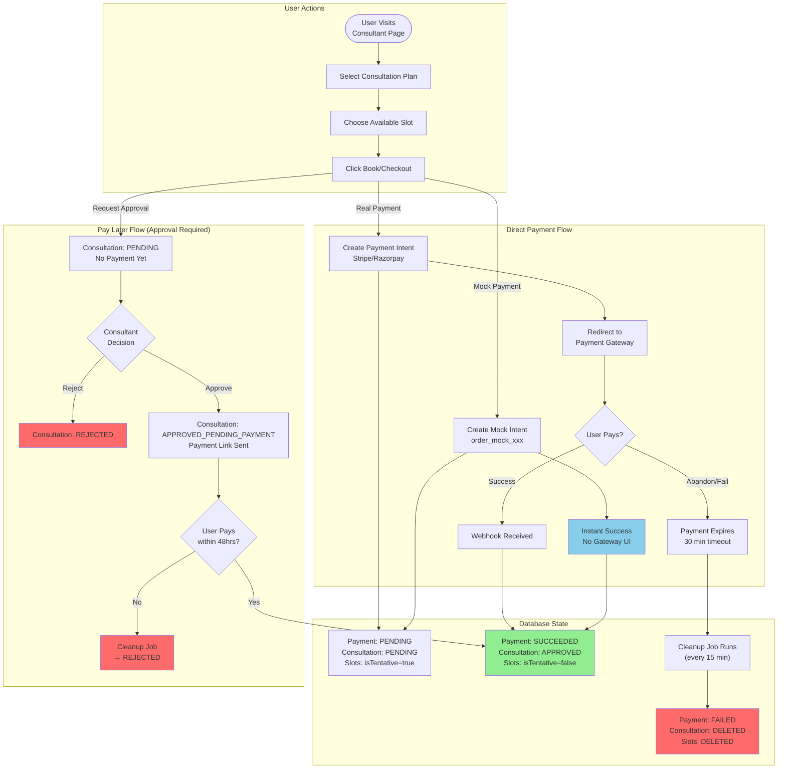
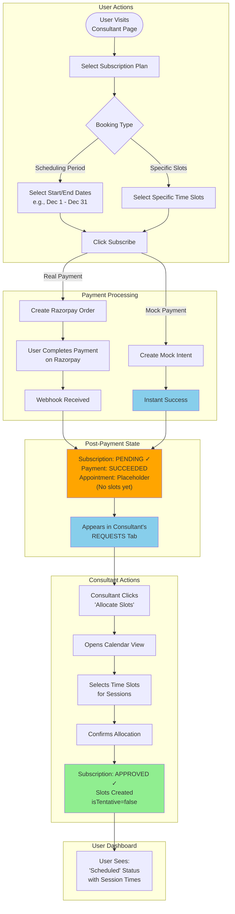
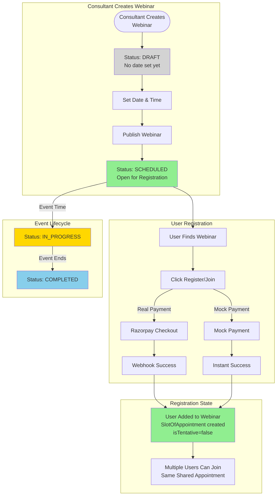
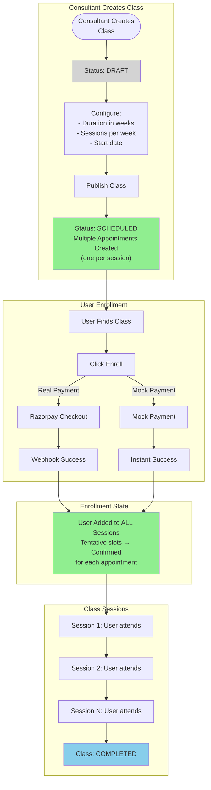
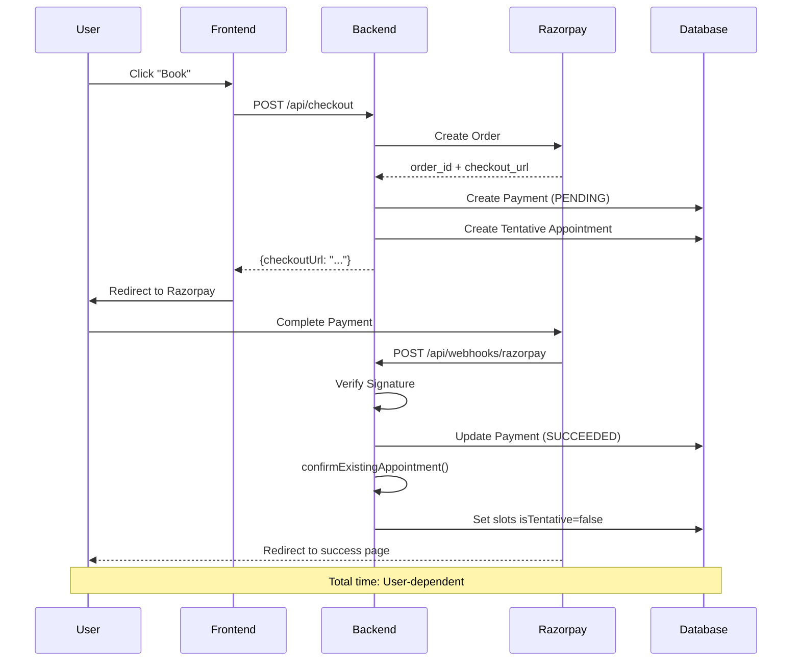

# Payment Status Flows & Mock Payment Guide

## Overview

This document explains the complete status lifecycle for all 4 event types, including both **real payment** and **mock payment** flows. It also covers the cleanup mechanisms for abandoned payments.

---

## Table of Contents

1. [Status Definitions](#status-definitions)
2. [Consultation Flow](#consultation-flow)
3. [Subscription Flow](#subscription-flow)
4. [Webinar Flow](#webinar-flow)
5. [Class Flow](#class-flow)
6. [Mock vs Real Payment Comparison](#mock-vs-real-payment-comparison)
7. [Cleanup Mechanisms](#cleanup-mechanisms)

---

## Status Definitions

### Appointment Status (Consultation & Subscription)

> **Rename note:** The DB field was `status` (enum `AppointmentStatus`); after the terminology-unification refactor it is `status` (enum `AppointmentStatus`). The enum *values* are unchanged.

| Status                     | Description                                                   |
| -------------------------- | ------------------------------------------------------------- |
| `PENDING`                  | User submitted request, awaiting payment or consultant action |
| `APPROVED_PENDING_PAYMENT` | Consultant approved (Pay Later flow), waiting for user to pay |
| `APPROVED`                 | Payment received, booking confirmed                           |
| `REJECTED`                 | Consultant rejected OR payment expired                        |
| `CANCELLED`                | User or consultant cancelled                                  |
| `EXPIRED`                  | Request timed out without action                              |

### Event Status (Webinar & Class)

| Status        | Description                              |
| ------------- | ---------------------------------------- |
| `DRAFT`       | Event created but not published          |
| `SCHEDULED`   | Event published with confirmed date/time |
| `IN_PROGRESS` | Event is currently happening             |
| `COMPLETED`   | Event finished                           |
| `CANCELLED`   | Event was cancelled                      |

### Payment Status

| Status      | Description                            |
| ----------- | -------------------------------------- |
| `PENDING`   | Payment initiated, awaiting completion |
| `SUCCEEDED` | Payment completed successfully         |
| `FAILED`    | Payment failed or was cancelled        |

---

## Consultation Flow

### Complete Status Flow Diagram



### Consultation: Mock vs Real Payment

| Step              | Real Payment (Razorpay)               | Mock Payment                             |
| ----------------- | ------------------------------------- | ---------------------------------------- |
| 1. Checkout       | `handleCheckout(data, userId, false)` | `handleCheckout(data, userId, true)`     |
| 2. Payment Intent | Real Razorpay Order created           | Fake ID: `order_mock_abc123`             |
| 3. User Action    | Redirected to Razorpay checkout       | No redirect, instant success             |
| 4. Confirmation   | Webhook from Razorpay                 | Direct DB update in same transaction     |
| 5. Status Update  | `handlePaymentSuccess()` via webhook  | `handlePaymentSuccess()` called directly |

---

## Subscription Flow

### Complete Status Flow Diagram



### Key Difference: Subscription Status After Payment

**Important:** Unlike consultations, subscriptions do NOT become `APPROVED` after payment. They stay `PENDING` so they appear in the consultant's Requests tab for slot allocation.

```
Consultation: PENDING → (payment) → APPROVED
Subscription: PENDING → (payment) → PENDING → (consultant allocates slots) → APPROVED
```

### Subscription: Mock vs Real Payment

| Step                     | Real Payment (Razorpay)               | Mock Payment               |
| ------------------------ | ------------------------------------- | -------------------------- |
| 1. Checkout              | Creates real Razorpay order           | Creates `order_mock_xxx`   |
| 2. Payment UI            | User sees Razorpay checkout           | No UI, instant completion  |
| 3. Webhook               | Razorpay sends webhook                | Skipped - direct DB update |
| 4. Status After Payment  | `PENDING` (stays for slot allocation) | `PENDING` (same behavior)  |
| 5. Appears in Requests   | Yes                                   | Yes                        |
| 6. After Slot Allocation | `APPROVED`                            | `APPROVED`                 |

---

## Webinar Flow

### Complete Status Flow Diagram



### Webinar: Mock vs Real Payment

| Step              | Real Payment                | Mock Payment          |
| ----------------- | --------------------------- | --------------------- |
| 1. Register       | Creates payment intent      | Creates mock intent   |
| 2. Payment        | User pays via gateway       | Instant success       |
| 3. Slot Creation  | Via webhook                 | Direct in transaction |
| 4. User Joins     | Added to shared appointment | Same                  |
| 5. Webinar Status | Stays `SCHEDULED`           | Stays `SCHEDULED`     |

**Note:** Webinar status doesn't change based on user payments. It only changes based on event lifecycle (DRAFT → SCHEDULED → IN_PROGRESS → COMPLETED).

---

## Class Flow

### Complete Status Flow Diagram



### Class: Mock vs Real Payment

| Step              | Real Payment                     | Mock Payment                |
| ----------------- | -------------------------------- | --------------------------- |
| 1. Enroll         | Creates payment intent           | Creates mock intent         |
| 2. Payment        | User pays via gateway            | Instant success             |
| 3. Session Access | Via webhook - joins all sessions | Direct - joins all sessions |
| 4. Class Status   | Stays `SCHEDULED`                | Stays `SCHEDULED`           |

---

## Mock vs Real Payment Comparison

### Complete Comparison Table

| Aspect                  | Real Payment (Razorpay/Stripe)      | Mock Payment                                          |
| ----------------------- | ----------------------------------- | ----------------------------------------------------- |
| **API Call**            | Real gateway API                    | None (fake ID generated)                              |
| **Payment ID Format**   | `order_abc123...` (Razorpay)        | `order_mock_abc123...`                                |
| **User Experience**     | Redirect to payment page            | No redirect, instant                                  |
| **Confirmation Method** | Webhook callback                    | Direct DB update                                      |
| **Time to Complete**    | User-dependent (seconds to minutes) | ~500ms (simulated delay)                              |
| **Money Charged**       | Yes (real money)                    | No                                                    |
| **Use Case**            | Production                          | Development/Testing                                   |
| **Environment**         | Any                                 | `NODE_ENV=development` or `ENABLE_MOCK_PAYMENTS=true` |

### How Mock Payments Work

```mermaid
sequenceDiagram
    participant U as User
    participant F as Frontend
    participant B as Backend
    participant DB as Database

    U->>F: Click "Book" (with mock flag)
    F->>B: POST /api/checkout {isMockPayment: true}
    B->>B: createMockPaymentIntent()
    Note over B: Generates fake ID:<br/>order_mock_abc123...
    B->>DB: Create Payment (PENDING)
    B->>DB: Create Tentative Appointment
    B->>DB: Update Payment (SUCCEEDED)
    B->>B: confirmExistingAppointment()
    B->>DB: Set slots isTentative=false
    B-->>F: {success: true, skipPayment: true}
    F-->>U: "Booking Confirmed!"
    Note over U,DB: Total time: ~1 second
```



### How Real Payments Work



---

## Cleanup Mechanisms

### Cleanup Job Overview

The cleanup job runs every **15 minutes** via GitHub Actions and handles two scenarios:

```mermaid
flowchart TD
    subgraph "Cleanup Job (every 15 min)"
        START([Job Starts]) --> FIND_ABANDONED[Find Abandoned Appointments]

        FIND_ABANDONED --> CHECK{Has Expired<br/>Pending Payment?}
        CHECK --> |"Yes"| RECHECK[Re-check Payment Status<br/>Prevent Race Condition]
        CHECK --> |"No"| SKIP[Skip]

        RECHECK --> STILL_PENDING{Still<br/>PENDING?}
        STILL_PENDING --> |"No - Succeeded"| SKIP
        STILL_PENDING --> |"Yes"| CANCEL[Cancel Payment Intent<br/>with Gateway]

        CANCEL --> UPDATE_PAYMENT[Payment → FAILED]
        UPDATE_PAYMENT --> DELETE_SLOTS[Delete Tentative Slots]
        DELETE_SLOTS --> CHECK_CONFIRMED{Has Confirmed<br/>Slots?}
        CHECK_CONFIRMED --> |"No"| DELETE_ALL[Delete Appointment<br/>+ Consultation/Subscription]
        CHECK_CONFIRMED --> |"Yes"| KEEP[Keep Appointment<br/>Only Remove Tentative]
    end

    subgraph "Expired Approval Cleanup"
        FIND_EXPIRED[Find APPROVED_PENDING_PAYMENT<br/>with Expired Payments] --> RESET[Reset to REJECTED]
        RESET --> DELETE_TENT[Delete Tentative Slots]
        DELETE_TENT --> MARK_FAILED[Mark Payments FAILED]
    end

    style CANCEL fill:#FF6B6B
    style DELETE_ALL fill:#FF6B6B
    style RESET fill:#FFA500
```



### Cleanup Timing

| Scenario                     | Timeout                                | Cleanup Action               |
| ---------------------------- | -------------------------------------- | ---------------------------- |
| Direct payment abandoned     | 30 min (explicit) or 35 min (fallback) | Delete appointment + payment |
| Pay Later payment expired    | 48 hours                               | Reset to REJECTED            |
| Mock payment (never expires) | N/A                                    | Same cleanup if abandoned    |

### Files Involved

| File                                          | Purpose                         |
| --------------------------------------------- | ------------------------------- |
| `jobs/cleanup-abandoned-payments.ts`          | Main cleanup job                |
| `app/api/cleanup/abandoned-payments/route.ts` | API endpoint for manual trigger |
| `app/api/cleanup/approval-payments/route.ts`  | Revert APPROVED_PENDING_PAYMENT |

---

## Quick Reference: Status After Each Action

| Event Type       | After Checkout      | After Payment | After Slot Allocation | After Event |
| ---------------- | ------------------- | ------------- | --------------------- | ----------- |
| **Consultation** | PENDING             | APPROVED      | N/A                   | COMPLETED\* |
| **Subscription** | PENDING             | PENDING       | APPROVED              | COMPLETED\* |
| **Webinar**      | N/A (pre-scheduled) | User joins    | N/A                   | COMPLETED   |
| **Class**        | N/A (pre-scheduled) | User enrolls  | N/A                   | COMPLETED   |

\*Consultation/Subscription don't have a formal COMPLETED status - they're marked via meeting completion.
