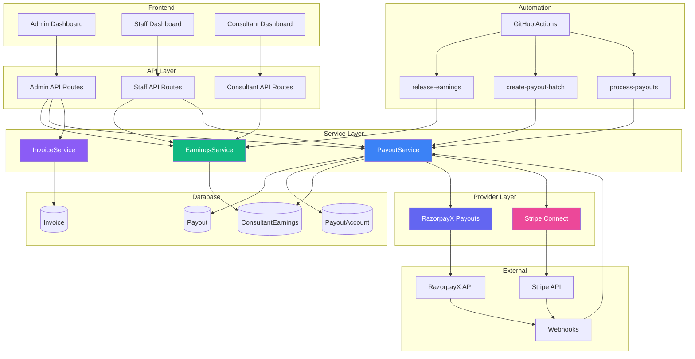
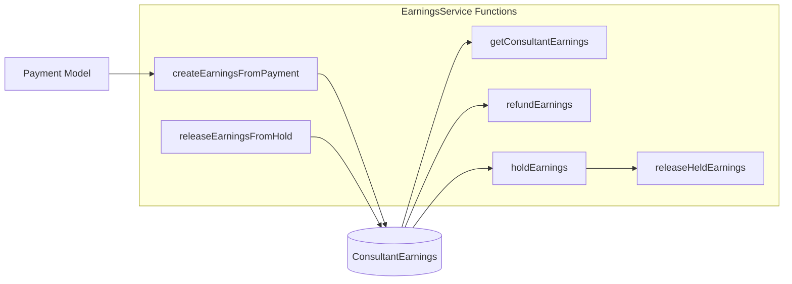
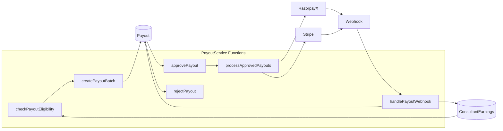
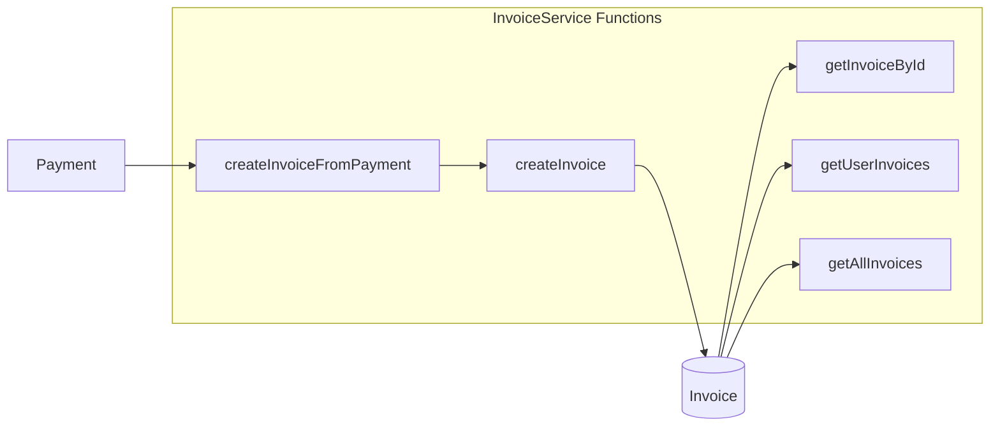
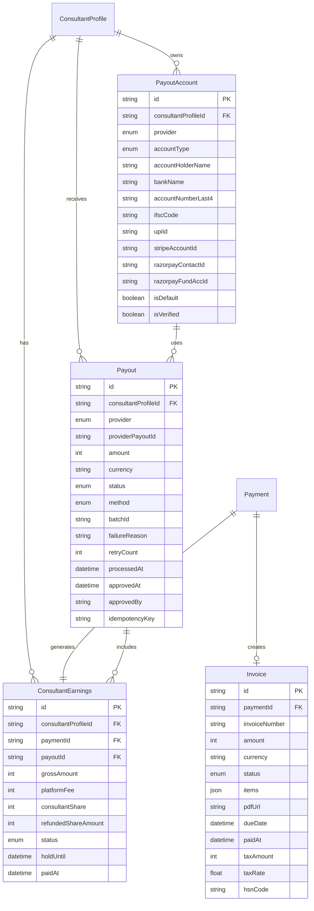
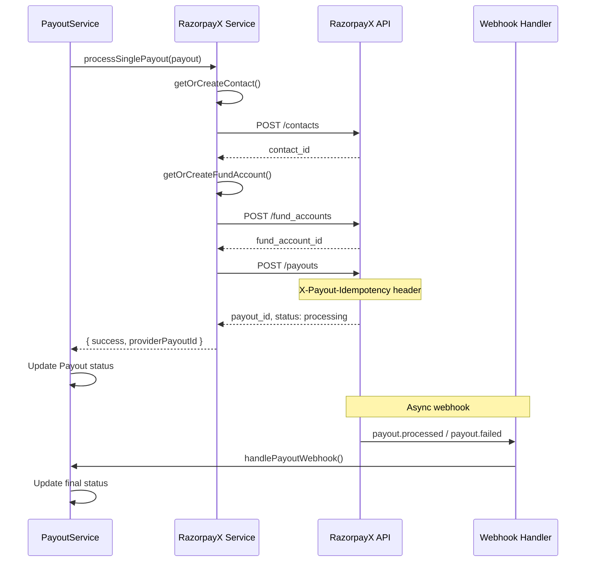
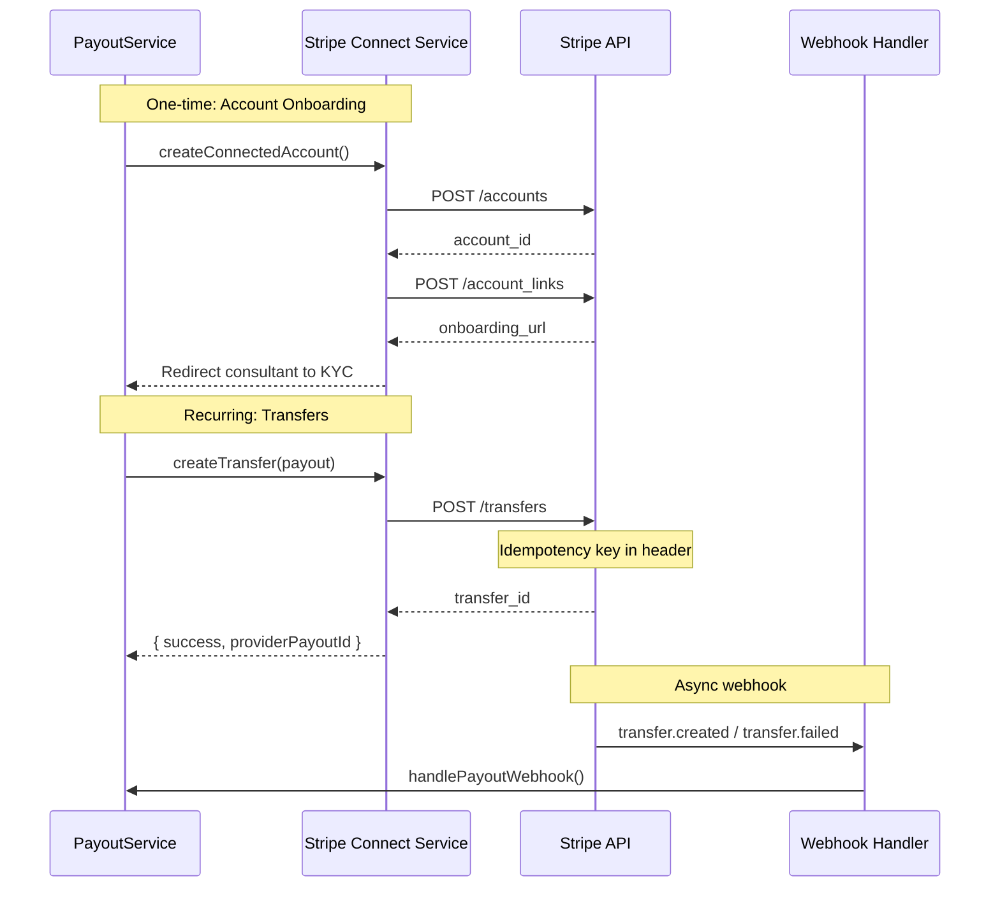
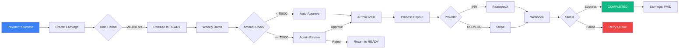

# Payout System Architecture

> **Moved (org/B2B side):** The organization-side documentation for payouts now lives in [`docs/enterprise/10-money-and-ledger/07-payout-pipeline.md`](../../enterprise/10-money-and-ledger/07-payout-pipeline.md) and [`06-earnings-lifecycle.md`](../../enterprise/10-money-and-ledger/06-earnings-lifecycle.md). This file keeps the consumer-marketplace (B2C) and gateway-generic details only.

> System design and component overview with diagrams

---

## High-Level Architecture

---

## Service Layer

### EarningsService (`earnings-service.ts`)

Manages the consultant earnings lifecycle.

**Key Functions:**

| Function                    | Purpose                                 | Trigger                  |
| --------------------------- | --------------------------------------- | ------------------------ |
| `createEarningsFromPayment` | Create earnings record(s) with hold period. For WEBINAR/CLASS with collaborators, creates multi-party earnings via `calculateRevenueSplit()`. | Webhook: payment.success |
| `releaseEarningsFromHold`   | PENDING → READY after hold period       | Cron: hourly             |
| `getConsultantEarnings`     | Fetch earnings for dashboard            | API request              |
| `refundEarnings`            | Proportional or full reversal of earnings. Accepts `refundAmount`/`paymentAmount` for partial refunds. Tracks cumulative reversals via `refundedShareAmount`. Supports `forceRefund: true` for PAID earnings (lost disputes). | Webhook: refund, Cron: lost disputes |
| `holdEarnings`              | READY → HELD on dispute                 | Webhook: dispute         |
| `releaseHeldEarnings`       | HELD → READY when dispute resolved      | Admin action             |

---

### PayoutService (`payout-service.ts`)

Handles payout batch creation and processing.

**Key Functions:**

| Function                 | Purpose                                | Trigger        |
| ------------------------ | -------------------------------------- | -------------- |
| `checkPayoutEligibility` | Validate consultant can receive payout | Batch creation |
| `createPayoutBatch`      | Group READY earnings into payouts      | Cron: weekly   |
| `approvePayout`          | Admin approves pending payout          | Admin action   |
| `rejectPayout`           | Admin rejects with reason              | Admin action   |
| `processApprovedPayouts` | Send to payment provider               | Cron: weekly   |
| `handlePayoutWebhook`    | Update status from provider. Uses atomic `updateMany` with `status: { notIn: [COMPLETED, CANCELLED] }` guard for idempotency. | Webhook event  |

---

### InvoiceService (`invoice-service.ts`)

Generates GST-compliant invoices.

> **Invoice PDF Fix (Mar 2026):** Credit/discount calculations in generated PDFs now use `originalAmount` (immutable, set at payment creation) instead of `amount` (mutable, can change after partial refunds). This prevents discount values from drifting when partial refunds modify the payment's `amount` field.

---

## Database Models

### Entity Relationship Diagram

---

## Provider Integrations

### RazorpayX (INR Payouts)

**Fund Account Types:**

- `bank_account`: NEFT/IMPS/RTGS transfer
- `vpa`: UPI transfer (instant)

---

### Stripe Connect (International)

**Account Types:**

- `express`: Stripe-hosted onboarding
- `standard`: Full Stripe dashboard access
- `custom`: Platform-controlled (not used)

---

## Automation Workflow

```mermaid
graph TB
    subgraph "Hourly"
        H1[GitHub Actions Trigger]
        H2[release-earnings.ts]
        H3[PENDING → READY]
    end

    subgraph "Weekly Monday 1:30 AM IST"
        W1[GitHub Actions Trigger]
        W2[create-payout-batch.ts]
        W3[Group READY earnings]
        W4[Create Payout records]
        W5{Amount < ₹5000?}
        W6[Auto-approve]
        W7[Pending approval]
    end

    subgraph "Weekly Monday 2:30 AM IST"
        P1[GitHub Actions Trigger]
        P2[process-payouts.ts]
        P3[Get APPROVED payouts]
        P4{Provider?}
        P5[RazorpayX]
        P6[Stripe Connect]
    end

    H1 --> H2 --> H3
    W1 --> W2 --> W3 --> W4 --> W5
    W5 -->|Yes| W6
    W5 -->|No| W7

    P1 --> P2 --> P3 --> P4
    P4 -->|Razorpay account| P5
    P4 -->|Stripe account| P6

    style H3 fill:#10b981,color:#fff
    style W6 fill:#10b981,color:#fff
    style W7 fill:#f59e0b,color:#fff
```

---

## Data Flow Summary

---

## Next: [02-earnings-lifecycle.md](./02-earnings-lifecycle.md)
