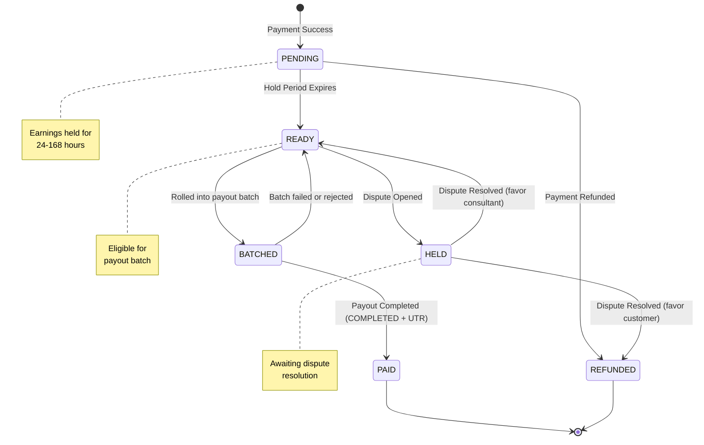
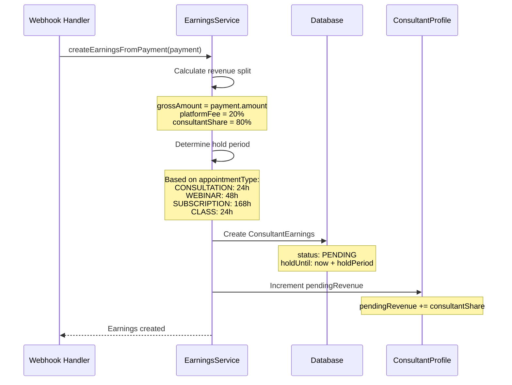
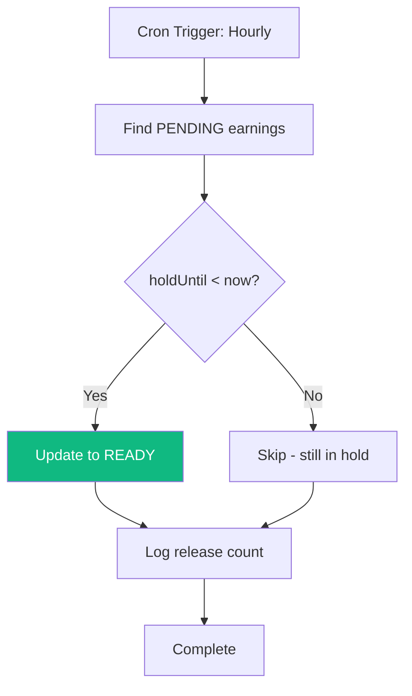
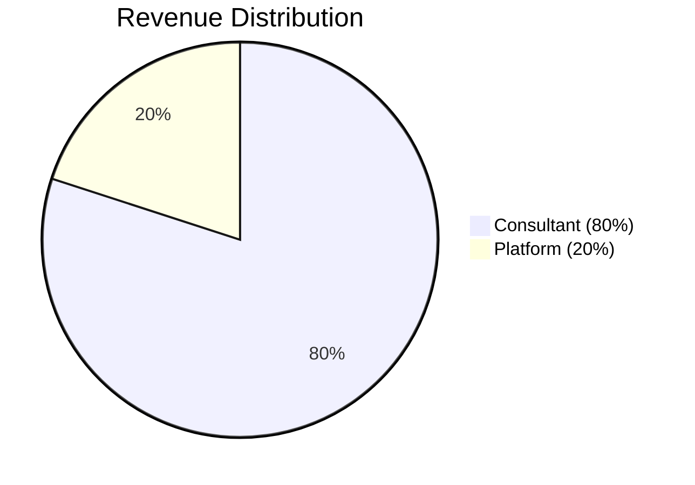
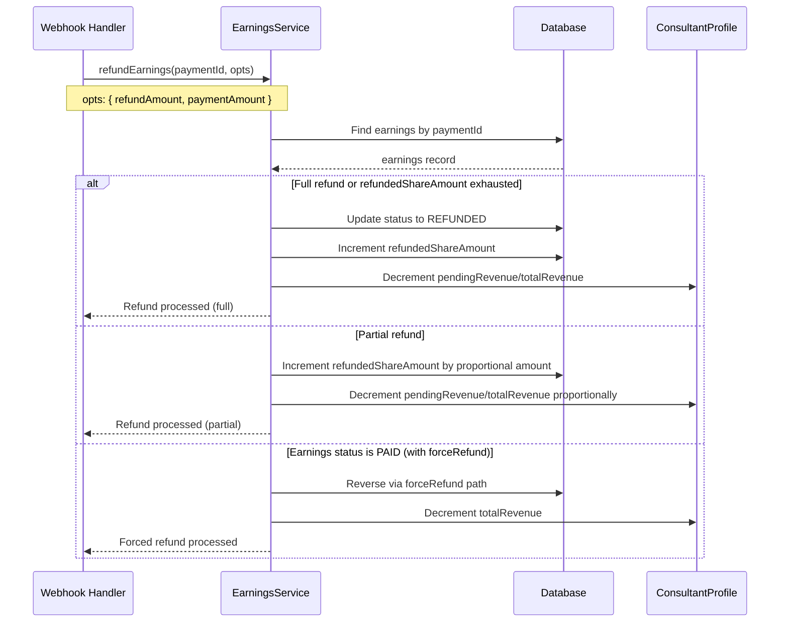
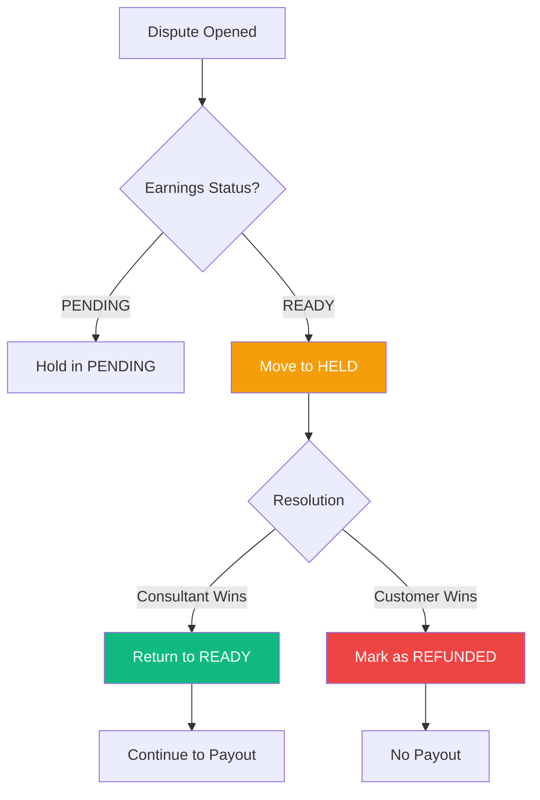

# Earnings Lifecycle

> **Moved (org/B2B side):** The organization-side documentation for earnings now lives in [`docs/enterprise/10-money-and-ledger/06-earnings-lifecycle.md`](../../enterprise/10-money-and-ledger/06-earnings-lifecycle.md) (and the payout batching in [`07-payout-pipeline.md`](../../enterprise/10-money-and-ledger/07-payout-pipeline.md)). This file keeps the consumer-marketplace (B2C) and gateway-generic details only.

> How consultant earnings flow from payment to payout

---

## Earnings Status Flow



---

## Status Definitions

| Status       | Description                             | Next Actions         |
| ------------ | --------------------------------------- | -------------------- |
| **PENDING**  | Earnings created, within hold period    | Wait for hold expiry |
| **READY**    | Hold period passed, eligible for payout | Include in batch     |
| **HELD**     | Frozen due to dispute                   | Await resolution     |
| **BATCHED**  | Rolled into a payout batch, but cash has not left yet | Await payout completion |
| **PAID**     | Successfully paid to consultant (payout reached COMPLETED with a UTR) | Terminal state       |
| **REFUNDED** | Payment was refunded                    | Terminal state       |

---

## Earnings Creation Flow



### Code Example

```typescript
// Payment of ₹1000 for consultation
const payment = {
  amount: 100000, // ₹1000 in paise
  appointmentType: "CONSULTATION",
};

// Earnings calculation
const earnings = {
  grossAmount: 100000,           // ₹1000
  platformFee: 20000,            // ₹200 (20%)
  consultantShare: 80000,        // ₹800 (80%)
  holdUntil: new Date() + 24h,   // 24 hours for consultation
  status: "PENDING",
};
```

---

## Hold Period Release

The `release-earnings.ts` script runs **hourly** via GitHub Actions.



### Query Logic

```typescript
// Find earnings ready to release
const earningsToRelease = await prisma.consultantEarnings.findMany({
  where: {
    status: "PENDING",
    holdUntil: {
      lte: new Date(), // Hold period expired
    },
  },
});

// Update status
await prisma.consultantEarnings.updateMany({
  where: { id: { in: earningIds } },
  data: { status: "READY" },
});
```

---

## Hold Periods by Appointment Type

```mermaid
gantt
    title Hold Period Timeline
    dateFormat HH:mm
    axisFormat %H:%M

    section Consultation
    Hold Period (24h)    :active, cons, 00:00, 24h
    Ready for Payout     :done, cons-ready, after cons, 1h

    section Class
    Hold Period (24h)    :active, class, 00:00, 24h
    Ready for Payout     :done, class-ready, after class, 1h

    section Webinar
    Hold Period (48h)    :active, web, 00:00, 48h
    Ready for Payout     :done, web-ready, after web, 1h

    section Subscription
    Hold Period (7 days) :active, sub, 00:00, 168h
    Ready for Payout     :done, sub-ready, after sub, 1h
```



| Type             | Hold Period | Rationale                             |
| ---------------- | ----------- | ------------------------------------- |
| **Consultation** | 24 hours    | Short engagement, quick resolution    |
| **Class**        | 24 hours    | Similar to consultation               |
| **Webinar**      | 48 hours    | Allow time for participant feedback   |
| **Subscription** | 7 days      | Longer commitment, higher refund risk |

---

## Multi-Party Revenue Splits (Mar 2026)

For WEBINAR and CLASS payments with collaborators, the `sync-payment-earnings` job and the earnings creation flow now call `calculateRevenueSplit()` to create **multiple** `ConsultantEarnings` records per payment -- one for the owner and one for each collaborator, each with their `role` and `sharePercentage`. This replaces the previous single-earnings-per-payment assumption.

---

## Revenue Split Calculation



### Calculation Formula

```typescript
const PLATFORM_FEE_PERCENTAGE = 20;
const CONSULTANT_SHARE_PERCENTAGE = 80;

function calculateSplit(grossAmount: number) {
  return {
    platformFee: Math.floor((grossAmount * PLATFORM_FEE_PERCENTAGE) / 100),
    consultantShare: Math.floor(
      (grossAmount * CONSULTANT_SHARE_PERCENTAGE) / 100,
    ),
  };
}

// Example: ₹1000 payment
// platformFee = ₹200
// consultantShare = ₹800
```

---

## Refund Handling

When a payment is refunded, the associated earnings are reversed proportionally (partial) or fully.



### Partial Refund Support (Mar 2026)

`refundEarnings()` now accepts `refundAmount`/`paymentAmount` for proportional reversal. A new `refundedShareAmount` field on `ConsultantEarnings` tracks cumulative partial refunds. Earnings auto-transition to `REFUNDED` when `refundedShareAmount >= consultantShare`.

### Refund States

| Original Status | Can Refund? | Action                                             |
| --------------- | ----------- | -------------------------------------------------- |
| PENDING         | Yes         | Proportional or full reversal, may mark REFUNDED   |
| READY           | Yes         | Proportional or full reversal, may mark REFUNDED   |
| HELD            | Yes         | Proportional or full reversal, may mark REFUNDED   |
| PAID            | Yes*        | Via `forceRefund: true` (lost disputes), decrements totalRevenue |
| REFUNDED        | No          | Already refunded                                   |

> *PAID earnings can now be refunded using `forceRefund: true`, used by the lost-dispute handler. This routes through the shared `recordTdsReversal` helper to write a negative `isReversal` `TDSRecord` (capped at the original withholding so a refund-then-chargeback can't double-reverse, #813) and decrements `totalRevenue`.

---

## Dispute Handling

When a dispute is opened, earnings are frozen until resolution.



### Dispute Functions

```typescript
// Freeze earnings on dispute
await holdEarnings(paymentId);
// Status: READY → HELD

// Resolve in consultant's favor
await releaseHeldEarnings(earningsId);
// Status: HELD → READY

// Resolve in customer's favor (standard)
await refundEarnings(paymentId);
// Status: HELD → REFUNDED

// Lost dispute on already-PAID earnings (Mar 2026)
await refundEarnings(paymentId, { forceRefund: true });
// Writes a negative isReversal TDSRecord via recordTdsReversal (capped, #813), decrements totalRevenue
```

---

## Earnings Summary API

Consultants can view their earnings breakdown:

```typescript
interface EarningsSummary {
  totalEarnings: number; // All time
  pendingEarnings: number; // Status: PENDING
  readyForPayout: number; // Status: READY
  heldEarnings: number; // Status: HELD
  paidOutEarnings: number; // Status: PAID
  refundedEarnings: number; // Status: REFUNDED
}
```

### API Endpoint

```
GET /api/consultant/earnings

Response:
{
  "summary": {
    "totalEarnings": 150000,
    "pendingEarnings": 20000,
    "readyForPayout": 50000,
    "heldEarnings": 0,
    "paidOutEarnings": 80000,
    "refundedEarnings": 0
  },
  "earnings": [
    {
      "id": "...",
      "grossAmount": 10000,
      "consultantShare": 8000,
      "status": "READY",
      "holdUntil": "2025-12-27T10:00:00Z",
      "createdAt": "2025-12-26T10:00:00Z"
    }
  ]
}
```

---

## Database Schema

```typescript
model ConsultantEarnings {
  id                   String             @id @default(uuid())
  consultantProfile    ConsultantProfile  @relation(...)
  consultantProfileId  String
  payment              Payment            @relation(...)
  paymentId            String             @unique
  payout               Payout?            @relation(...)
  payoutId             String?

  // Amounts in paise
  grossAmount          Int                // Total payment amount
  platformFee          Int                // 20% platform cut
  consultantShare      Int                // 80% consultant share
  refundedShareAmount  Int  @default(0)   // Cumulative partial refund amount (Mar 2026)

  // Status tracking
  status               EarningStatus      @default(PENDING)
  holdUntil            DateTime           // When PENDING → READY
  paidAt               DateTime?          // When status became PAID

  createdAt            DateTime           @default(now())
  updatedAt            DateTime           @updatedAt
}

enum EarningStatus {
  PENDING   // Within hold period
  READY     // Eligible for payout
  HELD      // Frozen due to dispute
  BATCHED   // Rolled into a payout batch; cash has not been disbursed yet
  PAID      // Payout completed (reached COMPLETED with a UTR)
  REFUNDED  // Payment was refunded
}
```

---

## Next: [03-payout-processing.md](./03-payout-processing.md)
