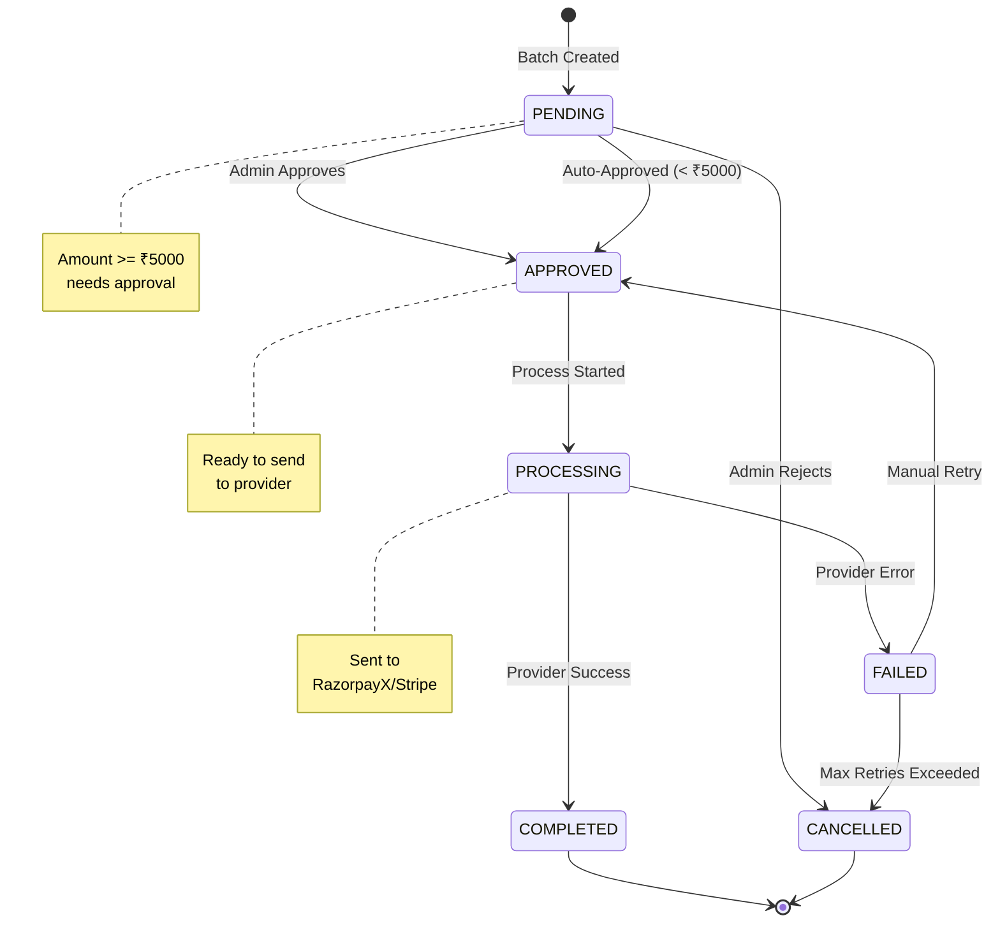
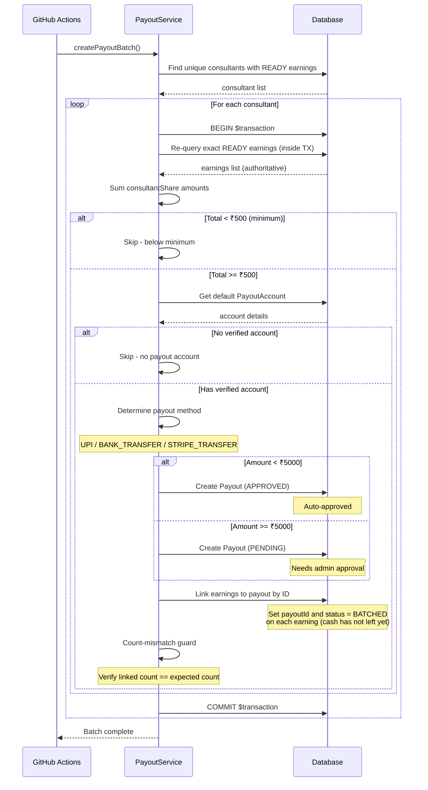
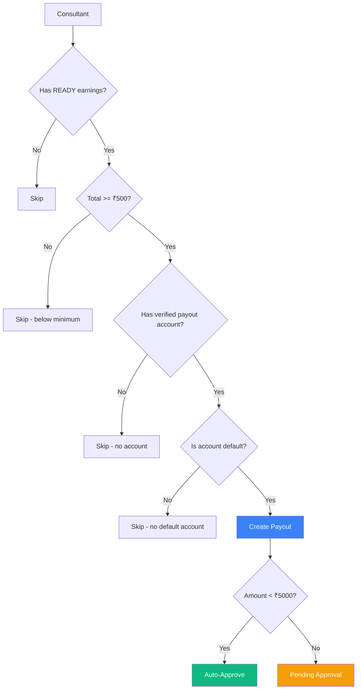
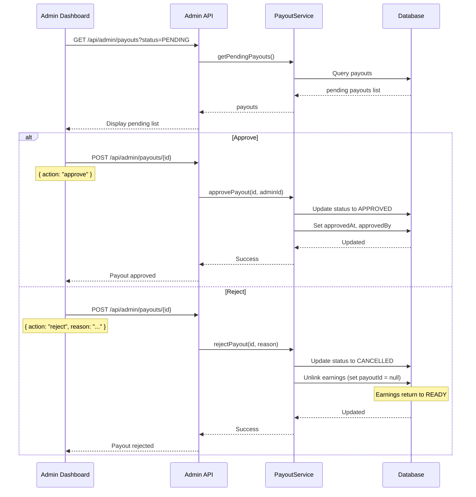
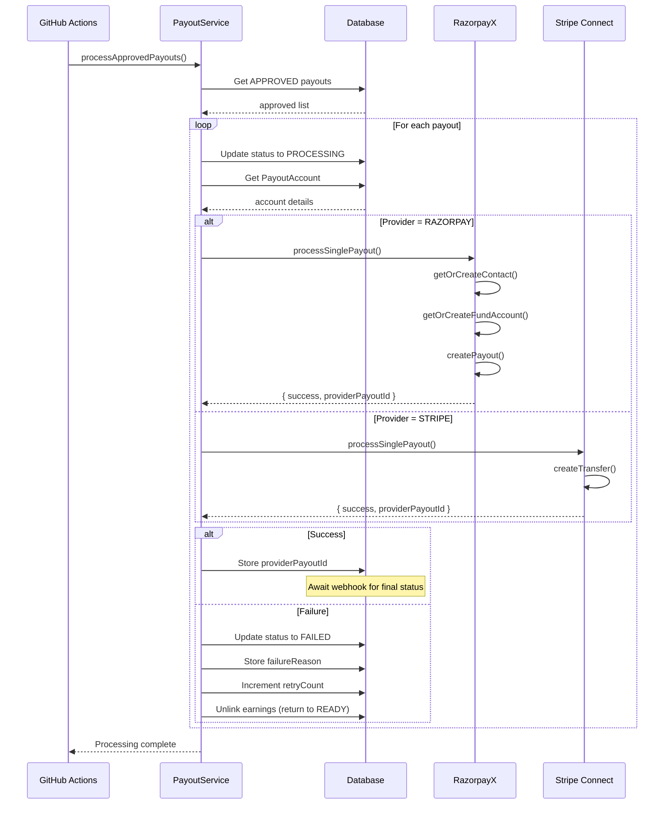
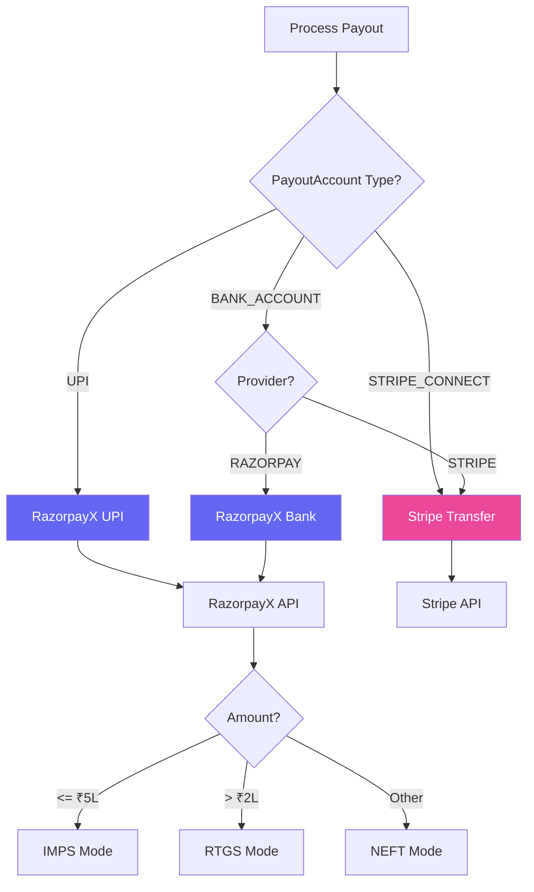
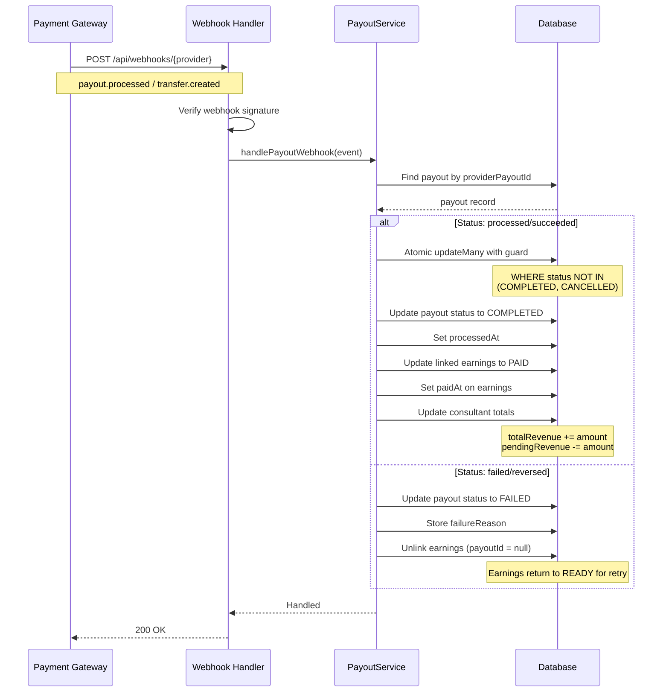
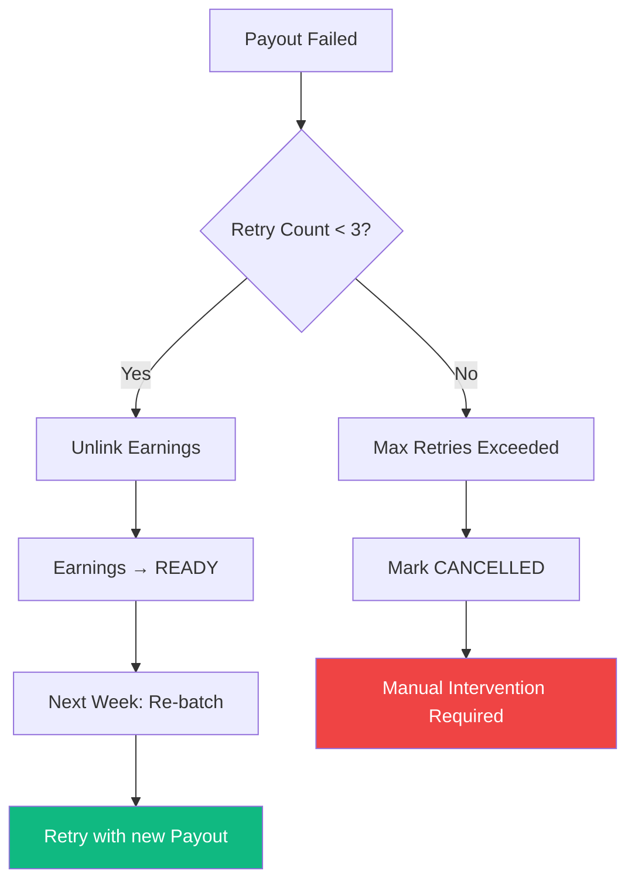

# Payout Processing

> **Moved (org/B2B side):** The organization-side documentation for payouts now lives in [`docs/enterprise/10-money-and-ledger/07-payout-pipeline.md`](../../enterprise/10-money-and-ledger/07-payout-pipeline.md) and [`06-earnings-lifecycle.md`](../../enterprise/10-money-and-ledger/06-earnings-lifecycle.md). This file keeps the consumer-marketplace (B2C) and gateway-generic details only.

> Batch creation, approval workflow, and payment gateway integration

---

## Payout Status Flow



---

## Weekly Batch Creation

The `create-payout-batch.ts` script runs **every Monday at 1:30 AM IST** (Sunday 8:00 PM UTC).



> **Batch Integrity (Mar 2026):** Each consultant's payout is now wrapped in a `$transaction` that re-queries exact READY earnings, sums them, creates the payout, and links earnings by ID while moving them to `BATCHED` (the cash has not left yet, so they are not yet `PAID`) -- all atomically. A count-mismatch guard ensures the number of linked earnings matches expectations, preventing partial batches from concurrent modifications.

### Eligibility Criteria



---

## Admin Approval Workflow



### Approval Thresholds

| Amount Range | Approval                        |
| ------------ | ------------------------------- |
| < ₹5,000     | Auto-approved at batch creation |
| >= ₹5,000    | Requires admin approval         |

---

## Payout Processing

The `process-payouts.ts` script runs **every Monday at 2:30 AM IST** (Monday 9:00 PM UTC).



---

## Provider Routing



### Payout Methods

| Method              | Provider  | Speed     | Limit         |
| ------------------- | --------- | --------- | ------------- |
| **UPI**             | RazorpayX | Instant   | ₹1 Lakh       |
| **IMPS**            | RazorpayX | < 5 min   | ₹5 Lakh       |
| **NEFT**            | RazorpayX | 2-4 hours | Unlimited     |
| **RTGS**            | RazorpayX | 30 min    | ₹2 Lakh+      |
| **Stripe Transfer** | Stripe    | 2-7 days  | Account limit |

---

## Webhook Handling

After sending payout to provider, the final status comes via webhook.



> **Idempotency (Mar 2026):** `handlePayoutWebhook` now uses atomic `updateMany` with a `status: { notIn: [COMPLETED, CANCELLED] }` guard to prevent double-applying revenue on duplicate webhooks. If the payout has already reached a terminal state, the duplicate webhook is safely ignored.

### Webhook Events

| Provider  | Event               | Our Action          |
| --------- | ------------------- | ------------------- |
| RazorpayX | `payout.processed`  | Mark COMPLETED      |
| RazorpayX | `payout.failed`     | Mark FAILED, retry  |
| RazorpayX | `payout.reversed`   | Mark FAILED, refund |
| Stripe    | `transfer.created`  | Mark COMPLETED      |
| Stripe    | `transfer.failed`   | Mark FAILED, retry  |
| Stripe    | `transfer.reversed` | Mark FAILED, refund |

---

## Idempotency

All payout requests use idempotency keys to prevent duplicates.

```mermaid
flowchart TD
    A[Create Payout Request] --> B[Generate Idempotency Key]
    B --> C[payout_{payoutId}]
    C --> D[Send to Provider]
    D --> E{Duplicate Request?}
    E -->|Yes| F[Return Original Response]
    E -->|No| G[Process & Return New Response]

    style C fill:#8b5cf6,color:#fff
```

### Key Format

```typescript
// Idempotency key generation — deterministic, not time-based.
// razorpay-payouts.ts generateIdempotencyKey():
const idempotencyKey = `payout_${payoutId}`;

// RazorpayX: X-Payout-Idempotency header (lib/payments/payouts/razorpay-payouts.ts:328)
// Stripe: Idempotency-Key header
```

> **Note (#771 P1-6):** The key is intentionally deterministic (`payout_<id>`). Using `Date.now()` would generate a new key on every retry — defeating RazorpayX's duplicate-suppression for that `payoutId` and potentially double-disbursing.

---

## Retry Logic

Failed payouts are automatically retried in the next weekly batch.



### Retry Flow

1. **Payout fails** → Status: FAILED
2. **Earnings unlinked** → payoutId set to null
3. **Earnings status** → Remains READY
4. **Next batch** → Earnings included again
5. **New payout created** → Fresh retry

The stuck-payout handler re-arms a payout for retry through a compare-and-set, not a bare update (#1407). `scripts/payouts/handle-stuck-payouts.ts` reads its cohort of `PROCESSING` payouts once and then spends a gateway HTTP round-trip on each one in turn, which leaves a wide window in which a concurrent `process-payouts` run or an inbound payout webhook can move a row that the handler has already read. The reset to `APPROVED` therefore carries the state it expects to find in its `WHERE` clause — `status = PROCESSING` and `providerPayoutId IS NULL` — so a row that something else has advanced in the meantime is no longer matched. When the update affects zero rows the handler counts the payout as skipped and logs that it raced; it neither throws nor retries, because whichever writer moved the row now owns it. Without that guard the handler would stamp a payout back to `APPROVED` after a webhook had already completed it, and the next weekly batch would disburse the same money a second time.

---

## Payout Database Schema

```typescript
model Payout {
  id                   String           @id @default(uuid())
  consultantProfile    ConsultantProfile @relation(...)
  consultantProfileId  String

  // Provider info
  provider             PaymentGateway   // RAZORPAY or STRIPE
  providerPayoutId     String?          @unique
  idempotencyKey       String           @unique

  // Amount
  amount               Int              // In paise
  currency             String           @default("INR")

  // Status tracking
  status               PayoutStatus     @default(PENDING)
  method               PayoutMethod     // UPI, BANK_TRANSFER, STRIPE_TRANSFER

  // Batch info
  batchId              String           // Weekly batch identifier

  // Error handling
  failureReason        String?
  retryCount           Int              @default(0)

  // Timestamps
  processedAt          DateTime?
  approvedAt           DateTime?
  approvedBy           String?          // Admin user ID or "SYSTEM_AUTO_APPROVE"

  // Relations
  earnings             ConsultantEarnings[]

  createdAt            DateTime         @default(now())
  updatedAt            DateTime         @updatedAt
}

enum PayoutStatus {
  PENDING      // Awaiting approval
  APPROVED     // Ready to process
  PROCESSING   // Sent to provider
  COMPLETED    // Successfully delivered
  FAILED       // Provider error
  CANCELLED    // Rejected or cancelled
}

enum PayoutMethod {
  UPI
  BANK_TRANSFER
  STRIPE_TRANSFER
}
```

---

## Next: [04-api-reference.md](./04-api-reference.md)
