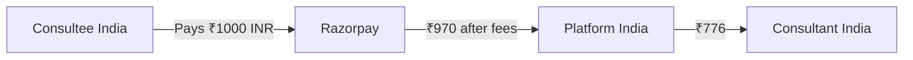
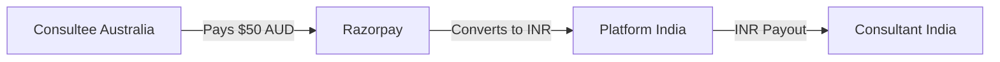
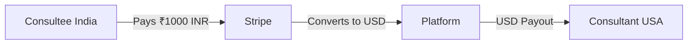
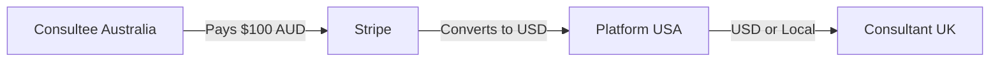

# International Payments Guide

## Overview

This document covers cross-border payment scenarios for Familiarise, where consultants and consultees may be in different countries.

---

## Common Scenarios

### Scenario 1: India Consultant, India Consultee (Domestic)



**Gateway:** Razorpay
**Currency:** INR → INR
**Fees:** 2% + GST (~2.36%)
**Settlement:** T+2 days

---

### Scenario 2: India Consultant, International Consultee



**Gateway:** Razorpay (International)
**Currency:** AUD → INR (auto-converted)
**Fees:** 3% + GST (~3.54%)
**Settlement:** T+2 days in INR

**How Razorpay Handles This:**

1. Customer pays in AUD (or USD, GBP, EUR, etc.)
2. Razorpay converts to INR at market rate
3. Platform receives INR
4. Consultant paid in INR

**Source:** [Razorpay International Payments](https://razorpay.com/accept-international-payments/)

---

### Scenario 3: International Consultant, India Consultee



**Gateway:** Stripe Connect
**Currency:** INR → USD
**Fees:** 2.9% + $0.30 + 1% conversion
**Settlement:** T+2 days to USA bank

**Challenges:**

- Stripe India cannot pay out to international accounts
- Need Stripe US entity OR use Stripe Atlas
- Alternative: Use Wise/PayPal for international transfers

---

### Scenario 4: International Consultant, International Consultee



**Gateway:** Stripe Connect (Global)
**Currency:** AUD → USD → GBP
**Fees:** 2.9% + $0.30 + 1.5% intl + 1% conversion
**Settlement:** T+2 days

---

## Currency Support

### Razorpay (135 Currencies Accepted)

| Currency | Accept Payments | Settle To         |
| -------- | --------------- | ----------------- |
| INR      | Yes             | INR (Indian Bank) |
| USD      | Yes             | INR               |
| EUR      | Yes             | INR               |
| GBP      | Yes             | INR               |
| AUD      | Yes             | INR               |
| SGD      | Yes             | INR               |
| AED      | Yes             | INR               |

**Key Point:** All settlements in INR to Indian bank accounts only.

### Stripe (47+ Countries)

| Country   | Accept | Payout | Currency          |
| --------- | ------ | ------ | ----------------- |
| USA       | Yes    | Yes    | USD               |
| UK        | Yes    | Yes    | GBP               |
| Australia | Yes    | Yes    | AUD               |
| Canada    | Yes    | Yes    | CAD               |
| Germany   | Yes    | Yes    | EUR               |
| Singapore | Yes    | Yes    | SGD               |
| India     | Yes    | **No** | INR (accept only) |

**Key Point:** Stripe India cannot payout internationally. Need separate entities.

---

## Cross-Border Fee Breakdown

### Example: Australian Consultee, Indian Consultant

**Payment:** $100 AUD

| Step                    | Amount      | Fee       | Notes                  |
| ----------------------- | ----------- | --------- | ---------------------- |
| Customer Pays           | $100 AUD    | -         | -                      |
| Currency Conversion     | ~₹5,500 INR | 1% markup | Market rate varies     |
| Gateway Fee             | ₹5,335      | 3% + GST  | Razorpay international |
| Platform Commission     | ₹1,067      | 20%       | Platform revenue       |
| **Consultant Receives** | **₹4,268**  | -         | Final payout           |

**Effective Rate:** Customer pays $100, consultant gets ₹4,268 (~$78 equivalent)

---

### Example: Indian Consultee, US Consultant (via Stripe)

**Payment:** ₹5,000 INR

| Step                    | Amount      | Fee           | Notes            |
| ----------------------- | ----------- | ------------- | ---------------- |
| Customer Pays           | ₹5,000 INR  | -             | -                |
| Gateway Fee             | ₹4,855      | 2.9%          | Stripe           |
| Currency Conversion     | $58 USD     | 1%            | INR to USD       |
| Platform Commission     | $11.60      | 20%           | Platform revenue |
| Connect Fee             | $0.40       | 0.25% + $0.25 | Stripe Connect   |
| **Consultant Receives** | **$46 USD** | -             | Final payout     |

---

## Tax Implications

### For Indian Platform (Familiarise)

| Tax             | Rate  | Applies To                                                               |
| --------------- | ----- | ------------------------------------------------------------------------ |
| GST on Services | 18%   | Platform commission (B2B)                                                |
| TDS on Payments | 0.1%  | Section 194-O (e-commerce operator), Indian consultants; ₹50K FY threshold; 5% if no PAN (lib/compliance/tds.ts) |
| Equalization Levy | N/A | Abolished 1 Apr 2025 (Finance Act 2025); do not implement               |

### For Indian Consultants

| Tax        | Rate      | Notes                          |
| ---------- | --------- | ------------------------------ |
| Income Tax | Slab rate | On total earnings              |
| GST        | 18%       | If turnover >₹20 lakhs         |
| TDS Credit | -         | Claim TDS deducted by platform |

### For International Consultants

| Country   | Tax Form        | Platform Responsibility     |
| --------- | --------------- | --------------------------- |
| USA       | 1099-NEC        | Issue if >$600/year         |
| UK        | Self-assessment | Consultant's responsibility |
| Australia | ABN required    | Consultant's responsibility |
| EU        | VAT             | Reverse charge mechanism    |

---

## Regulatory Compliance

### RBI Guidelines (India)

1. **FEMA Compliance:** International receipts must comply with Foreign Exchange Management Act
2. **Purpose Codes:** Use correct purpose code for service exports
3. **Documentation:**
   - FIRC (Foreign Inward Remittance Certificate) for >$25,000
   - Invoice for each transaction
   - Service agreement

### Razorpay Auto-Compliance

- Auto-generates FIRA (Foreign Inward Remittance Advice)
- Auto-generates eFIRC for eligible transactions
- Handles RBI purpose code mapping

**Source:** [Razorpay International Docs](https://razorpay.com/docs/payments/international-payments/)

---

## Recommended Setup by Use Case

### Use Case 1: India-First Platform (Current)

```
Payment Collection: Razorpay
Payouts: Razorpay Route (India only)
International Consultees: Accept via Razorpay (converts to INR)
International Consultants: NOT SUPPORTED initially
```

### Use Case 2: India + International (Future)

```
Indian Payments: Razorpay
International Payments: Stripe
Indian Payouts: Razorpay Route
International Payouts: Stripe Connect
```

### Use Case 3: Fully Global (Scale)

```
Primary: Stripe (global)
India Supplement: Razorpay (better UPI/local methods)
Payouts: Stripe Connect (118+ countries)
India Payouts: Razorpay Route (better rates)
```

---

## Currency Display & Pricing

### Option 1: Single Currency (Simple)

All prices in INR, international users pay in INR equivalent.

### Option 2: Multi-Currency Display (Better UX)

Detect user location, show local currency. Actual charge in user's currency, settles in INR.

### Option 3: Consultant-Set Currency (Complex)

Each consultant sets their own currency. High complexity (multi-currency accounting).

---

## Implementation Priority

| Phase       | Scope                        | Gateway           | Payouts              |
| ----------- | ---------------------------- | ----------------- | -------------------- |
| **Phase 1** | India only                   | Razorpay          | Razorpay Route       |
| **Phase 2** | India + Accept International | Razorpay          | Razorpay Route (INR) |
| **Phase 3** | Global Accept                | Razorpay + Stripe | Route + Connect      |
| **Phase 4** | Global Payouts               | Stripe Primary    | Stripe Connect       |

---

## Related Documents

- [01-architecture.md](./01-architecture.md) - Payout system design
- [02-earnings-lifecycle.md](./02-earnings-lifecycle.md) - How earnings flow through the system
- [06-configuration.md](./06-configuration.md) - Hold periods and payout thresholds
