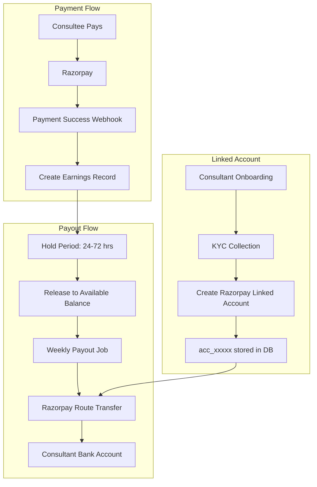

# Technical Payout Implementation Guide

> 🟡 **Warning — this file describes Razorpay Route, not the live pipeline (no issue filed yet).** This guide describes Razorpay **Route** (Linked Accounts + Transfers), whereas the production payout code path uses **RazorpayX Payouts** (Contacts → Fund Accounts → Payouts) in [`lib/payments/payouts/razorpay-payouts.ts`](../../../lib/payments/payouts/razorpay-payouts.ts). The two products have different entities, webhooks, and state machines, so this file must not be used as a reference for the live pipeline. For the org/B2B side see [`docs/enterprise/10-money-and-ledger/07-payout-pipeline.md`](../../enterprise/10-money-and-ledger/07-payout-pipeline.md) and [`06-earnings-lifecycle.md`](../../enterprise/10-money-and-ledger/06-earnings-lifecycle.md).

## Overview

This document provides the technical implementation details for automating consultant payouts using Razorpay Route. It builds upon the existing payment infrastructure in the codebase.

**Current State**: No payout system implemented - manual transfers required
**Target State**: Automated payouts via Razorpay Route

---

## Architecture Overview



---

## File Structure

```
lib/
|-- payments/
|   |-- core/
|   |   |-- razorpay.ts              # Existing - Add Route methods
|   |   +-- types.ts                 # Existing - Add payout types
|   |-- payouts/
|   |   |-- index.ts                 # NEW - Export all payout functions
|   |   |-- earnings-service.ts      # NEW - Create/manage earnings
|   |   |-- payout-service.ts        # NEW - Process payouts
|   |   |-- balance-service.ts       # NEW - Balance calculations
|   |   +-- razorpay/
|   |       |-- linked-accounts.ts   # NEW - Linked account CRUD
|   |       |-- transfers.ts         # NEW - Transfer execution
|   |       +-- webhooks.ts          # NEW - Payout webhook handlers
|   +-- webhooks/
|       +-- handlers.ts              # MODIFY - Add earnings creation
|-- prisma/
|   +-- schema.prisma                # MODIFY - Add payout models
+-- jobs/
    |-- release-earnings-hold.ts     # NEW - Release held earnings
    +-- process-weekly-payouts.ts    # NEW - Batch payout job
```

---

## Database Schema

### New Models

Add to `prisma/schema.prisma`:

```prisma
// ============================================
// PAYOUT SYSTEM MODELS
// ============================================

/// Tracks consultant earnings from completed transactions
model ConsultantEarnings {
  id                  String               @id @default(uuid())

  // Linked to consultant
  consultantProfile   ConsultantProfile    @relation(fields: [consultantProfileId], references: [id], onDelete: Cascade)
  consultantProfileId String

  // Linked to payment
  payment             Payment              @relation(fields: [paymentId], references: [id], onDelete: Cascade)
  paymentId           String               @unique

  // Amounts (in smallest currency unit - paise for INR)
  grossAmount         Int                  // Total payment amount
  gatewayFee          Int                  // Payment gateway fee deducted
  platformFee         Int                  // Platform commission (20%)
  netAmount           Int                  // Amount owed to consultant
  currency            String               @default("INR")

  // Status tracking
  status              EarningStatus        @default(PENDING)
  holdUntil           DateTime?            // Hold until this time (dispute protection)

  // Payout tracking
  payout              Payout?              @relation(fields: [payoutId], references: [id])
  payoutId            String?

  createdAt           DateTime             @default(now())
  updatedAt           DateTime             @updatedAt

  @@index([consultantProfileId, status])
  @@index([payoutId])
  @@index([holdUntil, status])
}

enum EarningStatus {
  PENDING          // Payment received, in hold period
  AVAILABLE        // Ready for payout (hold released)
  PROCESSING       // Included in a payout batch
  PAID             // Successfully paid out
  DISPUTED         // Under dispute
  REFUNDED         // Refunded to consultee
}

/// Payout request/batch to consultant
model Payout {
  id                  String               @id @default(uuid())

  // Linked to consultant
  consultantProfile   ConsultantProfile    @relation(fields: [consultantProfileId], references: [id], onDelete: Cascade)
  consultantProfileId String

  // Amounts
  amount              Int                  // Total payout amount (paise)
  currency            String               @default("INR")

  // Gateway details
  gateway             PayoutGateway
  gatewayPayoutId     String?              @unique // External transfer ID (trf_xxxxx)
  gatewayAccountId    String?              // Linked account ID (acc_xxxxx)

  // Status
  status              PayoutStatus         @default(PENDING)
  failureReason       String?

  // Timing
  requestedAt         DateTime             @default(now())
  processedAt         DateTime?            // When transfer initiated
  settledAt           DateTime?            // When funds hit bank (T+2)

  // Related earnings
  earnings            ConsultantEarnings[]

  createdAt           DateTime             @default(now())
  updatedAt           DateTime             @updatedAt

  @@index([consultantProfileId, status])
  @@index([gateway, gatewayPayoutId])
  @@index([status, requestedAt])
}

enum PayoutGateway {
  RAZORPAY_ROUTE      // India payouts via Razorpay Route
  STRIPE_CONNECT      // International payouts (future)
  BANK_TRANSFER       // Manual/fallback
}

enum PayoutStatus {
  PENDING          // Requested but not processed
  PROCESSING       // Being processed by gateway
  SUCCEEDED        // Successfully transferred
  FAILED           // Transfer failed
  CANCELLED        // Cancelled before processing
  REVERSED         // Reversed after success
}

/// KYC and bank details for payouts
/// Actual bank details stored with Razorpay/Stripe, not locally
model LinkedAccount {
  id                  String               @id @default(uuid())

  // Linked to consultant
  consultantProfile   ConsultantProfile    @relation(fields: [consultantProfileId], references: [id], onDelete: Cascade)
  consultantProfileId String               @unique

  // Gateway account IDs (we store IDs, not actual bank details)
  razorpayAccountId   String?              @unique // acc_xxxxx
  stripeAccountId     String?              @unique // acct_xxxxx

  // Status
  razorpayKycStatus   KycStatus?
  stripeKycStatus     KycStatus?
  isActive            Boolean              @default(false)

  // Metadata (masked for display)
  displayName         String?              // "HDFC ****1234"
  lastPayoutAt        DateTime?

  createdAt           DateTime             @default(now())
  updatedAt           DateTime             @updatedAt

  @@index([razorpayAccountId])
  @@index([stripeAccountId])
  @@index([isActive])
}

enum KycStatus {
  NOT_STARTED
  PENDING
  UNDER_REVIEW
  VERIFIED
  REJECTED
  NEEDS_ATTENTION
}
```

### Update Existing Models

```prisma
// Add to ConsultantProfile model
model ConsultantProfile {
  // ... existing fields ...

  // Payout relations - ADD THESE
  earnings         ConsultantEarnings[]
  payouts          Payout[]
  linkedAccount    LinkedAccount?

  // Cached balance (updated via triggers/jobs) - ADD THESE
  availableBalance Int @default(0)  // Ready for payout (paise)
  pendingBalance   Int @default(0)  // In hold period (paise)
}

// Add to Payment model
model Payment {
  // ... existing fields ...

  // Earnings relation - ADD THIS
  earnings         ConsultantEarnings?
}
```

---

## Core Services

### 1. Earnings Service

```typescript
// lib/payments/payouts/earnings-service.ts

import { prisma } from "@/lib/prisma";
import { Payment, EarningStatus } from "@prisma/client";

const PLATFORM_COMMISSION_RATE = 0.2; // 20%
const GATEWAY_FEE_RATE = 0.0236; // 2.36% (2% + 18% GST)

interface CreateEarningsParams {
  payment: Payment;
  consultantProfileId: string;
}

/**
 * Create an earnings record when a payment succeeds.
 * Called from payment webhook handler.
 */
export async function createEarningsRecord({
  payment,
  consultantProfileId,
}: CreateEarningsParams) {
  const grossAmount = payment.amount;
  const gatewayFee = Math.round(grossAmount * GATEWAY_FEE_RATE);
  const netAfterGateway = grossAmount - gatewayFee;
  const platformFee = Math.round(netAfterGateway * PLATFORM_COMMISSION_RATE);
  const netAmount = netAfterGateway - platformFee;

  // Determine hold period based on appointment type
  const holdHours = await getHoldPeriodHours(payment.appointmentId);
  const holdUntil = new Date(Date.now() + holdHours * 60 * 60 * 1000);

  const earnings = await prisma.$transaction(async (tx) => {
    // Create earnings record
    const earning = await tx.consultantEarnings.create({
      data: {
        consultantProfileId,
        paymentId: payment.id,
        grossAmount,
        gatewayFee,
        platformFee,
        netAmount,
        currency: payment.currency,
        status: EarningStatus.PENDING,
        holdUntil,
      },
    });

    // Update consultant's pending balance
    await tx.consultantProfile.update({
      where: { id: consultantProfileId },
      data: {
        pendingBalance: { increment: netAmount },
      },
    });

    return earning;
  });

  console.log(
    `Created earnings record: ${earnings.id} for ${netAmount / 100} INR`,
  );
  return earnings;
}

/**
 * Get hold period in hours based on appointment type.
 */
async function getHoldPeriodHours(
  appointmentId: string | null,
): Promise<number> {
  if (!appointmentId) return 24; // Default 24 hours

  const appointment = await prisma.appointment.findUnique({
    where: { id: appointmentId },
    include: {
      consultation: true,
      subscription: true,
      webinar: true,
      class: true,
    },
  });

  if (!appointment) return 24;

  // Different hold periods per type
  if (appointment.consultation) return 24; // 1 day
  if (appointment.subscription) return 168; // 7 days
  if (appointment.webinar) return 48; // 2 days (after event)
  if (appointment.class) return 24; // 1 day per session

  return 24;
}
```

### 2. Linked Account Service

```typescript
// lib/payments/payouts/razorpay/linked-accounts.ts

import Razorpay from "razorpay";
import { prisma } from "@/lib/prisma";
import { KycStatus } from "@prisma/client";
import { PaymentError } from "@/lib/payments/core/types";

// Initialize Razorpay client
const razorpay = new Razorpay({
  key_id: process.env.RAZORPAY_KEY_ID!,
  key_secret: process.env.RAZORPAY_SECRET!,
});

interface CreateLinkedAccountParams {
  consultantProfileId: string;
  email: string;
  phone: string;
  legalName: string;
  businessType: "individual" | "registered_business";
  pan: string;
  gst?: string;
  bankAccount: {
    accountNumber: string;
    ifscCode: string;
    beneficiaryName: string;
    accountType: "savings" | "current";
  };
  address: {
    street: string;
    city: string;
    state: string;
    postalCode: number;
  };
}

/**
 * Create a Razorpay linked account for a consultant.
 * This is called during consultant KYC onboarding.
 *
 * @see https://razorpay.com/docs/payments/route/linked-account/
 */
export async function createRazorpayLinkedAccount(
  params: CreateLinkedAccountParams,
) {
  try {
    // Create account with Razorpay
    const account = await razorpay.accounts.create({
      email: params.email,
      phone: params.phone,
      legal_business_name: params.legalName,
      business_type: params.businessType,
      contact_name: params.legalName,
      profile: {
        category: "education",
        subcategory: "tutoring_services",
        addresses: {
          registered: {
            street1: params.address.street,
            city: params.address.city,
            state: params.address.state,
            postal_code: params.address.postalCode,
            country: "IN",
          },
        },
      },
      legal_info: {
        pan: params.pan,
        gst: params.gst,
      },
      bank_account: {
        beneficiary_name: params.bankAccount.beneficiaryName,
        account_number: params.bankAccount.accountNumber,
        account_type: params.bankAccount.accountType,
        ifsc_code: params.bankAccount.ifscCode,
      },
    });

    // Store in database (only IDs, not actual bank details)
    const linkedAccount = await prisma.linkedAccount.upsert({
      where: { consultantProfileId: params.consultantProfileId },
      update: {
        razorpayAccountId: account.id,
        razorpayKycStatus: mapRazorpayStatus(account.status),
        displayName: maskBankAccount(
          params.bankAccount.accountNumber,
          params.bankAccount.ifscCode,
        ),
        isActive: account.status === "activated",
      },
      create: {
        consultantProfileId: params.consultantProfileId,
        razorpayAccountId: account.id,
        razorpayKycStatus: mapRazorpayStatus(account.status),
        displayName: maskBankAccount(
          params.bankAccount.accountNumber,
          params.bankAccount.ifscCode,
        ),
        isActive: account.status === "activated",
      },
    });

    console.log(`Created Razorpay linked account: ${account.id}`);
    return linkedAccount;
  } catch (error) {
    console.error("Failed to create linked account:", error);
    throw new PaymentError(
      "Failed to create payout account",
      "LINKED_ACCOUNT_CREATION_FAILED",
      "RAZORPAY",
      error,
    );
  }
}

// Helper functions
function mapRazorpayStatus(status: string): KycStatus {
  const statusMap: Record<string, KycStatus> = {
    created: KycStatus.PENDING,
    activated: KycStatus.VERIFIED,
    suspended: KycStatus.NEEDS_ATTENTION,
    rejected: KycStatus.REJECTED,
    under_review: KycStatus.UNDER_REVIEW,
  };
  return statusMap[status] || KycStatus.PENDING;
}

function maskBankAccount(accountNumber: string, ifsc: string): string {
  const bankCode = ifsc.substring(0, 4);
  const lastFour = accountNumber.slice(-4);
  return `${bankCode} ****${lastFour}`;
}
```

### 3. Transfer Service

```typescript
// lib/payments/payouts/razorpay/transfers.ts

import Razorpay from "razorpay";
import { prisma } from "@/lib/prisma";
import { PayoutStatus, PayoutGateway, EarningStatus } from "@prisma/client";
import { PaymentError } from "@/lib/payments/core/types";
import { withPaymentTransaction } from "@/lib/payments/core/transactions";

const razorpay = new Razorpay({
  key_id: process.env.RAZORPAY_KEY_ID!,
  key_secret: process.env.RAZORPAY_SECRET!,
});

const MINIMUM_PAYOUT_AMOUNT = 50000; // 500 INR in paise

interface ProcessPayoutParams {
  consultantProfileId: string;
  earningIds: string[];
}

/**
 * Process a payout to consultant via Razorpay Route.
 *
 * @see https://razorpay.com/docs/payments/route/apis/#transfers
 */
export async function processRazorpayPayout({
  consultantProfileId,
  earningIds,
}: ProcessPayoutParams) {
  // Get linked account
  const linkedAccount = await prisma.linkedAccount.findUnique({
    where: { consultantProfileId },
  });

  if (!linkedAccount?.razorpayAccountId || !linkedAccount.isActive) {
    throw new PaymentError(
      "No active Razorpay linked account found",
      "NO_LINKED_ACCOUNT",
      "RAZORPAY",
    );
  }

  // Get earnings to payout
  const earnings = await prisma.consultantEarnings.findMany({
    where: {
      id: { in: earningIds },
      consultantProfileId,
      status: EarningStatus.AVAILABLE,
    },
  });

  if (earnings.length === 0) {
    throw new PaymentError(
      "No available earnings to payout",
      "NO_AVAILABLE_EARNINGS",
      "RAZORPAY",
    );
  }

  const totalAmount = earnings.reduce((sum, e) => sum + e.netAmount, 0);

  if (totalAmount < MINIMUM_PAYOUT_AMOUNT) {
    throw new PaymentError(
      `Minimum payout amount is ${MINIMUM_PAYOUT_AMOUNT / 100} INR`,
      "BELOW_MINIMUM_PAYOUT",
      "RAZORPAY",
    );
  }

  // Use transaction for atomicity
  return withPaymentTransaction(async (tx) => {
    // Create payout record
    const payout = await tx.payout.create({
      data: {
        consultantProfileId,
        amount: totalAmount,
        currency: "INR",
        gateway: PayoutGateway.RAZORPAY_ROUTE,
        gatewayAccountId: linkedAccount.razorpayAccountId,
        status: PayoutStatus.PROCESSING,
      },
    });

    try {
      // Execute transfer via Razorpay Route
      const transfer = await razorpay.transfers.create({
        account: linkedAccount.razorpayAccountId!,
        amount: totalAmount,
        currency: "INR",
        notes: {
          payout_id: payout.id,
          consultant_id: consultantProfileId,
          earnings_count: earnings.length.toString(),
        },
      });

      // Update payout with gateway ID
      await tx.payout.update({
        where: { id: payout.id },
        data: {
          gatewayPayoutId: transfer.id,
          processedAt: new Date(),
        },
      });

      // Update earnings status
      await tx.consultantEarnings.updateMany({
        where: { id: { in: earningIds } },
        data: {
          status: EarningStatus.PROCESSING,
          payoutId: payout.id,
        },
      });

      // Decrement available balance
      await tx.consultantProfile.update({
        where: { id: consultantProfileId },
        data: {
          availableBalance: { decrement: totalAmount },
        },
      });

      console.log(
        `Payout initiated: ${payout.id} for ${totalAmount / 100} INR`,
      );
      return { payout, transfer };
    } catch (error) {
      // Mark payout as failed
      await tx.payout.update({
        where: { id: payout.id },
        data: {
          status: PayoutStatus.FAILED,
          failureReason:
            error instanceof Error ? error.message : "Unknown error",
        },
      });
      throw error;
    }
  });
}
```

### 4. Payout Webhook Handler

```typescript
// lib/payments/payouts/razorpay/webhooks.ts

import { prisma } from "@/lib/prisma";
import { PayoutStatus, EarningStatus } from "@prisma/client";

interface RazorpayTransferEvent {
  event: string;
  payload: {
    transfer: {
      entity: {
        id: string;
        status: string;
        settlement_status?: string;
        settled_at?: number;
        failure_reason?: string;
      };
    };
  };
}

/**
 * Handle Razorpay transfer webhook events.
 *
 * Events:
 * - transfer.processed: Transfer initiated
 * - transfer.settled: Funds hit bank account
 * - transfer.failed: Transfer failed
 * - transfer.reversed: Settlement reversed
 *
 * @see https://razorpay.com/docs/payments/route/webhooks/
 */
export async function handlePayoutWebhook(event: RazorpayTransferEvent) {
  const transfer = event.payload.transfer.entity;

  // Find payout by gateway ID
  const payout = await prisma.payout.findUnique({
    where: { gatewayPayoutId: transfer.id },
    include: { earnings: true },
  });

  if (!payout) {
    console.warn(`Payout not found for transfer: ${transfer.id}`);
    return;
  }

  switch (event.event) {
    case "transfer.processed":
      await handleTransferProcessed(payout);
      break;

    case "transfer.settled":
      await handleTransferSettled(payout, transfer.settled_at);
      break;

    case "transfer.failed":
      await handleTransferFailed(payout, transfer.failure_reason);
      break;

    case "transfer.reversed":
      await handleTransferReversed(payout);
      break;

    default:
      console.log(`Unhandled transfer event: ${event.event}`);
  }
}

async function handleTransferProcessed(payout: any) {
  // Idempotency guard (Mar 2026): Use updateMany with status guard
  // to prevent double-applying revenue on duplicate webhooks
  const result = await prisma.payout.updateMany({
    where: {
      id: payout.id,
      status: { notIn: [PayoutStatus.SUCCEEDED, PayoutStatus.CANCELLED] },
    },
    data: { status: PayoutStatus.SUCCEEDED },
  });

  if (result.count === 0) {
    console.log(`Payout ${payout.id} already in terminal state, skipping`);
    return;
  }

  await prisma.$transaction([
    prisma.consultantEarnings.updateMany({
      where: { payoutId: payout.id },
      data: { status: EarningStatus.PAID },
    }),
    prisma.linkedAccount.update({
      where: { consultantProfileId: payout.consultantProfileId },
      data: { lastPayoutAt: new Date() },
    }),
  ]);
  console.log(`Payout ${payout.id} processed successfully`);
}

async function handleTransferSettled(payout: any, settledAt?: number) {
  await prisma.payout.update({
    where: { id: payout.id },
    data: {
      settledAt: settledAt ? new Date(settledAt * 1000) : new Date(),
    },
  });
  console.log(`Payout ${payout.id} settled to bank`);
}

async function handleTransferFailed(payout: any, reason?: string) {
  const refundAmount = payout.amount;

  await prisma.$transaction([
    prisma.payout.update({
      where: { id: payout.id },
      data: {
        status: PayoutStatus.FAILED,
        failureReason: reason || "Transfer failed",
      },
    }),
    // Return earnings to available status
    prisma.consultantEarnings.updateMany({
      where: { payoutId: payout.id },
      data: {
        status: EarningStatus.AVAILABLE,
        payoutId: null,
      },
    }),
    // Restore available balance
    prisma.consultantProfile.update({
      where: { id: payout.consultantProfileId },
      data: { availableBalance: { increment: refundAmount } },
    }),
  ]);
  console.log(`Payout ${payout.id} failed: ${reason}`);
}

async function handleTransferReversed(payout: any) {
  await prisma.$transaction([
    prisma.payout.update({
      where: { id: payout.id },
      data: { status: PayoutStatus.REVERSED },
    }),
    prisma.consultantEarnings.updateMany({
      where: { payoutId: payout.id },
      data: {
        status: EarningStatus.AVAILABLE,
        payoutId: null,
      },
    }),
    prisma.consultantProfile.update({
      where: { id: payout.consultantProfileId },
      data: { availableBalance: { increment: payout.amount } },
    }),
  ]);
  console.log(`Payout ${payout.id} reversed`);
}
```

---

## Scheduled Jobs

### 1. Release Earnings Hold

```typescript
// jobs/release-earnings-hold.ts

import { prisma } from "@/lib/prisma";
import { EarningStatus } from "@prisma/client";

/**
 * Release earnings from hold when holdUntil has passed.
 * Run every hour via GitHub Actions.
 */
export async function releaseEarningsFromHold() {
  console.log("Starting earnings release job...");

  const now = new Date();

  const result = await prisma.$transaction(async (tx) => {
    // Find earnings ready to release
    const earningsToRelease = await tx.consultantEarnings.findMany({
      where: {
        status: EarningStatus.PENDING,
        holdUntil: { lte: now },
      },
    });

    if (earningsToRelease.length === 0) {
      console.log("No earnings to release");
      return 0;
    }

    // Group by consultant for balance updates
    const consultantBalances = new Map<string, number>();
    for (const earning of earningsToRelease) {
      const current = consultantBalances.get(earning.consultantProfileId) || 0;
      consultantBalances.set(
        earning.consultantProfileId,
        current + earning.netAmount,
      );
    }

    // Update earnings status
    await tx.consultantEarnings.updateMany({
      where: { id: { in: earningsToRelease.map((e) => e.id) } },
      data: { status: EarningStatus.AVAILABLE },
    });

    // Update consultant balances
    for (const [profileId, amount] of consultantBalances) {
      await tx.consultantProfile.update({
        where: { id: profileId },
        data: {
          pendingBalance: { decrement: amount },
          availableBalance: { increment: amount },
        },
      });
    }

    return earningsToRelease.length;
  });

  console.log(`Released ${result} earnings from hold`);
  return result;
}

// Run if executed directly
if (require.main === module) {
  releaseEarningsFromHold()
    .then(() => process.exit(0))
    .catch((e) => {
      console.error(e);
      process.exit(1);
    });
}
```

### 2. Weekly Payout Job

```typescript
// jobs/process-weekly-payouts.ts

import { prisma } from "@/lib/prisma";
import { EarningStatus } from "@prisma/client";
import { processRazorpayPayout } from "@/lib/payments/payouts/razorpay/transfers";

const MINIMUM_PAYOUT_AMOUNT = 50000; // 500 INR in paise

/**
 * Process weekly payouts for all eligible consultants.
 * Run every Monday at 11 PM IST via GitHub Actions.
 */
export async function processWeeklyPayouts() {
  console.log("Starting weekly payout job...");

  // Find consultants with available balance >= minimum
  const eligibleConsultants = await prisma.consultantProfile.findMany({
    where: {
      availableBalance: { gte: MINIMUM_PAYOUT_AMOUNT },
      linkedAccount: {
        isActive: true,
        razorpayAccountId: { not: null },
      },
    },
    include: {
      linkedAccount: true,
      earnings: {
        where: { status: EarningStatus.AVAILABLE },
      },
    },
  });

  console.log(`Found ${eligibleConsultants.length} eligible consultants`);

  const results = {
    processed: 0,
    failed: 0,
    errors: [] as string[],
  };

  for (const consultant of eligibleConsultants) {
    try {
      const earningIds = consultant.earnings.map((e) => e.id);

      await processRazorpayPayout({
        consultantProfileId: consultant.id,
        earningIds,
      });

      results.processed++;
      console.log(`Processed payout for: ${consultant.id}`);
    } catch (error) {
      results.failed++;
      const message = error instanceof Error ? error.message : "Unknown error";
      results.errors.push(`${consultant.id}: ${message}`);
      console.error(`Failed for ${consultant.id}:`, message);
    }
  }

  console.log(`\nWeekly Payout Summary:`);
  console.log(`  Processed: ${results.processed}`);
  console.log(`  Failed: ${results.failed}`);

  return results;
}

// Run if executed directly
if (require.main === module) {
  processWeeklyPayouts()
    .then(() => process.exit(0))
    .catch((e) => {
      console.error(e);
      process.exit(1);
    });
}
```

---

## GitHub Actions Workflow

```yaml
# .github/workflows/payout-jobs.yml

name: Payout Jobs

on:
  schedule:
    # Release holds: Every hour
    - cron: "0 * * * *"
    # Weekly payouts: Monday 5:30 PM UTC (11 PM IST)
    - cron: "30 17 * * 1"
  workflow_dispatch:
    inputs:
      job:
        description: "Job to run"
        required: true
        type: choice
        options:
          - release-holds
          - weekly-payouts

jobs:
  release-holds:
    if: github.event_name == 'schedule' && github.event.schedule == '0 * * * *' || github.event.inputs.job == 'release-holds'
    runs-on: ubuntu-latest
    steps:
      - uses: actions/checkout@v4
      - uses: actions/setup-node@v4
        with:
          node-version: "20"
          cache: "npm"
      - run: npm ci
      - run: npx prisma generate
      - run: npx tsx jobs/release-earnings-hold.ts
        env:
          DATABASE_URL: ${{ secrets.DATABASE_URL }}

  weekly-payouts:
    if: github.event_name == 'schedule' && github.event.schedule == '30 17 * * 1' || github.event.inputs.job == 'weekly-payouts'
    runs-on: ubuntu-latest
    steps:
      - uses: actions/checkout@v4
      - uses: actions/setup-node@v4
        with:
          node-version: "20"
          cache: "npm"
      - run: npm ci
      - run: npx prisma generate
      - run: npx tsx jobs/process-weekly-payouts.ts
        env:
          DATABASE_URL: ${{ secrets.DATABASE_URL }}
          RAZORPAY_KEY_ID: ${{ secrets.RAZORPAY_KEY_ID }}
          RAZORPAY_SECRET: ${{ secrets.RAZORPAY_SECRET }}
```

---

## Environment Variables

Add to `.env`:

```env
# Existing
RAZORPAY_KEY_ID=
RAZORPAY_SECRET=
RAZORPAY_WEBHOOK_SECRET=

# New for payouts
RAZORPAY_PAYOUT_WEBHOOK_SECRET=      # Separate secret for payout webhooks
MINIMUM_PAYOUT_AMOUNT=50000           # 500 INR in paise
PLATFORM_COMMISSION_RATE=0.20         # 20%
GATEWAY_FEE_RATE=0.0236              # 2.36%
```

---

## Testing Checklist

- [ ] Unit tests for earnings calculation
- [ ] Unit tests for balance updates
- [ ] Integration test: Create linked account in sandbox
- [ ] Integration test: Create transfer in sandbox
- [ ] Webhook verification with sandbox events
- [ ] End-to-end payout flow in staging

---

## Related Documents

- [02-payout-architecture.md](/docs/finances/02-payout-architecture.md) - Architecture overview
- [06-payout-implementation-plan.md](/docs/finances/06-payout-implementation-plan.md) - Implementation phases
- [Razorpay Route Docs](https://razorpay.com/docs/payments/route/) - Official API docs
