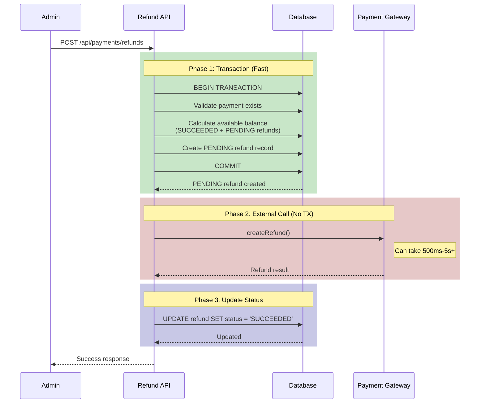

# Refund Processing Flow

> **Moved (org/B2B side):** The organization-side documentation for refunds now lives in [`docs/enterprise/10-money-and-ledger/10-refunds.md`](../../enterprise/10-money-and-ledger/10-refunds.md). This file keeps the consumer-marketplace (B2C) and gateway-generic details only.

## Overview

The refund system uses a **two-phase pattern** to prevent race conditions while avoiding long-running database transactions that can cause connection pool exhaustion.

---

## The Problem

### Naive Approach: External API Inside Transaction

```typescript
// BAD: External API call inside transaction
await prisma.$transaction(async (tx) => {
  const payment = await tx.payment.findUnique({ ... });

  // Validate refund amount...

  // This call can take 500ms-5s+
  const refundResult = await createRefund({ ... });  // PROBLEM!

  await tx.refund.create({ ... });
});
```

**Issues:**

- Database connection held for 500ms-5s+ during API call
- Connection pool exhaustion under load
- Increased deadlock risk

### Naive Fix: External API Outside Transaction (Also Bad!)

```typescript
// BAD: Race condition possible
const payment = await prisma.payment.findUnique({ ... });

// Check: $100 available
if (refundAmount > availableBalance) throw new Error();

// Request A: Passes validation, available = $100
// Request B: Passes validation, available = $100  <- RACE CONDITION!

const refundResult = await createRefund({ ... });  // Both call gateway!

await prisma.refund.create({ ... });  // Double refund recorded!
```

**Issues:**

- Two concurrent requests can both pass validation
- Both trigger refunds at the gateway level
- Results in double refund (money loss!)

---

## The Solution: Two-Phase Pattern



---

## Implementation Details

### Phase 1: Create PENDING Refund (Claims Amount)

```typescript
// app/api/payments/refunds/route.ts

const phase1Result = await prisma.$transaction(async (tx) => {
  // Get payment with refunds inside transaction
  const payment = await tx.payment.findUnique({
    where: { id: paymentId },
    include: { refunds: true },
  });

  // Validate payment exists and is refundable
  if (!payment) throw new Error("Payment not found");
  if (payment.paymentStatus !== "SUCCEEDED") {
    throw new Error("Only successful payments can be refunded");
  }

  // Calculate total including PENDING refunds (race condition prevention!)
  const totalRefundedOrPending = payment.refunds
    .filter((r) => r.status === "SUCCEEDED" || r.status === "PENDING")
    .reduce((sum, r) => sum + r.amount, 0);

  if (totalRefundedOrPending >= payment.amount) {
    throw new Error("Payment has already been fully refunded");
  }

  const refundAmount = amount || payment.amount - totalRefundedOrPending;

  if (refundAmount > payment.amount - totalRefundedOrPending) {
    throw new Error("Refund amount exceeds available balance");
  }

  // Create PENDING refund - this "claims" the amount
  const pendingRefund = await tx.refund.create({
    data: {
      amount: refundAmount,
      currency: payment.currency,
      reason,
      status: "PENDING",
      refundId: `pending_${crypto.randomUUID()}`,
      paymentGateway: payment.paymentGateway,
      metadata: {},
      paymentId: payment.id,
    },
  });

  return { payment, pendingRefund, refundAmount };
});
```

**Key Points:**

- PENDING refunds are counted in available balance
- Transaction is short (no external API calls)
- Creates a "claim" on the refund amount

### Phase 2: Call External Gateway

```typescript
// Outside transaction - can be slow without blocking DB connections
let refundResult;
try {
  refundResult = await createRefund({
    paymentIntentId: payment.paymentIntent,
    amount: refundAmount,
    reason,
  });
} catch (gatewayError) {
  // Gateway failed - mark refund as FAILED
  await prisma.refund.update({
    where: { id: pendingRefund.id },
    data: {
      status: "FAILED",
      metadata: {
        error:
          gatewayError instanceof Error
            ? gatewayError.message
            : "Gateway call failed",
      },
    },
  });
  throw gatewayError;
}
```

**Key Points:**

- No database transaction held during API call
- If gateway fails, PENDING record is updated to FAILED
- Connection pool not affected by slow API calls

### Phase 3: Update Final Status

```typescript
// Simple atomic update
const finalRefund = await prisma.refund.update({
  where: { id: pendingRefund.id },
  data: {
    status: refundResult.status,
    refundId: refundResult.refundId,
    metadata: refundResult.metadata,
  },
});
```

---

## Race Condition Prevention

### Scenario: Two Concurrent Refund Requests

```
Payment: $100 total, $0 refunded

Timeline:
─────────────────────────────────────────────────────────────
T1: Request A starts Phase 1
T2: Request A: Validates balance = $100 available ✓
T3: Request A: Creates PENDING refund for $100
T4: Request A: Commits transaction
─────────────────────────────────────────────────────────────
T5: Request B starts Phase 1
T6: Request B: Validates balance = $0 available (sees PENDING!)
T7: Request B: FAILS validation ✗
─────────────────────────────────────────────────────────────
T8: Request A: Calls Stripe API
T9: Request A: Updates to SUCCEEDED
─────────────────────────────────────────────────────────────
```

**Result:** Only one refund is processed. Request B fails safely.

---

## Error Handling

### Gateway Call Fails

```typescript
try {
  refundResult = await createRefund({ ... });
} catch (gatewayError) {
  // Update PENDING → FAILED
  await prisma.refund.update({
    where: { id: pendingRefund.id },
    data: {
      status: "FAILED",
      metadata: { error: gatewayError.message },
    },
  });
  throw gatewayError;
}
```

### Database Update Fails After Gateway Success

If Phase 3 fails but Phase 2 succeeded:

- Gateway has processed the refund
- Database shows PENDING status
- **Solution:** Reconciliation job to sync with gateway

```sql
-- Find stuck PENDING refunds (potential reconciliation needed)
SELECT * FROM "Refund"
WHERE status = 'PENDING'
  AND "createdAt" < NOW() - INTERVAL '5 minutes';
```

---

## Partial Refunds

The system supports partial refunds:

```typescript
// Full refund (no amount specified)
POST /api/payments/refunds
{ "paymentId": "pay_123" }

// Partial refund
POST /api/payments/refunds
{ "paymentId": "pay_123", "amount": 5000 }  // $50.00
```

Available balance is calculated as:

```
availableBalance = payment.amount - SUM(SUCCEEDED refunds) - SUM(PENDING refunds)
```

---

## Org Audit Log — Wallet & Invoice Rows (#835)

When a refund cascades through a WALLET-funded payment leg, `applyRefundCascade()` writes an **`OrgAuditLog` row** under the `WALLET` category with action `AUDIT_ACTIONS.WALLET.WALLET_REFUND`. Attribution:

- `organizationId = payment.organizationId ?? credit.ownerOrgId` — the billing account's owner org is the fallback when the payment row itself carries no `organizationId` (B2C bookings funded by an org wallet).

Additionally, for payments tagged with an `organizationId`, a **second `OrgAuditLog` row** is written with action `AUDIT_ACTIONS.INVOICE.INVOICE_REFUNDED`. These two rows are **intentional dual-writes** (wallet leg + invoice-level record) — both are inserted within the same Serializable transaction so they either both appear or neither does.

**Code:** `lib/payments/operations/refund.ts` (WALLET\_REFUND row at line ≈ 416, INVOICE\_REFUNDED row at line ≈ 745).

---

### Proportional Earnings Reversal (Mar 2026)

When a partial refund is processed, `refundEarnings()` now accepts `refundAmount` and `paymentAmount` to compute proportional reversal of consultant earnings:

```typescript
// Example: $100 payment, $30 partial refund
refundEarnings(paymentId, {
  refundAmount: 3000,   // $30.00
  paymentAmount: 10000, // $100.00
});

// Result: 30% of consultantShare is reversed
// refundedShareAmount += proportional amount
```

A new `refundedShareAmount` field on `ConsultantEarnings` tracks the cumulative amount reversed across partial refunds. When `refundedShareAmount` reaches the full `consultantShare`, the earnings record auto-transitions to `REFUNDED` status.

| Scenario | Behavior |
| --- | --- |
| Partial refund (e.g., 30%) | Proportional share deducted, earnings remain in current status |
| Full refund (100%) | Earnings auto-transition to REFUNDED |
| Multiple partial refunds totalling 100% | Earnings auto-transition to REFUNDED on final refund |

---

## Code References

| Component               | File                                | Lines                    |
| ----------------------- | ----------------------------------- | ------------------------ |
| Refund API              | `app/api/payments/refunds/route.ts` | POST handler             |
| Two-phase pattern       | `app/api/payments/refunds/route.ts` | Lines 70-175             |
| Gateway abstraction     | `lib/payments/index.ts`             | `createRefund()`         |
| Stripe implementation   | `lib/payments/core/stripe.ts`       | `createStripeRefund()`   |
| Razorpay implementation | `lib/payments/core/razorpay.ts`     | `createRazorpayRefund()` |

---

## Status Flow

```
                    ┌─────────┐
                    │ PENDING │
                    └────┬────┘
                         │
          ┌──────────────┼──────────────┐
          │              │              │
          ▼              ▼              ▼
    ┌───────────┐  ┌───────────┐  ┌───────────┐
    │ SUCCEEDED │  │  FAILED   │  │ CANCELLED │
    └───────────┘  └───────────┘  └───────────┘
```

| Status      | Description                                  |
| ----------- | -------------------------------------------- |
| `PENDING`   | Refund claimed, gateway call in progress     |
| `SUCCEEDED` | Gateway confirmed refund processed           |
| `FAILED`    | Gateway rejected or error occurred           |
| `CANCELLED` | Refund cancelled (rare, manual intervention) |
