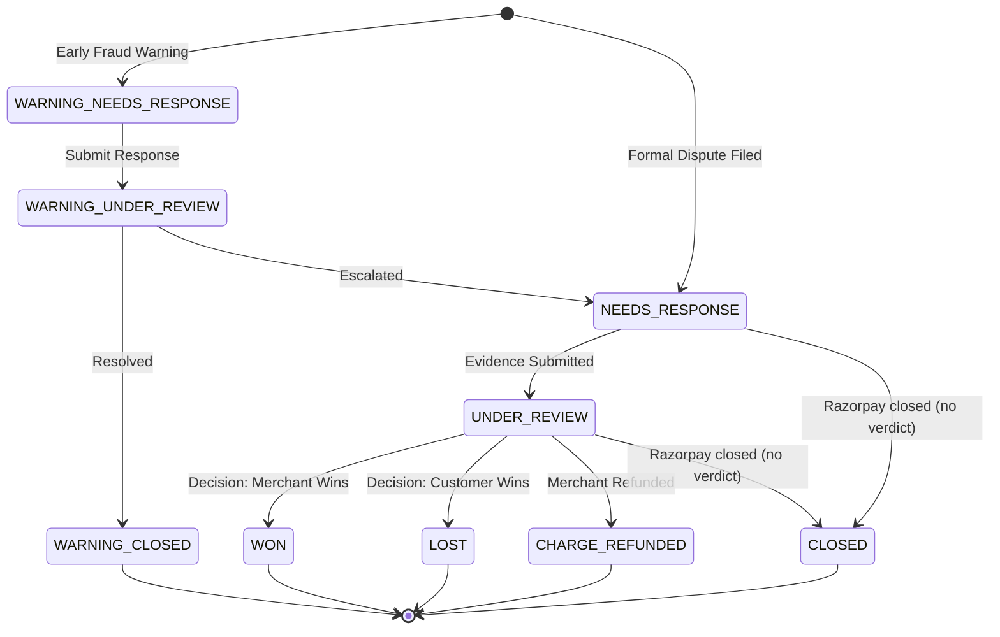
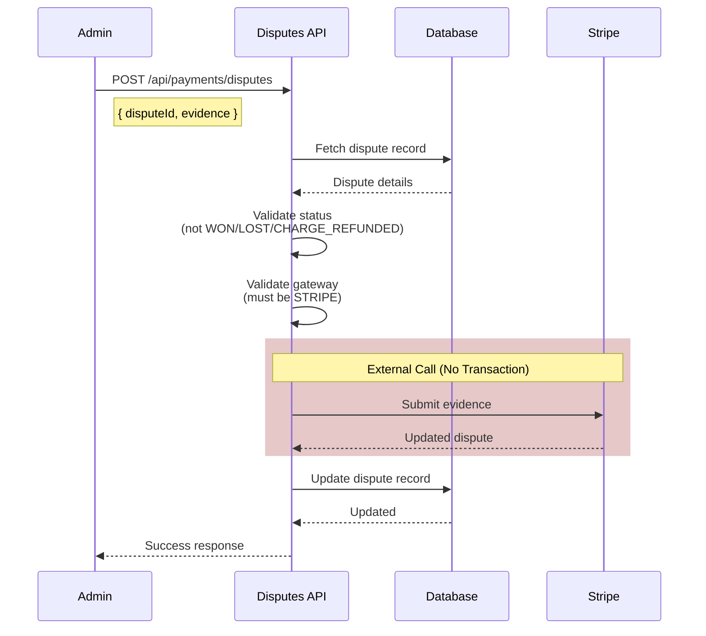

# Dispute Handling Flow

> **Moved (org/B2B side):** The organization-side documentation for disputes now lives in [`docs/enterprise/10-money-and-ledger/11-disputes.md`](../../enterprise/10-money-and-ledger/11-disputes.md). This file keeps the consumer-marketplace (B2C) and gateway-generic details only.

## Overview

Disputes (chargebacks) occur when a customer contacts their bank/card issuer to reverse a payment. The system tracks dispute lifecycle and supports evidence submission for Stripe disputes.

---

## Dispute Lifecycle



---

## Status Definitions

### Early Warning Statuses

| Status                   | Description                      | Action Required         |
| ------------------------ | -------------------------------- | ----------------------- |
| `WARNING_NEEDS_RESPONSE` | Early fraud warning from gateway | Respond within deadline |
| `WARNING_UNDER_REVIEW`   | Response submitted, under review | Wait for decision       |
| `WARNING_CLOSED`         | Early warning resolved           | None (terminal)         |

### Formal Dispute Statuses

| Status            | Description                           | Action Required                 |
| ----------------- | ------------------------------------- | ------------------------------- |
| `NEEDS_RESPONSE`  | Formal dispute filed                  | Submit evidence within deadline |
| `UNDER_REVIEW`    | Evidence submitted, awaiting decision | Wait (7-90 days)                |
| `WON`             | Merchant won the dispute              | None (terminal)                 |
| `LOST`            | Customer won, funds returned          | None (terminal)                 |
| `CHARGE_REFUNDED` | Merchant voluntarily refunded         | None (terminal)                 |
| `CLOSED`          | Razorpay: ended without a verdict (details provided or refund made) | None (terminal) |

---

## Evidence Submission Flow



---

## Implementation Details

### Evidence Submission

```typescript
// app/api/payments/disputes/route.ts

// STEP 1: Get dispute and validate OUTSIDE transaction
const dispute = await prisma.dispute.findUnique({
  where: { id: dbDisputeId },
  include: {
    payment: {
      include: {
        user: { select: { id: true, email: true, name: true } },
      },
    },
  },
});

if (!dispute) {
  return NextResponse.json({ error: "Dispute not found" }, { status: 404 });
}

// Check if dispute can still accept evidence
if (
  dispute.status === "WON" ||
  dispute.status === "LOST" ||
  dispute.status === "CHARGE_REFUNDED"
) {
  return NextResponse.json(
    { error: "Dispute is already resolved and cannot accept new evidence" },
    { status: 400 },
  );
}

// Check gateway support
if (dispute.paymentGateway !== "STRIPE") {
  return NextResponse.json(
    {
      error:
        "Only Stripe supports direct evidence submission. For Razorpay, use the dashboard.",
    },
    { status: 400 },
  );
}

// STEP 2: Submit to Stripe OUTSIDE transaction
const disputeResult = await submitDisputeEvidence(
  { disputeId: dispute.disputeId, evidence },
  dispute.paymentGateway,
);

// STEP 3: Update database
await prisma.dispute.update({
  where: { disputeId: dispute.disputeId },
  data: {
    status: disputeResult.status,
    evidence: disputeResult.evidence,
  },
});
```

**Key Points:**

- No transaction wrapping (unlike refunds)
- External API call is outside any transaction
- Evidence submission doesn't have race condition risks
- The Stripe-only gate in the excerpt above mirrors the current code
  (`app/api/payments/disputes/route.ts`): Razorpay now exposes contest/accept
  APIs (see the Razorpay section below), but our evidence-submission route is
  not wired to them yet — that wiring is tracked in the launch-residuals
  register (#863)

---

## Gateway-Specific Handling

### Stripe

**Full API Support:**

- List disputes: `GET /v1/disputes`
- Submit evidence: `POST /v1/disputes/{id}`
- Close dispute: `POST /v1/disputes/{id}/close`

**Webhook Events:**

- `charge.dispute.created`
- `charge.dispute.updated`
- `charge.dispute.closed`

### Razorpay

**API support (updated 2026-06):**

- Razorpay now exposes dispute APIs: `POST /v1/disputes/:id/accept` and `PATCH /v1/disputes/:id/contest` (this doc previously claimed no API existed)
- Webhook notifications cover created / action_required / under_review / won / lost / closed
- Our reconcile cron still routes Razorpay disputes to manual review — wiring it to the contest/accept APIs is tracked in the launch-residuals register; see `docs/enterprise/10-money-and-ledger/11-disputes.md` §3

**Webhook Events:**

- `payment.dispute.created`
- `payment.dispute.action_required`
- `payment.dispute.under_review`
- `payment.dispute.won`
- `payment.dispute.lost`
- `payment.dispute.closed` (maps to the terminal `CLOSED` status)

---

## Evidence Types

When submitting evidence, provide relevant information:

```typescript
const evidence = {
  // Customer information
  customerName: "John Doe",
  customerEmailAddress: "john@example.com",
  customerPurchaseIp: "192.168.1.1",

  // Cancellation policy (for refund disputes)
  cancellationPolicy: "Full refund within 24 hours...",
  cancellationPolicyDisclosure: "Displayed during checkout",
  cancellationRebuttal: "Customer did not cancel within policy period",

  // Duplicate charge disputes
  duplicateChargeId: "ch_original",
  duplicateChargeExplanation: "These are separate purchases...",
  duplicateChargeDocumentation: "https://...",

  // Product/service disputes
  productDescription: "30-minute video consultation...",
  receipt: "Receipt #12345...",
  customerCommunication: "Email thread showing service delivered...",

  // Other
  uncategorizedText: "Additional context...",
  uncategorizedFile: "https://...",
};
```

---

## Dispute Reasons

| Reason                  | Description                      | Common Evidence                           |
| ----------------------- | -------------------------------- | ----------------------------------------- |
| `fraudulent`            | Customer claims unauthorized use | Customer communication, IP address        |
| `product_not_received`  | Service not delivered            | Proof of delivery, service records        |
| `product_unacceptable`  | Service quality issues           | Service agreement, communication          |
| `duplicate`             | Charged multiple times           | Transaction IDs showing different charges |
| `subscription_canceled` | Charged after cancellation       | Cancellation policy, records              |
| `credit_not_processed`  | Refund promised but not received | Refund records or explanation             |
| `general`               | Other reasons                    | Varies                                    |

---

## Webhook Processing

Disputes are primarily created via webhooks:

```typescript
// Stripe webhook handler
case 'charge.dispute.created':
  await prisma.dispute.create({
    data: {
      disputeId: dispute.id,
      amount: dispute.amount,
      currency: dispute.currency,
      reason: dispute.reason,
      status: mapStripeStatus(dispute.status),
      dueBy: new Date(dispute.evidence_details.due_by * 1000),
      isChargeRefundable: dispute.is_charge_refundable,
      paymentGateway: 'STRIPE',
      paymentId: findPaymentByIntent(dispute.payment_intent),
    },
  });
  break;

case 'charge.dispute.updated':
  await prisma.dispute.update({
    where: { disputeId: dispute.id },
    data: {
      status: mapStripeStatus(dispute.status),
      evidence: dispute.evidence,
    },
  });
  break;
```

---

## Admin Dashboard

The admin dashboard provides:

1. **Dispute List** (`/api/admin/disputes`)
   - Filter by status, gateway
   - Pagination support
   - Urgent disputes count (due within 3 days)

2. **Dispute Details** (`/api/admin/disputes/[id]`)
   - Full dispute information
   - Payment and user details
   - Evidence history

---

## Deadlines

**Critical:** Disputes have strict evidence submission deadlines.

| Gateway  | Evidence Deadline                     | Typical Range |
| -------- | ------------------------------------- | ------------- |
| Stripe   | Provided in `evidence_details.due_by` | 7-21 days     |
| Razorpay | Varies by bank                        | 7-14 days     |

**Missed Deadline = Automatic Loss**

```typescript
// Check for urgent disputes
const urgentDisputes = await prisma.dispute.count({
  where: {
    dueBy: {
      lte: new Date(Date.now() + 3 * 24 * 60 * 60 * 1000), // Within 3 days
      gte: new Date(),
    },
    status: {
      in: ["WARNING_NEEDS_RESPONSE", "NEEDS_RESPONSE", "UNDER_REVIEW"],
    },
  },
});
```

---

## Code References

| Component             | File                                          |
| --------------------- | --------------------------------------------- |
| Disputes API          | `app/api/payments/disputes/route.ts`          |
| Admin list            | `app/api/admin/disputes/route.ts`             |
| Admin details         | `app/api/admin/disputes/[disputeId]/route.ts` |
| Stripe implementation | `lib/payments/core/stripe.ts`                 |
| Webhook handlers      | `app/api/webhooks/stripe/route.ts`            |

---

## Lost Dispute Handling (Mar 2026)

When a dispute is resolved in the customer's favor (status: `LOST`), the `handle-lost-disputes` cron job now uses the canonical `refundEarnings(paymentId, { forceRefund: true })` path instead of manual inline logic. This ensures:

1. **TDS reversal records** are correctly created for already-paid earnings, via the shared `recordTdsReversal` helper, which writes a negative `isReversal` `TDSRecord` (#813)
2. **`totalRevenue`** is decremented on the consultant profile for PAID earnings
3. **Consistent behavior** with the refund flow (proportional reversal, `refundedShareAmount` tracking)

Previously, lost-dispute handling used manual logic that could miss TDS reversals and leave `totalRevenue` stale. Because `recordTdsReversal` caps cumulative reversals at the original withholding, an app-side refund followed by a lost chargeback on the same payment no longer double-reverses the TDS — the second cascade adds nothing once the first has reversed it.

---

## Best Practices

1. **Respond Quickly**: Don't wait until the deadline
2. **Provide Clear Evidence**: Well-organized, relevant documentation
3. **Monitor Urgently**: Set up alerts for disputes due within 3 days
4. **Document Everything**: Keep records of all customer communications
5. **Prevent Disputes**: Clear service descriptions, good customer service
