# Familiarise — Prisma Schema Visualisation

**The schema currently holds 146 models and 123 enums across 7,015 lines** (counted 2026-09-07). The 24 diagrams below were drawn from the 2026-06-05 snapshot of 120 models and 97 enums, so the structures they show are accurate but the newest models are not yet drawn; regenerate a diagram from `prisma/schema.prisma` before relying on it for a recently added domain.

Each diagram covers one domain. Use the table of contents to jump to any section.

---

## Contents

1. [Master Domain Map](#1-master-domain-map)
2. [User Identity & Auth](#2-user-identity--auth)
3. [User Role Profiles](#3-user-role-profiles)
4. [Consultant Domain Taxonomy](#4-consultant-domain-taxonomy)
5. [Professional Background](#5-professional-background)
6. [Service Plans](#6-service-plans)
7. [Plan Curriculum Content](#7-plan-curriculum-content)
8. [Availability & Slots](#8-availability--slots)
9. [Bookings — Consultation & Subscription](#9-bookings--consultation--subscription)
10. [Bookings — Webinar & Class](#10-bookings--webinar--class)
11. [Appointment — The Pivot Model](#11-appointment--the-pivot-model)
12. [Session Infrastructure](#12-session-infrastructure)
13. [Documents & Consultant Verification](#13-documents--consultant-verification)
14. [Collaboration System](#14-collaboration-system)
15. [Payment System](#15-payment-system)
16. [Referral System](#16-referral-system)
17. [Consultant Payouts & Tax](#17-consultant-payouts--tax)
18. [Enterprise Core — Org & Membership](#18-enterprise-core--org--membership)
19. [Enterprise Billing & Programs](#19-enterprise-billing--programs)
20. [Enterprise Invoicing & Org Payouts](#20-enterprise-invoicing--org-payouts)
21. [Three-Ledger Accounting](#21-three-ledger-accounting)
22. [Support & Feedback](#22-support--feedback)
23. [Moderation](#23-moderation)
24. [Compliance, HRIS & System](#24-compliance-hris--system)
25. [Enum Reference Table](#25-enum-reference-table)

---

## 1. Master Domain Map

How all 24 domain groups connect to each other.

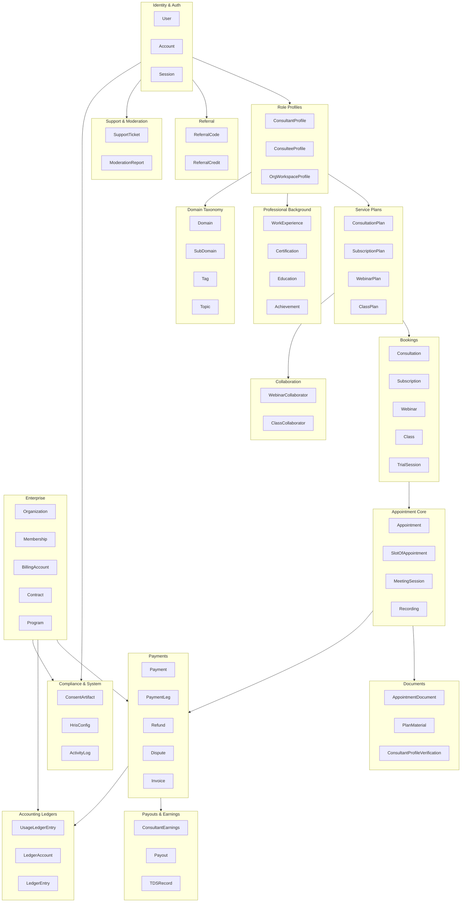
```mermaid
flowchart TD
    subgraph Identity["Identity & Auth"]
        User
        Account
        Session
    end
    subgraph Profiles["Role Profiles"]
        ConsultantProfile
        ConsulteeProfile
        OrgWorkspaceProfile
    end
    subgraph Taxonomy["Domain Taxonomy"]
        Domain
        SubDomain
        Tag
        Topic
    end
    subgraph Background["Professional Background"]
        WorkExperience
        Certification
        Education
        Achievement
    end
    subgraph Plans["Service Plans"]
        ConsultationPlan
        SubscriptionPlan
        WebinarPlan
        ClassPlan
    end
    subgraph Bookings["Bookings"]
        Consultation
        Subscription
        Webinar
        Class
        TrialSession
    end
    subgraph Core["Appointment Core"]
        Appointment
        SlotOfAppointment
        MeetingSession
        Recording
    end
    subgraph Docs["Documents"]
        AppointmentDocument
        PlanMaterial
        ConsultantProfileVerification
    end
    subgraph Collab["Collaboration"]
        WebinarCollaborator
        ClassCollaborator
    end
    subgraph Pay["Payments"]
        Payment
        PaymentLeg
        Refund
        Dispute
        Invoice
    end
    subgraph Earn["Payouts & Earnings"]
        ConsultantEarnings
        Payout
        TDSRecord
    end
    subgraph Ref["Referral"]
        ReferralCode
        ReferralCredit
    end
    subgraph Ent["Enterprise"]
        Organization
        Membership
        BillingAccount
        Contract
        Program
    end
    subgraph Ledgers["Accounting Ledgers"]
        UsageLedgerEntry
        LedgerAccount
        LedgerEntry
    end
    subgraph Support["Support & Moderation"]
        SupportTicket
        ModerationReport
    end
    subgraph Compliance["Compliance & System"]
        ConsentArtifact
        HrisConfig
        ActivityLog
    end

    Identity --> Profiles
    Profiles --> Plans
    Profiles --> Background
    Profiles --> Taxonomy
    Plans --> Bookings
    Bookings --> Core
    Core --> Docs
    Plans --> Collab
    Core --> Pay
    Pay --> Earn
    Pay --> Ledgers
    Ent --> Pay
    Ent --> Ledgers
    Identity --> Ref
    Identity --> Support
    Identity --> Compliance
    Ent --> Compliance
```

---

## 2. User Identity & Auth

The central `User` model and BetterAuth supporting tables.

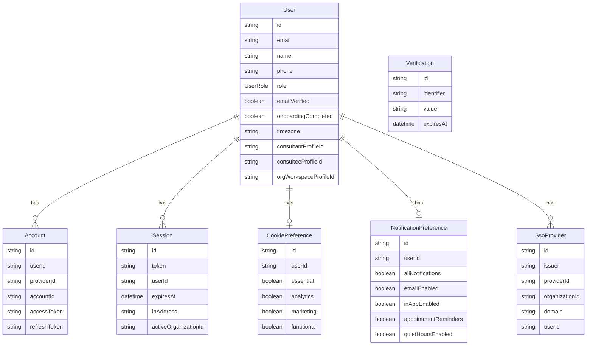
```mermaid
erDiagram
    User {
        string id
        string email
        string name
        string phone
        UserRole role
        boolean emailVerified
        boolean onboardingCompleted
        string timezone
        string consultantProfileId
        string consulteeProfileId
        string orgWorkspaceProfileId
    }
    Account {
        string id
        string userId
        string providerId
        string accountId
        string accessToken
        string refreshToken
    }
    Session {
        string id
        string token
        string userId
        datetime expiresAt
        string ipAddress
        string activeOrganizationId
    }
    Verification {
        string id
        string identifier
        string value
        datetime expiresAt
    }
    SsoProvider {
        string id
        string issuer
        string providerId
        string organizationId
        string domain
        string userId
    }
    CookiePreference {
        string id
        string userId
        boolean essential
        boolean analytics
        boolean marketing
        boolean functional
    }
    NotificationPreference {
        string id
        string userId
        boolean allNotifications
        boolean emailEnabled
        boolean inAppEnabled
        boolean appointmentReminders
        boolean quietHoursEnabled
    }

    User ||--o{ Account : "has"
    User ||--o{ Session : "has"
    User ||--o| CookiePreference : "has"
    User ||--o| NotificationPreference : "has"
    User ||--o{ SsoProvider : "has"
```

---

## 3. User Role Profiles

One `User` can hold multiple profile types. `ConsultantProfile` and `ConsulteeProfile` can co-exist on the same account.

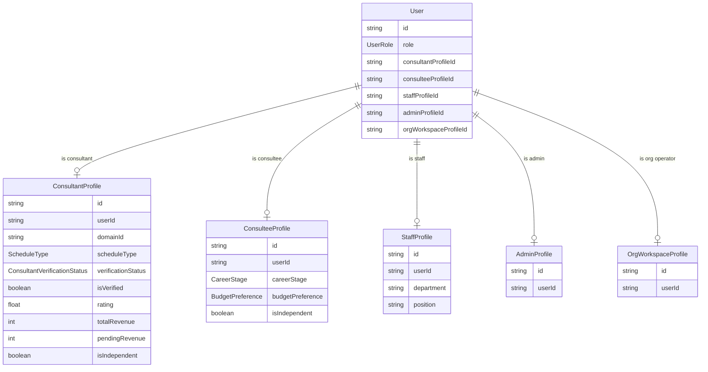
```mermaid
erDiagram
    User {
        string id
        UserRole role
        string consultantProfileId
        string consulteeProfileId
        string staffProfileId
        string adminProfileId
        string orgWorkspaceProfileId
    }
    ConsultantProfile {
        string id
        string userId
        string domainId
        ScheduleType scheduleType
        ConsultantVerificationStatus verificationStatus
        boolean isVerified
        float rating
        int totalRevenue
        int pendingRevenue
        boolean isIndependent
    }
    ConsulteeProfile {
        string id
        string userId
        CareerStage careerStage
        BudgetPreference budgetPreference
        boolean isIndependent
    }
    StaffProfile {
        string id
        string userId
        string department
        string position
    }
    AdminProfile {
        string id
        string userId
    }
    OrgWorkspaceProfile {
        string id
        string userId
    }

    User ||--o| ConsultantProfile : "is consultant"
    User ||--o| ConsulteeProfile : "is consultee"
    User ||--o| StaffProfile : "is staff"
    User ||--o| AdminProfile : "is admin"
    User ||--o| OrgWorkspaceProfile : "is org operator"
```

---

## 4. Consultant Domain Taxonomy

How consultants categorise their expertise and how plans are tagged.

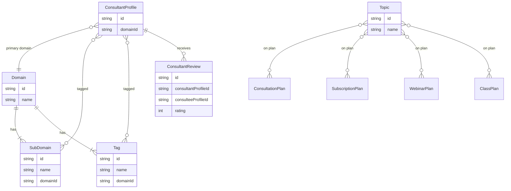
```mermaid
erDiagram
    ConsultantProfile {
        string id
        string domainId
    }
    Domain {
        string id
        string name
    }
    SubDomain {
        string id
        string name
        string domainId
    }
    Tag {
        string id
        string name
        string domainId
    }
    Topic {
        string id
        string name
    }
    ConsultantReview {
        string id
        string consultantProfileId
        string consulteeProfileId
        int rating
    }

    Domain ||--|{ SubDomain : "has"
    Domain ||--|{ Tag : "has"
    ConsultantProfile }o--|| Domain : "primary domain"
    ConsultantProfile }o--o{ SubDomain : "tagged"
    ConsultantProfile }o--o{ Tag : "tagged"
    ConsultantProfile ||--o{ ConsultantReview : "receives"
    Topic }o--o{ ConsultationPlan : "on plan"
    Topic }o--o{ SubscriptionPlan : "on plan"
    Topic }o--o{ WebinarPlan : "on plan"
    Topic }o--o{ ClassPlan : "on plan"
```

`ConsultantReview` is the public reputation rail and #1300 gave it three companions that the diagram above omits for space: `ConsultantReviewRevision` (one append-only row per superseded version of a review's text), `ScoringSnapshot` (one immutable row per scoring run, holding the priors and parameters that produced each profile's two published scores), and the enums `ReviewTrack` (`ONE_TO_ONE` or `GROUP`) and `RatingCause` (what a rater says drove a low score, shared with `AppointmentFeedback`). The reference for all four is [`docs/reviews/`](../reviews/README.md), and the column-by-column list is [`docs/reviews/06-schema-reference.md`](../reviews/06-schema-reference.md).

---

## 5. Professional Background

All consolidated at `User` level (not profile level) for DRY principle. `Achievement` is consultant-only.

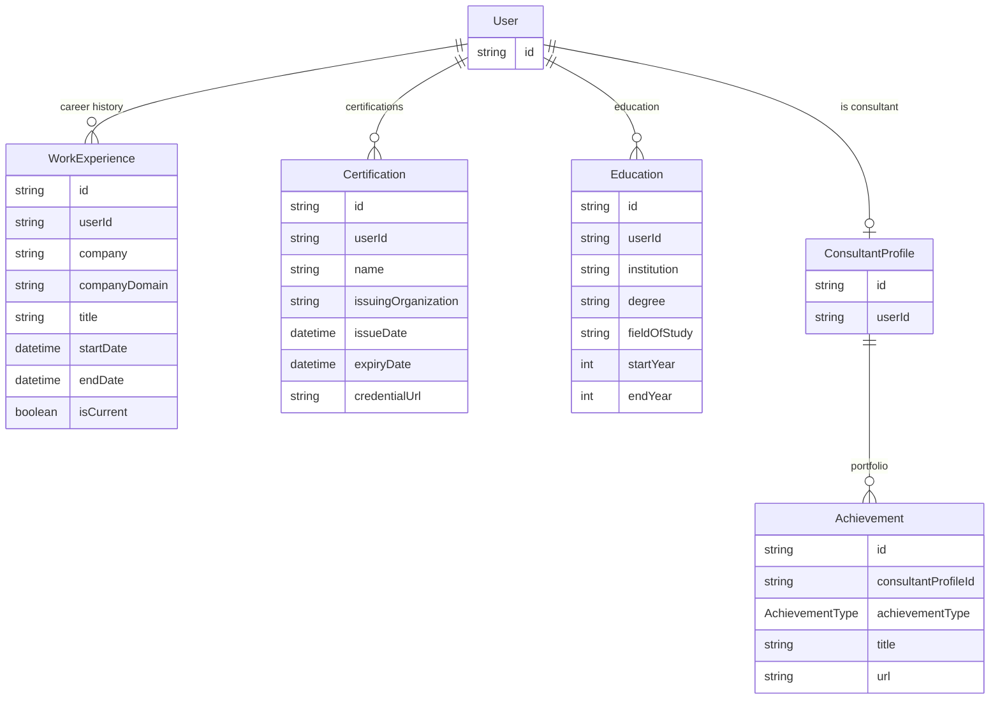
```mermaid
erDiagram
    User {
        string id
    }
    WorkExperience {
        string id
        string userId
        string company
        string companyDomain
        string title
        datetime startDate
        datetime endDate
        boolean isCurrent
    }
    Certification {
        string id
        string userId
        string name
        string issuingOrganization
        datetime issueDate
        datetime expiryDate
        string credentialUrl
    }
    Education {
        string id
        string userId
        string institution
        string degree
        string fieldOfStudy
        int startYear
        int endYear
    }
    Achievement {
        string id
        string consultantProfileId
        AchievementType achievementType
        string title
        string url
    }
    ConsultantProfile {
        string id
        string userId
    }

    User ||--o{ WorkExperience : "career history"
    User ||--o{ Certification : "certifications"
    User ||--o{ Education : "education"
    ConsultantProfile ||--o{ Achievement : "portfolio"
    User ||--o| ConsultantProfile : "is consultant"
```

---

## 6. Service Plans

Four plan types. All owned by `ConsultantProfile`, optionally also by `Organization`. Visibility controls marketplace exposure, and `archivedAt` withdraws a plan from sale without deleting the terms past bookings still resolve against.

All four carry the same buyer-facing content shape — `subtitle`, `targetAudience`, `whatsIncluded`, `imageUrl`, `slug`, a `PlanLevel` `level`, and a polymorphic `PlanFaq` child list. See [ADR 24](../enterprise/70-design-decisions/24-offering-content-model.md).

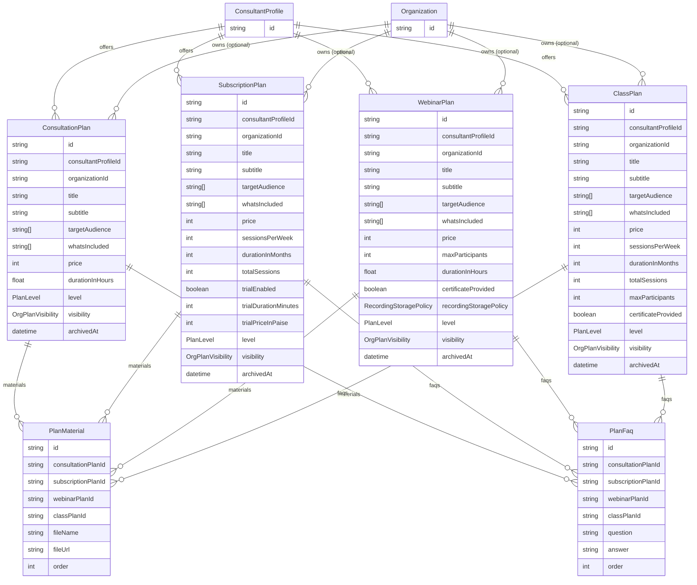
```mermaid
erDiagram
    ConsultantProfile {
        string id
    }
    Organization {
        string id
    }
    ConsultationPlan {
        string id
        string consultantProfileId
        string organizationId
        string title
        string subtitle
        string[] targetAudience
        string[] whatsIncluded
        int price
        float durationInHours
        PlanLevel level
        OrgPlanVisibility visibility
        datetime archivedAt
    }
    SubscriptionPlan {
        string id
        string consultantProfileId
        string organizationId
        string title
        string subtitle
        string[] targetAudience
        string[] whatsIncluded
        int price
        int sessionsPerWeek
        int durationInMonths
        int totalSessions
        boolean trialEnabled
        int trialDurationMinutes
        int trialPriceInPaise
        PlanLevel level
        OrgPlanVisibility visibility
        datetime archivedAt
    }
    WebinarPlan {
        string id
        string consultantProfileId
        string organizationId
        string title
        string subtitle
        string[] targetAudience
        string[] whatsIncluded
        int price
        int maxParticipants
        float durationInHours
        boolean certificateProvided
        RecordingStoragePolicy recordingStoragePolicy
        PlanLevel level
        OrgPlanVisibility visibility
        datetime archivedAt
    }
    ClassPlan {
        string id
        string consultantProfileId
        string organizationId
        string title
        string subtitle
        string[] targetAudience
        string[] whatsIncluded
        int price
        int sessionsPerWeek
        int durationInMonths
        int totalSessions
        int maxParticipants
        boolean certificateProvided
        PlanLevel level
        OrgPlanVisibility visibility
        datetime archivedAt
    }
    PlanMaterial {
        string id
        string consultationPlanId
        string subscriptionPlanId
        string webinarPlanId
        string classPlanId
        string fileName
        string fileUrl
        int order
    }
    PlanFaq {
        string id
        string consultationPlanId
        string subscriptionPlanId
        string webinarPlanId
        string classPlanId
        string question
        string answer
        int order
    }

    ConsultantProfile ||--o{ ConsultationPlan : "offers"
    ConsultantProfile ||--o{ SubscriptionPlan : "offers"
    ConsultantProfile ||--o{ WebinarPlan : "offers"
    ConsultantProfile ||--o{ ClassPlan : "offers"
    Organization ||--o{ ConsultationPlan : "owns (optional)"
    Organization ||--o{ SubscriptionPlan : "owns (optional)"
    Organization ||--o{ WebinarPlan : "owns (optional)"
    Organization ||--o{ ClassPlan : "owns (optional)"
    ConsultationPlan ||--o{ PlanMaterial : "materials"
    SubscriptionPlan ||--o{ PlanMaterial : "materials"
    WebinarPlan ||--o{ PlanMaterial : "materials"
    ClassPlan ||--o{ PlanMaterial : "materials"
    ConsultationPlan ||--o{ PlanFaq : "faqs"
    SubscriptionPlan ||--o{ PlanFaq : "faqs"
    WebinarPlan ||--o{ PlanFaq : "faqs"
    ClassPlan ||--o{ PlanFaq : "faqs"
```

---

## 7. Plan Curriculum Content

Session-by-session curriculum outline for Subscription and Class plans.

The two tables are deliberately kept separate rather than collapsed into one polymorphic model: a class module is a unit of syllabus delivered to a cohort while a subscription session is one appointment in a 1:1 engagement, and the two are free to diverge as the products do. Both carry the same shape today, including `sectionLabel` — the free-text "Week 1" / "Sprint 2" heading that groups adjacent items under one label while `order` still drives sequence. See [ADR 24](../enterprise/70-design-decisions/24-offering-content-model.md).

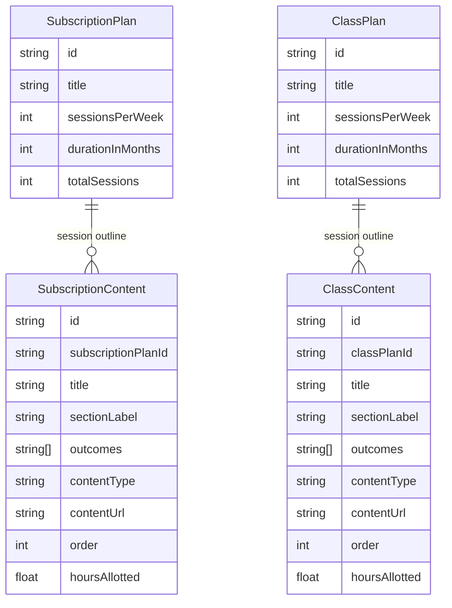
```mermaid
erDiagram
    SubscriptionPlan {
        string id
        string title
        int sessionsPerWeek
        int durationInMonths
        int totalSessions
    }
    SubscriptionContent {
        string id
        string subscriptionPlanId
        string title
        string sectionLabel
        string[] outcomes
        string contentType
        string contentUrl
        int order
        float hoursAllotted
    }
    ClassPlan {
        string id
        string title
        int sessionsPerWeek
        int durationInMonths
        int totalSessions
    }
    ClassContent {
        string id
        string classPlanId
        string title
        string sectionLabel
        string[] outcomes
        string contentType
        string contentUrl
        int order
        float hoursAllotted
    }

    SubscriptionPlan ||--o{ SubscriptionContent : "session outline"
    ClassPlan ||--o{ ClassContent : "session outline"
```

---

## 8. Availability & Slots

How consultant availability windows become booked appointment slots.

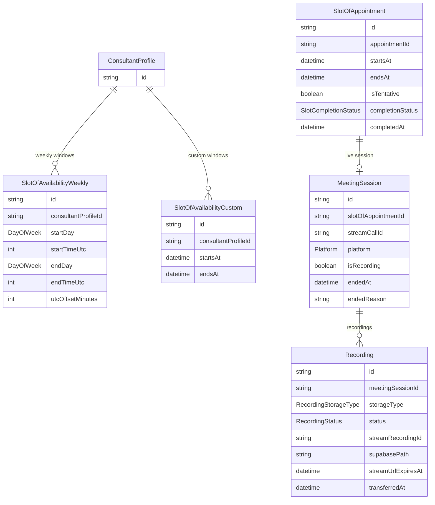
```mermaid
erDiagram
    ConsultantProfile {
        string id
    }
    SlotOfAvailabilityWeekly {
        string id
        string consultantProfileId
        DayOfWeek startDay
        int startTimeUtc
        DayOfWeek endDay
        int endTimeUtc
        int utcOffsetMinutes
    }
    SlotOfAvailabilityCustom {
        string id
        string consultantProfileId
        datetime startsAt
        datetime endsAt
    }
    SlotOfAppointment {
        string id
        string appointmentId
        datetime startsAt
        datetime endsAt
        boolean isTentative
        SlotCompletionStatus completionStatus
        datetime completedAt
    }
    MeetingSession {
        string id
        string slotOfAppointmentId
        string streamCallId
        Platform platform
        boolean isRecording
        datetime endedAt
        string endedReason
    }
    Recording {
        string id
        string meetingSessionId
        RecordingStorageType storageType
        RecordingStatus status
        string streamRecordingId
        string supabasePath
        datetime streamUrlExpiresAt
        datetime transferredAt
    }

    ConsultantProfile ||--o{ SlotOfAvailabilityWeekly : "weekly windows"
    ConsultantProfile ||--o{ SlotOfAvailabilityCustom : "custom windows"
    SlotOfAppointment ||--o| MeetingSession : "live session"
    MeetingSession ||--o{ Recording : "recordings"
```

> **Key invariant**: `startTimeUtc` and `endTimeUtc` are stored as **integer minutes since midnight UTC** (0–1439). The 30-minute atomic slot is the fundamental booking unit.

---

## 9. Bookings — Consultation & Subscription

The request-to-approval-to-payment state machine for 1-on-1 services.

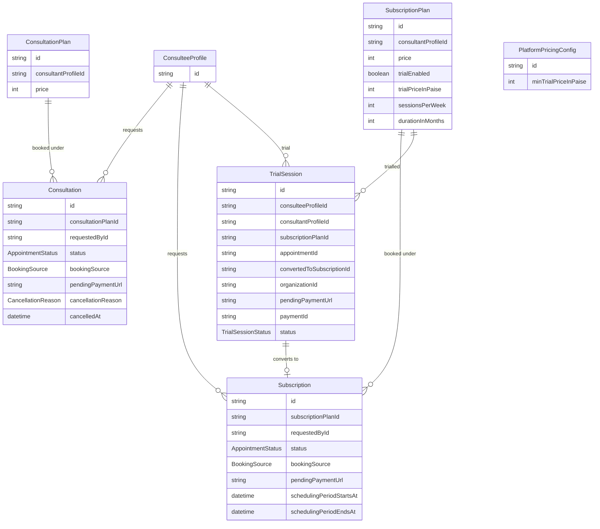
```mermaid
erDiagram
    ConsulteeProfile {
        string id
    }
    ConsultationPlan {
        string id
        string consultantProfileId
        int price
    }
    Consultation {
        string id
        string consultationPlanId
        string requestedById
        AppointmentStatus status
        BookingSource bookingSource
        string pendingPaymentUrl
        CancellationReason cancellationReason
        datetime cancelledAt
    }
    SubscriptionPlan {
        string id
        string consultantProfileId
        int price
        boolean trialEnabled
        int trialPriceInPaise
        int sessionsPerWeek
        int durationInMonths
    }
    Subscription {
        string id
        string subscriptionPlanId
        string requestedById
        AppointmentStatus status
        BookingSource bookingSource
        string pendingPaymentUrl
        datetime schedulingPeriodStartsAt
        datetime schedulingPeriodEndsAt
    }
    TrialSession {
        string id
        string consulteeProfileId
        string consultantProfileId
        string subscriptionPlanId
        string appointmentId
        string convertedToSubscriptionId
        string organizationId
        string pendingPaymentUrl
        string paymentId
        TrialSessionStatus status
    }
    PlatformPricingConfig {
        string id
        int minTrialPriceInPaise
    }

    ConsulteeProfile ||--o{ Consultation : "requests"
    ConsultationPlan ||--o{ Consultation : "booked under"
    ConsulteeProfile ||--o{ Subscription : "requests"
    SubscriptionPlan ||--o{ Subscription : "booked under"
    ConsulteeProfile ||--o{ TrialSession : "trial"
    SubscriptionPlan ||--o{ TrialSession : "trialled"
    TrialSession ||--o| Subscription : "converts to"
```

---

## 10. Bookings — Webinar & Class

Group sessions. Many consultees share one Appointment row (many-to-one booking).

```mermaid
erDiagram
    WebinarPlan {
        string id
        string consultantProfileId
        int price
        int maxParticipants
        boolean certificateProvided
        RecordingStoragePolicy recordingStoragePolicy
    }
    Webinar {
        string id
        string webinarPlanId
        WebinarStatus status
        string feedbackSummary
    }
    ClassPlan {
        string id
        string consultantProfileId
        int price
        int maxParticipants
        int totalSessions
        boolean certificateProvided
    }
    Class {
        string id
        string classPlanId
        ClassStatus status
        datetime schedulingPeriodStartsAt
        datetime schedulingPeriodEndsAt
    }
    WebinarPlan ||--o{ Webinar : "schedules instances"
    ClassPlan ||--o{ Class : "runs cohorts"
```

`Webinar.maxParticipants` and `Class.maxParticipants` are nullable per-instance
capacity overrides; null inherits the plan's value. See
[the capacity section of the booking docs](../booking/02-event-types-and-validation.md).

---

## 11. Appointment — The Pivot Model

`Appointment` links every booking type to its slots and payments. Group events (webinar/class) share one Appointment row across all registrants.

```mermaid
erDiagram
    Appointment {
        string id
        AppointmentsType appointmentType
        string consultationId
        string subscriptionId
        string webinarId
        string classId
        string organizationId
    }
    Consultation {
        string id
        AppointmentStatus status
    }
    Subscription {
        string id
        AppointmentStatus status
    }
    Webinar {
        string id
        WebinarStatus status
    }
    Class {
        string id
        ClassStatus status
    }
    TrialSession {
        string id
        TrialSessionStatus status
        string appointmentId
    }
    SlotOfAppointment {
        string id
        string appointmentId
        datetime startsAt
        datetime endsAt
        boolean isTentative
        SlotCompletionStatus completionStatus
    }
    Payment {
        string id
        string appointmentId
        string userId
        PaymentStatus paymentStatus
        int amount
    }
    AppointmentDocument {
        string id
        string appointmentId
        DocumentReviewStatus reviewStatus
        DocumentUploadRole uploadedByRole
    }

    Consultation ||--o| Appointment : "1-to-1"
    Subscription ||--o{ Appointment : "1-to-many sessions"
    Webinar ||--o| Appointment : "shared by all registrants"
    Class ||--o{ Appointment : "one per session"
    TrialSession ||--o| Appointment : "free session"
    Appointment ||--|{ SlotOfAppointment : "1+ time slots"
    Appointment ||--o{ Payment : "paid via"
    Appointment ||--o{ AppointmentDocument : "docs"
```

---

## 12. Session Infrastructure

The Stream.io video layer and dual-storage recording system.

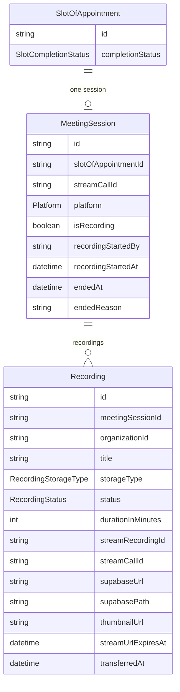
```mermaid
erDiagram
    SlotOfAppointment {
        string id
        SlotCompletionStatus completionStatus
    }
    MeetingSession {
        string id
        string slotOfAppointmentId
        string streamCallId
        Platform platform
        boolean isRecording
        string recordingStartedBy
        datetime recordingStartedAt
        datetime endedAt
        string endedReason
    }
    Recording {
        string id
        string meetingSessionId
        string organizationId
        string title
        RecordingStorageType storageType
        RecordingStatus status
        int durationInMinutes
        string streamRecordingId
        string streamCallId
        string supabaseUrl
        string supabasePath
        string thumbnailUrl
        datetime streamUrlExpiresAt
        datetime transferredAt
    }

    SlotOfAppointment ||--o| MeetingSession : "one session"
    MeetingSession ||--o{ Recording : "recordings"
```

> **Dual storage**: `STREAM_S3` = temporary 2-week storage (free tier). `SUPABASE` = permanent (premium). `RecordingStatus` lifecycle: RECORDING → PROCESSING → READY → TRANSFERRING → AVAILABLE.

---

## 13. Documents & Consultant Verification

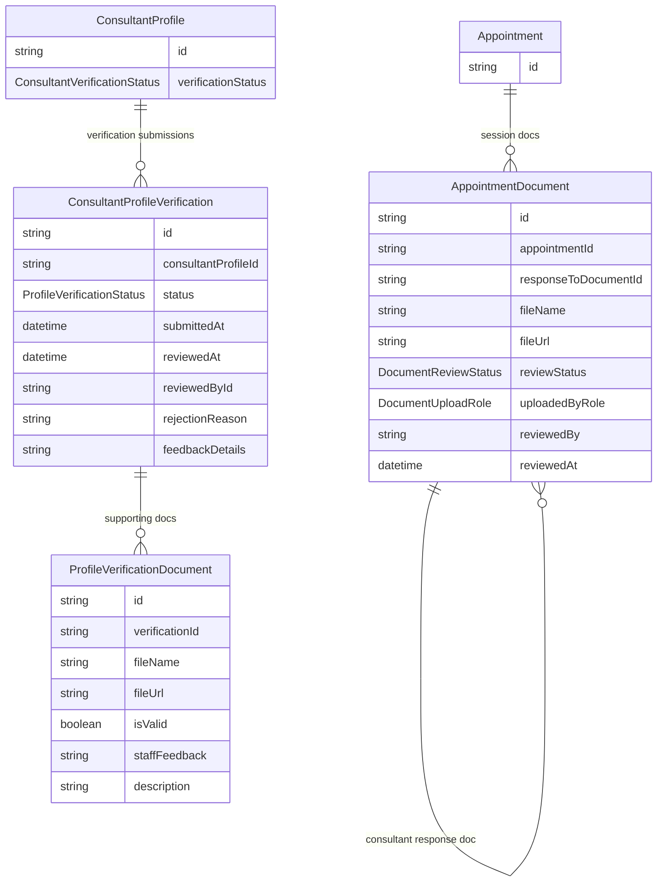
```mermaid
erDiagram
    Appointment {
        string id
    }
    AppointmentDocument {
        string id
        string appointmentId
        string responseToDocumentId
        string fileName
        string fileUrl
        DocumentReviewStatus reviewStatus
        DocumentUploadRole uploadedByRole
        string reviewedBy
        datetime reviewedAt
    }
    ConsultantProfile {
        string id
        ConsultantVerificationStatus verificationStatus
    }
    ConsultantProfileVerification {
        string id
        string consultantProfileId
        ProfileVerificationStatus status
        datetime submittedAt
        datetime reviewedAt
        string reviewedById
        string rejectionReason
        string feedbackDetails
    }
    ProfileVerificationDocument {
        string id
        string verificationId
        string fileName
        string fileUrl
        boolean isValid
        string staffFeedback
        string description
    }

    Appointment ||--o{ AppointmentDocument : "session docs"
    AppointmentDocument ||--o{ AppointmentDocument : "consultant response doc"
    ConsultantProfile ||--o{ ConsultantProfileVerification : "verification submissions"
    ConsultantProfileVerification ||--o{ ProfileVerificationDocument : "supporting docs"
```

---

## 14. Collaboration System

Co-hosts, TAs, and guest speakers with revenue-share splits on Webinar and Class plans.

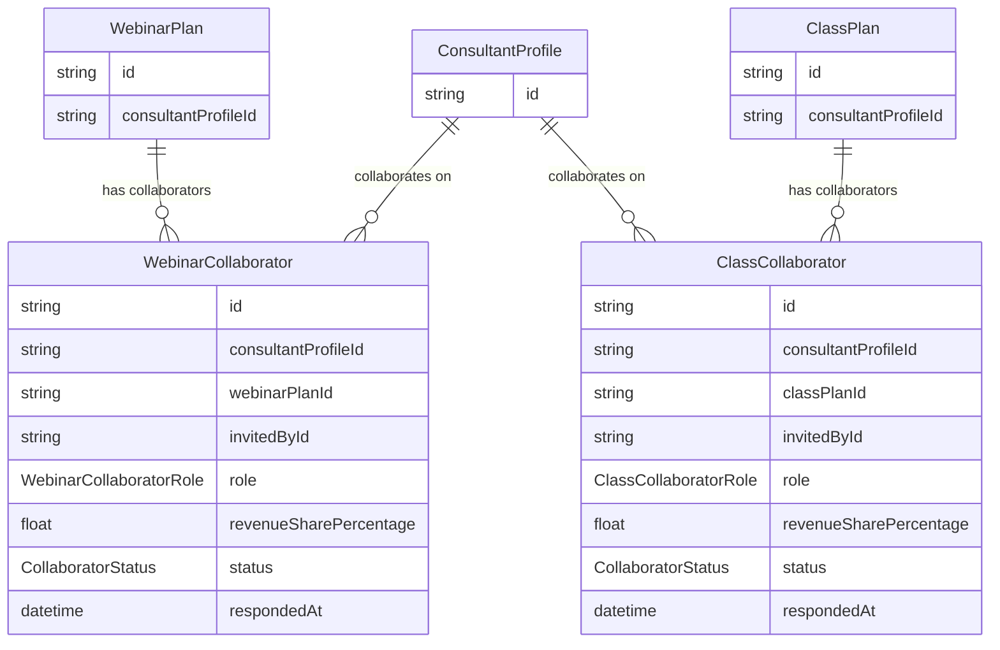
```mermaid
erDiagram
    ConsultantProfile {
        string id
    }
    WebinarPlan {
        string id
        string consultantProfileId
    }
    WebinarCollaborator {
        string id
        string consultantProfileId
        string webinarPlanId
        string invitedById
        WebinarCollaboratorRole role
        float revenueSharePercentage
        CollaboratorStatus status
        datetime respondedAt
    }
    ClassPlan {
        string id
        string consultantProfileId
    }
    ClassCollaborator {
        string id
        string consultantProfileId
        string classPlanId
        string invitedById
        ClassCollaboratorRole role
        float revenueSharePercentage
        CollaboratorStatus status
        datetime respondedAt
    }

    WebinarPlan ||--o{ WebinarCollaborator : "has collaborators"
    ConsultantProfile ||--o{ WebinarCollaborator : "collaborates on"
    ClassPlan ||--o{ ClassCollaborator : "has collaborators"
    ConsultantProfile ||--o{ ClassCollaborator : "collaborates on"
```

---

## 15. Payment System

Two-phase commit: tentative slot created pre-payment, confirmed on webhook. Multi-leg funding for stacked payment sources.

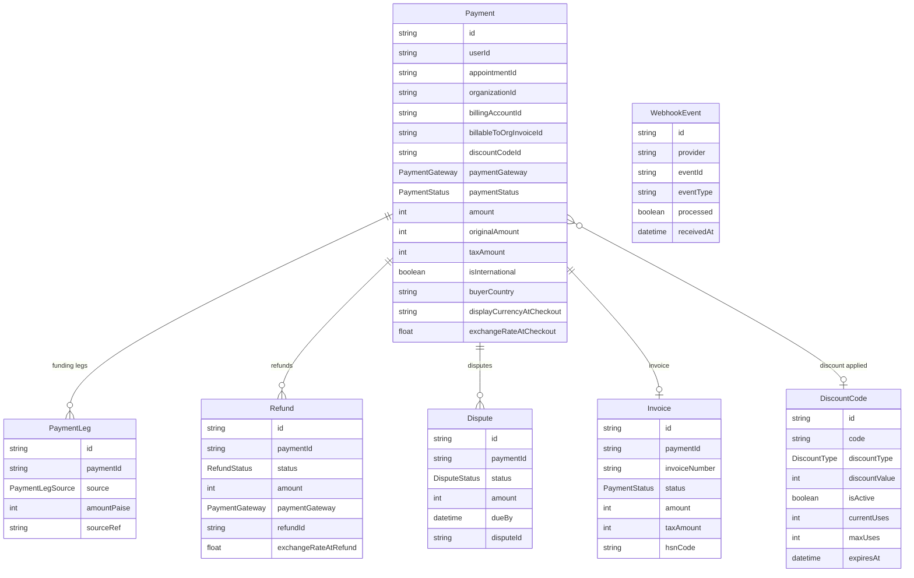
```mermaid
erDiagram
    Payment {
        string id
        string userId
        string appointmentId
        string organizationId
        string billingAccountId
        string billableToOrgInvoiceId
        string discountCodeId
        PaymentGateway paymentGateway
        PaymentStatus paymentStatus
        int amount
        int originalAmount
        int taxAmount
        boolean isInternational
        string buyerCountry
        string displayCurrencyAtCheckout
        float exchangeRateAtCheckout
    }
    PaymentLeg {
        string id
        string paymentId
        PaymentLegSource source
        int amountPaise
        string sourceRef
    }
    Refund {
        string id
        string paymentId
        RefundStatus status
        int amount
        PaymentGateway paymentGateway
        string refundId
        float exchangeRateAtRefund
    }
    Dispute {
        string id
        string paymentId
        DisputeStatus status
        int amount
        datetime dueBy
        string disputeId
    }
    Invoice {
        string id
        string paymentId
        string invoiceNumber
        PaymentStatus status
        int amount
        int taxAmount
        string hsnCode
    }
    WebhookEvent {
        string id
        string provider
        string eventId
        string eventType
        boolean processed
        datetime receivedAt
    }
    DiscountCode {
        string id
        string code
        DiscountType discountType
        int discountValue
        boolean isActive
        int currentUses
        int maxUses
        datetime expiresAt
    }

    Payment ||--o{ PaymentLeg : "funding legs"
    Payment ||--o{ Refund : "refunds"
    Payment ||--o{ Dispute : "disputes"
    Payment ||--o| Invoice : "invoice"
    Payment }o--o| DiscountCode : "discount applied"
```

---

## 16. Referral System

User acquisition via referral codes, with credit pools applied as payment legs.

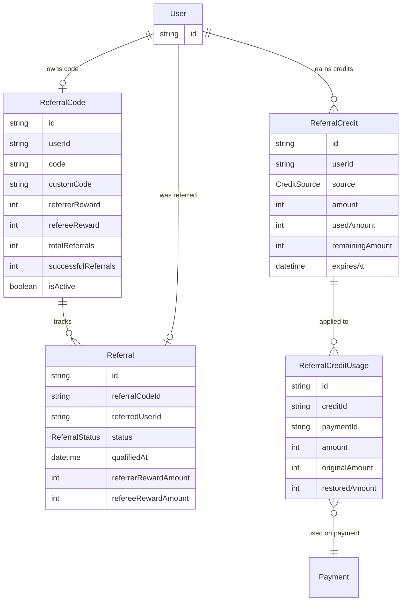
```mermaid
erDiagram
    User {
        string id
    }
    ReferralCode {
        string id
        string userId
        string code
        string customCode
        int referrerReward
        int refereeReward
        int totalReferrals
        int successfulReferrals
        boolean isActive
    }
    Referral {
        string id
        string referralCodeId
        string referredUserId
        ReferralStatus status
        datetime qualifiedAt
        int referrerRewardAmount
        int refereeRewardAmount
    }
    ReferralCredit {
        string id
        string userId
        CreditSource source
        int amount
        int usedAmount
        int remainingAmount
        datetime expiresAt
    }
    ReferralCreditUsage {
        string id
        string creditId
        string paymentId
        int amount
        int originalAmount
        int restoredAmount
    }

    User ||--o| ReferralCode : "owns code"
    ReferralCode ||--o{ Referral : "tracks"
    User ||--o| Referral : "was referred"
    User ||--o{ ReferralCredit : "earns credits"
    ReferralCredit ||--o{ ReferralCreditUsage : "applied to"
    ReferralCreditUsage }o--|| Payment : "used on payment"
```

---

## 17. Consultant Payouts & Tax

Earnings lifecycle from payment → hold → payout → TDS deduction → bank transfer.

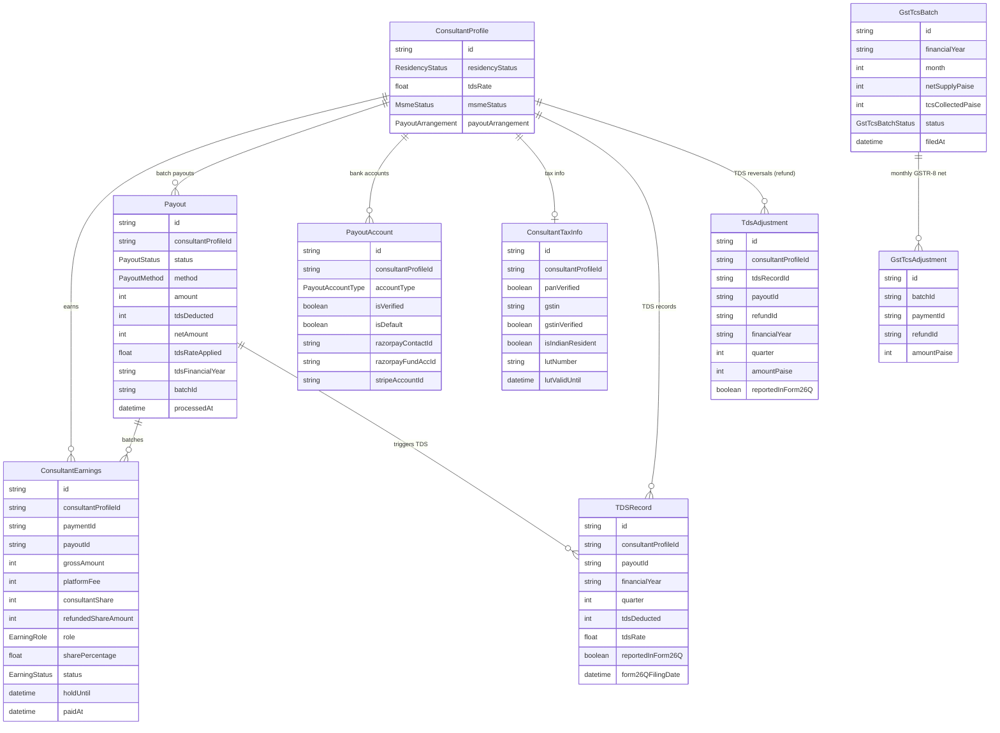
```mermaid
erDiagram
    ConsultantProfile {
        string id
        ResidencyStatus residencyStatus
        float tdsRate
        MsmeStatus msmeStatus
        PayoutArrangement payoutArrangement
    }
    ConsultantEarnings {
        string id
        string consultantProfileId
        string paymentId
        string payoutId
        int grossAmount
        int platformFee
        int consultantShare
        int refundedShareAmount
        EarningRole role
        float sharePercentage
        EarningStatus status
        datetime holdUntil
        datetime paidAt
    }
    Payout {
        string id
        string consultantProfileId
        PayoutStatus status
        PayoutMethod method
        int amount
        int tdsDeducted
        int netAmount
        float tdsRateApplied
        string tdsFinancialYear
        string batchId
        datetime processedAt
    }
    PayoutAccount {
        string id
        string consultantProfileId
        PayoutAccountType accountType
        boolean isVerified
        boolean isDefault
        string razorpayContactId
        string razorpayFundAccId
        string stripeAccountId
    }
    ConsultantTaxInfo {
        string id
        string consultantProfileId
        boolean panVerified
        string gstin
        boolean gstinVerified
        boolean isIndianResident
        string lutNumber
        datetime lutValidUntil
    }
    TDSRecord {
        string id
        string consultantProfileId
        string payoutId
        string financialYear
        int quarter
        int tdsDeducted
        float tdsRate
        boolean reportedInForm26Q
        datetime form26QFilingDate
    }
    TdsAdjustment {
        string id
        string consultantProfileId
        string tdsRecordId
        string payoutId
        string refundId
        string financialYear
        int quarter
        int amountPaise
        boolean reportedInForm26Q
    }
    GstTcsBatch {
        string id
        string financialYear
        int month
        int netSupplyPaise
        int tcsCollectedPaise
        GstTcsBatchStatus status
        datetime filedAt
    }
    GstTcsAdjustment {
        string id
        string batchId
        string paymentId
        string refundId
        int amountPaise
    }

    ConsultantProfile ||--o{ ConsultantEarnings : "earns"
    ConsultantProfile ||--o{ Payout : "batch payouts"
    ConsultantProfile ||--o{ PayoutAccount : "bank accounts"
    ConsultantProfile ||--o| ConsultantTaxInfo : "tax info"
    ConsultantProfile ||--o{ TDSRecord : "TDS records"
    ConsultantProfile ||--o{ TdsAdjustment : "TDS reversals (refund)"
    Payout ||--o{ ConsultantEarnings : "batches"
    Payout ||--o{ TDSRecord : "triggers TDS"
    GstTcsBatch ||--o{ GstTcsAdjustment : "monthly GSTR-8 net"
```

> **#778 §D refund-tax reversals.** `TdsAdjustment` posts a negative line in the
> revised 26Q/27Q when previously-withheld TDS is reversed on refund;
> `GstTcsBatch` aggregates GST TCS u/s 52 per month for GSTR-8 (e-commerce
> operator, 1% on registered consultants), with `GstTcsAdjustment` netting
> refund reversals into the period's batch. Collection + filing are flag-gated
> pending CA signoff. `CreditNote` (Sec 34 / CGST Rule 53) is the org-side
> refund document — see section 20 (Enterprise Invoicing).

---

## 18. Enterprise Core — Org & Membership

An Organization can sponsor employees (`canSponsor`) and/or host consultants (`canHost`). `Membership` is the source of truth; `Member` is kept for BetterAuth invite-token compatibility.

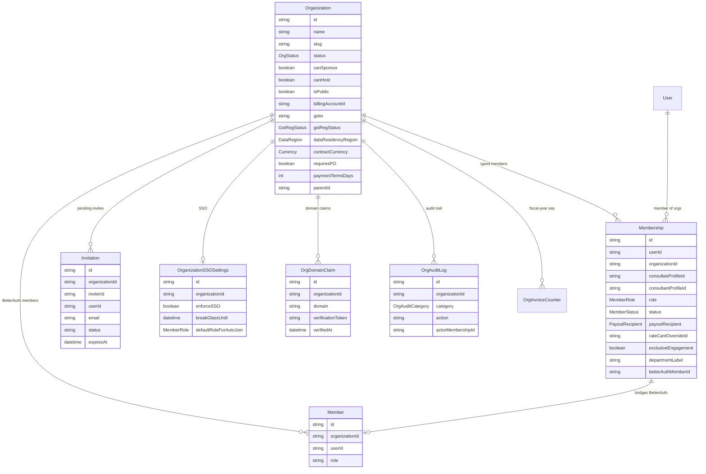
```mermaid
erDiagram
    Organization {
        string id
        string name
        string slug
        OrgStatus status
        boolean canSponsor
        boolean canHost
        boolean isPublic
        string billingAccountId
        string gstin
        GstRegStatus gstRegStatus
        DataRegion dataResidencyRegion
        Currency contractCurrency
        boolean requiresPO
        int paymentTermsDays
        string parentId
    }
    Membership {
        string id
        string userId
        string organizationId
        string consulteeProfileId
        string consultantProfileId
        MemberRole role
        MemberStatus status
        PayoutRecipient payoutRecipient
        string rateCardOverrideId
        boolean exclusiveEngagement
        string departmentLabel
        string betterAuthMemberId
    }
    Member {
        string id
        string organizationId
        string userId
        string role
    }
    Invitation {
        string id
        string organizationId
        string inviterId
        string userId
        string email
        string status
        datetime expiresAt
    }
    OrganizationSSOSettings {
        string id
        string organizationId
        boolean enforceSSO
        datetime breakGlassUntil
        MemberRole defaultRoleForAutoJoin
    }
    OrgDomainClaim {
        string id
        string organizationId
        string domain
        string verificationToken
        datetime verifiedAt
    }
    OrgAuditLog {
        string id
        string organizationId
        OrgAuditCategory category
        string action
        string actorMembershipId
    }

    Organization ||--o{ Membership : "typed members"
    Organization ||--o{ Member : "BetterAuth members"
    Organization ||--o{ Invitation : "pending invites"
    Organization ||--o| OrganizationSSOSettings : "SSO"
    Organization ||--o{ OrgDomainClaim : "domain claims"
    Organization ||--o{ OrgAuditLog : "audit trail"
    Organization ||--o{ OrgInvoiceCounter : "fiscal-year seq"
    User ||--o{ Membership : "member of orgs"
    Membership ||--o| Member : "bridges BetterAuth"
```

### 18.1 New 2026-05-15 fields on `Organization`

Added by the Round-3 close-out PR to close enterprise procurement +
India-statutory gaps:

| Field                        | Type                        | Purpose                                                                                                                           |
| ---------------------------- | --------------------------- | --------------------------------------------------------------------------------------------------------------------------------- |
| `billingContactName`         | `String?`                   | Named human at the org for invoice/PO correspondence.                                                                             |
| `billingContactEmail`        | `String? @db.VarChar(255)`  | Used by Novu `ORG_INVOICE_*` workflows when present; falls back to OWNER membership email.                                        |
| `billingContactPhone`        | `String? @db.VarChar(32)`   | Optional.                                                                                                                         |
| `supportContactName`         | `String?`                   | Surfaced on order-confirmation emails for the org's members.                                                                      |
| `supportContactEmail`        | `String? @db.VarChar(255)`  | Routed via Novu when set.                                                                                                         |
| `escalationContactEmail`     | `String? @db.VarChar(255)`  | Used by SLA-breach alerts only.                                                                                                   |
| `invoiceNumberPrefix`        | `String?`                   | Per-org override for the human-readable invoice prefix. Null → slug-derived. Used by `lib/payments/billing/invoice-numbering.ts`. |
| `msmeStatus`                 | `MsmeStatus @default(NONE)` | Mirrors `ConsultantProfile.msmeStatus`. Drives the 15/45-day deadline at org-payout creation.                                     |
| `msmeWrittenAgreementOnFile` | `Boolean @default(false)`   | Mirrors `ConsultantProfile.writtenAgreementWithFamiliarise`.                                                                      |

---

## 19. Enterprise Billing & Programs

Commercial structure: `BillingAccount` → `Contract` → `Program` → `ProgramAssignment` → `BookingUtilization`. Each link adds a layer of budget control.

> **v2 (#777/#779) additions shown above:** `Contract` self-supersession chain
> (`supersededByContractId` @unique + `supersessionReason`) for amend/renew/
> terminate-replace; `Contract.autoRenew` + `autoRenewedAt` (renewal cron claim
> gate); `Program.configLockedAt` (money-config lock, stamped at first
> assignment) + `archivedAt` (soft-delete); `ProgramAssignment.status`
> (`AssignmentStatus`) + `consumedPaise` (CREDIT*POOL money-meter) +
> `rolledToAssignmentId` @unique self-relation (cycle-engine rollover);
> `LicensedSeatConfig`/`CreditPoolConfig.{overageSurchargeBps,
maxOveragePerCyclePaise}` (surcharge + circuit-breaker); `OverageEvent`
> (append-only over-cap charge ledger, `basePaise`+`surchargePaise`=`marginalPaise`);
> and `BillingAccount.{minBalancePaise, autoTopUpEnabled, autoTopUpAmountPaise,
autoTopUpMandateId}` (wallet floor + auto-top-up). Top-up lifecycle is
> `WalletTopUp` (PENDING→CONFIRMED/FAILED) — the wallet \_balance* itself is a
> credit-normal liability in the double-entry ledger, not a standalone table.

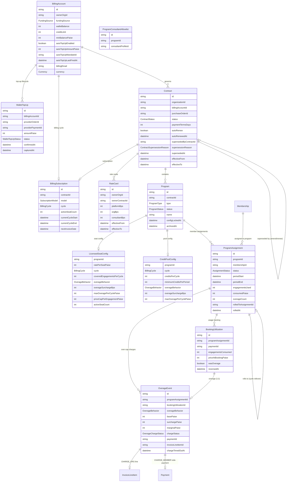
```mermaid
erDiagram
    BillingAccount {
        string id
        string ownerOrgId
        FundingSource fundingSource
        int walletBalance
        int creditLimit
        int minBalancePaise
        boolean autoTopUpEnabled
        int autoTopUpAmountPaise
        string autoTopUpMandateId
        datetime autoTopUpLastFiredAt
        string billingEmail
        Currency currency
    }
    WalletTopUp {
        string id
        string billingAccountId
        string providerOrderId
        string providerPaymentId
        int amountPaise
        WalletTopUpStatus status
        datetime confirmedAt
        datetime capturedAt
    }
    Contract {
        string id
        string organizationId
        string billingAccountId
        string purchaseOrderId
        ContractStatus status
        int paymentTermsDays
        boolean autoRenew
        datetime autoRenewedAt
        string supersededByContractId
        ContractSupersessionReason supersessionReason
        datetime supersededAt
        datetime effectiveFrom
        datetime effectiveTo
    }
    BillingSubscription {
        string id
        string contractId
        SubscriptionModel model
        BillingCycle cycle
        int activeSeatCount
        datetime currentCycleStart
        datetime currentCycleEnd
        datetime nextInvoiceDate
    }
    RateCard {
        string id
        string ownerOrgId
        string ownerContractId
        int platformBps
        int orgBps
        int consultantBps
        datetime effectiveFrom
        datetime effectiveTo
    }
    Program {
        string id
        string contractId
        ProgramType type
        ProgramStatus status
        string name
        datetime configLockedAt
        datetime archivedAt
    }
    ProgramConsultantAllowlist {
        string id
        string programId
        string consultantProfileId
    }
    LicensedSeatConfig {
        string programId
        int ratePerSeatPaise
        BillingCycle cycle
        int coveredEngagementsPerCycle
        OverageBehavior overageBehavior
        int overageSurchargeBps
        int maxOveragePerCyclePaise
        int priceCapPerEngagementPaise
        int activeSeatCount
    }
    CreditPoolConfig {
        string programId
        BillingCycle cycle
        int creditsPerCycle
        int minimumCreditsPerPeriod
        OverageBehavior overageBehavior
        int overageSurchargeBps
        int maxOveragePerCyclePaise
    }
    ProgramAssignment {
        string id
        string programId
        string membershipId
        AssignmentStatus status
        datetime periodStart
        datetime periodEnd
        int engagementsUsed
        int consumedPaise
        int overageCount
        string rolledToAssignmentId
        datetime rolledAt
    }
    OverageEvent {
        string id
        string programAssignmentId
        string bookingUtilizationId
        OverageBehavior overageBehavior
        int basePaise
        int surchargePaise
        int marginalPaise
        OverageChargeStatus chargeStatus
        string paymentId
        string invoiceLineItemId
        datetime chargeTimedOutAt
    }
    BookingUtilization {
        string id
        string programAssignmentId
        string paymentId
        int engagementsConsumed
        int priceAtBookingPaise
        boolean wasOverage
        datetime reversedAt
    }

    BillingAccount ||--o{ WalletTopUp : "top-up lifecycle"
    BillingAccount ||--o{ Contract : "governs"
    BillingAccount ||--o| BillingSubscription : "billing cycle"
    Contract ||--o| Contract : "superseded by (amend/renew)"
    Contract ||--o{ Program : "contains"
    Contract ||--o{ RateCard : "rate cards"
    Contract ||--o| BillingSubscription : "subscription"
    Program ||--o| LicensedSeatConfig : "seat config"
    Program ||--o| CreditPoolConfig : "pool config"
    Program ||--o{ ProgramAssignment : "member assignments"
    ProgramAssignment ||--o| ProgramAssignment : "rolls to (cycle rollover)"
    ProgramAssignment ||--o{ BookingUtilization : "usage tracking"
    ProgramAssignment ||--o{ OverageEvent : "over-cap charges"
    BookingUtilization ||--o| OverageEvent : "overage (1:1)"
    OverageEvent ||--o| InvoiceLineItem : "CHARGE_ORG line"
    OverageEvent ||--o| Payment : "CHARGE_MEMBER side-payment"
    Membership ||--o{ ProgramAssignment : "assigned to program"
```

---

## 20. Enterprise Invoicing & Org Payouts

Month-end invoice generation, GST/e-invoice (IRN), PO matching, and host-org revenue payouts.

> **Invoice numbering (CGST Rule 46).** `OrganizationInvoice.invoiceNumber`
> is per-org-scoped (`@@unique([organizationId, invoiceNumber])`) with
> the format `<PREFIX>-<FY>-<SEQ>` (e.g. `ACME-2026-0042`). `PREFIX` is
> `Organization.invoiceNumberPrefix` when set, else `slug.toUpperCase()`.
> `FY` is the Indian fiscal year (April–March). `SEQ` is a 4-digit
> zero-padded monotonic integer allocated atomically from the
> `OrgInvoiceCounter` table via `INSERT … ON CONFLICT … RETURNING`.
> Helper: `lib/payments/billing/invoice-numbering.ts:generateInvoiceNumber`.
>
> **OrgInvoiceCounter** (`org_invoice_counters` table) — primary key
> `(organizationId, fiscalYear)`, single column `nextSeq Int @default(1)`.
> The transactional UPSERT guarantees unbroken sequence per (org, FY)
> even under concurrent invoice creation.
>
> **`OrganizationInvoice.fiscalYear Int`** — set at issue time; never
> updated. Indexed via `@@index([organizationId, fiscalYear, issuedAt])`.

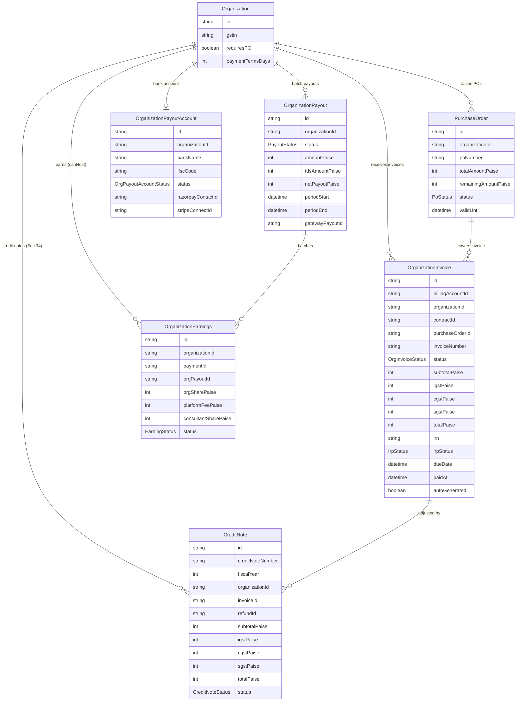
```mermaid
erDiagram
    Organization {
        string id
        string gstin
        boolean requiresPO
        int paymentTermsDays
    }
    PurchaseOrder {
        string id
        string organizationId
        string poNumber
        int totalAmountPaise
        int remainingAmountPaise
        PoStatus status
        datetime validUntil
    }
    OrganizationInvoice {
        string id
        string billingAccountId
        string organizationId
        string contractId
        string purchaseOrderId
        string invoiceNumber
        OrgInvoiceStatus status
        int subtotalPaise
        int igstPaise
        int cgstPaise
        int sgstPaise
        int totalPaise
        string irn
        IrpStatus irpStatus
        datetime dueDate
        datetime paidAt
        boolean autoGenerated
    }
    OrganizationEarnings {
        string id
        string organizationId
        string paymentId
        string orgPayoutId
        int orgSharePaise
        int platformFeePaise
        int consultantSharePaise
        EarningStatus status
    }
    OrganizationPayout {
        string id
        string organizationId
        PayoutStatus status
        int amountPaise
        int tdsAmountPaise
        int netPayoutPaise
        datetime periodStart
        datetime periodEnd
        string gatewayPayoutId
    }
    OrganizationPayoutAccount {
        string id
        string organizationId
        string bankName
        string ifscCode
        OrgPayoutAccountStatus status
        string razorpayContactId
        string stripeConnectId
    }
    CreditNote {
        string id
        string creditNoteNumber
        int fiscalYear
        string organizationId
        string invoiceId
        string refundId
        int subtotalPaise
        int igstPaise
        int cgstPaise
        int sgstPaise
        int totalPaise
        CreditNoteStatus status
    }

    Organization ||--o{ PurchaseOrder : "raises POs"
    Organization ||--o{ OrganizationInvoice : "receives invoices"
    Organization ||--o{ CreditNote : "credit notes (Sec 34)"
    PurchaseOrder ||--o{ OrganizationInvoice : "covers invoice"
    OrganizationInvoice ||--o{ CreditNote : "adjusted by"
    Organization ||--o{ OrganizationEarnings : "earns (canHost)"
    Organization ||--o{ OrganizationPayout : "batch payouts"
    Organization ||--o| OrganizationPayoutAccount : "bank account"
    OrganizationPayout ||--o{ OrganizationEarnings : "batches"
```

---

## 21. Double-Entry Cash Ledger

> **Updated (#771 D1/D5).** The old "three single-entry logs"
> (`WalletEntry` + `FundingLedgerEntry` + `SettlementLedgerEntry`) collapsed
> into ONE balanced double-entry journal: every cash event is a
> `LedgerTransaction` whose `LedgerEntry` rows satisfy Σ(DEBIT) == Σ(CREDIT),
> and balances are DERIVED (sum of entries on a `LedgerAccount`). The append-only
> `LedgerEntry` journal is the source of truth; `LedgerAccountBalance` is a
> derived running-balance cache the reconcile cron validates.
> `UsageLedgerEntry` (non-cash engagement counts) stays separate.
> `BillingAccount.walletBalance` is retained only as a denormalized cache for the
> atomic-debit guard, asserted equal to the WALLET account balance nightly.

```mermaid
erDiagram
    UsageLedgerEntry {
        string id
        string programAssignmentId
        string membershipId
        string paymentId
        int engagementsConsumed
        int minutesConsumed
        int priceAtBookingPaise
        boolean wasOverage
    }
    LedgerAccount {
        string id
        string organizationId
        string consultantProfileId
        LedgerAccountKind kind
        Currency currency
    }
    LedgerAccountBalance {
        string accountId
        bigint balancePaise
        bigint entrySeq
    }
    LedgerTransaction {
        string id
        string idempotencyKey
        LedgerTransactionKind kind
        string paymentId
        string invoiceId
        string payoutId
        datetime postedAt
    }
    LedgerEntry {
        string id
        string transactionId
        string accountId
        LedgerDirection direction
        bigint amountPaise
    }
    LedgerReconciliationReport {
        string id
        string scope
        json summary
        json findings
        boolean ok
        int durationMs
        datetime runAt
    }

    LedgerAccount ||--o| LedgerAccountBalance : "derived balance cache"
    LedgerAccount ||--o{ LedgerEntry : "postings"
    LedgerTransaction ||--o{ LedgerEntry : "balanced legs (ΣDr==ΣCr)"
```

| Table                        | Audience  | Purpose                                                                                                                          |
| ---------------------------- | --------- | -------------------------------------------------------------------------------------------------------------------------------- |
| `UsageLedgerEntry`           | Finance   | Engagements consumed per program assignment (non-cash)                                                                           |
| `LedgerAccount`              | Finance   | One account per (owner, `LedgerAccountKind`, currency) — CASH, WALLET, PLATFORM_FEE, ORG_PAYABLE, TDS_PAYABLE, GST_PAYABLE, etc. |
| `LedgerTransaction`          | Finance   | One balanced cash event; `idempotencyKey` @unique makes posting retry-safe                                                       |
| `LedgerEntry`                | Finance   | Immutable DEBIT/CREDIT legs (reversals are counter-transactions, never row edits)                                                |
| `LedgerAccountBalance`       | Finance   | Derived running balance (Σ Dr − Σ Cr); reconcile validates against the journal                                                   |
| `LedgerReconciliationReport` | Admin/Ops | Nightly audit output — READ ONLY, never mutates the ledger                                                                       |

---

## 22. Support & Feedback

```mermaid
erDiagram
    User {
        string id
    }
    SupportTicket {
        string id
        string userId
        string assignedToId
        SupportTicketStatus status
        SupportPriority priority
        SupportIssueType issueType
        string consultationId
        string subscriptionId
        string paymentId
        string refundId
    }
    SupportResponse {
        string id
        string supportTicketId
        string userId
        boolean isInternal
    }
    SupportTicketAttachment {
        string id
        string ticketId
        string fileName
        string fileUrl
        string mimeType
    }
    Feedback {
        string id
        string userId
        FeedbackStatus status
        int rating
        string category
        string title
    }

    User ||--o{ SupportTicket : "raises"
    SupportTicket ||--o{ SupportResponse : "replies"
    SupportTicket ||--o{ SupportTicketAttachment : "attachments"
    User ||--o{ SupportResponse : "responds"
    User ||--o{ Feedback : "submits"
```

The diagram above is the original ticket model. The `#support-hub` work added `AppointmentSupportThread`, `SupportMessage`, `SupportTicketCounter` and `SupportFlowOutcome`, and the private per-call rating `AppointmentFeedback` sits beside them. The support tables are documented in [`docs/support/05-schema-reference.md`](../support/05-schema-reference.md) and the rating table in [`docs/feedback/03-schema-reference.md`](../feedback/03-schema-reference.md).

---

## 23. Moderation

Staff-operated content moderation with aggregated report counts and typed enforcement actions.

A report points at the content it is about, and which pointer is set depends on the report type. A `REVIEW` report carries `reviewId`, and a `MESSAGE` report carries `streamMessageId` together with the `streamChannelCid` of the conversation it came from (#1270). Those two columns are what `CONTENT_REMOVED` deletes on Stream, and they are also the key that `POST /api/report` aggregates duplicate reports on, so two complaints about two different messages from the same author no longer collapse into one row. Both are nullable, because a report about a profile or a document has neither.

`ModerationAction.sideEffects` holds the post-hoc record of what each enforcement step actually did — sessions revoked, appointments cancelled, refunds issued, and the per-step outcome of the Stream write. It is read by the moderation queue, so a ban whose Stream revocation failed is visible as such, and by the retry sweep, which treats `stream: "failed"` as its work queue and stamps `stream: "gave_up"` once a row is past its retry budget.

```mermaid
erDiagram
    User {
        string id
    }
    ModerationReport {
        string id
        string reportedById
        string targetUserId
        string assignedToId
        ModerationReportType type
        ModerationReportStatus status
        int reportCount
        string contentText
        string reviewId
        string streamMessageId
        string streamChannelCid
        datetime resolvedAt
    }
    ModerationAction {
        string id
        string reportId
        string takenById
        ModerationActionType actionType
        string notes
    }

    User ||--o{ ModerationReport : "submits (reporter)"
    User ||--o{ ModerationReport : "receives (target)"
    ModerationReport ||--o{ ModerationAction : "enforcement actions"
    User ||--o{ ModerationAction : "staff takes action"
```

---

## 24. Compliance, HRIS & System

DPDP Act consent, data breach tracking, HRIS employee sync (CSV/API), and platform admin models.

```mermaid
erDiagram
    User {
        string id
    }
    ConsentArtifact {
        string id
        string userId
        string dataFiduciary
        datetime grantedAt
        datetime withdrawnAt
        string hash
        datetime auditRetainedUntil
    }
    DataBreach {
        string id
        datetime detectedAt
        datetime reportedAt
        string dpbReference
    }
    Organization {
        string id
    }
    HrisConfig {
        string id
        string organizationId
        HrisProvider provider
        boolean active
        datetime lastSyncedAt
    }
    HrisSyncJob {
        string id
        string hrisConfigId
        HrisSyncStatus status
        int recordsProcessed
        datetime startedAt
        datetime completedAt
    }
    HrisEmployeeMap {
        string id
        string hrisConfigId
        string organizationId
        string membershipId
        string externalEmployeeId
        string externalEmail
        datetime syncedAt
    }
    ActivityLog {
        string id
        string consultantProfileId
        ActivityType activityType
        string actorId
        string actorName
        string consultationId
        string subscriptionId
        string webinarId
        string classId
    }
    SystemJobExecution {
        string id
        string jobId
        string jobName
        SystemJobStatus status
        datetime startedAt
        datetime endedAt
        int itemsProcessed
        int durationMs
    }
    Announcement {
        string id
        string title
        boolean isActive
        datetime startDate
        datetime endDate
    }
    MaintenanceWindow {
        string id
        MaintenancePhase phase
        datetime scheduledAt
        datetime startedAt
        datetime endedAt
    }

    User ||--o{ ConsentArtifact : "consent records (7yr retention)"
    Organization ||--o| HrisConfig : "HRIS integration"
    HrisConfig ||--o{ HrisSyncJob : "sync jobs"
    HrisConfig ||--o{ HrisEmployeeMap : "employee map"
    ConsultantProfile ||--o{ ActivityLog : "dashboard activity"
```

---

## 25. Enum Reference Table

Every enum in the schema and its values.

| Enum                           | Values                                                                                                                                                                                                                                                                                 |
| ------------------------------ | -------------------------------------------------------------------------------------------------------------------------------------------------------------------------------------------------------------------------------------------------------------------------------------- |
| `UserRole`                     | CONSULTANT, CONSULTEE, ADMIN, STAFF, ORG_WORKSPACE                                                                                                                                                                                                                                     |
| `MemberRole`                   | OWNER, MAINTAINER, MANAGER, EXPERT, LEARNER, SUPPORT                                                                                                                                                                                                                                   |
| `MemberStatus`                 | PENDING, ACTIVE, SUSPENDED, REMOVED                                                                                                                                                                                                                                                    |
| `OrgStatus`                    | PENDING_VERIFICATION, ACTIVE, SUSPENDED, DEACTIVATED                                                                                                                                                                                                                                   |
| `OrgSizeBucket`                | SMALL_1_50, MEDIUM_51_200, LARGE_201_1000, ENTERPRISE_1000_PLUS                                                                                                                                                                                                                        |
| `OrgAuditCategory`             | MEMBER, CONTRACT, PROGRAM, WALLET, INVOICE, PAYOUT, SETTINGS, CONSENT, CATALOG, SYSTEM                                                                                                                                                                                                 |
| `DataRegion`                   | IN, US, EU                                                                                                                                                                                                                                                                             |
| `Currency`                     | INR, USD, EUR, GBP                                                                                                                                                                                                                                                                     |
| `GstRegStatus`                 | REGULAR, COMPOSITION, UNREGISTERED                                                                                                                                                                                                                                                     |
| `FundingSource`                | PERSONAL, LICENSE, WALLET, INVOICE                                                                                                                                                                                                                                                     |
| `WalletReason`                 | TOPUP, BOOKING, REFUND, ADJUSTMENT                                                                                                                                                                                                                                                     |
| `WalletTopUpStatus`            | PENDING, CONFIRMED, FAILED                                                                                                                                                                                                                                                             |
| `LedgerAccountKind`            | CASH, WALLET, PLATFORM_FEE, PLATFORM_PROMO, DISCOUNT, CONSULTANT_PAYABLE, ORG_PAYABLE, ORG_RECEIVABLE, TDS_PAYABLE, GST_PAYABLE                                                                                                                                                        |
| `LedgerDirection`              | DEBIT, CREDIT                                                                                                                                                                                                                                                                          |
| `LedgerTransactionKind`        | BOOKING, TOPUP, TOPUP_REFUND, INVOICE_ISSUED, INVOICE_PAID, PAYOUT, ORG_PAYOUT, REFUND, OVERAGE_MEMBER, GRANT                                                                                                                                                                          |
| `ContractStatus`               | DRAFT, ACTIVE, EXPIRED, TERMINATED                                                                                                                                                                                                                                                     |
| `ContractSupersessionReason`   | AMENDMENT, RENEWAL, TERMINATION_REPLACEMENT                                                                                                                                                                                                                                            |
| `BillingCycle`                 | MONTHLY, QUARTERLY, ANNUAL                                                                                                                                                                                                                                                             |
| `SubscriptionModel`            | PER_SEAT, FLAT_FEE                                                                                                                                                                                                                                                                     |
| `ProgramType`                  | LICENSED_SEAT, CREDIT_POOL                                                                                                                                                                                                                                                             |
| `ProgramStatus`                | ACTIVE, PAUSED, EXPIRED, CANCELLED                                                                                                                                                                                                                                                     |
| `AssignmentStatus`             | ACTIVE, ROLLED, PAUSED, CLOSED, CANCELLED                                                                                                                                                                                                                                              |
| `OverageBehavior`              | BLOCK, CHARGE_MEMBER, CHARGE_ORG                                                                                                                                                                                                                                                       |
| `OverageChargeStatus`          | PENDING, ACCRUED, CHARGED, BLOCKED, REVERSED, FAILED                                                                                                                                                                                                                                   |
| `OrgPlanVisibility`            | PUBLIC, ORG_ONLY, ORG_AND_PUBLIC                                                                                                                                                                                                                                                       |
| `CoveredPlanType`              | CONSULTATION, CLASS, WEBINAR, SUBSCRIPTION                                                                                                                                                                                                                                             |
| `OrgInvoiceStatus`             | DRAFT, ISSUED, PAID, OVERDUE, VOID, CANCELLED, REFUNDED                                                                                                                                                                                                                                |
| `IrpStatus`                    | PENDING, GENERATED, CANCELLED, FAILED                                                                                                                                                                                                                                                  |
| `PoStatus`                     | ACTIVE, CLOSED, CANCELLED                                                                                                                                                                                                                                                              |
| `CreditNoteStatus`             | DRAFT, ISSUED, CANCELLED                                                                                                                                                                                                                                                               |
| `GstTcsBatchStatus`            | OPEN, FILED                                                                                                                                                                                                                                                                            |
| `OrgDataExportStatus`          | PENDING, PROCESSING, READY, FAILED, EXPIRED                                                                                                                                                                                                                                            |
| `PayoutRecipient`              | SELF, ORGANIZATION                                                                                                                                                                                                                                                                     |
| `ResidencyStatus`              | RESIDENT, NON_RESIDENT                                                                                                                                                                                                                                                                 |
| `MsmeStatus`                   | NONE, MICRO, SMALL, MEDIUM                                                                                                                                                                                                                                                             |
| `PayoutArrangement`            | DIRECT, AOR, EOR                                                                                                                                                                                                                                                                       |
| `AppointmentStatus`            | PENDING, APPROVED, APPROVED_PENDING_PAYMENT, SCHEDULED, COMPLETED, REJECTED, CANCELLED, EXPIRED                                                                                                                                                                                        |
| `AppointmentsType`             | CONSULTATION, SUBSCRIPTION, WEBINAR, CLASS, TRIAL                                                                                                                                                                                                                                      |
| `SlotCompletionStatus`         | SCHEDULED, COMPLETED, UNVERIFIED, CANCELLED, RESCHEDULED                                                                                                                                                                                                                               |
| `BookingSource`                | DIRECT_CHECKOUT, REQUEST_SUBMITTED                                                                                                                                                                                                                                                     |
| `TrialSessionStatus`           | PENDING, SCHEDULED, COMPLETED, CONVERTED, CANCELLED, REJECTED                                                                                                                                                                                                                          |
| `WaitlistStatus`               | PENDING, SUBSCRIBED, UNSUBSCRIBED, BOUNCED (newsletter list)                                                                                                                                                                                                                           |
| `WaitlistSource`               | LANDING_PAGE, FOOTER, BLOG, USE_CASE_PAGE, EVENT_SOLD_OUT, IMPORT                                                                                                                                                                                                                      |
| `WebinarStatus`                | SCHEDULED, IN_PROGRESS, COMPLETED, CANCELLED                                                                                                                                                                                                                                           |
| `ClassStatus`                  | SCHEDULED, IN_PROGRESS, COMPLETED, CANCELLED                                                                                                                                                                                                                                           |
| `DayOfWeek`                    | MONDAY, TUESDAY, WEDNESDAY, THURSDAY, FRIDAY, SATURDAY, SUNDAY                                                                                                                                                                                                                         |
| `ScheduleType`                 | WEEKLY, CUSTOM                                                                                                                                                                                                                                                                         |
| `Platform`                     | ZOOM, GOOGLE_MEET, MICROSOFT_TEAMS, STREAM, CUSTOM                                                                                                                                                                                                                                     |
| `RecordingStoragePolicy`       | STREAM_ONLY, SUPABASE_PERMANENT                                                                                                                                                                                                                                                        |
| `RecordingStorageType`         | STREAM_S3, SUPABASE                                                                                                                                                                                                                                                                    |
| `RecordingStatus`              | RECORDING, PROCESSING, READY, TRANSFERRING, AVAILABLE, FAILED, EXPIRED                                                                                                                                                                                                                 |
| `PaymentGateway`               | STRIPE, RAZORPAY, DODO_PAYMENTS, CARD                                                                                                                                                                                                                                                  |
| `PaymentStatus`                | PENDING, SUCCEEDED, FAILED, EXPIRED                                                                                                                                                                                                                                                    |
| `PaymentLegSource`             | CARD, WALLET, REFERRAL_CREDIT, INVOICE_ACCRUAL, OVERAGE_INVOICE_ACCRUAL, LICENSE                                                                                                                                                                                                       |
| `RefundStatus`                 | PENDING, SUCCEEDED, FAILED, CANCELLED                                                                                                                                                                                                                                                  |
| `DisputeStatus`                | WARNING_NEEDS_RESPONSE, WARNING_UNDER_REVIEW, WARNING_CLOSED, NEEDS_RESPONSE, UNDER_REVIEW, CHARGE_REFUNDED, WON, LOST                                                                                                                                                                 |
| `EarningStatus`                | PENDING, HELD, READY, PAID, REFUNDED, PENDING_TRUST                                                                                                                                                                                                                                    |
| `EarningRole`                  | OWNER, COLLABORATOR                                                                                                                                                                                                                                                                    |
| `PayoutStatus`                 | PENDING, APPROVED, PROCESSING, COMPLETED, FAILED, CANCELLED                                                                                                                                                                                                                            |
| `PayoutMethod`                 | BANK_TRANSFER, UPI, STRIPE_TRANSFER                                                                                                                                                                                                                                                    |
| `PayoutAccountType`            | BANK_ACCOUNT, UPI, STRIPE_CONNECT                                                                                                                                                                                                                                                      |
| `CollaboratorStatus`           | PENDING, ACCEPTED, DECLINED, REMOVED                                                                                                                                                                                                                                                   |
| `WebinarCollaboratorRole`      | CO_HOST, MODERATOR, GUEST_SPEAKER, TECHNICAL_SUPPORT                                                                                                                                                                                                                                   |
| `ClassCollaboratorRole`        | CO_INSTRUCTOR, TEACHING_ASSISTANT, GUEST_LECTURER, CONTENT_CREATOR                                                                                                                                                                                                                     |
| `ConsultantVerificationStatus` | PENDING_VERIFICATION, UNDER_REVIEW, VERIFIED, REJECTED                                                                                                                                                                                                                                 |
| `ProfileVerificationStatus`    | PENDING, APPROVED, REJECTED, NEEDS_INFO, SUPERSEDED                                                                                                                                                                                                                                    |
| `DocumentReviewStatus`         | PENDING, IN_REVIEW, APPROVED, REJECTED, NEEDS_REVISION                                                                                                                                                                                                                                 |
| `DocumentUploadRole`           | CONSULTEE, CONSULTANT                                                                                                                                                                                                                                                                  |
| `ReferralStatus`               | SIGNED_UP, QUALIFIED, REWARDED, EXPIRED, FRAUDULENT                                                                                                                                                                                                                                    |
| `CreditSource`                 | REFERRAL_BONUS, REFEREE_BONUS, PROMOTION, COMPENSATION, MANUAL                                                                                                                                                                                                                         |
| `DiscountType`                 | PERCENTAGE, FIXED_AMOUNT                                                                                                                                                                                                                                                               |
| `AchievementType`              | AWARD, PUBLICATION, PROJECT, TALK, OPEN_SOURCE, OTHER                                                                                                                                                                                                                                  |
| `CareerStage`                  | SCHOOL_STUDENT, STUDENT, EARLY_CAREER, MID_CAREER, SENIOR, EXECUTIVE                                                                                                                                                                                                                   |
| `BudgetPreference`             | BUDGET, MODERATE, PREMIUM, FLEXIBLE                                                                                                                                                                                                                                                    |
| `SessionType`                  | ONE_ON_ONE, GROUP, ASYNC_REVIEW                                                                                                                                                                                                                                                        |
| `ActivityType`                 | CONSULTATION_BOOKED, CONSULTATION_COMPLETED, CONSULTATION_CANCELLED, SUBSCRIPTION_REQUESTED, SUBSCRIPTION_APPROVED, SUBSCRIPTION_CANCELLED, WEBINAR_REGISTERED, CLASS_ENROLLED, TRIAL_REQUESTED, TRIAL_SCHEDULED, TRIAL_COMPLETED, TRIAL_CONVERTED, REVIEW_SUBMITTED, MESSAGE_RECEIVED |
| `FeedbackStatus`               | PENDING, ACKNOWLEDGED, IN_PROGRESS, RESOLVED, CLOSED                                                                                                                                                                                                                                   |
| `SupportTicketStatus`          | OPEN, IN_PROGRESS, ON_HOLD, RESOLVED, CLOSED                                                                                                                                                                                                                                           |
| `SupportPriority`              | LOW, MEDIUM, HIGH, URGENT                                                                                                                                                                                                                                                              |
| `ModerationReportType`         | REVIEW, PROFILE, MESSAGE, DOCUMENT, OTHER                                                                                                                                                                                                                                              |
| `ModerationReportStatus`       | PENDING, UNDER_REVIEW, DISMISSED, ACTION_TAKEN, ESCALATED                                                                                                                                                                                                                              |
| `ModerationActionType`         | WARNING_ISSUED, CONTENT_REMOVED, USER_SUSPENDED, USER_BANNED, PROFILE_UNVERIFIED, NO_ACTION, USER_REINSTATED                                                                                                                                                                           |
| `HrisProvider`                 | WORKDAY, BAMBOOHR, SAP, ORACLE, CERIDIAN, DARWINBOX, CSV                                                                                                                                                                                                                               |
| `HrisSyncStatus`               | PENDING, RUNNING, COMPLETED, FAILED                                                                                                                                                                                                                                                    |
| `SystemJobStatus`              | RUNNING, COMPLETED, FAILED, CANCELLED                                                                                                                                                                                                                                                  |
| `MaintenancePhase`             | OFF, DEGRADED, OFFLINE                                                                                                                                                                                                                                                                 |
| `OrgPayoutAccountStatus`       | PENDING_VERIFICATION, VERIFIED, FAILED_VERIFICATION, SUSPENDED                                                                                                                                                                                                                         |
| `ParentEntityType`             | LISTED_US, PRIVATE_US, EU, OTHER                                                                                                                                                                                                                                                       |
