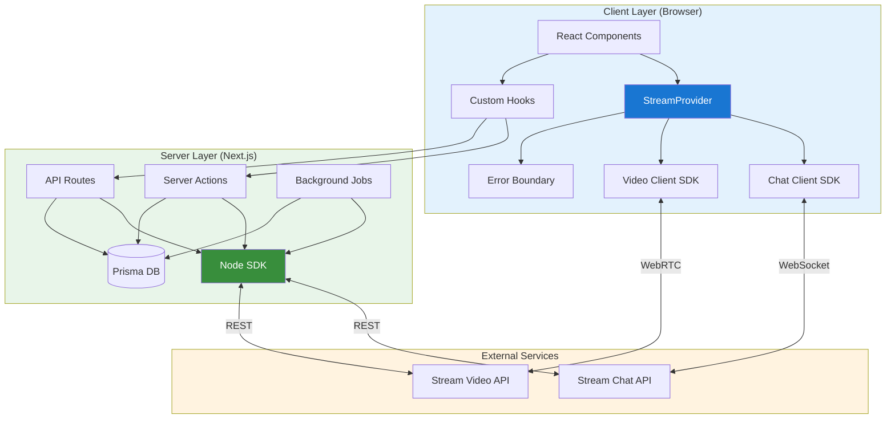
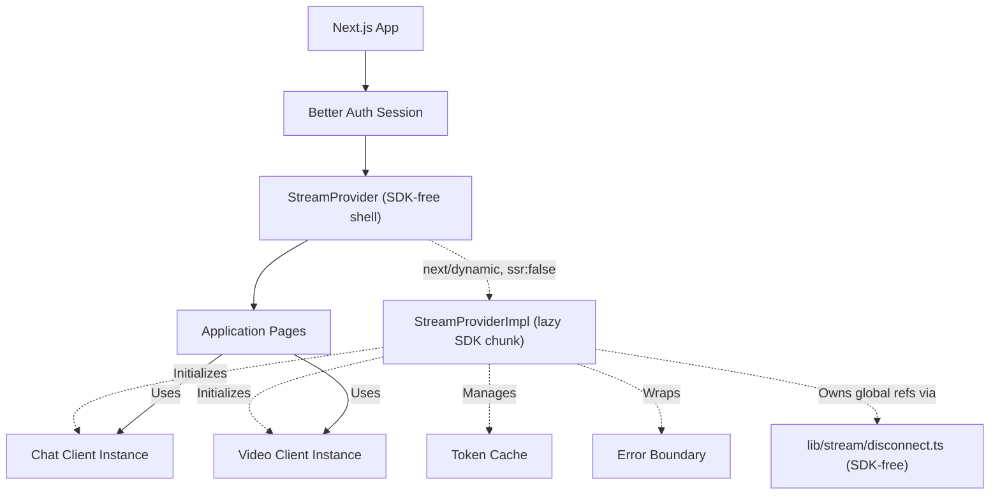
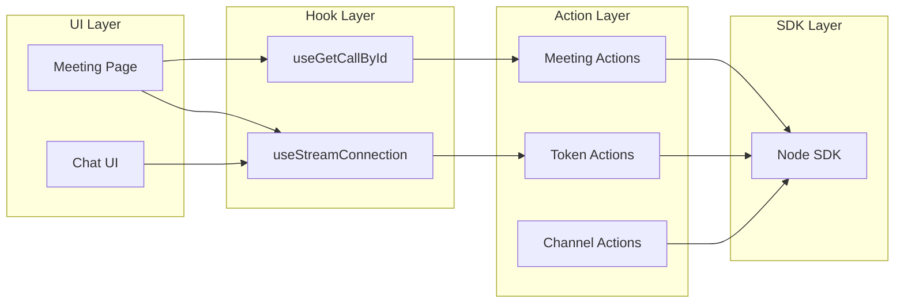
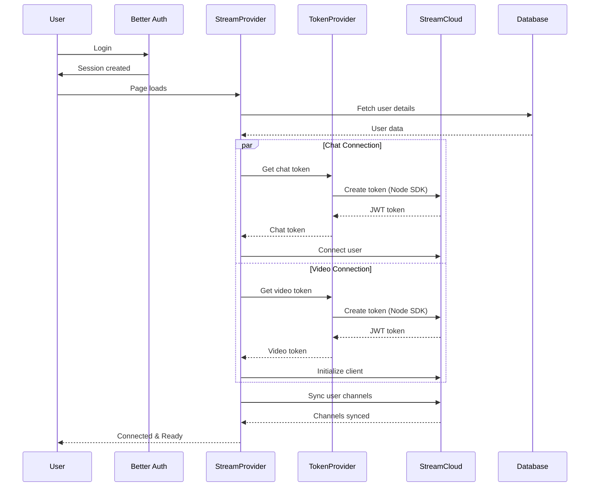
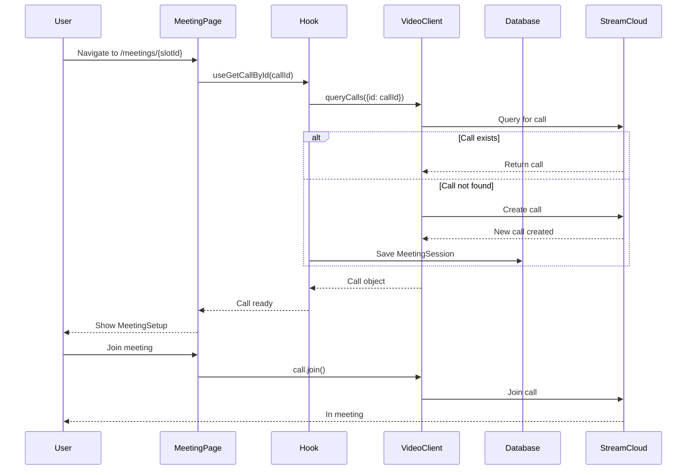
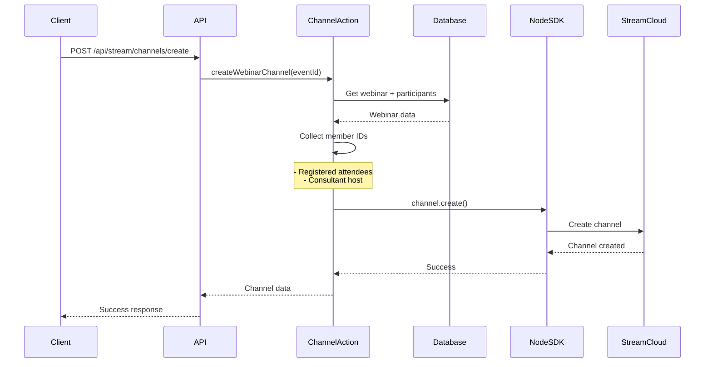
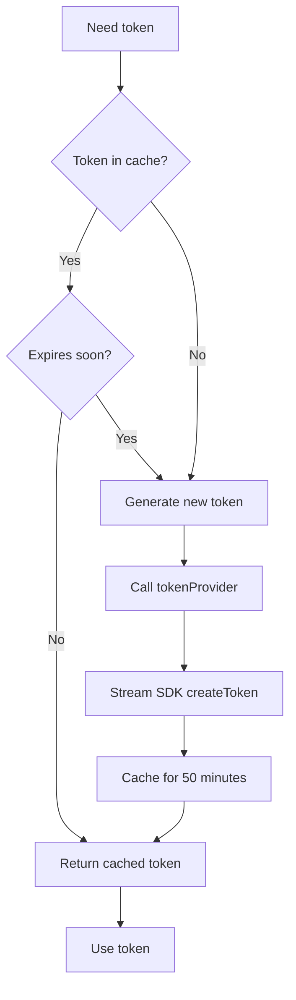

# 01. Architecture Overview

> Complete system architecture for Stream Chat and Video integration

## Table of Contents

- [System Architecture](#system-architecture)
- [Component Relationships](#component-relationships)
- [Data Flow](#data-flow)
- [Integration Points](#integration-points)
- [Key Design Patterns](#key-design-patterns)

---

## System Architecture

### High-Level Overview

The Stream SDK integration follows a three-tier architecture:

1. **Client Tier** - React components using Stream SDKs
2. **Server Tier** - Next.js API routes and server actions
3. **External Tier** - Stream Cloud services



### Component Breakdown

#### Client Components

| Component              | Location                                    | Purpose                                                                          |
| ---------------------- | ------------------------------------------- | -------------------------------------------------------------------------------- |
| **StreamProvider**     | `providers/StreamProvider.tsx`              | Thin, SDK-free shell that lazy-loads the implementation                          |
| **StreamProviderImpl** | `providers/StreamProviderImpl.tsx`          | Heavy implementation: initializes Chat & Video clients, manages connection state |
| **Disconnect Module**  | `lib/stream/disconnect.ts`                  | SDK-free shared client refs + `disconnectStreamClients`                          |
| **Chat Client**        | Stream SDK                                  | Manages real-time messaging connections                                          |
| **Video Client**       | Stream SDK                                  | Manages video call connections                                                   |
| **Meeting Components** | `app/meetings/[id]/`                        | Video call UI (Setup, Room, Controls)                                            |
| **Error Boundary**     | `components/stream/StreamErrorBoundary.tsx` | Catches and recovers from Stream errors                                          |
| **Custom Hooks**       | `app/meetings/[id]/hooks/`                  | React hooks for Stream operations                                                |

> **Provider split (PR #887, nav-perf):** The provider is split for bundle reasons. `providers/StreamProvider.tsx` is a thin, SDK-free shell that lazy-loads the heavy implementation `providers/StreamProviderImpl.tsx` via `next/dynamic(..., { ssr: false })`. All Stream SDK imports and the two SDK stylesheets live only in that lazy chunk, so routes that merely mount the provider no longer ship the SDK synchronously. The SDK-free module `lib/stream/disconnect.ts` owns the shared module-level client refs (chat, video, current user ID) plus `disconnectStreamClients`, so SDK-free callers (the navbar, other dashboards) can disconnect on logout without statically linking the SDK. See [Navigation Performance](../performance/01-navigation-performance.md) for the full rationale.

#### Server Components

| Component           | Location                                    | Purpose                              |
| ------------------- | ------------------------------------------- | ------------------------------------ |
| **Token Providers** | `actions/stream/chat/stream.action.ts`      | Generate JWT tokens for auth         |
| **User Actions**    | `actions/stream/chat/user.action.ts`        | User upsert, search, sync            |
| **Channel Actions** | `actions/stream/chat/channel.action.ts`     | Channel creation & management        |
| **Meeting Actions** | `actions/stream/meetings/meeting.action.ts` | Meeting session operations           |
| **Sync Job**        | `jobs/stream-sync.ts`                       | Daily user cleanup                   |
| **API Endpoints**   | `app/api/stream/`                           | REST endpoints for Stream operations |

---

## Component Relationships

### Provider Hierarchy



The shell renders `StreamProviderImpl` through `next/dynamic` with `ssr: false`, so the Stream SDK is never part of the synchronous bundle for a route that only mounts the provider. The implementation and the SDK-free `lib/stream/disconnect.ts` module share the same module-level client references, which lets a logout handler in any SDK-free component tear the connection down without pulling the SDK into that component's chunk.

### Dependency Graph



---

## Data Flow

### 1. User Authentication & Connection Flow



### 2. Meeting Join Flow



### 3. Channel Creation Flow



### 4. Token Refresh Flow



---

## Integration Points

### 1. Prisma Database Integration

Stream SDK integrates with Prisma for:

**User Management:**

```typescript
// Sync between Prisma and Stream
const user = await prisma.user.findUnique({ where: { id } });
await chatClient.upsertUser({
  id: user.id,
  name: user.name,
  image: user.image,
  role: mapRoleToStream(user.role), // "admin" only for staff/admins, "user" for everyone else
});
```

**Meeting Sessions:**

```prisma
model MeetingSession {
  id           String   @id @default(cuid())
  streamCallId String   @unique  // Maps to Stream Video call ID
  platform     Platform @default(STREAM)
  passcode     String?
  hostKeys     String[]
  recordings   Recording[]
  slotOfAppointment SlotOfAppointment @relation(...)
}
```

**Appointment Linking:**

- Consultations → 1-on-1 messaging channels
- Subscriptions → Recurring messaging channels
- Webinars → Group team channels
- Classes → Group team channels

### 2. Better Auth Session Management

```typescript
// StreamProvider uses session for initialization
const { data: session } = useSession(); // from "@/lib/auth-client"

if (session?.user?.id) {
  // Initialize Stream with authenticated user
  connectUserToStream(session.user.id);
}
```

### 3. Event System Integration

Channels are automatically created for:

| Event Type     | Channel ID Format     | Channel Type | Members                  |
| -------------- | --------------------- | ------------ | ------------------------ |
| Consultation   | `consultation-{id}`   | `messaging`  | Consultee + Consultant   |
| Subscription   | `subscription-{id}`   | `messaging`  | Consultee + Consultant   |
| Webinar        | `webinar-{id}`        | `team`       | All participants + host  |
| Class          | `class-{id}`          | `team`       | All participants + host  |
| Direct Message | `{userId1}-{userId2}` | `messaging`  | Two users (alphabetical) |

---

## Key Design Patterns

### 1. Dual-Client Pattern

**Problem:** Need both Chat and Video functionality
**Solution:** Single provider initializes both clients

```typescript
// StreamProvider manages both clients
const [chatClient, setChatClient] = useState<StreamChat>();
const [videoClient, setVideoClient] = useState<StreamVideoClient>();

// Parallel initialization
Promise.all([initializeChatClient(), initializeVideoClient()]);
```

**Benefits:**

- Single connection state
- Shared token caching
- Unified error handling

### 2. Token Caching with Safety Buffer

**Problem:** Tokens expire after 1 hour, causing disconnections
**Solution:** Cache tokens for 50 minutes (10-minute safety buffer)

```typescript
const TOKEN_CACHE_DURATION = 50 * 60 * 1000; // 50 minutes

if (Date.now() - cachedToken.timestamp > TOKEN_CACHE_DURATION) {
  // Refresh token before it expires
  const newToken = await generateToken();
}
```

**Benefits:**

- Prevents mid-session disconnections
- Reduces token generation API calls
- Smooth user experience

### 3. Exponential Backoff Retry

**Problem:** Network failures causing permanent disconnection
**Solution:** Retry with increasing delays

```typescript
const delays = [1000, 2000, 4000, 8000, 16000]; // Max 30s
for (let attempt = 0; attempt < 5; attempt++) {
  try {
    await connectUser();
    break;
  } catch (error) {
    await delay(delays[attempt]);
  }
}
```

**Benefits:**

- Handles temporary network issues
- Prevents server overload
- Better user experience

### 4. Atomic Channel Creation

**Problem:** Race conditions when multiple users create same channel
**Solution:** Create channel with all members atomically

```typescript
// Create channel AND add members in one operation
await channel.create({
  members: [consultant, consultee],
  data: {
    /* channel metadata */
  },
});
```

**Benefits:**

- No race conditions
- Consistent membership
- Idempotent operations

### 5. Event-Based Channel Sync

**Problem:** Users may miss channels created while offline
**Solution:** Sync channels on provider initialization

```typescript
useEffect(() => {
  if (chatConnected) {
    // Sync all event channels user should have access to
    syncUserEventChannels(userId);
  }
}, [chatConnected]);
```

**Benefits:**

- Always up-to-date channels
- Handles offline scenarios
- Automatic recovery

> **Note (PR #887, #248):** This one-time sync now runs inside the deferred initial connect (scheduled with `requestIdleCallback`) rather than synchronously on provider mount, and it is guarded so it is a no-op after the first sync. This keeps the sync off the dashboard-home critical path while preserving the recovery behaviour described above. See [Connection Optimization](#connection-optimization) and [Navigation Performance](../performance/01-navigation-performance.md).

---

## Architecture Decisions

### Why Two Separate SDKs?

**Chat SDK:**

- Optimized for messaging
- Built-in typing indicators
- Message persistence
- Channel types and permissions

**Video SDK:**

- Optimized for WebRTC
- Call quality management
- Device handling
- Recording capabilities

**Decision:** Use both for specialized features rather than one monolithic SDK

### Why Server-Side Token Generation?

**Security:** API secrets never exposed to client
**Control:** Centralized user validation
**Flexibility:** Custom token claims and expiry

```typescript
// Server Action (secure)
export async function tokenProvider(userId: string) {
  const user = await validateUser(userId);
  return streamClient.createToken(userId, exp);
}
```

### Why Lazy Channel Creation?

**Current:** Channels created on first access
**Alternative:** Eager creation on appointment booking

**Tradeoffs:**

- ✅ Lower Stream API usage
- ✅ No orphaned channels
- ⚠️ Potential race conditions (see [Troubleshooting - Channel Creation Race Conditions](./troubleshooting.md#channel-creation-race-conditions-medium))
- ⚠️ First-access latency

### Why Daily User Sync Job?

**Purpose:** Clean up users deleted from Prisma but still in Stream

**Tradeoffs:**

- ✅ Keeps Stream/Prisma in sync
- ✅ Reduces Stream billing
- ⚠️ Hard delete (no recovery)
- ⚠️ Deletes all user messages

**See:** [09. Background Sync](./09-background-sync.md)

---

## Security Considerations

### Least-Privilege Stream Roles (#899)

**Current:** Only platform staff and admins get Stream's global `admin` role. Everyone else, consultants included, is mapped to the plain `user` role.

```typescript
// File: lib/user.ts
export function mapRoleToStream(role: string | null | undefined): string {
  switch (role?.toUpperCase()) {
    case "ADMIN":
    case "STAFF":
      return "admin";
    default:
      return "user";
  }
}
```

**How hosts get moderation:**

- Channel creation is performed server-side
- Each host receives a channel-scoped `channel_moderator` grant on their own host channels at creation time
- No global admin grant, and no moderation rights over unrelated peer direct-message channels

**See:** [Troubleshooting - Universal Admin Role](./troubleshooting.md#universal-admin-role-critical)

### Token Security

✅ **Good Practices:**

- Tokens generated server-side only
- Short expiry (1 hour)
- User validation before generation
- Secure storage (not in localStorage)

⚠️ **Areas for Improvement:**

- No token revocation mechanism
- No audit logging for token generation
- No rate limiting on token endpoints

---

## Performance Considerations

### Connection Optimization

**Parallel Initialization:**

```typescript
// Chat and Video connect simultaneously
Promise.all([
  chatClient.connectUser(...),
  new StreamVideoClient(...)
])
```

**Result:** ~2-3 second total connection time instead of 4-6 seconds

**Deferred initial connect (PR #887, #248):** The initial connect (`connectUser` plus the one-time `syncUserEventChannels`) is deferred off the dashboard-home critical path via `requestIdleCallback` (with a `setTimeout` fallback). This removes the prior storm of roughly 50–100 `queryChannels` and video-connect calls that fired on dashboard load. The chat sidebar's channel fetch is now split into an initial fetch keyed on the client plus the org scope, and a separate listener effect keyed on the client alone. An in-flight fetch-key guard ensures that rapid channel clicks and mid-fetch org-scope switches no longer refire the storm or strand the wrong tenant's data: a duplicate fetch for the same key is skipped, while a fetch for a new key (an org-scope switch during an in-flight fetch) proceeds so the new scope actually loads. See [Navigation Performance](../performance/01-navigation-performance.md) for the measured impact.

**Connection robustness (PR #887):** On a user switch the _global_ clients are disconnected, not just local React state, so a stale connection cannot survive the swap. Logout teardown uses `Promise.allSettled` and always clears global state even if an individual disconnect rejects. A Join click awaits a short readiness window (`waitForGlobalVideoClient`) so a click that lands during the deferred connect does not fail; if the client is still not ready it falls back to a soft "Connecting…" toast. `useStreamConnection` returns a safe default when called outside the provider, which keeps consumers from crashing during the lazy-load window (only the development `DebugDialog` relies on this hook).

### Token Caching

**Impact:**

- **Without cache:** 2 API calls per page load
- **With cache:** ~2 API calls per hour
- **Savings:** 95% reduction in token generation calls

### Channel Query Optimization

**Pagination:** 100 users per page for background sync
**Filtering:** Only fetch relevant channels
**Caching:** Channels cached client-side

---

## Scalability

### Current Limits

| Resource               | Limit                | Notes                       |
| ---------------------- | -------------------- | --------------------------- |
| Concurrent connections | Unlimited (per plan) | Based on Stream pricing     |
| Channels per user      | ~100 recommended     | Performance degrades beyond |
| Messages per channel   | Unlimited            | Archived after 30 days      |
| Call participants      | 100 (default)        | Configurable per call type  |

### Horizontal Scaling

**Client-side:** Fully scalable (stateless)
**Server-side:** Stateless actions (easily scaled)
**Background jobs:** Single instance (cron-based)

### Bottlenecks

1. **Token generation:** Could become bottleneck at scale → Solution: Token caching
2. **Channel sync:** O(n) per user → Solution: Batch operations
3. **User sync job:** Sequential processing → Solution: Parallel batch deletion

---

## Next Steps

**For detailed implementation:**

- [02. Setup & Configuration](./02-setup-configuration.md) - Get started
- [03. Provider & Authentication](./03-provider-authentication.md) - Deep dive into StreamProvider
- [04. Chat Implementation](./04-chat-implementation.md) - Messaging features
- [05. Video Implementation](./05-video-implementation.md) - Video calls
- [13. Recording & Webhooks](./13-recording-webhooks.md) - Recording and webhooks

**For troubleshooting:**

- [Troubleshooting](./troubleshooting.md) - Common problems and known issues

---

← [Setup & Configuration](./02-setup-configuration.md) →
