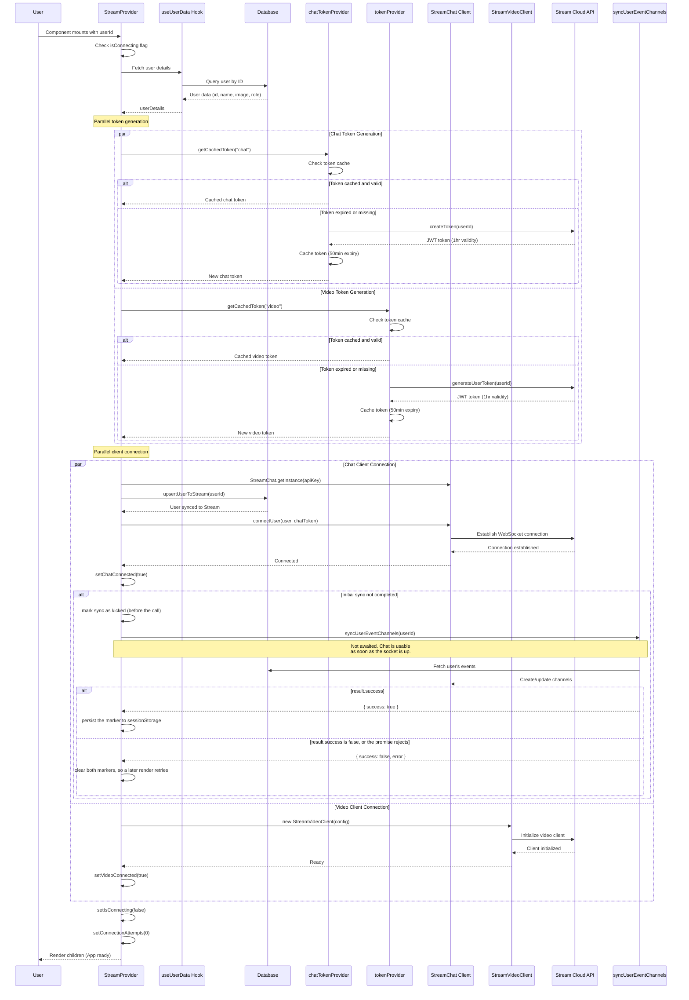
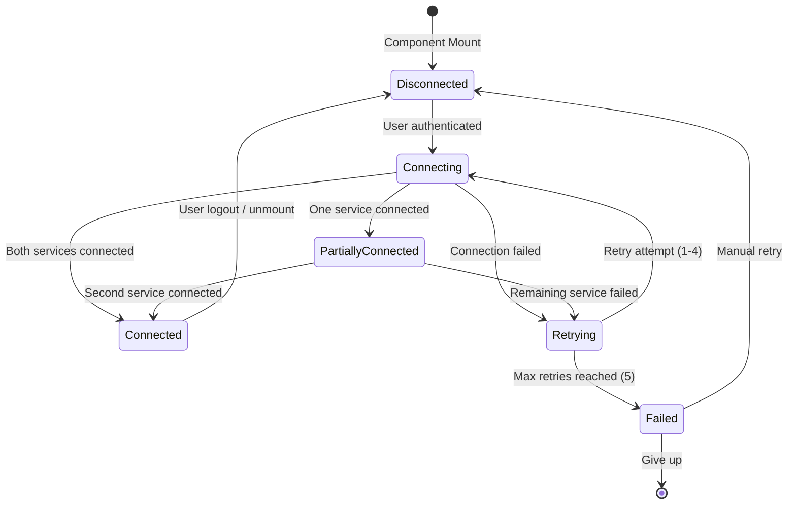

# 03. Provider & Authentication

> Deep dive into StreamProvider architecture, connection lifecycle, token management, and error recovery

## Table of Contents

- [Provider Architecture](#provider-architecture)
- [Initialization Sequence](#initialization-sequence)
- [Connection State Management](#connection-state-management)
- [Token Caching Strategy](#token-caching-strategy)
- [Error Boundary Integration](#error-boundary-integration)
- [Retry Logic with Exponential Backoff](#retry-logic-with-exponential-backoff)
- [Advanced Topics](#advanced-topics)

---

## Provider Architecture

### Dual-Client Design Pattern

**File:** `providers/StreamProviderImpl.tsx` (the SDK-free shell lives in `providers/StreamProvider.tsx`)

StreamProvider manages two SDK clients — one for chat, one for video — but holds them in a **single piece of state**:

```typescript
// One settled value, not two independent ones
interface SettledStreamClients {
  chat: StreamChat | null;
  video: StreamVideoClient | null;
}
const [clients, setClients] = useState<SettledStreamClients | null>(null);
```

`null` means "not settled yet", which is deliberately distinct from a settled result whose `chat` or `video` is `null` because that particular connect failed.

#### Why one state and not two

This is the most important thing to understand before changing this file, because the obvious refactor — a `useState` per client — is the bug.

The provider wraps its children in `<Chat>` and `<StreamVideo>` only once a client exists. With two independent states set by two async connects that race, the element occupying that wrapper slot changed **type** between renders: `children`, then `<StreamVideo>`, then `<Chat>`, in whichever order the sockets happened to settle. React cannot reconcile a change of element type in place — it unmounts the old tree and mounts a new one — and the subtree here is the entire dashboard.

The user-visible symptom was a join button that appeared to do nothing: the click started a join, the dashboard remounted underneath it as the second client connected, and the in-flight join was destroyed. People pressed it repeatedly.

Committing both clients in one `setClients` makes the tree shape a pure function of one value, so it changes exactly once per session: unwrapped while connecting, then wrapped once both connects settle. A connect that genuinely _fails_ can still cost a second change if a later retry succeeds; that is accepted, because withholding the client that did connect would break the sidebar's chat-unread badge on every route (#248).

The nesting order is fixed — `<Chat>` outside, `<StreamVideo>` inside — for the same reason. Order must not depend on arrival order.

#### 1. Chat Client (`StreamChat`)

**Package:** `stream-chat`
**Protocol:** WebSocket
**Purpose:** Real-time messaging

```typescript
import { StreamChat } from "stream-chat";

const client = StreamChat.getInstance(apiKey);
await client.connectUser(
  {
    id: userId,
    name: userName,
    image: userImage,
    role: streamRole,
  },
  () => getCachedToken("chat"),
);
```

**Features:**

- 1-on-1 messaging
- Group channels
- Read receipts
- Typing indicators
- Message reactions
- Channel synchronization

#### 2. Video Client (`StreamVideoClient`)

**Package:** `@stream-io/video-react-sdk`
**Protocol:** WebRTC
**Purpose:** Video/audio calling

```typescript
import { StreamVideoClient } from "@stream-io/video-react-sdk";

const client = new StreamVideoClient({
  apiKey: apiKey,
  user: {
    id: userId,
    name: userName,
    image: userImage,
  },
  tokenProvider: () => getCachedToken("video"),
});
```

**Features:**

- 1-on-1 video calls
- Group meetings
- Screen sharing
- Device management
- Call statistics

### Why Separate Clients?

| Aspect             | Chat Client           | Video Client       |
| ------------------ | --------------------- | ------------------ |
| **Protocol**       | WebSocket             | WebRTC             |
| **Connection**     | Long-lived persistent | On-demand per call |
| **Token Provider** | One-time              | Callback function  |
| **Initialization** | `connectUser()`       | Constructor        |
| **Disconnect**     | `disconnectUser()`    | No explicit method |

### Component Structure

```typescript
export default function StreamProvider({
  children,
  userId,
  enableChat = true,
  enableVideo = true,
}: StreamProviderProps) {
  // Connection state — both clients in ONE value, see "Why one state and not two"
  const [clients, setClients] = useState<SettledStreamClients | null>(null);
  const [chatConnected, setChatConnected] = useState(false);
  const [videoConnected, setVideoConnected] = useState(false);
  const [isConnecting, setIsConnecting] = useState(false);
  const [error, setError] = useState<string | null>(null);
  const [connectionAttempts, setConnectionAttempts] = useState(0);
  const [hasInitialSyncCompleted, setHasInitialSyncCompleted] = useState(false);

  // Token cache
  const [tokenCache, setTokenCache] = useState<{
    chatToken?: string;
    videoToken?: string;
    expiresAt?: number;
  }>({});

  // Connection logic (see below)
  useEffect(() => {
    if (!isLoading && userDetails && apiKey) {
      connectServices();
    }
    return () => {
      disconnect();
    };
  }, [userDetails, isLoading, apiKey]);

  // Built up in a fixed order from the single settled value, so the tree shape
  // never depends on which socket connected first.
  let content = children;
  if (clients?.video) {
    content = <StreamVideo client={clients.video}>{content}</StreamVideo>;
  }
  if (clients?.chat) {
    content = <Chat client={clients.chat}>{content}</Chat>;
  }

  return (
    <StreamErrorBoundary onError={handleError} enableRetry={true}>
      <StreamConnectionContext.Provider value={connectionState}>
        {content}
      </StreamConnectionContext.Provider>
    </StreamErrorBoundary>
  );
}
```

**Nested Provider Pattern:**

- Outermost: `StreamErrorBoundary` (error handling)
- Middle: `StreamConnectionContext` (connection state)
- Inner: `Chat` → `StreamVideo` → `children` (SDK providers)

Note that the connection _flags_ (`chatConnected`, `videoConnected`, `isConnecting`) are still separate state. That is fine and intentional: they feed the context value, which changes what consumers render but not the shape of the tree above them.

---

## Initialization Sequence

### Complete Flow Diagram



### Step-by-Step Breakdown

#### Step 1: User Data Fetching (Lines 74)

```typescript
const { userDetails, isLoading } = useUserData(userId);
```

**What happens:**

- Hook fetches user from database
- Retrieves: `id`, `name`, `image`, `role`
- Waits until `!isLoading` before proceeding

**Database Query:**

```typescript
// Inside useUserData hook
const user = await prisma.user.findUnique({
  where: { id: userId },
  select: {
    id: true,
    name: true,
    image: true,
    role: true,
  },
});
```

#### Step 2: Token Cache Check (Lines 76-121)

```typescript
const [tokenCache, setTokenCache] = useState<{
  chatToken?: string;
  videoToken?: string;
  expiresAt?: number;
}>({});

const isTokenValid = useCallback(
  (type: "chat" | "video") => {
    const token =
      type === "chat" ? tokenCache.chatToken : tokenCache.videoToken;
    const expiresAt = tokenCache.expiresAt;

    if (!token || !expiresAt) return false;

    // Check if token expires within next 5 minutes
    return Date.now() < expiresAt - 5 * 60 * 1000;
  },
  [tokenCache],
);

const getCachedToken = useCallback(
  async (type: "chat" | "video"): Promise<string> => {
    if (isTokenValid(type)) {
      return type === "chat" ? tokenCache.chatToken! : tokenCache.videoToken!;
    }

    // Generate new token
    const newToken =
      type === "chat"
        ? await chatTokenProvider(userId)
        : await tokenProvider(userId);

    // Cache with 50-minute expiry (tokens usually last 1 hour)
    const expiresAt = Date.now() + 50 * 60 * 1000;

    setTokenCache((prev) => ({
      ...prev,
      [`${type}Token`]: newToken,
      expiresAt,
    }));

    return newToken;
  },
  [userId, tokenCache, isTokenValid],
);
```

**Token Generation (Server Actions):**

```typescript
// actions/stream/chat/stream.action.ts

// Chat token
export const chatTokenProvider = async (userId: string) => {
  const serverClient = StreamChat.getInstance(apiKey, apiSecret);
  const token = serverClient.createToken(userId);
  return token;
};

// Video token
export const tokenProvider = async (userId: string) => {
  const client = new StreamClient(apiKey, apiSecret);
  const exp = Math.round(Date.now() / 1000) + 60 * 60; // 1 hour
  const issued = Math.round(Date.now() / 1000) - 60; // 1 minute ago

  const token = client.generateUserToken({
    user_id: userId,
    exp,
    iat: issued,
  });

  return token;
};
```

#### Step 3: Chat Client Connection (Lines 128-189)

```typescript
const connectChat = useCallback(async () => {
  if (!enableChat || !userDetails || !apiKey || chatConnected) return;

  try {
    console.log(`Connecting user ${userDetails.id} to Stream Chat`);

    const client = StreamChat.getInstance(apiKey);

    // Ensure user exists in Stream's database
    try {
      await upsertUserToStream(userDetails.id);
      console.log(`User ${userDetails.id} upserted to Stream`);
    } catch (upsertError) {
      console.warn("User upserting failed, continuing:", upsertError);
    }

    const streamRole = mapRoleToStream(userDetails.role);

    await client.connectUser(
      {
        id: userDetails.id,
        name: userDetails.name ?? userDetails.id,
        image: userDetails.image ?? undefined,
        role: streamRole, // "admin" only for staff/admins, "user" for everyone else
      },
      () => getCachedToken("chat"),
    );

    setChatClient(client);
    setChatConnected(true);

    // Initial channel sync, once per user per browser session.
    //
    // Deliberately NOT awaited. The sync costs roughly 1 + W + C + D + ceil(N/100)
    // Stream round trips, so a consultant with two hundred clients waited eight
    // to twenty seconds with chat apparently dead before it was ever marked
    // connected. Chat is usable the moment the socket is up, and channels stream
    // into the sidebar as they land.
    if (!alreadySynced) {
      // Marked BEFORE the call, not after. This flag means "we have kicked the
      // sync for this user"; marking on completion let a re-render start a
      // second one while the first was still in flight.
      clientSyncCompletedUsers.add(userDetails.id);

      void syncUserEventChannels(userDetails.id)
        .then((result) => {
          // syncUserEventChannels reports failure by RESOLVING with
          // { success: false }, not by rejecting. A `.then` that ignores its
          // argument therefore treats a failed sync as a completed one, and the
          // sessionStorage marker then suppresses the retry for the rest of the
          // tab's life. The `.catch` below only ever sees the thrown case.
          if (!result?.success) {
            markSyncIncomplete(userDetails.id, syncKey);
            return;
          }
          sessionStorage.setItem(syncKey, "1");
        })
        .catch(() => {
          markSyncIncomplete(userDetails.id, syncKey);
        });
    }

    console.log(`Chat connection successful for user ${userDetails.id}`);
  } catch (error) {
    console.error("Chat connection failed:", error);
    setChatConnected(false);
    throw error;
  }
}, [
  enableChat,
  userDetails,
  apiKey,
  chatConnected,
  hasInitialSyncCompleted,
  getCachedToken,
]);
```

**Key Points:**

- Singleton pattern: `StreamChat.getInstance()` returns same instance
- User upserted to Stream database before connection
- Role mapping via `mapRoleToStream()` (returns "admin" only for staff/admins, "user" for everyone else)
- Token provided as callback function
- Channel sync only runs once per session
- Errors thrown to trigger retry logic

#### Step 4: Video Client Connection (Lines 191-215)

```typescript
const connectVideo = useCallback(async () => {
  if (!enableVideo || !userDetails || !apiKey || videoConnected) return;

  try {
    console.log(`Connecting user ${userDetails.id} to Stream Video`);

    const client = new StreamVideoClient({
      apiKey: apiKey,
      user: {
        id: userDetails.id,
        name: userDetails.name ?? userDetails.id,
        image: userDetails.image ?? undefined,
      },
      tokenProvider: () => getCachedToken("video"),
    });

    setVideoClient(client);
    setVideoConnected(true);
    console.log(`Video connection successful for user ${userDetails.id}`);
  } catch (error) {
    console.error("Video connection failed:", error);
    setVideoConnected(false);
    throw error;
  }
}, [enableVideo, userDetails, apiKey, videoConnected, getCachedToken]);
```

**Key Differences from Chat:**

- New instance created (no singleton)
- Token provider as callback (called when needed)
- No explicit connection method
- Initialization completes synchronously

#### Step 5: Parallel Connection Execution (Lines 217-268)

```typescript
const connectServices = useCallback(async () => {
  if (isLoading || !userDetails || isConnecting) return;

  setIsConnecting(true);
  setError(null);

  try {
    // allSettled, not all: `all` rejects on the first failure and abandons the
    // other promise's result, so a chat failure threw away a good video client.
    // Each connect RESOLVES to its client (or null) rather than setting state,
    // so both land in one commit below.
    const [chatResult, videoResult] = await Promise.allSettled([
      connectChat(),
      connectVideo(),
    ]);

    setClients({
      chat: chatResult.status === "fulfilled" ? chatResult.value : null,
      video: videoResult.status === "fulfilled" ? videoResult.value : null,
    });

    // Retry is still driven by a rejection, so re-throw the first one.
    const failure = [chatResult, videoResult].find(
      (result) => result.status === "rejected",
    );
    if (failure?.status === "rejected") throw failure.reason;

    setConnectionAttempts(0); // Reset on success
  } catch (error) {
    const errorMessage =
      error instanceof Error ? error.message : "Connection failed";
    setError(errorMessage);

    // Implement exponential backoff retry
    const newAttempts = connectionAttempts + 1;
    setConnectionAttempts(newAttempts);

    if (newAttempts < 5) {
      const delay = getRetryDelay(newAttempts);
      console.log(`Retrying connection in ${delay}ms (attempt ${newAttempts})`);
      setTimeout(() => {
        setIsConnecting(false);
        connectServices();
      }, delay);
      return;
    } else {
      console.error("Max connection attempts reached");
    }
  } finally {
    setIsConnecting(false);
  }
}, [
  isLoading,
  userDetails,
  isConnecting,
  enableChat,
  enableVideo,
  chatConnected,
  videoConnected,
  connectChat,
  connectVideo,
  connectionAttempts,
  getRetryDelay,
]);
```

**Performance Benefit:**

```
Sequential: chat (2-3s) + video (2-3s) = 4-6s total
Parallel:   max(2-3s, 2-3s) = 2-3s total

Speed improvement: ~50% faster
```

---

## Connection State Management

### State Variables

```typescript
interface StreamConnectionState {
  chatConnected: boolean; // Chat WebSocket active
  videoConnected: boolean; // Video client initialized
  isConnecting: boolean; // Connection in progress
  error: string | null; // Last error message
  retryConnection: () => void; // Manual retry function
}
```

**Implementation (Lines 28-46):**

```typescript
const StreamConnectionContext = createContext<StreamConnectionState | null>(
  null,
);

export const useStreamConnection = () => {
  const context = useContext(StreamConnectionContext);
  if (!context) {
    throw new Error("useStreamConnection must be used within StreamProvider");
  }
  return context;
};
```

### State Transition Diagram



### Connection State Access

**Usage in Components:**

```typescript
"use client";

import { useStreamConnection } from "@/providers/StreamProvider";

export function ConnectionStatus() {
  const {
    chatConnected,
    videoConnected,
    isConnecting,
    error,
    retryConnection,
  } = useStreamConnection();

  if (isConnecting) {
    return <div>Connecting to Stream...</div>;
  }

  if (error) {
    return (
      <div>
        <p>Error: {error}</p>
        <button onClick={retryConnection}>Retry</button>
      </div>
    );
  }

  return (
    <div>
      <p>Chat: {chatConnected ? "✅" : "❌"}</p>
      <p>Video: {videoConnected ? "✅" : "❌"}</p>
    </div>
  );
}
```

### Loading States

**The provider no longer blocks children behind a spinner.** It used to: while either client was unconnected it returned a spinner instead of `children`, which gated the entire dashboard on two websocket handshakes even on routes with no chat or video UI at all.

Children now render immediately and the wrappers appear around them once the clients settle. Video consumers already guard a null client, and chat consumers only render on the chat route, underneath `<Chat>`.

The only spinner left is in the SDK-free shell (`providers/StreamProvider.tsx`), shown during the brief window where the lazy impl chunk is still downloading:

```typescript
const LazyStreamProviderImpl = dynamic(
  () => import("@/providers/StreamProviderImpl"),
  { ssr: false, loading: () => <StreamProviderLoading /> },
);
```

If you are tempted to reintroduce a connection gate here, note that it interacts badly with the single-commit design above: gating on "all clients ready" turns one shape change into a shape change plus an unmount, and a permanently failing service would hold the whole dashboard hostage.

### Error States

Error UI shown after max retries (Lines 337-352):

```typescript
if (error && connectionAttempts >= 5) {
  return (
    <div className="flex flex-col items-center justify-center min-h-[200px] p-4">
      <div className="text-red-600 text-center">
        <h3 className="font-semibold mb-2">Connection Failed</h3>
        <p className="text-sm mb-4">{error}</p>
        <button
          onClick={retryConnection}
          className="px-4 py-2 bg-blue-600 text-white rounded hover:bg-blue-700"
        >
          Retry Connection
        </button>
      </div>
    </div>
  );
}
```

---

## Token Caching Strategy

### Why Cache Tokens?

**Problem without caching:**

- ❌ API call on every render
- ❌ Slow (200-500ms per token)
- ❌ Expensive (counts toward API limits)
- ❌ Unnecessary (tokens valid for 1 hour)

**Solution with caching:**

- ✅ Generate token once
- ✅ Reuse for 50 minutes
- ✅ Auto-refresh before expiry
- ✅ Reduced API calls by ~98%

### Cache Implementation (Lines 76-121)

```typescript
const [tokenCache, setTokenCache] = useState<{
  chatToken?: string;
  videoToken?: string;
  expiresAt?: number;
}>({});

const isTokenValid = useCallback(
  (type: "chat" | "video") => {
    const token =
      type === "chat" ? tokenCache.chatToken : tokenCache.videoToken;
    const expiresAt = tokenCache.expiresAt;

    if (!token || !expiresAt) return false;

    // Check if token expires within next 5 minutes
    return Date.now() < expiresAt - 5 * 60 * 1000;
  },
  [tokenCache],
);

const getCachedToken = useCallback(
  async (type: "chat" | "video"): Promise<string> => {
    if (isTokenValid(type)) {
      console.log(`Using cached ${type} token`);
      return type === "chat" ? tokenCache.chatToken! : tokenCache.videoToken!;
    }

    // Generate new token
    console.log(`Generating new ${type} token`);
    const newToken =
      type === "chat"
        ? await chatTokenProvider(userId)
        : await tokenProvider(userId);

    // Cache with 50-minute expiry (tokens usually last 1 hour)
    const expiresAt = Date.now() + 50 * 60 * 1000;

    setTokenCache((prev) => ({
      ...prev,
      [`${type}Token`]: newToken,
      expiresAt,
    }));

    return newToken;
  },
  [userId, tokenCache, isTokenValid],
);
```

### Token Lifecycle Timeline

```
Time    Event                     Token State
-----   -------------------------  ------------------
0:00    Token generated           Valid (expires 1:00)
0:00    Cached                    Cached (expires 0:50)
0:30    Token requested           ✅ Cached token used
0:49    Token requested           ✅ Cached token used
0:50    Cache expires             ⚠️ Generate new token
0:50    New token generated       Valid (expires 1:50)
0:50    New token cached          Cached (expires 1:40)
1:00    Old token expires         (Already replaced at 0:50)
```

### Why 50 Minutes (Not 60)?

**Token Validity:** 1 hour (3600 seconds)
**Cache Duration:** 50 minutes (3000 seconds)
**Safety Buffer:** 10 minutes (600 seconds)

**Reasoning:**

1. **Prevents mid-operation expiry**
   - Token refreshed before critical operations
   - No connection drops during long sessions

2. **Handles clock drift**
   - Server/client time differences
   - Network latency tolerance

3. **Covers edge cases**
   - Slow network connections
   - Token validation delays
   - Race conditions

⚠️ **Known Issue:** 10-minute buffer may not be enough for some edge cases.
See: [Troubleshooting - Token Expiry Race Condition](./troubleshooting.md#token-expiry-race-condition-medium)

### Cache Invalidation (Lines 276-298)

Disconnection is **not** owned by the provider and does **not** happen on unmount. The clients live in module-level refs in `lib/stream/disconnect.ts` — an SDK-free module so that callers which only need to disconnect (Navbar, UserDropdown, the org/admin/staff layouts) do not statically link the heavy SDK into their bundles.

```typescript
export async function disconnectStreamClients(): Promise<void> {
  const promises: Promise<void>[] = [];
  if (globalChatClient) promises.push(globalChatClient.disconnectUser().then(...));
  if (globalVideoClient) promises.push(globalVideoClient.disconnectUser().then(...));

  // allSettled (not all): a rejected disconnectUser() must NOT skip the global
  // teardown below — stale refs after a failed logout would let the next login
  // adopt the prior user's connection.
  await Promise.allSettled(promises);

  globalChatClient = null;
  globalVideoClient = null;
  currentUserId = null;
  clearAllStreamCaches();
}
```

**Why unmount does not disconnect:** the clients are deliberately kept alive across remounts and tab switches, so navigating between dashboard routes does not pay for a fresh websocket handshake each time. The provider adopts an existing global client for the same user rather than building a new one.

**The one case that must tear down** is a _different_ user appearing — on a fresh mount the provider's local `clients` state is `null` while the globals still point at the previous user. The provider therefore calls `disconnectStreamClients()` (global refs) rather than any local teardown, which would no-op and leak the prior user's connection for the next connect to adopt.

**Disconnect happens on:**

- User logout (the primary path)
- A different user mounting the provider
- Not on unmount, and not on connection error — the retry loop owns that

---

## Error Boundary Integration

### StreamErrorBoundary Component

**File:** `/components/stream/StreamErrorBoundary.tsx` (Lines 1-234)

Provider wrapped in error boundary for crash recovery (Lines 368-378):

```typescript
return (
  <StreamErrorBoundary
    onError={(error, errorInfo) => {
      console.error("Stream Provider Error:", error, errorInfo);
      setError(error.message);
    }}
    enableRetry={true}
  >
    <StreamConnectionContext.Provider value={connectionState}>
      {content}
    </StreamConnectionContext.Provider>
  </StreamErrorBoundary>
);
```

### Error Boundary Implementation

```typescript
export class StreamErrorBoundary extends React.Component<
  StreamErrorBoundaryProps,
  StreamErrorBoundaryState
> {
  private retryCount = 0;
  private maxRetries = 3;

  static getDerivedStateFromError(
    error: Error,
  ): Partial<StreamErrorBoundaryState> {
    // Determine error type based on error message
    let errorType: "chat" | "video" | "general" = "general";

    const errorString = error.toString().toLowerCase();
    if (errorString.includes("chat") || errorString.includes("message")) {
      errorType = "chat";
    } else if (errorString.includes("video") || errorString.includes("call")) {
      errorType = "video";
    }

    return {
      hasError: true,
      error,
      errorType,
    };
  }

  componentDidCatch(error: Error, errorInfo: React.ErrorInfo) {
    console.error("StreamErrorBoundary caught an error:", error, errorInfo);

    this.setState({
      error,
      errorInfo,
    });

    // Call custom error handler if provided
    if (this.props.onError) {
      this.props.onError(error, errorInfo);
    }

    // Log to monitoring service in production
    if (process.env.NODE_ENV === "production") {
      console.error("Stream Error Boundary:", {
        error: error.message,
        stack: error.stack,
        componentStack: errorInfo.componentStack,
        errorType: this.state.errorType,
        retryCount: this.retryCount,
      });
    }
  }

  handleRetry = () => {
    if (this.retryCount < this.maxRetries) {
      this.retryCount++;
      console.log(
        `Retrying Stream component (attempt ${this.retryCount}/${this.maxRetries})`,
      );

      this.setState({
        hasError: false,
        error: null,
        errorInfo: null,
        errorType: "general",
      });
    } else {
      console.warn("Maximum retry attempts reached for Stream component");
    }
  };
}
```

### Error Types Handled

| Error Type         | Detection                 | Recovery                    |
| ------------------ | ------------------------- | --------------------------- |
| **Authentication** | "token", "authentication" | Regenerate token, reconnect |
| **Network**        | "network", "connection"   | Exponential backoff retry   |
| **Permission**     | "permission"              | Log error, notify user      |
| **API Error**      | HTTP status codes         | Retry with delay            |
| **Unknown**        | Catchall                  | Single retry attempt        |

### Custom Error Messages

```typescript
const getErrorMessage = () => {
  if (!error) return "An unknown error occurred";

  if (
    error.message.includes("token") ||
    error.message.includes("authentication")
  ) {
    return "Authentication failed. Please refresh the page to reconnect.";
  }

  if (
    error.message.includes("network") ||
    error.message.includes("connection")
  ) {
    return "Network connection failed. Please check your internet and try again.";
  }

  if (error.message.includes("permission")) {
    return "Permission denied. Please ensure you have the necessary permissions.";
  }

  return error.message;
};
```

---

## Retry Logic with Exponential Backoff

### Why Exponential Backoff?

**Linear Retry Issues:**

```
Attempt 1: 1s delay  → Server still down
Attempt 2: 1s delay  → Server still down
Attempt 3: 1s delay  → Server still down
Attempt 4: 1s delay  → Server still down
Result: Wasted retries, server overloaded
```

**Exponential Backoff Benefits:**

```
Attempt 1: 1s delay   → Server recovering
Attempt 2: 2s delay   → Server recovering
Attempt 3: 4s delay   → Server recovering
Attempt 4: 8s delay   → Server back up ✅
Result: Server has time to recover
```

### Implementation (Lines 124-126, 217-268)

```typescript
// Exponential backoff calculation
const getRetryDelay = useCallback((attempt: number) => {
  return Math.min(1000 * Math.pow(2, attempt), 30000); // Max 30 seconds
}, []);
```

**Delay Progression:**

| Attempt | Calculation   | Delay | Cumulative Wait |
| ------- | ------------- | ----- | --------------- |
| 1       | 1000 × 2^0    | 1s    | 1s              |
| 2       | 1000 × 2^1    | 2s    | 3s              |
| 3       | 1000 × 2^2    | 4s    | 7s              |
| 4       | 1000 × 2^3    | 8s    | 15s             |
| 5       | 1000 × 2^4    | 16s   | 31s             |
| 6+      | min(32s, 30s) | 30s   | (max cap)       |

### Retry Logic in connectServices

```typescript
const connectServices = useCallback(async () => {
  if (isLoading || !userDetails || isConnecting) return;

  setIsConnecting(true);
  setError(null);

  try {
    const promises = [];
    if (enableChat && !chatConnected) promises.push(connectChat());
    if (enableVideo && !videoConnected) promises.push(connectVideo());

    await Promise.all(promises);
    setConnectionAttempts(0); // Reset on success
  } catch (error) {
    const errorMessage =
      error instanceof Error ? error.message : "Connection failed";
    setError(errorMessage);

    // Implement exponential backoff retry
    const newAttempts = connectionAttempts + 1;
    setConnectionAttempts(newAttempts);

    if (newAttempts < 5) {
      // Max 5 attempts
      const delay = getRetryDelay(newAttempts);
      console.log(`Retrying connection in ${delay}ms (attempt ${newAttempts})`);

      setTimeout(() => {
        setIsConnecting(false);
        connectServices(); // Recursive retry
      }, delay);
      return;
    } else {
      console.error("Max connection attempts reached");
    }
  } finally {
    setIsConnecting(false);
  }
}, [
  isLoading,
  userDetails,
  isConnecting,
  enableChat,
  enableVideo,
  chatConnected,
  videoConnected,
  connectChat,
  connectVideo,
  connectionAttempts,
  getRetryDelay,
]);
```

### Manual Retry Function (Lines 270-274)

```typescript
const retryConnection = useCallback(() => {
  setConnectionAttempts(0);
  setError(null);
  connectServices();
}, [connectServices]);
```

**Usage:**

```typescript
const { retryConnection } = useStreamConnection();

<button onClick={retryConnection}>Retry Connection</button>
```

---

## Advanced Topics

### Cleanup on Unmount

Unmount cancels _pending work_ and nothing else. It does not disconnect.

```typescript
return () => {
  // Cancel the scheduled idle connect and any pending retry so nothing calls
  // setState after unmount.
  if (idleHandle !== undefined) cancelIdleCallback(idleHandle);
  if (timeoutHandle) clearTimeout(timeoutHandle);
  if (retryTimeoutRef.current) clearTimeout(retryTimeoutRef.current);

  // Intentionally NOT calling disconnect() here.
  // Global clients are reused across component remounts.
};
```

**Cleanup process:**

1. Cancel the deferred `requestIdleCallback` connect (#248)
2. Clear the retry backoff timer
3. Leave the clients connected

The third point is the whole design. Disconnecting here would mean a websocket handshake on every dashboard navigation, and — before the single-commit change described above — the provider remounted on its own during connection anyway, so an unmount-disconnect would have torn down the connection it had just established.

Actual disconnection happens on logout, via `disconnectStreamClients()`. See §Disconnection.

### Connection State Persistence

**Problem:** Page reload loses connection state

**Solution:** Reconnect on mount (Lines 301-309)

```typescript
useEffect(() => {
  if (userId && !chatConnected) {
    connectServices();
  }
}, [userId]);
```

**Security Note:**

- Tokens are NOT persisted
- No localStorage/sessionStorage
- Memory-only cache (cleared on unmount)
- New tokens generated on each session

### Singleton Pattern in StreamChat

```typescript
const client1 = StreamChat.getInstance(apiKey);
const client2 = StreamChat.getInstance(apiKey);

console.log(client1 === client2); // true (same instance)
```

**Implications:**

- Multiple `StreamProvider` instances share same chat client
- Only one provider should exist in component tree
- Place provider at root layout level

### Debugging Tips

**Enable Debug Logging:**

```typescript
const DEBUG = process.env.NODE_ENV === "development";

if (DEBUG) {
  console.log("[Stream Debug]", {
    userId,
    chatConnected,
    videoConnected,
    isConnecting,
    cachedTokens: Object.keys(tokenCache),
    connectionAttempts,
  });
}
```

**Monitor Connection State:**

```typescript
useEffect(() => {
  console.log("Connection state changed:", {
    chat: chatConnected,
    video: videoConnected,
    connecting: isConnecting,
    error: error?.message,
    attempts: connectionAttempts,
  });
}, [chatConnected, videoConnected, isConnecting, error, connectionAttempts]);
```

**Test Token Expiry:**

```typescript
// Temporarily change cache duration for testing
const TOKEN_CACHE_DURATION = 60 * 1000; // 1 minute instead of 50

setTimeout(() => {
  console.log("Token should refresh now...");
}, 61 * 1000);
```

### Performance Optimizations

**1. Lazy Initialization**

```typescript
// Only initialize when user is authenticated
{session?.user?.id ? (
  <StreamProvider userId={session.user.id}>
    {children}
  </StreamProvider>
) : (
  children // No Stream overhead
)}
```

**2. Memoization**

```typescript
const connectToStream = useCallback(async (userId: string) => {
  // Connection logic
}, []); // No dependencies = created once

const getCachedToken = useCallback(
  async (type) => {
    // Token logic
  },
  [userId],
); // Only recreate if userId changes
```

**3. Parallel Connection**

```typescript
await Promise.all([connectChat(), connectVideo()]);
// ~50% faster than sequential
```

---

## Common Issues & Solutions

### Issue: "User already connected"

**Cause:** Duplicate `connectUser()` calls

**Fix:** Check `isConnecting` flag before connecting

```typescript
if (isConnecting) {
  console.log("Already connecting, skipping...");
  return;
}

setIsConnecting(true);
await connectUser();
setIsConnecting(false);
```

### Issue: "Token expired" immediately

**Cause:** Server time mismatch

**Fix:** Ensure server time is synchronized

```bash
# Check server time
date

# Synchronize (Linux)
sudo ntpdate pool.ntp.org
```

### Issue: Connection works locally, fails in production

**Causes:**

1. Wrong environment variables
2. HTTP instead of HTTPS
3. CORS configuration

**Fix:** Verify production env vars and use HTTPS

---

## Next Steps

**Understand specific implementations:**

- [04. Chat Implementation](./04-chat-implementation.md) - Messaging features
- [05. Video Implementation](./05-video-implementation.md) - Video calls
- [08. Token Management](./08-token-management.md) - Token deep dive

**Handle errors:**

- [12. Error Handling](./12-error-handling.md) - Error boundaries and recovery
- [Troubleshooting](./troubleshooting.md) - Common issues and workarounds

---

← [02. Setup](./02-setup-configuration.md) | [Next: Chat Implementation](./04-chat-implementation.md) →
