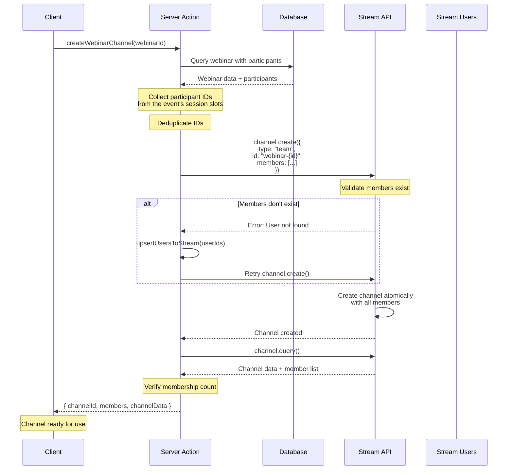

# 04. Chat Implementation

> Complete guide to implementing Stream Chat channels with best practices

## Table of Contents

- [Channel Types](#channel-types)
- [Channel ID Conventions](#channel-id-conventions)
- [Creating Channels](#creating-channels)
- [Member Management](#member-management)
- [Channel Creation Flow](#channel-creation-flow)
- [Code Examples](#code-examples)
- [Best Practices](#best-practices)

---

## Channel Types

Stream Chat supports multiple channel types, each optimized for different use cases:

### Messaging Channels

**Purpose**: One-on-one private conversations

**Use Cases**:

- Direct messages between users
- Consultations (consultant-consultee)
- Subscriptions (consultant-consultee)

**Characteristics**:

- Private by default
- Only accessible to members
- Optimized for 1:1 communication
- Support for typing indicators
- Read receipts enabled

### Team Channels

**Purpose**: Group conversations with multiple participants

**Use Cases**:

- Webinars (host + multiple participants)
- Classes (instructor + students)
- Group events

**Characteristics**:

- Support for many members
- Role-based permissions
- Participant list management
- Suitable for broadcasts and discussions

---

## Channel ID Conventions

Consistent channel ID naming ensures predictable behavior and prevents duplicates.

### Direct Messages

Direct-message ids are derived, never stored. The pair of user ids is put into a
fixed order and the channel id is built from it, so both participants compute the
same id independently and the conversation is found rather than recreated.

**Format**: `dm-{idA}-{idB}` for a personal conversation, where `idA` and `idB`
are the two user ids in **code-unit** order. An organization-scoped conversation
uses `dmo-{orgDigest}-{pairDigest}` instead, and a personal pair whose ids are
too long for Stream's 64-character ceiling falls back to a hashed `dmh-` form.

**Implementation**: always call the helper. Do not re-derive the id inline.

```typescript
import { getDmChannelId } from "@/lib/stream-utils";

const channelId = getDmChannelId(currentUserId, targetUserId, organizationId);
```

> **Never sort these ids with `localeCompare`.** It orders by ICU collation,
> which is case-insensitive at the primary level and depends on the runtime's
> ICU build and default locale, so the same pair of ids produces different
> channel ids in different environments. This is not hypothetical: commit
> `01162093` changed a plain `.sort()` to `.sort((a, b) => a.localeCompare(b))`
> and silently re-keyed most mixed-case pairs, orphaning their history behind a
> new empty channel. Better Auth ids are mixed-case and cuids are lowercase, so
> the two orderings genuinely disagree here. Both variants were still live in
> production months later. The helper uses `a < b ? [a, b] : [b, a]`, which is
> code-unit ordering and is stable everywhere.

**Example**:

- User A: `user_abc123`
- User B: `user_xyz789`
- Channel ID: `dm-user_abc123-user_xyz789` — the `dm-` prefix is part of the id.
  It was missing from this example, which matters because `isDMChannel`,
  `getChannelTypeFromId` and `MANAGED_CHANNEL_PREFIXES` all key off it.

**Why order the ids at all?**

- The same pair yields the same id regardless of who initiates, so the
  conversation is found rather than recreated.
- Neither participant needs to store or look up the id; both derive it.

Ordering is **code-unit**, per the warning above — not "alphabetical", which is
what this section used to say and is exactly the loose reading that led someone
to reach for `localeCompare`.

**A self-pair is refused, not ordered.** `getDmChannelId` throws when the two
ids are equal. `createChannel` de-duplicates its member array through a `Set`,
so `dm-<a>-<a>` would otherwise become a one-member channel: no counterparty for
`channelUtils` to name, so the header renders the raw id, and nobody to reply.

**Never open a DM by asking Stream for a computed id.** `channel.watch()` posts
to the same query endpoint `channel.create()` does, so watching an id that does
not exist *creates* it — as `created_by`, with no members, invisible to the
sidebar's `{ members: { $in: [me] } }` filter on the next reload. Go through
`POST /api/stream/channels/open`, which checks eligibility and creates the
channel with both members.

### Consultations and subscriptions — no channel of their own

**There is no `consultation-<id>` or `subscription-<id>` channel.** Both reuse
the pair's DM above.

This section used to document two separate formats with their own member lists.
They never worked. `createConsultationChannel` minted a DM and always had; the
`consultation-` id existed only in this document and in a reconciler blocklist.
Worse, `syncUserEventChannels` built its expected set from webinars, classes and
DMs while treating both prefixes as MANAGED — so any channel that *did* carry
one was classified stale and the buyer was removed from it on their very next
dashboard load. #1134 P0-7 deleted the concept rather than repairing it: the
pair already has a thread, and removing the second one removed a contradiction
rather than a feature.

`CONSULTATION_PREFIX` and `SUBSCRIPTION_PREFIX` remain exported from
`lib/stream-channel-ids.ts` so `getChannelTypeFromId` can still resolve rows
created before the change. They are deliberately absent from
`MANAGED_CHANNEL_PREFIXES`, so surviving channels are left alone rather than
swept.

**What a pair actually gets**: one `messaging` channel per funding context.

```typescript
{
  channelType: "messaging",
  channelId: getDmChannelId(consultantId, consulteeId, organizationId),
  members: [consultantId, consulteeId],
  createdById: consultantId,
  additionalData: {
    dm_consultant_user_id: consultantId,
    dm_consultee_user_id: consulteeId,
  },
  organizationId,
}
```

Ten consultations and three subscriptions between the same two people in the
same context are one conversation. A personal booking and an org-funded one are
two, because ADR 19 splits dashboards by org-ness and a single thread cannot
live in both.

`dm_consultant_user_id` is what decides moderation: `createChannel` grants
`channel_moderator` to that user. A DM created without it — the peer path — gets
no moderator at all, deliberately, so a consultee cannot mute or remove the
consultant (#981).

### Who may open one

A DM requires that the two people have transacted. `canDirectMessage`
(`lib/stream/dm-eligibility.ts`) is the only implementation of that rule:

- a `Consultation` or `Subscription` in `APPROVED`,
  `APPROVED_PENDING_PAYMENT`, `SCHEDULED` or `COMPLETED`, in either direction;
- or a shared, non-deleted `SlotOfAppointment`.

Permanent once established — a lapsed subscription still leaves the thread
open. `DM_ELIGIBLE_STATUSES` is shared by the gate, the two search routes, and
`getDmPairsForUser`. **Those must move together**: the reconciler removes users
from any managed DM channel absent from the expected set it builds from that
constant, so narrowing it evicts people from live conversations.

### Webinars

**Format**: `webinar-{webinarId}` · **Stream type**: `team`

```typescript
{
  channelType: "team",
  channelId: `webinar-${webinarId}`,
  channelName: webinar.webinarPlan.title,
  members: [consultantUserId, ...participantIds],
  createdById: consultantUserId,
  additionalData: { webinar_id: webinarId }
}
```

Members come from `appointment.slotsOfAppointment[].user`, deduplicated — a
webinar's registrants are connected to every one of its slots, so the same id
appears once per slot. The host is added separately and is always a member.

### Classes

**Format**: `class-{classId}` · **Stream type**: `team`

Identical in shape; the roster walks `class.appointments[].slotsOfAppointment[].user`.

### Collaborators

**Format**: `collab-{webinar|class}-{planId}` · **Stream type**: `messaging`

Host plus `ACCEPTED` collaborators, reconciled two-way against the collaborator
list on every accept.

### Event channel lifecycle

`jobs/stream/expire-event-channels.ts` freezes a webinar or class channel 7 days
after its last session ends (readable, not writable) and hard-deletes it at the
org's `streamRecordingRetentionDays`, default 90. DM channels are deliberately
excluded: the pair's thread outlives any single booking.


## Creating Channels

### Server-Side Pattern (Recommended)

All channel creation operations are performed server-side using Stream's Node SDK.

**Why Server-Side?**

- Secure API secret management
- Atomic member addition during creation
- Centralized error handling
- Consistent validation
- Database transaction support

### Generic Channel Creation

**File**: `actions/stream/chat/channel.action.ts`

```typescript
export async function createChannel({
  channelType,
  channelId,
  channelName,
  members,
  createdById,
  additionalData = {},
}: {
  channelType: "messaging" | "team";
  channelId: string;
  channelName?: string;
  members: string[];
  createdById: string;
  additionalData?: Record<string, any>;
}) {
  if (!apiKey || !apiSecret) {
    throw new Error("Stream API keys not configured");
  }

  const serverClient = StreamChat.getInstance(apiKey, apiSecret);

  // Ensure creator is always included in members list
  const allMembers = Array.from(new Set([createdById, ...members]));
  console.log(
    `Creating ${channelType} channel ${channelId} with ${allMembers.length} members`,
  );

  // Create the channel with members atomically
  const channel = serverClient.channel(channelType, channelId, {
    name: channelName,
    created_by_id: createdById,
    members: allMembers,
    ...additionalData,
  });

  await channel.create();
  console.log(`Channel ${channelId} created successfully`);

  // Verify membership was established
  const channelData = await channel.query();
  const actualMembers = Object.keys(channelData.members || {});
  console.log(`Channel ${channelId} actual members:`, actualMembers);

  return { channelId, members: actualMembers, channelData };
}
```

**Key Features**:

- Deduplicates members (creator + specified members)
- Atomic creation with members
- Post-creation verification
- Comprehensive logging

### Specialized Channel Creators

#### Direct Message Channel

```typescript
export async function createDirectMessageChannel(
  currentUserId: string,
  targetUserId: string,
  // Context this conversation belongs to. Omitted or null means personal, and
  // the channel then carries no org tag. Every caller must pass the same value
  // the reconciler will later derive, or the two compute different ids.
  organizationId?: string | null,
) {
  const channelId = getDmChannelId(currentUserId, targetUserId, organizationId);

  return createChannel({
    channelType: "messaging",
    channelId,
    members: [currentUserId, targetUserId],
    createdById: currentUserId,
  });
}
```

#### Webinar Channel

```typescript
export async function createWebinarChannel(webinarId: string) {
  const webinar = await prisma.webinar.findUnique({
    where: { id: webinarId },
    include: {
      webinarPlan: {
        include: {
          consultantProfile: { include: { user: true } },
        },
      },
      appointment: {
        include: {
          slotsOfAppointment: { include: { user: true } },
        },
      },
    },
  });

  if (!webinar) {
    throw new Error("Webinar not found");
  }

  const consultantUserId = webinar.webinarPlan.consultantProfile?.user?.id;
  if (!consultantUserId) {
    throw new Error("Consultant not found for webinar");
  }

  // Members are everyone connected to the webinar's session slots.
  const appointmentParticipantIds =
    webinar.appointment?.slotsOfAppointment?.flatMap((slot) =>
      slot.user.map((user) => user.id),
    ) || [];

  const allParticipantIds = Array.from(new Set(appointmentParticipantIds));

  console.log(
    `Webinar ${webinarId} participants: ${allParticipantIds.length} unique`,
  );

  return createChannel({
    channelType: "team",
    channelId: `webinar-${webinarId}`,
    channelName: webinar.webinarPlan.title,
    members: [consultantUserId, ...allParticipantIds],
    createdById: consultantUserId,
    additionalData: { webinar_id: webinarId },
  });
}
```

---

## Member Management

### Adding Members

**Server-Side**: `actions/stream/chat/channel.action.ts`

```typescript
export async function addMemberToChannel(channelId: string, userId: string) {
  if (!apiKey || !apiSecret) {
    throw new Error("Stream API keys not configured");
  }
  if (!channelId || !userId) {
    throw new Error("Channel ID and User ID are required");
  }

  const serverClient = StreamChat.getInstance(apiKey, apiSecret);

  // Infer channel type from ID pattern
  const channelType =
    channelId.startsWith("consultation-") ||
    channelId.startsWith("subscription-")
      ? "messaging"
      : "team";

  console.log(`Adding member ${userId} to ${channelType} channel ${channelId}`);

  try {
    const channel = serverClient.channel(channelType, channelId);

    // Ensure channel exists before adding members
    await channel.create(); // No-op if exists

    const response = await channel.addMembers([userId]);
    console.log(`Successfully added member ${userId} to channel ${channelId}`);

    return { success: true, response };
  } catch (error) {
    console.error(
      `Error adding member ${userId} to channel ${channelId}:`,
      error,
    );
    throw error;
  }
}
```

### Removing Members

```typescript
const channel = serverClient.channel(channelType, channelId);
await channel.removeMembers([userId]);
```

### Permission Management

Stream Chat uses role-based permissions:

**Default Roles**:

- `owner` - Full control over channel
- `moderator` - Can moderate content and members
- `member` - Can send and receive messages
- `guest` - Limited read-only access

**Assigning Roles**:

```typescript
await channel.addMembers([{ user_id: userId, role: "moderator" }]);
```

---

## Channel Creation Flow



**Flow Steps**:

1. **Client Request**: Client calls server action with entity ID
2. **Database Query**: Fetch entity data with all participants
3. **Member Collection**: Gather IDs from the event's session slots
4. **Deduplication**: Remove duplicate participant IDs
5. **Channel Creation**: Atomically create channel with members
6. **Error Handling**: If users don't exist, upsert and retry
7. **Verification**: Query channel to verify member count
8. **Response**: Return channel details to client

---

## Code Examples

### Complete Consultation Channel Setup

```typescript
// Server action
export async function createConsultationChannel(consultationId: string) {
  const consultation = await prisma.consultation.findUnique({
    where: { id: consultationId },
    include: {
      consultationPlan: {
        include: {
          consultantProfile: { include: { user: true } },
        },
      },
      requestedBy: { include: { user: true } },
    },
  });

  if (!consultation) {
    throw new Error("Consultation not found");
  }

  const consultantId = consultation.consultationPlan.consultantProfile.user.id;
  const consulteeId = consultation.requestedBy.user.id;

  if (!consultantId || !consulteeId) {
    throw new Error("Consultant or consultee not found");
  }

  return createChannel({
    channelType: "messaging",
    channelId: `consultation-${consultationId}`,
    members: [consultantId, consulteeId],
    createdById: consultantId,
    additionalData: { consultation_id: consultationId },
  });
}
```

### Client-Side Channel Access

```typescript
"use client";

import { useChatContext } from "stream-chat-react";
import { useEffect, useState } from "react";

export function useConsultationChannel(consultationId: string) {
  const { client } = useChatContext();
  const [channel, setChannel] = useState(null);

  useEffect(() => {
    if (!client) return;

    const channelId = `consultation-${consultationId}`;
    const channel = client.channel("messaging", channelId);

    // Watch the channel for updates
    channel.watch();
    setChannel(channel);

    return () => {
      channel.stopWatching();
    };
  }, [client, consultationId]);

  return channel;
}
```

### Querying User Channels

```typescript
"use client";

import { useChatContext } from "stream-chat-react";

export function useUserChannels(userId: string) {
  const { client } = useChatContext();

  const filters = {
    type: "messaging",
    members: { $in: [userId] },
  };

  const sort = { last_message_at: -1 };

  const options = {
    watch: true,
    state: true,
    limit: 30,
  };

  return client.queryChannels(filters, sort, options);
}
```

---

## Best Practices

### 1. Always Use Server-Side Creation

**Good**:

```typescript
// Server action
export async function createChannel(...) {
  const serverClient = StreamChat.getInstance(apiKey, apiSecret);
  // Create channel
}
```

**Bad**:

```typescript
// Client component - NEVER do this!
const channel = client.channel("messaging", channelId);
await channel.create(); // API secret exposed!
```

### 2. Atomic Member Addition

**Good**:

```typescript
// Add members during creation
const channel = serverClient.channel(channelType, channelId, {
  members: allMembers, // Atomic
});
await channel.create();
```

**Bad**:

```typescript
// Create then add members separately - race condition!
await channel.create();
await channel.addMembers(members); // Separate operation
```

### 3. Consistent ID Formatting

**Good** — one helper owns the derivation, so every call site agrees:

```typescript
import { getDmChannelId } from "@/lib/stream-utils";

const channelId = getDmChannelId(userId1, userId2, organizationId);
```

**Bad** — unsorted, so the two participants compute different ids:

```typescript
const channelId = `${userId1}-${userId2}`;
```

**Also bad, and harder to spot** — sorted, but by a locale-dependent
comparator, so the same pair yields different ids on different machines:

```typescript
const channelId = [userId1, userId2]
  .sort((a, b) => a.localeCompare(b))
  .join("-");
```

This second form looks correct and has already shipped once. See the note under
[Direct Messages](#direct-messages) for what it cost.

### 4. Proper Error Handling

**Good**:

```typescript
try {
  await createChannel({ ... });
  console.log("Channel created successfully");
} catch (error) {
  console.error("Channel creation failed:", error);
  // Handle specific error types
  if (error.code === 16) {
    // Channel already exists
  }
}
```

### 5. Verify Membership

**Good**:

```typescript
await channel.create();
const channelData = await channel.query();
const actualMembers = Object.keys(channelData.members || {});
console.log(`Expected: ${members.length}, Actual: ${actualMembers.length}`);
```

### 6. Deduplicate Members

**Good**:

```typescript
const allMembers = Array.from(new Set([createdById, ...members]));
```

**Bad**:

```typescript
const allMembers = [createdById, ...members]; // Possible duplicates
```

### 7. Use Meaningful Custom Data

**Good**:

```typescript
additionalData: {
  webinar_id: webinarId,
  event_type: "live_session",
  starts_at: webinar.startTime.toISOString(),
}
```

---

## Navigation

- [Previous: 03. Provider Authentication](./03-provider-authentication.md)
- [Next: 05. Video Implementation](./05-video-implementation.md)
- [Back to Index](./README.md)
