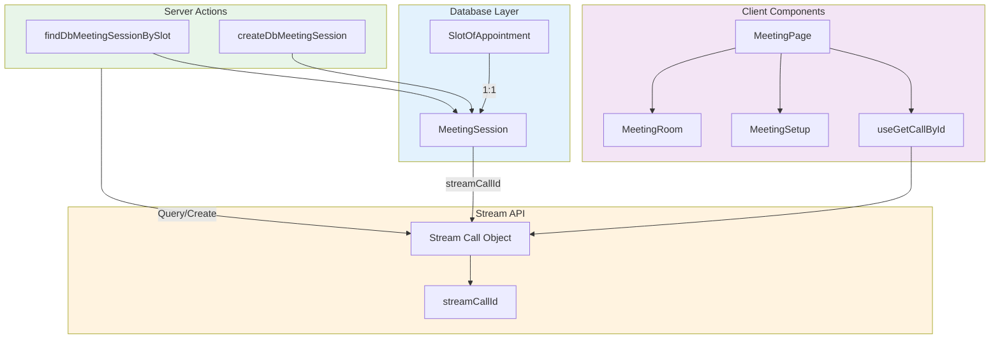
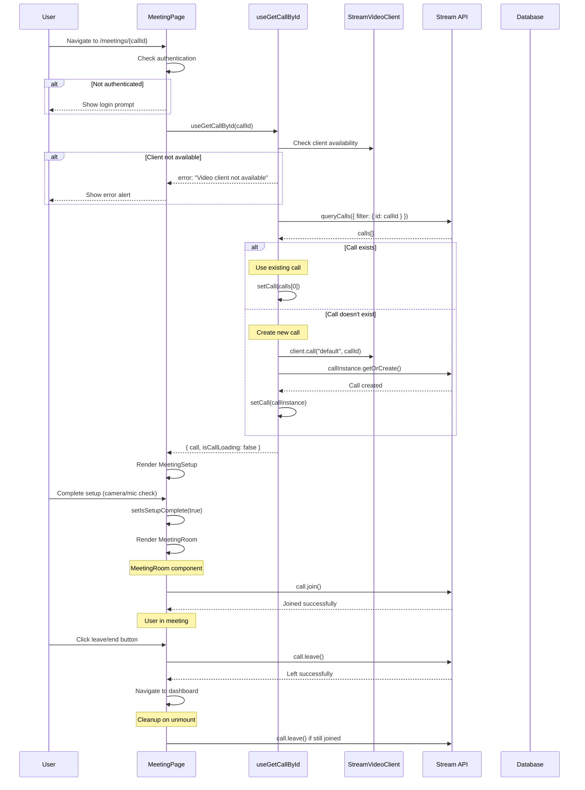

# 05. Video Implementation

> Complete guide to implementing Stream Video calls with meeting architecture

## Table of Contents

- [Meeting Architecture](#meeting-architecture)
- [Meeting Join Flow](#meeting-join-flow)
- [Meeting Components](#meeting-components)
- [Hooks and State Management](#hooks-and-state-management)
- [Cleanup and Lifecycle](#cleanup-and-lifecycle)
- [Call States and Monitoring](#call-states-and-monitoring)
- [Code Examples](#code-examples)
- [Best Practices](#best-practices)

---

## Meeting Architecture

### Call Types and ID Mapping

The video implementation uses a dual-ID system to link appointments with Stream calls:

**Database Layer**: `MeetingSession` model

```prisma
model MeetingSession {
  id                   String              @id @default(cuid())
  streamCallId         String              @unique
  platform             Platform            @default(STREAM)
  slotOfAppointmentId  String              @unique
  slotOfAppointment    SlotOfAppointment   @relation(...)
  createdAt            DateTime            @default(now())
  updatedAt            DateTime            @updatedAt
}
```

**ID Mapping**:

- `slotOfAppointmentId` - Your database's appointment slot ID
- `streamCallId` - Stream's call ID (format: `{meetingType}_{timestamp}_{random}`)

**Call Types**:

- `default` - Standard 1:1 or group calls
- Custom types can be configured in Stream dashboard

### Architecture Diagram



### Call Creation and Ownership (#1270)

The Stream call for a booking is created on the server and only on the server.
`provisionAppointmentMeeting` in `actions/stream/meetings/meeting.action.ts` is
the single writer, and `lib/meeting.ts` is a thin client-side wrapper that calls
it, turns a refusal back into a user-facing error for the toast, and hands the
call id to `router.push("/meetings/<id>")`. Nothing in the browser constructs a
`Call` in order to create one.

The order the action works in is load-bearing, and every step of it exists
because of a defect that reached production.

1. Resolve the anchor slot. A session longer than thirty minutes is stored as
   several consecutive `SlotOfAppointment` rows and each dashboard hands over a
   different one, so the room is keyed to the run's first row and both sides
   land in the same place (#1061).
2. Return early if a `MeetingSession` row already exists. This is the common
   case, and nothing below is allowed to rewrite an existing room.
3. Run every refusal that can block a join — maintenance, a tentative or
   cancelled slot, a booking whose parent row is in a terminal state — before
   anything is minted (#1077).
4. Check entitlement, still before the Stream write. The check used to live in
   `createDbMeetingSession`, which runs afterwards, so a refused caller left a
   real Stream room behind that no database row pointed at.
5. Create the call with the server client, naming the appointment's host as
   `created_by_id` and every member as `call_member`.
6. Write the `MeetingSession` row, which re-checks both gates itself.

Two properties are worth stating explicitly because the previous implementation
had neither. The call's author is the consultant who delivers the session, not
whoever pressed Join first — that used to be the consultee for roughly half of
all bookings. And every field of the call's `custom` data is read from the same
rows the entitlement gate reads, rather than supplied by the caller. That
matters most for `consultantUserId`, since `useSessionInfo()` derives `isHost`
from it and `isHost` decides who sees "End for everyone".

The full rationale, including what it reverses, is in
`docs/decisions/2026-08-30-server-side-call-creation.md`.

#### Call roles, and the order the scripts have to run in

Every member of a call is named `call_member`, at creation and again on each
join. That is the role `scripts/stream/ensure-call-type-grants.ts` keeps
`join-call` on, so after that script is applied it is the only thing that admits
anyone to a call.

The mint used to name the consultant `host` and everyone else `user`. Neither
survives the grants change: the live `default` call type has exactly six role
keys — `admin`, `call_member`, `global_admin`, `global_read_only`, `guest`,
`user` — with no `host` among them, so a consultant stamped `host` held no
grants at all, and `user` is one of the two roles that lose `join-call`.

Every call minted before this change therefore has members on a role that will
stop working. `scripts/stream/backfill-call-member-role.ts` repairs them, and it
has to run first:

```bash
npx tsx scripts/stream/backfill-call-member-role.ts          # dry run, reads production
npx tsx scripts/stream/backfill-call-member-role.ts --apply
npx tsx scripts/stream/ensure-call-type-grants.ts --apply --join-route-is-deployed
```

The grants script now refuses to `--apply` until it has seen at least one member
of an open call holding `call_member`. Its post-apply guard only ever checked
that the _grant_ was stored on the role, which is true by construction and says
nothing about whether a single person holds it — a green run away from locking
every participant out of every call.

### Server Actions

**File**: `actions/stream/meetings/meeting.action.ts`

#### Find Existing Meeting Session

```typescript
export const findDbMeetingSessionBySlot = async (
  slotId: string,
): Promise<MeetingSession | null> => {
  try {
    const meetingSession = await prisma.meetingSession.findUnique({
      where: { slotOfAppointmentId: slotId },
    });

    if (meetingSession) {
      console.log(
        `Found existing DB meeting session ${meetingSession.id} for slot ${slotId}`,
      );
    } else {
      console.log(`No existing DB session found for slot ${slotId}`);
    }
    return meetingSession;
  } catch (error) {
    console.error(
      `Error finding DB meeting session for slot ${slotId}:`,
      error,
    );
    return null;
  }
};
```

#### Create New Meeting Session

```typescript
export const createDbMeetingSession = async (
  slot: ISlotOfAppointment,
  streamCallId: string,
): Promise<MeetingSession> => {
  try {
    console.log(
      `Creating new DB session for slot ${slot.id} with Stream ID ${streamCallId}`,
    );

    const meetingSession = await prisma.meetingSession.create({
      data: {
        streamCallId: streamCallId,
        platform: "STREAM",
        slotOfAppointment: {
          connect: { id: slot.id },
        },
      },
    });

    console.log(
      `Stored new meeting session ${meetingSession.id} in DB linking slot ${slot.id}`,
    );
    return meetingSession;
  } catch (error) {
    console.error(
      `Error creating DB meeting session for slot ${slot.id}:`,
      error,
    );
    throw new Error(`Failed to create DB meeting session: ${error.message}`);
  }
};
```

---

## Meeting Join Flow



> **The diagram above predates #1134 P0-2 and #1270 and is kept for the shape of
> the flow, not for its creation branch.** The meeting page no longer creates
> anything: `useGetCallById` posts to `POST /api/meetings/[meetingId]/join`,
> which is the only grantor of call membership, and `client.call()` on the way
> back merely constructs a local handle. The room itself was created earlier, on
> the server, by `provisionAppointmentMeeting` when someone first pressed Join on
> a dashboard — see "Call Creation and Ownership" above.

**Flow Steps**:

1. **Navigation**: User navigates to `/meetings/{callId}`
2. **Authentication Check**: Verify user session
3. **Client Initialization**: Hook checks StreamVideoClient availability
4. **Call Query**: Query Stream API for existing call
5. **Call Creation**: Create call if it doesn't exist
6. **Meeting Setup**: Show camera/mic preview and configuration
7. **Join Call**: User joins after setup completion
8. **Meeting Room**: Render full meeting interface
9. **Leave/End**: User leaves or host ends the meeting
10. **Cleanup**: Automatically clean up on component unmount

---

## Meeting Components

### MeetingPage

**File**: `app/meetings/[id]/page.tsx`

**Purpose**: Main meeting container with authentication and state management

```typescript
const MeetingPage = () => {
  const { id } = useParams();
  const { data: session, isPending } = useSession(); // from "@/lib/auth-client"
  const { call, isCallLoading, error } = useGetCallById(id as string);
  const [isSetupComplete, setIsSetupComplete] = useState(false);

  // Cleanup on component unmount
  useEffect(() => {
    return () => {
      console.log("Meeting page unmounting, cleaning up call...");

      // Cleanup call if still active
      if (call?.state.callingState !== CallingState.LEFT) {
        console.log("Leaving call on unmount");
        call?.leave().catch((error) => {
          console.warn("Error leaving call on unmount:", error);
        });
      }
    };
  }, [call]);

  if (status === "loading" || isCallLoading) {
    return (
      <div className="flex flex-col items-center justify-center min-h-screen">
        <Loader2 className="h-12 w-12 animate-spin text-primary" />
        <p className="mt-4 text-lg">Loading meeting...</p>
      </div>
    );
  }

  if (error) {
    return (
      <Alert
        title="Meeting Error"
        description={`Failed to load meeting: ${error.message}`}
      />
    );
  }

  if (!call) {
    return (
      <Alert
        title="Meeting Not Found"
        description="The meeting you're trying to join doesn't exist or has ended."
      />
    );
  }

  const notAllowed = !session?.user;

  if (notAllowed) {
    return <Alert title="You need to be logged in to join this meeting" />;
  }

  return (
    <main className="h-screen w-full">
      <StreamCall call={call}>
        <StreamTheme>
          {!isSetupComplete ? (
            <MeetingSetup setIsSetupComplete={setIsSetupComplete} />
          ) : (
            <MeetingRoom />
          )}
        </StreamTheme>
      </StreamCall>
    </main>
  );
};
```

**Key Features**:

- Session-based authentication
- Loading states for call initialization
- Error handling with user-friendly messages
- Automatic cleanup on unmount
- Conditional rendering (setup vs. room)

### MeetingSetup

**Purpose**: Pre-call configuration (camera, microphone, speaker testing)

**Features**:

- Device selection (camera, microphone, speaker)
- Preview of video/audio
- Permission requests
- Visual feedback for device status

### MeetingRoom

**File**: `app/meetings/[id]/components/MeetingRoom.tsx`

**Purpose**: Main meeting interface with controls and layouts

```typescript
const MeetingRoom = () => {
  const searchParams = useSearchParams();
  const isPersonalRoom = !!searchParams.get("personal");
  const router = useRouter();
  const { data: session } = useSession(); // from "@/lib/auth-client"
  const [layout, setLayout] = useState<CallLayoutType>("speaker-left");
  const [showParticipants, setShowParticipants] = useState(false);
  const call = useCall();
  const { useCallCallingState, useCallEndedAt, useLocalParticipant } =
    useCallStateHooks();

  const callingState = useCallCallingState();
  const callEndedAt = useCallEndedAt();
  const localParticipant = useLocalParticipant();

  // Check if user is call owner
  const isCallOwner =
    localParticipant &&
    call?.state.createdBy &&
    localParticipant.userId === call.state.createdBy.id;

  // Monitor call state
  useEffect(() => {
    if (callEndedAt) {
      console.log("Call ended at:", callEndedAt);
    }
  }, [callEndedAt, callingState]);

  // Listen for call state updates
  useEffect(() => {
    if (call) {
      const handleCallStateUpdated = () => {
        console.log("Call state updated:", call.state);
      };

      call.on("call.updated", handleCallStateUpdated);

      return () => {
        call.off("call.updated", handleCallStateUpdated);
      };
    }
  }, [call]);

  // Show loading while joining
  if (callingState !== CallingState.JOINED && !callEndedAt) {
    return <Loader />;
  }

  // Show ended screen if call ended and user is not owner
  if (callEndedAt && !isCallOwner) {
    return (
      <CallEnded
        message="The call has been ended by the host"
        onRejoin={handleRejoinCall}
      />
    );
  }

  return (
    <section className="relative h-screen w-full overflow-hidden pt-4 text-white">
      <div className="relative flex size-full items-center justify-center">
        <div className="flex size-full max-w-[1000px] items-center">
          <CallLayout layout={layout} />
        </div>
        <div className={cn("h-[calc(100vh-86px)] hidden ml-2", {
          block: showParticipants,
        })}>
          <CallParticipantsList onClose={() => setShowParticipants(false)} />
        </div>
      </div>

      {/* Call controls */}
      <div className="fixed bottom-0 flex w-full items-center justify-center gap-5">
        <CallControls onLeave={async () => {
          await call?.leave();
          // Navigate to dashboard based on user role
          router.push(getDashboardUrl(session?.user));
        }} />

        {/* Layout selector */}
        <DropdownMenu>
          {/* Layout options */}
        </DropdownMenu>

        <CallStatsButton />

        {/* Participants toggle */}
        <button onClick={() => setShowParticipants((prev) => !prev)}>
          <Users size={20} />
        </button>

        {!isPersonalRoom && <EndCallButton />}
      </div>
    </section>
  );
};
```

**Key Features**:

- Multiple layout options (grid, speaker-left, speaker-right)
- Participant list management
- Call statistics monitoring
- Role-based controls (owner can end for all)
- Automatic state monitoring
- Graceful handling of ended calls

---

## Hooks and State Management

### useGetCallById Hook

**File**: `app/meetings/[id]/hooks/useGetCallById.ts`

**Purpose**: Fetch or create a Stream call by ID

```typescript
export const useGetCallById = (callId: string) => {
  const [call, setCall] = useState<Call | null>(null);
  const [isCallLoading, setIsCallLoading] = useState(true);
  const [error, setError] = useState<Error | null>(null);
  const client = useStreamVideoClient();

  useEffect(() => {
    const getCall = async () => {
      if (!client) {
        console.error("StreamVideoClient not available");
        setError(new Error("Video client not available"));
        setIsCallLoading(false);
        return;
      }

      if (!callId) {
        console.error("Call ID is required");
        setError(new Error("Call ID is required"));
        setIsCallLoading(false);
        return;
      }

      try {
        setIsCallLoading(true);
        setError(null);
        console.log(`Attempting to get call with ID: ${callId}`);

        // First try to query for the call
        const { calls } = await client.queryCalls({
          filter_conditions: { id: callId },
        });

        console.log(`Query result: found ${calls.length} calls`);

        if (calls.length > 0) {
          // Use existing call
          console.log(`Using existing call: ${calls[0].id}`);
          setCall(calls[0]);
        } else {
          // Create new call
          console.log(`Creating new call with ID: ${callId}`);
          const callInstance = client.call("default", callId);
          await callInstance.getOrCreate();
          console.log(`Successfully created call: ${callInstance.id}`);
          setCall(callInstance);
        }
      } catch (err) {
        console.error("Error getting call:", err);
        setError(err instanceof Error ? err : new Error("Failed to get call"));
        setCall(null);
      } finally {
        setIsCallLoading(false);
      }
    };

    getCall();
  }, [client, callId]);

  return { call, isCallLoading, error };
};
```

**Key Features**:

- Automatic call query/creation
- Comprehensive error handling
- Loading state management
- Detailed logging for debugging
- Reactive to client/callId changes

### Stream SDK Hooks

**Provided by Stream SDK**:

```typescript
import { useCallStateHooks } from "@stream-io/video-react-sdk";

const {
  useCallCallingState, // Current call state
  useCallEndedAt, // Call end timestamp
  useLocalParticipant, // Current user's participant object
  useParticipantCount, // Number of participants
  useIsCallRecordingInProgress, // Recording status
} = useCallStateHooks();
```

---

## Cleanup and Lifecycle

### Component Unmount Cleanup

**MeetingPage cleanup**:

```typescript
useEffect(() => {
  return () => {
    console.log("Meeting page unmounting, cleaning up call...");

    // Leave call if still active
    if (call?.state.callingState !== CallingState.LEFT) {
      console.log("Leaving call on unmount");
      call?.leave().catch((error) => {
        console.warn("Error leaving call on unmount:", error);
      });
    }
  };
}, [call]);
```

### Manual Leave Flow

```typescript
const handleLeave = async () => {
  try {
    await call?.leave();
    console.log("Left call successfully");

    // Navigate based on user role
    if (session?.user?.role === "CONSULTANT") {
      router.push(`/dashboard/consultant/${consultantId}/home`);
    } else if (session?.user?.role === "CONSULTEE") {
      router.push(`/dashboard/consultee/${consulteeId}/home`);
    } else {
      router.push("/");
    }
  } catch (error) {
    console.error("Error leaving call:", error);
    router.push("/");
  }
};
```

### End Call (Host Only)

Ending a call for everyone is a server decision, not a client one. `EndCallButton`
posts to `POST /api/meetings/[meetingId]/end`, which re-resolves access from the
database and requires the caller to be on the hosting side — the plan owner, or
an accepted collaborator on a webinar or a class.

```typescript
const handleEndCall = async () => {
  try {
    const response = await fetch(
      `/api/meetings/${encodeURIComponent(call.id)}/end`,
      { method: "POST" },
    );
    if (!response.ok) {
      throw new Error(`End call failed with status ${response.status}`);
    }
  } catch (error) {
    // The host leaves and their media is released either way; a failed end
    // means the room outlives them, which is what it has always meant.
    console.error("Error ending call:", error);
  } finally {
    await leaveCallAndReleaseMedia(call);
    router.push(getDashboardUrl());
  }
};
```

The button used to call `call.endCall()` directly. That worked because
`end-call` is granted to `call_member` on the live `default` call type and the
join route hands `call_member` to every participant — so any consultee could end
a consultation from devtools, and the only barrier was this component not
rendering for them, which is a React conditional over call data. Routing through
the server makes the grant revocable: once the button is deployed and serving
traffic, `scripts/stream/ensure-call-type-grants.ts` can strip `end-call` from
`call_member` without taking the host's own control down with it. That revocation
has deliberately not been applied yet.

The route does not write `MeetingSession.endedAt`. The `call.ended` webhook owns
that column, and it also sets the slot's completion status and the session's
actual duration — writing `endedAt` first would make the handler treat the event
as a duplicate and skip all of it.

---

## Call States and Monitoring

### CallingState Enum

```typescript
enum CallingState {
  UNKNOWN = "unknown",
  IDLE = "idle",
  RINGING = "ringing",
  JOINING = "joining",
  JOINED = "joined",
  RECONNECTING = "reconnecting",
  RECONNECTING_FAILED = "reconnecting_failed",
  OFFLINE = "offline",
  LEFT = "left",
}
```

### State Monitoring

```typescript
const callingState = useCallCallingState();

useEffect(() => {
  console.log("Call state changed:", callingState);

  switch (callingState) {
    case CallingState.JOINING:
      // Show joining indicator
      break;
    case CallingState.JOINED:
      // Hide loading, show meeting room
      break;
    case CallingState.RECONNECTING:
      // Show reconnecting indicator
      break;
    case CallingState.LEFT:
      // Cleanup and redirect
      break;
  }
}, [callingState]);
```

### Event Listeners

```typescript
useEffect(() => {
  if (!call) return;

  const handleCallEnded = () => {
    console.log("Call ended by host");
    // Show end screen or redirect
  };

  const handleParticipantJoined = (event) => {
    console.log("Participant joined:", event.user);
  };

  const handleParticipantLeft = (event) => {
    console.log("Participant left:", event.user);
  };

  call.on("call.ended", handleCallEnded);
  call.on("call.session_participant_joined", handleParticipantJoined);
  call.on("call.session_participant_left", handleParticipantLeft);

  return () => {
    call.off("call.ended", handleCallEnded);
    call.off("call.session_participant_joined", handleParticipantJoined);
    call.off("call.session_participant_left", handleParticipantLeft);
  };
}, [call]);
```

---

## Code Examples

### Complete Meeting Flow

```typescript
// 1. Server: Create meeting session
const slot = await prisma.slotOfAppointment.findUnique({
  where: { id: slotId },
});

const streamCallId = `consultation_${Date.now()}_${Math.random()}`;
await createDbMeetingSession(slot, streamCallId);

// 2. Client: Join meeting
const MeetingFlow = () => {
  const { callId } = useParams();
  const { call, isCallLoading } = useGetCallById(callId);

  if (isCallLoading) return <Loader />;
  if (!call) return <ErrorScreen />;

  return (
    <StreamCall call={call}>
      <StreamTheme>
        <MeetingRoom />
      </StreamTheme>
    </StreamCall>
  );
};
```

---

## Best Practices

### 1. Always Clean Up Calls

**Good**:

```typescript
useEffect(() => {
  return () => {
    if (call?.state.callingState !== CallingState.LEFT) {
      call?.leave();
    }
  };
}, [call]);
```

### 2. Handle All States

**Good**:

```typescript
if (isCallLoading) return <Loader />;
if (error) return <Error message={error.message} />;
if (!call) return <NotFound />;
if (callEndedAt && !isCallOwner) return <CallEnded />;
```

### 3. Graceful Error Handling

**Good**:

```typescript
try {
  await call.leave();
  router.push("/dashboard");
} catch (error) {
  console.error("Error leaving call:", error);
  // Still redirect even if leave fails
  router.push("/dashboard");
}
```

### 4. Monitor Call State Changes

**Good**:

```typescript
useEffect(() => {
  if (callEndedAt) {
    console.log("Call ended at:", callEndedAt);
    // Handle cleanup
  }
}, [callEndedAt]);
```

### 5. Use Error Boundaries

**Good**:

```typescript
<StreamVideoErrorBoundary>
  <MeetingRoom />
</StreamVideoErrorBoundary>
```

---

## Navigation

- [Previous: 04. Chat Implementation](./04-chat-implementation.md)
- [Next: 06. Channel Management](./06-channel-management.md)
- [Back to Index](./README.md)
