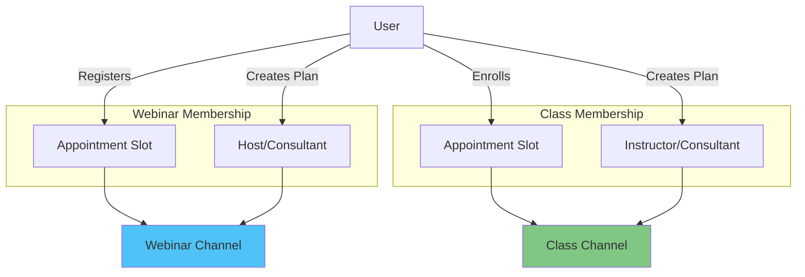
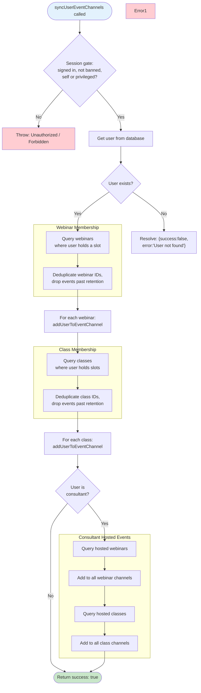

# 06. Channel Management

> Advanced channel management strategies including synchronization and race condition prevention

## Table of Contents

- [Channel Creation Strategies](#channel-creation-strategies)
- [User Channel Synchronization](#user-channel-synchronization)
- [Channel Membership Rules](#channel-membership-rules)
- [Race Condition Prevention](#race-condition-prevention)
- [User Channel Sync Flow](#user-channel-sync-flow)
- [Event Channel Management](#event-channel-management)
- [Code Examples](#code-examples)
- [Best Practices](#best-practices)

---

## Channel Creation Strategies

### Eager Creation

**Definition**: Create channels immediately when the entity (webinar, class, consultation, subscription) is created or approved.

**When to Use**:

- High-priority events (paid consultations, approved subscriptions)
- Events with guaranteed participants
- When chat availability is critical

**Advantages**:

- Channels ready immediately
- No delay for first users
- Predictable behavior

**Disadvantages**:

- May create unused channels
- Higher initial API usage
- Requires cleanup for canceled events

**Implementation**:

```typescript
// After consultation approval
const consultation = await prisma.consultation.update({
  where: { id: consultationId },
  data: { status: "APPROVED" },
});

// Immediately create channel
await createConsultationChannel(consultation.id);
```

### Lazy Creation

**Definition**: Create channels on-demand when the first user attempts to access them.

**When to Use**:

- Events with uncertain participation
- Low-priority or free events
- When minimizing API usage is important

**Advantages**:

- Only creates channels that will be used
- Lower API usage
- Self-cleaning (no unused channels)

**Disadvantages**:

- Slight delay for first user
- Race conditions possible
- More complex error handling

**Implementation**:

```typescript
// In event channel component
const ensureChannel = async () => {
  try {
    // Try to access channel
    const channel = client.channel("team", `webinar-${webinarId}`);
    await channel.watch();
  } catch (error) {
    if (error.code === 16) {
      // Channel not found
      // Create channel server-side
      await createWebinarChannel(webinarId);
    }
  }
};
```

### Hybrid Strategy (Recommended)

Combine both strategies based on entity type:

```typescript
// Eager for paid/approved entities
if (consultation.status === "APPROVED") {
  await createConsultationChannel(consultation.id);
}

// Lazy for events (created when the first attendee registers)
if (registeredCount === 1) {
  await createWebinarChannel(webinar.id);
}
```

---

## User Channel Synchronization

### syncUserEventChannels Function

**Purpose**: Ensure a user is a member of all channels for events they're participating in.

**When to Call**:

- User login (ensure membership of all channels)
- After joining an event (add to specific channel)
- Privileged maintenance run (fix any inconsistencies — the session gate rejects unauthenticated callers entirely)
- After profile changes

**File**: `actions/stream/chat/event-channel.action.ts`

The real signature and contract matter more than the body, because callers get
both wrong in ways that are invisible until production:

```typescript
export async function syncUserEventChannels(
  userId: string,
  force = false,
): Promise<{
  success: boolean;
  skipped?: boolean;
  error?: string;
  channelsSynced?: number;
  failed?: number;
  staleChannelsRemoved?: number;
  durationMs?: number;
}>;
```

Five properties of this contract are load-bearing.

**It reports failure by resolving, not by rejecting.** A missing user returns
`{ success: false, error: "User not found" }` rather than throwing. A caller
written as `sync(id).then(markDone).catch(logIt)` therefore marks a failed sync
as done, because the `catch` only ever sees the thrown case. That is exactly the
bug fixed in `providers/StreamProviderImpl.tsx`, where the success marker was
persisted to `sessionStorage` for a sync that had failed, suppressing every
retry for the rest of the tab's life. Branch on `result.success`.

**It can no-op.** A recent successful sync for the same user returns
`{ success: true, skipped: true }` without doing any work, unless `force` is
passed. Treat `skipped` as success, because it means the state is already
correct.

**It revokes rather than adds, and it fans out in bounded chunks.** The add pass
is retired: channels are provisioned on demand by
`POST /api/stream/channels/open` and eagerly at booking approval and payment
success, so what remains is the reconciliation half — query Stream for every
channel the user is actually in, and remove the memberships that the
expected-set no longer justifies. Removals go out through chunked
`Promise.allSettled` rather than a sequential loop, so one channel that fails
does not abandon the rest — hence `failed` alongside `channelsSynced`, which
now reports the size of the expected-set rather than a count of work performed.
A partial result is the normal shape, not an error.

That reconciliation query pages through `queryChannelsPaged`
(`lib/stream/batch.ts`), because Stream returns at most 30 channels per
`queryChannels` call no matter what `limit` is requested. Reading a single page
as the whole list is what left stale direct messages beyond the thirtieth
channel unrevoked (#1270); see
[17. Channel Lifecycle](./17-channel-lifecycle.md#streams-per-request-ceilings)
for the full account and for the matching 100-member ceiling on channel
creation.

**It is session-gated.** The module is `"use server"`, so the action is
remotely invocable and gates itself before any work: it reads the session with
the cookie cache disabled (`getSession(true)`), rejects suspended accounts, and
allows only self or privileged (`isPrivileged`) callers — mirroring
`assertCanMintToken` in `actions/stream/chat/stream.action.ts`. The gate fires
before the `force` path clears the sync dedup guard, so an unauthenticated call
cannot reset someone else's guard. Legitimate callers always act as self:
`providers/StreamProviderImpl.tsx` fires the sync fire-and-forget, and
`components/chat/InitializeUserChannelsButton.tsx` passes the signed-in user's
own id.

**Its expected-set excludes events past retention.** `getWebinarIdsForUser` and
`getClassIdsForUser` select each event's latest slot `endsAt` plus the owning
organization's `streamRecordingRetentionDays`, then drop events whose window
has lapsed via `isPastRetention` in `lib/stream/channel-lifecycle.ts`. Without
this filter the sync could lazily resurrect a channel the retention cron
hard-deleted — and the resurrected channel would classify as already-frozen
against its `chatFrozenAt` ledger stamp and stay writable forever (F-HIGH-2,
2026-08-23 architecture review). [17. Channel Lifecycle](./17-channel-lifecycle.md)
documents the full failure mode and the invariant that protects it.

For the current body, read the function itself. It is long, it changes with the
event model, and a transcribed copy here has drifted every time.

---

## Channel Membership Rules

### Who May Talk to Whom (Policy)

The platform deliberately supports only three conversation shapes. First, a consultant and a consultee who transact together share exactly one direct-message channel: consultations, subscriptions, trials, and ad-hoc DMs between the same pair all reuse the deterministic `dm-<idA>-<idB>` channel id (the two user ids are put into code-unit order before joining, so the pair can never produce a duplicate channel regardless of who initiates). An organization-scoped conversation uses the `dmo-` form instead; see [Direct Messages](./04-chat-implementation.md#direct-messages) for why the ordering must not use `localeCompare`. Trials were absent from this list until recently, and the omission was accidentally accurate: the trial branch in the payment webhook existed but could never execute, because the consultant could not be resolved for a trial appointment. A trial now opens the same conversation as any other one-to-one booking. Second, group events — webinars and classes — put every booked attendee and the host into one shared event channel, and this is the sanctioned space where consultees can talk alongside other consultees. Third, consultants collaborating on a joint webinar or class get a plan-scoped `collab-{webinar|class}-{planId}` channel that is reconciled against the accepted collaborator list.

Consultee↔consultee direct messages are intentionally not supported. This is a decision, not a gap: peer-to-peer DMs on a marketplace are only safe with mature moderation infrastructure, and the block stays until the moderation enforcement shipped for #693 and the #899 hardening have settled in production. The full rationale is recorded in `docs/decisions/2026-07-11-moderation-enforcement-and-peer-chat-block.md`. There is no consultee↔consultee code path to disable — reviewers should keep it that way.

### Server-Side Authorization for Membership Changes

Stream's server-side API bypasses its own permission system whenever a valid API secret is presented, so every membership mutation must be authorized in our application layer before the Stream call. The `addMemberToChannel` server action requires a signed-in session and allows only admins, staff, or the channel's creator to add members; non-privileged callers can no longer lazily create channels they do not own. The channel-creation route applies the same rule: event channels require the caller to be the event's creator (or privileged), and custom channels are admin/staff-only.

### Participant Sources

Event channel membership follows the event's session slots: a user is a member
if they are connected to one, which is exactly what registering does. The host
is added separately.



### Deduplication Strategy

**Problem**: a webinar's registrants are connected to every one of its slots, so
the same user id appears once per slot.

**Solution**: Deduplicate before adding to the channel

```typescript
const appointmentIds =
  webinar.appointment?.slotsOfAppointment?.flatMap((slot) =>
    slot.user.map((user) => user.id),
  ) || [];

const allParticipantIds = Array.from(new Set(appointmentIds));

console.log(`Unique participants: ${allParticipantIds.length}`);
```

### Host Inclusion

**Rule**: Event host (consultant) is ALWAYS a member

```typescript
const allMembers = Array.from(new Set([consultantUserId, ...participantIds]));
```

---

## Race Condition Prevention

### Atomic Channel Creation

**Problem**: Multiple users might try to create the same channel simultaneously

**Solution**: Atomic creation with member list

```typescript
// BAD: Race condition possible
await channel.create();
await channel.addMembers(members); // Separate operation

// GOOD: Atomic operation
const channel = serverClient.channel(channelType, channelId, {
  name: channelName,
  created_by_id: createdById,
  members: allMembers, // Added atomically
});
await channel.create();
```

### Check-Then-Create Pattern

**Problem**: Race between checking if channel exists and creating it

**Solution**: Use try-create pattern with error handling

```typescript
export const addUserToEventChannel = async (
  eventType: "webinar" | "class",
  eventId: string,
  userId: string,
) => {
  const channelId = `${eventType}-${eventId}`;
  const channel = client.channel("team", channelId);

  try {
    // Check if channel exists
    let channelExists = await checkEventChannelExists(eventType, eventId);

    if (!channelExists) {
      // Get event details and create channel
      const eventData = await getEventData(eventType, eventId);

      // Create with initial member
      const newChannel = client.channel("team", channelId, {
        name: eventData.name,
        created_by_id: eventData.creatorId,
        members: [userId], // Add during creation
      });

      await newChannel.create();
      console.log(`Created channel ${channelId} with initial member ${userId}`);
    } else {
      // Channel exists, just add member
      await channel.addMembers([userId]);
      console.log(`Added ${userId} to existing channel ${channelId}`);
    }
  } catch (error) {
    if (error.code === 16) {
      // Channel not found - might have been deleted
      console.log(`Channel ${channelId} not found, will retry creation`);
      throw error;
    }
    console.error(`Error adding user to channel:`, error);
    throw error;
  }
};
```

### Idempotent Operations

**Problem**: Retry logic might add user twice

**Solution**: Stream's `addMembers` is idempotent (safe to call multiple times)

```typescript
// Safe to call multiple times - won't duplicate members
await channel.addMembers([userId]);
await channel.addMembers([userId]); // No-op if already member
```

The shipped lazy paths go one step further than check-then-create: when a
lost create race is rejected by Stream, the existing channel is adopted via
`isChannelAlreadyExistsError` in `lib/stream-utils.ts` instead of failing the
caller. [17. Channel Lifecycle](./17-channel-lifecycle.md) documents the full
create-and-adopt story.

---

## User Channel Sync Flow



**Flow Steps**:

1. **Session Gate**: Require a signed-in, non-banned caller acting as self (or a privileged role); the gate precedes everything, including the `force` guard reset
2. **User Retrieval**: Fetch user with consultant/consultee profiles
3. **Webinar Collection**:
   - Query appointment slots
   - Deduplicate IDs
   - Drop events past their retention window (`isPastRetention`)
4. **Webinar Channel Addition**: Add user to all webinar channels
5. **Class Collection**:
   - Query appointment slots
   - Deduplicate IDs
   - Drop events past their retention window (`isPastRetention`)
6. **Class Channel Addition**: Add user to all class channels
7. **Consultant Check**: If user is consultant, add to hosted events
8. **Completion**: Return success

---

## Event Channel Management

### Checking Channel Existence

```typescript
export const checkEventChannelExists = async (
  eventType: "webinar" | "class",
  eventId: string,
) => {
  const channelId = `${eventType}-${eventId}`;

  try {
    if (!apiKey || !apiSecret) {
      throw new Error("Stream API keys not configured");
    }

    const client = StreamChat.getInstance(apiKey, apiSecret);
    const channel = client.channel("team", channelId, {
      created_by_id: "system",
    });

    // Query the channel
    const response = await channel.query();

    // Channel exists if it has an ID
    const exists = !!(response.channel && response.channel.id);
    console.log(`Channel ${channelId} exists: ${exists}`);
    return exists;
  } catch (error) {
    // Error code 16 = channel not found
    if (error.code === 16 || error.response?.data?.code === 16) {
      console.log(`Channel ${channelId} not found via query`);
      return false;
    }
    console.error(`Error checking channel ${channelId}:`, error.message);
    return false;
  }
};
```

### Adding User to Event Channel

```typescript
export const addUserToEventChannel = async (
  eventType: "webinar" | "class",
  eventId: string,
  userId: string,
) => {
  try {
    const channelId = `${eventType}-${eventId}`;
    let systemCreatedChannel = false;

    // Check if channel exists
    let channelExists = await checkEventChannelExists(eventType, eventId);
    let channel = client.channel("team", channelId);

    if (!channelExists) {
      console.log(`Channel ${channelId} does not exist. Creating...`);

      // Get event data
      let channelCreatorId = "system";
      let channelName = `${eventType} ${eventId}`;

      if (eventType === "webinar") {
        const webinar = await prisma.webinar.findUnique({
          where: { id: eventId },
          include: {
            webinarPlan: {
              include: { consultantProfile: { include: { user: true } } },
            },
          },
        });

        if (!webinar) throw new Error(`Webinar ${eventId} not found`);

        channelName = webinar.webinarPlan.title;

        if (webinar.webinarPlan.consultantProfile?.user?.id) {
          const consultantUserId =
            webinar.webinarPlan.consultantProfile.user.id;
          await upsertUserToStream(consultantUserId);
          channelCreatorId = consultantUserId;
        }
      } else {
        // Similar logic for classes...
      }

      // Create channel with user as initial member
      channel = client.channel("team", channelId, {
        name: channelName,
        created_by_id: channelCreatorId,
        members: [userId], // Add during creation
      });

      try {
        await channel.create();
        systemCreatedChannel = true;
        console.log(
          `Created channel ${channelId} with creator ${channelCreatorId} ` +
            `and initial member ${userId}`,
        );
      } catch (createError) {
        if (!isChannelAlreadyExistsError(createError)) throw createError;

        // Lost a concurrent-create race: ADOPT the winner's channel instead
        // of failing this user's join, and retry our own membership once —
        // the winner's roster snapshot may predate us.
        console.log(`Lost the create race for ${channelId}; adopting`);
        try {
          await channel.addMembers([userId]);
        } catch (adoptError) {
          // Best-effort: logged, never thrown; the next sync reconciles a miss.
          console.warn(
            `Post-adoption addMembers failed for ${userId}:`,
            adoptError,
          );
        }
      }
    } else {
      // Channel exists - update name if needed and add member
      const eventData = await getEventData(eventType, eventId);
      const existingChannelData = await channel.query();

      if (existingChannelData.channel?.name !== eventData.name) {
        console.log(
          `Updating channel ${channelId} name to "${eventData.name}"`,
        );
        await channel.update({ name: eventData.name });
      }

      await upsertUserToStream(userId);
      console.log(`Channel ${channelId} exists. Adding member ${userId}...`);
      await channel.addMembers([userId]);
    }

    return { success: true, systemCreatedChannel };
  } catch (error) {
    console.error(
      `Error in addUserToEventChannel for ${eventType} ${eventId}, user ${userId}:`,
      error,
    );
    throw error;
  }
};
```

---

## Code Examples

### Complete Sync on Login

```typescript
// In login callback
async function handleLogin(userId: string) {
  try {
    // 1. Upsert user to Stream
    await upsertUserToStream(userId);

    // 2. Sync all channel memberships
    await syncUserEventChannels(userId);

    console.log(`User ${userId} synced with all event channels`);
  } catch (error) {
    console.error("Error syncing user channels on login:", error);
    // Continue login even if sync fails
  }
}
```

### Periodic Background Sync

```typescript
// Background job (daily)
export async function syncAllUserChannels() {
  console.log("Starting daily user channel sync...");

  // Get all active users
  const users = await prisma.user.findMany({
    where: {
      OR: [
        { consulteeProfile: { isNot: null } },
        { consultantProfile: { isNot: null } },
      ],
    },
    select: { id: true },
  });

  console.log(`Syncing ${users.length} users...`);

  let successCount = 0;
  let errorCount = 0;

  for (const user of users) {
    try {
      // The session gate applies here too: this loop only passes when it runs
      // under a PRIVILEGED (ADMIN/STAFF) session, or when each call acts as
      // self. An unauthenticated script is rejected outright.
      const result = await syncUserEventChannels(user.id);
      // The sync reports per-user problems by RESOLVING with success:false,
      // not by rejecting — count them as failures, not successes.
      if (result.success) {
        successCount++;
      } else {
        console.warn(`Skipped ${user.id}: ${result.error}`);
        errorCount++;
      }
    } catch (error) {
      console.error(`Failed to sync user ${user.id}:`, error);
      errorCount++;
    }
  }

  console.log(`Sync complete: ${successCount} succeeded, ${errorCount} failed`);

  return { successCount, errorCount };
}
```

The session gate constrains loops like this: each call must act as self or run
under a privileged caller — an unauthenticated background job is rejected
outright.

### Add to Channel on Event Join

```typescript
// When a user registers for a webinar
async function handleJoinWebinar(userId: string, webinarId: string) {
  try {
    // 1. Record the registration
    await prisma.slotOfAppointment.update({
      data: {
        userId,
        webinarId,
      },
    });

    // 2. Add to Stream channel
    await addUserToEventChannel("webinar", webinarId, userId);

    console.log(`User ${userId} added to webinar ${webinarId} channel`);
  } catch (error) {
    console.error("Error adding user to webinar channel:", error);
    throw error;
  }
}
```

---

## Best Practices

### 1. Always Deduplicate Members

**Good**:

```typescript
const allIds = Array.from(new Set(appointmentIds));
```

**Bad**:

```typescript
const allIds = appointmentIds; // Duplicates possible
```

### 2. Include Creator in Members

**Good**:

```typescript
const allMembers = Array.from(new Set([createdById, ...members]));
```

### 3. Sync on Critical Events

**When to Sync**:

- User login
- User joins event
- User profile changes
- Daily background job

### 4. Graceful Error Handling

**Good**:

```typescript
try {
  await syncUserEventChannels(userId);
  console.log("Sync successful");
} catch (error) {
  console.error("Sync failed:", error);
  // Log but don't block user flow
}
```

### 5. Use Idempotent Operations

**Good**:

```typescript
// Safe to call multiple times
await channel.addMembers([userId]);
```

### 6. Log Membership Details

**Good**:

```typescript
console.log(
  `Webinar ${webinarId} participants: ` +
    `${appointmentCount} from appointments, ` +
    `${uniqueCount} total unique`,
);
```

### 7. Verify Channel State

**Good**:

```typescript
await channel.create();
const channelData = await channel.query();
const actualMembers = Object.keys(channelData.members || {});
console.log(`Expected: ${members.length}, Actual: ${actualMembers.length}`);
```

### 8. Update Channel Metadata

**Good**:

```typescript
// Check if name changed
if (existingChannel.name !== expectedName) {
  await channel.update({ name: expectedName });
}
```

---

## Navigation

- [Previous: 05. Video Implementation](./05-video-implementation.md)
- [Next: 13. Recording & Webhooks](./13-recording-webhooks.md)
- [Troubleshooting](./troubleshooting.md)
