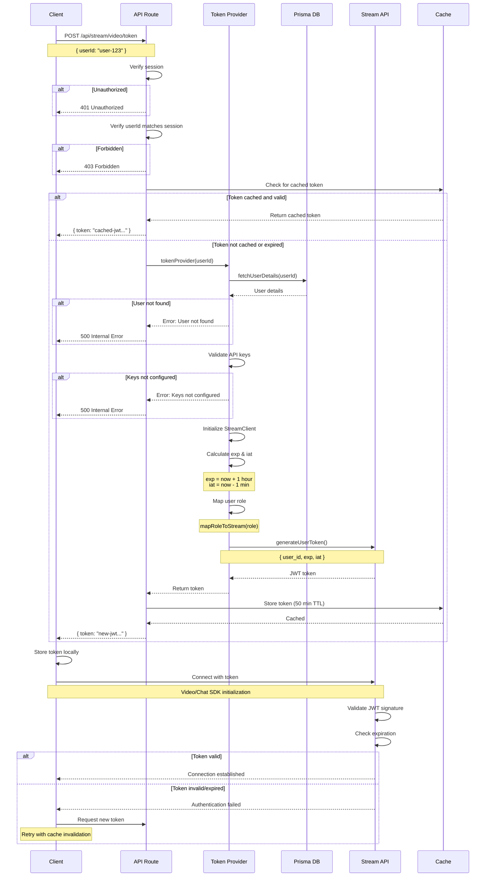

# Token Management

This document covers Stream token management including token types, server-side generation, caching strategies, and the token provider pattern.

## Table of Contents

- [Token Types](#token-types)
- [Server-Side Token Generation](#server-side-token-generation)
- [Token Caching Strategy](#token-caching-strategy)
- [Token Provider Pattern](#token-provider-pattern)
- [Token Lifecycle](#token-lifecycle)
- [Security Best Practices](#security-best-practices)

---

## Token Types

Stream uses JWT (JSON Web Tokens) for authentication. The application implements two distinct token types for different Stream services.

### Chat JWT Token

**Purpose:** Authenticates users for Stream Chat features (messaging, channels, DMs)

**Provider Function:** `chatTokenProvider`

**SDK:** `stream-chat` (StreamChat)

**Validity:** 1 hour (default, no explicit expiration set)

**Use Cases:**

- User authentication in chat channels
- Direct messaging between users
- Group chat participation
- Channel creation and management

### Video JWT Token

**Purpose:** Authenticates users for Stream Video features (video calls, meetings)

**Provider Function:** `tokenProvider`

**SDK:** `@stream-io/node-sdk` (StreamClient)

**Validity:** 1 hour (3600 seconds)

**Token Claims:**

```typescript
{
  user_id: string,  // User identifier
  exp: number,      // Expiration time (Unix timestamp)
  iat: number       // Issued at time (Unix timestamp)
}
```

**Use Cases:**

- Video call authentication
- Meeting room access
- Screen sharing sessions
- Recording permissions

### Token Comparison

| Feature         | Chat Token          | Video Token           |
| --------------- | ------------------- | --------------------- |
| SDK             | `stream-chat`       | `@stream-io/node-sdk` |
| Function        | `chatTokenProvider` | `tokenProvider`       |
| Explicit Expiry | No                  | Yes (1 hour)          |
| Issued At Claim | No                  | Yes (1 min ago)       |
| Use Case        | Messaging           | Video calls           |

---

## Server-Side Token Generation

All tokens MUST be generated server-side to protect API secrets. Client-side token generation would expose your Stream API secret, allowing unauthorized access.

**Location:** `/actions/stream/chat/stream.action.ts`

### Video Token Provider

**Function Signature:**

```typescript
export const tokenProvider = async (userId: string): Promise<string>
```

**Implementation:**

```typescript
export const tokenProvider = async (userId: string) => {
  try {
    // 0. Session bind (#899): a token may only be minted for the authenticated
    //    session user; staff/admins may mint for anyone. Stream's server-side
    //    API skips permission checks, so this is the only guard against spoofing.
    await assertCanMintToken(userId);

    // 1. Verify user exists
    const userDetails = await fetchUserDetails(userId);
    if (!userDetails) throw new Error("User not found");

    // 2. Validate API credentials
    if (!apiKey) throw new Error("Stream API key not configured");
    if (!apiSecret) throw new Error("Stream API secret not configured");

    // 3. Initialize Stream Video client
    const client = new StreamClient(apiKey, apiSecret);

    // 4. Set token expiration (1 hour from now)
    const exp = Math.round(Date.now() / 1000) + 60 * 60;

    // 5. Set issued time (1 minute ago to account for clock skew)
    const issued = Math.round(Date.now() / 1000) - 60;

    // 6. Map user role
    const streamRole = mapRoleToStream(userDetails.role);
    console.log(
      `Generating token for user ${userDetails.id} with role ${streamRole}`,
    );

    // 7. Generate JWT token
    const token = client.generateUserToken({
      user_id: userDetails.id,
      exp,
      iat: issued,
    });

    return token;
  } catch (error) {
    console.error("Error generating token:", error);
    throw error;
  }
};
```

**Example Usage:**

```typescript
import { tokenProvider } from "@/actions/stream/chat/stream.action";

// Generate video token for the authenticated session user.
// Passing another user's ID throws unless the caller is staff/admin (#899).
try {
  const token = await tokenProvider(sessionUser.id);
  console.log("Video token generated successfully");
} catch (error) {
  console.error("Token generation failed:", error);
}
```

**Token Claims Explanation:**

- **`user_id`**: Identifies the user in Stream
- **`exp`**: Expiration timestamp (1 hour from generation)
- **`iat`**: Issued at timestamp (1 minute in the past)

The `iat` is set to 1 minute in the past to account for clock skew between client and server, preventing "token not yet valid" errors.

### Chat Token Provider

**Function Signature:**

```typescript
export const chatTokenProvider = async (userId: string): Promise<string>
```

**Implementation:**

```typescript
export const chatTokenProvider = async (userId: string) => {
  try {
    // 0. Session bind (#899): mint only for the authenticated session user
    //    (staff/admins may mint for anyone).
    await assertCanMintToken(userId);

    // 1. Validate API credentials
    if (!apiKey) throw new Error("Stream API key not configured");
    if (!apiSecret) throw new Error("Stream API secret not configured");

    // 2. Verify user exists in database
    const userDetails = await fetchUserDetails(userId);
    if (!userDetails) throw new Error("User not found");

    // 3. Initialize Stream Chat server client
    const serverClient = StreamChat.getInstance(apiKey, apiSecret);

    // 4. Create token (no explicit expiration)
    const token = serverClient.createToken(userDetails.id);

    return token;
  } catch (error) {
    console.error("Error generating chat token:", error);
    throw error;
  }
};
```

**Example Usage:**

```typescript
import { chatTokenProvider } from "@/actions/stream/chat/stream.action";

// Generate chat token for the authenticated session user.
// Passing another user's ID throws unless the caller is staff/admin (#899).
try {
  const token = await chatTokenProvider(sessionUser.id);
  console.log("Chat token generated successfully");
} catch (error) {
  console.error("Token generation failed:", error);
}
```

**Key Differences from Video Token:**

- No explicit expiration time
- No issued-at claim
- Simpler generation using `createToken()`
- Default Stream Chat token behavior

---

## Token Caching Strategy

Implementing token caching reduces server load and improves performance by avoiding redundant token generation.

### Recommended Caching Parameters

**Cache Duration:** 50 minutes

**Token Validity:** 60 minutes (1 hour)

**Safety Buffer:** 10 minutes

```
|--- Token Valid (60 min) ---|
|--- Cached (50 min) ---|-- Buffer (10 min) --|
```

**Rationale:**

- Cache for 50 minutes to avoid using expired tokens
- 10-minute buffer ensures fresh token before expiration
- Prevents edge cases where cached token expires during use

### Client-Side Caching Implementation

```typescript
// Example: Client-side token cache
class TokenCache {
  private cache: Map<string, { token: string; expiresAt: number }> = new Map();

  // Cache duration: 50 minutes (3000 seconds)
  private readonly CACHE_DURATION = 50 * 60 * 1000;

  async getToken(
    userId: string,
    provider: (id: string) => Promise<string>,
  ): Promise<string> {
    const cached = this.cache.get(userId);
    const now = Date.now();

    // Return cached token if still valid
    if (cached && cached.expiresAt > now) {
      console.log("Using cached token");
      return cached.token;
    }

    // Generate new token
    console.log("Generating new token");
    const token = await provider(userId);

    // Cache the token
    this.cache.set(userId, {
      token,
      expiresAt: now + this.CACHE_DURATION,
    });

    return token;
  }

  clearCache(userId: string) {
    this.cache.delete(userId);
  }

  clearAll() {
    this.cache.clear();
  }
}

// Usage
const tokenCache = new TokenCache();

// Get video token (cached)
const videoToken = await tokenCache.getToken("user-123", tokenProvider);

// Get chat token (cached)
const chatToken = await tokenCache.getToken("user-123", chatTokenProvider);
```

### Server-Side Caching (Redis Example)

```typescript
import Redis from "ioredis";

const redis = new Redis(process.env.REDIS_URL);

async function getCachedToken(
  userId: string,
  tokenType: "video" | "chat",
): Promise<string | null> {
  const cacheKey = `stream:token:${tokenType}:${userId}`;
  return await redis.get(cacheKey);
}

async function setCachedToken(
  userId: string,
  tokenType: "video" | "chat",
  token: string,
): Promise<void> {
  const cacheKey = `stream:token:${tokenType}:${userId}`;
  // Cache for 50 minutes (3000 seconds)
  await redis.setex(cacheKey, 3000, token);
}

export const cachedTokenProvider = async (userId: string): Promise<string> => {
  // Check cache first
  const cachedToken = await getCachedToken(userId, "video");
  if (cachedToken) {
    console.log("Returning cached video token");
    return cachedToken;
  }

  // Generate new token
  const token = await tokenProvider(userId);

  // Cache the token
  await setCachedToken(userId, "video", token);

  return token;
};
```

### Cache Invalidation

**When to Invalidate:**

1. User logout
2. User role changes
3. Manual token revocation
4. Security incidents

**Example:**

```typescript
// Clear cache on logout
async function handleLogout(userId: string) {
  tokenCache.clearCache(userId);
  // or for Redis:
  await redis.del(`stream:token:video:${userId}`);
  await redis.del(`stream:token:chat:${userId}`);
}

// Clear cache on role change
async function handleRoleChange(userId: string, newRole: string) {
  tokenCache.clearCache(userId);
  // User will get new token with updated role on next request
}
```

---

## Token Provider Pattern

The token provider pattern is used by Stream SDKs to fetch authentication tokens dynamically.

### Client-Side Integration

**Stream Video Client:**

```typescript
import { StreamVideoClient } from "@stream-io/video-react-sdk";

const videoClient = new StreamVideoClient({
  apiKey: process.env.NEXT_PUBLIC_STREAM_API_KEY!,
  user: {
    id: currentUser.id,
    name: currentUser.name,
    image: currentUser.image,
  },
  // Token provider function
  tokenProvider: async () => {
    // Call server-side API to get token
    const response = await fetch("/api/stream/video/token", {
      method: "POST",
      body: JSON.stringify({ userId: currentUser.id }),
    });
    const data = await response.json();
    return data.token;
  },
});
```

**Stream Chat Client:**

```typescript
import { StreamChat } from "stream-chat";

const chatClient = StreamChat.getInstance(
  process.env.NEXT_PUBLIC_STREAM_API_KEY!,
);

await chatClient.connectUser(
  {
    id: currentUser.id,
    name: currentUser.name,
    image: currentUser.image,
  },
  // Token provider function
  async () => {
    const response = await fetch("/api/stream/chat/token", {
      method: "POST",
      body: JSON.stringify({ userId: currentUser.id }),
    });
    const data = await response.json();
    return data.token;
  },
);
```

### API Route Example

```typescript
// app/api/stream/video/token/route.ts
import { tokenProvider } from "@/actions/stream/chat/stream.action";
import { NextRequest, NextResponse } from "next/server";
import { headers } from "next/headers";

import { auth } from "@/lib/auth";

export async function POST(req: NextRequest) {
  try {
    // 1. Verify user is authenticated
    const session = await auth.api.getSession({ headers: await headers() });
    if (!session?.user?.id) {
      return NextResponse.json({ error: "Unauthorized" }, { status: 401 });
    }

    // 2. Get userId from request
    const { userId } = await req.json();

    // 3. Verify user is requesting their own token
    if (userId !== session.user.id) {
      return NextResponse.json(
        { error: "Cannot generate token for other users" },
        { status: 403 },
      );
    }

    // 4. Generate token
    const token = await tokenProvider(userId);

    // 5. Return token
    return NextResponse.json({ token });
  } catch (error) {
    console.error("Token generation error:", error);
    return NextResponse.json(
      { error: "Failed to generate token" },
      { status: 500 },
    );
  }
}
```

---

## Token Lifecycle

The following sequence diagram illustrates the complete token lifecycle from client request to Stream authentication.



### Token Lifecycle Phases

**1. Request Phase**

- Client requests token from API route
- Session validation occurs
- Authorization checks performed

**2. Cache Check Phase**

- Check if valid token exists in cache
- Return cached token if available (cache hit)
- Proceed to generation if not cached (cache miss)

**3. Generation Phase**

- Fetch user details from database
- Validate Stream API credentials
- Calculate expiration and issued-at times
- Map user role to Stream role
- Generate JWT using Stream SDK

**4. Caching Phase**

- Store generated token in cache
- Set TTL to 50 minutes
- Return token to client

**5. Authentication Phase**

- Client uses token to connect to Stream
- Stream validates JWT signature
- Stream checks expiration claim
- Connection established or rejected

**6. Renewal Phase**

- Client monitors token expiration
- Requests new token before expiration (using cache buffer)
- Old token naturally expires

---

## Security Best Practices

### Never Expose API Secrets

**DO NOT:**

```typescript
// ❌ WRONG: Client-side token generation
const StreamClient = new StreamClient(
  publicApiKey,
  secretApiKey, // NEVER expose secret on client!
);
```

**DO:**

```typescript
// ✅ CORRECT: Server-side token generation
// Client only receives the generated token
const token = await fetch("/api/stream/token").then((r) => r.json());
```

### Validate User Identity

Always verify the user requesting a token is authenticated:

```typescript
// ✅ CORRECT: Verify session
const session = await auth.api.getSession({ headers: await headers() });
if (!session?.user?.id) {
  return NextResponse.json({ error: "Unauthorized" }, { status: 401 });
}

// ✅ CORRECT: Prevent token generation for other users
if (requestedUserId !== session.user.id) {
  return NextResponse.json({ error: "Forbidden" }, { status: 403 });
}
```

This is implemented in the `tokenProvider` and `chatTokenProvider` server actions (`actions/stream/chat/stream.action.ts`): both require a session, refuse to mint a token for a different user unless the caller is admin or staff, and refuse banned users outright. The banned-user check matters because Stream token revocation is timestamp-based — a moderated user could otherwise immediately re-mint a fresh token dated after the revocation and reconnect.

### Moderation: Revocation and Deactivation

When staff suspend a user, the moderation pipeline (`lib/moderation/side-effects.ts`, #693) calls `revokeUserToken(userId, new Date())`, which expires every token issued before that moment. Suspension recovery is automatic: once `banExpires` passes, the sign-in gate lifts and the token provider mints a fresh token that post-dates the revocation timestamp, so no un-revoke call is needed. A permanent ban additionally calls `deactivateUser` (with `mark_messages_deleted: false`), which blocks the user from connecting to Stream at all while preserving their message history for other channel members.

Reinstating a banned user is now a real path (#1270). `POST /api/staff/moderation/reports/[reportId]/unban` clears the ban columns and calls `restoreStreamAccess`, which un-revokes the token cutoff and reactivates the Stream user; it is ADMIN-only, and it runs the Stream half whether or not the database half had anything left to clear, because an account whose columns were already cleared by hand is exactly the case it exists to repair. Both halves of the enforcement — the ban's revocation and deactivation, and the reinstatement's restore — record their outcome in `ModerationAction.sideEffects`, and a failure there is retried by `scripts/cleanup/retry-moderation-enforcement.ts` rather than being left for someone to notice.

### Use Environment Variables

Store API credentials securely:

```env
# .env.local
NEXT_PUBLIC_STREAM_API_KEY=your_public_key
STREAM_API_SECRET=your_secret_key  # Never commit to git!
```

```typescript
// Access in code
const apiKey = process.env.NEXT_PUBLIC_STREAM_API_KEY;
const apiSecret = process.env.STREAM_API_SECRET;
```

### Implement Token Rotation

Rotate tokens before expiration:

```typescript
// Client-side: Proactive token refresh
setInterval(async () => {
  const timeUntilExpiry = tokenExpiresAt - Date.now();

  // Refresh 5 minutes before expiration
  if (timeUntilExpiry < 5 * 60 * 1000) {
    await refreshToken();
  }
}, 60 * 1000); // Check every minute
```

### Monitor Token Usage

Log token generation for security auditing:

```typescript
console.log(
  `Token generated for user ${userId} at ${new Date().toISOString()}`,
);

// Advanced: Log to security monitoring service
await logSecurityEvent({
  event: "token_generated",
  userId,
  tokenType: "video",
  timestamp: new Date(),
  ipAddress: request.headers.get("x-forwarded-for"),
});
```

### Handle Token Errors Gracefully

```typescript
try {
  const token = await tokenProvider(userId);
  return token;
} catch (error) {
  // Log error for debugging
  console.error("Token generation failed:", error);

  // Don't expose internal errors to client
  throw new Error("Authentication failed. Please try again.");
}
```

### Rate Limit Token Requests

Prevent abuse by rate limiting token generation:

```typescript
// Example: Rate limit with Redis
import rateLimit from "express-rate-limit";

const tokenLimiter = rateLimit({
  windowMs: 15 * 60 * 1000, // 15 minutes
  max: 10, // 10 requests per window
  message: "Too many token requests, please try again later",
});

// Apply to API route
export async function POST(req: NextRequest) {
  await tokenLimiter(req);
  // ... token generation logic
}
```

### Revoke Tokens on Logout

Implement token revocation:

```typescript
// Add to logout handler
async function logout(userId: string) {
  // Clear token cache
  await redis.del(`stream:token:video:${userId}`);
  await redis.del(`stream:token:chat:${userId}`);

  // Disconnect from Stream
  await chatClient.disconnectUser();
  await videoClient.disconnectUser();

  // Clear session
  await signOut();
}
```

---

## Related Documentation

- [User Management](./07-user-management.md)
- [Background Sync](./09-background-sync.md)
- [API Endpoints](./10-api-endpoints.md)
