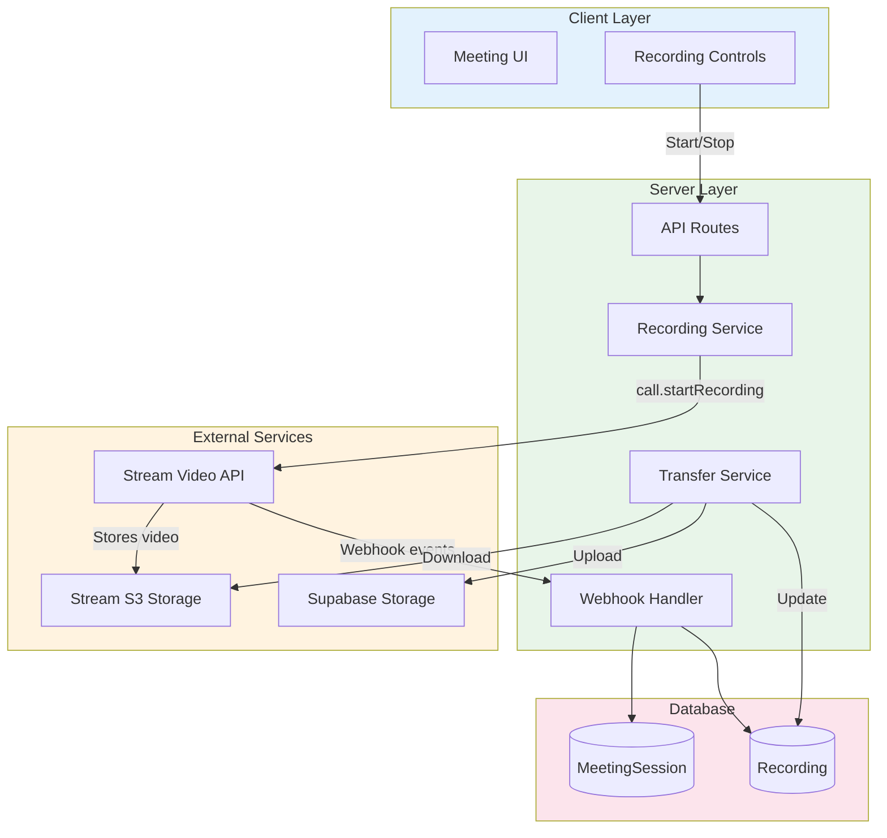
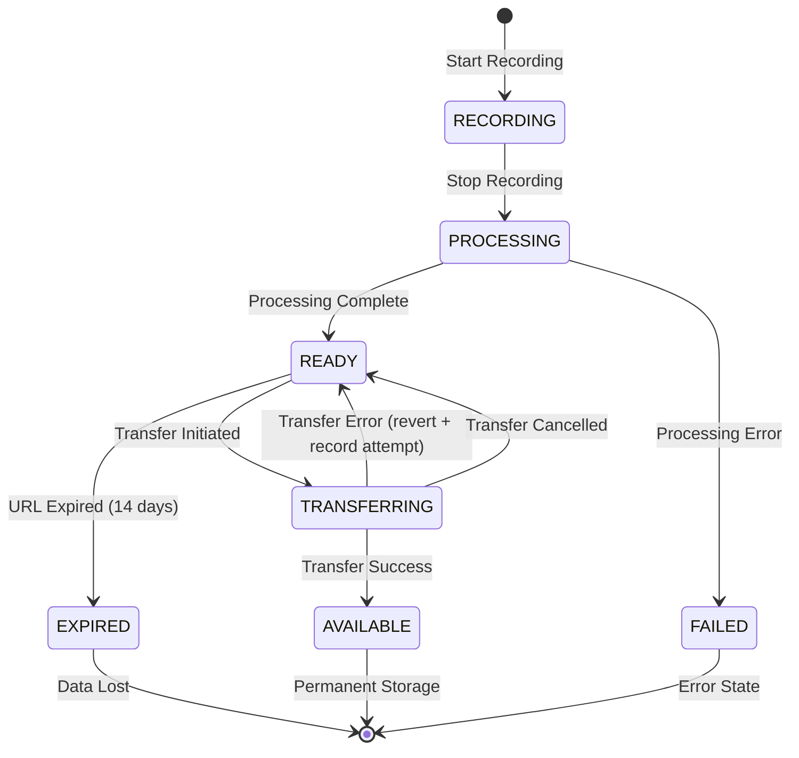
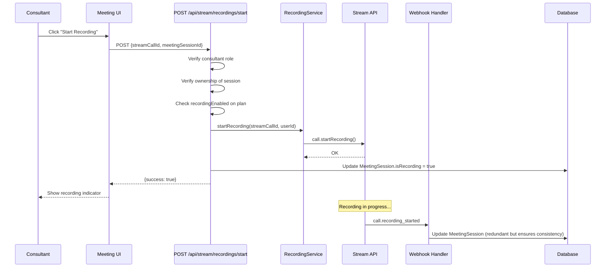
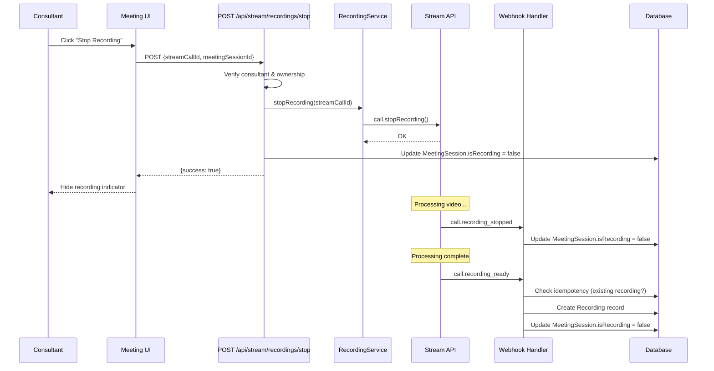
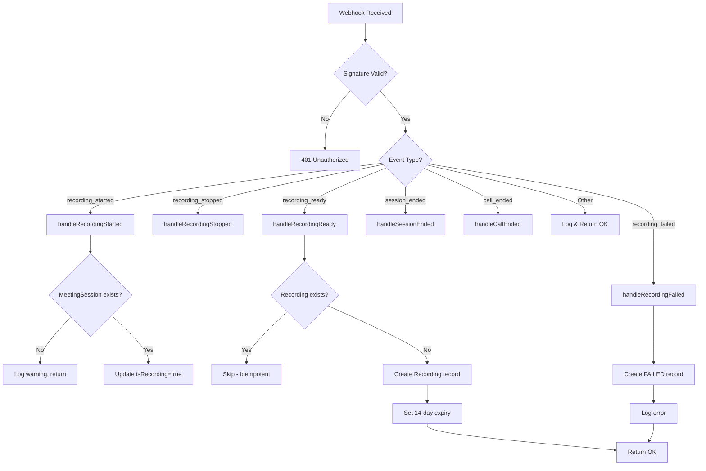
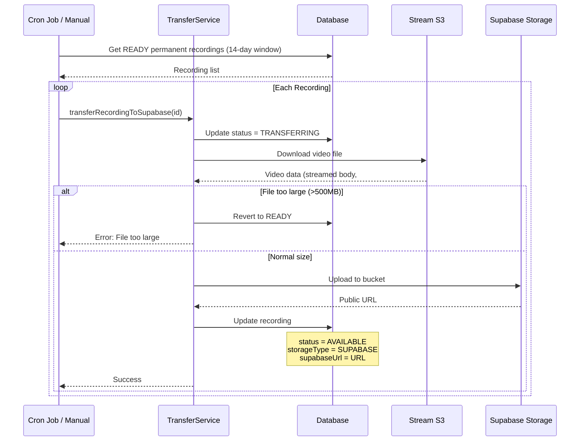

# Stream Recording & Webhooks

Comprehensive documentation for Stream video call recording and webhook handling in Familiarise.

## Navigation

- [Architecture](./01-architecture.md)
- [Setup & Configuration](./02-setup-configuration.md)
- [Provider & Authentication](./03-provider-authentication.md)
- [Video Implementation](./05-video-implementation.md)
- [Troubleshooting](./troubleshooting.md)

---

## Table of Contents

1. [Overview](#overview)
2. [Recording Architecture](#recording-architecture)
3. [Recording Lifecycle](#recording-lifecycle)
4. [Data Models](#data-models)
5. [Recording Flow](#recording-flow)
6. [Webhook Events](#webhook-events)
7. [Webhook Handler Flow](#webhook-handler-flow)
8. [Recording Transfer](#recording-transfer)
9. [API Routes Reference](#api-routes-reference)
10. [Access Control Matrix](#access-control-matrix)
11. [Key Implementation Files](#key-implementation-files)
12. [Configuration](#configuration)

---

## Overview

The recording system enables consultants to record webinars and classes for later viewing by enrolled participants. Recordings follow a two-stage storage architecture:

1. **Stream S3** - Initial storage provided by Stream (14-day expiration)
2. **Supabase Storage** - Permanent storage after transfer

### Key Features

- **Consultant-only recording control** - Only the session host can start/stop
- **Automatic webhook processing** - Recording lifecycle managed via webhooks
- **Idempotent operations** - Safe to receive duplicate webhook events
- **Automatic transfer** - The `recording_ready` webhook enqueues the permanent-storage transfer immediately (via Next.js `after()`), and a cron job runs as a backstop sweeper that picks up any recording the webhook missed before its Stream URL expires. **See the correction below: this describes a pipeline that has never run.**
- **Capability-based access** - Consultants, consultees, collaborators and replay buyers each reach a recording through a distinct ownership or entitlement path, and platform operators reach it through the back-office permission matrix: staff see metadata, admin alone plays the session, and either one is audited (#1270)

---

## Recording Architecture

### High-Level Overview



### Storage Architecture

| Storage       | Duration  | Use Case           | URL Format                                  |
| ------------- | --------- | ------------------ | ------------------------------------------- |
| **Stream S3** | 14 days   | Initial processing | `https://stream-io-*.s3.amazonaws.com/...`  |
| **Supabase**  | Permanent | Long-term storage  | `https://[project].supabase.co/storage/...` |

---

## Recording Lifecycle

### Recording Status Flow



### Status Definitions

| Status         | Description                         | Storage Type | URL Available |
| -------------- | ----------------------------------- | ------------ | ------------- |
| `RECORDING`    | Recording in progress               | N/A          | No            |
| `PROCESSING`   | Stream processing video             | Stream S3    | No            |
| `READY`        | Available on Stream S3              | STREAM_S3    | Yes (14 days) |
| `TRANSFERRING` | Being transferred to Supabase       | STREAM_S3    | Yes           |
| `AVAILABLE`    | Permanently stored in Supabase      | SUPABASE     | Yes           |
| `EXPIRED`      | Stream URL expired, not transferred | STREAM_S3    | No            |
| `FAILED`       | Recording capture failed            | N/A          | No            |

As of #689 (STR-2/3), a failed _transfer_ no longer lands in `FAILED`. Every transfer failure path reverts the recording to `READY` so that both the cron job and the manual `/transfer` route can retry it, since a `FAILED` status would permanently dead-end the recording (the manual route only accepts `READY` recordings). `FAILED` is now reached only by a capture/processing failure, not by a transfer error.

### Storage Type Transitions

```
STREAM_S3 (initial) --> SUPABASE (after transfer)
```

---

## Data Models

### Recording Model

```prisma
model Recording {
  id                  String          @id @default(cuid())
  title               String
  recordingUrl        String          // Stream S3 URL (temporary)
  supabaseUrl         String?         // Supabase URL (permanent)
  supabasePath        String?         // Supabase storage path
  durationInMinutes   Int
  recordedAt          DateTime
  streamRecordingId   String?         // Stream filename identifier
  streamCallId        String?         // Associated Stream call ID
  storageType         RecordingStorageType @default(STREAM_S3)
  status              RecordingStatus @default(READY)
  streamUrlExpiresAt  DateTime?       // When Stream URL expires
  transferredAt       DateTime?       // When transferred to Supabase
  fileSize            BigInt?         // File size in bytes

  // #689 (STR-2/3) — transfer reliability tracking
  transferAttempts         Int       @default(0) // Failed-transfer counter; reset to a clean trail on success
  lastTransferError        String?   // Message from the most recent failed transfer
  transferFailureAlertedAt DateTime? // Set when engineering has been paged for this recording (dedupe)

  meetingSessionId    String
  meetingSession      MeetingSession  @relation(...)

  createdAt           DateTime        @default(now())
  updatedAt           DateTime        @updatedAt
}

enum RecordingStorageType {
  STREAM_S3
  SUPABASE
}

enum RecordingStatus {
  RECORDING
  PROCESSING
  READY
  TRANSFERRING
  AVAILABLE
  EXPIRED
  FAILED
}
```

### MeetingSession Recording Fields

```prisma
model MeetingSession {
  id                  String    @id @default(cuid())
  streamCallId        String    @unique

  // Recording state (real-time)
  isRecording         Boolean   @default(false)
  recordingStartedAt  DateTime?
  recordingStartedBy  String?   // User ID who started recording

  // Related recordings
  recordings          Recording[]

  // ... other fields
}
```

### Entity Relationships

```mermaid
erDiagram
    MeetingSession ||--o{ Recording : "has many"
    MeetingSession ||--|| SlotOfAppointment : "belongs to"
    SlotOfAppointment ||--|| Appointment : "belongs to"
    Appointment ||--o| Webinar : "may have"
    Appointment ||--o| Class : "may have"
    Webinar ||--|| WebinarPlan : "belongs to"
    Class ||--|| ClassPlan : "belongs to"
    WebinarPlan ||--|| ConsultantProfile : "owned by"
    ClassPlan ||--|| ConsultantProfile : "owned by"

    Recording {
        string id PK
        string title
        string recordingUrl
        string supabaseUrl
        int durationInMinutes
        datetime recordedAt
        string status
        string storageType
    }

    MeetingSession {
        string id PK
        string streamCallId UK
        boolean isRecording
        datetime recordingStartedAt
    }
```

---

## Recording Flow

### Start Recording Sequence



### Stop Recording Sequence



---

## Webhook Events

### Handled Event Types

| Event Type                        | Description                          | Handler                            |
| --------------------------------- | ------------------------------------ | ---------------------------------- |
| `call.recording_started`          | Recording has begun                  | `handleRecordingStarted()`         |
| `call.recording_stopped`          | Recording has stopped                | `handleRecordingStopped()`         |
| `call.recording_ready`            | Recording is processed and available | `handleRecordingReady()`           |
| `call.recording_failed`           | Recording failed                     | `handleRecordingFailed()`          |
| `call.session_ended`              | A participant's session ended        | `handleSessionEnded()`             |
| `call.ended`                      | The entire call has ended            | `handleCallEnded()`                |
| `call.session_participant_joined` | A participant joined the call        | `handleSessionParticipantJoined()` |
| `call.session_participant_left`   | A participant left the call          | `handleSessionParticipantLeft()`   |

### Per-Attendee Attendance Capture

As of #689 (STR-4), the platform records per-attendee presence rather than only call-level lifecycle. The two `call.session_participant_*` handlers above maintain a `MeetingAttendance` row keyed on the unique pair of meeting session and app user. The first join for a user creates the row and stamps `firstJoinedAt`; a rejoin only increments `joinCount`, leaving `firstJoinedAt` immutable so it always reflects the genuine first arrival. A participant-left event stamps `lastLeftAt`, and because a leave can arrive before or without a recorded join, the left handler upserts as well (defensively seeding `firstJoinedAt` from the leave time) so the event is never lost. The handlers are idempotent on the session-and-user key, so a duplicate webhook does not inflate the count. This attendance data is what unblocks no-show detection (#471) and overrun detection (#472), which previously had no underlying per-attendee record to read from.

### Event Payload Structures

#### call.recording_started

```typescript
interface StreamRecordingStartedEvent {
  call_cid: string; // "default:callId"
  type: "call.recording_started";
  user?: {
    id: string;
    name?: string;
  };
  created_at: string; // ISO timestamp
}
```

#### call.recording_stopped

```typescript
interface StreamRecordingStoppedEvent {
  call_cid: string;
  type: "call.recording_stopped";
  created_at: string;
}
```

#### call.recording_ready

```typescript
interface StreamRecordingReadyEvent {
  call_cid: string;
  type: "call.recording_ready";
  call_recording: {
    filename: string; // Unique recording identifier
    url: string; // Stream S3 URL (expires in 14 days)
    start_time: string; // Recording start timestamp
    end_time: string; // Recording end timestamp
  };
  created_at: string;
}
```

#### call.recording_failed

```typescript
interface StreamRecordingFailedEvent {
  call_cid: string;
  type: "call.recording_failed";
  error?: {
    message?: string;
    code?: string;
  };
  created_at: string;
}
```

### Webhook Security

Webhooks are verified using HMAC SHA256 signature:

```typescript
// Signature verification
const signature = req.headers.get("x-signature");
const expectedSignature = crypto
  .createHmac("sha256", STREAM_WEBHOOK_SECRET)
  .update(body)
  .digest("hex");

// Constant-time comparison (prevents timing attacks)
return crypto.timingSafeEqual(
  Buffer.from(signature),
  Buffer.from(expectedSignature),
);
```

---

## Webhook Handler Flow

### Main Handler Flowchart



### Idempotency Handling

Webhooks may be delivered multiple times. The handler uses multiple idempotency strategies:

1. **Event ID tracking** - Log webhook events with unique IDs
2. **Recording existence check** - Skip if recording already exists for filename
3. **Safe status updates** - Status updates are idempotent

```typescript
// Check if recording already exists (idempotency)
const existingRecording = await prisma.recording.findFirst({
  where: {
    meetingSessionId: meetingSession.id,
    streamRecordingId: filename, // Unique per recording
  },
});

if (existingRecording) {
  streamLogger.info("Recording already exists, skipping creation", {
    recordingId: existingRecording.id,
    streamRecordingId: filename,
  });
  return; // Safe to return early
}
```

---

## Recording Transfer

### Transfer Architecture



### Transfer Configuration

| Setting             | Value        | Description                                                                                                                                                                                         |
| ------------------- | ------------ | --------------------------------------------------------------------------------------------------------------------------------------------------------------------------------------------------- |
| `MAX_TRANSFER_SIZE` | 500MB        | Maximum file size for direct transfer                                                                                                                                                               |
| `RECORDINGS_BUCKET` | "recordings" | Supabase storage bucket name                                                                                                                                                                        |
| `daysBeforeExpiry`  | 5            | Days before expiry to start transfer (default). The production jobs pass 14 — the full Stream URL lifetime — so every READY permanent recording is swept near-ready rather than near-expiry (#899). |
| `batchSize`         | 10           | Max recordings per cron run                                                                                                                                                                         |

### Storage Path Format

```
recordings/{year}/{month}/{recordingId}/{filename}

Example:
recordings/2025/01/clx123abc/rec_xyz789.mp4
```

### Transfer Service Methods

```typescript
class RecordingTransferService {
  // Queue for transfer
  static async queueRecordingTransfer(recordingId: string): Promise<boolean>;

  // Execute transfer
  static async transferRecordingToSupabase(recordingId: string): Promise<{
    success: boolean;
    error?: string;
  }>;

  // Process batch of expiring recordings
  static async processExpiringRecordings(
    daysBeforeExpiry?: number,
    batchSize?: number,
  ): Promise<{
    processed: number;
    succeeded: number;
    failed: number;
    errors: string[];
  }>;

  // Mark expired recordings
  static async markExpiredRecordings(): Promise<number>;

  // Delete from Supabase
  static async deleteRecordingFromSupabase(recordingId: string): Promise<{
    success: boolean;
    error?: string;
  }>;

  // Get best available URL
  static getBestRecordingUrl(recording: Recording): string | null;
}
```

### Transfer Failure Handling and Paging

As of #689 (STR-2/3), transfer reliability is tracked on the recording itself rather than left to logs. Every failure path inside `transferRecordingToSupabase` — a missing bucket, a failed download, a file over the 500MB limit, an upload error, or any unexpected exception — routes through a single `recordTransferFailure` helper. That helper reverts the recording to `READY`, increments `transferAttempts`, and stamps `lastTransferError` with the failure message. A successful transfer clears this trail by nulling `lastTransferError` and `transferFailureAlertedAt`, so a recording that recovers stops looking stuck.

Once a recording crosses three failed attempts, the helper pages engineering exactly once by calling `recordSystemError` with the `RECORDING_TRANSFER` category, and stamps `transferFailureAlertedAt` so the same stuck recording does not re-page on every subsequent sweep. The stamp is written only after the page is recorded, so a crash mid-alert re-pages on the next failure rather than silently swallowing it.

### STREAM_ONLY Expiry Warning

For recordings on a `STREAM_ONLY` plan there is nothing to auto-transfer — the URL simply expires after fourteen days. As of #689, the previously-TODO expiry-warning email to the consultant is now actually sent. `getExpiringStreamOnlyRecordings` collects the consultant-owned `STREAM_ONLY` recordings whose Stream URL expires soon but has not yet lapsed, and the expiry-warning job dispatches a notification to each owning consultant through Novu so they can save the recording before it is lost.

---

## API Routes Reference

### Recording Control Routes

#### POST /api/stream/recordings/start

Start recording for a video call.

**Authorization:** Consultant only, must own the session

**Request:**

```json
{
  "streamCallId": "abc123",
  "meetingSessionId": "clx123..."
}
```

**Response:**

```json
{
  "success": true,
  "message": "Recording started"
}
```

**Errors:**

- `401` - Unauthorized
- `403` - Not a consultant / Not session owner / Recording not enabled
- `400` - Already recording
- `404` - Meeting session not found

---

#### POST /api/stream/recordings/stop

Stop recording for a video call.

**Authorization:** Consultant only, must own the session

**Request:**

```json
{
  "streamCallId": "abc123",
  "meetingSessionId": "clx123..."
}
```

**Response:**

```json
{
  "success": true,
  "message": "Recording stopped"
}
```

---

### Recording Query Routes

#### GET /api/stream/recordings/[recordingId]

Get a single recording by ID.

**Authorization:** the consultant who delivered the session, an accepted collaborator on its plan, a consultee holding a net-positive payment for the plan, or a standalone replay buyer. Platform operators reach it through the back-office matrix instead: `recordings.read` admits ADMIN and STAFF, while `recordings.play` is ADMIN-only. See the [Operator access](#operator-access-admin--staff) section below.

A successful response always carries an `access` object so a client can tell "you may not play this" apart from "there is nothing to play yet" — both of which present as a null `playbackUrl`. Error responses do not carry it, including the `410` returned when a Stream URL has lapsed for a caller entitled to play it.

**Response (full access):**

```json
{
  "recording": {
    "id": "clx123...",
    "title": "Webinar: Introduction to React - Jan 15, 2025",
    "playbackUrl": "https://...",
    "thumbnailUrl": "https://...",
    "previewClipUrl": "https://...",
    "durationInMinutes": 45,
    "recordedAt": "2025-01-15T10:00:00Z",
    "status": "AVAILABLE",
    "storageType": "SUPABASE"
  },
  "access": { "level": "FULL" }
}
```

**Response (staff, metadata only):**

```json
{
  "recording": {
    "id": "clx123...",
    "title": "Webinar: Introduction to React - Jan 15, 2025",
    "playbackUrl": null,
    "thumbnailUrl": null,
    "previewClipUrl": null,
    "durationInMinutes": 45,
    "recordedAt": "2025-01-15T10:00:00Z",
    "status": "AVAILABLE",
    "storageType": "SUPABASE",
    "streamUrlExpiresAt": null
  },
  "access": {
    "level": "METADATA_ONLY",
    "reason": "Playback requires the recordings.play permission; staff receive metadata only."
  }
}
```

Every media URL is withheld from the metadata-only response, not only `playbackUrl`. A thumbnail is a frame of the session and the preview clip is a cut of it, so returning either would hand over exactly the content the cap exists to protect. The expiry branch behaves differently too: a full-access caller receives a `410` when a `STREAM_S3` recording's link has lapsed, whereas a metadata-only caller receives the record with `streamUrlExpiresAt` populated, because diagnosing that expiry is the reason a support agent is looking at all.

---

#### POST /api/stream/recordings/[recordingId]/transfer

Transfer a recording from Stream S3 to Supabase.

**Authorization:** Consultant only, must own the recording

**Response:**

```json
{
  "success": true,
  "message": "Recording transferred successfully",
  "recording": { ... }
}
```

---

#### POST /api/stream/recordings/sync

Sync recordings from Stream API for the current user.

**Authorization:** Authenticated user (Consultant or Consultee)

**Response:**

```json
{
  "success": true,
  "synced": 3,
  "recordings": [ ... ]
}
```

**Rate limit:** three calls per five minutes per user, via `streamRecordingSyncLimiter`. One POST here walks every session the caller owns or is enrolled in and issues a `listRecordings` request to Stream for each of them, so a single authenticated account could otherwise force an unbounded and billable fan-out. The edge `stream: api` rule already matched this path, but it is keyed by IP at sixty per minute, which neither identifies the caller nor reflects what the endpoint costs to serve. The user-keyed limiter is sized on what the feature is for: somebody presses "Sync" because a replay is missing, and the answer does not change on the second press.

---

### Recording Consent Routes

Consent is asked for before anyone joins, not while a recording is running. Both
handlers are gated by `resolveMeetingAccess`, the same resolver the join gate
uses, so only somebody actually on this appointment can read the notice or
record a decision about it. Without that gate the endpoint would leak which
meeting identifiers exist and which of them are recorded.

#### GET /api/meetings/[meetingId]/recording-consent

Returns the notice this person must be shown before joining, if any.

**Authorization:** any participant on the appointment.

**Response:**

```json
{
  "required": true,
  "regime": "OPT_OUT",
  "noticeVersion": 1,
  "decision": null
}
```

`regime` is `OPT_OUT` for one-to-one sessions, where declining is real and
costs nothing — the person still joins and the host's recording endpoint
refuses. It is `ACKNOWLEDGE` for group events, where the recording is part of
what attendees bought and the only action available is to understand it.

`required: false` means there is nothing to disclose, and the client should not
block joining.

#### POST /api/meetings/[meetingId]/recording-consent

Records a decision.

**Authorization:** any participant on the appointment, for their own decision
only.

**Request:**

```json
{ "decision": "GRANTED" }
```

`decision` is `GRANTED` or `DECLINED`.

**Implementation notes.** Three details of these handlers are easy to
reintroduce incorrectly.

Neither handler loads the meeting a second time. `resolveMeetingAccess` already
joins the session, its slot and all four plan relations in order to decide
whether the caller is the host, so it returns `meetingSessionId` and
`appointment` and the handlers read them off the result. Both used to re-run the
same `findUnique` immediately after the access check, which on this deployment
is serialized latency rather than parallel work. See the
[ADR](../decisions/2026-08-13-meeting-access-returns-what-it-loaded.md).

The choice between 404 and 403 comes from `access.reason === "not_found"`, never
from comparing `access.message` against a string. Rewording a user-facing
message must not be able to change a status code.

Enforcement is at recording start only. The `DECLINED` check lives inside the
atomic claim in `POST /api/stream/recordings/start`, so a decline arriving
between the read and the write loses the race rather than being ignored. A
decline made _after_ recording has begun has no effect, because what should
happen to the recording that already exists is an open product question rather
than an implementation gap. It is tracked in #1146.

**Client.** `useRecordingConsent` in
`app/meetings/[id]/components/RecordingConsentNotice.tsx` returns a
`ConsentGate` of `{ satisfied, loading, node }`. `loading` is true only while
the fetch is outstanding, which the lobby needs in order to distinguish that
window from a genuinely outstanding decision — `satisfied` is false in both, and
the Join button is disabled in both. `MeetingSetup` reads it and labels the
button "Checking recording notice..." rather than leaving it disabled with
nothing on screen accounting for it.

---

### Webhook Route

#### POST /api/stream/webhooks

Receives webhook events from Stream.

**Headers:**

- `x-signature` - HMAC SHA256 signature

**Response:**

```json
{
  "status": "ok"
}
```

---

## Access Control Matrix

### Recording Operations

| Role           | Start | Stop | View Own | Metadata (any) | Play (any) | Transfer | Delete |
| -------------- | :---: | :--: | :------: | :------------: | :--------: | :------: | :----: |
| **Consultant** |  Yes  | Yes  |   Yes    |       No       |     No     |   Yes    |   No   |
| **Consultee**  |  No   |  No  |  Yes\*   |       No       |     No     |    No    |   No   |
| **Staff**      |  No   |  No  |   Yes    |      Yes       |   **No**   |    No    |   No   |
| **Admin**      |  No   |  No  |   Yes    |      Yes       |    Yes     |    No    |   No   |

\*Consultees can only view recordings for webinars/classes they have a live paid enrollment for. As of #689 (STR-1), a successful payment alone is no longer sufficient — the entitlement nets any refunds, so a fully-refunded buyer loses access while a partially-refunded buyer keeps it.

### Operator access (ADMIN / STAFF)

Until #1270 the operator grant was a single line — `if (isPrivileged(session.user.role)) hasAccess = true` — in both `GET /api/stream/recordings/[recordingId]` and `GET /api/stream/meetings/[streamCallId]/recording-info`. Because `isPrivileged` returns true for STAFF as well as ADMIN, any staff member could fetch a playback URL for any recording on the platform, including a 1:1 consultation they had no relationship to, and nothing was written anywhere to record that they had. The operator path was therefore strictly less accountable than the tenant path, where deleting a recording or exporting a call log already produced an `OrgAuditLog` row.

Three rules now hold, and they are implemented once in `lib/stream/recording-operator-access.ts` so no route can restate them differently.

First, the grant is resolved through `BACKOFFICE_PERMISSIONS`, which is the declared single source of truth for who reaches which internal surface. `recordings.read` covers metadata and admits both ADMIN and STAFF; `recordings.play` covers any URL that renders the session and admits ADMIN alone. A bare `isPrivileged` call left the grant invisible to the file that is supposed to enumerate it.

Second, staff receive metadata only. Everything a support agent needs in order to answer "where is my replay" — status, storage type, duration, recorded-at, and the Stream URL expiry — is metadata, and none of it requires watching the session. The session content belongs to the two people who agreed to record it for each other, not to the platform.

Third, the operator branch is evaluated last, after every ownership and entitlement path. A staff member who actually delivered or bought the session passes one of those checks and keeps full playback; the operator branch only ever catches somebody with no relationship to the session at all. ADMIN is the one exception and short-circuits first, because holding `recordings.play` means the ownership walk cannot widen anything for them.

### Auditing a privileged read

Every read that is granted by the operator branch writes a trail before the response is built, and before any playback URL is minted, so the trail cannot lag the access it describes. There are two sinks.

`OrgAuditLog` receives a `STREAM_RECORDING_ACCESSED` row whenever the session belongs to an organization, so the tenant can see that a platform operator reached into their sessions. `actorMembershipId` is null because the operator is acting as the platform rather than as a member; the actor's user id and role live in `details`, alongside `played`, which distinguishes a metadata read from playback. This write is deliberately not swallowed — it mirrors the sibling compliance export at `app/api/organizations/[orgId]/stream/calls/route.ts`, where a read that cannot be audited is not served.

`SystemEvent` receives a `STREAM_RECORDING_ACCESS` row on every privileged read, including B2C recordings that have no tenant to write to. It is recorded at `WARN` severity rather than `INFO` so that reaching into someone else's session stands out when an on-call engineer scans the platform trail. `recordSystemEvent` is best-effort by its own contract, which is the honest ceiling today: there is no platform-wide audit table to write to instead, and introducing one is a schema change.

### Playback URLs never leave the handler raw

`Recording.recordingUrl` holds Stream's pre-signed S3 link. It is valid for fourteen days and carries its own credentials, so anybody who ends up holding the string can fetch the video with no session and no membership — a forwarded email, a pasted chat message, an exported CSV, or a third-party tool consuming the API all suffice. `GET /api/organizations/[orgId]/stream/calls` used to return that column verbatim to any org MANAGER+ when called with `?withRecordings=1`.

That export now uses an explicit select allowlist that names no field which reaches the media — not `recordingUrl`, not `supabaseUrl`, not `supabasePath`, and not the thumbnail, preview clip or Stream identifiers. What remains is the retention picture the compliance pull actually exists for: whether a recording exists, whether it survived the transfer to permanent storage, how long it runs, and when its Stream link lapses.

The route deliberately offers no playback arm at all, not even a short-lived signed one. [ADR 20](../enterprise/70-design-decisions/20-org-visibility-into-member-sessions.md) is the governing rule — an organization may see that a session happened, not what happened in it — and it considered and rejected exactly that design, on the grounds that an audit row does not change what a member has to assume about who can watch their coaching session. The equivalent allowlist already existed in `lib/api/scope/list-recordings.ts` for the org recordings page; this route was the arm the July 2026 audit missed.

### Access Verification Logic

```typescript
// Consultant access check
const isOwner = getMeetingSessionOwnershipInfo(
  meetingSession,
  user.consultantProfileId,
).isOwner;

// Consultee access check (#689, STR-1)
// `PaymentStatus` has no REFUNDED value — a refunded payment stays SUCCEEDED
// and the money movement lives only in `Refund` rows. A `SUCCEEDED` filter
// alone therefore still matches a fully-refunded buyer, so the check loads
// the payment's refunds and nets them via the shared isPaymentEntitled() helper.
const payment = await prisma.payment.findFirst({
  where: {
    userId: user.id,
    paymentStatus: "SUCCEEDED",
    appointment: {
      // ... matches recording's appointment
    },
  },
  include: { refunds: true },
});

// A full refund (refunded paise >= amount) revokes access; a partial refund
// keeps it. The same isPaymentEntitled() helper guards all four entitlement
// paths: the single-recording route, getPaidPlanIds, syncRecordingsForConsultee,
// and the meetings recording-info endpoint.
const hasPaidEnrollment = payment != null && isPaymentEntitled(payment); // lib/payments/utils/refund-balance.ts
```

### Recording Visibility Rules

1. **Consultants** see all their own recordings (webinars + classes)
2. **Consultees** see recordings only for paid enrollments that have not been fully refunded (as of #689, access nets refunds — a full refund revokes it, a partial refund retains it)
3. **Admins** can view all recordings for oversight
4. **Recording must not be FAILED or EXPIRED** to be visible

---

## Key Implementation Files

### Core Services

| File                                       | Purpose                        |
| ------------------------------------------ | ------------------------------ |
| `lib/stream/recording-service.ts`          | Recording CRUD operations      |
| `lib/stream/recording-transfer-service.ts` | Stream S3 to Supabase transfer |
| `lib/stream/recording-handlers.ts`         | Webhook event handlers         |
| `lib/stream/recording-utils.ts`            | Helper functions               |
| `lib/stream/recording-types.ts`            | Prisma payload types           |
| `lib/stream/recording-operator-access.ts`  | Operator grant + audit (#1270) |

### API Routes

| File                                                             | Endpoint            |
| ---------------------------------------------------------------- | ------------------- |
| `app/api/stream/recordings/start/route.ts`                       | POST /start         |
| `app/api/stream/recordings/stop/route.ts`                        | POST /stop          |
| `app/api/stream/recordings/sync/route.ts`                        | POST /sync          |
| `app/api/stream/recordings/[recordingId]/route.ts`               | GET /:id            |
| `app/api/stream/recordings/[recordingId]/transfer/route.ts`      | POST /:id/transfer  |
| `app/api/stream/webhooks/route.ts`                               | Webhook handler     |
| `app/api/stream/meetings/[streamCallId]/recording-info/route.ts` | GET recording state |
| `app/api/organizations/[orgId]/stream/calls/route.ts`            | GET org call export |

### Session Handlers

| File                             | Purpose                         |
| -------------------------------- | ------------------------------- |
| `lib/stream/session-handlers.ts` | Call session lifecycle handlers |

---

## Configuration

### Environment Variables

```env
# Stream API (required)
NEXT_PUBLIC_STREAM_API_KEY=your_api_key
STREAM_API_SECRET=your_api_secret

# Webhook signature verification (required for webhooks)
STREAM_WEBHOOK_SECRET=your_webhook_secret

# Supabase (required for transfer)
NEXT_PUBLIC_SUPABASE_URL=https://xxx.supabase.co
NEXT_PUBLIC_SUPABASE_ANON_KEY=your_anon_key
SUPABASE_SERVICE_ROLE_KEY=your_service_role_key
```

### Stream Dashboard Configuration

1. **Enable Recording** - Dashboard > Video > Settings > Enable Recording
2. **Configure Webhooks** - Dashboard > Webhooks > Add Endpoint
   - URL: `https://your-domain.com/api/stream/webhooks`
   - Events: `call.recording_*`, `call.session_ended`, `call.ended`
   - Signing Secret: Copy to `STREAM_WEBHOOK_SECRET`

### Supabase Storage Setup

1. Create a bucket named `recordings`
2. Set appropriate RLS policies:

   ```sql
   -- Allow service role full access
   CREATE POLICY "Service role access"
   ON storage.objects
   FOR ALL
   TO service_role
   USING (bucket_id = 'recordings');

   -- Allow authenticated users to read their recordings
   CREATE POLICY "Users can read own recordings"
   ON storage.objects
   FOR SELECT
   TO authenticated
   USING (bucket_id = 'recordings');
   ```

### The scheduled fleet behind recordings

Four scheduled workflows keep the recording pipeline honest. Each one runs as a
bare `npx tsx jobs/...` process under GitHub Actions, takes the fleet cron lock
so that a manual dispatch cannot race the schedule, and writes a
`SystemJobExecution` row that the staff Jobs page reads.

| Workflow                            | Schedule (UTC)         | What it does                                                                                                                                                                                                                                                                 |
| ----------------------------------- | ---------------------- | ---------------------------------------------------------------------------------------------------------------------------------------------------------------------------------------------------------------------------------------------------------------------------- |
| `transfer-expiring-recordings.yml`  | Every six hours at :58 | Copies every `SUPABASE_PERMANENT` recording out of Stream's S3 before the fourteen-day URL lapses, warns consultants whose `STREAM_ONLY` recordings are about to expire, and pages when a permanent recording is within seventy-two hours of expiry and still untransferred. |
| `mark-expired-recordings.yml`       | Daily at 03:20         | Flips `STREAM_S3` recordings whose `streamUrlExpiresAt` has passed to `EXPIRED`, so the dashboard stops offering a URL that no longer resolves.                                                                                                                              |
| `cleanup-old-stream-recordings.yml` | Daily at 03:00         | Deletes the Supabase object and tombstones the row for every recording past its organization's `streamRecordingRetentionDays`. This is the erasure half of the retention promise, so a failure here is a compliance problem rather than an untidy database.                  |
| `reconcile-orphaned-recordings.yml` | Daily at 05:00         | Recovers recordings whose `call.recording_ready` webhook was never delivered. See the section below.                                                                                                                                                                         |

### Recovering a recording whose webhook never arrived

A recording reaches the database exactly one way in normal operation: Stream
delivers `call.recording_ready` and the webhook route writes a `Recording` row.
When that delivery is lost, nothing in the system notices. The `MeetingSession`
still carries `recordingStartedAt`, because our own code wrote it rather than a
webhook, so the database records that a recording was started and simply has no
row for the recording itself.

Before #1270 the only repair was `POST /api/stream/recordings/sync`, which a
consultant has to click from the recordings page. That is not a backstop,
because the person who would click it is the person who does not yet know
anything is missing. Stream deletes the file fourteen days after the call, so a
dropped webhook was a permanent loss of the customer's recording on a
fourteen-day fuse — and #1134 established that dropped webhooks here were not
hypothetical, since every delivery was lost for the whole period the webhook
secret was unset in production.

`jobs/stream/reconcile-orphaned-recordings.ts` closes that gap. It selects every
meeting session whose `recordingStartedAt` falls between two hours and fourteen
days ago and which has no `Recording` row, asks Stream directly what recordings
exist for that call, and writes whatever it finds through
`RecordingService.syncSessionRecordings` — the same single writer the
user-triggered sync uses, so a reconciled row is indistinguishable from a
webhook-written one. The two-hour floor exists because Stream needs minutes to
finish the egress and upload for a long session, and sweeping earlier would race
the webhook it is backstopping.

The job reports three counts, and each one means something different. A non-zero
`recovered` is good news about this job and bad news about the webhook, so it
raises a Sentry warning: the row exists now, but it only exists because a
delivery was lost. A non-zero `stillMissing` means Stream held nothing for a call
that claims to have been recorded, which usually means the recording failed
rather than that it was lost in transit. A non-zero `unrecoverable` counts
sessions already past Stream's retention window; those recordings are gone for
good, and the number only grows, which makes it the honest measure of what the
missing webhook secret cost.

### Subscription drift is checked, not assumed

`scripts/stream/ensure-webhook-subscription.ts` compares the event types the live
Stream hook is subscribed to against `HANDLED_EVENT_TYPES`, the single list that
`lib/stream/webhook-dispatch.ts` also reads. Run it with no flags to see the
difference, with `--apply` to widen the hook, and with `--check` for the CI mode,
which never writes, annotates each finding for the Actions log and exits `2` when
the live app does not cover everything the dispatcher handles. An exit code of
`1` is different and means the check could not run at all, usually because the
runner has no Stream credentials.

`.github/workflows/stream-webhook-drift.yml` runs the `--check` mode daily and on
any pull request that touches the handled event list or the script itself.
Applying is deliberately left to a human, because `--apply` calls
`updateAppSettings` on a shared production Stream app that has no rehearsal
environment.

### Never import `@/lib/supabase` from a cron job

`lib/supabase.ts` opens with `import "server-only"`. That marker package's main
entry does nothing but throw; Next resolves it to an empty module under the
`react-server` export condition, and every other resolver — including the bare
Node process a workflow runs — gets the throw. Five scheduled workflows reached
it transitively and therefore died during module evaluation, before a line of
their own code ran, on every run they had ever had.

The Supabase clients and the storage primitives a job needs now live in
`lib/supabase-storage-core.ts`, which carries no marker. `lib/supabase.ts`
re-exports every one of those names, so application code is unaffected and still
gets the client-import guard. `__tests__/maintenance/workflow-import-env.test.ts`
re-derives each scheduled workflow's import graph on every test run and fails if
any of them reaches a `server-only` module again, or if a job that reaches the
Supabase client module is not given the `NEXT_PUBLIC_SUPABASE_URL` and
`NEXT_PUBLIC_SUPABASE_ANON_KEY` that module throws without.

---

## Troubleshooting

### Common Issues

#### Webhook not receiving events

1. Verify webhook URL is accessible from internet
2. Check `STREAM_WEBHOOK_SECRET` matches dashboard
3. Verify events are selected in Stream dashboard
4. Check server logs for signature validation errors

#### Recording not appearing after call

1. Check webhook handler logs for errors
2. Verify `streamCallId` matches between session and webhook
3. Check for duplicate detection (recording may already exist)
4. Verify call had recording enabled in Stream

#### Transfer failing

1. Check Supabase credentials and bucket exists
2. Verify file size is under 500MB limit
3. Check Stream URL hasn't expired
4. Review transfer service logs for errors

### Debug Logging

Enable detailed logging:

```typescript
import { streamLogger } from "@/lib/stream-logger";

// Logs are automatically structured with context
streamLogger.info("Recording started", { streamCallId, userId });
streamLogger.error("Transfer failed", error, { recordingId });
```

---

## Next Steps

- Review [Video Implementation](./05-video-implementation.md) for meeting UI
- Check [Troubleshooting](./troubleshooting.md) for common issues
- Return to [Architecture](./01-architecture.md) for system overview

---

## Correction — 2026-09-01

**The transfer pipeline described above has never executed once.** Measured
against the live database on 2026-08-30: 191 `Recording` rows, every one of them
`READY` / `STREAM_S3`, and `transferAttempts = 0` across the board. Not "runs and
sometimes fails" — never started.

Two causes stacked. The `recording_ready` webhook could not enqueue anything
because the whole Stream webhook endpoint 500'd on every delivery for months
(it demanded a `STREAM_WEBHOOK_SECRET` Stream does not issue — fixed 2026-08-13
in #1136), and the six-hourly backstop cron is one of the eight that could not
start at all because `lib/auth-server.ts` called React 18's absent `cache()` at
module scope (fixed in #1281).

The section above is left in place rather than deleted because it still
describes the design accurately, and because #1284 has since **decoupled new
recordings from that pipeline entirely** in favour of Stream's external storage —
writing straight to our own bucket, which removes the download-reupload hop, the
fourteen-day race, the size cap and the cron together. That work is tracked in
#1280 and is not yet shipped, so the transfer service and its workflow are still
in the tree.

Separately, #1280 catalogues four correctness defects that would have bitten had
it ever run: a 500MB size cap below a normal 60-minute recording, a success gate
that never verifies the uploaded bytes (a zero-byte MP4 can become the permanent
record of a paid session), a non-CAS status write that lets two concurrent
transfers permanently strand a recording, and a random path per retry that makes
orphaned objects impossible to collect.

**Do not read the section above as a description of production behaviour.**

---

**Last Updated:** 2026-09-01
