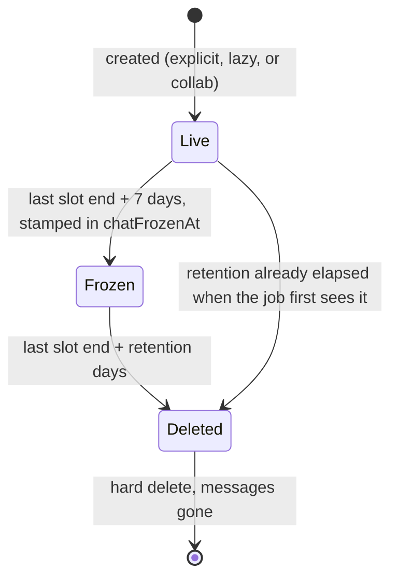

# 17. Channel Lifecycle

> How chat channels come into existence, how duplicate-create races resolve,
> how they age out (freeze, then delete), and the contract that keeps the
> dashboard sync from resurrecting the dead.

## Table of Contents

- [Two stores, two responsibilities](#two-stores-two-responsibilities)
- [Channel ID taxonomy](#channel-id-taxonomy)
- [How a channel comes into existence](#how-a-channel-comes-into-existence)
- [The duplicate-create race](#the-duplicate-create-race)
- [Aging: freeze, then delete](#aging-freeze-then-delete)
- [The sync expected-set contract](#the-sync-expected-set-contract)
- [Stream's per-request ceilings](#streams-per-request-ceilings)
- [Security surface rules](#security-surface-rules)
- [Testing map](#testing-map)

---

## Two stores, two responsibilities

Stream Chat is the system of record for message content and channel state:
messages, read state, and membership live only on Stream, and a deleted channel
is unrecoverable. Postgres is the system of record for entitlements and
scheduling truth: who booked what, when the last slot ends, and which
organization's retention dial applies. Neither store can answer the other's
questions — a Postgres appointment proves the *right* to be in a channel, not
that the channel exists, and a Stream channel proves nothing about why it was
created. Every mechanism in this document exists to manage the boundary between
the two: creation copies entitlements forward into Stream, expiry retires
channels once their entitlements are historic, and the sync repairs drift in
one direction only — Postgres decides, Stream obeys.

## Channel ID taxonomy

Every channel id is derived deterministically from domain entities. The
prefixes (`webinar-`, `class-`, `dm-`/`dmo-`, `collab-`, and the legacy
`consultation-`/`subscription-`) and the helpers around them live in
`lib/stream-channel-ids.ts`; read that file rather than any table here.
`MANAGED_CHANNEL_PREFIXES` in the same file defines the set the dashboard sync
is allowed to reconcile — anything outside it (collaborator threads, support
channels) is never swept.

## How a channel comes into existence

There are exactly three ways, and all of them run on the server:

1. **Explicit creators** — `actions/stream/chat/channel.action.ts`
   (`createChannel` plus the entity wrappers `createWebinarChannel`,
   `createClassChannel`, `createConsultationChannel`,
   `createSubscriptionChannel`, `createDirectMessageChannel`). Called from
   authenticated API routes under `app/api/` and from
   `lib/payments/webhooks/handlers.ts` at booking/approval time.
2. **Lazy create-on-miss** — `actions/stream/chat/event-channel.action.ts`
   (`addUserToEventChannel`, `addUserToDmChannel`). Try `addMembers` first;
   when that fails because the channel does not exist, build the full roster
   from Postgres and create atomically with every member included.
3. **Collaborator reconcile** — `createCollaboratorChannel` in
   `channel.action.ts`. Idempotent create plus a full member diff against the
   accepted-collaborator list, run when a collaborator invitation is accepted.

Creation is server-side by necessity, not preference: the Node SDK holds the
API secret, and every create call must carry `created_by_id` set to a real
member (the consultant host, or the DM initiator) — Stream rejects server-side
creates without it, and a synthetic "system" creator would break the
moderation-grant logic described next.

## The duplicate-create race

Lazy creation invites a race (architecture review 2026-08-23, F-HIGH-3): two
users join an event at the same instant, both `addMembers` calls fail because
the channel does not exist yet, and both proceed to `create()`. One wins; the
loser's `create()` rejects with Stream's duplicate-create error. Before the
adopt-on-race contract, that rejection propagated — from the awaited
payment-webhook path it failed a real attendee's join outright.

The contract is now: **lose the race, adopt the winner's channel.** The
predicate is `isChannelAlreadyExistsError` in `lib/stream-utils.ts`, which
matches three shapes — `error.code === 17`, HTTP status 409, and a
message-text `/already exists/i` fallback — because the rejection shape drifted
across stream-chat SDK versions, and v9 routes `create()` through the
get-or-create query endpoint.

What adoption does guarantee:

- The channel exists and was built from the same deterministic id and roster
  inputs, so the loser continues down the normal post-create path: the
  channel-scoped `channel_moderator` grant via `assignRoles`, and the
  `markChannelExists` cache stamp.
- The caller resolves successfully with the channel id it asked for. On the
  explicit path (`createChannel`) the raw create response is dropped
  (`channelData: null`) — callers consume the id and members, never the payload.

What adoption does **not** guarantee is your membership. The winner's roster
snapshot may predate you, so the lazy paths (`addUserToEventChannel`,
`addUserToDmChannel`) retry `addMembers([userId])` once after adopting. That
retry is best-effort: a failure is logged and swallowed, never thrown, and the
membership cache stays unwritten so nothing suppresses a future attempt — the
next dashboard sync will reconcile a genuinely missed membership anyway.
The explicit creators (`createChannel` and its entity wrappers) intentionally
skip an equivalent post-adoption diff: their roster inputs are deterministic
from the same entity rows the winner read, so divergence is rare and transient,
and a `queryChannels` diff on the awaited payment-webhook hot path would cost
more than it protects. Any other create failure — quota, outage, validation —
still propagates.

## Aging: freeze, then delete

Nothing used to end a webinar or class chat; membership grew without bound on a
product billed per MAU (#1134 P1-17). Channels now age through three states:

The thresholds are defined once in `lib/stream/channel-lifecycle.ts` —
`FREEZE_AFTER_DAYS = 7`, `DEFAULT_RETENTION_DAYS = 90`, `DAY_MS`, and
`isPastRetention()` — and both consumers import them, so the expiry job and the
dashboard sync cannot drift apart (review F-HIGH-2).

The daily job `jobs/stream/expire-event-channels.ts` (scheduled in
`.github/workflows/expire-event-channels.yml`) applies two stages:

- **Freeze (+7d after the last slot ends).** `updatePartial({ set: { frozen:
  true } })`: history stays readable, nobody can post. Because Stream has no
  batch freeze, this stage is paced and capped per run to stay under the
  app-wide UpdateChannelPartial rate limit — see the job's header comment for
  the pacing math and the 2026-08-23 burst that motivated it. After a
  successful Stream call, the job stamps the ledger:
  `Webinar.chatFrozenAt` / `Class.chatFrozenAt`. The ordering is deliberate: a
  missed stamp costs one redundant freeze on the next run (safe), while a
  premature stamp could leave a channel unfrozen forever (not safe).
- **Delete (at the org's retention window).**
  `deleteChannels(cids, { hard_delete: true })`, capped at 100 cids per
  request, asynchronous on Stream's side (it returns a task id). Re-deleting a
  deleted channel is a no-op. The window comes from the owning organization's
  `streamRecordingRetentionDays`, falling back to the schema default of 90 —
  one number reused rather than inventing a second dial to explain.

One subtlety shared by both the job and the sync: a webinar spans many
appointments (one per attendee cohort) but owns **one** channel, so its age is
the **latest** end across all cohorts, carrying *that* cohort's org dial.
Freezing on the earliest cohort's end would cut off a channel whose later
sessions are still running.

## The sync expected-set contract

`syncUserEventChannels` in `actions/stream/chat/event-channel.action.ts` is the
reconciliation loop: Postgres says which channels the user *should* belong to,
and the sync makes Stream agree. It builds the expected-set from the user's
webinars, classes, and DM pairs, then queries Stream for every channel the
user is actually in and removes memberships whose ids carry a managed prefix
but are not in the expected-set. There is no add pass any more — channels are
provisioned on demand by `POST /api/stream/channels/open` and eagerly at
booking approval and payment success — so revocation is the whole job, and
nothing else in the system notices that a membership *ought* to be withdrawn.
Only this user's membership is removed; stale channels survive for the people
still entitled to them.

The expected-set is Postgres-authoritative, which cuts both ways: rows that no
longer confer a right to a channel must be excluded, or the sync will *create*
damage instead of repairing it. Hence the retention filter (review F-HIGH-2):
`getWebinarIdsForUser` and `getClassIdsForUser` now select each event's latest
slot `endsAt` plus `organization.streamRecordingRetentionDays` off the
appointment(s), and drop events where `isPastRetention` is true — the same
window math the expiry cron applies, fed by the same shared constants.

Before that filter, the failure mode was resurrection. Postgres rows outlive
their Stream channels forever, so a finished event stayed in the expected-set
after the cron had hard-deleted its channel, and the next dashboard sync
lazily re-created it with the full historic roster. Worse, the pre-delete
freeze ledger made things *worse* on revival: the resurrected channel carried a
stamped `chatFrozenAt` upstream, so it classified as already-frozen, was never
frozen again, and sat writable forever while membership regrew unbounded. If
you touch either side of this filter, preserve the invariant: **an event past
retention must appear in neither the cron's work queue nor the sync's
expected-set.**

## Stream's per-request ceilings

Stream imposes two hard limits on the calls this subsystem makes, and both were
being ignored in ways that produced silent, partial correctness rather than
visible errors. `lib/stream/batch.ts` is the one place either number is
written down.

**`queryChannels` returns at most 30 channels per call, whatever `limit` you
pass.** Asking for 100 returns exactly 30. Both reconciliation call sites in
`event-channel.action.ts` used to ask for pages of 100 and loop while
`page.length === 100`, so the very first page looked short, the loop ended
after one request, and reconciliation only ever examined a user's *first thirty*
memberships. A DM whose booking had been cancelled but that happened to sit at
position 41 of the user's channel list was never read, never classified stale,
and never revoked — this is the DM revocation leak (#1270). The same loop also
advanced `offset` by the requested 100 rather than by the 30 actually returned,
so had it ever run a second time it would have skipped seventy channels.
`scripts/stream/purge-memberless-dms.ts` had already learned this the hard way;
the fix now lives in `queryChannelsPaged`, which pages at the real cap, advances
by the rows returned, and is shared by both call sites.

Two consequences of that helper are worth stating explicitly. It sorts the
reconciliation walk by `created_at` ascending rather than leaving the sort
unspecified, because offset paging is only coherent over a stable order and
Stream's default sort is `last_message_at` — which moves underneath a
multi-page walk, letting an active channel jump onto an earlier page and push
an unexamined one off the end. And it stops at Stream's maximum `offset` of
1000 and returns `truncated: true` rather than quietly handing back a prefix.
A user with more memberships than that gets a partial reconcile, which errs in
the safe direction — a channel nobody looked at keeps its member, it does not
lose one — but the run logs a warning instead of reporting a sweep it did not
perform.

**`channel.create()` carries its roster in the request body and accepts at most
100 members**, the same ceiling `upsertUsersToStream` already respected.
`Webinar.maxParticipants` is unbounded, so a 150-seat webinar assembled a valid
roster and then handed all of it to Stream in one oversized call that was
rejected outright: the first attendee to open chat got a caught exception, a
Sentry event, and no chat. Both create paths now send `createMemberChunk(...)`
— the first hundred — and follow with `addRemainingMembers(...)`, which adds
the rest in hundreds through the existing sequential `forEachChunk`. The
remainder pass also runs after an adopted race, since the winner created the
same channel from the same roster and `addMembers` is idempotent for anyone
already in.

Ordering inside that roster is load-bearing rather than incidental. Whoever
must certainly end up in the channel belongs at the front of the array, because
only the front hundred travel inside the atomic create; everyone after them
arrives in a follow-up request that can fail on its own. `createChannel` puts
the creator first by construction, and the lazy path in
`addUserToEventChannel` puts the consultant host and the joining user first,
so the person whose click triggered the create is never the one stranded.

## Security surface rules

`actions/stream/chat/channel.action.ts` is deliberately **not** a `"use
server"` module (review F-HIGH-1), and its header comment says it must never be
re-marked. Marking it so turned every export into a remotely invocable RPC with
no session check — and Stream's server-side API bypasses all of Stream's
permission checks — so any browser could mint arbitrary channels and
memberships, or trigger a full-database upsert storm billed to our MAU. (The
dead `initializeAllChannels` export, deleted in the same fix, was exactly such
a trigger.) Its callers today are all server-side: API routes under `app/api/`,
`lib/payments/webhooks/handlers.ts`, and `lib/collaborators/service.ts`.

If a client ever needs one of these operations directly, put a gate in front of
it — an authenticated API route, or a thin wrapper in its own `"use server"`
file that validates the session before delegating. Never widen the module
itself.

`event-channel.action.ts` *is* `"use server"`, so its exports are RPCs, and
they gate themselves. The pattern to copy is `assertCanMintToken` in
`actions/stream/chat/stream.action.ts`: read the session with the cookie cache
disabled (`getSession(true)`), so a just-demoted staff member or a just-banned
user cannot ride a stale cached session; reject banned accounts outright; allow
only self or privileged (`isPrivileged`) callers; throw otherwise.
`syncUserEventChannels` mirrors it exactly, and the gate fires **before** the
`force` path clears the sync dedup guard — an unauthenticated call must not be
able to reset someone else's guard. Legitimate callers always act as self:
`providers/StreamProviderImpl.tsx` fires the sync fire-and-forget, and
`components/chat/InitializeUserChannelsButton.tsx` passes the signed-in user's
own id. `addMemberToChannel` carries its own variant of the same gate:
privileged callers may add anywhere; anyone else only to a channel they
created.

## Testing map

| Suite | Pins |
| -------------------------------------------------------------- | ------------------------------------------------------------------------ |
| `__tests__/stream/channel-actions.test.ts` | Explicit-path adoption: losing `create()` still returns the id, `channelData` is null, `assignRoles` and `markChannelExists` still run; non-duplicate failures rethrow; `addMemberToChannel` authz gates. Also the 100-member create ceiling: a 250-seat roster creates with 100 and backfills 100 + 50, an ordinary two-person channel costs no extra request, and an adopted race still backfills. |
| `__tests__/stream/event-channel-actions.test.ts` | Lazy-path adoption plus the one-shot post-adoption `addMembers` retry; the sync gate (another user as non-privileged → Forbidden, banned user even for self → account suspended). Also the 30-row page cap: a full page forces a second request, offsets advance 0/30/60, a stale DM at position 41 is revoked, the walk sorts by `created_at`, and an offset-capped walk warns instead of claiming a clean sweep. |
| `__tests__/stream/batch.test.ts` | `queryChannelsPaged` in isolation — the 30 constant, second-page-on-full-page, offset advancing by rows returned, empty page as an empty answer rather than a truncated one, and the `truncated` flag at the 1000 ceiling; plus `createMemberChunk` / `addRemainingMembers` losing and duplicating nobody. |
| `__tests__/stream/__mocks__/stream-mocks.ts` | Shared mocks; `assignRoles` added so both suites can observe the moderator grant. |

---

**See also:** [06. Channel Management](./06-channel-management.md) for the
membership policy and sync signature; [09. Background Sync](./09-background-sync.md)
for the other scheduled sweeps; [troubleshooting.md](./troubleshooting.md) for
symptoms. The findings cited above (F-HIGH-1/2/3) come from the 2026-08-23
architecture review tracked in PR #1226.
