# Familiarise Platform Testing Playbook

**Welcome!** This document is your complete guide to understanding every feature of the Familiarise platform. Read it end-to-end in your first week, then use it as a reference.

**Last updated:** March 2026

---

## Table of Contents

- [Part 1: Platform Overview](#part-1-platform-overview)
- [Part 2: Getting Started](#part-2-getting-started)
- [Part 3: Feature Walkthrough](#part-3-feature-by-feature-walkthrough)
- [Part 4: Key Workflows](#part-4-key-workflows-visual-guides)
- [Part 5: Testing Checklists](#part-5-testing-checklists)
- [Part 6: Data Models](#part-6-key-data-models-simplified)
- [Part 7: Glossary](#part-7-glossary)

---

# Part 1: Platform Overview

## What Is Familiarise?

Familiarise is an **expert consultation marketplace** — think of it as "Shopify for Knowledge Businesses." It connects professionals (consultants) who have expertise with people (consultees) who need that expertise, through live video sessions, recurring mentorship, group webinars, and multi-week courses.

Unlike competitors that just provide a booking link + Zoom, Familiarise has **built-in HD video calls, real-time chat, session recording, document review, automatic scheduling, and Indian payment processing (UPI via Razorpay)** — all in one platform.

The platform supports **4 user roles** and **4 service types**, handles payments through **4 gateways**, and runs **25+ automated maintenance jobs** to keep everything running smoothly.

## Architecture Overview

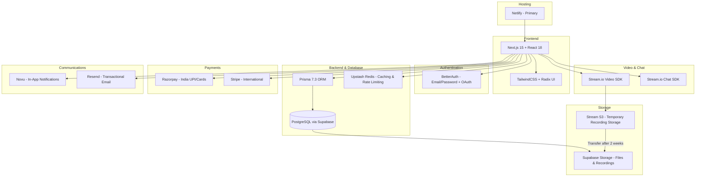

## The 4 User Roles

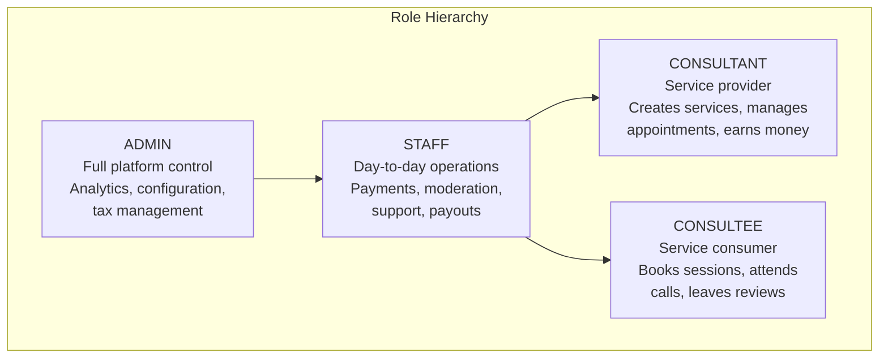

| Role | Who They Are | What They Can Do |
|------|-------------|------------------|
| **Consultee** | A client/learner seeking expertise | Browse experts, book sessions, join video calls, leave reviews, manage referrals |
| **Consultant** | A professional offering expertise | Create services, set availability, conduct sessions, earn money, manage payouts |
| **Staff** | Operations team member | Manage payments, refunds, disputes, moderation, support tickets, system jobs |
| **Admin** | Platform owner/super admin | Everything staff can do + analytics, configuration, maintenance mode, tax management |

## The 4 Service Types

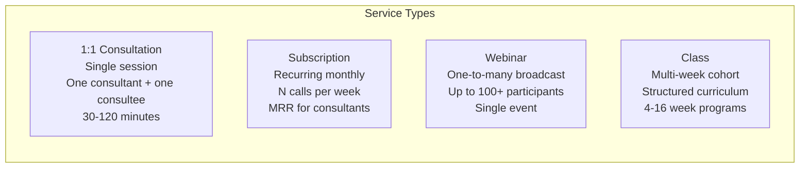

| Feature | Consultation | Subscription | Webinar | Class |
|---------|-------------|-------------|---------|-------|
| **Format** | 1-on-1 | 1-on-1 recurring | 1-to-many | Group, multi-session |
| **Duration** | Single session | Monthly (1-12 months) | Single event | 4-16 weeks |
| **Participants** | 2 (consultant + consultee) | 2 | Up to 100+ | Up to N (configurable) |
| **Pricing** | Per session | Monthly subscription | Per attendee | Per enrollment |
| **Trial** | No | Yes (30 or 60 min) | No | No |
| **Collaborators** | No | No | Yes (co-hosts, moderators) | Yes (co-instructors, TAs) |
| **Recording** | Optional | Optional | Optional | Optional |
| **Materials** | Yes | Yes + curriculum | Yes | Yes + curriculum |
| **Waitlist** | No | No | Yes | Yes |
| **Request Approval** | Yes | Yes | No (direct checkout) | No (direct checkout) |

---

# Part 2: Getting Started

## Setting Up Your Development Environment

### Prerequisites
- Node.js 18+
- npm or pnpm
- Git
- A code editor (VS Code recommended)

### Steps

1. **Clone the repository:**
   ```bash
   git clone <repo-url>
   cd familiarise_web
   ```

2. **Install dependencies:**
   ```bash
   npm install
   ```

3. **Set up environment variables:**
   - Copy `.env.sample` to `.env`
   - Ask the team lead for the actual values
   - Key variables you need to know about (don't worry about the values yet):

   | Variable | What It Does |
   |----------|-------------|
   | `DATABASE_URL` | Connects to Supabase PostgreSQL database |
   | `NEXT_PUBLIC_STREAM_API_KEY` | Stream.io video/chat (public key) |
   | `STREAM_API_SECRET` | Stream.io server-side key |
   | `RAZORPAY_KEY_ID` / `RAZORPAY_KEY_SECRET` | Razorpay payment gateway |
   | `STRIPE_SECRET_KEY` | Stripe payment gateway |
   | `RESEND_API_KEY` | Email sending |
   | `NOVU_API_KEY` | In-app notifications |
   | `UPSTASH_REDIS_*` | Redis for caching and rate limiting |
   | `BETTER_AUTH_SECRET` | Authentication encryption key |

4. **Run the development server:**
   ```bash
   npm run dev
   ```

5. **Open the app:** Go to `http://localhost:3000`

### Creating Test Accounts

You'll need accounts for each role to test features:

1. **Consultee account:** Sign up normally at `/auth/signup` and select "I'm looking for expert help"
2. **Consultant account:** Sign up at `/auth/signup` and select "I'm an expert" — you'll go through the onboarding flow
3. **Staff account:** Ask the team lead to create one for you, or update the `role` field in the database
4. **Admin account:** Same as staff — must be manually set in the database

**Tip:** Use different email addresses for each role. A pattern like `yourname+consultee@gmail.com`, `yourname+consultant@gmail.com` etc. works great (Gmail ignores the `+` part).

---

# Part 3: Feature-by-Feature Walkthrough

## 3.1 Authentication & Onboarding

### Sign Up

**What:** Creates a new user account. Users choose their role during sign-up.

**Where:** `/auth/signup`

**Who:** Anyone (public)

**How to test:**
1. Go to `/auth/signup`
2. Enter email, password, and name
3. Choose a role (Consultant or Consultee)
4. Click "Sign Up"
5. Check your email for a verification link (if email verification is enabled)
6. After signup, you'll be redirected based on role:
   - Consultee → `/dashboard/consultee/[id]/home`
   - Consultant → `/form/onboarding` (onboarding flow)

**What to look for:** Successful account creation, correct role assignment, proper redirect.

**Also supports:** Google, GitHub, and Facebook OAuth login via BetterAuth.

### Sign In

**Where:** `/auth/signin`

**How to test:**
1. Go to `/auth/signin`
2. Enter your credentials
3. You should be redirected to your role's dashboard

### Password Reset

**Where:** `/auth/forgot-password` → email with reset link → `/auth/reset-password`

**How to test:**
1. Go to `/auth/forgot-password`
2. Enter your email
3. Check email for reset link
4. Click the link, enter new password
5. Try logging in with the new password

### Consultant Onboarding

**What:** Multi-step form that new consultants must complete before they can list services.

**Where:** `/form/onboarding`

**Who:** New consultants only

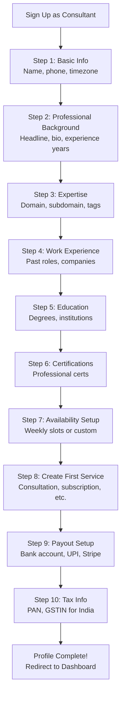

**How to test:**
1. Sign up as a consultant
2. Walk through each step — try both filling everything and skipping optional fields
3. After completion, check that:
   - Your profile appears at `/explore/experts`
   - Your dashboard loads at `/dashboard/consultant/[id]/home`
   - Your availability shows correctly

---

## 3.2 Consultant Features

### Profile Management

**What:** Consultants manage their public-facing profile that consultees see.

**Where:** `/dashboard/consultant/[id]/settings`

**Who:** Consultant

**How to test:**
1. Go to Settings in your consultant dashboard
2. Update your bio, headline, expertise areas
3. Upload a profile image
4. Add social links (LinkedIn, GitHub, Twitter, website)
5. Visit your public profile at `/explore/experts/[consultantId]` to see the changes
6. Check that your verification status badge shows correctly

**What to look for:** Changes reflect on public profile, image uploads work, social links are clickable.

### Service Creation (Planner)

**What:** Consultants create the services they want to offer. This is the core feature.

**Where:** `/dashboard/consultant/[id]/planner`

**Who:** Consultant

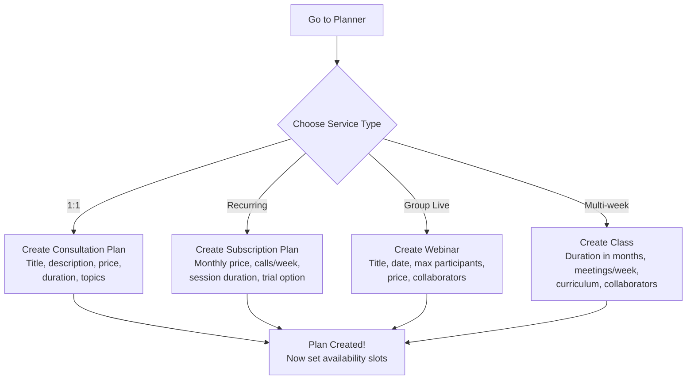

**How to test each service type:**

**Consultation:**
1. Go to Planner → Create Consultation
2. Fill in: title, description, price (e.g., 999 = ₹999), duration (1 hour)
3. Add topics and learning outcomes
4. Upload materials (optional PDF/docs)
5. Save and verify it appears in your planner list

**Subscription:**
1. Go to Planner → Create Subscription
2. Fill in: title, monthly price, calls per week, session duration
3. Enable a trial (30 min or 60 min) — this lets consultees try the service first (free or paid, per the plan's trial price)
4. Set plan duration (1 month, 3 months, etc.)
5. Add subscription content/curriculum
6. Save

**Webinar:**
1. Go to Planner → Create Webinar
2. Fill in: title, description, price per attendee, max participants
3. Set the date and time
4. Enable recording (optional)
5. Add collaborators (optional — co-hosts, moderators)
6. Save

**Class:**
1. Go to Planner → Create Class
2. Fill in: title, duration (months), meetings per week, price
3. Set max participants
4. Add class content/curriculum (ordered lessons)
5. Add collaborators (optional — co-instructors, TAs)
6. Save

### Availability & Scheduling

**What:** Consultants set when they're available for bookings. Two modes: weekly recurring slots and custom one-off slots.

**Where:** `/dashboard/consultant/[id]/planner` (schedule tab)

**Who:** Consultant

**How to test:**
1. Go to Planner → Schedule
2. **Weekly mode:** Set recurring slots (e.g., Monday 10:00-11:00 AM, Wednesday 2:00-3:00 PM)
3. **Custom mode:** Set specific date/time ranges for one-off availability
4. Check timezone handling: slots are stored in UTC but displayed in your local timezone
5. Try creating an overnight slot (e.g., 11:00 PM - 1:00 AM next day) — this tests UTC handling

**What to look for:**
- Overlap detection (can't create conflicting slots)
- Slots appear correctly on your public profile for consultees to book
- Timezone conversion is accurate

### Appointment Management

**What:** View and manage all your sessions — past, present, and upcoming.

**Where:** `/dashboard/consultant/[id]/appointments`

**Who:** Consultant

**How to test:**
1. Navigate to Appointments
2. You'll see tabs for each service type: Consultations, Subscriptions, Webinars, Classes
3. Click on any appointment to see details:
   - Participant info
   - Session status
   - Documents uploaded
   - Recording link (if available)
   - Chat access
4. Try joining a video call from here

### Requests & Approvals

**What:** When a consultee wants to book a consultation or subscription, they can send a request. The consultant reviews and approves/rejects it. Only after approval does the consultee pay.

**Where:** `/dashboard/consultant/[id]/requests`

**Who:** Consultant

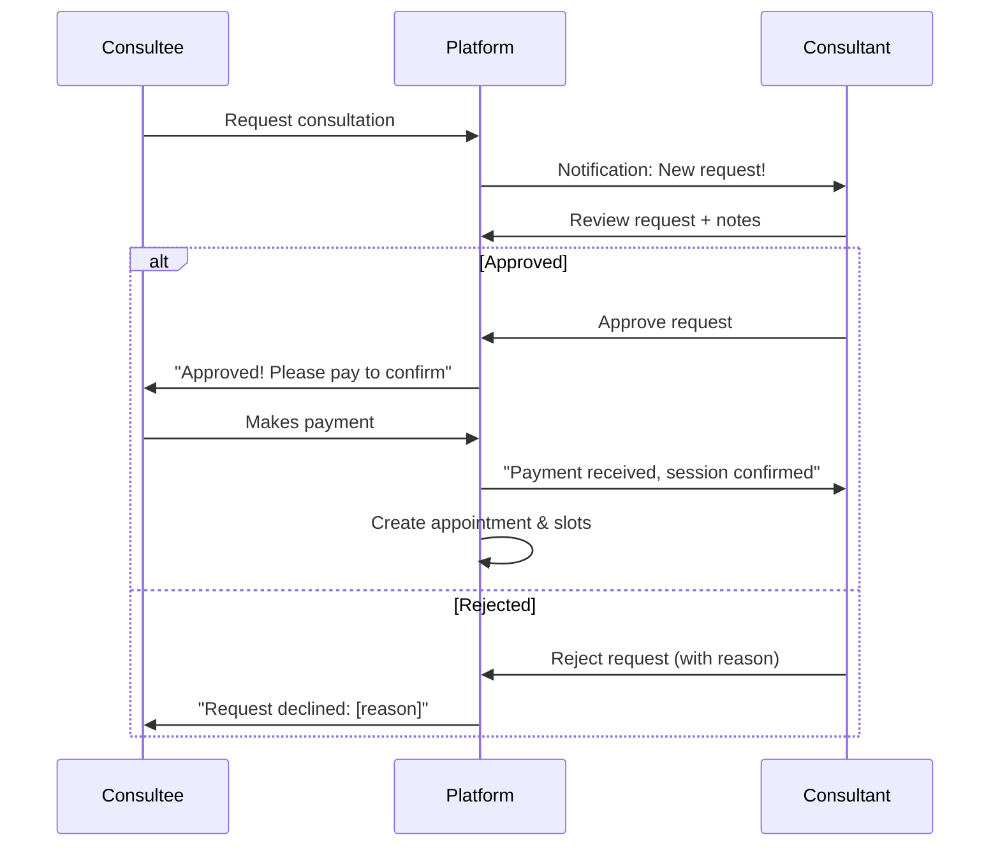

**How to test:**
1. From a consultee account, request a consultation with your consultant account
2. Switch to consultant account → go to Requests
3. You should see the pending request
4. Try approving it and see the status change to "Approved - Pending Payment"
5. Switch to consultee account, make the payment
6. Verify the appointment is created

### Earnings & Revenue

**What:** Track all money earned from sessions, with breakdowns by service type and status.

**Where:** `/dashboard/consultant/[id]/earnings`

**Who:** Consultant

**How to test:**
1. After completing a paid session, check the Earnings page
2. You should see the breakdown:
   - Gross amount (what the consultee paid)
   - Platform commission (10-20%)
   - Your net earnings
   - Status: PENDING → HELD → READY → PAID

**What to look for:** Earnings status transitions, commission calculation accuracy, multi-currency display if applicable.

### Payout Setup

**What:** Configure how you receive your money — bank transfer, UPI, or Stripe Connect.

**Where:** `/dashboard/consultant/[id]/settings` → Payout section

**Who:** Consultant

**How to test:**
1. Go to Settings → Payout
2. Add a bank account (account number, IFSC) OR UPI ID OR Stripe Connect
3. Set one as default
4. Check that it appears in payout requests

### Tax Information

**What:** Indian consultants must provide PAN for TDS (Tax Deducted at Source) compliance. The platform deducts 10% TDS (or 20% without PAN) under Section 194J.

**Where:** `/dashboard/consultant/[id]/settings` → Tax section

**Who:** Consultant (India only)

**How to test:**
1. Go to Settings → Tax Information
2. Enter PAN number (encrypted with AES-256-GCM before storage)
3. Optionally enter GSTIN
4. Check that TDS deductions appear correctly on payout records

### Recordings

**What:** Session recordings are automatically saved when enabled. They live on Stream.io S3 for 2 weeks, then get transferred to permanent Supabase storage.

**Where:** `/dashboard/consultant/[id]/recordings`

**Who:** Consultant

**How to test:**
1. Enable recording on a service plan
2. Conduct a session
3. After the session, check Recordings page
4. You should see the recording with status: RECORDING → PROCESSING → READY → (after 2 weeks) TRANSFERRING → AVAILABLE

### Chat

**What:** Real-time messaging with consultees using Stream.io Chat SDK.

**Where:** `/dashboard/consultant/[id]/chats`

**Who:** Consultant

**How to test:**
1. Go to Chats
2. Select a conversation with a consultee
3. Send a text message
4. Send a file attachment
5. Check that messages appear in real-time on both sides

### Collaborations

**What:** Invite other consultants to co-host webinars or co-instruct classes, with revenue sharing.

**Where:** `/dashboard/consultant/[id]/collaborations`

**Who:** Consultant

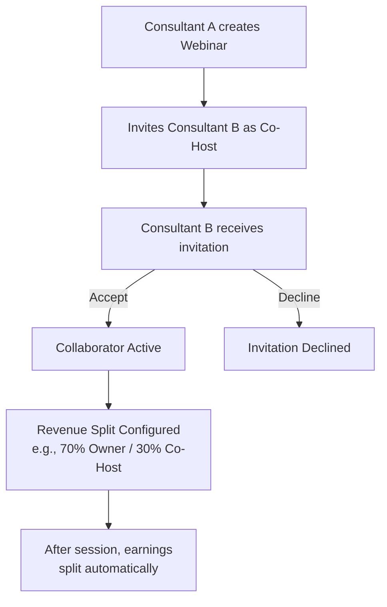

**How to test:**
1. Create a webinar or class
2. Go to the plan → Add Collaborator
3. Search for another consultant, assign a role (Co-Host, Moderator, Guest Speaker, etc.)
4. Set revenue share percentage
5. Switch to the other consultant's account — they should see the invitation
6. Accept the invitation
7. After a paid session, check that earnings split correctly

**Collaborator roles:**
- Webinar: CO_HOST, MODERATOR, GUEST_SPEAKER, TECHNICAL_SUPPORT
- Class: CO_INSTRUCTOR, TEACHING_ASSISTANT, GUEST_LECTURER, CONTENT_CREATOR

### Referral Codes

**What:** Consultants can generate referral codes to share. When someone signs up using the code, both parties earn credits.

**Where:** `/dashboard/consultant/[id]/referrals`

**Who:** Consultant

**How to test:**
1. Go to Referrals
2. Copy your auto-generated referral code
3. Optionally, customize the code
4. Share the link: `/r/[code]`
5. Have someone sign up using that link
6. Check that referral credits appear for both parties

### Trial Sessions

**What:** Trial sessions for subscription plans (free or paid via trialPriceInPaise). Limited to one trial per consultant-consultee pair.

**Where:** `/dashboard/consultant/[id]/trials`

**Who:** Consultant

**How to test:**
1. Enable a trial on a subscription plan (30 or 60 minutes)
2. From a consultee account, request a trial
3. From consultant account, go to Trials → approve the trial
4. Conduct the trial session
5. Check conversion tracking: did the consultee subscribe after the trial?

---

## 3.3 Consultee Features

### Browsing & Searching Experts

**What:** The marketplace where consultees discover and explore consultant profiles.

**Where:** `/explore/experts`

**Who:** Anyone (public, no login required)

**How to test:**
1. Go to `/explore/experts`
2. Browse the expert directory
3. Use filters: domain (tech, business, etc.), subdomain, tags
4. Sort by rating, experience, or price
5. Click on a consultant card to view their full profile

### Viewing Consultant Profiles

**Where:** `/explore/experts/[consultantId]`

**Who:** Anyone (public)

**How to test:**
1. Click on any consultant from the directory
2. Check that you see:
   - Bio, headline, experience
   - Ratings and reviews
   - Services offered (with prices)
   - Available time slots
   - Languages, expertise
   - Verification badge (if verified)
   - Social links

### Booking a Consultation (Full Checkout Flow)

**What:** The end-to-end process of booking a paid 1:1 session.

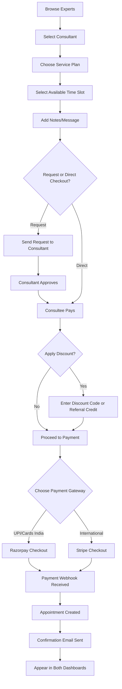

**How to test:**
1. Log in as consultee
2. Go to `/explore/experts` → select a consultant
3. Click on a consultation plan
4. Select an available time slot
5. Add a note (optional)
6. Submit the request (or proceed to checkout directly)
7. If request workflow: switch to consultant account, approve request, switch back
8. Complete payment (Razorpay for India, Stripe for international)
9. Check:
   - Payment appears in consultee's payment history
   - Appointment appears in both consultant and consultee dashboards
   - Confirmation email received
   - Earnings record created for consultant

### Joining Video Sessions

**What:** Join a live video call for any booked session.

**Where:** Accessible from appointment detail page, or via the meeting link

**Who:** Consultee (and Consultant)

**How to test:**
1. Find your upcoming appointment in the dashboard
2. Click "Join Session" when it's time
3. You'll enter the Stream.io video call interface
4. Test:
   - Video and audio work
   - Screen sharing works
   - In-call chat works
   - Recording indicator shows (if enabled)

### Leaving Reviews

**What:** After a session, consultees can rate and review the consultant.

**Where:** Post-session prompt, or from appointment history

**Who:** Consultee

**How to test:**
1. After completing a session, you should see a review prompt
2. Rate 1-5 stars
3. Write a review comment
4. Submit
5. Check that the review appears on the consultant's public profile

### Waitlist

**What:** When a webinar or class is full, consultees can join a waitlist. They get notified when a spot opens up with a 48-hour window to book.

**Where:** `/dashboard/consultee/[id]/waitlists`

**Who:** Consultee

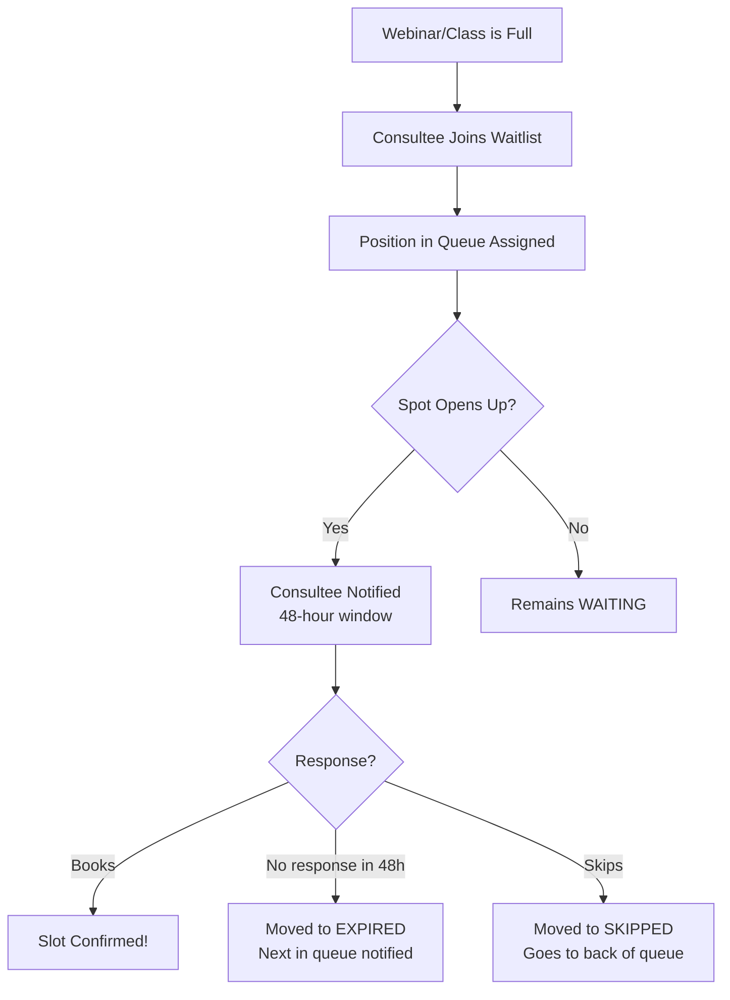

**How to test:**
1. Find a full webinar or class
2. Click "Join Waitlist"
3. Check your waitlist dashboard — you should see your position
4. If a spot opens, you should get a notification with 48 hours to respond

### Payment History & Invoices

**Where:** `/dashboard/consultee/[id]/payments`

**How to test:**
1. After making a payment, go to Payments
2. You should see all transactions with: amount, date, status, gateway
3. Download an invoice (PDF format with GST details if applicable)

### Referral Credits

**Where:** `/dashboard/consultee/[id]/referrals`

**How to test:**
1. Use someone's referral code during signup (via `/r/[code]`)
2. Both you and the referrer should receive credits
3. Check your available credit balance
4. Try using credits as a discount during checkout

### Resources & Materials

**Where:** `/dashboard/consultee/[id]/resources`

**How to test:**
1. Book a session with a consultant who has uploaded materials
2. After booking, check Resources
3. You should see downloadable files (PDFs, documents, etc.)
4. Try downloading a resource

---

## 3.4 Video & Chat (Stream.io)

### How Video Calls Work

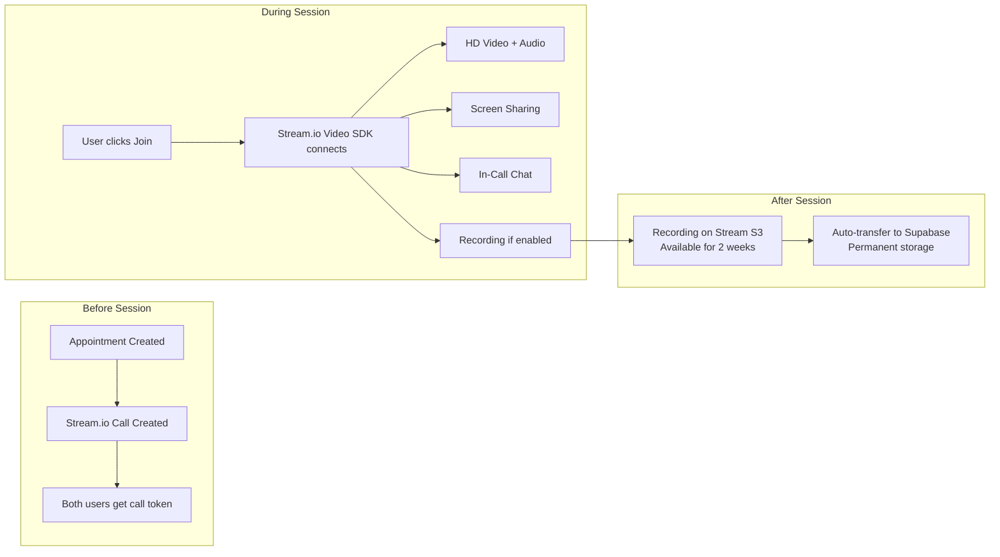

### Video Call Features

| Feature | Description | How to Test |
|---------|-------------|------------|
| **HD Video** | Multi-participant video calling | Join a session, check video quality |
| **Audio** | Full-duplex audio | Speak during a call, check for echo/delay |
| **Screen Sharing** | Share your screen or a specific window | Click screen share icon during a call |
| **Recording** | Auto-records session (if enabled on the plan) | Start a session with recording enabled, check recordings page after |
| **In-Call Chat** | Text chat during video sessions | Send messages while in a call |
| **Participant Controls** | Mute/unmute, camera on/off | Toggle your mic and camera during a call |

### Chat Messaging

**What:** Persistent text messaging between consultants and consultees, powered by Stream.io Chat.

**Where:** `/dashboard/consultant/[id]/chats` or `/dashboard/consultee/[id]/messages`

**Features:**
- 1:1 direct messaging
- Group channels for webinars/classes
- File sharing (images, documents)
- Message history (searchable)
- Typing indicators
- Read receipts
- Real-time sync

**How to test:**
1. As a consultee, book a session with a consultant
2. Go to Messages/Chats
3. Find the conversation channel
4. Send a text message — it should appear instantly on both sides
5. Send a file attachment
6. Search for a past message

---

## 3.5 Payment System

### Checkout Flow

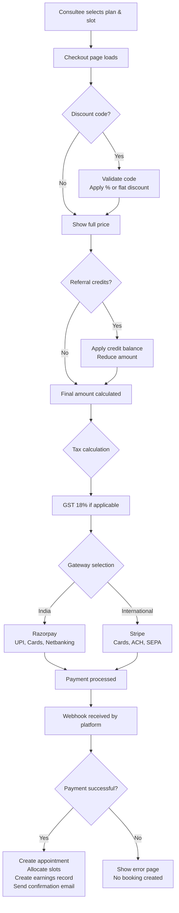

### Payment Gateways

| Gateway | Region | Payment Methods | When Used |
|---------|--------|----------------|-----------|
| **Razorpay** | India | UPI, debit/credit cards, netbanking, wallets | Indian consultees paying in INR |
| **Stripe** | International | Credit/debit cards, ACH, SEPA | Non-Indian consultees |

### Payment States

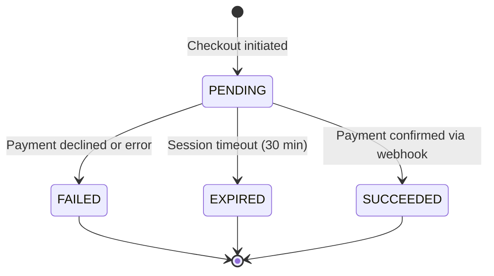

### Refund Process

**What:** When a session is cancelled or disputed, consultees can receive refunds.

**Where:** Staff/Admin dashboard → Refunds

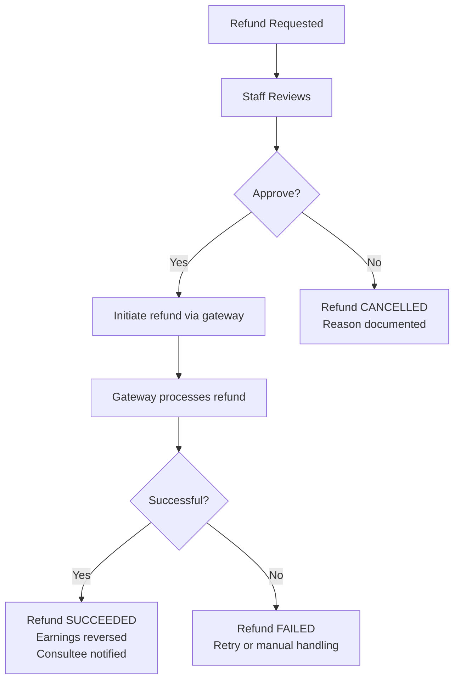

**How to test:**
1. Create a paid booking
2. From staff dashboard → Refunds → initiate a refund
3. Check that:
   - Refund status updates (PENDING → SUCCEEDED)
   - Consultee's payment record shows the refund
   - Consultant's earnings are adjusted (REFUNDED status)

### Dispute Handling

**What:** When a payment is disputed (chargeback), the platform must respond with evidence.

**Where:** Staff/Admin dashboard → Disputes

**Dispute states:**
- `WARNING_NEEDS_RESPONSE` → `WARNING_UNDER_REVIEW` → `WARNING_CLOSED`
- `NEEDS_RESPONSE` → `UNDER_REVIEW` → `WON` or `LOST` or `CHARGE_REFUNDED`

**How to test:**
1. From staff dashboard, view any disputes
2. Check the evidence submission flow
3. Track the dispute lifecycle through its states

### Discount Codes

**What:** Promo codes that give percentage or fixed amount discounts.

**Where:** Created by admin; applied at checkout

**Types:**
- `PERCENTAGE` — e.g., 20% off
- `FIXED_AMOUNT` — e.g., ₹200 off

**How to test:**
1. Create a discount code (via admin/API)
2. At checkout, enter the code
3. Verify the price reduction
4. Check that usage count increments
5. Check that expired codes are rejected

---

## 3.6 Payout System

### Earnings Lifecycle

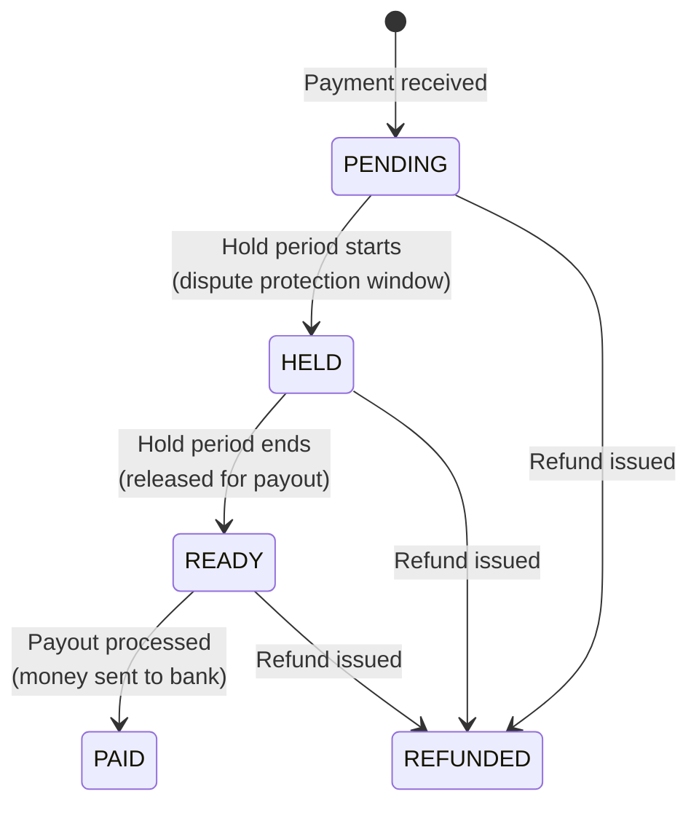

**Earnings breakdown for a ₹1,000 session:**
| Line Item | Amount |
|-----------|--------|
| Consultee pays | ₹1,000 |
| Platform commission (10-20%) | ₹100-200 |
| Consultant gross earnings | ₹800-900 |
| TDS deduction (10% with PAN, 20% without) | ₹80-180 |
| Net payout to consultant | ₹720-820 |

### Payout Process

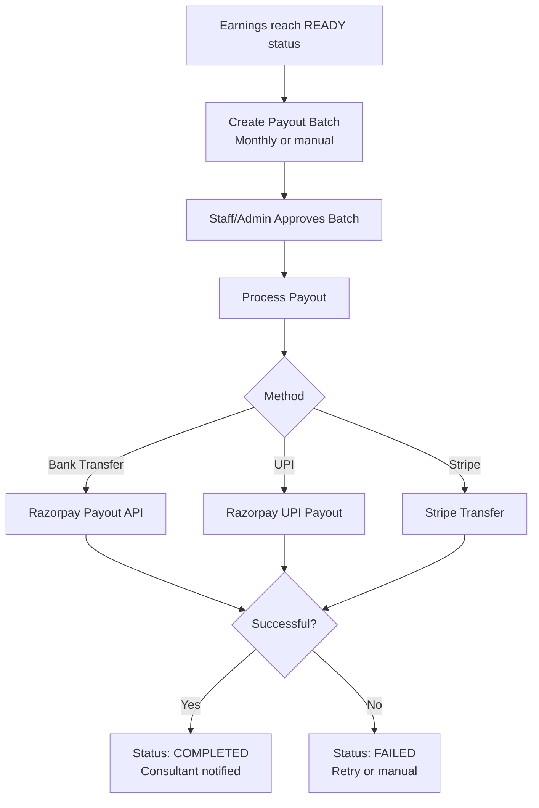

**How to test:**
1. Complete a paid session as a consultant
2. Wait for earnings to appear (PENDING)
3. From staff dashboard → Payouts:
   - Create a payout batch
   - Approve the batch
   - Process the payout
4. Check payout status transitions

---

## 3.7 Staff Dashboard

The staff dashboard is the operations control center. Here's everything staff can do:

### Payment Management
**Where:** `/dashboard/staff/[id]/payments`
- View all payments across the platform
- Filter by status (PENDING, SUCCEEDED, FAILED, EXPIRED)
- Filter by gateway (Razorpay, Stripe)
- View payment details and associated bookings

### Refund Management
**Where:** `/dashboard/staff/[id]/refunds`
- Process refund requests
- Track refund status
- View refund history

### Dispute Resolution
**Where:** `/dashboard/staff/[id]/disputes`
- Monitor active disputes
- Submit evidence to payment gateways
- Track dispute outcomes (WON/LOST)
- Manage deadline alerts (45-day window)

### Payout Management
**Where:** `/dashboard/staff/[id]/payouts`
- View pending payouts
- Create payout batches
- Approve payouts
- Process payouts to consultant bank accounts
- Track payout status

### Moderation

**Where:** `/dashboard/staff/[id]/moderation`

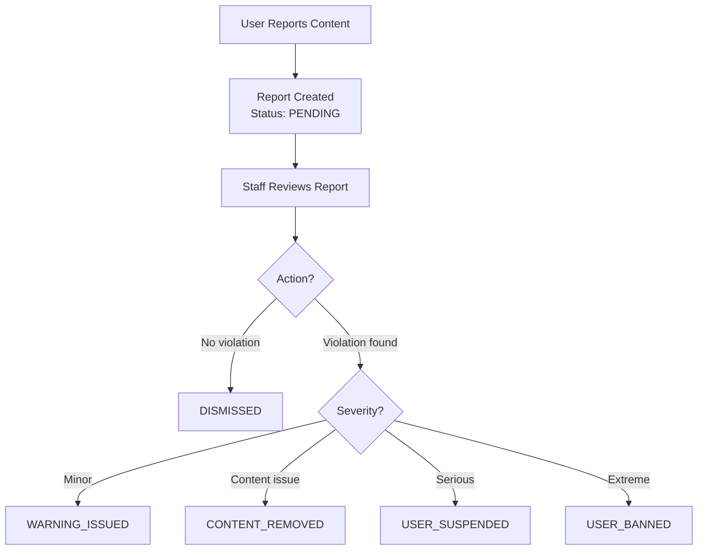

**Sub-features:**
- **Profile Verification:** Review consultant profiles for legitimacy. Approve/reject with notes.
- **Report Management:** Handle user reports (review, profile, message, document issues).
- **Review Moderation:** Check reviews for spam/abuse. Remove if needed.
- **Stats:** See moderation trends and action history.

### Support Tickets
**Where:** `/dashboard/staff/[id]/tickets`
- View all support tickets
- Assign tickets to staff members
- Respond to tickets (responses visible to the user)
- Add internal notes (NOT visible to users)
- Track ticket priority (LOW, MEDIUM, HIGH, URGENT)
- Resolve/close tickets

### System Jobs (Cron/Maintenance)
**Where:** `/dashboard/staff/[id]/system-jobs`

The platform runs 25+ automated jobs. Staff can monitor them and trigger manual runs.

| Category | Jobs | What They Do |
|----------|------|-------------|
| **Appointments** | auto-complete, cleanup invalid, expire stale, send reminders, reconcile slots | Keep appointments lifecycle clean |
| **Payments** | abandoned cleanup, reconcile status, sync earnings | Ensure payment records match gateway state |
| **Refunds** | reconcile refunds, cascade to earnings | Track refund completion, reverse earnings |
| **Payouts** | create batch, process, handle stuck, reconcile status, release earnings | Automate the payout pipeline |
| **Recordings** | mark expired, transfer to Supabase, stream sync | Move recordings from temp to permanent storage |
| **Disputes** | alert deadlines, handle lost, reconcile | Track dispute windows and outcomes |
| **Other** | auth token cleanup, webhook archival, discount expiration, document reconciliation | General platform hygiene |

### Announcements & Newsletters
**Where:** `/dashboard/staff/[id]/announcements`
- Create platform-wide announcements
- Send newsletters to users
- Schedule announcements
- Track engagement

### User Management
**Where:** `/dashboard/staff/[id]/users`
- View all users by role
- Search by name/email
- View user details
- Suspend or ban users

---

## 3.8 Admin Dashboard

Admins have everything staff has, plus:

### Platform Analytics
**Where:** `/dashboard/admin/analytics`
- Revenue trends
- User growth
- Booking conversion rates
- Cancellation analytics
- Service type distribution

### Approval Payments
**Where:** `/dashboard/admin/approval-payments`
- Manual payment approvals for special cases
- Override payment flows when needed

### Maintenance Mode
**Where:** `/dashboard/admin/maintenance`
- Switch platform to DEGRADED or OFFLINE mode
- Set estimated restoration time
- Bypass secret for internal staff to still access during maintenance
- All users see a maintenance page

### Tax & TDS Management
**Where:** `/dashboard/admin` → Tax section
- View TDS records
- Manage tax configurations
- Financial year settings

---

## 3.9 Public Pages

These pages are accessible without logging in:

| Page | URL | Purpose |
|------|-----|---------|
| Landing page | `/` | Homepage with hero, features, experts, testimonials, FAQ |
| Expert directory | `/explore/experts` | Browse all consultants |
| Expert profile | `/explore/experts/[id]` | View individual consultant |
| Programs | `/explore/programs` | Browse webinars and classes |
| Webinar detail | `/explore/programs/plans/webinars/[id]` | View webinar details |
| Class detail | `/explore/programs/plans/classes/[id]` | View class details |
| Blog | `/blog` | Platform blog |
| About | `/about` | About the platform |
| Pricing | `/pricing` | Pricing information |
| Contact | `/contactus` | Contact form |
| Terms | `/terms` | Terms of service |
| Privacy | `/privacy` | Privacy policy |
| Refund policy | `/refund` | Refund policy |
| Use cases | `/use-cases/*` | Career switchers, students, mentorship |
| Referral link | `/r/[code]` | Apply referral code |

---

# Part 4: Key Workflows (Visual Guides)

## Complete Booking Lifecycle (End-to-End)

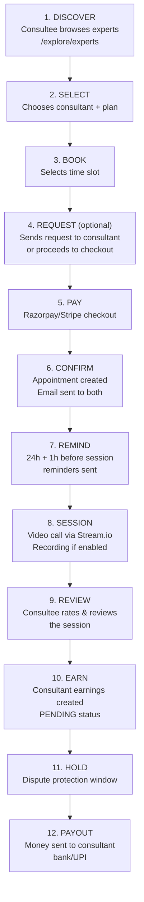

## Document Review Workflow

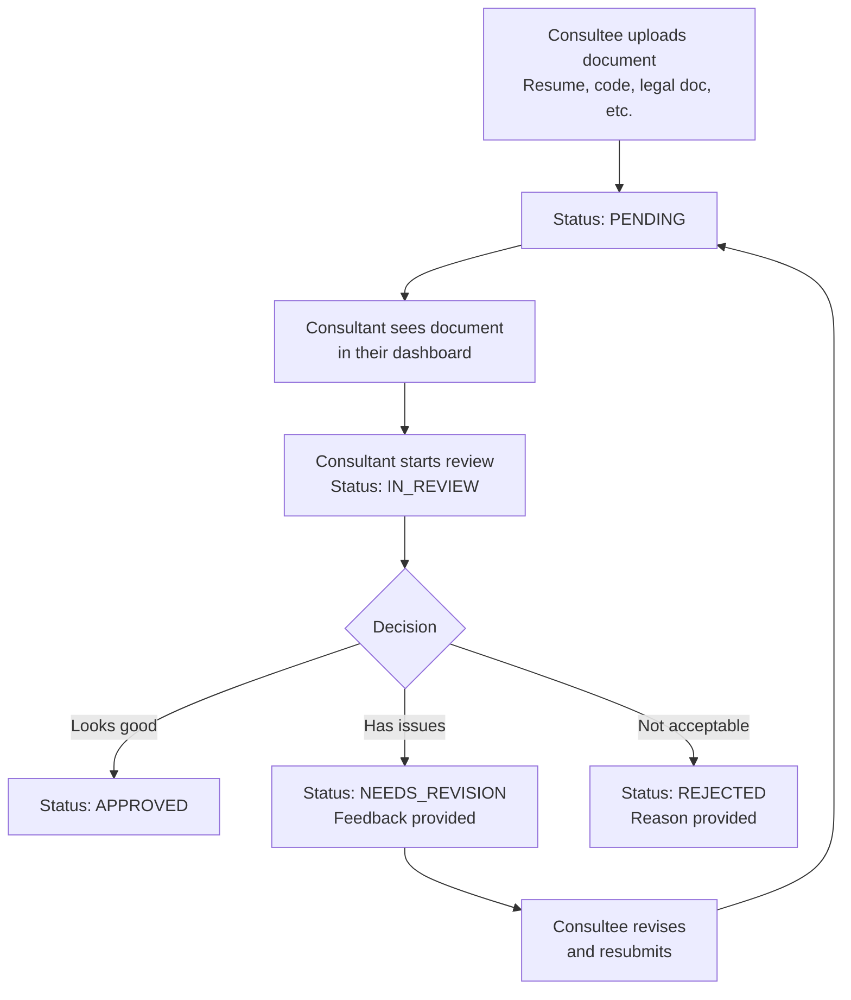

## Trial to Subscription Conversion

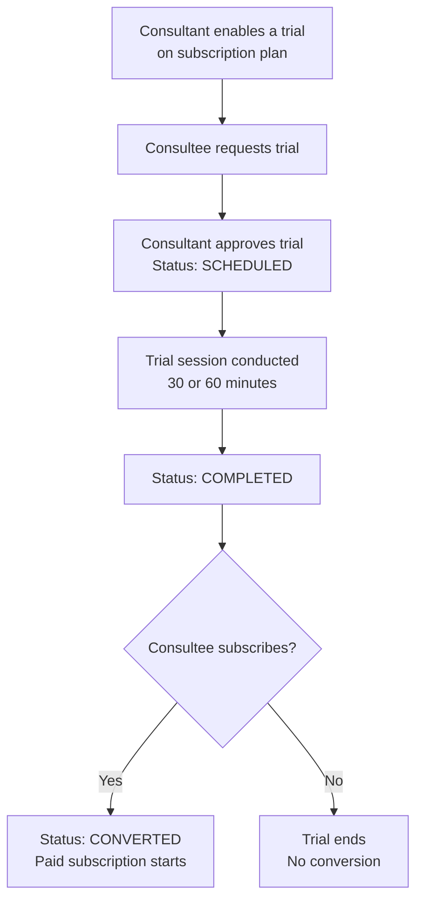

## Recording Lifecycle

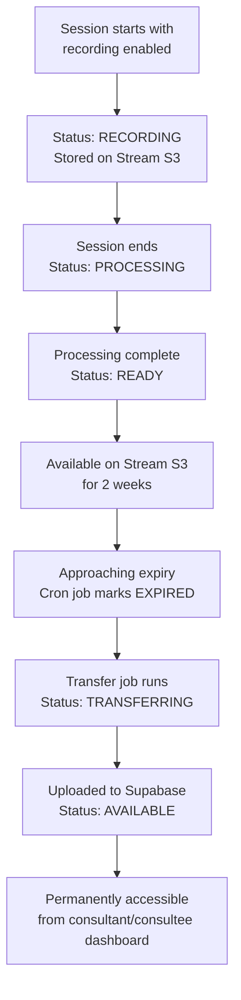

---

# Part 5: Testing Checklists

Use these checklists to systematically test every feature. Check off each item as you verify it works.

## Consultee Testing Checklist

- [ ] Sign up as consultee
- [ ] Complete consultee onboarding
- [ ] Browse expert directory (`/explore/experts`)
- [ ] Filter experts by domain/tags
- [ ] View a consultant's public profile
- [ ] See consultant's available slots
- [ ] Book a consultation (full checkout)
- [ ] Apply a discount code at checkout
- [ ] Apply referral credits at checkout
- [ ] Complete payment via Razorpay
- [ ] Receive booking confirmation email
- [ ] See appointment in dashboard
- [ ] Join a video call
- [ ] Use screen sharing in a call
- [ ] Use in-call chat
- [ ] Send a message via Chat
- [ ] Send a file in Chat
- [ ] Leave a review after session
- [ ] Upload a document for review
- [ ] Subscribe to a subscription plan
- [ ] Request a trial session
- [ ] Register for a webinar
- [ ] Enroll in a class
- [ ] Join a waitlist for a full event
- [ ] View payment history
- [ ] Download an invoice
- [ ] View referral credits balance
- [ ] Access resources/materials from a booking
- [ ] Submit a support ticket
- [ ] Change password
- [ ] Update profile settings

## Consultant Testing Checklist

- [ ] Sign up as consultant
- [ ] Complete full onboarding flow (10 steps)
- [ ] Update profile (bio, headline, social links)
- [ ] Upload profile image
- [ ] Create a consultation plan
- [ ] Create a subscription plan (with trial enabled)
- [ ] Create a webinar
- [ ] Create a class with curriculum
- [ ] Set weekly availability slots
- [ ] Set custom availability slots
- [ ] Create an overnight slot (timezone edge case)
- [ ] View your public profile at `/explore/experts/[id]`
- [ ] Receive and approve a consultation request
- [ ] Receive and reject a request (with reason)
- [ ] Conduct a video session
- [ ] Enable and check session recording
- [ ] Review a document uploaded by consultee
- [ ] Upload materials to a plan
- [ ] Invite a collaborator to a webinar
- [ ] Set revenue split with collaborator
- [ ] Accept a collaboration invitation (from another account)
- [ ] View earnings dashboard
- [ ] Set up payout account (bank/UPI)
- [ ] Enter tax information (PAN)
- [ ] View payout history
- [ ] Generate a referral code
- [ ] Customize referral code
- [ ] Approve a trial session request
- [ ] Check trial conversion tracking
- [ ] Use Chat to message a consultee
- [ ] View recordings
- [ ] View analytics

## Staff Testing Checklist

- [ ] Access staff dashboard
- [ ] View all platform payments
- [ ] Process a refund
- [ ] View dispute details
- [ ] Submit dispute evidence
- [ ] Create a payout batch
- [ ] Approve a payout
- [ ] Process a payout
- [ ] View moderation reports
- [ ] Take moderation action (warn, remove, suspend)
- [ ] Verify a consultant profile
- [ ] Reject a profile with feedback
- [ ] Moderate a review
- [ ] Handle a support ticket
- [ ] Add internal notes to a ticket
- [ ] Respond to a support ticket
- [ ] Run a system job manually
- [ ] View system job execution history
- [ ] Create an announcement
- [ ] View all users
- [ ] View subscription status

## Admin Testing Checklist

- [ ] All staff checklist items
- [ ] View platform analytics
- [ ] View revenue trends
- [ ] View cancellation analytics
- [ ] Process approval payments
- [ ] Enable maintenance mode
- [ ] Disable maintenance mode
- [ ] Verify bypass secret works during maintenance
- [ ] View TDS records
- [ ] Manage platform configuration

## Cross-Role Scenarios

- [ ] Consultee books → Consultant receives → Session happens → Review left → Earnings appear → Payout processed
- [ ] Consultee applies discount code → Price reduces correctly → Payment processes correctly
- [ ] Consultant creates webinar → Consultee registers → Webinar fills up → Another consultee joins waitlist → Spot opens → Waitlist user notified
- [ ] Consultant invites collaborator → Collaborator accepts → Session conducted → Revenue splits correctly
- [ ] Consultee requests trial → Consultant approves → Trial happens → Consultee converts to paid subscription
- [ ] Consultee uploads document → Consultant reviews → Marks as "Needs Revision" → Consultee resubmits → Consultant approves
- [ ] Consultee reports a review → Staff reviews report → Takes action → Reporter notified
- [ ] Payment fails → Error page shown → No booking created → Consultee can retry
- [ ] Refund processed → Consultant earnings reversed → Consultee receives money back
- [ ] Recording auto-transfers from Stream S3 to Supabase after 2 weeks

---

# Part 6: Key Data Models (Simplified)

## Core Entity Relationships

```mermaid
erDiagram
    USER ||--o| CONSULTANT_PROFILE : "has (if consultant)"
    USER ||--o| CONSULTEE_PROFILE : "has (if consultee)"
    USER ||--o| STAFF_PROFILE : "has (if staff)"
    USER ||--o| ADMIN_PROFILE : "has (if admin)"

    CONSULTANT_PROFILE ||--o{ CONSULTATION_PLAN : creates
    CONSULTANT_PROFILE ||--o{ SUBSCRIPTION_PLAN : creates
    CONSULTANT_PROFILE ||--o{ WEBINAR_PLAN : creates
    CONSULTANT_PROFILE ||--o{ CLASS_PLAN : creates

    CONSULTATION_PLAN ||--o{ CONSULTATION_BOOKING : "booked as"
    SUBSCRIPTION_PLAN ||--o{ SUBSCRIPTION_BOOKING : "booked as"
    WEBINAR_PLAN ||--o{ WEBINAR_BOOKING : "booked as"
    CLASS_PLAN ||--o{ CLASS_BOOKING : "booked as"

    CONSULTATION_BOOKING ||--|| APPOINTMENT : creates
    SUBSCRIPTION_BOOKING ||--|| APPOINTMENT : creates
    WEBINAR_BOOKING ||--|| APPOINTMENT : creates
    CLASS_BOOKING ||--|| APPOINTMENT : creates

    APPOINTMENT ||--o{ SLOT_OF_APPOINTMENT : "has time slots"
    APPOINTMENT ||--o| MEETING_SESSION : "has video session"
    APPOINTMENT ||--o{ APPOINTMENT_DOCUMENT : "has documents"
    MEETING_SESSION ||--o{ RECORDING : "produces recordings"

    PAYMENT ||--|| APPOINTMENT : "pays for"
    PAYMENT ||--o| REFUND : "may have"
    PAYMENT ||--o| DISPUTE : "may have"

    CONSULTANT_PROFILE ||--o{ CONSULTANT_EARNINGS : earns
    CONSULTANT_EARNINGS ||--o| PAYOUT : "paid via"

    WEBINAR_PLAN ||--o{ WEBINAR_COLLABORATOR : "has collaborators"
    CLASS_PLAN ||--o{ CLASS_COLLABORATOR : "has collaborators"

    USER ||--o| REFERRAL_CODE : "has referral code"
    REFERRAL_CODE ||--o{ REFERRAL : "tracks referrals"
    USER ||--o{ REFERRAL_CREDIT : "has credits"
```

## Key Status Enums Reference

| Entity | Statuses | Meaning |
|--------|----------|---------|
| **Payment** | PENDING → SUCCEEDED / FAILED / EXPIRED | Payment processing lifecycle |
| **Refund** | PENDING → SUCCEEDED / FAILED / CANCELLED | Refund processing |
| **Dispute** | NEEDS_RESPONSE → UNDER_REVIEW → WON / LOST / CHARGE_REFUNDED | Chargeback lifecycle |
| **Earnings** | PENDING → HELD → READY → PAID / REFUNDED | Consultant money lifecycle |
| **Payout** | PENDING → APPROVED → PROCESSING → COMPLETED / FAILED | Money transfer to bank |
| **Request** | PENDING → APPROVED → SCHEDULED → COMPLETED / REJECTED / CANCELLED / EXPIRED | Booking request lifecycle |
| **Trial** | PENDING → SCHEDULED → COMPLETED → CONVERTED / CANCELLED / REJECTED | Trial lifecycle |
| **Waitlist** | WAITING → NOTIFIED → BOOKED / EXPIRED / CANCELLED / SKIPPED | Queue management |
| **Document Review** | PENDING → IN_REVIEW → APPROVED / REJECTED / NEEDS_REVISION | Document review workflow |
| **Recording** | RECORDING → PROCESSING → READY → TRANSFERRING → AVAILABLE / FAILED / EXPIRED | Recording storage lifecycle |
| **Profile Verification** | PENDING → APPROVED / REJECTED / NEEDS_INFO | Consultant verification |
| **Moderation Report** | PENDING → UNDER_REVIEW → DISMISSED / ACTION_TAKEN / ESCALATED | Content moderation |
| **Support Ticket** | OPEN → IN_PROGRESS → RESOLVED / CLOSED | Support workflow |
| **Collaborator** | PENDING → ACCEPTED / DECLINED / REMOVED | Collaboration invitation |

---

# Part 7: Glossary

| Term | Meaning |
|------|---------|
| **GMV** | Gross Merchandise Value — total value of all transactions on the platform |
| **MAC** | Monthly Active Consultants — consultants who complete at least 1 session per month |
| **MRR** | Monthly Recurring Revenue — revenue from subscriptions that recur each month |
| **Commission** | Platform fee (10-20% of each transaction) |
| **TDS** | Tax Deducted at Source — Indian tax law requiring 10% deduction on consultant payouts (Section 194J) |
| **PAN** | Permanent Account Number — Indian tax ID required for TDS compliance |
| **GST** | Goods and Services Tax — 18% tax on services in India |
| **UPI** | Unified Payments Interface — instant payment system in India (0% gateway fee!) |
| **Stream.io** | Third-party service providing video calling and chat functionality |
| **Razorpay** | Indian payment gateway (UPI, cards, netbanking) |
| **Stripe** | International payment gateway (cards, ACH, SEPA) |
| **Supabase** | Open-source Firebase alternative providing database (PostgreSQL) and file storage |
| **BetterAuth** | Authentication library used for login/signup |
| **Novu** | Notification infrastructure for in-app notifications |
| **Resend** | Email delivery service for transactional emails |
| **Upstash Redis** | Serverless Redis used for caching and rate limiting |
| **Webhook** | HTTP callback — payment gateways send these to confirm payment status |
| **Cron Job** | Scheduled task that runs periodically (e.g., every hour) to maintain platform health |
| **Idempotency Key** | Unique identifier ensuring an operation only executes once (prevents double payments/payouts) |
| **Cold Storage** | Long-term storage (Supabase) vs temporary storage (Stream S3 for 2 weeks) |
| **RBAC** | Role-Based Access Control — different features visible based on user role |
| **UTC** | Coordinated Universal Time — all time slots stored in UTC, converted to local time for display |
| **Hold Period** | Time between payment and payout eligibility (dispute protection window) |
| **Consultee** | A user who books sessions (the buyer/client) |
| **Consultant** | A user who provides sessions (the expert/seller) |
| **Plan** | A service offering created by a consultant (has pricing, description, etc.) |
| **Slot** | A time window when a consultant is available for booking |
| **Appointment** | A confirmed booking between consultant and consultee |
| **Payout Batch** | A group of payouts processed together (usually monthly) |

---

## What's Next?

After reading this playbook:

1. **Set up your local dev environment** (Part 2)
2. **Create test accounts** for all 4 roles
3. **Walk through the testing checklists** (Part 5) — this is the best way to learn
4. **Ask questions!** No question is too basic. Better to ask than to assume.

Welcome to the team!
