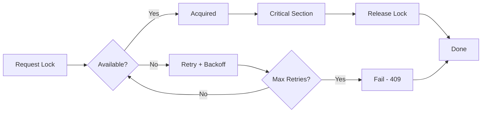

# Upstash Redis Distributed Locking

> **Serverless-native distributed locking system** for preventing race conditions in approval workflows, subscription payments, and appointment booking

---

## Overview

This is a **production-ready distributed locking implementation** built on Upstash Redis that provides race condition protection for serverless applications.

### What is it?

A lightweight, REST API-based locking system that prevents concurrent operations from creating duplicate payments, double-booking appointments, or processing the same approval request multiple times.

### When to use it?

- **Payment Approval Workflows**: Ensure only one approval creates a payment link
- **Subscription Processing**: Prevent duplicate subscription charges
- **Appointment Booking**: Avoid double-booking time slots
- **Circuit Breaking**: Protect against Redis failures with graceful degradation

> **Note**: API rate limiting is handled by **Arcjet** at the route level, not by this module.

### Why Upstash?

- ✅ **Serverless-Native**: REST API works everywhere (Vercel Edge, Lambda, etc.)
- ✅ **Zero Infrastructure**: Fully managed Redis, no servers to maintain
- ✅ **Simple Integration**: Single package, drop-in replacement for Redlock
- ✅ **Cost-Effective**: Pay-per-request pricing, ~90% cheaper than self-hosted
- ✅ **Observable**: Structured JSON logging for every lock operation

---

## Quick Start

### Prerequisites

1. **Upstash Account**: Sign up at [upstash.com](https://upstash.com) (free tier available)
2. **Redis Instance**: Create a new Redis database in Upstash console
3. **Environment Variables**: Add credentials to your `.env.local` file

### Environment Setup

```bash
# .env.local
UPSTASH_REDIS_REST_URL="https://[region]-[name].upstash.io"
UPSTASH_REDIS_REST_TOKEN="AXmxASQgY..."
```

> **Where to find these?** Go to your Upstash Redis dashboard → REST API tab → Copy URL and Token

### 5-Minute Tutorial

#### Example 1: Approval Lock (Basic Pattern)

Prevent concurrent approvals from creating duplicate payment links:

```typescript
import {
  lockConsultationApproval,
  unlockApproval,
} from "@/utils/appointmentlock";

export async function approveConsultation(consultationId: string) {
  let lock;

  try {
    // Acquire lock with 30-second TTL
    lock = await lockConsultationApproval(consultationId, 30000);

    // ✅ Protected critical section
    // Only ONE approval can execute this code
    const paymentLink = await generatePaymentLink(consultationId);
    await sendPaymentLinkEmail(paymentLink);
    await updateConsultationStatus(consultationId, "APPROVED");

    return { success: true, paymentLink };
  } catch (error) {
    // Lock acquisition failed - another approval is in progress
    return {
      error: "Another approval is in progress. Please try again.",
      status: 409,
    };
  } finally {
    // ✅ Always release lock (never throws)
    if (lock) {
      await unlockApproval(lock);
    }
  }
}
```

**Expected Output (Logs)**:

```json
{"event":"lock_acquired","key":"consultation-approval:clx123","attempts":1,"duration_ms":78,"ttl":29700,"timestamp":"2025-11-29T12:34:56.789Z"}
{"event":"lock_released","key":"consultation-approval:clx123","held_duration_ms":5058,"timestamp":"2025-11-29T12:35:01.847Z"}
```

#### Example 2: Circuit Breaker

Protect your application when Redis is unavailable:

```typescript
import { withCircuitBreaker, checkRedisHealth } from "@/lib/redis";

// Health check endpoint
export async function GET() {
  const redisHealthy = await checkRedisHealth();
  return Response.json({
    redis: redisHealthy ? "healthy" : "unhealthy",
  });
}

// Using circuit breaker for Redis operations
export async function performRedisOperation() {
  return withCircuitBreaker(
    async () => {
      // Your Redis operation here
      return await redis.get("some-key");
    },
    () => null, // Fallback value if circuit is open
  );
}
```

> **Note**: For API rate limiting, use **Arcjet** instead. See the Arcjet documentation for setup.

#### Example 3: Lock Extension for Long Operations

For operations that may exceed the initial TTL, use lock extension:

```typescript
import {
  lockSlotBooking,
  unlockSlotBooking,
  extendLock,
} from "@/utils/appointmentlock";

export async function processLongOperation(
  consultantId: string,
  slotTime: string,
) {
  const lock = await lockSlotBooking(consultantId, slotTime, 60000); // 60s TTL

  // Set up heartbeat to extend lock every 20 seconds
  const heartbeat = setInterval(async () => {
    const extended = await extendLock(lock, 30000); // Extend by 30s
    if (!extended) {
      console.warn("Lock extension failed - lost ownership");
      clearInterval(heartbeat);
    }
  }, 20000);

  try {
    // Long-running operation (may take > 60s)
    await performComplexDatabaseOperation();
    await callExternalPaymentAPI();
    await sendNotifications();
  } finally {
    clearInterval(heartbeat);
    await unlockSlotBooking(lock);
  }
}
```

---

## Key Concepts

### Lock Types

| Lock Type                  | Default TTL                                                        | Use Case                             |
| -------------------------- | ------------------------------------------------------------------ | ------------------------------------ |
| **Slot Booking**           | 60 seconds                                                         | Prevent double-booking consultations |
| **Consultation Approval**  | 60 seconds                                                         | Payment link generation              |
| **Subscription Approval**  | 60 seconds                                                         | Subscription processing              |
| **Event Checkout**         | Per-type via `CHECKOUT_LOCK_TTL_MS` (#832): CONSULTATION 60s / SUBSCRIPTION 120s / WEBINAR 120s / CLASS 300s | Webinar/class/subscription checkout  |
| **Event Slot (Semaphore)** | 5 minutes                                                          | Multi-participant events             |
| **Auto-Allocate**          | 150 seconds (consultant-level, not narrowed — #860 tracks per-slot narrowing) | Auto-allocation serialization per consultant |
| **Payout Batch Creation**  | 2 minutes (`lock:payout_batch_creation`)                           | Cron — create payout batches         |
| **Payout Processing**      | 5 minutes (`lock:payout_processing`)                               | Cron — process approved payouts      |
| **Org Payout Batch**       | 60 seconds (`org:{orgId}:payout-batch`)                            | Per-org payout batch creation        |

### Core Features

1. **SET NX PX**: Atomic Redis operation (set-if-not-exists with TTL)
2. **UUID Ownership**: Each lock has unique ID for safe release verification
3. **Atomic Release**: Lua script ensures only owner can release (prevents race conditions)
4. **Exponential Backoff**: Smart retry strategy (10 attempts, 200ms base delay)
5. **Lock Extension**: Heartbeat pattern for long-running operations
6. **Semaphore Pattern**: Parallel checkout for multi-participant events
7. **Structured Logging**: Every operation logged as JSON for monitoring

### Circuit Breaker Pattern

The circuit breaker protects against Redis failures:

```typescript
import { withCircuitBreaker, getCircuitBreakerStatus } from "@/lib/redis";

// Check circuit status (for health endpoints)
const status = getCircuitBreakerStatus();
// { state: "CLOSED", failures: 0, lastFailure: null }

// Wrap Redis operations with circuit breaker
const result = await withCircuitBreaker(
  async () => await redis.get("key"),
  () => null, // Fallback if circuit is open
);
```

**Circuit States:**

- **CLOSED**: Normal operation (all requests go through)
- **OPEN**: Redis failing (fail fast, return fallback)
- **HALF_OPEN**: Testing recovery (limited requests)

#### ⚠️ Circuit Breaker Limitation: In-Memory State

The circuit breaker state is stored **in-memory per instance**. In a multi-instance deployment (e.g., multiple Vercel serverless functions), each instance maintains its own circuit state.

**Implications:**

- Instance A may have circuit OPEN while Instance B has circuit CLOSED
- Failures in one instance don't immediately affect others
- This is acceptable for most use cases (localized failure detection)

**For distributed circuit breaker state** (if needed in the future):

```typescript
// Option 1: Store state in Redis itself (with short TTL)
// Option 2: Use a distributed service like Redis Sentinel
// Option 3: Use Upstash's built-in rate limiting with circuit breaker
```

See [Future Improvements](#future-improvements) for more details.

### Lock Lifecycle



---

## Architecture at a Glance

```
┌─────────────────────────────────────────────────────┐
│  Application Layer                                  │
│  ├─ lockConsultationApproval(consultationId)       │
│  ├─ lockSubscriptionApproval(subscriptionId)       │
│  ├─ lockSlotBooking(consultantId, slotTime)        │
│  ├─ lockEventCheckout(appointmentType, eventId)    │
│  └─ acquireEventSlot(type, id, maxParticipants)    │
└──────────────────────┬──────────────────────────────┘
                       ↓
┌─────────────────────────────────────────────────────┐
│  Core Lock Engine                                   │
│  (utils/appointmentlock.ts)                         │
│  ├─ acquireLockWithRetry() - Exponential backoff   │
│  ├─ releaseLock() - Safe ownership verification    │
│  └─ Structured JSON logging                        │
└──────────────────────┬──────────────────────────────┘
                       ↓
┌─────────────────────────────────────────────────────┐
│  Upstash Client                                     │
│  (lib/redis.ts)                                     │
│  ├─ Redis.set(key, value, {nx: true, px: ttl})    │
│  ├─ Redis.get(key) - Ownership check               │
│  └─ Redis.del(key) - Lock release                  │
└──────────────────────┬──────────────────────────────┘
                       ↓
┌─────────────────────────────────────────────────────┐
│  Upstash Cloud (Managed Redis)                      │
│  └─ Global REST API (99.99% SLA)                   │
└─────────────────────────────────────────────────────┘
```

### File Structure

```
utils/
└── appointmentlock.ts          # Core lock implementation
    ├── lockConsultationApproval()     # Consultation approval locks
    ├── lockSubscriptionApproval()     # Subscription approval locks
    ├── lockSlotBooking()              # Time slot booking locks
    ├── lockEventCheckout()            # Event checkout locks (per-type TTL via CHECKOUT_LOCK_TTL_MS #832)
    ├── lockAutoAllocate()             # Auto-allocate consultant-level lock (NOT narrowed — #860 tracks that)
    ├── unlockAutoAllocate()           # Release auto-allocate lock
    ├── acquireEventSlot()             # Semaphore for multi-participant events
    ├── releaseEventSlot()             # Release semaphore slot
    ├── confirmEventSlot()             # Confirm slot after payment
    ├── getEventSlotCount()            # Get current reservation count
    ├── extendLock()                   # Extend lock TTL (heartbeat pattern)
    └── Legacy: lockAppointment(), isAppointmentLocked()

lib/
├── redis.ts                    # Upstash client setup
│   ├── withCircuitBreaker()           # Circuit breaker pattern
│   ├── checkRedisHealth()             # Health check
│   ├── getCircuitBreakerStatus()      # Status for monitoring
│   ├── acquireLock() / releaseLock()  # Simple lock utilities
│   └── Environment validation
├── cron/with-cron-lock.ts      # Distributed mutual exclusion for cron jobs (#476)
│   └── withCronLock()                 # Wraps cron job with Redis lock; fail-open or fail-closed
└── payments/payouts/payout-service.ts
    ├── lock:payout_batch_creation     # 2-minute lock for batch creation cron
    ├── lock:payout_processing         # 5-minute lock for payout processing cron
    └── org-payout-service.ts
        └── org:{orgId}:payout-batch       # 60s per-org payout batch creation lock
```

---

## Documentation Navigation

### For New Users

**Start here** → Read this README → Jump to [API Reference](./02_API_REFERENCE.md) → Try examples

**Learning path**:

1. Read Quick Start (above)
2. Review [Common Use Cases](#common-use-cases) (below)
3. Study [API Reference](./02_API_REFERENCE.md) for detailed documentation
4. Check [Best Practices](./02_API_REFERENCE.md#best-practices) before production

### For Migration from Redlock

**Start here** → Read [Migration Guide](./01_MIGRATION_GUIDE.md)

**Migration path**:

1. Understand [Breaking Changes](./01_MIGRATION_GUIDE.md#breaking-changes)
2. Follow [Migration Checklist](./01_MIGRATION_GUIDE.md#migration-checklist)
3. Review [Architecture Comparison](./01_MIGRATION_GUIDE.md#architecture-deep-dive)
4. Deploy and [Monitor](./01_MIGRATION_GUIDE.md#monitoring--observability)

### For Troubleshooting

**Having issues?** → Check [Troubleshooting Guide](./01_MIGRATION_GUIDE.md#troubleshooting)

**Common problems**:

- Lock acquisition always fails → [Solution](./01_MIGRATION_GUIDE.md#lock-acquisition-always-fails)
- High retry rate → [Solution](./01_MIGRATION_GUIDE.md#high-retry-rate)
- Locks not released → [Solution](./01_MIGRATION_GUIDE.md#locks-not-released)

---

## Common Use Cases

### Use Case 1: Approval Workflow

**Problem**: Concurrent API requests create duplicate payment links

**Solution**: Lock the consultation before approval

```typescript
import { lockConsultationApproval, unlockApproval } from "@/utils/appointmentlock";

let lock;
try {
  lock = await lockConsultationApproval(consultationId, 30000);
  // Only one approval executes here
  await createApprovalPaymentIntent(...);
  await sendPaymentLinkEmail(...);
} catch (error) {
  return NextResponse.json(
    { error: "Another approval in progress" },
    { status: 409 }
  );
} finally {
  if (lock) await unlockApproval(lock);
}
```

**Result**: ✅ Exactly one payment link created, even with 100 concurrent requests

### Use Case 2: Appointment Booking (Legacy)

**Problem**: Multiple users booking the same time slot simultaneously

**Solution**: Lock the appointment before allocation

```typescript
import { lockAppointment, unlockAppointment } from "@/utils/appointmentlock";

let lock;
try {
  lock = await lockAppointment(appointmentId, 300000); // 5 minutes
  // Complex time slot allocation logic
  await allocateTimeSlot(...);
} finally {
  if (lock) await unlockAppointment(lock);
}
```

**Result**: ✅ No double-booking, even with race conditions

---

## Quick Links

### Documentation

- **[Migration Guide](./01_MIGRATION_GUIDE.md)**: Comprehensive guide for migrating from Redlock
- **[API Reference](./02_API_REFERENCE.md)**: Complete API documentation with examples
- **[Legacy Docs](../../payments/approval-payments/04-distributed-locking.md)**: Historical Redlock documentation (archived)

### External Resources

- **[Upstash Redis Docs](https://upstash.com/docs/redis)**: Official Upstash Redis documentation
- **[Upstash Rate Limiting](https://upstash.com/docs/redis/sdks/ratelimit-ts/overview)**: Rate limiting SDK guide
- **[Redis SET Command](https://redis.io/commands/set/)**: Understanding SET NX PX
- **[Vercel Environment Variables](https://vercel.com/docs/environment-variables)**: Setting up env vars

### Support & Troubleshooting

- **Issues**: Check [Troubleshooting Guide](./01_MIGRATION_GUIDE.md#troubleshooting) first
- **Performance**: See [Performance Comparison](./01_MIGRATION_GUIDE.md#performance-comparison)
- **Monitoring**: Review [Observability Guide](./01_MIGRATION_GUIDE.md#monitoring--observability)

---

## Next Steps

1. **Set up environment**: Add Upstash credentials to `.env.local`
2. **Try an example**: Copy-paste code from [Quick Start](#quick-start)
3. **Read API docs**: Review [API Reference](./02_API_REFERENCE.md) for your use case
4. **Deploy**: Follow [Best Practices](./02_API_REFERENCE.md#best-practices)

---

**Questions?** Check the [API Reference](./02_API_REFERENCE.md) or [Migration Guide](./01_MIGRATION_GUIDE.md) for detailed information.
